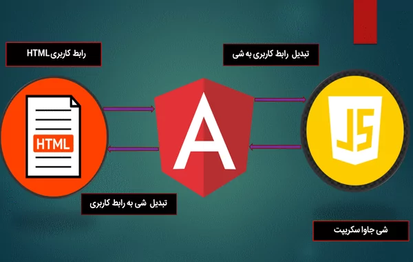

# مقدمه 

## چرا به فریمورک نیاز است؟
فریمورک یا چارچوب توسعه نرم افزار نوعی ابزار ضروری برای برنامه‌نویسان وب محسوب می‌شود، زیرا می‌تواند به آن‌ها کمک کند تا برنامه‌ها و وب‌سایت‌ها را سریع‌تر، کارآمدتر و با عملکرد بهتر توسعه دهند. فریمورک به ساختاری استاندارد مجهز است و توسعه‌دهندگان دیگر مجبور نیستند هر پروژه را از ابتدا کد نویسی کنند و با این کار در زمان و هزینه خود صرفه‌جویی خواهند کرد. علاوه بر این، فریمورک‌ها انواع ویژگی‌های اضافی را در اختیار توسعه‌دهندگان قرار می‌دهند که می‌توانند با کمترین تلاش آن‌ها را به هر پروژه اضافه کنند.
## آنگولار چيست
آنگولار نوعی فریمورک قدرتمند و منبع آزاد جاوا اسکریپت است که توسط شرکت گوگل طراحی و با «تایپ اسکریپت» (TypeScript) نوشته شده است. آنگولار در درجه اول برای توسعه [spa](SPA/README.md) استفاده می‌شود و ساختاری عالی برای توسعه‌دهندگان فراهم می‌کند تا با آن کار کنند. Angular به کاربران این امکان را می‌دهد تا برنامه‌های پیچیده و بزرگی را ایجاد کنند که مدیریت و نگهداری آن‌ها آسان باشد.

همچنین Angular نوعی پلتفرم [«مدل- نما - کنترلر» (MVC)](MVC/README.md) پیشرفته به‌حساب می‌آید که برای ساخت «اپلیکیشن‌‎های وب تک‌صفحه‌ای» (SPA) در سطح سازمانی طراحی شده است. آنگولار مبتنی بر مجموعه‌ای از کتابخانه‌های تایپ اسکریپت است که می‌توانند در توسعه هر اپلیکیشنی کمک کننده باشند. علاوه بر این، آنگولار توسعه‌دهندگان را ملزم می‌کند در هنگام ساخت برنامه‌های خود به سبک و قوانین خاصی پایبند باشند. در نتیجه، یادگیری این فریمورک و اجزای جداگانه آن برای بهروه‌وری حداکثری از آن ضروری به نظر می‌رسد.

## تاریخچه
در زير به تاريخچه Angular مي پردازيم

- **نسخه Angular 2.0**: این نسخه در کنفرانس ng-Europe در 22-23 اکتبر 2014 معرفی شد. تغییرات عمده در نسخه 2.0 باعث ایجاد بحث‌های زیادی در بین توسعه‌دهندگان شد.
- **نسخه Developer Preview**: در 30 آوریل 2015، توسعه‌دهندگان Angular اعلام کردند که Angular 2 از مرحله Alpha به Developer Preview رفته است.
- **نسخه Beta و Release Candidate**: Angular 2 در دسامبر 2015 به مرحله Beta رفت و اولین نسخه Release Candidate در می 2016 منتشر شد.
- **نسخه نهایی**: نسخه نهایی Angular 2 در 14 سپتامبر 2016 منتشر شد.
- **نسخه Angular 4**: در 13 دسامبر 2016، Angular 4 معرفی شد. این نسخه برای جلوگیری از سردرگمی ناشی از ناهماهنگی نسخه روتر که قبلاً به عنوان v3.3.0 توزیع شده بود، از نسخه 3 پرش کرد. نسخه نهایی Angular 4 در 23 مارس 2017 منتشر شد.
- **نسخه Angular 6**: این نسخه در 4 می 2018 منتشر شد. این یک نسخه عمده است که تمرکز کمتری بر روی چارچوب زیرین دارد و بیشتر بر روی ابزارها و راه‌های ساده‌تر برای حرکت سریع با Angular در آینده متمرکز است .
در كل هر نسخه از Angular نسبت به نسخه قبلی خود بهتر و کارآمدتر شده است همچنین نسخه‌های جدید آنگولار برای رسیدگی به نیازهای سیستم عامل‌های مُدرن بهینه‌تر هستند. برای مثال، کاربرانی که به فکر توسعه برنامه‌های موبایل هستند بهتر است از آخرین نسخه آنگولار بهره ببرند تا نیازهای آن‌ها را به بهترین شکل ممکن پوشش دهد.
## تفاوت Angular و AngularJs:
- **تعريف AngularJS**: در واقع AngularJS یک چارچوب جاوااسکریپت متن‌باز برای سمت کاربر است که عمدتاً برای توسعه برنامه‌های وب تک صفحه‌ای (SPAs) استفاده می‌شود. این چارچوب پیوسته در حال رشد و گسترش است و راه‌های بهتری برای توسعه برنامه‌های وب ارائه می‌دهد.
- **تعريف Angular**: در واقع Angular یک چارچوب محبوب متن‌باز TypeScript است که توسط Google برای توسعه برنامه‌های وب ایجاد شده است. Angular به‌خصوص برای برنامه‌های تک صفحه‌ای کاربرد دارد.
- **تفاوت‌های اصلی**: AngularJS از معماری Model-View-Controller پشتیبانی می‌کند، در حالی که Angular از معماری مؤلفه‌ای استفاده می‌کند. AngularJS با جاوااسکریپت کار می‌کند، در حالی که Angular با TypeScript کار می‌کند. Angular CLI، یک رابط خط فرمان برای ایجاد و مدیریت پروژه‌های Angular است.Angular از انواع مرورگر موبايل پشتيباني مي كند اما angularjs خير.همچنين Angular سريعتر است و در اخر ساخت و نگهداري برنامه هاي بزرگ با angular راحت تر است اما AngularJs زياد قابل مديريت نيست و براي برنامه هاي كوچك مناسب است

## چرا Angular؟
با پیشرفت توسعه وب، نیاز به چارچوب‌ها و کتابخانه‌های متناسب با ایجاد صفحات وب مدرن و تعاملی نیز افزایش یافته است .آنگولار یکی از این راه‌حل‌ها محسوب می‌شود که به طور خاص برای **ارائه ماژولار بودن، آزمایش‌پذیری و بهره‌وری لازم در هنگام ایجاد برنامه‌های کاربردی تک‌صفحه‌ای طراحی شده است.**

آنگولار ابزار قدرتمندی به‌حساب می‌آید و مشکلات توسعه‌دهندگانی را حل خواهد کرد که در ساخت برنامه‌های خود به صورت مطلق به جاوا اسکریپت تکیه می‌کنند. Angular با «سینتکسی» (Syntax) آسان و پشتیبانی گسترده خود به توسعه‌دهندگان اجازه می‌دهد تا برنامه‌های کاربردی پیشرفته را به راحتی بسازند و این‌ها دلیل‌های قانع‌کننده‌ای برای استفاده از آنگولار هستند.به طور كلي در زير به مزايا و معايب اين فريم ورك مي پردازيم:
### مزايا:
1. **همگام‌سازی خودکار با دو طرفه داده‌بندی**: این ویژگی Angular را نسبت به سایر چارچوب‌ها متمایز می‌کند. این دو طرفه داده‌بندی چیست؟ این داده‌ها را بین مدل و نما همگام می‌کند. در نتیجه، هنگام تغییر یا تغییر داده‌ها، این دو مؤلفه به طور خودکار به‌روز می‌شوند.
2. **بهینه‌سازی ارتباط سرور**: Angular بهینه‌سازی ارتباطات سرور را ارائه می‌دهد، که می‌تواند به کاهش بار سرور و افزایش عملکرد کلی برنامه کمک کند.
3. **مدل POJO برای حذف وابستگی‌های خارجی**: Angular از مدل‌های POJO (Plain Old JavaScript Objects) استفاده می‌کند، که این امکان را فراهم می‌کند تا کد شما تمیزتر و قابل فهم‌تر باشد.
4. **تست در Angular – یک بخش جدا نشدنی**: Angular با ارائه ابزارهایی مانند Karma و Jasmine، تست را به یک بخش جدا نشدنی از فرآیند توسعه تبدیل کرده است.
5. **Angular Material – یک رابط کاربری مدرن و جامع**: Angular Material یک کتابخانه UI است که مجموعه‌ای از کامپوننت‌های UI مدرن و قابل استفاده مجدد را ارائه می‌دهد.
6. **Angular و برنامه‌های تک صفحه‌ای**: Angular یکی از بهترین گزینه‌ها برای ساخت برنامه‌های تک صفحه‌ای است.
7. **سازگاری کد و اکوسیستم قوی**: Angular یک ساختار کد سازگار و یک اکوسیستم قوی را ارائه می‌دهد، که باعث می‌شود توسعه و نگهداری برنامه‌های بزرگ ساده‌تر باشد.

### معايب:
1. **گزینه‌های SEO محدود**: یکی از معایب اصلی استفاده از Angular، گزینه‌های SEO محدود و دسترسی ضعیف برای خزنده‌های موتور جستجو است.
2. **پیچیدگی و طولانی بودن کد**: شکایت متداولی که از توسعه‌دهندگان Angular می‌شنوید، طولانی و پیچیده بودن ابزار است.
3. **سنگین بودن**: Angular یک چارچوب سنگین است و ممکن است برای برنامه‌های کوچک یا ساده بیش از حد باشد.
4. **یادگیری سخت**: Angular دارای یک منحنی یادگیری تند است و ممکن است برای توسعه‌دهندگان تازه‌کار یا کسانی که با TypeScript آشنایی ندارند، چالش‌برانگیز باشد.

