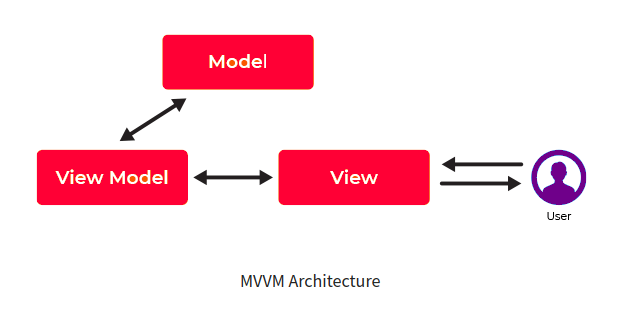
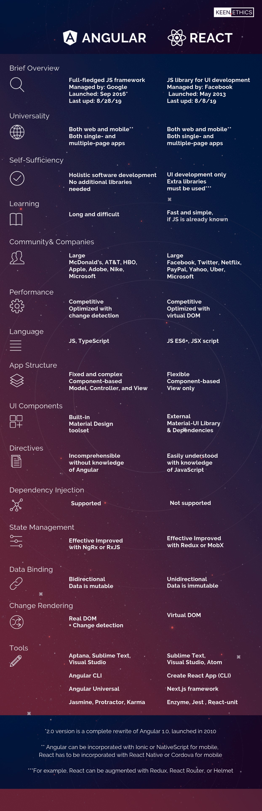

## Single Page Application (SPA)

SPA
به چه معناست؟ SPA
به آن دسته از وب‌ سایت‌ها گفته می‌شود که در آن نیازی نیست که صفحه شما دوباره load
شود و مثلا وقتی که قرار است به صفحه‌ای دیگر با url
ای جدید بروید، به جای اینکه کل صفحه با محتویات جدید را load
کنید، componentهای
مشترک در صفحه فعلی و صفحه جدید را نگه می‌دارید و صرفا چیزهای جدیدی که لازم دارید را دریافت می‌کنید و سپس آن را در همان صفحه فعلی نمایش می‌دهید.

1. وب سایت حالت نرم‌افزارهای روزمره را پیدا می‌کند و کار با آن به کاربر احساس بهتری می‌دهد.
2. چون همه چیز در تنها یک صفحه انجام می‌شود، انتقال بین صفحات را نخواهیم داشت.
3. routing و نمایش داده‌ها سمت کاربر انجام می‌شود و بار آن از روی سرور برداشته می‌شود.
4. می‌توان همه داده‌ها را به صورت JSON به سمت کاربر فرستاد که چون JSON از XML در زمینه انتقال داده بهتر هست، وب‌سایت ما سریع‌تر خواهد بود.

## MVVM

MVVM
یک نوع معماری است که به ما کمک می‌کند تا بتوانیم روند پیاده سازی رابط کاربری گرافیکی (GUI)
را به چند بخش تقسیم کنیم. MVVM
حروف اول عبارت Model-View-ViewModel هست.

توضیح مختصری راجع به بخش‌های آن می‌دهیم:

- Model:
  این بخش همانند MVC وظیفه نگه‌داری داده‌ها و اطلاعات را دارد.
- View:
  همانند MVC نقش نشان دادن اطلاعات به کاربر را دارد که شامل HTML، CSS، JQuery و ... می‌شود.
- ViewModel:
  این بخش وظیفه ایجاد ارتباط بین Model و View را دارد. دقت شود نباید View و Model به طور مستقیم با هم در ارتباط باشند.
  به طور دقیق‌تر می‌توان گفت که ViewModel شامل توابع، دستورات و دیگر چیزهایی هست که View برای کار کردن به آن‌ها نیازمند است.

در زیر تصویری از ارتباطات ۳ بخش با هم نشان داده شده است:

## مقایسه با React

اگر با React
آشنا باشید می‌دانید یک یکی دیگر از java script framework های مشهور هست. حال می‌خواهیم این دو را با هم مقایسه کنیم و برتری‌های این دو نسبت به هم را بیان کنیم. برای مطالعه عمیق‌تر توصیه می‌شود به این [لینک](http://dev.nodeca.com)
سر بزنید.

ابتدا یک تصویر که از لینک بالا برداشتیم را به شما نشان می‌دهیم. این عکس به طور خلاصه دو framework را با هم مقایسه کرده است:

حال به طور خلاصه این دو را با هم مقایسه می‌کنیم:

- Angular یک framework کامل برای برنامه‌نویسی وب و موبایل است. در مقابل React صرفا برای پیاده‌سازی UI هست. البته می‌توان با به کارگیری کتابخانه‌های دیگر این مشکل را برطرف کرد.
- یادگیری و کار با React ساده‌تر هست اما اگر قرار باشد کارهای پیچیده‌ای انجام دهید، به کتابخانه‌های دیگر نیاز خواهید داشت، در مقابل اما Angular به کتابخانه‌های بیش‌تر نیازی ندارد. به همین دلیل اگر قرار هست کار پیچیده‌ای انجام دهید عملا یادگیری و کار با هردو به یک میزان مشکل خواهد بود.
- درست است که یادگیری و کار با Angular مشکل‌تر هست اما در مقابل ابزار قدرتمندتری است و اگر کار با آن را یاد بگیرید به راحتی می‌توانید چالش‌های مختلف را حل کنید.

در نهایت اگر یک برنامه‌نویس تازه کار هستید احتمالا کار با React برای شما بهتر هست اما اگر حرفه‌ای هستید فرقی نمی‌کند که کدام را انتخاب کنید. اما بدون توجه به اینکه در حال حاضر با کدام یک کار می‌کنید، همیشه خوب هست که گزینه‌های جدید را هم امتحان کنید!

## تاریخچه‌ی انگولار

### ورژن بندی
در ابتدا توضیحی کلی از ورژن بندی انگولار میگوییم. هر ورژن از انگولار که ریلیز میشود، بصورت x.y.z معرفی میشود که توضیحات آن ها بصورت زیر میباشد:
  - حرف x نشانه تغییرات اساسی میباشد => major releases
  - حرف y نشانه تغییرات جزئی میباشد => minor releases
  - حرف z نشانه برطرف کردن باگ ها میباشد => patch releases

### نام‌گذاری
angular یک فریمورک می‌باشد که در اصل یک بازنویسی از روی فریمورک AngularJS توسط گوگل می‌باشد. در ابتدا نام این بازنویسی Angular 2 قرار داده شده بود که باعث گیج شدن developer ها میشد بنابراین تصمیم بر این شد که دو تیم مجزا به AngularJS و Angular 2 اختصاص داده شود و نام Angular 2 به Angular خالی تغییر کرد.

قابل ذکر است بعد از انگولار ورژن 2 ، اکثر نسخه ها مشابه هم هستند.

### ورژن ۲

ورژن ۲ در سال ۲۰۱۴ در کنفرانس ng-Europe معرفی شد. در آپریل سال ۲۰۱۵ این از حالت آلفا به حالت Developer Review تغییر یافت و در تاریخ دسامبر ۲۰۱۵ به حالت بتا منتقل شد. و اولین کاندید برای ریلیز شدن نهایی در می ۲۰۱۶ منتشر شد و ورژن نهایی در سپتامبر ۲۰۱۶ ریلیز منتشر شد.

### ورژن ۴

در دسامبر ۲۰۱۶ ورژن ۴ معرقی شد برای جلوگیری از به وجود آمدن ابهامات به دلیل به دلیل ناهماهنگی ورژن یکی از پگیج‌ها ورژن ۳ برای Angular رد شد و مستقیم به سراغ ورژن ۴ رفته شد که این وزژن در مارچ ۲۰۱۷ آماده و ریلیز شد. ورژن ۴ با ورژن ۲ هماهنگ می‌باشد (backward compatibility). در ورژن ۴.۳ ویژگی‌های زیر معرفی شدند:
 

- معرفی کتابخانه‌ی HttpClient که یک کتابخانه‌ی ساده و قوی برای زدن درخواست‌های Http می‌باشد.
- رخداد‌های جدید برای router life cycle
- غیرفعال کردن انیمیشن‌ها با استفاده از شرط

### ورژن ۵

در نوامبر ۲۰۱۷ منتشر شد. از تغییرات این نسخه می‌توان به پشتیبانی از اپلیکیشن‌های تحت وب progressive اشاره کرد.

### ورژن ۶

این نسخه در می ۲۰۱۸ منتشر شد. یک نسخه‌ با تغییرات بزرگ با تمرکز بیشتر بر روی مجموعه‌ی ابزار و ساده‌سازی پیشرفت این ابزار با Angular در آینده بود. به عنوان مثال ng add, ng update, Angular Elements, Angular Material + CDK Component ...

### ورژن ۷

این نسخه در اکتبر ۲۰۱۸ منتشر شد. آپدیت‌ مربوط به موضوعات زیر بود:

- Application Performance
- Angular Material and CDK
- Virtual Scrolling
- Improved Accessibility of Selects
- بروزرسانی پیشنیازها به Typescript 3.1, RXJS 6.3, Node 10 البته هنوز از Node 8 نیز پشتیبانی میشد
  
### ورژن ۸

این نسخه در می ۲۰۱۹ منتشر شد. مواردی که در این بروزرسانی ارائّ شدند به صورت زیر می‌باشند:

- ایمپورت‌های داینامیک برای lazy routeها
- Web Workers
- پشتیبانی TypeScript 3.4
- Angular Ivy که خود شامل موارد زیر می‌باشد:
    - کد تولید شده خوانایی و اشکال‌یابی سریعتر در زمان اجرا به ما می‌دهد
    - بازسازی سریع‌تر
    - بهبود حجم payload
    - هماهنگی با ورژن‌های قبلی (backward compatipility)
### ورژن ۹ 

این ورژن همه‌ی برنامه‌ها را به استفاده از کامپایلر و runtime که برای Angualr Ivy بود هدایت کرد. همچنین در این بروزرسانی Angular از TypeScript 3.6 و 3.7 استفاده می‌کند. همچنین در کنار ۱۰۰ها اشکال‌زدایی (bugfix) کامپایلر Ivy ویژگی‌های خوب زیر را به ما می‌دهد:

- سایز bundle کمتر
- اشکال‌یابی بهتر
- بهبود کلاس‌های Css
- بهبود بررسی type (type checking)
- بهود ارور‌های build
- ...
### ورژن ۱۰
در ماه جون سال ۲۰۲۰ منتشر شد ویژگی‌های این بروزرسانی به صورت زیر می‌باشد:

- Date Range Picker جدید
- اخطارات مربوط به ایمپورت‌های CommonJS
- تنظیمات مربوط به مروگر از پیش تایین شده
- ...

### ورژن ۱۱
این ورژن در نوامبر ۲۰۲۰ منتشر شد.

### ورژن 12
در این ورژن که در ماه می 2021 ریلیز شد، بالاخره view engine منسوخ شد. از دیگر ویژگی های اضافه میتوان به Nullish Coalescing اشاره کرد؛ شما میتوانید از ؟؟ برای بررسی null و undefined استفاده کنید.

### ورژن 13
از نکات قابل توجه در این ورژن میتوان به تغییرات در validation فرم ها اشاره کرد؛به این صورت که در form controlها میتوانیم چک کردن بهتری داشته باشیم.این ورژن در نوامبر 2021 ریلیز شد.

### ورژن 14
از مهمترین ویژگی های اضافه شده در این ورژن، کامپوننت های standalone هستند. این ویژگی شبیه قابلیت singletone در زبان برنامه نویسی C میباشد که با ان 
آشنا هستیم؛ این امکان را به ما میدهد که اجزای خود را بسازیم و در هر جایی از برنامه که میخواهیم از آنها استفاده کنیم. دیگر ویژگی مهم اضافه شده Strictly Typed Forms نام دارد. با استفاده از این قابلیت میتوانید در فرم های خود، تایپ فیلد هارا بطور مخصوص مشخص کنید. این ویژگی برای بررسی فرم هنگام ارسال کار شما را راحت تر میکند و همچنین فهم آن برای کاربر نیز ساده تر است. ورژن 14 انگولار در ماه ژانویه 2022 عرضه شد.

### ورژن 15
در این ورژن ویژگی standalone components که در ورژن قبلی معرفی شده بود، به حالت stable رسیده است. همچنین در این ورژن، “NgOptimizedImage” هم به حالت Stable رسیده است. این ورژن در نوامبر 2022 عرضه شده است.
## ویژگی‌های کلی
در این بخش خوبی‌ها و بدی‌های Angular را به صورت جزئی بررسی می‌کنیم.
### خوبی‌ها
- ساختار بر پایه‌ی Componentها که کیفیت کد را بالاتر می‌برد. به ما ویژگی‌های زیر را می‌دهد:
    - Reusability
    - Readability
    - Unit-test Friendly
    - Maintainability
- TypeScript که باعث تمیز تر شدن کد با بهبود بخشیدن scalability می‌شود
- RxJS: برنامه‌نویسی موازی و آسنکرون به صورت بهینه
- پرفورمنس بالا
- پشتیبانی طولانی مدت گوگل
- اکوسیستم قوی: ابزار‌های بسیاز زیاد که به برنامه‌نویس کمک می‌کنند تا کار خود را انجام دهد
- Elementها
- Angular Directives
### بدی‌ها
- جامعه‌ی برنامه‌نویسی گسسته
- زمانبر بودن مهاجرت سیستم‌ها از AngularJs به Angular
- پیچیده‌ بودن Angular
- شیب یادگیری کند

## دلایل محبوبیت
این دلایل مشابه‌ همان دلایل خوبی می‌باشند ولی به طور خلاصه به صورت زیر می‌باشند:
- استفاده‌ی نسبتا آسان
- پشتیبانی عالی
- Component Reusability
- ساخت سریع
- راحتی تست
- امنیت داده‌ها
- Compatibility
- Easy Integration
- Code Consistency
- Dependency Injection

