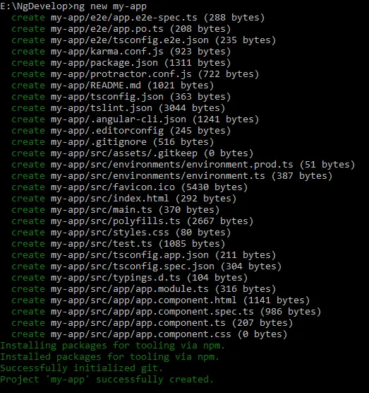
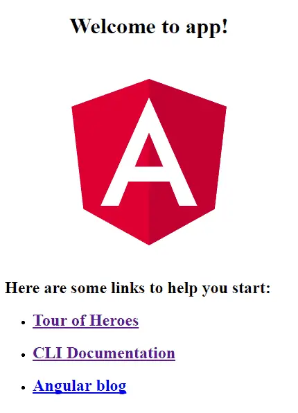

# آموزش .
هدف از اين قسمت آموزش Angular است
## 📝فهرست
  - نصب و راه‌اندازی
  - ایجاد و اجرای اولین پروژه
  - آشنایی با ساختار فایل‌ها و فولدربندی
  - ماژول‌ها، کامپوننت‌ها و سرویس‌ها
  - در باب روتینگ
  - کار با کامپوننت‌ها
  - مرتب کردن قطعه‌های پازل!
  - دایرکتیوها
  - اینترفیس
  - در باب data-binding
  - سرویس ها
  - در باب observable و observer
  - در باب اتصال به دیتابیس
  - منابع

## نصب و راه‌اندازی

1. **نصب Node.js و npm**: ابتدا باید Node.js و npm را نصب کنید. npm (Node Package Manager) یک ابزار است که برای مدیریت بسته‌های Node.js استفاده می‌شود.
2. **نصب Angular CLI**: بعد از نصب Node.js و npm، باید Angular CLI را نصب کنید. Angular CLI یک ابزار خط فرمان است که برای ایجاد و مدیریت پروژه‌های Angular استفاده می‌شود.براي پي بردن به ورژن آنگولار مي توان از `ng -v` استفاده كرد
4. **ایجاد یک پروژه جدید**: با استفاده از Angular CLI، می‌توانید یک پروژه جدید ایجاد کنید. برای این کار، فقط کافی است که دستور `ng new project-name` را در خط فرمان اجرا کنید كه به شكل زير مي شود
   
   
   
5. **اجرای پروژه**: برای اجرای پروژه، باید به دایرکتوری پروژه بروید و دستور `ng serve --open` را اجرا کنید.اين دستور به صورت پيش فرض بر پورت 4200 ران ميشود.اگر بخواهيم بر روي پورت ديگري ران كنيم بايد در ng serve آن را ذكر كنيم . **به عنوان مثال**:`ng serve -port3000` 
**پس از اچرا خروجي به شكل زير است:**

 ## ساختار
 به محض ران كردن `ng new` ، ساختار پروژه اي زير ساخته مي شود:

 
 

**در ادامه به بررسي ساختار پوشه src مي پردازيم:**
- **بخشapp/app.component.{ts,html,css,spec.ts}**: این کامپوننت ریشه است، AppComponent را همراه با یک قالب HTML، برگه سبک CSS و یک تست واحد تعریف می‌کند. تمام کامپوننت‌های دیگر به مرور زمان به شکل درختی از کامپوننت‌های تو در تو تبدیل می‌شوند. این کامپوننت در ابتدا بر روی صفحه بارگذاری می‌شود.
- **بخش app/app.module.ts**: AppModule، ماژول ریشه را تعریف می‌کند که به Angular می‌گوید چگونه برنامه را مونت کند. در حال حاضر فقط AppComponent را اعلام می‌کند. به زودی کامپوننت‌های بیشتری برای اعلام وجود خواهد داشت.
- **بخش assets/***: پوشه‌ای که می‌توانید تصاویر و هر چیز دیگری را که می‌خواهید هنگام ساخت برنامه‌تان به‌طور کلی کپی کنید، در آن قرار دهید.
- **بخش environments/***: این پوشه شامل یک فایل برای هر یک از محیط‌های مقصد شما با پیکربندی محیط خاص است. که می‌تواند در طول ساخت پروژه استفاده شود.
- **بخش favicon.ico**: هر سایتی می‌خواهد روی نوار نشانه‌گذاری خوب به نظر برسد. این آیکون پیش‌فرضی است که توسط Angular CLI داده شده است.
- **بخش index.html**: صفحه HTML اصلی که هنگامی که کسی سایت شما را می‌بیند، ارائه می‌شود. اکثر اوقات شما هرگز نیازی به ویرایش آن ندارید. CLI به‌طور خودکار همه فایل‌های js و css را هنگام ساخت برنامه‌تان اضافه می‌کند، حتی اگر نیاز به استفاده از یک برگه سبک یا جاوااسکریپت خارجی داشته باشید، می‌توانید آن را در این فایل وارد کنید.
- **بخش main.ts**: نقطه ورود اصلی برای برنامه شما. برنامه را با کامپایلر JIT (Just In Time) کامپایل می‌کند و ماژول ریشه برنامه (AppModule) را برای اجرا در مرورگر بوت استرپ می‌کند. همچنین می‌توانید از کامپایلر AOT (Ahead of Time) استفاده کنید بدون اینکه نیاز به تغییر هر کدی داشته باشید با اضافه کردن پرچم --aot به دستورات ng build و ng serve. اکثر اوقات شما هرگز نیازی به ویرایش آن ندارید.
- **بخش polyfills.ts**: مرورگرهای مختلف سطوح مختلفی از پشتیبانی از استانداردهای وب دارند. Polyfills کمک می‌کند تا این تفاوت‌ها را نرمال کند. شما باید با core-js و zone.js کاملاً ایمن باشید، اما مطمئن باشید که راهنمای پشتیبانی از مرورگر را بررسی کنید.
برای مثال، گاهی اوقات مرورگرهای نسخه قدیمی مانند IE 9، 10 یا 11 نیاز به فایل‌های پشتیبانی اضافی دارند. این فایل‌ها را می‌توانید در اینجا اضافه کنید.
- **بخش styles.css**: سبک‌های جهانی شما در اینجا می‌روند. اکثر اوقات شما می‌خواهید سبک‌های محلی در کامپوننت‌های خود داشته باشید برای نگهداری آسان‌تر، اما سبک‌هایی که بر تمام برنامه شما تأثیر می‌گذارند باید در یک مکان مرکزی باشند.
- **بخش test.ts**: این قسمت نقطه ورود اصلی برای تست‌های واحد شما است و دارای پیکربندی سفارشی است که ممکن است غیرمألوف باشد، اما این چیزی نیست که باید ویرایش کنید. اکثر اوقات شما هرگز نیازی به ویرایش آن ندارید.
- **بخش tsconfig.{app|spec}.json**: پیکربندی کامپایلر TypeScript برای برنامه Angular (tsconfig.app.json) و برای تست‌های واحد (tsconfig.spec.json).

  

  پوشه ‌`src` تنها يكي از آيتم هاي درون پوشه ي `root` ما مي باشد . ساير فايل ها به شما كمك مي كنند كه برنامه را build,test,maintain,document,deploy كنيد.در ادامه به بررسي `root` مي پردازيم:

  

- **بخش e2e/***: در داخل e2e/ تست‌های انتها به انتها قرار دارند. آن‌ها نباید در داخل src/ باشند زیرا تست‌های e2e در واقع یک برنامه جداگانه هستند که فقط تصادفاً برنامه اصلی شما را تست می‌کنند. همین دلیل است که آن‌ها tsconfig.e2e.json خود را دارند.
- **بخش node_modules/***: Node.js این پوشه را ایجاد می‌کند و تمام ماژول‌های سوم شخصی که در package.json لیست شده‌اند را در آن قرار می‌دهد.
- **بخش .angular-cli.json**: پیکربندی برای Angular CLI. در این فایل می‌توانید چندین پیش‌فرض را تنظیم کنید و همچنین می‌توانید تنظیم کنید که چه فایل‌هایی زمانی که پروژه شما ساخته می‌شود، شامل می‌شوند. اگر می‌خواهید بیشتر بدانید، به مستندات رسمی مراجعه کنید.
- **بخش .editorconfig**: پیکربندی ساده برای ویرایشگر شما تا مطمئن شود هر کسی که از پروژه شما استفاده می‌کند، پیکربندی اولیه یکسانی دارد. بیشتر ویرایشگرها از یک فایل .editorconfig پشتیبانی می‌کنند. برای اطلاعات بیشتر به http://editorconfig.org مراجعه کنید.
- **بخش .gitignore**: پیکربندی Git برای اطمینان از اینکه فایل‌های تولید شده به‌صورت خودکار به کنترل منبع اضافه نمی‌شوند.
- **بخش karma.conf.js**: پیکربندی تست واحد برای اجرای تست Karma، استفاده می‌شود هنگام اجرای ng test.
- **بخش package.json**: پیکربندی npm که فهرست بسته‌های سوم شخصی که پروژه شما از آن‌ها استفاده می‌کند را نشان می‌دهد. همچنین می‌توانید اسکریپت‌های سفارشی خود را در اینجا اضافه کنید.
- **بخش protractor.conf.js**: پیکربندی تست انتها به انتها برای Protractor، استفاده می‌شود هنگام اجرای ng e2e.
- **بخش README.md**: مستندات اولیه برای پروژه شما، پیش‌پر شده با اطلاعات دستور CLI. مطمئن شوید که آن را با مستندات پروژه تقویت کنید تا هر کسی که repo را چک می‌کند، بتواند برنامه شما را بسازد!
- **بخش tsconfig.json**: پیکربندی کامپایلر TypeScript برای IDE شما برای دریافت و ارائه ابزار مفید.

## معماري

معماری Angular به قسمت‌های مختلفی تقسیم می‌شود که عبارت‌اند از:

- **کامپوننت (Component)**: این هسته اصلی برنامه است که شامل قالب HTML، کلاس TypeScript و استایل‌های CSS می‌شود.
- **قالب (Template)**: این بخش مربوط به قالب HTML است که نحوه نمایش داده‌ها را تعیین می‌کند.
- **دستورالعمل (Directive)**: این بخش شامل دستورالعمل‌هایی است که نحوه رفتار قالب را تعیین می‌کند.
- **سرویس (Service)**: این بخش شامل توابع و متدهایی است که برای انجام عملیات مشترک بین کامپوننت‌ها استفاده می‌شود.
- **ماژول (Module)**: این بخش شامل گروهی از کامپوننت‌ها، دستورالعمل‌ها و سرویس‌ها است که با هم مرتبط هستند.

قبل از اینکه شروع به توسعه برنامه خود کنید، باید در مورد هدف هر قسمت از برنامه اطلاعات داشته باشید. به این ترتیب می‌توانید برنامه خود را روان‌تر و سریع‌تر کنید.
شكل زير نمايي از اين معماري است:

  

