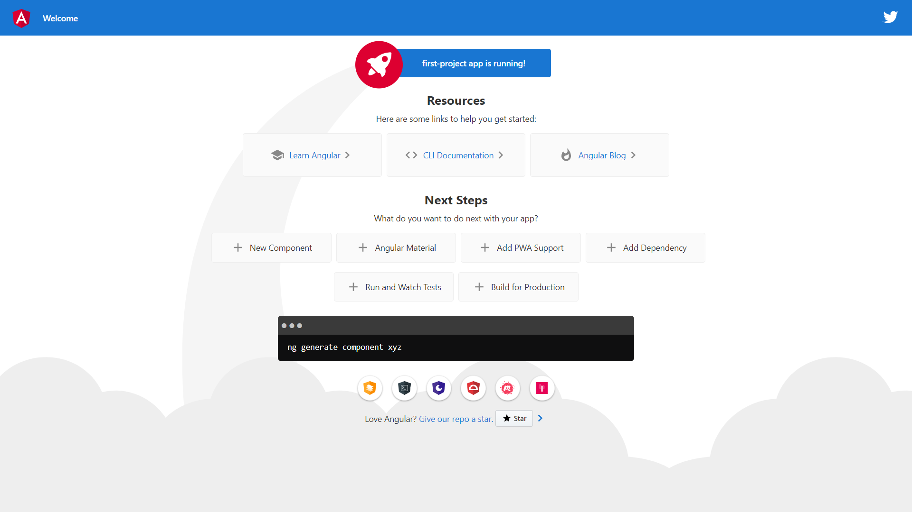
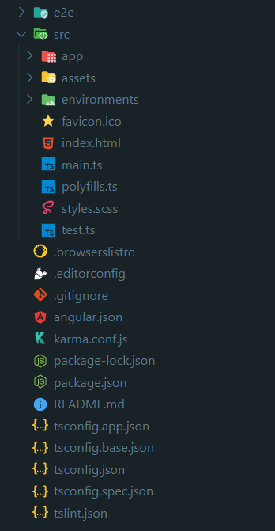

<div dir="rtl">

# آموزش انگولار
در این قسمت به آموزش گام به گام فریمورک انگولار می‌پردازیم.
## 📝فهرست
  - نصب و راه‌اندازی
  - ایجاد و اجرای اولین پروژه
  - آشنایی با ساختار فایل‌ها و فولدربندی
  - ماژول‌ها، کامپوننت‌ها و سرویس‌ها
  - در باب روتینگ
  - کار با کامپوننت‌ها
  - مرتب کردن قطعه‌های پازل!
  - دایرکتیوها
  - اینترفیس
  - در باب data-binding
  - سرویس‌ها
  - در باب observable و observer
  - در باب اتصال به دیتابیس
  - منابع

## نصب و راه‌اندازی

برای نصب انگولار و cli مربوطه در ابتدا باید node.js نصب داشته باشید. برای این منظور به سایت <a target="_blank"  href="https://nodejs.org/en/">node.js</a> مراجعه کرده و نسخه‌ای بالاتر از 12.6 را دانلود کنید. 
<br>
سپس با اجرای دستور زیر در ترمینال، آخرین نسخه‌ی انگولار روی سیستم شما نصب می‌شود:

<div dir="ltr">

```
npm i -g @angular/cli
```
</div>

## ایجاد و اجرای اولین پروژه
حال وارد یک فولدر دلخواه شده و با اجرای دستور زیر، اولین پروژه انگولار خود را بسازید:
<div dir="ltr">

```
ng new first-project
```
</div>

پس از وارد کردن این دستور چند سؤال از شما پرسیده می‌شود. اولی روتینگ در پروژه است که در ادامه به آن خواهیم پرداخت. <br>
دومی فرمت stylesheetهای پروژه است. در قسمت اول بهتر است، yes وارد کنید و در قسمت دوم از scss (sassy css) استفاده کنید.
برای مقایسه‌ی css و scss می‌توانید از
<a target="_blank" href="https://techprimelab.com/scss-or-css-which-is-better-find-out-here/#:~:text=SCSS%20is%20a%20special%20type,like%20CSS%20with%20better%20formatting.&text=Being%20an%20extension%20of%20CSS3,%2C%20selector%20inheritance%2C%20and%20more.">
این لینک
</a>
استفاده کنید.
<br>
در نهایت در مسیر اجرای دستور، فولدر first-project ساخته می‌شود که در قسمت بعد به بررسی اجزای آن خواهیم پرداخت.
ضمناً فرایند ایجاد پروژه به علت نصب پکیج‌های اولیه، اندکی زمان‌بر است.
<br>
اما قبل از آن، برای اجرای پروژه وارد فولدر شوید و از دستور زیر استفاده کنید:
<div dir="ltr">

```
ng serve
```
</div>

حال مرورگر خود را باز کنید و به آدرس localhost:4200 بروید و اولین پروژه انگولار خود را نظاره کنید!
<br>



## آشنایی با ساختار فایل‌ها و فولدربندی
وارد فولدر پروژه شوید. ولی آرامش خود را حفظ کنید! در اینجا با فایل‌ها و فولدرهای بسیاری مواجه می‌شویم که به لطف آنها می‌توان پروژه‌های بزرگی را به خوبی مدیریت کرد. در این بخش سعی می‌کنیم تا با کاربرد تمام قسمت‌ها آشنا شویم:
  - <b>فولدر e2e:</b> از این فولدر برای end to end testing استفاده می‌شود.
  - <b>فولدر node_modules:</b> در این فولدر حجیم(!)، تمام پکیج‌های لازم برای ساخت و اجرای پروژه قرار می‌گیرد. این فولدر را روی گیت پوش نمی‌کنیم و در مواقع نیاز(!) با دستور `npm i` .آن را می‌سازیم
  - <b>فایل gitignore:</b> در این فایل ابزار مربوط به گیت قرار دارد.
  - <b>فایل Angular.json:</b> در این فایل تمام کانفیگ پروژه قرار دارد
  - <b>فایل browserslist:</b> این فایل برای هماهنگ سازی پروژه با ورژن‌های پایین‌تر مرورگرها اختصاص داده شده است.
  - <b>فایل karma.conf.js: این فایل مربوط به تست نویسی میباشد. </b>
  - <b>فایل package.json:</b> در این فایل تمامی dependencyهای پروژه قرار می‌گیرد
  - <b>فایل package-lock.json:</b> اینجا آخرین ورژن از پکیچ‌های نصب شده قابل مشاهده است.
  - <b>فایل tsconfig.json:</b> در این فایل کانفیگ‌های مرتبط با کامپایل تایپ‌اسکریپت به جاوااسکریپت قرار می‌گیرد. (به خط `"target": "es2015"` توجه کنید.) 
  - <b>فایل tslint.json:</b> در این فایل تمام قواعد کدزنی مد نظر، مانند حداکثر طول خط، ترتیب بخش‌های کلاس، و فرمت نام کامپوننت‌ها قرار می‌گیرد.
  
و اما <b>فولدر src:</b> تمام کد ما برای بخش‌های مختلف در این فولدر قرار می‌گیرد. <br>
  - <b>فولدر app:</b> ماژول‌ها و کامپوننت‌ها (قسمت اصلی پروژه) در این فولدر قرار می‌گیرد.
  - <b>فولدر assets:</b> عکس‌ها و فایل‌هایی که در برنامه به آنها نیاز داریم را در این فولدر ذخیره می‌کنیم.
  - <b>فولدر environments:</b> در فایل environments.ts در این فولدر، متغیرهای عمومی که در همه قسمت‌ها می‌خواهیم به مقدارشان دسترسی داشته باشیم، (مانند بولین production) قرار می‌گیرند
  - <b>فایل index.html:</b> فایل html اصلی پروژه که محتوای سایر کامپوننت‌ها در آن قرار می‌گیرد. در بخش‌های بعد این فایل را دقیق‌تر بررسی خواهیم کرد.
  - <b>فایل main.ts:</b> فایل تایپ‌اسکریپت اصلی پروژه که اجرای برنامه از آن شروع می‌شود و کامپوننتی که لود می‌شود در آن مشخص شده است.
  - <b>فایل polyfills.ts:</b> از این فایل برای گسترش دادن متدهای آبجکت‌های اصلی استفاده می‌شود.
  - <b>فایل styles.scss:</b> استایل‌های عمومی برنامه (مانند فونت‌ها) را در این فایل تعریف می‌کنیم تا در تمام کامپونتت‌های برنامه دیده شوند.
  - <b>فایل test.ts:</b> در این فایل یونیت-تست‌ها نوشته می‌شوند.
<br>

<br>
در قسمت بعد به معرفی کلاس‌های تشکیل‌دهنده انگولار می‌پردازیم و بیشتر با محیط کد آشنا می‌شویم.

## ماژول‌ها، کامپوننت‌ها و سرویس‌ها
### ماژول
ماژول مجموعه‌ای از کامپوننت‌ها است که با یکدیگر وابستگی نزدیکی دارند. هر پروژه انگولار حداقل یک ماژول دارد که به آن AppModule می‌گویند و در ابتدا ساخته می‌شود. در این ماژول مشخص می‌شود که کامپوننت شروع‌کننده برنامه چیست. این کامپوننت در قسمت bootstrap مشخص می‌شود. اگر در داخل یک ماژول از ماژول دیگری استفاده شود، نام آن در import می‌آید و نام تمام کامپوننت‌های داخل ماژول نیز در declarations مشخص می‌شود.
### کامپوننت
هر پروژه‌ی انگولار از چندین کامپوننت تشکیل شده است. هر کامپوننت معماری MVVM دارد و شامل یک فایل html، یک فایل css و یک فایل ts است. اگر بالای هر کلاس ts، از دکوراتور <span dir="ltr">@Component()</span> استفاده شود، آن کلاس تبدیل به کامپوننت می‌شود. هر کامپوننت باید در داخل declarations یک ماژول تعریف شده باشد.
<br>
به زبان ساده‌تر برای بالا بردن توسعه پذیری کدها و دیباگ راحت‌تر، کدهای یک بخش سایت را داخل یک فایل میبریم که به آن کامپوننت میگوییم.
<br>
در نهایت همه آنها در فایل اصلی app-root در کنار هم قرار میگیرند و سند اصلی را میسازند.
### سرویس
برای دریافت داده و یا logicهایی که مخصوص یک کامپوننت خاص نیست، از service استفاده می‌شود. در انگولار از Dependency Injection استفاده می‌شود. نحوه‌ی عملکرد آن به این صورت است که سرویس‌های مربوط به یک ماژول در قسمت providers موجود در ماژول، مشخص می‌شود و در زمان اجرا، آن service ساخته می‌شود و به کامپوننت‌های داخل ماژول داده می‌شود. بالای هر سرویس از دکوراتور <span dir="ltr">@Injectable()</span> استفاده می‌شود. یکی از مهم‌ترین سرویس‌های موجود در انگولار، HttpClient است. از این سرویس برای ارسال درخواست‌های Get و یا Post به سرور استفاده می‌شود. برای اطلاعات بیشتر در مورد این سرویس می‌توانید به سایت <a target="_blank" href="https://angular.io/guide/http">انگولار</a> مراجعه کنید

## در باب روتینگ
اولین سوالی که در زمان ایجاد پروژه از شما شد، وجود routing در پروژه بود. برنامه‌های انگولار به صورت SPA یا Single Page Application هستند. به این شکل که شما تنها یک صفحه در سایت خود دارید و محتوا به صورت داینامیک در همان صفحه لود می‌شود. این که محتوای چه قسمتی در صفحه لود شود، به کمک Routing مشخص می‌شود. به صورت پیش‌فرض پس از ایجاد یک پروژه، routing زیر برای شما در فایل app-routing.module.ts به وجود خواهد آمد.

<div dir="ltr">

```typescript
const routes: Routes = [];

@NgModule({
  imports: [RouterModule.forRoot(routes)],
  exports: [RouterModule]
})

```
</div>
در اینجا مقدار routes که یک آرایه‌ای از routeها است، خالی است. اگر مقدار زیر را در آن قرار دهیم، به این معنی خواهد بود که اگر در url، آدرس test وارد شد، کامپوننت TestComponent را در صفحه به جای router-outlet لود کن. این تگ در app.component.html وجود دارد و محل لود شدن routeها را مشخص می‌کند.

<div dir="ltr">

```typescript
const routes: Routes = [
  { path: 'test', component: TestComponent }
];
```
</div>
✅برای نوشتن routeها میتوانیم از children هم استفاده کنیم.فرض کنید بخشی از url مشترک باشد؛ در این حالت بجای اینکه path را از اول بنویسیم میتوانیم به شکل زیر عمل کنیم:
<div dir="ltr">

```typescript
  { path: 'note-list', component: TestComponent, children:[
    {path: '1', component: noteList_one_component},
    {path: '2', component: noteList_two_component},
    {path: '3', component: noteList_three_component}
  ] }
```
</div>
✅از routeها میتوانیم برای انتقال دیتای ثابت استفاده کنیم(ارسال به component) اما چرا؟ فرض کنید بخواهیم یک پیامی را به یک کامپوننت در شرایط مختلف ارسال کنیم، مثلا برای صفحه 404. در این حالت در ادامه مشخصات route از data استفاده میکنیم:
<div dir="ltr">

```typescript
  { path: '404', component: NotFoundComponent, 
  data={message: 'something'} }
```
</div>
حال برای گرفتن message در component مربوطه، در constructo، باید route را از جنس ActivatedRoute و به نوع private تعریف کنیم و برای استفاده هم از از دستور زیر استفاده میکنیم:
<div dir="ltr">

```typescript
this.route.snapshot.data
```
</div>
اگر از دستور بالا log بگیریم، آبجکتی به شکل زیر خروجی میدهد:
<div dir="ltr">

```typescript
{message:"something"}
```
</div>
✅<b>queryparams:</b> برای ارسال یک سری دیتا از طریق url به یک component، باید داده‌ها را بعد از پایان url , قرار دادن؟، بصورت key : value وارد کنیم و اگر چندتا داشته باشیم، باید بین آنها & بگذاریم:
<div dir="ltr">

```typescript
url ? course=webProgramming & university=sharif
```
</div>
در این حالت اگر
<div dir="ltr">

```typescript
console.log(this.route.snapshot.queryparams)
```
</div>
را بگیریم، یک آبجکت به شکل زیر خروجی خواهیم داشت:
<div dir="ltr">

```typescript
{course:webprogramming, university:sharif}
```
</div>
✅<b>fragment:</b> اگر بخواهیم یک بخشی مثل پرسش و پاسخ یا اطلاعات را در صفحه مشخص کنیم که با تغییر url به آن بخش از صفحه برویم، باید در انتهای url با گذاشتن # نام بخش را بنویسیم و با دستور زیر میتوانیم به آن دسترسی داشته باشیم:
<div dir="ltr">

```typescript
console.log(this.route.snapshot.fragment)
```
</div>  

✅دو بخش قبل یعنی queryparams و fragment در واقع برای خواندن در سمت component بودند؛ اما برای ارسال از طریق component هم میتوان از آنها استفاده کرد. در واقع در تگی که اطلاعات و routerlink را قرار میدهیم، میتوانیم queryparams و fragment را هم قرار دهیم:
<div dir="ltr">

```typescript
<a routerlink="link_name"
  [queryparams]="{course='webProgramming', university='sharif'}" fragment="loading"> something </a>
```
</div>

در این صورت، دیتاها در url مرورگر به صورت زیر خواهند بود :
<div dir="ltr">

```typescript
url ? course=webprogramming & university=sharif #loading
```
</div>

توجه داشته باشیم که queryparams و fragment هم آبجکتی از نوع observable هستند و باید subscribe را برای آنها بنویسیم.
<br>

✅ فرض کنید میخواهیم پس از انجام پروسه ای با زدن یک دکمه به یک route خاص برویم. علاوه بر آن میخواهیم queryparams و fragment را هم ارسال کنیم. برای این کار تابعی را برای event کلیک قرار میدهیمو در typescript مینویسیم. همچنین در constructor، باید router را از نوع Router و بصورت private بسازیم. در نهایت در تابع نوشته شده باید از navigate استفاده کنیم :
<div dir="ltr">

```typescript
function_name() {
  this.router.navigate(
    [url, بخش های بعدی مانند آیدی],
    {queryparams: {
      course : 'webProgramming',
      university : 'sharif',
    },
    fragment : 'info',
    },
  )
}
```
</div>
در نهایت url ما به شکل زیر خواهد بود :
<div dir="ltr">

```typescript
url/id?course:webProgramming&university:sharif#info
```
</div>
✅فرض کنید بخواهیم دسترسی به یک route را محدود کنیم؛یعنی مثلا فقط کسانی که ثبت نام کرده اند، بتوانند وارد شوند. در این حالت باید بخش canActivate را به route اضافه کنیم. canActivate یک interface میباشد تا بعنوان یک guard تصمیم بگیرد که آیا کاربر اجازه باز کردن چنین صفحه ای را دار یا خیر! ما میتوانیم درون canActivate چند گارد را قرار دهیم؛ بدین صورت که اگر همه guardها، true برگردانند، navigation با موفقیت به جلو میرود اما در غیر اینصورت حتی اگر یکی از guardها جواب false برگرداند، navigation کنسل میشود.
<br>
توجه داشته باشید که اگر یک گارد را برای route پدر قرار دهیم، برای تمامی routeهای فرزند نیز اعمال میشود و برای navigate به انها باید از این guard عبور کند.


✅در وبسایت‌های مختلف، اگر urlای وارد شود که  path برای آن تعریف نشده باشد، باید به صفحه 404 هدایت شود. بدین منظور کامپوننت مربوط به آن را میسازیم و path  آن را نیز مشخص میکنیم.
<div dir="ltr">

```typescript
  { path: '404', component: NotFoundComponent },
  { path: '**', redirectTo: '/404'}
```
</div>
** یعنی اگر url وارد شده وجود نداشت.


در قسمت بعدی مفصل‌تر به این موارد و کار با کامپوننت‌ها پرداخته خواهد شد

## کار با کامپوننت‌ها
قبل از هرچیز بیایید با هم فایل app.component.ts را بررسی کنیم:
<div dir="ltr">

```typescript
import { Component } from '@angular/core';

@Component({
  selector: 'app-root',
  templateUrl: './app.component.html',
  styleUrls: ['./app.component.scss']
})
export class AppComponent {
  title = 'first-project';
}

```
</div>
در بالای فایل، component از @angular/core ایمپورت شده است.

در دکوراتور کامپوننت، سه عبارت کلیدی وجود دارد:
  - <b>سلکتور:</b> همانند تگ‌های html، هر جا که در فایل‌های html ماژول‌هایی که این کامپوننت را می‌شناسند، تگ `<app-root></app-root>` را درج کنید، تمام محتوای html مربوط به این کامپوننت آنجا لود خواهد شد! در واقع ما برای کامپوننت خود یک شناسه ایجاد میکنیم تا بتوانیم از آن در بخش‌های مختلف پروژه استفاده کنیم.
  - <b>تمپلت:</b> اینجا فایل html مربوط به کامپوننت نشان داده می‌شود.
  - <b>استایل:</b> و اینجا آرایه‌از فایل‌های استایل مرتبط با این کامپوننت مشخص می‌شود.
<br>

### توضیحات تکمیلی
  - اگر در بخش Selector، نام را درون [] بگذاریم، دیگر بصورت قبل نمیتوان از آن استفاده کرد و باید بعنوان Attribute ازآن استفاده کرد و دیگر بصورت `<name></name>` ازآن استفاده کرد.
  - در بخش templateurl، فقط یک آدرس html میتوانیم بنویسیم. اگر تعداد خط‌های html ما به قدری کم باشد که ساخت کلاس جدید برای آن منطقی نباشد، میتوانیم به جای templateUrl از template استفاده کنیم و بصورت مستقیم کد html را درون آن بنویسیم. باید توجه داشته باشیم که بجای 'url' باید از `` استفاده کنیم.
  - در بخش styleUrls، همانطور که از اسمش مشخص است، میتوانیم چند کلاس css را داشته باشیم. همچنین این امکان را داریم به مانند Template، در این بخش از styles[] استفاده کنیم و کد‌های scss را درون آن بنویسیم.
  - در دکوراتور component، استفاده از templateUrl نسبت به template ارجحیت دارد و اگر همزمان هر دو وجود داشته باشند، Templateurl بررسی میشود.
  - توجه داشته باشید بعد از ساختن کامپوننت، باید نام کلاس را که export شده است در app module در بخش declaration وارد کرده و در بالای صفحه نیز import کنیم.

به راحتی می‌توان با اجرای دستور زیر، یک کامپوننت جدید به برنامه اضافه کرد:
<div dir="ltr">

```
ng generate component my-component
```
</div>
به اختصار از دستور زیر میتوان استفاده کرد:
<div dir="ltr">

```
ng g c my-component
```
</div>
و CLI انگولار تمام فایل‌های ts و html و scss کامپوننت را در فولدری به نام my-component می‌سازد و در app.module.ts نیز کامپوننت را ایمپورت کرده و به قسمت declarations اصافه می‌کند!
مزیت این روش، صرفه جویی در زمان، جلوگیری از اشتباهات سهوی هنگام تایپ و از همه مهمتر، اضافه شدن در app.module.ts میباشد.

## مرتب کردن قطعه‌های پازل!
در قسمت‌های قبل به router-outlet و همچنین به selector در کامپوننت‌ها اشاره کردیم، وقت آن است که نگاهی به index.html بیندازیم:
<div dir="ltr">

```html
<!doctype html>
<html lang="en">
<head>
  <meta charset="utf-8">
  <title>FirstProject</title>
  <base href="/">
  <meta name="viewport" content="width=device-width, initial-scale=1">
  <link rel="icon" type="image/x-icon" href="favicon.ico">
</head>
<body>
  <app-root></app-root>
</body>
</html>
```
</div>

به body توجه کنید. تگ app-root به برنامه می‌گوید که محتویات app.component.html را اینجا نمایش دهد...
الان در فایل مذکور، کد طراحی همان صفحه‌ی اصلی که بالاتر دیدیم وجود دارد.
<br>
اما فرض کنید برنامه‌ای داریم که یک navbar همیشه بالای صفحه‌اش دارد و محتوای پس از آن با توجه به مسیری که قرار داریم پر می‌شود. در این صورت فایل app.component.html ما می‌تواند اینگونه باشد:

<div dir="ltr">

```html
<app-nav-menu></app-nav-menu>
<router-outlet></router-outlet>
```
</div>
که در آن app-nav-menu، سلکتور کامپوننتی است که برای navbar ساخته‌ایم

<br>

## دایرکتیوها(directive)
✅ کامپوننت نوعی directive است.
<br>
✅ directiveها یکسری دستورالعمل هستند که در DOM اجرا میشوند.
<br>
✅ 2نوع directive داریم : structural directive ** attribute directive
<br>
✅ قبل از تمام stuctural directiveها، علامت * می‌آید. (ngif*)
  
  - <b>بررسی شرط با ngIf* :</b> فرض کنید می‌خواهیم در صورت برقرار بودن یا نبودن یک شرط خاص رفتار متفاوتی در نمایش محتوا داشته باشیم. در مثال زیر با کمک ngIf می‌توانیم بدون نیاز به کد اضافه و صرفاً با بیان شرط (یا متغیر) این منطق را پیاده‌سازی کنیم:
<br>

<div dir="ltr">

```typescript
<div *ngIf="ali.age >= 18">Ali is {{ali.age}} years old and can drive a car!</div>
```
</div>
برای زمانی که به else نیاز داشته باشیم باید با <`ng-template> کار کنیم. این تگ هیچ موقع به شکل مستقیم اجرا نمیشود و باید یک reference به آن قرار دهیم و در ادامه ngif* به شکل مقابل عمل کنیم:
<div dir="ltr">

```typescript
<div *ngIf="state" ; else refrence_name >something</div>
```
</div>
در صورتی که state = false باشد، <`ng-template> که #refrence_name درون آن قرار دارد اجرا میشود و تگ اولیه اجرا نمیشود. 

طریقه reference دادن در html بصورت name# در قسمت attribute یک تگ میباشد:
<div dir="ltr">

```typescript
<button #refrence_name >button_text</button>
```
</div>
<br>
اگر بخواهیم از reference در همین کامپوننت استفاده کنیم باید از دکوراتور ViewChild@ استفاده کنیم :
<div dir="ltr">

```typescript
@ViewChild ('my') name : ElementRef;
```
</div>
  - <b>اجرای حلقه با *ngFor:</b> بعنوان مثال فرض کنید جایی نیاز داریم تا تمام عناصر یک لیست را در یک قالب خاص نشان دهیم، اینجا می‌توانیم به راحتی با استفاده از ngFor نیاز خود را رفع کنیم:
  
<div dir="ltr">

```typescript
<li *ngFor="let student of students">{{student.name}}</li>
```
</div>

اگر به index نیز نیاز داشته باشیم، میتوانیم به شکل زیر عمل کنیم:
<div dir="ltr">

```typescript
<li *ngFor="let student of students ; let i = index">{{student.name}}</li>
```
</div>

  - <b>پیاده سازی switch-case:</b> با switch-case در اکثر زبان‌های برنامه نویسی آشنا هستیم و کاربرد ان در اینجا هم به مانند دیگر زبان هاست. در تگ والد، [ngswitch] را به شکل property-binding می‌نویسیم. همچنین property مدنظر را ابتدا در typescript تعریف میکنیم. نمونه ای از پیاده سازی آن به شکل زیر میباشد:

  <div dir="ltr">

```typescript
<div [ngswitch]="property_name">
  <p *ngSwitchCase="case 1">this is case 1 value...</p>
  <p *ngSwitchCase="case 2">this is case 2 value...</p>
  <p *ngSwitchCase="case 3">this is case 3 value...</p>
</div>
```
</div>
اگر بخواهیم از dynamic style استفاده کنیم، میتوانیم بعداز [ngSwitch] از [ngStyle] و شرط‌های تک خطی جاوااسکریپتی استفاده کنیم. همچنین میتوانیم بجای شرط‌ها، property را به یک تابع در typescript پاس بدهیم و در آن،  با Switch-case یا if-else، تابع را پیاده سازی و ویژگی مدنظر را return کنیم.

** توجه داشته باشید که [ngStyle] یک attribute directive میباشد.

✅ ساخت directive جدید:
  
  - چرا دایرکتیو جدید بسازیم؟ تمیزشدن کد - نیاز به استفاده در جاهای مختلف - ...
  
  - ساخت دایرکتیو جدید به این گونه است که فایلی مانند typescript و با پسوند directive.ts میسازیم. سپس import و export را مانند component انجام میدهیم.  selector را حتما باید داشته باشیم و حتما باید بصورت [directive-name] باشد که بصورت attribute از آن استفاده کنیم.
  
  - برای پویاکردن directive، نیاز داریم دیتاهایی را به آن ارسال و از آن دریافت کنیم.

  - برای ارسال دیتا، به مانند component عمل میکنیم. یعنی در کلاس directive، یک property با دکوراتور @Input تعریف میکنیم و بصورت property binding در سند html مبدا، آن را مقدار دهی میکنیم. در ادامه اگر در کلاس directive بخواهیم به مقدار آن دسترسی داشته باشیم، در constructor نمیتوانیم و باید OnInit را implements کنیم و در تابع ngOnInit() از property جدید استفاده کنیم:
  <div dir="ltr">

```typescript
<a directive_name [property-name]=data></a>
-------------------------------------
@ Input (input-name);
.
.
<a [input-name]=data></a>
```
</div>

✅ اگر بخواهیم اتفاق افتادن یک رویداد (event) را در directive کنترل کنیم، به شکل زیر عمل میکنیم:
<div dir="ltr">

```typescript
@ HostListener(my-event) function_name() {...}
```
</div>
** توجه داشته باشید که event میتواند مواردی مانند 'click' یا 'hover' باشد.


## اینترفیس(Interface)
✅ ما در Angular یکسری interface داریم. این interfaceها باعث میشوند که یکسری متدها در کلاس‌هایی که interfaceها را قرار میدهیم، در دسترس قرار بگیرند و سپس در زمان اجرای آن کلاس در هسته مرکزی angular، بررسی میشود که آیا آن کلاس همچین متدی را دارد یا خیر و اگر داشت، آن را اجرا میکند.
<br>
✅ hook : منظور متدی است که به واسطه حضور interface در کلاس مدنظر پیاده سازی میشود.
<br>
✅ ترتیب تقریبی اجرای hookها را میتوان به شکل زیر پیاده سازی کرد:
 - constructor
 - ngOnChanges
 - ngOnInit
 - ngDoCheck
 - ngAfterContentInit
 - ngAfterContentChecked
 - ngAfterViewInit
 - ngAfterViewChecked
 - ngOnDestroy
<br>

✅ تفاوت constructor و  ngOnInit : در constructor کارهایی که در زمان ساخته شدن یک object باید انجام شود، نوشته میشود ولی در ngOnInit، کارهایی که در زمان اجرای اولیه باید انجام شود، نوشته میشود. به همین دلیل است که در constructor به propertyهای کلاس دسترسی نداریم.

<br>
✅ ngDoCheck : این تابع به ازای هررر تغییری در view یا غیر view اجرا میشود، حتی هنگامی که روی یک Text یا button در صفحه hover کنیم. توجه کنید که استفاده از این تابع باید تا حد ممکن انجام نشود زیرا ممکن است منجر به کاهش قابل توجه performance شود.

<br>
✅ ngOnChange : زمانی که مقدار یک @Input تغییر میکند یا بخواهیم اطلاعات دیتایی تغییر کرده در کامپوننت پدر را به اطلاع کامپوننت پسر بفرستیم، از آن استفاده میکنیم.

## در باب data-binding

✅ به فرآیندی گفته میشود که در آن، دیتاهای موجود در متدها و propertyهای یک کامپوننت گرفته شده و در template نمایش داده میشود.

✅ اینترپولیشن(interpolation) : در سند html، برای نمایش property یا متد درون کلاس typescript، آن را بصورت {{ name }} یا {{ name() }} باید بنویسم.

✅ property-binding : دیتا را از component به شکل مستقیم در یک Attribute بعنوان مقدار آن قرار میدهیم : 
[class] = "data"

✅ اگر بخواهیم در template، یک سری دیتای کامپوننت را تغییر بدهیم، میتوانیم از event-binding استفاده کنیم. (مثلا کلیک روی یک element و تغییر یک دیتا در typescript)
<div dir="ltr">

```typescript
<a (click)="function_name()"></a>
```
</div>
باید event مدنظر را درون پرانتز قرار دهیم. همچنین میتوانیم به تابع نیز ورودی بدهیم.

✅ two way binding : ترکیب event-binding و data-binding

این روش معمولا در inputها و formها مورد استفاده قرار میگیرند.
<div dir="ltr">

```typescript
<input type="text" [(ngModel)]="input-value">
```
</div>
در این حالت به شکل مستقیم و کوتاه‌تر، مقدار input-value آپدیت میشود. input-value در typescript تعریف شده است.

## سرویس ها(services)
✅ برای استفاده از داده‌ها در رده‌های مختلف، باید از Input/@Output@ و انواع bindingها استفاده کنیم اما این مشکل در سرویس‌ها حل میشود.
<br>
✅ همچنین بدون استفاده از سرویس‌ها، باید تمامی توابع و متدهای مربوطه را در app.component.ts پیاده سازی کنیم که در یک پروژه متوسط، کلاس بسیار بزرگی به ما تحویل میدهد که ناخوشایند است.
<br>
✅ در ادامه برای استفاده باید در [provider] نوشته شود تا بتوانیم استفاده کنیم. در کلاس مدنظر با دستور زیر، آبجکت جدید را میسازیم و استفاده میکنیم:
<div dir="ltr">

```typescript
let name = new Name();
```
</div>
✅ در حالت عادی اگر در کامپوننت‌های مختلف از سرویس استفاده کنیم، چندین و چند آبجکت ساخته میشود. برای حل این مشکل چند راه حل داریم که در ادامه به آنها اشاره میکنیم:

 - سرویس را در provider در app-Module نوشته و در app.component.constructor صدا میزنیم و استفاده میکنیم.

 - اگر بخواهیم از 2 آبجکت یا بیشتر استفاده کنیم، چاره ای جز چندبار new کردن و نوشتن آن نداریم.

 - اگر بخواهیم 1 آبجکت کلی داشته باشیم و تمامی فرزندان همان آبجکت را داشته و استفاده کنند، باید آن را در provider صفحه پدر، تعریف کرده و در کامپوننت‌های فرزندان از آنها استفاده کنیم.

✅ اگر با cli اقدام به ساخت سرویس کنیم، دکوراتور Injectable@ هم نوشته خواهد شد که در زمانی که بخواهیم از یک سرویس در سرویس دیگر استفاده کنیم به کارمان می‌آید؛ در غیر اینصورت میتوانیم آن را پاک کنیم.

## در باب Observable و observer
✅ بعضی از اجزای برنامه، قابل تغییر هستند و ما نیاز داریم که از تغییرات آنها مطلع شویم. حال اگر اجزای ما قابل مشاهده باشند، subscribe را به کار میگیریم تا اگر تغییری رخ داد، آن تغییر را بعنوان نظاره گر به ما گزارش دهد. در این شرایط به آن جز که قابل مشاهده است، observable و به آن subscribe ناظر و مشاهده گر، observer میگوییم.
<br>
✅ در توابع مربوط به observable، به منظور گرفتن مقدار جدید از ()subscriber.next و به منظور پایان فرآیند میتوانیم از ()subscriber.complete استفاده کنیم.
<br>
✅ نکته قابل توجه درباره subscribe این است که باید در زمانی که route ما عوض شده یا صفحه را جابجا میکنیم، آن هم متوقف شود. از این رو در ngOnDestroy پس از تعریف یک property بنام subscription از نوع Subscription، دستور زیر را مینویسیم:
<div dir="ltr">

```typescript
this.subscription.unsubscribe();
```
</div>
** هیچ موقع unsubscribe کردن را فراموش نکنید.

## در باب اتصال به دیتابیس
✅ استفاده از firebase : فایربیس یک سایت در حوزه api و سرویس جامع برای پروژه‌های برنامه نویسی است که برای شما دیتابیس درست میکند و api ساختگی به شما میدهد.
<br>
✅ انگولار بعنوان یک فریم ورک، سرویسی را برای ارسال و دریافت بر بستر http دارد. برای همین در app.module.ts باید HttpClientModule را import کنیم و در []imports  هم قرار دهیم. این ماژول در ارسال درخواست‌های http به ما کمک میکند.
<br>
✅ برای ارسال دیتا، ابتدا در typescript مدنظر، در constructor، یک property بنام http از نوع private و تایپ HttpClient میسازیم. حال برای ارسال دیتا لازم است آدرس api را داشته باشیم. (یا از بک اند میگیریم یا فایربیس)
<br>
توجه کنید که http.post برای ارسال دیتا میباشد. ورودی آن ابتدا api و سپس data میباشد. اگر بخواهیم Data در folder یا آرایه ای جدا ذخیره شود، در آخر آدرس url که برای api مینویسیم، array-name.json/ را مینویسیم. همچنین post.، یک observable میباشد و برای ثبت دیتا در api، باید یک observer هم برای آن ست کنیم.
<br>
✅ برای گرفتن Data باید از http.get استفاده کنیم. ورودی آن، آدرس api میباشد و به مانند post، باید observer برای آن ست کنیم. در ادامه بر حسب نیاز، دیتا را در آرایه ای ذخیره و سپس نمایش میدهیم یا مستقیما در محل نمایش، دیتا را دریافت و نمایش میدهیم.
<br>
✅ اگر بخواهیم هرجایی که نیاز باشد، subscribe را بعنوان observer بنویسیم، حجم کد به شدت بالا رفته و کار جالبی نیست. ایده بهتر این است که در یک سرویس، تابعی نوشته و http.get را return کنیم. سپس در محل موردنیاز، با توجه به نیاز و شرایط، observer را اضافه کنیم.
<br>
✅ اگر بخواهیم دیتایی را حذف کنیم، باید از http.delete استفاده کنیم. بعنوان ورودی فقط باید آدرس api، نام آرایه، key و json را بنویسیم:
<div dir="ltr">

```typescript
api/array-name/key.json
```
</div>
** نوشتن observer فراموش نشود.
<br>
✅ برای ادیت کردن، میتوانیم از http.put استفاده کنیم. ورودی‌های آن شامل آدرس api به مانند Delete بعنوان ورودی اول و متغیرها بعنوان ورودی دوم میباشد.


## منابع
  - angular.io
</div>
