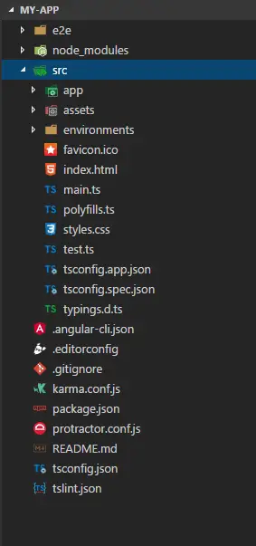
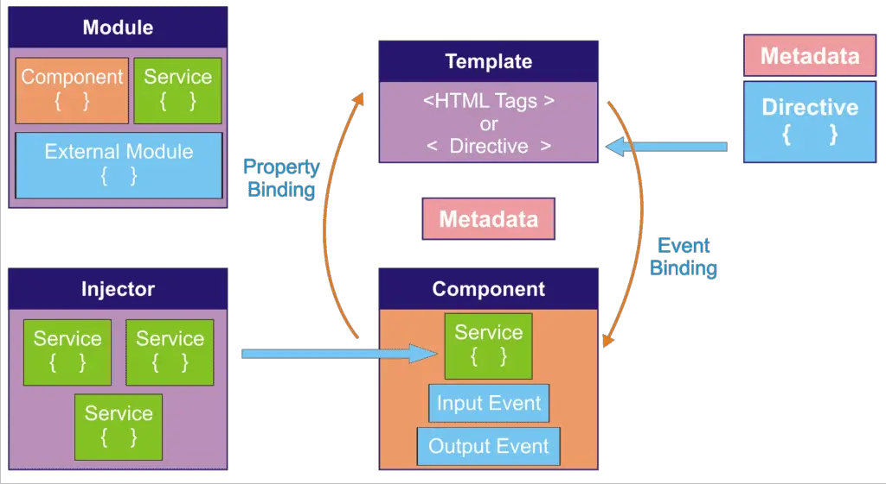
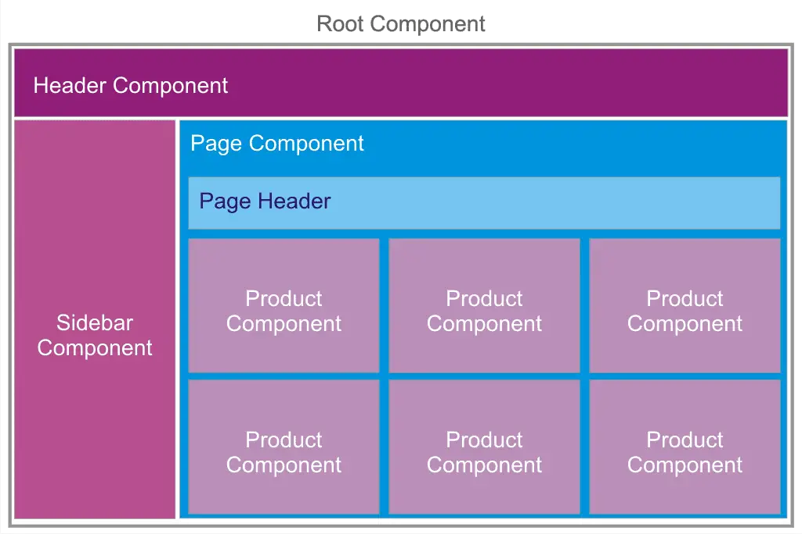
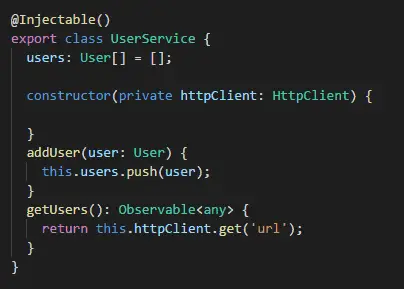
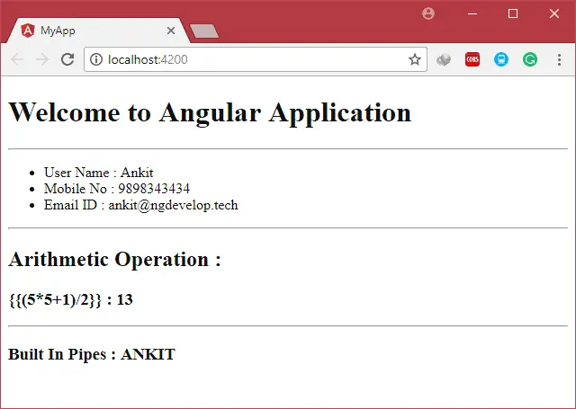

<div dir="rtl">

# آموزش .
هدف از اين قسمت آموزش Angular است
## 📝فهرست
  - نصب و راه‌اندازی
  - ایجاد و اجرای اولین پروژه
  - آشنایی با ساختار فایل‌ها و فولدربندی
  - ماژول‌ها، کامپوننت‌ها و سرویس‌ها
  - موضوعات پايه در Angular
  - در باب روتینگ
  - کار با کامپوننت‌ها
  - مرتب کردن قطعه‌های پازل!
  - دایرکتیوها
  - اینترفیس
  - در باب data-binding
  - سرویس ها
  - در باب observable و observer
  - در باب اتصال به دیتابیس
  - منابع

## نصب و راه‌اندازی

1. **نصب Node.js و npm**: ابتدا باید Node.js و npm را نصب کنید. npm (Node Package Manager) یک ابزار است که برای مدیریت بسته‌های Node.js استفاده می‌شود.
2. **نصب Angular CLI**: بعد از نصب Node.js و npm، باید Angular CLI را نصب کنید. Angular CLI یک ابزار خط فرمان است که برای ایجاد و مدیریت پروژه‌های Angular استفاده می‌شود.براي پي بردن به ورژن آنگولار مي توان از `ng -v` استفاده كرد
4. **ایجاد یک پروژه جدید**: با استفاده از Angular CLI، می‌توانید یک پروژه جدید ایجاد کنید. برای این کار، فقط کافی است که دستور `ng new project-name` را در خط فرمان اجرا کنید كه به شكل زير مي شود
   
   
   
5. **اجرای پروژه**: برای اجرای پروژه، باید به دایرکتوری پروژه بروید و دستور `ng serve --open` را اجرا کنید.اين دستور به صورت پيش فرض بر پورت 4200 ران ميشود.اگر بخواهيم بر روي پورت ديگري ران كنيم بايد در ng serve آن را ذكر كنيم . **به عنوان مثال**:`ng serve -port3000` 
**پس از اجرا خروجي به شكل زير است:**


 ## ساختار
 به محض ران كردن `ng new` ، ساختار پروژه اي زير ساخته مي شود:


 
 



**در ادامه به بررسي ساختار پوشه src مي پردازيم:**
- **بخشapp/app.component.{ts,html,css,spec.ts}**: این کامپوننت ریشه است، `AppComponent` را همراه با یک قالب HTML، برگه سبک CSS و یک تست واحد تعریف می‌کند. تمام کامپوننت‌های دیگر به مرور زمان به شکل درختی از کامپوننت‌های تو در تو تبدیل می‌شوند. این کامپوننت در ابتدا بر روی صفحه بارگذاری می‌شود.
- **بخش app/app.module.ts**: در اين بخش `AppModule` ماژول ریشه را تعریف می‌کند که به Angular می‌گوید چگونه برنامه را مونت کند. در حال حاضر فقط `AppComponent` را اعلام می‌کند. به زودی کامپوننت‌های بیشتری برای اعلام وجود خواهد داشت.
- **بخش assets/***: پوشه‌ای که می‌توانید تصاویر و هر چیز دیگری را که می‌خواهید هنگام ساخت برنامه‌تان به‌طور کلی کپی کنید، در آن قرار دهید.
- **بخش environments/***: این پوشه شامل یک فایل برای هر یک از محیط‌های مقصد شما با پیکربندی محیط خاص است. که می‌تواند در طول ساخت پروژه استفاده شود.
- **بخش favicon.ico**: هر سایتی می‌خواهد روی نوار نشانه‌گذاری خوب به نظر برسد. این آیکون پیش‌فرضی است که توسط Angular CLI داده شده است.
- **بخش index.html**: صفحه HTML اصلی که هنگامی که کسی سایت شما را می‌بیند، ارائه می‌شود. اکثر اوقات شما هرگز نیازی به ویرایش آن ندارید. CLI به‌طور خودکار همه فایل‌های js و css را هنگام ساخت برنامه‌تان اضافه می‌کند، حتی اگر نیاز به استفاده از یک برگه سبک یا جاوااسکریپت خارجی داشته باشید، می‌توانید آن را در این فایل وارد کنید.
- **بخش main.ts**: نقطه ورود اصلی برای برنامه شما. برنامه را با کامپایلر JIT (Just In Time) کامپایل می‌کند و ماژول ریشه برنامه `AppModule` را برای اجرا در مرورگر بوت استرپ می‌کند. همچنین می‌توانید از کامپایلر `AOT (Ahead of Time)` استفاده کنید بدون اینکه نیاز به تغییر هر کدی داشته باشید با اضافه کردن پرچم `aot--` به دستورات `ng build` و `ng serve`. اکثر اوقات شما هرگز نیازی به ویرایش آن ندارید.
- **بخش polyfills.ts**: مرورگرهای مختلف سطوح مختلفی از پشتیبانی از استانداردهای وب دارند. Polyfills کمک می‌کند تا این تفاوت‌ها را نرمال کند. شما باید با core-js و zone.js کاملاً ایمن باشید، اما مطمئن باشید که راهنمای پشتیبانی از مرورگر را بررسی کنید.
برای مثال، گاهی اوقات مرورگرهای نسخه قدیمی مانند IE 9,10,11 نیاز به فایل‌های پشتیبانی اضافی دارند. این فایل‌ها را می‌توانید در اینجا اضافه کنید.
- **بخش styles.css**: سبک‌های جهانی شما در اینجا می‌روند. اکثر اوقات شما می‌خواهید سبک‌های محلی در کامپوننت‌های خود داشته باشید برای نگهداری آسان‌تر، اما سبک‌هایی که بر تمام برنامه شما تأثیر می‌گذارند باید در یک مکان مرکزی باشند.
- **بخش test.ts**: این قسمت نقطه ورود اصلی برای تست‌های واحد شما است و دارای پیکربندی سفارشی است که ممکن است غیرمألوف باشد، اما این چیزی نیست که باید ویرایش کنید. اکثر اوقات شما هرگز نیازی به ویرایش آن ندارید.
- **بخش tsconfig.{app|spec}.json**: پیکربندی کامپایلر TypeScript برای برنامه Angular (tsconfig.app.json) و برای تست‌های واحد (tsconfig.spec.json).

  

  پوشه ‌`src` تنها يكي از آيتم هاي درون پوشه ي `root` ما مي باشد . ساير فايل ها به شما كمك مي كنند كه برنامه را build,test,maintain,document,deploy كنيد.در ادامه به بررسي `root` مي پردازيم:

  

- **بخش e2e/***: در داخل e2e/ تست‌های انتها به انتها قرار دارند. آن‌ها نباید در داخل src/ باشند زیرا تست‌های e2e در واقع یک برنامه جداگانه هستند که فقط تصادفاً برنامه اصلی شما را تست می‌کنند. همین دلیل است که آن‌ها `tsconfig.e2e.json` خود را دارند.
- **بخش node_modules/***: درواقع `node.js` این پوشه را ایجاد می‌کند و تمام ماژول‌های سوم شخصی که در `package.json` لیست شده‌اند را در آن قرار می‌دهد.
- **بخش .angular-cli.json**: پیکربندی برای `Angular CLI.` در این فایل می‌توانید چندین پیش‌فرض را تنظیم کنید و همچنین می‌توانید تنظیم کنید که چه فایل‌هایی زمانی که پروژه شما ساخته می‌شود، شامل می‌شوند. اگر می‌خواهید بیشتر بدانید، به مستندات رسمی مراجعه کنید.
- **بخش .editorconfig**: پیکربندی ساده برای ویرایشگر شما تا مطمئن شود هر کسی که از پروژه شما استفاده می‌کند، پیکربندی اولیه یکسانی دارد. بیشتر ویرایشگرها از یک فایل `editorconfig.` پشتیبانی می‌کنند. برای اطلاعات بیشتر به <a target="_blank" href="http://editorconfig.org">اينجا</a> مراجعه کنید.
- **بخش .gitignore**: پیکربندی Git برای اطمینان از اینکه فایل‌های تولید شده به‌صورت خودکار به کنترل منبع اضافه نمی‌شوند.
- **بخش karma.conf.js**: پیکربندی تست واحد برای اجرای تست Karma، استفاده می‌شود هنگام اجرای `ng test`.
- **بخش package.json**: پیکربندی npm که فهرست بسته‌های سوم شخصی که پروژه شما از آن‌ها استفاده می‌کند را نشان می‌دهد. همچنین می‌توانید اسکریپت‌های سفارشی خود را در اینجا اضافه کنید.
- **بخش protractor.conf.js**: پیکربندی تست انتها به انتها برای Protractor، استفاده می‌شود هنگام اجرای ng e2e.
- **بخش README.md**: مستندات اولیه برای پروژه شما، پیش‌پر شده با اطلاعات دستور CLI. مطمئن شوید که آن را با مستندات پروژه تقویت کنید تا هر کسی که repo را چک می‌کند، بتواند برنامه شما را بسازد!
- **بخش tsconfig.json**: پیکربندی کامپایلر TypeScript برای IDE شما برای دریافت و ارائه ابزار مفید.

## معماري

معماری Angular به قسمت‌های مختلفی تقسیم می‌شود که عبارت‌اند از:

- **کامپوننت (Component)**: این هسته اصلی برنامه است که شامل قالب HTML، کلاس TypeScript و استایل‌های CSS می‌شود.
- **قالب (Template)**: این بخش مربوط به قالب HTML است که نحوه نمایش داده‌ها را تعیین می‌کند.
- **دستورالعمل (Directive)**: این بخش شامل دستورالعمل‌هایی است که نحوه رفتار قالب را تعیین می‌کند.
- **سرویس (Service)**: این بخش شامل توابع و متدهایی است که برای انجام عملیات مشترک بین کامپوننت‌ها استفاده می‌شود.
- **ماژول (Module)**: این بخش شامل گروهی از کامپوننت‌ها، دستورالعمل‌ها و سرویس‌ها است که با هم مرتبط هستند.

قبل از اینکه شروع به توسعه برنامه خود کنید، باید در مورد هدف هر قسمت از برنامه اطلاعات داشته باشید. به این ترتیب می‌توانید برنامه خود را روان‌تر و سریع‌تر کنید.
شكل زير نمايي از اين معماري است:





اكنون به شرح قسمت هاي محتلف مي پردازيم:
### ماژول در Angular

برنامه‌های Angular ماژولار هستند و Angular دارای سیستم ماژولار خود به نام `NgModule` است.هر برنامه Angular حداقل دارای یک کلاس با تزیینگر `NgModule@` است، این ماژول ریشه است که به طور معمول به عنوان AppModule نامیده می‌شود.برای استفاده از هر کامپوننت در یک برنامه، باید آن را در ماژول مرتبط اعلام کنید.ماژول Angular یک کلاس با تزیینگر `NgModule@` است.

مهم‌ترین ویژگی‌های `NgModule@` عبارت‌اند از:

- **ويژگي declarations**: ویژگی declaration شامل لیستی از کامپوننت‌هایی است که برای این ماژول تعریف کرده‌اید. همان‌طور که در بالا نشان داده شده، سه کامپوننت اعلام شده‌اند.
- **ويژگي exports**: اگر می‌خواهید از کامپوننت یا دستورالعمل این ماژول در ماژول دیگری استفاده کنید، باید نام آن کامپوننت یا دستورالعمل را در اینجا اضافه کنید. به طور کلی، ماژول ریشه یا `AppModule` شامل ویژگی export نیست.
- **ويژگي imports**: اگر می‌خواهید از ماژول‌های خارجی (کتابخانه‌ها) مانند FormsModule، RouterModule و غیره استفاده کنید، باید نام آن ماژول را در اینجا اضافه کنید. ماژول خارجی می‌تواند یک ماژول داخلی Angular یا یک ماژول تعریف شده توسط کاربر باشد.
- **ويژگي providers**: هر سرویسی که در آن ماژول ایجاد می‌کنید باید آن را در اینجا ارائه کنید. اینچکتور از اینجا در مورد سرویس اطلاع پیدا می‌کند.
- **ويژگي bootstrap**: باید نام کامپوننتی را ارائه دهید که می‌خواهید زمانی که برنامه بر روی مرورگر بارگذاری می‌شود، بارگذاری شود. به طور کلی، این نام کامپوننت ریشه است. علاوه بر این، فقط ماژول ریشه شامل این ویژگی bootstrap است.


### کامپوننت در Angular

کامپوننت ساختمان اصلی رابط کاربری (UI) است.یک کامپوننت مسیر صفحه نمایش را که به عنوان نما نامیده می‌شود کنترل می‌کند. هر کامپوننت به یک قالب نگاشت می‌شود.





برنامه Angular یک درخت از کامپوننت‌های Angular است.  برای مثال، همان‌طور که در بالا نشان داده شده، کامپوننت ریشه در ابتدا بارگذاری می‌شود، و تمام کامپوننت‌های دیگر مانند کامپوننت سربرگ، کامپوننت نوار کناری و کامپوننت صفحه کامپوننت فرزند کامپوننت ریشه هستند. علاوه بر این، کامپوننت محصول کامپوننت فرزند کامپوننت صفحه است.
کامپوننت Angular شامل ویژگی‌ها، روش‌ها، سازنده و همچنین رویدادهای ورودی، رویدادهای خروجی و روش‌های چرخه حیات مانند `ngOnInit`، `ngOnDestroy` و غیره است.

ویژگی‌های مهم تزیینگر `Component@` عبارت‌اند از:

- **ويژگي selector**: نام داده شده در این ویژگی در صفحه HTML به عنوان یک برچسب برای بارگذاری آن کامپوننت در صفحه استفاده می‌شود. برای مثال، برای بارگذاری `app-root` در صفحه، باید از `<app-root>` در صفحه HTML استفاده کنید.
- **ويژگي templateUrl**: templateUrl برای نگاشت یک صفحه HTML خارجی به آن کامپوننت استفاده می‌شود. همان‌طور که در بالا نشان داده شده، صفحه `app.component.html` با `AppComponent` نگاشت شده است.
- **ويژگي template**: اگر محتوای HTML شما (نما) کوچک است، به جای نوشتن در یک صفحه HTML خارجی، می‌توانید مستقیماً HTML را در این ویژگی استفاده کنید.
- **ويژگي styleUrls**:در واقع styleUrls برای درج لیست فایل‌های CSS که می‌خواهید برای آن کامپوننت استفاده کنید، استفاده می‌شود. همان‌طور که در بالا نشان داده شده، فایل `app.component.css` شامل سبک `AppComponent` است.
- **ويژگي styles**: این ویژگی می‌تواند برای نوشتن سبک‌های داخلی برای آن کامپوننت استفاده شود، به جای نوشتن در یک فایل خارجی دیگر.


### پیوند داده در Angular

آنگولار از پیوند داده پشتیبانی می‌کند تا قسمت‌های مختلف یک قالب را با قسمت‌های یک کامپوننت هماهنگ کند.انواع پیوند داده:

- **تفسیر (Interpolation)**: تفسیر برای نمایش مقدار ویژگی کامپوننت روی صفحه استفاده می‌شود. همان‌طور که در تکه کد قالب نشان داده شده، `{{title}}` برای نمایش مقدار ویژگی عنوان کامپوننت روی صفحه استفاده می‌شود.
- **پیوند داده به ویژگی (Property Binding)**: پیوند داده به ویژگی برای به‌روزرسانی ویژگی DOM و همچنین برای رویدادهای ورودی استفاده می‌شود. به عنوان مثال، `[class]` برای به‌روزرسانی کلاس سبک DOM آن عنصر استفاده می‌شود.
- **پیوند داده به رویداد (Event Binding)**: پیوند داده به رویداد برای تولید یک رویداد از یک عنصر خاص مانند کلیک روی دکمه یا رویداد keyup کنترل ورودی و غیره استفاده می‌شود. همان‌طور که در تکه کد قالب نشان داده شده،` (click)='addLanguage(Language.value)' `پیوند داده به رویداد روی کنترل دکمه است. در اینجا هنگامی که روی دکمه کلیک می‌کنید، تابع `()addLanguage` فراخوانی می‌شود تا آن رویداد را کنترل کند.
- **پیوند داده دو طرفه (Two-way Data Binding)**: پیوند داده دو طرفه بیشتر زمانی استفاده می‌شود که شما با فرم‌های مبتنی بر قالب کار می‌کنید. در این پیوند داده، ویژگی کامپوننت به کنترل قالب نگاشت می‌شود. در نتیجه، هر زمان که مقدار روی صفحه را به‌روز می‌کنید، به طور خودکار در کامپوننت به‌روز می‌شود و برعکس. نحوه پیوند داده دو طرفه` [(ngModel)]='property'` است.


 ### سرویس‌ها در Angular

سرویس‌ها برای استفاده مجدد از سرویس‌های داده بین کامپوننت‌ها در سراسر برنامه استفاده می‌شوند. همانطور که در زیر نشان داده شده، دکوراتور `()Injectable@` برای اعلام هر کلاس TypeScript به عنوان سرویس استفاده می‌شود.
این موضوع عمدتاً برای فراخوانی سرویس وب سمت سرور استفاده می‌شود.  همچنین می‌تواند به عنوان کلاس به اشتراک گذاری داده استفاده شود، برای به اشتراک گذاری داده بین کامپوننت‌ها در سراسر برنامه و همچنین نوشتن منطق تجاری.
سرویس‌ها بدون استثنا غیرهمزمان هستند. ما می‌توانیم داده را به صورت یک promise یا Observable با استفاده از RxJS برگردانیم.





همانطور که در بالا نشان داده شده، تکه کد سرویس شامل یک متد `()addUser` و یک متد `()getUsers` است که از فراخوانی سرویس وب HTTP get استفاده می‌کند.
### براي اطلاع از ساير قسمت ها به <a target="_blank" href="https://angular.io">انگولار</a> مراجعه شود

## موضوعات ابتدايي در Angular

در این قسمت، ما به سینتکس کلی Angular نگاه خواهیم کرد.برای هدف سینتکس اولیه، ما فقط به موضوعات بالا در `AppComponent` نگاه خواهیم کرد.
قبل از شروع توسعه، ابتدا برنامه را با استفاده از دستور `ng serve` اجرا مي كنيم. به این ترتیب، مي توانيم خروجی را همانطور که تغییرات را در برنامه اعمال می‌کنید، ببینید.
ما همچنین تمام محتوای پیش‌فرض `app.component.html` را حذف خواهیم کرد.
### ایجاد یک متغیر یا ویژگی جدید در کامپوننت

تاکنون، app.component.ts`` فقط شامل یک ویژگی به نام title بوده است. حالا ما ویژگی‌های دیگری را اضافه خواهیم کرد.
سینتکس اصلی برای ایجاد هر ویژگی در Angular به شکل زیر است:

`<propertyName> : <propertyType> = <value>;`

بخش `propertyName` هر نامی است که می‌خواهید استفاده کنید مانند title، userName، mobileNo، emailId و غیره.

بخش `propertyType` می‌تواند string، number، boolean و غیره باشد، اگر نوع ویژگی ثابت نیست، می‌توانید نوع ویژگی را به عنوان any استفاده کنید.`

شما می‌توانید ویژگی را با استفاده از value به بخش اعلان اختصاص دهید. اما این اختیاری است.

در اینجا ما سه ویژگی userName، mobileNo و emailId را ایجاد خواهیم کرد:

`userName: string = 'Ankit';`

`mobileNo: number = 9898343434;`

`emailId: string = 'ankit@ngdevelop.tech';`

### مقداردهی اولیه ویژگی در Constructor

همانطور که در بالا دیدیم، می‌توانیم ویژگی را در زمان اعلام مقداردهی اولیه کنیم.

همچنین، می‌توانیم آن را در `constructor` یا متدها اعلام کنیم. همانطور که در زیر می‌بینید:


```typescript
userName: string;
mobileNo: number;
emailId: string;

constructor() {
  this.userName = 'Ankit';
  this.mobileNo = 9898343434;
  this.emailId = 'ankit@ngdevelop.tech';
}
```


همانطور که در بالا می‌بینید، `userName`، `mobileNo` و `emailId` در `constructor` مقداردهی اولیه شده‌اند.

برای دسترسی به ویژگی سطح کلاس در سازنده یا متد، باید از کلمه کلیدی `this` استفاده کنیم.
### تعامل رشته‌ای
به `app.component.html` بروید ( الگوی پیش‌فرض `AppComponent` ) 
در معماری Data Binding Angular بحث کردیم، برای نمایش هر ویژگی روی صفحه، باید از تعامل رشته‌ای استفاده کنیم.

سینتکس تعامل رشته‌ای `{{ }}` است:
```html
<h1>{{title}}</h1>
<hr>
<ul>
  <li>User Name : {{userName}}</li>
  <li>Mobile No : {{mobileNo}}</li>
  <li>Email ID : {{emailId}}</li>
</ul>
<hr>
<h2>Arithmetic Operation :</h2>
<h3> <strong ngNonBindable> {{(5*5+1)/2}} </strong> : {{(5*5+1)/2}}</h3>
<hr>
<h3>Built In Pipes : {{ userName | uppercase }}</h3>
```

خروجی زیر را به شما نشان خواهد داد:





همانطور که در کد می‌بینید، تعامل رشته‌ای همچنین می‌تواند محاسبه ریاضی انجام دهد. مانند `{{(5*5+1)/2}}` که نتیجه 13 را به شما می‌دهد.

شما می‌توانید قدرت تعامل رشته‌ای را با استفاده از `angular pipes` افزایش دهید. شما می‌توانید ورودی را با استفاده از pipes به فرمت‌های مختلف تبدیل کنید مانند uppercase، lowercase، date و غیره.

```hTML
<h3>Built In Pipes : {{ userName | uppercase }}</h3>
```
همانطور که در کد می‌بینید، شما می‌توانید `userName` را با استفاده از `uppercase pipe` با تعامل رشته‌ای نمایش دهید.
### آرایه‌ها

در Angular، دو روش برای ایجاد یک آرایه وجود دارد.

```typescript
skills: string[] = [];
```
يا

```typeScript
skills: Array<string> = new Array();
```
در اینجا، ما یک آرایه از نوع رشته با نام `skills` ایجاد کرده‌ایم.
شما می‌توانید از هر دو روش استفاده کنید، هر دو دارای عملکرد یکسان هستند.

در زمان اعلام، ما همچنین می‌توانیم آن را مقداردهی اولیه کنیم. همانطور که در زیر نشان داده شده است:

```typeScript
skills: string[] = ['Java', 'Angular'];
```
یا

```typeScript
skills: Array<string> = ['Java', 'Angular'];
```
پس از ایجاد یک آرایه، شما می‌توانید با استفاده از متد `()push` یک عنصر جدید به آرایه اضافه کنید. این متد یک عنصر را در انتهای یک آرایه قرار می‌دهد.

```typeScript
this.skills.push('.Net');
```
تعداد زیادی متد دیگر مانند `()indexOf()`، `filter()`، `unshift()`، `find` و غیره وجود دارد. ما این متدها را بعداً خواهیم دید وقتی در برنامه به آن‌ها نیاز داشته باشیم.

حالا، چگونه می‌توان این آرایه را روی صفحه نمایش داد؟ یا چگونه می‌توان از آن در الگو استفاده کرد؟یک راه این است که از تعامل رشته‌ای استفاده کنید.این روش عناصر آرایه را با جداکننده کاما نمایش می‌دهد، همانطور که در زیر نشان داده شده است.

```typeScript
Skills:java,Angular,net
```

اما اگر می‌خواهید هر عنصر را پردازش کنید، باید از یک تکنیک متفاوت به جای تعامل رشته‌ای استفاده کنید.در اينجا به سراغ Ngfor مي رويم.
### كار با ngFor

به طور كلي *ngFor یک دستور ساختاری است که برای انجام یک وظیفه تکراری تا زمانی که تمام عناصر مجموعه پردازش شوند، استفاده می‌شود. به طور خلاصه، برای انجام حلقه بر روی یک آرایه استفاده می‌شود.

سینتکس *ngFor :

```html
*ngFor= "let <temp-name-individual-item> of <array-property>"
```

برای مثال:

```html
<h2>Skills using *ngFor :</h2>
<ol>
  <li *ngFor="let skill of skills">{{skill}}</li>
</ol>
```
اگر شما افزونه Angular v5/v6 Snippet را نصب کرده‌اید، فقط a-ngFor را بنویسید، کد زیر را برای شما تولید می‌کند:

```html
*ngFor="let item of list"
```
این کد هر عنصر را در یک لیست مرتب شده نمایش می‌دهد، همانطور که در زیر می‌بینید:
```typeScript
skills using *ngFor:
1-java
2-angular
3-net
```

حالا بیایید قابلیت اضافه کردن یک عنصر به آرایه را اضافه کنیم.

شما می‌توانید input box و یک button برای تولید یک رویداد ایجاد کنید. اما شما باید این رویداد را با کنترل کننده رویداد کامپوننت، متصل کنید.در اینجا استفاده از پیوند رویداد مطرح می‌شود.
### پیوند رویداد(event binding)

پیوند رویداد برای اتصال رویداد کنترل HTML به کنترل کننده رویداد یک کامپوننت استفاده می‌شود.

```html
<h2>event binding</h2>
<div>
  <label for="skill">مهارت جدید</label>
  <input type="text" name="skill" #Skill>
  <button (click)="addSkill(Skill.value)">افزودن</button>
</div>
```

همانطور که در کد بالا می‌بینید، يك input box با نام `skill` و یک buttom ایجاد کرده‌ام.

رویداد کلیک buttom با متد `()addSkill` کامپوننت نگاشت شده است.

همانطور که می‌بینید ما در کنترل ورودی از `Skill#` استفاده کرده‌ایم، این یک متغیر مرجع الگو است. این به input box اشاره می‌کند، بنابراین شما می‌توانید با استفاده از `Skill.value` در رویداد کلیک، به مقدار جعبه ورودی دسترسی پیدا کنید.

حالا برای کنترل این رویداد، ما باید یک کنترل کننده رویداد در `app.component.ts` بنویسیم.

```typeScript

addSkill(skill: string) {
    this.skills.push(skill);
}
```
### مدل دامنه(domain model)

```typescript
export class User {
    userName: string;
    mobileNo: number;
    emailId: string;
    skills: string[] = ['Java', 'Angular'];
    constructor() {
    }
    addSkill(skill: string) {
        this.skills.push(skill);
    }
}
```

همانطور که در بالا نشان داده شده، من یک مدل دامنه ایجاد کرده‌ام که تمام ویژگی‌ها را در یک کلاس ترکیب می‌کند. به طور کلی، ما باید مدل دامنه را در یک فایل جداگانه ایجاد کنیم.

من این مدل را در فایل `user.ts` ایجاد کرده‌ام.

برای استفاده از این کلاس باید آن را در کامپوننت وارد کنیم. با استفاده از:

```typeScript

import { User } from './user';
```
شما می‌توانید از افزونه `AutoImport` استفاده کنید، اگر نمی‌خواهید این خط را به صورت دستی داخل کنید.

حالا یک شیء از این کلاس را در `app.component.ts` ایجاد می‌کنیم با استفاده از:

```typeScript

user: User;
```
ما این شیء را در سازنده کامپوننت مقداردهی اولیه خواهیم کرد و همچنین مقادیر userName، mobileNo، emailId را به شیء کاربر اختصاص خواهیم داد. همانطور که در زیر نشان داده شده است:

```typeScript

this.user = new User();
this.user.userName = 'Ankit';
this.user.mobileNo = 9898343434;
this.user.emailId = 'ankit@ngdevelop.tech';
```
در الگوی `app.component.html` ما باید `{{userName}}` را با `{{user.userName}}`، `{{mobileNo}}` را با `{{user.mobileNo}}` و غیره جایگزین کنیم…


  
</div>
