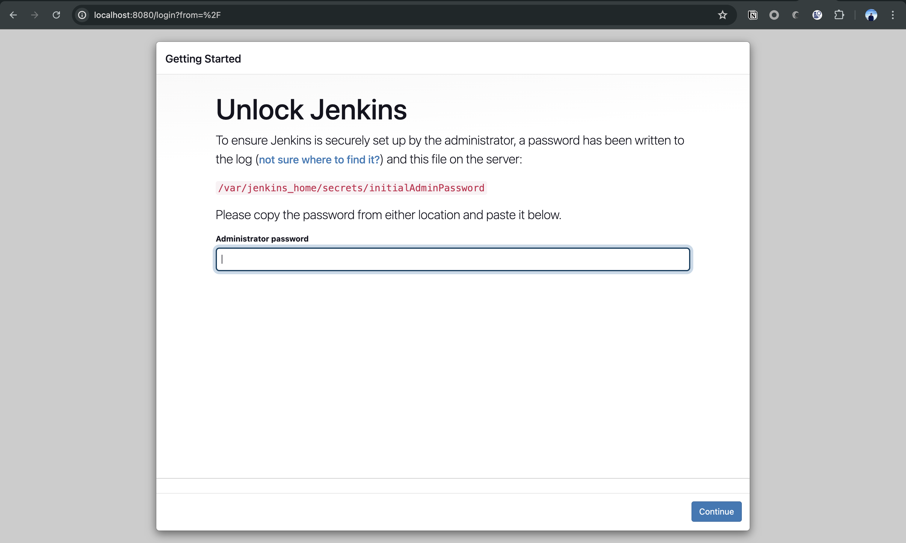
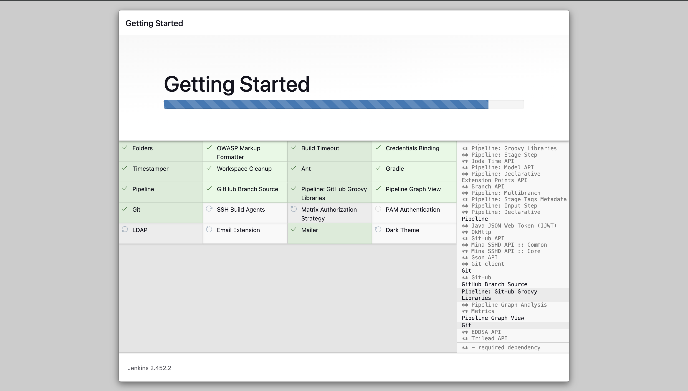
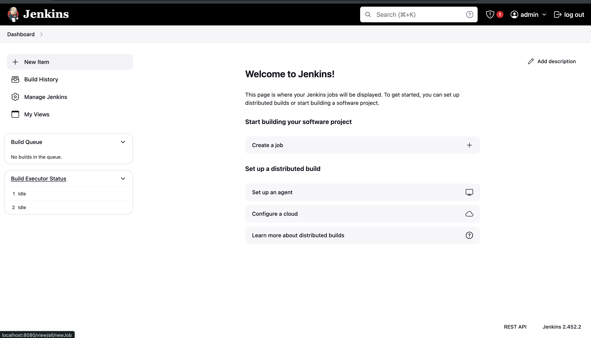
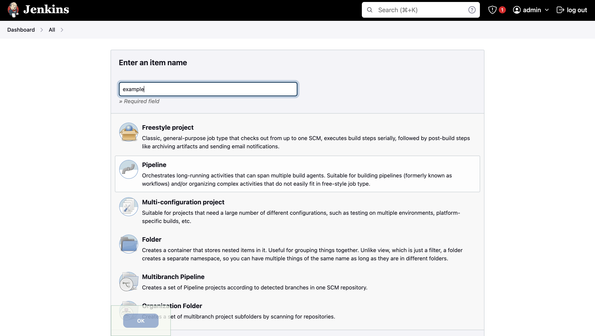
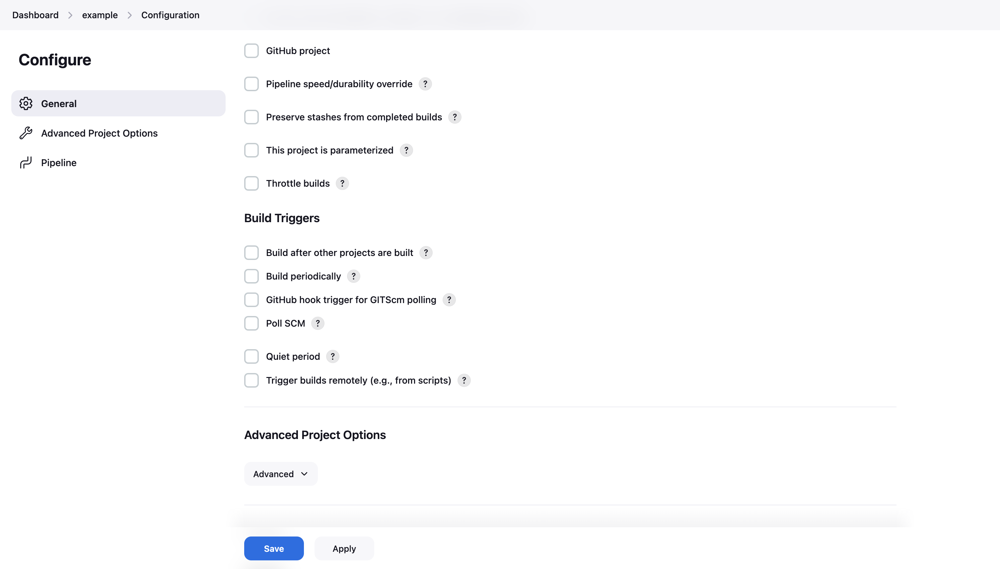

# مقدمه‌ای به CI-CD در Jenkins

## نویسنده: 
[محمد خسروی](https://github.com/muhammadKhosravi/)


## مقدمه
ابزار Jenkins یک ابزار منبع باز محبوب برای خودکارسازی فرآیندهای توسعه نرم افزار است. در این راهنما، ما ابتدا jenkins را با استفاده از ابزارهای docker و docker-compose راه‌اندازی می‌کنیم و سپس یک pipeline ساده برای مثال ایجاد می‌کنیم. 

**توجه داشته باشید که لازم است Docker را بر روی سیستم خود نصب کرده باشید.**

## راه‌اندازی Jenkins

یک فایل به نام `docker-compose.yml` ایجاد کرده و محتوای آن را به صورت زیر قرار می‌دهیم:

```yml
services:
  jenkins:
    image: jenkins/jenkins:lts
    privileged: true
    user: root
    ports:
      - 8080:8080
      - 50000:50000
    container_name: jenkins
    volumes:
      - jenkins_home:/var/jenkins_home

volumes:
  jenkins_home:
```


سپس دستور زیر را اجرا کنید:
```bash
docker compose up -d
```

**اگر در pull کردن image دچار خطای ۴۰۳ شدید، می‌توانید اسم image را به `registry.docker.ir/jenkins/jenkins:lts` تغییر دهید تا از یک registry داخلی برای pull کردن image استفاده شود.**

پس از اجرای این دستور، سرور جنکنیز باید در آدرس `localhost:8080` قابل دسترسی باشد.

برای به دست آوردن رمز عبور یوزر admin، دستور زیر را اجرا کنید.

```bash
docker compose logs
```
پس از آن پیامی شبیه پیام زیر مشاهده خواهید کرد:

```txt
Jenkins initial setup is required. An admin user has been created and a password generated.
Please use the following password to proceed to installation:

[password]
```

رمز عبور نشان داده شده را در پنل jenkins وارد کنید.
سپس گزینه‌ی install suggested plugins را انتخاب کنید. سپس صبر کنید تا دانلود plugin ها تمام شود.






سپس اطلاعات مربوطه برای یوزر admin را مطابق میل خود وارد کنید. در صفحه بعدی هم دکمه save and finish را بزنید. در نهایت سرور جنکینز شما آماده است!


## ساخت یک pipeline


از منوی بالا، سمت راست، گزینه‌ی New Item را انتخاب کنید.



سپس یک نام برای pipeline انتخاب کنید و گزینه pipeline را انتخاب کنید.



در ادامه، در بخش pipeline، در script، کد زیر را قرار می‌دهیم: 

```groovy
pipeline {
    agent any
    stages {
        stage('Clone Repository') {
            steps {
                checkout scmGit(
                    branches: [[name: 'main']],
                    userRemoteConfigs: [[url: 'https://github.com/MuhammadKhosravi/ci-cd-test.git']])
            }
        }
        stage('Run Tests') {
            steps {
                // here you can run your sample tests
                sh """
                    ls
                    echo "Running Tests..."
                """
            }
        }
        stage('Deploy') {
            steps {
                // you can connect to your server in here and deploy the current release
                sh  """
                    echo "Deploying..."
                """
            }
        }
    }
}
```
پس از آن هرگاه روی Build Now در سمت چپ کلیک کنیم، یک pipeline جدید اجرا می‌شود. 


همانطور که در پایپلاین بالا مشاهده می‌کنید، می‌توان از این پایپلاین برای اجرای تست‌ها، build کردن پروژه، وصل شدن به سرور و استقرار نسخه جدید بر روی آن استفاده کرد.


### چگونه اجرا شدن pipeline
همانطور که در شکل زیر مشاهده می‌کنید، گزینه‌های بسیاری برای اجرا شدن اتوماتیک پایپلاین بعد از trigger های مختلف وجود دارند.



در اینجا چهارمورد از آن‌ها را توضیح می‌دهیم: 

تغییرات SCM (SCM Changes (Git Push, Pull Request, etc.)):
هنگامی که تغییراتی در یک مخزن گیت به وجود می‌آید (مثلا یک کامیت جدید)
جنکینز به صورت خودکار پایپلاین را اجرا می‌کند.

‌برنامه ریزی شده (Build periodically):
می‌توان مشخص کرد که در بازه‌های مشخص، پروژه بیلد شود. به عنوان مثال، هر روز ساعت ۹ صبح.


محرک‌های خارجی (Remote Trigger): 
این مورد تا حدی به این موضوع برمی‌گردد که از چه remote repository provider ای استفاده می‌کنید.
به عنوان مثال در github می‌توانید یک webhook تعریف کنید که هنگام انجام یک تغییر، آن را فراخوانی کند تا یک pipeline اجرا شود.

### منابع
- https://plugins.jenkins.io/git/
- https://medium.com/@eloufirhatim/install-jenkins-using-docker-e76f41f79682
- https://www.jenkins.io/doc/book/pipeline/

