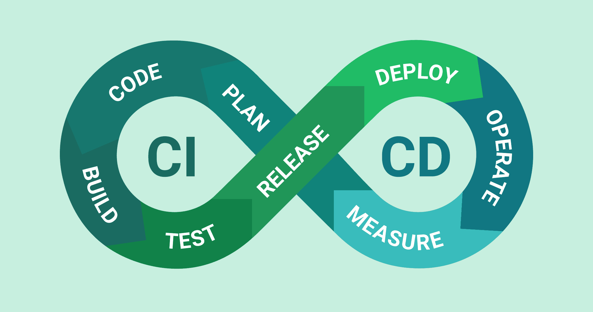
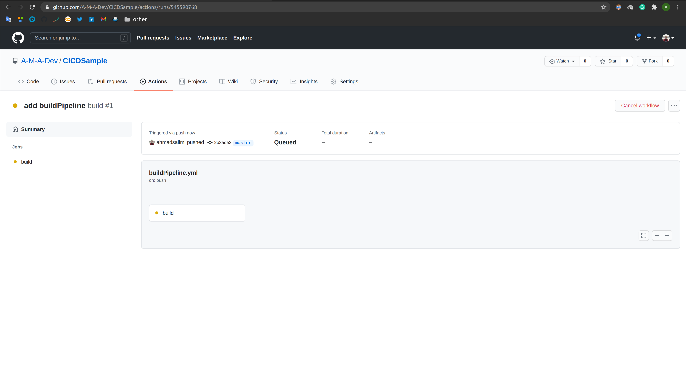
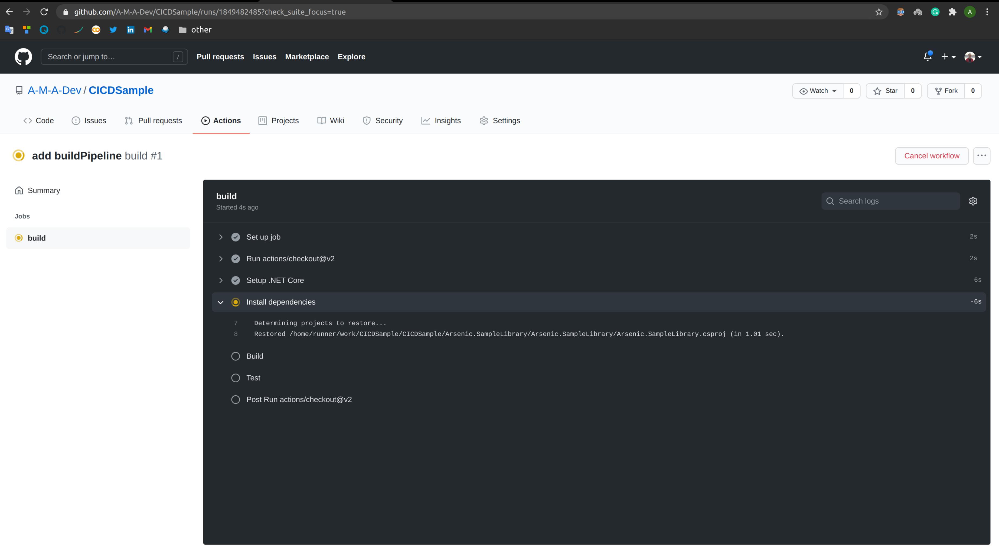
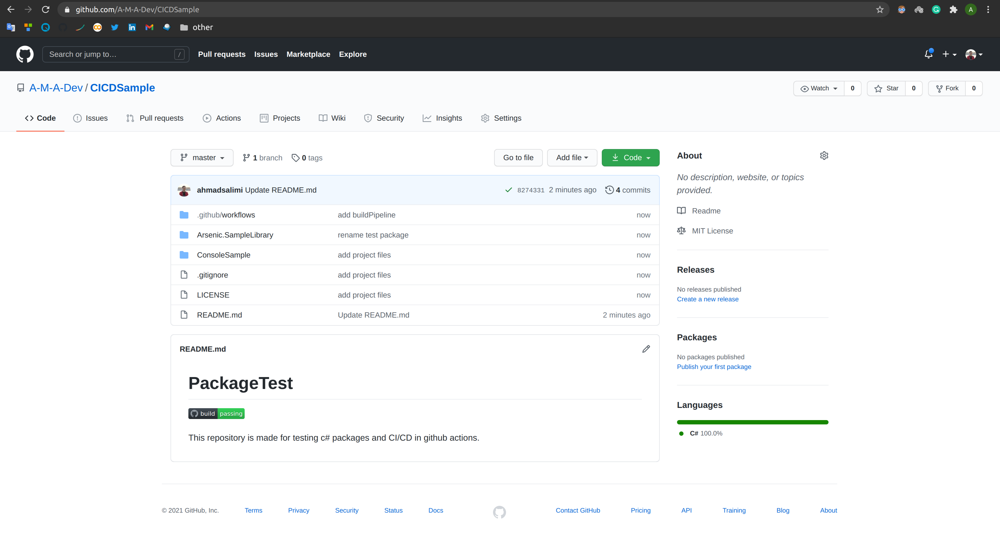
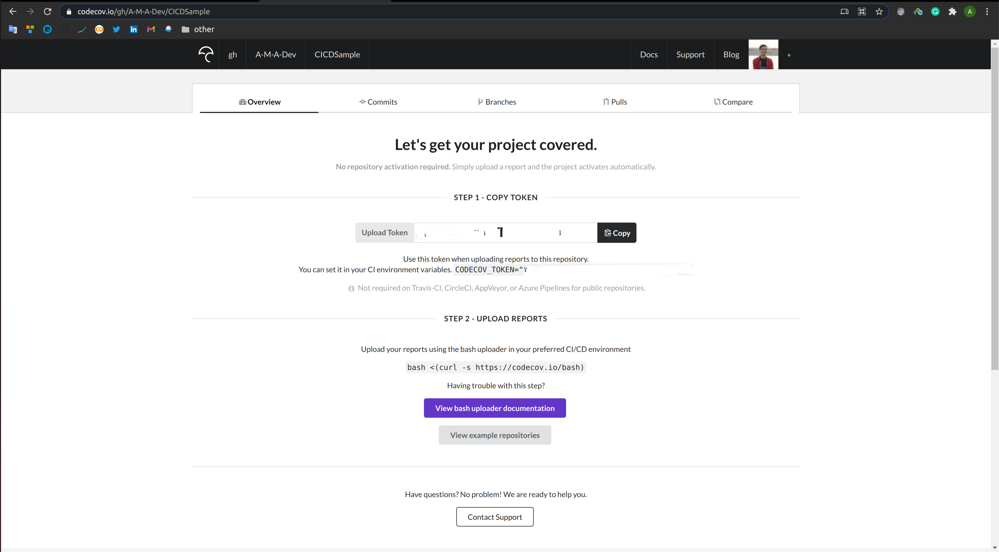
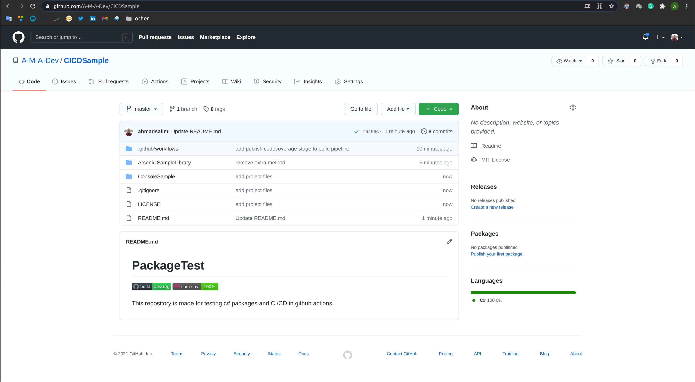
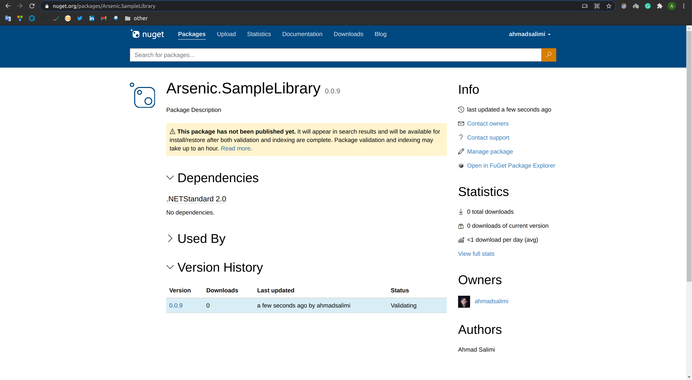

<div dir="rtl" align='justify'>

# 

<h1 align="center">
افزودن CI/CD به یک کتابخانهٔ Net.
</h1>

<div align="center">
  <i>
    نویسندگان:
    <a href="https://github.com/ahmadsalimi">
    احمد سلیمی
    </a>
    -
    <a href="https://github.com/ArmanZarei">
    آرمان زارعی
    </a>
    -
    <a href="https://github.com/Mobinapournemat">
    مبینا پورنعمت
    </a>
  </i>
</div>

<hr>

<div align="center">

</div>


1. CI/CD چیست و چرا اهمیت دارد:

    از طریق لینک‌های زیر، می‌توانید درمورد مفهوم
    CI/CD
    و اهمیت آن مطالعه کنید.

    <div dir="ltr">

    - [What is CI/CD?](https://medium.com/tilicholabs/what-is-ci-cd-c7c047b80e6b)
    - [What’s the Point of CI Anyway?](https://medium.com/swlh/whats-the-point-of-ci-anyway-ac3f9eaa244c)
    - [The Journey to CI/CD](https://medium.com/driven-by-code/the-journey-to-ci-cd-b1872927c36b)

    </div>

1. آشنایی با GitHub Actions و اضافه کردن CI/CD Pipeline به ریپازیتوری:

    یکی از ابزار CI/CD
    معروف، GitHub Actions
    است که به کمک آن، می‌توانیم یک Pipeline
    شامل عملیات build،
    اجرای unit test
    ها و همچنین انتشار package
    و دیگر عملیاتی که در دستهٔ CI/CD
    می‌گنجد را به ریپازیتوری گیت‌هاب خود اضافه کنیم.
    
    این کار، برر روی یک کتابخانهٔ آزمایشی که به زبان
    #C
    نوشته شده است و در
    [این ریپازیتوری](https://github.com/A-M-A-Dev/CICDSample)
    موجود است انجام شده است و می‌توانید کدها و تنظیمات مربوطه را در این ریپازیتوری ببینید. مراحل افزودن
    CI/CD
    بصورت زیر می‌باشد.

    1. فایلی در مسیر زیر در ریپازیتوری خود می‌سازیم:

        <div dir="ltr">

        ```
        .github/workflows/buildPipeline.yml
        ```

        </div>

    1. برای pipeline خود یک نام تعریف می‌کنیم: (به فایل `buildPipeline.yml` اضافه کنید.)

        <div dir="ltr">

        ```yml
        name: build
        ```

        </div>

    1. مشخص می‌کنیم که pipeline در هنگام push و pull request روی master اجرا شود.

        <div dir="ltr">

        ```yml
        on:
          push:
            branches: [ master ]
          pull_request:
            branches: [ master ]
        ```

        </div>

    
    1. مراحل Pipeline را به ترتیب تعریف می‌کنیم. در ابتدا مشخص می‌کنیم که pipeline روی آخرین ورژن ubuntu اجرا شود: (می‌توان آن را تغییر داد)

        <div dir="ltr">

        ```yml
        jobs:
          build:
            runs-on: ubuntu-latest
        ```

        </div>
    
    1. در این مرحله مشخص می‌کنیم که CI از agent ای به نام `actions/checkout@v2` استفاده کند: (برای مطالعه بیشتر [این](https://www.edwardthomson.com/blog/) لینک را بخوانید.)

        <div dir="ltr">

        ```yml
            steps:
            - uses: actions/checkout@v2
        ```

        </div>
    
    1. در این مرحله مشخص می‌کنیم که .Net core 3.1 نصب شود.

        <div dir="ltr">

        ```yml
            - name: Setup .NET Core
              uses: actions/setup-dotnet@v1
              with:
                dotnet-version: 3.1.301
        ```

        </div>
    
    1. سپس dependency های پروژه restore شوند:‌ (دقت کنید که به جای `<path to solution>` آدرس فولدر solution خود را مشخص کنید.)

        <div dir="ltr">

        ```yml
            - name: Install dependencies
              run: dotnet restore
              working-directory: <path to solution>
        ```

        </div>
    
    1. solution را build می‌کنیم.

        <div dir="ltr">

        ```yml
            - name: Build
              run: dotnet build --configuration Release --no-restore
              working-directory: <path to solution>
        ```

        </div>
    
    1. تست‌ها را run می‌کنیم.

        <div dir="ltr">

        ```yml
            - name: Test
              run: dotnet test --no-restore --verbosity normal --collect:"XPlat Code Coverage"
              working-directory: <path to solution>
        ```

        </div>
    
        تبریک! CI
        شما آماده‌است. فایل را commit
        کرده و روی master
        پوش کنید.

        در ریپازیتوری خود وارد منوی Actions
        شوید؛ همانطور که مشاهده می‌کنید، Pipeline
        شما در حال اجرا است:
        
        

        با ورود به بخش build
        با تصویر زیر مواجه می‌شوید که پیشرفت CI
        را نشان می‌دهد:

        

    1. افزودن badge وضعیت CI به README:

        از این قسمت دکمهٔ Copy status badge Markdown
        را انتخاب کرده و متن کپی‌شده را به README
        ریپازیتوری خود اضافه کنید.

        

        می‌توانید وضعیت Pipeline
        را در هر لحظه مشاهده کنید:

        
    
    1. افزودن مشاهده وضعیت code coverage:

        با اکانت GitHub
        خود در سایت [codecov.io](https://codecov.io)
        وارد شوید. سپس به این آدرس بروید:

        <div dir="ltr">

        ```
        https://codecov.io/gh/<github-username>/<repo-name>
        ```

        </div>

        

        توکن Codecov
        خود را کپی کرده، در Secretهای
        ریپازیتوری خود با نام CODECOV_TOKEN
        اضافه کنید.

    1. بخش زیر را به فایل `buildPipeline.yml` اضافه کنید:

        <div dir="ltr">

        ```yml
            - name: Publish code coverage reports to codecove.io
              uses: codecov/codecov-action@v1
              with:
                token: ${{ secrets.CODECOV_TOKEN }}
                files: ./**/coverage.cobertura.xml
                fail_ci_if_error: true
        ```

        </div>
    
    1. مارکدان زیر را به Readme
    ریپازیتوری خود اضافه کنید تا
    Badge
    مربوط به
    Code Coverage
    نیز نمایش داده شود.
    (
      جای
      github-username
      و
      repo-name
      اطلاعات خود را وارد کنید.
    )

        <div dir="ltr">

        ```
        [](https://codecov.io/gh/<github-username>/<repo-name>)
        ```

        </div>
        اکنون مشاهده خواهید کرد که در هر لحظه، وضعیت code coverage
        شما نیز نمایش داده می‌شود:

        

        تا به اینجای کار، کل فایل `buildPipeline.yml`
        باید بصورت زیر باشد:

        <div dir="ltr">

        ```yml
        name: build

        on:
          push:
            branches: [ master ]
          pull_request:
            branches: [ master ]
        
        jobs:
          build:
            runs-on: ubuntu-latest

            steps:
            - uses: actions/checkout@v2

            - name: Setup .NET Core
              uses: actions/setup-dotnet@v1
              with:
                dotnet-version: 3.1.301
            
            - name: Install dependencies
              run: dotnet restore
              working-directory: <path to solution>

            - name: Build
              run: dotnet build --configuration Release --no-restore
              working-directory: <path to solution>

            - name: Test
              run: dotnet test --no-restore --verbosity normal --collect:"XPlat Code Coverage"
              working-directory: <path to solution>

            - name: Publish code coverage reports to codecove.io
              uses: codecov/codecov-action@v1
              with:
                token: ${{ secrets.CODECOV_TOKEN }}
                files: ./**/coverage.cobertura.xml
                fail_ci_if_error: true
        ```

        </div>

    
    1. انتشار package در [NuGet.org](https://nuget.org):

        NuGet،
        پکیج منیجر معروف مایکروسافت برای انتشار پکیج‌های Net.
        است. برای کسب اطلاعات بیشتر،
        [این](https://docs.microsoft.com/en-us/nuget/what-is-nuget)
        لینک را مطالعه کنید. در این مرحله، می‌خواهیم یک Pipeline
        جدید بسازیم که هنگام release
        یک ورژن در ریپازیتوری، پکیج را در [NuGet.org](https://nuget.org)
        منتشر کند. پیش از شروع، اکانت خود را در سایت
        [NuGet.org](https://nuget.org)
        ساخته و
        Token
        مربوط به اکانت خود را در
        Secret
        های ریپازیتوری با نام
        NUGET_API_KEY
        ذخیره کنید.

        ابتدا باید مشخصات package
        را در فایل `csproj.`
        مربوط به پروژهٔ خود مشخص کنید. بدین منظور، این فایل باید به صورت زیر باشد:

        <div dir="ltr">

        ```xml
        <Project Sdk="Microsoft.NET.Sdk">

            <PropertyGroup>
                <TargetFramework>netstandard2.0</TargetFramework>
                <PackageId>[LibraryName]</PackageId>
                <Authors>[TeamMembers]</Authors>
                <Company>[Company Name]</Company>
            </PropertyGroup>

        </Project>
        ```

        </div>
        
        در ادامه، برای ساخت Pipline
        مربوط به publish،
        فایل زیر را می‌سازیم:

        <div dir="ltr">

        ```
        .github/workflows/publishPipeline.yml
        ```

        </div>

        سپس مراحل زیر را به آن اضافه می‌کنیم:

        - نام، trigger
        و OS
        مربوط به pipeline
        را مشخص می‌کنیم.

        <div dir="ltr">

        ```yml
        name: publish

        on:
          release:
            types:
              published

        jobs:
          publish:
            runs-on: ubuntu-latest

        ```

        </div>
        
        - نصب .Net Core:

        <div dir="ltr">

        ```yml
            steps:
            - uses: actions/checkout@v2

            - name: Setup .NET Core
              uses: actions/setup-dotnet@v1
              with:
                dotnet-version: 3.1.301
        ```

        </div>
        
        - گرفتن ورژن release
        کنونی. توجه کنید که تگ release
        بعنوان ورژن به NuGet
        داده می‌شود. در نتیجه، الگوهای قابل قبول ورژن را از
        [اینجا](https://docs.microsoft.com/en-us/nuget/concepts/package-versioning)
        بخوانید و تگ را مطابق این الگو بزنید.

        <div dir="ltr">

        ```yml
            - name: Get current release version
              id: version
              uses: pozetroninc/github-action-get-latest-release@master
              with:
                repository: <github-username>/<repo-name>
        ```

        </div>

        - build و ساخت پکیج NuGet
        (به جای `<path to classlib project>`
        آدرس فولدری را که فایل `csproj.`
        مربوط به پروژه class library
        در آن قرار دارد بنویسید.)

        <div dir="ltr">

        ```yml
            - name: Build library and generate NuGet Package
              run: dotnet pack -c Release -o artifacts -p:PackageVersion=${{ steps.version.outputs.release }}
              working-directory: <path to classlib project>
        ```

        </div>

        - انتشار پکیج NuGet

        <div dir="ltr">

        ```yml
            - name: Publish NuGet Package
              run: dotnet nuget push ./**/*.nupkg -k ${{ secrets.NUGET_API_KEY }} -s https://api.nuget.org/v3/index.json
        ```

        </div>

        از این پس، هر گاه در ریپازیتوری خود تگ بزنید، Pipeline
        فوق trigger
        می‌شود و در نتیجه پکیج شما push
        می‌شود. همچنین در منوی Actions
        می‌توانید وضعیت publish
        را مشاهده کنید. پکیج منتشر شدهٔ خود را نیز می‌توانید در آدرس زیر مشاهده کنید:
        
        <div dir="ltr">

        ```
        nuget.org/packages/[PackageId]
        ```

        </div>

        
    
    همانطور که در ابتدا نیز گفته شد، نمونه فایل‌های pipeline
    ها و یک پروژه class library
    و xunit
    نمونه، در
    [این ریپازیتوری](https://github.com/A-M-A-Dev/CICDSample)
    موجود می‌باشد.

    از این پس، می‌توانید در هر پروژه دیگری، از این پکیج استفاده کنید. با استفاده از دستور زیر، می‌توانید پکیج خود را به هر پروژه‌ای اضافه کنید.

    <div dir="ltr">

    ```
    dotnet add package [packageId]
    ```

    </div>

    با این command،
    پکیج به پروژه شما اضافه می‌شود و می‌توانید از کلاس‌های آن استفاده کنید. همچنین اگر پکیج خود را update
    کرده باشید، با اجرای این command،
    نسخه جدید پکیج به پروژه شما اضافه می‌شود.
    (نمونهٔ اضافه کردن پکیج به پروژه را می‌توانید در پوشهٔ
    ConsoleSample
    از ریپازیتوری مذکور مشاهده کنید.)

</div>
