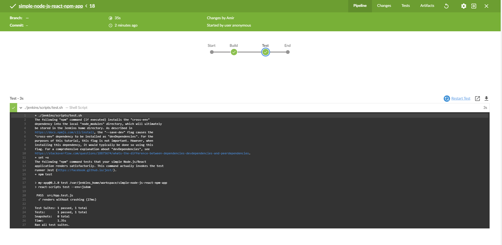

<h1 dir = "rtl" align = "center">به نام خدا</h1>

<h1 dir = "RTL">
    معرفی CI/CD و DevOps
</h1>

<p dir = "RTL">
    احتمالا تا به حال حتی اگر با لفظ DevOps و CI/CD آشنایی نداشته باشید، به عنوان فردی که وارد دنیای بزرگ برنامه‌نویسی شده است، با این لغت برخورد کرده‌اید. در این مطلب می‌خواهیم به طور مختصر به معرفی این اصطلاحات پرداخته و سپس در قالب یک آموزش عملی با نرم‌افزار Jenkins یک نمونه از این فرایندها را به طور ساده با استفاده از یک نمونه React و Node.js انجام بدهیم. 
</p>

<p dir = "RTL">
    ابتدا به معرفی لغت CI می‌پردازیم. این دو حرف مخفف Continous Integration یا یکپارچه‌سازی پیوسته هستند. در عمل این لغت به معنی مرج کردن و ترکیب کردن کار انجام شده توسط توسعه‌دهندگان مختلف برنامه روی خط سرویس اصلی ریپازیتوری برنامه است. این عمل در حالت ایده‌آل چند بار در هر روز از دوره توسعه یک نرم‌افزار انجام می‌شود.
    <br/>
    در واقعیت توسعه دهندگان روی کدهای خود، کار می‌کنند و بعد از مدتی باید این کدها را به ریپازیتوری اصلی برنامه کامل بفرستند تا با کد سایر توسعه‌دهندگان هماهنگ شود. نکته این‌جاست که گاهی اوقات برای مدت زیادی کد بدون ارسال شدن به شاخه اصلی ریپازیتوری روی سیستم توسعه‌دهنده گسترش پیدا می‌کند و بعد هنگام فرستاده شدن به خط اصلی، در هنگام ترکیب دچار مشکل می‌شود و باید تداخل‌های مختلفی که ممکن است بین این کد و کد سایر برنامه‌نویسان ایجاد شده است را برطرف کرد. فرآیند CI برای این بوجود آمده است تا این کارها به شکل منسجم‌تر و سریع‌تری انجام بگیرند تا جلوی پیش آمدن شرایطی موسوم به "Merge Hell" که برنامه‌نویس را مجبور به بررسی تداخل‌های بسیار زیاد با کد سایر توسعه‌دهندگان می‌کند، گرفته شود.
</p>

<p dir = "RTL">
    از سوی دیگر CD که مخفف Continuous Delivery به معنی تحویل پیوسته است، به فرآیندی گفته می‌شود که در آن تیم سازنده، نرم افزار قابل اجرا را در بازه‌های زمانی کوتاه تولید می‌کنند. بدین ترتیب می‌توان مطمئن بود که امکان منتشر کردن برنامه در هر زمانی وجود دارد. هدف این کار در اصل ساخت فایل یا برنامه قابل اجرا (Build کردن) تست آن و در نهایت انتشار نرم‌افزار با سرعت بالا و دوره زمانی کوتاه بین هر دفعه انتشار است. این کار باعث می‌شود که باعث کاهش هزینه، زمان و ریسک ارائه تغییرات جدید در نرم افزار می‌شود.
    <br/>
    گاهی اوقات CD مخفف Continuous depoloyment نیز در نظر گرفته می‌شود. فرق اساسی این دو مورد با هم، در این است که در حالت Continuous Delivery انتشار برنامه به صورت دستی و توسط خود سازندگان است ولی در حالت Continuous Deployment انتشار برنامه و اصطلاحا Deploy شدن آن هم به صورت اتوماتیک و خودکار انجام می‌گیرد.  
</p>

<p dir = "RTL">
    گاهی اوقات فرآیند CD با DevOps اشتباه گرفته می‌شود و این دو به جای هم به کار می‌روند اما باید توجه داشت که این دو موضوع با یک‌دیگر تفاوت دارند. DevOps در اصل دامنه گسترده‌تری دارد و شامل تغییرات و همکاری تیم‌های مختلفی که در ارائه نرم‌افزار نقش دارند شامل توسعه‌دهندگان، تیم عملیاتی، تیم تضمین کیفیت، تیم مدیریت و... می‌شود و در این میان شامل فرآیند Continuous Delivery هم می‌شود. از این رو می‌توان گفت که به نوعی CD از جمله کارهایی است که در نهایت می‌تواند منجر به DevOps موفق بشود و در اصل از جمله موارد DevOps موفق است اما DevOps شامل موارد گسترده‌تری هم می‌شود. به نوعی CD تنها شامل جنبه ارائه و delivery می‌شود ولی DevOps شامل کنار هم جمع کردن سایر پروسه‌ها و اجرای آن‌ها برای سرعت بخشیدن به تمامی مراحل توسعه و ارائه نرم‌افزار می‌شود.
</p>


<p dir = "RTL">
    با مقدمه بالا به سراغ بررسی نرم‌افزار Jenkins به عنوان نمونه‌ای از نرم‌افزار های مورد استفاده در فرآیند CI/CD می‌رویم و با نحوه کار آن به شکل ساده آشنا خواهیم شد.
</p>

<h1 dir = "RTL">
    پیاده سازی عملی فرآیند CI/CD با استفاده از نرم افزار Jenkins
</h1>


<p dir="rtl">
   در این آموزش قصد داریم یک اصول اولیه پروسه CI/CD را با استفاده از نرم‌افزار Jenkins و با استفاده از یک پروژه React با هم‌دیگر آموزش ببینیم
</p>


<p dir="rtl">
  آموزش زیر به طور پیش فرض برای سیستم‌عامل ویندوز نوشته شده است؛ زیرا معمولا مشکلات نصب مواردی نظیر Jenkins یا Docker روی این سیستم‌عامل بیش‌تر هستند. با تغییرات بسیار کوچک روی دستورات آن نظیر تغییر کوچک آدرس‌دهی‌ها، امکان اجرای این آموزش روی سیستم‌عامل‌های مک و لینوکس هم وجود دارد.
</p>


<h2 dir = "rtl">حداقل سیستم مورد نیاز</h2>

<p dir="rtl">
    برای این کار ابتدا توجه کنید که حداقل سیستم مورد نیاز برای اجرای برنامه Jenkins را داشته باشید
</p>

   

<ul>
    <li>Ram: 256MB</li>
    <li>HDD: 1 GB as Base Space (Actually 10GB for Docker and Jenkins)</li>
</ul>

<h2 dir = "RTL">
    نصب Jenkins و Docker
</h2>

<p dir="RTL">
    در ابتدا شما باید نرم‌افزار Docker را بسته به سیستم‌عامل خود از سایت آن دریافت و نصب کنید. برای این کار به <a href = "https://hub.docker.com/search?type=edition&offering=community">این لینک</a> مراجعه کنید و نسخه Community آن را متناسب با سیستم‌عامل خود دریافت و نصب کنید.
</p>

<p dir = "RTL">
    پس از نصب داکر، باید یک دور سیستم خود را ریستارت کنید تا فرآیند نصب کامل شود. پس از این از طریق CMD یا ترمینال دستور زیر را تایپ کنید. تا Jenkins از طریق داکر دریافت شود
</p>

```bash
docker pull jenkinsci/blueocean
```


<p dir = "RTL">
    پس از آن باید یک Bridge Network را در داکر راه‌اندازی کنیم. برای این کار دستور زیر را تایپ کنید.
</p>

```bash
docker network create jenkins
```

<p dir ="RTL">
    سپس باید volume های مناسب برای به اشتراک‌گذاری گواهی TLS کلاینت داکر را ایجاد کنیم.
</p>

```bash
docker volume create jenkins-docker-certs
docker volume create jenkins-data
```

<p dir ="RTL">
    برای این که امکان اجرای دستورات داکر را درون نودهای جنکینز داشته باشیم، باید ایمیج docker:dind را نصب کنیم. برای این کار دستورات زیر را تایپ کنید.
</p>

```bash
docker container run --name jenkins-docker --rm --detach ^
  --privileged --network jenkins --network-alias docker ^
  --env DOCKER_TLS_CERTDIR=/certs ^
  --volume jenkins-docker-certs:/certs/client ^
  --volume jenkins-data:/var/jenkins_home ^
  --volume "%HOMEDRIVE%%HOMEPATH%":/home ^
  docker:dind
```

<p dir ="RTL">
    حال باید jenkinsci/blueocean را از طریق داکر اجرا و نصب کنیم. برای این کار دستور زیر را اجرا کنید. توجه کنید که اگر در ابتدای این بخش، این پکیج را دانلود نکرده باشید، این دستور خود به خود این کار را انجام خواهد داد.
</p>

```bash
docker container run --name jenkins-blueocean --rm --detach ^
  --network jenkins --env DOCKER_HOST=tcp://docker:2376 ^
  --env DOCKER_CERT_PATH=/certs/client --env DOCKER_TLS_VERIFY=1 ^
  --volume jenkins-data:/var/jenkins_home ^
  --volume jenkins-docker-certs:/certs/client:ro ^
  --volume "%HOMEDRIVE%%HOMEPATH%":/home ^
  --publish 8080:8080 --publish 50000:50000 jenkinsci/blueocean
```


<p dir ="RTL">
    حال باید به فرآیند نصب خود جنکینز بپردازیم. احتمالا باید یک‌سری *** روی cmd شما ظاهر شده باشد که در میان آن یک پسورد قرار گرفته است. در صورتی که این اتفاق  نیفتاده است یک بار دیگر دستور بالا را اجرا کنید تا نتیجه‌ای مانند زیر بگیرید.
</p>

```bash
docker: Error response from daemon: Conflict. The container name "/jenkins-blueocean" is already in use by container "c83d61cbd1b4dd12e3d634cb9ef49cfc425e6d4f7d89ffaa35ee60176b7815e1". You have to remove (or rename) that container to be able to reuse that name.
```

<p dir = "RTL">
    حال آی‌دی داکر نوشته شده را کپی کرده و در دستوری زیر به جای &lt container &gt در کد زیر قرار بدهید تا در خروجی پسورد را مشاهده کنید.
</p>

```bash
docker exec <container> cat /var/jenkins_home/secrets/initialAdminPassword
```

<p dir=RTL>
    حال در مرورگر به آدرس localhost:8080 رفته تا صفحه نصب جنکینز ظاهر شود. پسوردی که به‌دست آوردید را در آن جا وارد کنید. در صفحه بعد گزینه Install Suggested Plugins را انتخاب نمایید. سپس منتظر باشید تا پلاگین های پیشنهادی خود جنکینز نصب شوند. سپس منتظر باشد تا صفحه بعدی ظاهر شود.
</p>


<p dir ="RTL">
    هنگامی که صفحه Create First Admin User ظاهر شد، مشخصات مد نظر خود اعم از نام کاربری، پسورد، ایمیل و نام را وارد کنید. و با کلیک بر روی Save and Finish و رفتن به صفحه بعد و مجددا کلیک بر روی آن، مراحل نصب اولیه جنکیز را به پایان برسانید. در این مرحله باید عبارت Jenkins is ready! برای شما نمایش داده شود. در صورتی که عبارت Jenkins is almost ready نمایش داده شد، بر روی گزینه Restart کلیک کنید و منتظر باشید. در صورتی که بعذ از یک دقیقه اتفاقی نیفتاد، خودتان صفحه مرورگر را رفرش کنید.
</p>


<p dir ="RTL">
    در صورتی که بخواهید جنکینز را متوقف کنید، دستور زیر را اجرا کنید. بعدا می توانید با دستور طولانی docker container run ... که بالاتر نوشته شده است، دوباره آن را اجرا کنید.
</p>

```bash
container stop jenkins jenkins-docker.
```

<h2 dir="RTL">
    FORK و Clone کردن ریپازیتوری نمونه گیت‌هاب
</h2>

<p dir="RTL">
    حال می‌خواهیم یک نمونه از کار با جنکینز را روی React نشان بدهیم.
</p>

<ol dir ="RTL">
  <li>به سایت <a href="https://github.com">Github</a> بروید و وارد اکانت خود شوید. در صورتی که اکانتی ندارید، یک اکانت جدید ایجاد نمایید</li>
    <li>به صفحه <a href="https://github.com/jenkins-docs/simple-node-js-react-npm-app">simple-node-js-react-npm-app</a> رفته و بر روی گزینه fork کلیک کنید تا این صفحه روی اکانت شما هم فورک شود و بتوانید مستقل از صفحه اصلی، روی اکانت خود به طور جداگانه به آن دسترسی داشته باشید. </li>
    <li>حال باید صفحه ساخته شده را کلون کنید. برای این که در طول آموزش دستورات خیلی عوض نشوند، ترمینال یا CMD را باز کرده و بسته به سیستم‌عامل خود به یکی از و با دستور cd آدرس‌های زیر بروید:</li>
    <ul dir ="LTR">
        <li>macOS -  /Users/&lt your-username&gt/Documents/GitHub/</li>
        <li>linux - /home/&lt your-username&gt/GitHub/</li>
            <li>Windows C:\Users\&lt your-username&gt\Documents\GitHub\ </li>
        </ul>
                 <li>سپس دستور زیر را اجرا کنید:</li>
</ol>


​                


```bash
git clone https://github.com/YOUR-GITHUB-ACCOUNT-NAME/simple-node-js-react-npm-app
```
<p dir="RTL">
    که در آن YOUR-GITHUB-ACCOUNT-NAME آدرس صفحه گیت‌هاب شماست.
</p>


<h2 dir="RTL">
    درست کردن 
    پروژه پایپ‌لاین در جنکینز 
</h2>

<ol dir = "RTL">
    <li>در محیط جنکینز، بر روی گزینه create new jobs که زیر عبارت Welcome to Jenkins است کلیک کنید. در صورتی که آن را مشاهده نمی کنید، روی گزینه New Item در گوشه سمت چپ کلیک نمایید.</li>
    <li>در فیلد Enter an item Name نام مد نظر برای پروژه پایپ‌لاین را مشخص کنید. (مثلا: simple-node-js-react-npm-app)</li>
    <li>بر روی گزینه Pipeline در لیستی که به نمایش در آمده کلیک کرده و سپس روی OK کلیک نمایید.</li>
    <li>در صفحه بعد، می توانید توضیحاتی در مورد پروژه خود بنویسید. این بخش اختیاری است و نیازی به پر کردن الزامی آن نیست.</li>
    <li>بر روی تب Pipeline در بالای صفحه کلیک کنید تا به بخش مربوط به آن در پایین صفحه هدایت شوید. در این قسمت برای Definition گزینه Pipeline script from SCM را انتخاب نمایید.</li>
    <li>از بخش SCM، گزینه Git را انتخاب نمایید</li>
    <li>در بخش Repository URL آدرس ریپازیتوری محلی که روی کامپیوتر خود ایجاد کردید را وارد نمایید. اگر طبق راهنما پیش رفته باشید، این بخش با توجه به تطابق کردن با سیتسم جنکینز برای هر سیستم عامل به صورت زیر خواهد بود:</li>
    <ul dir ="LTR">
        <li>macOS -  /home/Documents/GitHub/</li>
        <li>linux - /home/GitHub/</li>
            <li>Windows - /home/Documents/GitHub/simple-node-js-react-npm-app </li>
      </ul>
    <li>سپس بر روی گزینه Save کلیک کنید تا پروژه پایپ‌لاین خود را ذخیره نمایید. از این پس فایل‌های JenkinsFile خود را ایجاد خواهید کرد که روی کلون محلی که از صفحه گیت‌هاب تهیه کرده‌اید، ذخیره خواهند شد.</li>
</ol>


<h2 dir="RTL">
    خلق Pipeline اولیه در قالب یک JenkinsFile
</h2>


<p dir="RTL">
    حال آماده‌ایم تا اولین پایپ‌لاین خودمان را که فرایند Build شدن پروژه Node.js و React ما را خودکار خواهد کرد در نرم افزار Jenkins بنویسم. پایپ‌لاین های ما در قالب فایل‌های JenkinsFile ساخته خواهند شد و در ریپازیتوری محلی Git ای که ساختیم ‌Commit خواهند شد.
</p>

<p dir ="RTL">
    کاری که در این‌جا انجام خواهیم داد، در اصل پایه الگوی "Pipeline-as-Code" است که در جنکیز پیاده سازی می‌شود. در این روش، سیستم پایپ‌لاین ارائه پیوسته (Continous Delivery یا CD) به عنوان بخشی از نرم افزار در نظر گرفته می‌شوند که ورژن بندی و بازیبینی آن مانند سایر کدهای دیگر خواهد بود. در مورد این مفهوم می‌توانید در <a href="https://jenkins.io/doc/book/pipeline/">این صفحه</a> بیش تر مطالعه کنید.
</p>

<p dir="RTL">
    در ابتدا، باید پایپ‌لاین اولیه ای را بسازیم که ایمیج داکر Node را دانلود کرده و از آن به عنوان یک کانتینر داکر استفاده می‌کند و بدین وسیله، پروژه ساده Node.js و React شما را می‌سیازد. همچنین یک مرحله (Stage) به نام Build هم اضافه می‌کنیم که مراحل Build شدن پروژه را خودکارسازی خواهد کرد. برای این کار به ترتیب زیر عمل خواهیم کرد:
</p>

<p dir = "RTL">با استفاده از یک ویرایشگر متن یا IDE، درون روت ریپازیتوری گیت محلی خود که simple-node-js-react-npm-app نام دارد، یک فایل متنی با نام Jenkinsfile ایجاد کنید.</p>

<p dir = "RTL">
    توجه کنید که فایل Jenkinsfile هیچ پسوندی نظیر .txt نباید داشته باشد. یعنی به نوعی یک فایل بدون پسوند است.
</p>

<p dir = "RTL">
    کد زیر را درون این فایل متنی بنویسید:
</p>


```shell
pipeline {
    agent {
        docker {
            image 'node:latest' 
            args '-p 3000:3000' 
        }
    }
    stages {
        stage('Build') { 
            steps {
                sh 'npm install' 
            }
        }
    }
}

```


<p dir = "RTL">
    بخش های مختلف این کد بدین صورت هستند:
</p>

<ol dir="RTL">
    <li>پارامتر image مشخص می‌کند که باید ایمیج داکر node:6-alpine دانلود بشود و به عنوان یک کانتینر جداگانه اجرا شود. این بدین معنی است که جنکینز و نود در کانتینر های جداگانه اجرا خواهند شد و Node تبدیل به agent ای می‌شود که جنکیز از آن برای اجرای پروژه شما استفاده خواهد کرد.</li>
    <li>پارامتر args باعث می‌شود که کانتینر Node به طور موقت تا زمانی که پروژه در حال اجرا توسط جنکینز است، از طریق پورت 3000 قابل دسترس باشند. </li>
    <li>این بخش تعریف کننده یک stage به نام Build است که در رابط کاربری جنکینز برای شما نمایش داده خواهد شد.</li>
    <li>این قسمت که در بخش steps قرار دارد، باعث می‌شود که یک فرمان shell که در این جا دستور npm install است اجرا شده و همه نیازمندی هایی که برای اجرای اپلیکیشن لازم است را درون پوشه node_modules دانلود کند.</li>
</ol>

<p dir ="RTL">
فایل Jenkinsfile که ساخته اید را ذخیره کنید. سپس با ترمینال یا Git Bash به پوشه ریپازیتوری رفته و دستوارت <span dir = "LTR">git add .</span>  و <span dir = "LTR">git commit -m "Add initial Jenkinsfile"</span> را اجرا نمایید.
</p>


<p dir = "RTL">
    به جنکینز باز گردید و در صورت لزوم دوباره لاگین کرده و بر روی Open Blue Ocean در گوشه سمت جپ کلیک کنید تا به رابط Blue Ocean دسترسی پیدا کنید.
</p>

<p dir = "RTL">
    پیام This job has not been run ظاهر می‌شود. بر روی Run کلیک کرده و سپس سریعا بر روی لینک OPEN که ظاهر می‌شود کلیک کنید. در صورتی که بر روی این لینک کلیک نکردید، بر روی سطر مربوطه در رابط کاربری Blue Ocean کلیک کنید تا به این بخش دسترسی پیدا کنید.
</p>

<p dir= "RTL">
    توجه کنید که در دفعه اول به دلیل دانلود شدن یکسری موارد مربوط به react باید مدتی منتظر بمانید. در اصل با کلیک بر روی گزینه Run مراحل به ترتیب زیر اجرا می‌شود.
</p>

<ol dir = "RTL">
    <li>پروژه زمان بندی می‌شود تا روی agent که در این جا Node خواهد بود اجرا شود.</li>
    <li>داکر ایمیج مربوط به Node را دانلود کرده و آن را روی یک کانتینر در داکر اجرا می‌کند.</li>
    <li>استیج Build که در فایل Jenkinsfile تعریف شده، روی کانتینر Node اجرا می‌شود. در این مرحله، npm که در اصل مخفف node package manager است، موارد و dependency های لازم برای اجرای Node.js و React را دانلود کرده و به پوشه node_modules اضافه می‌کند.</li>
</ol>

<p dir = "RTL">
    حتما توجه کنید که ممکن است در دفعات اول به دلیل مشکل اینترنت، کار با مشکل رو به رو شود و مجبور باشید که دوباره فرآیند را از ابتدا تکرار کنید. مراحلی که مشاهده خواهید کرد، تقریبا مشابه تصاویر زیر خواهد بود:
</p>


<h2 dir ="RTL">
    اضافه کردن استیج test به پایپ‌لاین
</h2>

<p dir = "RTL">
    به محیط ویرایشگر متنی برگردید و خط زیر را بعد از اتمام بلاک agent اضافه کنید.
</p>

```shell
  environment {
        CI = 'true'
    }
```

<p dir = "RTL">
    سپس خط زیر را به قسمت بعد از بلاک استیج Build اضافه کنید.
</p>

```shell
 stage('Test') {
            steps {
                sh './jenkins/scripts/test.sh'
            }
        }
```


<p dir = "RTL">
    بدین ترتیب نتیجه نهایی درون فایل به صورت زیر خواهد بود:
</p>

```shell
pipeline {
    agent {
        docker {
            image 'node:latest'
            args '-p 3000:3000'
        }
    }
    environment {
        CI = 'true' 
    }
    stages {
        stage('Build') {
            steps {
                sh 'npm install'
            }
        }
        stage('Test') { 
            steps {
                sh './jenkins/scripts/test.sh' 
            }
        }
    }
}

```


<p dir = "RTL">
    در مورد دستورات بالا، environment در اصل یک دایرکتیو است که متغیر های محیط اجرا را معین می‌کند. با معین کردن CI = true باعث می‌شویم که برنامه وارد حالت non-watch یا غیرتعاملی بشود. در صورتی که برنامه در این صورت نباشد، در بخش های وارد کردن ورودی، ممکن است منتظر وارد کردن ورودی از سمت کاربر بماند و در صورتی که ورودی دریافت نکند، اجرای آن هیچ وقت به پایان نرسد.
</p>


<p dir="RTL">
    در قسمت دوم ما یک استیج جدید به نام test تعریف کرده ایم که درون آن، کد shell ای که باعث اجرای فایل test.sh می‌شود اجرا می‌شود. در این فایل یکسری توضیحات اولیه نوشته شده و در نهایت دستور npm test صدا زده می‌شود تا تست کیس هایی که برای این برنامه react تعریف شده اند، اجرا شوند.
</p>


<p dir = "RTL">
    در صورتی که نخواهید خط CI = true را در فایل Jenkinsfile اضافه کنید، می‌توانید فایل package.json را باز کرده و خط زیر را:
</p>

```shell
"test": "react-scripts test --env=jsdom"
```

<p dir = "RTL">
    به
</p>

```shell
"test": "cross-env CI=true react-scripts test --env=jsdom",
```


<p dir = "RTL">
    تغییر بدهید.
</p>

<p dir = "RTL">
    پس از تمام این کار ها و سیو کردن فایل (های) ویرایش شده، در ترمینال یا Git Bash دستورات <span dir = "LTR">git add .</span> و <span dir = "LTR">git commit -m "Add test Stage"</span> را وارد نمایید.
</p>

<p dir = "RTL">
    در نهایت با کلیک روی Run و سپس OPEN می‌توانید نتیجه اضافه شدن این استیج جدید را مشاهده کنید. این بار مشاهده خواهید کرد که مرحله Build سریع تر طی می‌شود زیرا دیگر نیازی به دریافت Node از ابتدا و نصب سایر پکیج ها وجود ندارد. وضعیت مرحله نهایی اجرای این فرآیند مشابه تصویر زیر خواهد بود:
</p> 



<h2 dir = "RTL">
    اضافه کردن استیج نهایی Deliver به پایپ‌لاین
</h2>

<p dir = "RTL">
    مجددا به ویرایشگر متنی خود بازگردید و خط زیر را در انتهای بلاک Test به فایل Jenkinsfile اضافه نمایید.
</p>

```shell
  stage('Deliver') {
            steps {
                sh './jenkins/scripts/deliver.sh'
                input message: 'Finished using the web site? (Click "Proceed" to continue)'
                sh './jenkins/scripts/kill.sh'
            }
        }
```

<p dir = "RTL">
یعنی فایل نهایی به این صورت خواهد بود.
</p>

```she
pipeline {
    agent {
        docker {
            image 'node:6-alpine'
            args '-p 3000:3000'
        }
    }
    environment { 
        CI = 'true'
    }
    stages {
        stage('Build') {
            steps {
                sh 'npm install'
            }
        }
        stage('Test') {
            steps {
                sh './jenkins/scripts/test.sh'
            }
        }
        stage('Deliver') { 
            steps {
                sh './jenkins/scripts/deliver.sh' 
                input message: 'Finished using the web site? (Click "Proceed" to continue)' 
                sh './jenkins/scripts/kill.sh' 
            }
        }
    }
}
```

<p dir = "RTL">
    به این ترتیب ما یک استیج جدید به نام Deliver ایجاد کرده ایم که سه کار مهم انجام می‌دهد.
</p>

   

<ol dir = "RTL">
    <li>ابتدا فایل deliver.sh را اجرا می‌کند. وظیفه این فایل اجرای فایل build شده توسط npm است. پس از آن، فایل نهایی به صورتی که قابل اجرا توسط مرورگر باشد در می‌آید. بدین ترتیب خودتان هم می‌توانید نتیجه کار را مشخص کند</li>
    <li>سپس در خط بعد دستور input وجود دارد. این دستور که با پلاگین Pipeline: Input Step قابل اجراست باعث می‌شود که در این مرحله اجرای فرآیند جنکینز متوقف شود تا بتوانید خودتان صفحه وب اپلیکیشن React ای که اجرا شده است را مشاهده کنید. در نهایت اگر روی Proceed کلیک کنید دستور نهایی اجرا خواهد شد. توجه کنید که در اگر در ابتدای نصب Jenkins اجازه نصب پلاگین های توصیه شده را داده باشید، پلاگین مربوطه نصب شده است. در غیر این صورت باید خودتان این کار را از منوی جنکینز انجام دهد. </li>
    <li>در نهایت فایل kill.sh اجرا می‌شود که که وظیفه اش پایان دادن به فرآیند اجرای وب اپلیکیشن React است.</li>
</ol>


<p dir = "RTL">
    پس از تمام این کار ها و سیو کردن فایل (های) ویرایش شده، در ترمینال یا Git Bash دستورات <span dir = "LTR">git add .</span> و <span dir = "LTR">git commit -m "Add Deliver Stage"</span> را وارد نمایید.
</p>

<p dir = "RTL">
    حال با کلیک بر روی Run و سپس Open می‌توانید مراحل نهایی فرآیند را مشاهده کنید.
</p>

<p dir = "RTL">
    در طول این مراحل، در قسمتی که از شما خواسته می‌شود دکمه Proceed را فشار بدهید، می‌توانید با رفتن به صفحه <span dir="LTR">localhost:3000</span> وب اپلیکیشن React را مشاهده کنید.
</p>


<p dir = "RTL">
    در صورتی که بخواهید می‌توانید این وب اپلیکیشن را ویرایش هم بکنید. برای این کار دستور زیر را وارد کنید تا بتوانید فایل App.js را ویرایش کرده و نتتیجه ویراش را در وب اپلیکیشن React مشاهده کنید:
</p>

```
docker exec -it <docker-container-name> bash 
cd /var/jenkins_home/workspace/simple-node-js-react-npm-app/src 
vi App.js 
```

<p dir = "RTL">
    در دستور بالا عبارت &lt docker-container-name &gt اسم کانیتر داکری است که در حال اجرای جنکینز است. برای مشاهده نام آن می‌توانید از دستور docker ps استفاده کنید. در صورتی که طبق راهنما و دستورات بالا پیش رفته باشید، نام این کانتینر jenkins-blueocean خواهد بود. 
</p>


<p dir = "RTL">
در نهایت با کلیک بر روی Proceed در صورتی که همه مراحل را با موفقیت سپری کرده باشید، با موفقیت به اتمام خواهد رسید.
</p>


<h2 dir = "RTL">
    جمع بندی
</h2>


<p dir = "RTL">
    در نهایت و با تمام مواردی که در بالا گفته شد، باید توانسته باشید به طور مقدماتی با فرآیند CI/CD با کمک نرم افزار جنکینز و همچنین اجرای این نرم افزار روی جنکینز آشنا شده باشید. این فرآیند همان طور که واضح است منحصر به React و یا Node.js نیست و روی سایر زبان های برنامه نویسی و فریم ورک های مختلف هم با تغییرات اندک به همین شکل قابل پیاده سازی است. 
</p>

<p dir = "RTL">
    اکنون که با نحوه شروع کار آشنا شده اید، با جست و جو در اینترنت می‌توانید با فرآیند و کارهای دیگری که یک مهندس DevOps انجام می‌دهد و موارد گوناگون و متنوع دیگر CI/CD آشنا شوید.
</p>


