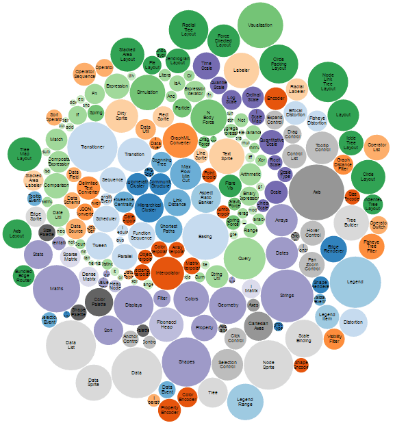
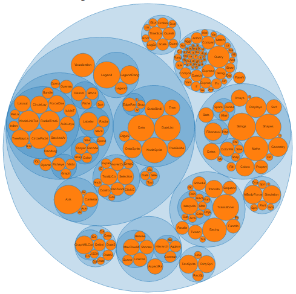

<div dir="rtl">

# D3


## فهرست
  - [مقدمه](#مقدمه)
  - [پیشنیاز‌ها](#پیشنیاز‌ها)
  - [معرفی](#معرفی)
  - [ویژگی‌ها](#ویژگی‌ها)
  - [مقدمه](#مقدمه)
  - [مقدمه](#مقدمه)


## ️نویسندگان
  - [سید مهدی صادق شبیری](https://github.com/SmsS4)
<hr>

## مقدمه
نامِ D3 مخففِ Data-Driven Documents است. این کتاب‌خانه‌ی متن‌باز توسط Mike Bostock توسعه داده شده است. هدفِ این کتاب‌خانه کمک به ساختِ مصورسازی‌های تعاملی داده‌ها در دنیای وب است. این کتاب‌خانه از HTML ،SVG و CSS برای ساخت نمودارها، نقشه‌ها و … استفاده می‌کند.  
در این صفحه ما می‌خواهیم شروع کار با D3 و پایه‌های آن را یاد بگیریم؛ هم‌چنین چند مثال از دنیای واقعی را با هم بررسی کنیم.

## پیشنیاز‌ها
برای یادگیری D3 به دانش اولیه از CSS ،HTML و JavaScript نیاز داریم.

## معرفی
نامِ D3 مخففِ Data-Driven Documents است. این کتاب‌خانه‌ی متن‌باز توسط Mike Bostock توسعه داده شده است. هدفِ این کتاب‌خانه کمک به ساختِ مصورسازی‌های تعاملی داده‌ها در دنیای وب است. این کتاب‌خانه از HTML ،SVG و CSS برای ساخت نمودارها، نقشه‌ها و … استفاده می‌کند.   
با حجم انبوه داده که امروزه تولید می‌شود، درک داده‌ها و بررسی آن‌ها مشکل شده است. مصورسازی داده‌ها از بهترین راه‌های انتقال اطلاعات  بامعناست؛ در این راستا D3 سهولت و انعطاف‌پذیری بالایی را برای مصورسازی داده‌ها فراهم می‌آورد؛ پویا و شهودی است و تلاش کمی برای یادگیری نیاز دارد.  
از لحاظ مفهومی، این کتاب‌خانه شبیه Protovis است اما Protovis بیشتر برای مصورسازی‌های ثابت (Static) استفاده می‌شود در حالی که D3 بیشتر جنبه‌ی تعاملی دارد و بر روی انیمیشن‌ها و تبدیل‌های گرافیکی تمرکز دارد.  
سایت رسمی این کتاب‌خانه از [این لینک](https://d3js.org/) و سورس‌کد آن از [این لینک](https://github.com/d3/d3) قابل دسترس است.  

## ویژگی‌ها
- **از استانداردهای وب استفاده می‌کند**  
D3 ابزار به شدت قدرتمندی برای ساخت مصورسازی‌های تعاملی از داده‌هاست. این کتاب‌خانه از استانداردهای مدرن وب نظیر HTML، SVG و CSS برای ساخت نمودارها بهره می‌گیرد.
- **D3 داده‌محور است**  
در این کتاب‌خانه می‌توانیم برای ساخت انواع مختلف شکل‌ها با داده‌های static کار کنیم یا داده‌ها را از سرور در فرمت‌های مختلفی چون آرایه‌ها، آبجکت‌ها، CSV، JSON، XML و … fetch کنیم.
- **دستکاری DOM**  
با D3 می‌توانید مدل شیءگرای سند (DOM) را بر اساس داده‌هایتان دستکاری کنید.
- **عناصر داده‌محور**  
D3 شما را قادر می‌سازد تا به صورت پویا عناصر را تولید کنید و استایل‌های مورد نظرتان را بر آن‌ها اعمال کنید؛ خواه یک جدول باشد، خواه یک گراف، HTML element یا گروهی از عناصر.
- **ویژگی‌های پویا**  
کتاب‌خانه D3 امکان دادن ویژگی‌های داینامیمک به تابع‌ها را می‌دهد. برای مثال دیتای مورد نمایش می‌تواند استایل تعریف شده توسط شما را داشته باشد.
- **انواع مصورسازی**  
با D3 می‌توانید انواع مختلف مصور سازی از نمودارهای ساده تا نمودارهای پیچیده جغرافیایی  استفاده کنید.
- **کنترل مصورسازی**  
با D3 کنترل کامل بر روی مصور سازی دارید.
- **انیمیشن**  
امکان ایجاد انیمیشن برای مصور سازی


## نمونه





## نصب
برای دانلود کتاب‌خانه دو روش دارید:

### دانلود مستقیم
می‌توانید از خود[ سایت D3]( https://d3js.org) کتاب‌خانه را دانلود کنید و فایل `d3.min.js` کنار پروژه قرار دهید.  
برای مثال اگر فایل در مسیر 
<code dir="ltr">../d3.min.js</code> باشد کدتان این شکلی می‌شود:

<div dir="ltr">

```html
<!DOCTYPE html>
<html lang="en">
<head>
    <script src="../d3.min.js"></script>
</head>
<body>

<script>
    // write your d3 code here.. 
</script>
</body>
</html>
```
</div>

### cdn
با قطعه کد زیر نیز می‌توانید لایبری را از cdn بگیرید:

<div dir="ltr">

```html
<!DOCTYPE html>
<html lang="en">
<head>
    <script src="https://d3js.org/d3.v4.min.js"></script>
</head>
<body>

<script>
    // write your d3 code here.. 
</script>
</body>
</html>
```
</div>


##انتخاب DOM

به طور خلاصه هر تگ در یک صفحه html یک Document Object Model یا همان DOM می‌شود که یک پدر دارد و ممکن است صفر، یک یا چند فرزند نیز داشته باشد.

###انتخاب تگ d3.select


با استفاده از دستور 
<code dir="ltr">d3.select()</code>
می‌توانید یک DOM را انتخاب و سپس استایل (css) آن را عوض کنید.

برای مثال کد زیر صرفا دوتا پاراگراف است.


<div dir="ltr">

```html
<p>First paragraph</p>
<p>Second paragraph</p>
```
</div>

با دستور 
<code dir="ltr"> d3.select("p").style("color", "green"); </code>
می‌توانید پاراگر اول را سبز کنید. دستور 
<code dir="ltr"> d3.select("p") </code> 
اولین DOM که تگ آن `p` است را بر می‌گرداند و سپس با
<code dir="ltr"> style("color", "green")</code> 
می‌توانید مقدار color آن را به green تغییر دهید.

مثال:
<div dir="ltr">

```html
<p>First paragraph</p>
<p>Second paragraph</p>

<script>
    d3.select("p").style("color", "green");
</script>
```
</div>

[اجرای کد](https://www.tutorialsteacher.com/codeeditor?cid=d3-1)

###انتخاب تمام DOMها d3.selectAll

اگر بخواهید تمام DOM ها با تگ p را پیدا کنید باید از 
<code dir="ltr"> d3.selectAll("p") </code>
استفاده کنید. مثلا کد زیر را اجرا کنید:


<div dir="ltr">

```html
<p>First paragraph</p>
<p>Second paragraph</p>
<script>
    d3.selectAll("p").style("color", "green");
</script>
```
</div>

[اجرای کد](https://www.tutorialsteacher.com/codeeditor?cid=d3-3)

###انتخاب با id

کد زیر را ببینید:

<div dir="ltr">

```html
<p id="p1">First paragraph</p>
<p id="p2">Second paragraph</p>

<script>
    d3.select("#p2").style("color", "green");
</script>
```
</div>

[اجرای کد](https://www.tutorialsteacher.com/codeeditor?cid=d3-2)

این کد DOM ای که آي‌دی آن p2 است را انتخاب می‌کند و css آن را تغییر می‌دهد. پس با گذاشتن # در ابتدای ورودی مشخص می‌کند که دنبال DOM با id مشخص شده بگرد.  

### انتخاب با اسم کلاس
اگر بخواهید تمام DOMهایی که اسم کلاسشان `myclass` است را پیدا کنید با دستور 
<code dir="ltr"> d3.selectAll(".myclass") </code> 
 می‌توانید اینکارا انجام دهید. در واقع `.` ابتدای ورودی مشخص می‌کند دنبال کلاس باشد.  
مثال:
<div dir="ltr">

```html
<style>
    .myclass{
        color:'red'
    }
</style>
<p class="myclass ">First paragraph</p>
<p>Second paragraph</p>
<p class="myclass ">Third paragraph</p>

<script>
    d3.selectAll(".myclass ").style('color','green');
</script>
```
</div>

[اجرای کد](https://www.tutorialsteacher.com/codeeditor?cid=d3-4)

### انتخاب تو در تو
کد زیر را نگاه کنید:
<div dir="ltr">

```html
<table>
<tr>
    <td>
        One
    </td>
    <td>
        Two
    </td>
</tr>
<tr>
    <td>
        Three
    </td>
    <td>
        Four
    </td>
</tr>
</table>
```
</div>

این کد یک جدول است. فرض کنید می‌خواهید استایل تمام tdهای سطر اول را عوض کنید. این کار با استفاده از دستور select و selectAll تو در تو ممکن است.  
کد زیر را نگاه کنید:
<code dir="ltr"> d3.select("tr").selectAll("td").style('background-color','yellow'); </code>  
در این کد، قسمت اول با دستور
<code dir="ltr"> d3.select("tr") </code>
اولین tr را انتخاب کرده است و سپس با دستور 
<code dir="ltr"> selectAll("td") </code> 
روی tr ای که پیدا کرده تمام td‌های آن را پیدا کرده است.

مثال:
<div dir="ltr">

```html
<table>
<tr>
    <td>
        One
    </td>
    <td>
        Two
    </td>
</tr>
<tr>
    <td>
        Three
    </td>
    <td>
        Four
    </td>
</tr>
</table>

<script>
    d3.select("tr").selectAll("td").style('background-color','yellow');
</script>
```
</div>

[اجرای کد](https://www.tutorialsteacher.com/codeeditor?cid=d3-5)


##تغییر DOM

تا الان یاد گرفتیم چطور یک DOM را با استفاده از تگ، اسم کلاس و یا id انتخاب کنیم.

<div dir="ltr">

```html
d3.select("tag_name")
d3.select("#id")
d3.select(".class_name")
```
</div>

حالا می‌خواهیم بعد از انتخاب DOM آن را تغییر دهیم. به طور خلاصه در جدول زیر انواع مختلف تغییرات نوشته شده است:


###text

<div dir="ltr">

```html
<div>
    <p></p>
</div>
<p></p>
<script>
    d3.select("p").text("This is paragraph.")
</script>
```
</div>

[اجرای کد](https://www.tutorialsteacher.com/codeeditor?cid=d3-6)

در کد بالا ابتدا به وسیله
<code dir="ltr"> d3.select("p") </code> 
اولین DOM را انتخاب کردیم. دقت کنید که اولین DOM از نوع p داخل div قرار دارد.  
سپس با استفاده از دستور 
<code dir="ltr"> text("This is paragraph.") </code> 
متن آن را عوض کردیم.

اگر به جای `select` از `selectAll` استفاده می‌کردیم متن به هر دو DOM اضافه می‌شد.

### append

دستور append یک DOM جدید می‌سازد و آن را در آخر DOM انتخاب شده اضافه می‌کند.

<div dir="ltr">

```html
<p>First paragraph</p>
<p>Second paragraph</p>

<script>
    d3.select("body").append("p");
</script>
```
</div>

کد بالا تگ `p` را به `body` اضافه می‌کند. حالا اگر بخواهیم به تگ `p` متن نیز بدهیم باید روی خروجی append تابع text را اعمال کنیم.


<div dir="ltr">

```html
<p>First paragraph</p>
<p>Second paragraph</p>

<script>
    d3.select("body").append("p").text("Third paragraph.");
</script>
```
</div>

[اجرای کد](https://www.tutorialsteacher.com/codeeditor?cid=d3-8)


###insert

دستور insert یک DOM جدید می‌سازد و آن راقبل از پایان DOM انتخاب شده اضافه می‌کند.

<div dir="ltr">

```html
<div style="border:1px solid" >
    <p>First paragraph.</p>
</div>

<script>
    d3.select("div").insert("p").text("Second paragraph.");
</script>
```
</div>

[اجرای کد](https://www.tutorialsteacher.com/codeeditor?cid=d3-9)

### remove
با دستور remove می‌توانید یک DOM را حذف کنید.


<div dir="ltr">

```html
<p>First paragraph</p>
<p>Second paragraph</p>

<script>
    d3.select("p").remove();
</script>
```
</div>

[اجرای کد](https://www.tutorialsteacher.com/codeeditor?cid=d3-10)

مثلا در کد بالا ابتدا با 
<code dir="ltr"> d3.select("p") </code>
اولین p انتخاب شده و سپس حذف شده است.  
اگر به جای `select` از `selectAll` استفاده می‌شد تمام pها حذف می‌شدند.

###html
با استفاده از این تابع می‌توانید html یک DOM را عوض کنید.  
به صورت عادی باید با تغییر innerHTML این کار را انجام دهید.


<div dir="ltr">

```html
<p>First paragraph</p>
<script>
    d3.select("p").html("<span>This is new inner html.</span>");
</script>
```
</div>

[اجرای کد
](https://www.tutorialsteacher.com/codeeditor?cid=d3-11)

برای مثال کد بالا html تگ p را عوض کرده و یک span به آن اضافه کرده است.


###attr
با استفاده از `attr` می‌توانید attributeها یا همان ویژگی‌های یک DOM را عوض کنید.  
برای مثال در کد زیر ویژگی class عوض شده و مقدار آن به error تغییر پیدا کرده است.

<div dir="ltr">

```html
<style>
    .error {
        color: red
    }
</style>
<body>
    <p>Error: This is dummy error.</p>
    <script>
        d3.select("p").attr("class","error");
    </script>
</body>
```
</div>

[اجرای کد
](https://www.tutorialsteacher.com/codeeditor?cid=d3-12)


###property
بعضی ویژگی‌های تگ‌ها مانند تیک خوردن checkbox یا مقدار یک radio button را نمی‌شود با `attr` عوض کرد.  
برای این جور ویژگی‌ها از `property` باید استفاده شود.

<div dir="ltr">

```html
<p>D3</label><input type="checkbox" />
<p>jQuery</label><input type="checkbox" />

<script>
    d3.select("input").property("checked",true);
</script>
```
</div>

[اجرای کد
](https://www.tutorialsteacher.com/codeeditor?cid=d3-13)

برای مثال کد بالا ابتدا با
<code dir="ltr"> d3.select("input") </code>
اولین input را پیدا کرده و سپس با 
`property("checked",true)`
مقدار آن را به true عوض کرده است.


###style

این تابع در قسمت قبل نیز توضیح داده شده بود با استفاده از آن می‌توانید استایل یک DOM را عوض کنید.

<div dir="ltr">

```html
<p>Error: This is dummy error.</p>
<script>
    d3.select("p").style("color", "red")
</script>
```
</div>

[اجرای کد
](https://www.tutorialsteacher.com/codeeditor?cid=d3-14)

برای مثال کد بالا مقدار `color` را به `red` تغییر داده است.

###classed
با استفاده از `classed` می‌توانید یک کلاس را به DOM اضافه یا حذف کنید.


<div dir="ltr">

```html
<style>
    .error {
        color: red
    }
</style>
<body>
    <p>This is error.</p>

    <script>
        d3.select("p").classed('error', true);
    </script>
</body>
```
</div>

[اجرای کد
](https://www.tutorialsteacher.com/codeeditor?cid=d3-15)

برای مثال کد بالا کلاس `error` را به `p` انتخاب شده اضافه می‌کند. اگر مقدار `true` را به `false`تغییر بدهیم آن کلاس را از DOM حذف می‌کند. مانند مثال زیر

<div dir="ltr">

```html
<style>
    .error {
        color: red
    }
</style>
<body>
    <p class="error">This is error.</p>
    <script>
        d3.select("p").classed('error', false);
    </script>
</body>
```
</div>

دقت کنید اگر DOM کلاس را نداشت و آن را حذف کردید یا کلاس را داشت و دوباره آن را اضافه کردید به مشکل نمی‌خورید.

<hr>

##منابع

</div>


- https://github.com/mostafaghadimi/web_workshop/tree/master/Elasticsearch (Template)
