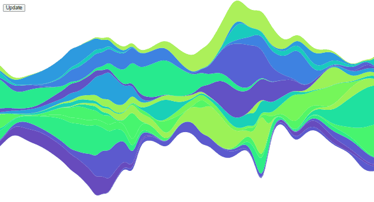

<div dir="rtl">

# D3

<p align=center></p>

## فهرست
  - [مقدمه](#مقدمه)
  - [Elastic Stack (ELK)](#Elastic-Stack)
  - [مزایا](#مزایا)
  - [مقیاس‌پذیری](#مقیاس-پذیری)
  - [معرفی برخی اصطلاحات](#معرفی-برخی-اصطلاحات)
  - [نصب و راه‌اندازی](#نصب-و-راه-اندازی)
  - [بارگذاری اسناد](#بارگذاری-اسناد)
  - [امکان ذخیره‌ی انواع مختلف داده‌ها](#امکان-ذخیره-انواع-مختلف-داده)
  - [گریزی به مبحث Mapping](#گریزی-به-مبحث-Mapping)
  - [انواع مختلف Query](#انواع-مختلف-Query)
  - [آشنایی با bulk](#Bulk-API)
  - [آنالیز متن](#آنالیز-متن)
  - [منابع](#منابع)

## ️نویسندگان
  - [سید مهدی صادق شبیری](https://github.com/SmsS4)
<hr>

## مقدمه
نامِ D3 مخففِ Data-Driven Documents است. این کتاب‌خانه‌ی متن‌باز توسط Mike Bostock توسعه داده شده است. هدفِ این کتاب‌خانه کمک به ساختِ مصورسازی‌های تعاملی داده‌ها در دنیای وب است. این کتاب‌خانه از HTML ،SVG و CSS برای ساخت نمودارها، نقشه‌ها و … استفاده می‌کند.  
در این صفحه ما می‌خواهیم شروع کار با D3 و پایه‌های آن را یاد بگیریم؛ هم‌چنین چند مثال از دنیای واقعی را با هم بررسی کنیم.

## پیشنیاز‌ها
برای یادگیری D3 به دانش اولیه از CSS ،HTML و JavaScript نیاز داریم.

## معرفی
نامِ D3 مخففِ Data-Driven Documents است. این کتاب‌خانه‌ی متن‌باز توسط Mike Bostock توسعه داده شده است. هدفِ این کتاب‌خانه کمک به ساختِ مصورسازی‌های تعاملی داده‌ها در دنیای وب است. این کتاب‌خانه از HTML ،SVG و CSS برای ساخت نمودارها، نقشه‌ها و … استفاده می‌کند.   
با حجم انبوه داده که امروزه تولید می‌شود، درک داده‌ها و بررسی آن‌ها مشکل شده است. مصورسازی داده‌ها از بهترین راه‌های انتقال اطلاعات  بامعناست؛ در این راستا D3 سهولت و انعطاف‌پذیری بالایی را برای مصورسازی داده‌ها فراهم می‌آورد؛ پویا و شهودی است و تلاش کمی برای یادگیری نیاز دارد.  
از لحاظ مفهومی، این کتاب‌خانه شبیه Protovis است اما Protovis بیشتر برای مصورسازی‌های ثابت (Static) استفاده می‌شود در حالی که D3 بیشتر جنبه‌ی تعاملی دارد و بر روی انیمیشن‌ها و تبدیل‌های گرافیکی تمرکز دارد.  
سایت رسمی این کتاب‌خانه از [این لینک](https://d3js.org/) و سورس‌کد آن از [این لینک](https://github.com/d3/d3) قابل دسترس است.  

## ویژگی‌ها
- **از استانداردهای وب استفاده می‌کند**  
D3 ابزار به شدت قدرتمندی برای ساخت مصورسازی‌های تعاملی از داده‌هاست. این کتاب‌خانه از استانداردهای مدرن وب نظیر HTML، SVG و CSS برای ساخت نمودارها بهره می‌گیرد.
- **D3 داده‌محور است**  
در این کتاب‌خانه می‌توانیم برای ساخت انواع مختلف شکل‌ها با داده‌های static کار کنیم یا داده‌ها را از سرور در فرمت‌های مختلفی چون آرایه‌ها، آبجکت‌ها، CSV، JSON، XML و … fetch کنیم.
- **دستکاری DOM**  
با D3 می‌توانید مدل شیءگرای سند (DOM) را بر اساس داده‌هایتان دستکاری کنید.
- **عناصر داده‌محور**  
D3 شما را قادر می‌سازد تا به صورت پویا عناصر را تولید کنید و استایل‌های مورد نظرتان را بر آن‌ها اعمال کنید؛ خواه یک جدول باشد، خواه یک گراف، HTML element یا گروهی از عناصر.
- **ویژگی‌های پویا**  
کتاب‌خانه D3 امکان دادن ویژگی‌های داینامیمک به تابع‌ها را می‌دهد. برای مثال دیتای مورد نمایش می‌تواند استایل تعریف شده توسط شما را داشته باشد.
- **انواع مصورسازی**  
با D3 می‌توانید انواع مختلف مصور سازی از نمودارهای ساده تا نمودارهای پیچیده جغرافیایی  استفاده کنید.
- **کنترل مصورسازی**  
با D3 کنترل کامل بر روی مصور سازی دارید.
- **انیمیشن**  
امکان ایجاد انیمیشن برای مصور سازی


## نمونه
<p align=center></p>
<p align=center></p>
<p align=center></p>
<p align=center></p>


## نصب
برای دانلود کتاب‌خانه دو روش دارید:

#### دانلود مستقیم
می‌توانید از خود[ سایت D3]( https://d3js.org) کتاب‌خانه را دانلود کنید و فایل `d3.min.js` کنار پروژه قرار دهید.  
برای مثال اگر فایل در مسیر 
<code dir="ltr">../d3.min.js</code> باشد کدتان این شکلی می‌شود:

<div dir="ltr">

```html
<!DOCTYPE html>
<html lang="en">
<head>
    <script src="../d3.min.js"></script>
</head>
<body>

<script>
    // write your d3 code here.. 
</script>
</body>
</html>
```
</div>

#### cdn
با قطعه کد زیر نیز می‌توانید لایبری را از cdn بگیرید:

<div dir="ltr">

```html
<!DOCTYPE html>
<html lang="en">
<head>
    <script src="https://d3js.org/d3.v4.min.js"></script>
</head>
<body>

<script>
    // write your d3 code here.. 
</script>
</body>
</html>
```
</div>


<hr>

##منابع

</div>


- https://github.com/mostafaghadimi/web_workshop/tree/master/Elasticsearch (Template)
