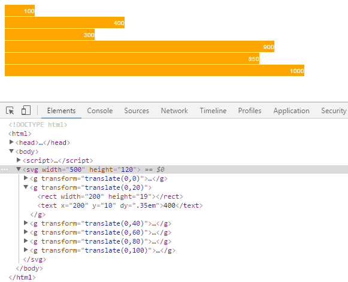
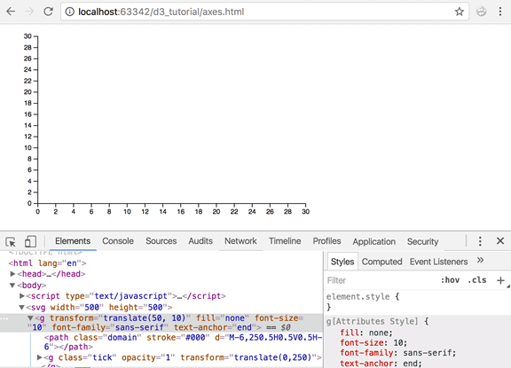
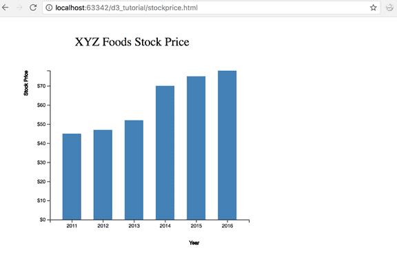
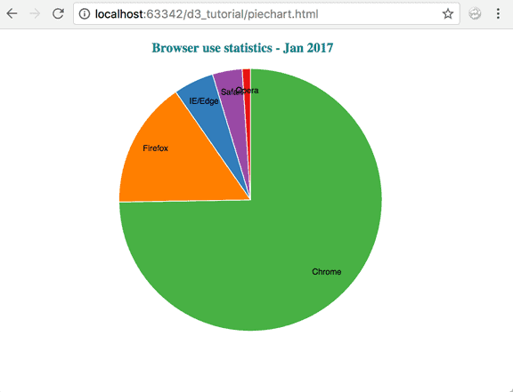

<div dir="rtl">

# D3


## فهرست
  - [مقدمه](#مقدمه)
  - [پیشنیاز‌ها](#پیشنیاز‌ها)
  - [معرفی](#معرفی)
  - [ویژگی‌ها](#ویژگی‌ها)
  - [نمونه](#نمونه)
  - [نصب](#نصب)
    - [مستقیم](#مستقیم)
    - [cdn](#cdn)
  - [انتخاب DOM](#انتخاب-DOM)
    - [انتخاب تگ d3.select](#انتخاب-تگ-3.select)
    - [انتخاب تمام DOMها d3.selectAll](#انتخاب-تمام-DOMها-d3.selectAll)
    - [انتخاب با id](#انتخاب-با-id)
    - [انتخاب با اسم کلاس](#انتخاب-با-اسم-کلاس)
    - [انتخاب تو در تو](#انتخاب-تو-در-تو)
  - [تغییر DOM](#تغییر-DOM)
    - [تابع text](#text)
    - [تابع append](#append)
    - [تابع insert](#insert)
    - [تابع remove](#remove)
    - [تابع html](#html)
    - [تابع attr](#attr)
    - [تابع property](#property)
    - [تابع style](#style)
    - [تابع classed](#classed)
  - [ زنجیر کردن تابع‌ها](#زنجیر-کردن-تابع‌ها)
  - [ تابع روی دیتا](#تابع-روی-دیتا)
    - [مقدار داینامیک](#مقدار-داینامیک)
  - [Events handling](#Events-handling)
  - [انیمیشن](#انیمیشن)
    - [transition](#transition)
    - [ease](#ease)
    - [delay](#delay)
  - [Data Binding](#data-binding)
    - [تابع ()data](#تابع-data)
    - [تابع ()enter](#تابع-enter)
    - [تابع ()exit](#تابع-exit)
    - [تابع ()datum](#تابع-datum)
  - [خواندن داده‌ها از فایل در D3](#خواندن-دادهها-از-فایل-در-d3)
    - [تابع ()d3.csv](#تابع-d3csv)
    - [تابع ()d3.json](#تابع-d3json)
    - [تابع ()d3.tsv](#تابع-d3tsv)
    - [تابع ()d3.xml](#تابع-d3xml)
    - [بایند کردن داده‌های Load شده](#بایند-کردن-دادههای-load-شده)
    - [مدیریت خطاها](#مدیریت-خطاها)
  - [مقیاس در D3](#مقیاس-در-D3)
    - [تابع ()d3.scaleLinear](#تابع-()d3.scaleLinear)
  - [محور‌های نمودار در D3](#محور‌های-نمودار-در-D3)
    - [تابع d3.axisTop](#تابع-d3.axisTop)
    - [تابع d3.axisRight](#تابع-d3.axisRight)
    - [تابع d3.axisBottom](#تابع-d3.axisBottom)
    - [تابع d3.axisLeft](#تابع-d3.axisLeft)
  - [ساختن نمودار میله‌ای](#ساختن-نمودار-میله‌ای)
  - [رسم نمودار دایره‌ای با D3](#رسم-نمودار-دایره‌ای-با-D3)
    - [مسیر در SVG](#مسیر-در-SVG)
    - [تابع d3.scaleOrdinal](#تابع-d3.scaleOrdinal)
    - [تابع d3.pie](#تابع-d3.pie)
    - [تابع d3.arc](#تابع-d3.arc)
  - [منابع](#منابع)

## ️نویسندگان
  - [سید مهدی صادق شبیری](https://github.com/SmsS4)
  - [محمدصادق سلیمی](https://github.com/SMSadegh19)
  - [علیرضا حسین پور](https://github.com/doctorhoseinpour)
<hr>

## مقدمه
نامِ D3 مخففِ Data-Driven Documents است. این کتاب‌خانه‌ی متن‌باز توسط Mike Bostock توسعه داده شده است. هدفِ این کتاب‌خانه کمک به ساختِ مصورسازی‌های تعاملی داده‌ها در دنیای وب است. این کتاب‌خانه از HTML ،SVG و CSS برای ساخت نمودارها، نقشه‌ها و … استفاده می‌کند.  
در این صفحه ما می‌خواهیم شروع کار با D3 و پایه‌های آن را یاد بگیریم؛ هم‌چنین چند مثال از دنیای واقعی را با هم بررسی کنیم.

## پیشنیاز‌ها
برای یادگیری D3 به دانش اولیه از CSS ،HTML و JavaScript نیاز داریم.

## معرفی
نامِ D3 مخففِ Data-Driven Documents است. این کتاب‌خانه‌ی متن‌باز توسط Mike Bostock توسعه داده شده است. هدفِ این کتاب‌خانه کمک به ساختِ مصورسازی‌های تعاملی داده‌ها در دنیای وب است. این کتاب‌خانه از HTML ،SVG و CSS برای ساخت نمودارها، نقشه‌ها و … استفاده می‌کند.   
با حجم انبوه داده که امروزه تولید می‌شود، درک داده‌ها و بررسی آن‌ها مشکل شده است. مصورسازی داده‌ها از بهترین راه‌های انتقال اطلاعات  بامعناست؛ در این راستا D3 سهولت و انعطاف‌پذیری بالایی را برای مصورسازی داده‌ها فراهم می‌آورد؛ پویا و شهودی است و تلاش کمی برای یادگیری نیاز دارد.  
از لحاظ مفهومی، این کتاب‌خانه شبیه Protovis است اما Protovis بیشتر برای مصورسازی‌های ثابت (Static) استفاده می‌شود در حالی که D3 بیشتر جنبه‌ی تعاملی دارد و بر روی انیمیشن‌ها و تبدیل‌های گرافیکی تمرکز دارد.  
سایت رسمی این کتاب‌خانه از [این لینک](https://d3js.org/) و سورس‌کد آن از [این لینک](https://github.com/d3/d3) قابل دسترس است.  

## ویژگی‌ها
- **از استانداردهای وب استفاده می‌کند**  
D3 ابزار به شدت قدرتمندی برای ساخت مصورسازی‌های تعاملی از داده‌هاست. این کتاب‌خانه از استانداردهای مدرن وب نظیر HTML، SVG و CSS برای ساخت نمودارها بهره می‌گیرد.
- **D3 داده‌محور است**  
در این کتاب‌خانه می‌توانیم برای ساخت انواع مختلف شکل‌ها با داده‌های static کار کنیم یا داده‌ها را از سرور در فرمت‌های مختلفی چون آرایه‌ها، آبجکت‌ها، CSV، JSON، XML و … fetch کنیم.
- **دستکاری DOM**  
با D3 می‌توانید مدل شیءگرای سند (DOM) را بر اساس داده‌هایتان دستکاری کنید.
- **عناصر داده‌محور**  
D3 شما را قادر می‌سازد تا به صورت پویا عناصر را تولید کنید و استایل‌های مورد نظرتان را بر آن‌ها اعمال کنید؛ خواه یک جدول باشد، خواه یک گراف، HTML element یا گروهی از عناصر.
- **ویژگی‌های پویا**  
کتاب‌خانه D3 امکان دادن ویژگی‌های داینامیمک به تابع‌ها را می‌دهد. برای مثال دیتای مورد نمایش می‌تواند استایل تعریف شده توسط شما را داشته باشد.
- **انواع مصورسازی**  
با D3 می‌توانید انواع مختلف مصور سازی از نمودارهای ساده تا نمودارهای پیچیده جغرافیایی  استفاده کنید.
- **کنترل مصورسازی**  
با D3 کنترل کامل بر روی مصور سازی دارید.
- **انیمیشن**  
امکان ایجاد انیمیشن برای مصور سازی


## نمونه


## نصب
برای دانلود کتاب‌خانه دو روش دارید:

### مستقیم
می‌توانید از خود[ سایت D3]( https://d3js.org) کتاب‌خانه را دانلود کنید و فایل `d3.min.js` کنار پروژه قرار دهید.  
برای مثال اگر فایل در مسیر 
<code dir="ltr">../d3.min.js</code> باشد کدتان این شکلی می‌شود:

<div dir="ltr">

```html
<!DOCTYPE html>
<html lang="en">
<head>
    <script src="../d3.min.js"></script>
</head>
<body>

<script>
    // write your d3 code here.. 
</script>
</body>
</html>
```
</div>

### cdn
با قطعه کد زیر نیز می‌توانید لایبری را از cdn بگیرید:

<div dir="ltr">

```html
<!DOCTYPE html>
<html lang="en">
<head>
    <script src="https://d3js.org/d3.v4.min.js"></script>
</head>
<body>

<script>
    // write your d3 code here.. 
</script>
</body>
</html>
```
</div>


## انتخاب DOM

به طور خلاصه هر تگ در یک صفحه html یک Document Object Model یا همان DOM می‌شود که یک پدر دارد و ممکن است صفر، یک یا چند فرزند نیز داشته باشد.

### انتخاب تگ d3.select


با استفاده از دستور 
<code dir="ltr">d3.select()</code>
می‌توانید یک DOM را انتخاب و سپس استایل (css) آن را عوض کنید.

برای مثال کد زیر صرفا دوتا پاراگراف است.


<div dir="ltr">

```html
<p>First paragraph</p>
<p>Second paragraph</p>
```
</div>

با دستور 
<code dir="ltr"> d3.select("p").style("color", "green"); </code>
می‌توانید پاراگر اول را سبز کنید. دستور 
<code dir="ltr"> d3.select("p") </code> 
اولین DOM که تگ آن `p` است را بر می‌گرداند و سپس با
<code dir="ltr"> style("color", "green")</code> 
می‌توانید مقدار color آن را به green تغییر دهید.

مثال:
<div dir="ltr">

```html
<p>First paragraph</p>
<p>Second paragraph</p>

<script>
    d3.select("p").style("color", "green");
</script>
```
</div>

[اجرای کد](https://www.tutorialsteacher.com/codeeditor?cid=d3-1)

### انتخاب تمام DOMها d3.selectAll

اگر بخواهید تمام DOM ها با تگ p را پیدا کنید باید از 
<code dir="ltr"> d3.selectAll("p") </code>
استفاده کنید. مثلا کد زیر را اجرا کنید:


<div dir="ltr">

```html
<p>First paragraph</p>
<p>Second paragraph</p>
<script>
    d3.selectAll("p").style("color", "green");
</script>
```
</div>

[اجرای کد](https://www.tutorialsteacher.com/codeeditor?cid=d3-3)

### انتخاب با id

کد زیر را ببینید:

<div dir="ltr">

```html
<p id="p1">First paragraph</p>
<p id="p2">Second paragraph</p>

<script>
    d3.select("#p2").style("color", "green");
</script>
```
</div>

[اجرای کد](https://www.tutorialsteacher.com/codeeditor?cid=d3-2)

این کد DOM ای که آي‌دی آن p2 است را انتخاب می‌کند و css آن را تغییر می‌دهد. پس با گذاشتن # در ابتدای ورودی مشخص می‌کند که دنبال DOM با id مشخص شده بگرد.  

###  انتخاب با اسم کلاس

اگر بخواهید تمام DOMهایی که اسم کلاسشان `myclass` است را پیدا کنید با دستور 
<code dir="ltr"> d3.selectAll(".myclass") </code> 
 می‌توانید اینکارا انجام دهید. در واقع `.` ابتدای ورودی مشخص می‌کند دنبال کلاس باشد.  
مثال:
<div dir="ltr">

```html
<style>
    .myclass{
        color:'red'
    }
</style>
<p class="myclass ">First paragraph</p>
<p>Second paragraph</p>
<p class="myclass ">Third paragraph</p>

<script>
    d3.selectAll(".myclass ").style('color','green');
</script>
```
</div>

[اجرای کد](https://www.tutorialsteacher.com/codeeditor?cid=d3-4)

###  انتخاب تو در تو

کد زیر را نگاه کنید:
<div dir="ltr">

```html
<table>
<tr>
    <td>
        One
    </td>
    <td>
        Two
    </td>
</tr>
<tr>
    <td>
        Three
    </td>
    <td>
        Four
    </td>
</tr>
</table>
```
</div>

این کد یک جدول است. فرض کنید می‌خواهید استایل تمام tdهای سطر اول را عوض کنید. این کار با استفاده از دستور select و selectAll تو در تو ممکن است.  
کد زیر را نگاه کنید:
<code dir="ltr"> d3.select("tr").selectAll("td").style('background-color','yellow'); </code>  
در این کد، قسمت اول با دستور
<code dir="ltr"> d3.select("tr") </code>
اولین tr را انتخاب کرده است و سپس با دستور 
<code dir="ltr"> selectAll("td") </code> 
روی tr ای که پیدا کرده تمام td‌های آن را پیدا کرده است.

مثال:
<div dir="ltr">

```html
<table>
<tr>
    <td>
        One
    </td>
    <td>
        Two
    </td>
</tr>
<tr>
    <td>
        Three
    </td>
    <td>
        Four
    </td>
</tr>
</table>

<script>
    d3.select("tr").selectAll("td").style('background-color','yellow');
</script>
```
</div>

[اجرای کد](https://www.tutorialsteacher.com/codeeditor?cid=d3-5)


## تغییر DOM

تا الان یاد گرفتیم چطور یک DOM را با استفاده از تگ، اسم کلاس و یا id انتخاب کنیم.

<div dir="ltr">

```html
d3.select("tag_name")
d3.select("#id")
d3.select(".class_name")
```
</div>

حالا می‌خواهیم بعد از انتخاب DOM آن را تغییر دهیم. به طور خلاصه در جدول زیر انواع مختلف تغییرات نوشته شده است:

| تابع                       | توضیح                                            |
|----------------------------|--------------------------------------------------|
| text("content")            | تغییر متن                                        |
| append("element name")     | یک DOM به قبل از آخر DOM انتخاب شده اضافه می‌کند. |
| insert("element name")     | یک DOM به DOM انتخاب شده اضافه می‌کند.            |
| remove()                   | یک DOM را پاک می‌کند.                             |
| html("content")            | محتوای html یک DOM را عوض می‌کند.                 |
| attr("name", "value")      | مقدار یک ویژگی (attribute) را عوض می‌کند.         |
| property("name", "value")  | مقدار یک صفت (property) را عوض می‌کند.            |
| style("name", "value")     | استایل DOM انتخاب شده را عوض می‌کند.              |
| classed("css class", bool) | یک کلاس را به DOM اضافه یا حذف می‌کند.            |

### text

<div dir="ltr">

```html
<div>
    <p></p>
</div>
<p></p>
<script>
    d3.select("p").text("This is paragraph.")
</script>
```
</div>

[اجرای کد](https://www.tutorialsteacher.com/codeeditor?cid=d3-6)

در کد بالا ابتدا به وسیله
<code dir="ltr"> d3.select("p") </code> 
اولین DOM را انتخاب کردیم. دقت کنید که اولین DOM از نوع p داخل div قرار دارد.  
سپس با استفاده از دستور 
<code dir="ltr"> text("This is paragraph.") </code> 
متن آن را عوض کردیم.

اگر به جای `select` از `selectAll` استفاده می‌کردیم متن به هر دو DOM اضافه می‌شد.

### append

دستور append یک DOM جدید می‌سازد و آن را در آخر DOM انتخاب شده اضافه می‌کند.

<div dir="ltr">

```html
<p>First paragraph</p>
<p>Second paragraph</p>

<script>
    d3.select("body").append("p");
</script>
```
</div>

کد بالا تگ `p` را به `body` اضافه می‌کند. حالا اگر بخواهیم به تگ `p` متن نیز بدهیم باید روی خروجی append تابع text را اعمال کنیم.


<div dir="ltr">

```html
<p>First paragraph</p>
<p>Second paragraph</p>

<script>
    d3.select("body").append("p").text("Third paragraph.");
</script>
```
</div>

[اجرای کد](https://www.tutorialsteacher.com/codeeditor?cid=d3-8)


### insert

دستور insert یک DOM جدید می‌سازد و آن راقبل از پایان DOM انتخاب شده اضافه می‌کند.

<div dir="ltr">

```html
<div style="border:1px solid" >
    <p>First paragraph.</p>
</div>

<script>
    d3.select("div").insert("p").text("Second paragraph.");
</script>
```
</div>

[اجرای کد](https://www.tutorialsteacher.com/codeeditor?cid=d3-9)

### remove

با دستور remove می‌توانید یک DOM را حذف کنید.


<div dir="ltr">

```html
<p>First paragraph</p>
<p>Second paragraph</p>

<script>
    d3.select("p").remove();
</script>
```
</div>

[اجرای کد](https://www.tutorialsteacher.com/codeeditor?cid=d3-10)

مثلا در کد بالا ابتدا با 
<code dir="ltr"> d3.select("p") </code>
اولین p انتخاب شده و سپس حذف شده است.  
اگر به جای `select` از `selectAll` استفاده می‌شد تمام pها حذف می‌شدند.

### html

با استفاده از این تابع می‌توانید html یک DOM را عوض کنید.  
به صورت عادی باید با تغییر innerHTML این کار را انجام دهید.


<div dir="ltr">

```html
<p>First paragraph</p>
<script>
    d3.select("p").html("<span>This is new inner html.</span>");
</script>
```
</div>

[اجرای کد
](https://www.tutorialsteacher.com/codeeditor?cid=d3-11)

برای مثال کد بالا html تگ p را عوض کرده و یک span به آن اضافه کرده است.


### attr

با استفاده از `attr` می‌توانید attributeها یا همان ویژگی‌های یک DOM را عوض کنید.  
برای مثال در کد زیر ویژگی class عوض شده و مقدار آن به error تغییر پیدا کرده است.

<div dir="ltr">

```html
<style>
    .error {
        color: red
    }
</style>
<body>
    <p>Error: This is dummy error.</p>
    <script>
        d3.select("p").attr("class","error");
    </script>
</body>
```
</div>

[اجرای کد
](https://www.tutorialsteacher.com/codeeditor?cid=d3-12)


### property

بعضی ویژگی‌های تگ‌ها مانند تیک خوردن checkbox یا مقدار یک radio button را نمی‌شود با `attr` عوض کرد.  
برای این جور ویژگی‌ها از `property` باید استفاده شود.

<div dir="ltr">

```html
<p>D3</label><input type="checkbox" />
<p>jQuery</label><input type="checkbox" />

<script>
    d3.select("input").property("checked",true);
</script>
```
</div>

[اجرای کد
](https://www.tutorialsteacher.com/codeeditor?cid=d3-13)

برای مثال کد بالا ابتدا با
<code dir="ltr"> d3.select("input") </code>
اولین input را پیدا کرده و سپس با 
`property("checked",true)`
مقدار آن را به true عوض کرده است.


### style

این تابع در قسمت قبل نیز توضیح داده شده بود با استفاده از آن می‌توانید استایل یک DOM را عوض کنید.

<div dir="ltr">

```html
<p>Error: This is dummy error.</p>
<script>
    d3.select("p").style("color", "red")
</script>
```
</div>

[اجرای کد
](https://www.tutorialsteacher.com/codeeditor?cid=d3-14)

برای مثال کد بالا مقدار `color` را به `red` تغییر داده است.

### classed

با استفاده از `classed` می‌توانید یک کلاس را به DOM اضافه یا حذف کنید.


<div dir="ltr">

```html
<style>
    .error {
        color: red
    }
</style>
<body>
    <p>This is error.</p>

    <script>
        d3.select("p").classed('error', true);
    </script>
</body>
```
</div>

[اجرای کد
](https://www.tutorialsteacher.com/codeeditor?cid=d3-15)

برای مثال کد بالا کلاس `error` را به `p` انتخاب شده اضافه می‌کند. اگر مقدار `true` را به `false`تغییر بدهیم آن کلاس را از DOM حذف می‌کند. مانند مثال زیر

<div dir="ltr">

```html
<style>
    .error {
        color: red
    }
</style>
<body>
    <p class="error">This is error.</p>
    <script>
        d3.select("p").classed('error', false);
    </script>
</body>
```
</div>

دقت کنید اگر DOM کلاس را نداشت و آن را حذف کردید یا کلاس را داشت و دوباره آن را اضافه کردید به مشکل نمی‌خورید.


## زنجیر کردن تابع‌ها

همانطور که در قسمت‌های قبل دیدید متدهای D3 که مربوط یه انتخاب یا تغییر بودند به صورت زنجیر وار صدا می‌شدند.  
این نوع طراحی در JQuery نیز دیده می‌شود. برای مثال:

<code dir="ltr"> $("#myDiv").text("Some text").attr("style", "color:red") </code>

این کد ابتدا DOM ای که ای‌دی‌اش برابر myDiv است را انتخاب می‌کند و سپس متن آن را عوض می‌کند و درنهایت استایل آن را عوض میکند.  
معادل این کد با D3 به شکل زیر است.

<code dir="ltr"> d3.select("#myDiv").text("Some text").style("color", "red") </code>

بهتر است برای خوانایی بیشتر هر قسمت را در یک خط بنویسید مانند مثال زیر:

<div dir="ltr">

```html
d3.select("#myDiv")
  .text("Some text")
  .style("color", "red")
```
</div>

## تابع روی دیتا

فرض کنید ۳ تا تگ p دارید و یک آرایه به طول ۳ از ۱۰۰، ۲۰۰ و ۳۰۰ و می‌خواهید این ۳ مقدار را در ۳ پاراگراف (p) قرار بدهید.

برای اینکار ابتدا با دستور 
`selectAll("p")`
باید تمام pها را انتخاب کنید. سپس با دستور زیر می‌توانید کار گفته شده را انجام دهید:

<div dir="ltr">

```html
var data = [100, 200, 300];
selectAll("p")
.data(data)
.text(function (d, i) {
    console.log("d: " + d);
    console.log("i: " + i);
    console.log("this: " + this);

    return d;
});
```
</div>

[اجرای کد
](https://www.tutorialsteacher.com/codeeditor?cid=d3-16)

در کل بالا تابع داخل text روی تمام اعضای data و p به ترتیب اجرا می‌شود.  
یعنی دیتای اول برای اولین p، دیتای دوم برای دومین p و ...  
داخل تابع d برابر مقدار data است و i اندیس دیتای داخل آرایه و در نهایت this به پاراگراف اشاره می‌کند.

در قسمت‌های بعد توضیحات بیشتری راجع به تابع data داده خواهد شد.

#### مقدار داینامیک

فرض کنید چند پاراگراف دارید و می‌خواهید اگر کلمه `Error` داخل آن بود رنگش را قرمز و اگر کلمه `Warning` داخل آن بود زرد کنید.  
برای اینکار باید از تابع `style` استفاده کرد با این تفاوت که به جای مقدار ثابت باید به آن تابع ورودی داد. به شکل زیر:

<div dir="ltr">

```html
<p>Error: This is error.</p>
<p>Warning:This is warning.</p>

<script>
    d3.selectAll("p").style("color", function() {
            var text = this.innerText;
        
            if (text.indexOf("Error") >= 0) {
                return "red";
            } else if (text.indexOf("Warning") >= 0) {
                return "yellow";
            }
    });
</script>
```
</div>

[اجرای کد
](https://www.tutorialsteacher.com/codeeditor?cid=d3-17)

در کد بالا ورودی `style` به جای مقدار ثابت یک تابع است لایبری d3 برای هر پاراگراف آن را به تابع می‌دهد  
متغیر this به پاراگرافی که تابع روش صدا زده شده رفرنس داده شده است.


## Events handling

فرض کنید می‌خواهید زمانی که موس بر روی یک DOM رفت تغییر مشخصی در DOMها بدهید.  
در واقع به اینکار Event handling می‌گویند. یعنی زمانی که یک اتفاق یا event رخ داد عملیات مشخصی انجام دهیم.  
این کار با استفاده از تابع`on` در d3 ممکن است.  
مثال:

<div dir="ltr">

```html
<!doctype html>
<html>
<head>
    <style>
        div {
            height: 100px;
            width: 100px;
            background-color: steelblue;
            margin:5px;
        }
    </style>
    <script src="https://d3js.org/d3.v4.min.js"></script>
</head>
<body>
<div> </div>
<script>
    d3.selectAll("div")
      .on("mouseover", function(){
          d3.select(this)
            .style("background-color", "orange");

          // Get current event info
          console.log(d3.event);
          
          // Get x & y co-ordinates
          console.log(d3.mouse(this));
      })
      .on("mouseout", function(){
          d3.select(this)
            .style("background-color", "steelblue")
      });
</script>
</body>
</html>
```
</div>

[اجرای کد](https://www.tutorialsteacher.com/codeeditor?cid=d3-18)

در این کد ابتدا با `d3.selectAll("div")` تمام divها انتخاب شدند.  
سپس با دستور `on("mouseover", f)` زمانی که موس روی divها قرار بگیرد تابع f را صدا می‌زند.  
تابع f به صورت inline تعریف شده و به شکل زیر است:  
<div dir="ltr">

```js
function(){
  d3.select(this)
    .style("background-color", "orange");

  // Get current event info
  console.log(d3.event);
  
  // Get x & y co-ordinates
  console.log(d3.mouse(this));
}
```
</div>

در کد بالا this رفرنس به divای است که موس روش رفته‌است و با `d3.select(this)` آن را انتخاب کرده و با `style("background-color", "orange")` رنگ بکگراندش را نارنجی کرده‌است.  
با `d3.event` اطلاعات اتفاق رخ داده شده را می‌توان به دست آورد.  
با `d3.mouse(this)` مختصات موس  را بر می‌گرداند.


## انیمیشن

#### transition
با استفاده از تابع `transition` می‌توانید یک تغییر در DOM انجام دهید.  
همچنین با استفاده از دستور `duration` نیز می‌توانید زمان یک انیمیشن را مشخص کنید.

مثال:


<div dir="ltr">

```html
<!doctype html>
<html>
<head>
<style>
    #container {
        height: 100px;
        width: 100px;
        background-color: black;
    }
</style>
<script src="https://d3js.org/d3.v4.min.js"></script>
</head>
<body>
    <div id="container"></div>

    <script>
        d3.select("#container")
          .transition()
          .duration(1000)
          .style("background-color", "red");
    </script>
</body>
```
</div>

[اجرای کد](https://www.tutorialsteacher.com/codeeditor?cid=d3-19)

در کد بالا ابتدا div سیاه است (به خاطر css) و در طول ۱۰۰۰ میلی ثانیه قرمز می‌شود.  
با استفاده از `d3.select("#container")` دیو انتخاب شده است. سپس با `transition` مشخص شده است که انیمیشنی قرار است رخ بدهد و مدت زمانش نیز با دستور `duration` مشخص می‌شود. برای مثال `duration(1000)` یعنی در مدت ۱۰۰۰ میلی‌ثانیه تغییر انجام شود. در آخر نیز تغیییری که قرار است انجام شود گذاشته شده است.

#### ease

با استفاده از دستور `ease` می‌توانید سرعت و شتاب تغییر را مشخص کنید.  
مثال:

<div dir="ltr">

```html
<!doctype html>
<html>
<head>
<style>
    #container {
        height: 100px;
        width: 100px;
        background-color: black;
    }
</style>
<script src="https://d3js.org/d3.v4.min.js"></script>
</head>
<body>
    <div id="container"></div>

    <script>
        d3.select("#container")
          .transition()
          .duration(1000)
          .ease(d3.easeCircle)
          .style("background-color", "red");
    </script>
</body>
```
</div>

تغییری که نسبت به کد قبل شده است وجود `ease(d3.easeCircle)`است که باعث می‌شود ابتدا و انتهای تغییر کند و وسط تغییر تندتر باشد. (هرچند در نهایت باز ۱۰۰۰ میلی ثانیه طول می‌کشد)

تعدادی از easeهای مختلف در لیست زیر آمده است.
- d3.easeElastic
- d3.easeBounce
- d3.easeLinear
- d3.easeSin
- d3.easeQuad
- d3.easeCubic
- d3.easePoly
- d3.easeCircle
- d3.easeExp
- d3.easeBack

#### delay
با استفاده از تابع `delay` می‌توانید انیمیشن را با تاخیر شروع کنید.  
مثال:

<div dir="ltr">

```html
<body>
<script>
    var svg = d3.select("body")
        .append("svg")
        .attr("width", 500)
        .attr("height", 500);


    var bar1 = svg.append("rect")
        .attr("fill", "blue")
        .attr("x", 100)
        .attr("y", 20)
        .attr("height", 20)
        .attr("width", 10)

    var bar2 = svg.append("rect")
        .attr("fill", "blue")
        .attr("x", 120)
        .attr("y", 20)
        .attr("height", 20)
        .attr("width", 10)

    update();

function update() {
    bar1.transition()
        .ease(d3.easeLinear)
        .duration(2000)
        .attr("height",100)

    bar2.transition()
        .ease(d3.easeLinear)
        .duration(2000)
        .delay(2000)
        .attr("height",100)
}
</script>
</body>
```
</div>

[اجرای کد](https://www.tutorialsteacher.com/codeeditor?cid=d3-20)

در کد بالا به خاطر وجود `delay(2000)` در انیمیشن دوم، ۲ ثانیه (۲۰۰۰ میلی ثانیه) دیرتر اجرا می‌شود.  
در هر دو اینیمیشن ease برابر `d3.easeLinear` دارند که یعنی خطی است و با سرعت ثابت انیمیشن انجام می‌شود.


</div>
  

## Data Binding

در این بخش می‌خواهیم یاد بگیریم که چگونه داده‌ها را به عناصر DOM متصل (bind) کنیم و بر اساس داده‌مان عناصر جدید بسازیم.

کتاب‌خانه D3 شامل توابع مهم زیر برای bind کردن داده‌هاست:

 - data()
 - enter()
 - exit()
 - datum()


### تابع ()data

تابع data برای متصل کردن آرایه‌ای از داده‌ها به عنصرِ DOM انتخاب‌شده استفاده می‌شود و بخش انتخاب شده را آپدیت و return کند. D3 با انواع داده‌هایی نظیر آرایه‌ها، CSV, TSV, JSON, XML و … کار می‌کند.

ما می‌توانیم دو نوع داده‌ی مختلف را به تابع data ورودی دهیم: یک آرایه‌ای از اعداد/آبجکت‌ها یا یک [function of data](#تابع-روی-دیتا)

مثال پیش رو نشان می‌دهد که چگونه یک آرایه را در عنصر موجود در DOM با استفاده از تابع data جایگزین کنیم:

```
<p>D3 Tutorials</p>

<script>
        var myData = ["Hello World!"];
     
        var p = d3.select("body")
            .selectAll("p")
            .data(myData)
            .text(function (d) {
                return d;
            });
</script>
```

در مثال بالا، یک پاراگراف داریم:
```<p>D3 Tutorials</p>```

سپس یک آرایه به اسم myData ساختیم که می‌خواهیم آن را در عنصر <p> جایگزین کنیم. کد بالا این گونه کار می‌کند:

ابتدا
```d3.select("body")```
عنصر body را انتخاب می‌کند. سپس 
```selectAll("p")```
همه‌ی p های موجود را برمی‌گرداند. سپس 
```data(myData)```
آرایه‌ی myData را به عناصر انتخاب‌شده bind می‌کند. این جا یک p بیشتر نداریم. لذا اولین عنصر آرایه به اولین p بایند می‌شود.

سپس کد 
```text(function(d, i) { return d; })```
به ازای هر عنصر آرایه (d) مشخص می‌کند که چه خروجی‌ای روی عناصر p قرار بگیرد.
  
توجه داشته باشید که حتما باید آرایه‌ای از داده‌ها را به عنوان myData به تابع بدهید. اگر یک مقدار constant بدهید، کار نمی‌کند.

مثال بعدی نشان می‌دهد که چگونه داده‌ها را به چند عنصر متصل کنیم:
  
```
<p> </p>
<p> </p>
<p> </p>
<script>
    var myData = ["Hello World!", "Hello D3","Hello JavaScript"];
     
        var p = d3.select("body")
                .selectAll("p")
                .data(myData)
                .text(function (d, i) {
                    return d;
                });
</script>
```

در مثال بالا اولین عنصر p مقدار اولین عنصر آرایه را می‌گیرد. دومین p دومین مقدار را می‌گیرد و سومین p نیز سومین مقدار.

مثال دیگری را با هم ببینیم:

```
<body>
    <p>D3 Tutorials </p>

    <script>
        var myData = [1, 2, 3, 4, 5];
     
         var p = d3.select("body")
                   .selectAll("p")
                   .data(myData)
                   .text(function (d, i) {
                        return d;
                    });
    </script>
</body>
```

در این مثال آرایه ۵ عضو دارد ولی ما فقط یک p داریم. در این حالت اولین عنصر سر جای خودش قرار می‌گیرد و بقیه‌ی عناصر نادیده گرفته می‌شوند.
 
برای چنین مواردی که از تعداد داده‌ها در dataset و تعداد عناصر DOM آگاه نیستیم، D3 تابع enter را در اختیار ما قرار می‌دهد. در بخش بعدی این تابع را با هم بررسی می‌کنیم.


### تابع ()enter

در مثال بالا در مورد این صحبت کردیم که ممکن است که تناظر یک به یک میان عناصر و اعضای آرایه برقرار نشود و تعداد یکی از اعضای آرایه یا عناصر DOM بیشتر از دیگری باشد. حتی ممکن است هیچ عنصری در DOM انتخاب نشود.

تابع enter به صورت پویا placeholder هایی را برای داده‌ها می‌سازد. خروجی تابع enter می‌تواند توسط تابع append تغذیه شود. تابع append برای داده‌هایی که عنصری متناظر در DOM ندارند، عنصر DOM می‌سازد.

اگر در صورت عدم وجود تناظر یک به یک از enter استفاده نکنیم چه می‌شود؟ صرفا آپدیتی برای عناصری که وجود ندارند رخ نمی‌دهد. (هم‌چون مثال قبلی)

در مثال پیش رو آرایه‌ی ما ۶ عضو دارد. تابع enter، شش رفرنس placeholder می‌سازد و سپس تابع append شش عنصر span می‌سازد.

```
<body>
<script>
    var data = [4, 1, 6, 2, 8, 9];
    var body = d3.select("body")
                .selectAll("span")
                .data(data)
                .enter()
                .append("span")
                .text(function(d) { return d + " "; });
</script>
</body>
```


ببینیم در مثال بالا چه اتفاقی می‌افتد:

ابتدا
```d3.select("body")```
عنصر body را انتخاب می‌کند. سپس 
```selectAll("span")```
همه‌ی spanها را انتخاب می‌کند. هیچ spanی وجود ندارد. پس یک آرایه‌ی خالی بر می‌گرداند. سپس با 
```data(data)```
آرایه را بایند می‌کنیم. آرایه ۶ عضو دارد. پس کد بعد از این، به ازای هر عنصر اجرا خواهد شد. (۶ بار)

سپس تابع
```enter()```
می‌آید span ها را چک می‌کند. به آن تعدادی که span متناظر وجود ندارد، اضافه می‌کند.

سپس
```append("span")```
آن span هایی که در بالا ساخته شد را درون body اضافه می‌کند.

در نهایت
```text(function(d) { return d + " "; });```
مقادیر d از آرایه را به همراه یک کاراکتر فاصله برمی‌گرداند و آن‌ها در spanها قرار می‌گیرند.

خب در مثال بعدی کمی کار پیچیده‌تری انجام می‌دهیم و می‌خواهیم بسته به زوج یا فرد بودن اعداد آرایه، رنگ spanها قرمز یا سبز شوند.

```
<body>
<script>
    var data = [4, 1, 6, 2, 8, 9];
    var body = d3.select("body")
                 .selectAll("span")
                 .data(data)
                 .enter().append("span")
                 .style('color', function(d) {
                     if (d % 2 === 0) {
                         return "green";
                     } else {
                         return "red";
                     }
                 })
                 .text(function(d) { return d + " "; });
</script>
</body>
```


در مثال بالا تابع style روی هر عنصر DOM به ازای هر مقدار آرایه اجرا می‌شود و مقدار color را بسته به زوج یا فرد بودن عدد مشخص می‌کند.

### تابع ()exit

تابع enter در صورت کمبود عناصر در DOM، عناصر جدیدی را اضافه می‌کرد. حال اگر عناصر DOM تعدادشان زیاد باشد و تعدادی از آن‌ها اضافه باشند، می‌توانیم از تابع exit استفاده کنیم. تابع exit عناصر اضافی را پردازش می‌کند و آن‌ها را مشخص می‌کند. تابع remove نیز عناصری که مشخص شده‌اند را حذف می‌کند. در مثال زیر می‌بینیم که ابتدا exit صدا زده می‌شود و سپس با remove آن‌ها حذف می‌شوند.

```
<body>
    <p>D3 Tutorials</p>
    <p></p>
    <p></p>
    <script>
    
    var myData = ["Hello World!"];

    var p = d3.select("body")
                .selectAll("p")
                .data(myData)
                .text(function (d, i) {
                    return d;
                })
                .exit()
                .remove();
    </script>
</body>
```


در مثال بالا ۳ تگ p داشتیم و آرایه تنها یک عضو داشت. پس ۲ عدد p اضافه هستند. با اجرای
```exit().remove()```
آن‌ها حذف می‌شوند.


### تابع ()datum

تابع datum() برای مصورسازی‌های ثابت (static) استفاده می‌شود که به آپدیت نیاز ندارند. این تابع داده را مستقیم به یک عنصر bind می‌کند.

```
<body>
    <p>D3 Tutorials</p>
    <script>

    d3.select("body")
        .select("p")
        .datum(100)
        .text(function (d, i) {
            return d;
        });
    </script>
</body>
```

برای کسب اطلاعات بیشتر در مورد اتصال داده‌ها به عناصر DOM، می‌توانید [این بخش از مستندات D3](https://github.com/d3/d3-selection/blob/master/README.md#joining-data) را مطالعه کنید.


## خواندن داده‌ها از فایل در D3

در بخش قبلی کار کردن با داده‌ها و متغیرهای محلی را یاد گرفتیم. در این بخش load کردن داده‌ها از نوع فایل‌های مختلف و bind کردن آن‌ها به عناصر DOM را یاد می‌گیریم.

کتاب‌خانه D3 توابعِ csv, json, tsv و xml را در اختیار ما قرار می‌دهد.

### تابع ()d3.csv

ما می‌توانیم یک فایل csv را با این تابع load کنیم.

```
Signature:
d3.csv(url[, row, callback]);
```

پارامتر اول آدرسِ فایل csv یا web api یا web serviceی است که csv بر می‌گرداند. پارامتر دوم و سوم اختیاری هستند. پارامتر دوم، یک تابع است که به شما اجازه می‌دهد شیوه‌ی نمایش داده‌ها را عوض کنید. پارامتر سوم، یک تابع callback است که هنگامی که load شدن داده‌ی شما به پایان می‌رسد اجرا می‌شود. دیتای load شده نیز به عنوان یک پارامتر به تابع callback ورودی داده می‌شود.

یک مثال را با هم بررسی می‌کنیم.

```
Name, Age
John, 30
Jane, 32
```

فرض کنید نوشته‌ی بالا را درون فایل csv به نام employees قرار دادیم. سپس کد زیر را اجرا می‌کنیم.

```
<script>
d3.csv("/data/employees.csv", function(data) {
    for (var i = 0; i < data.length; i++) {
        console.log(data[i].Name);
        console.log(data[i].Age);
    }
});
</script>
```

نتیجه به این صورت خواهد بود:


توجه کنید که سطر اول فایل csv چاپ نمی‌شود؛ زیرا آیتم‌های سطر اول نشان‌دهنده‌ی نام هر ستون هستند و به عنوان key در آرایه‌ی لود شده در نظر گرفته می‌شود.

اگر به جای حلقه‌ی for، صرفا یک بار کل data را چاپ کنیم، چه چیزی را مشاهده خواهیم کرد؟

```
d3.csv("/data/employees.csv", function(data) {
    console.log(data);
});
```


خروجی به شکل بالا خواهد بود. تابع d3.csv() داده را به صورت یک object برمی‌گرداند. این object یک آرایه از objectهاست که هر کدام از آن‌ها نشان‌دهنده‌ی یک سطر از فایل csv است.

کدی که در بالا مشاهده کردیم
```
d3.csv("/data/employees.csv", function(data) { }
```
معادل کد زیر است:

```
d3.csv("/data/employees.csv")
  .get(function(data) {
        console.log(data);
  });
```

هم‌چنین می‌توانیم به جای d3.csv از d3.request() هم استفاده کنیم:

```
d3.request("/data/employees.csv")
  .mimeType("text/csv")
  .response(function (xhr) { return d3.csvParse(xhr.responseText); })
  .get(function(data) {
      console.log(data);
  });
```

با پارامتر یا تابع row می‌توانیم نمایش خروجی داده‌های لودشونده را عوض کنیم، در مثال زیر همه‌ی نام‌ها را upper case می‌کنیم.

```
d3.csv("/data/employees.csv")
  .row(function(d) {
        return {
            age: d.age,
            name: d.name.toUpperCase() // converting name to upper case 
        }; 
   })
  .get(function(data) {
      console.log(data);
  });
```

### تابع ()d3.json

داده‌ی json می‌تواند یک آبجکت تنها یا آرایه‌ای از json object ها باشد:

```
var nameObj = {
    "name": "John",
    "age": 30,
    "city": "New York"
};
```

```
var nameArray = [{
    "name": "John",
    "age": 30,
    "city": "New York"
},
{
    "name": "Jane",
    "age": 20,
    "city": "San Francisco"
}];
```

فایل json نیز مشابه csv کار می‌کند.

```
Signature:
d3.json(url, callback);
```

پارامتر اول آدرس فایل و پارامتر دوم، یک callback است که هنگامی که لود شدن فایل json به پایان می‌رسد، یک بار اجرا می‌شود. دیتای لود شده نیز به عنوان ورودی به تابع callback داده می‌شود.

یک مثال را بررسی کنیم. فرض کنید نوشته‌ی زیر را در فایل users.json قرار دادیم.

```
[{
    "name": "John",
    "age": 30,
    "city": "New York"
},
{
    "name": "Jane",
    "age": 20,
    "city": "San Francisco"
}];
```

```
d3.json("/data/users.json", function(data) {
    console.log(data);
});
```

خروجی به صورت زیر نمایش می‌یابد.


### تابع ()d3.tsv 

به طریق مشابه csv، تابع d3.tsv یک فایل tsv را ورودی می‌گیرد و بعد از پردازش فایل، یک object را برمی‌گرداند. به طور مثال کار با یک فایل به آدرس employees.tsv را می‌بینید.

```
Name    Age
John    30
Jane    32
```

```
d3.tsv("/data/employees.tsv", function(data) {
    for (var i = 0; i < data.length; i++) {
        console.log(data[i].Name);
        console.log(data[i].Age);
    }
});
```


### تابع ()d3.xml

تابع d3.xml نیز فایل را می‌خواند و یک object را پس از پردازش برمی‌گرداند.

به عنوان یک مثال فرض کنید فایل زیر به آدرس employees.xml موجود است.

```
<?xml version="1.0" encoding="UTF-8"?>
<root>
<row>
    <Name>John</Name>
    <Age>30</Age>
</row>
<row>
    <Name>Jane</Name>
    <Age>32</Age>
</row>
</root>
```

```
d3.xml("/data/employees.xml", function(data) {
        console.log(data);
});
```

ما می‌توانیم پس از parse کردن xml بالا، ساختار درختی آن را نیز به صورت زیر پیمایش کنیم. (با توابع مربوط به documentElement)

```
d3.xml("\data\employees.xml", function(data) {
        console.log(xml.documentElement.getElementsByTagName("Name", "));
});
```

در خروجی می‌توانیم tag های name را مشاهده کنیم:


### بایند کردن داده‌های Load شده

با یک مثال شروع به توضیح می‌کنیم. فرض کنیم آرایه‌ای از userها را درون یک فایل json داریم:

```
[{
    "name": "Jon",
    "age": 30,
    "location": "The Wall"
},
{
    "name": "Arya",
    "age": 12,
    "location": "Braavos"
},
{
    "name": "Cersei",
    "age": 42,
    "location": "Kings Landing"
},
{
    "name": "Tyrion",
    "age": 40,
    "location": "Kings Landing "
}]
```

حال می‌خواهیم با استفاده از d3.json آن را لود کنیم و داده‌مان را به عناصر وب bind کنیم:

```
d3.json("/data/users.json", function(error, data) {
    
    d3.select("body")
        .selectAll("p")
        .data(data)
        .enter()
        .append("p")
        .text(function(d) {
            return d.name + ", " + d.location;
        });

});
```

نتیجه به صورت زیر مشاهده می‌شود:


نحوه‌ی اجرای این کد را در قسمت Data Binding با هم بررسی کردیم. پارامتر error نکته‌ی جدیدی است که در بخش بعد آن را بررسی می‌کنیم.

### مدیریت خطاها

کتاب‌خانه D3 هنگام لود کردن داده از منبع خارجی (external)، یک آرگومان error برمی‌گرداند که با بررسی آن می‌توانیم بفهمیم که داده به درستی لود شده یا خیر.

```
d3.json("/data/users.json", function(error, data) {
    
    if (error) {
        return console.warn(error);
    }

    d3.select("body")
            .selectAll("p")
            .data(data)
            .enter()
            .append("p")
            .text(function(d) {
                return d.name + ", " + d.location;
            });
    });
```

ممکن است فایل مورد نظر وجود نداشته باشد یا داده‌ها بدشکل باشند و طبق فرمت خواسته شده نباشند. در این صورت می‌توانیم با این پارامتر آگاه شویم و تصمیم بگیریم.


## مقیاس در D3`
<hr>
  
در این قسمت یاد میگیریم که چگونه با استفاده از D3 برای نمودارهایمان مقیاس تعریف کرده و با این کار مقادیر داده‌هایمان را به مقادیری که بهتر نشانداده میشوند ،map کنیم.
  
 برای مثال فرض کنید دامنه‌ی داده‌های ما از ۱۰۰ تا ۱۰۰۰ باشد اما دامنه‌ی قابل نشان‌دادن ما از ۵۰ تا ۵۰۰ پیکسل باشد، در اینجا قابلیت scale کردن به ما کمک میکند.
 
 ### تابع ()d3.scaleLinear
  
 بیایید با استفاده از تابع ()d3.scaleLinear برای مقادیر [100, 400, 300, 900, 850, 1000] نمودار میل‌ای مقیاس بندی شده رسم کنیم:
  
 ```
 <body>
<script>
    var data = [100, 400, 300, 900, 850, 1000]

    var width = 500,
        barHeight = 20,
        margin = 1;

    var scale = d3.scaleLinear()
                 .domain([d3.min(data), d3.max(data)])
                 .range([50, 500]);

    var svg = d3.select("body")
                  .append("svg")
                  .attr("width", width)
                  .attr("height", barHeight * data.length);

    var g = svg.selectAll("g")
                  .data(data)
                  .enter()
                  .append("g")
                  .attr("transform", function (d, i) {
                      return "translate(0," + i * barHeight + ")";
                  });

    g.append("rect")
       .attr("width", function (d) {
           return scale(d);
       })
       .attr("height", barHeight - margin)

    g.append("text")
       .attr("x", function (d) { return (scale(d)); })
       .attr("y", barHeight / 2)
       .attr("dy", ".35em")
       .text(function (d) { return d; });
  
 ```
خروچی قطعه کد بالا به صورت زیر میباشد:
 
 

## محور‌های نمودار در D3
  <hr>
 در این قسمت یاد میگیریم که چگونه با استفاده از D3 برای نمودار های خود محور هایی با scale مناسب تعریف کنیم
 
 توابع این قسمت عبارتند از:
  
### تابع d3.axisTop
  
  یک محور افقی برای بالا درست میکند
  
### تابع d3.axisRight
  
  یک محور عمودی برای راست تولید میکند
  
### تابع d3.axisBottom
  
  یک محور افقی برای پایین تولید میکند
  
### تابع d3.axisLeft
  
  یک محور عمودی برای چپ تولید میکند
  
  
### مثال:
 
  در این مثال میخواهیم دو محور x و y را تولید کنیم:
 
```<body>
<script>
var width = 400, height = 100;

var data = [10, 15, 20, 25, 30];
var svg = d3.select("body")
    .append("svg")
    .attr("width", width)
    .attr("height", height);

var xscale = d3.scaleLinear()
    .domain([0, d3.max(data)])
    .range([0, width - 100]);

var yscale = d3.scaleLinear()
        .domain([0, d3.max(data)])
        .range([height/2, 0]);

var x_axis = d3.axisBottom()
        .scale(xscale);

var y_axis = d3.axisLeft()
        .scale(yscale);

    svg.append("g")
       .attr("transform", "translate(50, 10)")
       .call(y_axis);

var xAxisTranslate = height/2 + 10;

    svg.append("g")
            .attr("transform", "translate(50, " + xAxisTranslate  +")")
            .call(x_axis)

</script>
</body>
  
```
  خروچی کد بالا به صورت زیر است:
  
  
  
  
## ساختن نمودار میله‌ای
  <hr>
  
  در این قسمت میخواهیم با استفاده از توابعی که تا به اینجا یاد گرفتیم یک نمودار میله‌ای با مقیاس و محور مناسب تولید کنیم
  
  ```
  <!doctype html>
<html>
<head>
    <style>
        .bar {
            fill: steelblue;
        }
    </style>
    <script src="https://d3js.org/d3.v4.min.js"></script>
<body>
<svg width="600" height="500"></svg>
<script>

    var svg = d3.select("svg"),
        margin = 200,
        width = svg.attr("width") - margin,
        height = svg.attr("height") - margin

    svg.append("text")
       .attr("transform", "translate(100,0)")
       .attr("x", 50)
       .attr("y", 50)
       .attr("font-size", "24px")
       .text("XYZ Foods Stock Price")

    var xScale = d3.scaleBand().range([0, width]).padding(0.4),
        yScale = d3.scaleLinear().range([height, 0]);

    var g = svg.append("g")
               .attr("transform", "translate(" + 100 + "," + 100 + ")");

    d3.csv("XYZ.csv", function(error, data) {
        if (error) {
            throw error;
        }

        xScale.domain(data.map(function(d) { return d.year; }));
        yScale.domain([0, d3.max(data, function(d) { return d.value; })]);

        g.append("g")
         .attr("transform", "translate(0," + height + ")")
         .call(d3.axisBottom(xScale))
         .append("text")
         .attr("y", height - 250)
         .attr("x", width - 100)
         .attr("text-anchor", "end")
         .attr("stroke", "black")
         .text("Year");

        g.append("g")
         .call(d3.axisLeft(yScale).tickFormat(function(d){
             return "$" + d;
         })
         .ticks(10))
         .append("text")
         .attr("transform", "rotate(-90)")
         .attr("y", 6)
         .attr("dy", "-5.1em")
         .attr("text-anchor", "end")
         .attr("stroke", "black")
         .text("Stock Price");

        g.selectAll(".bar")
         .data(data)
         .enter().append("rect")
         .attr("class", "bar")
         .attr("x", function(d) { return xScale(d.year); })
         .attr("y", function(d) { return yScale(d.value); })
         .attr("width", xScale.bandwidth())
         .attr("height", function(d) { return height - yScale(d.value); });
    });
</script>
</body>
</html>
  ```
  
 در نهایت خروجی به شکل زیر خواهد شد:
  
  
  
 
 ## رسم نمودار دایره‌ای با D3
 <hr>
  
  میخواهیم به صورت مرحله‌ای یک نمودار دایره‌ای را از اول رسم کنیم
  
  ### مسیر در SVG
  
  SVG path یک سری دستور برای کشیدن مسیر در SVG را میگیرد:
  
  ```
  <body>
    <svg height="210" width="400">
        <path d="M150 0 L75 200 L225 200 Z" />
    </svg>
</body>
  ```
  
  ### تابع d3.scaleOrdinal
  
  این تابع یک مقیاس وصفی با دامنه‌ی خالی و برد مخص شده را تعریف میکند:
  
  ```
  <body>
<script>
    var color = d3.scaleOrdinal(['#4daf4a','#377eb8','#ff7f00','#984ea3','#e41a1c']);
    console.log(color(0))
    console.log(color(1))
    console.log(color(2))
    console.log(color(3))
    console.log(color(4))
    console.log(color(5))
</script>
</body>
  ```
  
  ### تابع d3.pie
  
  این تابع با گرفتن مجموعه داده‌های ورودی به ما اطلاعاتی نظیر درجه‌ی شروع و پایان هر قطعه از نمودار  دایره‌ای را میدهد و ما با استفاده از این اطلاعات نمودار را رسم میکنیم
  
  ```
  <script>

    var data = [2, 4, 8, 10];
    var pie = d3.pie()
    console.log(pie(data))

</script>
  ```
  
  ### تابع d3.arc
  
  این تابع منحنی تولید میکند و هر منحنی یک درجه‌ی درونی و یک درجه‌ی بیرونی نیاز دارد و برای اینکه نمودار ما دایره‌ای شود باید درجه‌ی درونی را ۰ وارد کنیم
  و با وارد کردن داده‌هایی که از چند تابع دیگر به دست آورده‌ایم نمودار را رسم میکنیم
  
  ```
  <body>
<svg width="300" height="200"> </svg>
<script>
    var data = [2, 4, 8, 10];

    var svg = d3.select("svg"),
        width = svg.attr("width"),
        height = svg.attr("height"),
        radius = Math.min(width, height) / 2,
        g = svg.append("g").attr("transform", "translate(" + width / 2 + "," + height / 2 + ")");

    var color = d3.scaleOrdinal(['#4daf4a','#377eb8','#ff7f00','#984ea3','#e41a1c']);

    // Generate the pie
    var pie = d3.pie();

    // Generate the arcs
    var arc = d3.arc()
                .innerRadius(0)
                .outerRadius(radius);

    //Generate groups
    var arcs = g.selectAll("arc")
                .data(pie(data))
                .enter()
                .append("g")
                .attr("class", "arc")

    //Draw arc paths
    arcs.append("path")
        .attr("fill", function(d, i) {
            return color(i);
        })
        .attr("d", arc);
</script>
</body>
  ```
  
  کد نهایی عبارت است از:
  
  ```
  <!DOCTYPE html>
<html>
<head>
    <style>
        .arc text {
            font: 10px sans-serif;
            text-anchor: middle;
        }

        .arc path {
            stroke: #fff;
        }

        .title {
            fill: teal;
            font-weight: bold;
        }
    </style>
    <script src="https://d3js.org/d3.v4.min.js"></script>
</head>
<body>
    <svg width="500" height="400"></svg>
    <script>

        var svg = d3.select("svg"),
            width = svg.attr("width"),
            height = svg.attr("height"),
            radius = Math.min(width, height) / 2;
        
        var g = svg.append("g")
                   .attr("transform", "translate(" + width / 2 + "," + height / 2 + ")");

        var color = d3.scaleOrdinal(['#4daf4a','#377eb8','#ff7f00','#984ea3','#e41a1c']);

        var pie = d3.pie().value(function(d) { 
                return d.percent; 
            });

        var path = d3.arc()
                     .outerRadius(radius - 10)
                     .innerRadius(0);

        var label = d3.arc()
                      .outerRadius(radius)
                      .innerRadius(radius - 80);

        d3.csv("browseruse.csv", function(error, data) {
            if (error) {
                throw error;
            }
            var arc = g.selectAll(".arc")
                       .data(pie(data))
                       .enter().append("g")
                       .attr("class", "arc");

            arc.append("path")
               .attr("d", path)
               .attr("fill", function(d) { return color(d.data.browser); });
        
            console.log(arc)
        
            arc.append("text")
               .attr("transform", function(d) { 
                        return "translate(" + label.centroid(d) + ")"; 
                })
               .text(function(d) { return d.data.browser; });
            });

            svg.append("g")
               .attr("transform", "translate(" + (width / 2 - 120) + "," + 20 + ")")
               .append("text")
               .text("Browser use statistics - Jan 2017")
               .attr("class", "title")
    </script>
</body>
</html>
  ```
  
 نمودار تولید شده:
  
  
  
## منابع


- https://www.tutorialsteacher.com/d3js/ 
