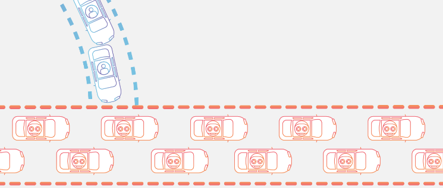

<h1 dir="rtl" align = "center"> DDoS/DoS  </h1>

<h1 dir="rtl">
مقدمه:</h1>

سناریویی را تصور کنید که وب سایت شما در ماه گذشته هر روز به طور میانگین 2M بازدید داشته است، در این بازه، متریک ها نشان میدهند که وب‌سایت شما حتی در زمان پیک شلوغی (300 request per second) نیز عملکرد قابل قبول از خود نشان داده است، برای مثال response time شما در تمام request های ارسال شده زیر 100ms بوده است، همچنین برای اینکه از نتیجه ماه‌های بعدی نیز مطمئن شوید، یک load test روی وبسایت و API های خود انجام میدهید که نشان میدهد وبسایت شما توانایی تحمل دو برابر rps را نیز دارد (600 request per second)

شاید با دیدن این اعداد و ارقام به این نتیجه برسید که وب سایت شما قطعا در ماه های آینده نیز مشکلی نخواهد داشت و همه چیز به خوبی پیش خواهد رفت، ولی این نتیجه‌گیری لزوما درست نیست، اگر با حملات DDoS آشنا نباشید یا برای مقابله با آنها اقدامی انجام نداده باشید، احتمالا تنها با پرداخت ۱۰ دلار می توان وب سایت شما را از کار انداخت!

<h1 dir="rtl">
 تعریف Denial of service چیست؟</h1>

حمله‌های Dos) denial-of-service) تلاش‌هایی برای ایجاد اختلال در ترافیک عادی یک سرویس با استفاده از ایجاد یک سیل ترافیک اینترنت مصنوعی هستند.

در حمله DoS مهاجم به سیستم مورد هدف درخواست های پیوسته و مازاد ارسال میکند.

در واقع مهاجم تلاش میکند با درخواست هایی که ایجاد و ارسال می کند منابع سیستم هدف را مصرف کند و از رسیدن خدمت به درخواست‌های واقعی جلوگیری کند.

برای مثال، اگر یک وب‌سایت بانکی بتواند در API ورود به سیستم، 10 نفر را در ثانیه مدیریت کند، مهاجم فقط باید 10 درخواست جعلی در ثانیه ارسال کند تا هیچ کاربر واقعی دیگری نتواند وارد سیستم شود.

یکی از چالش برانگیزترین حملات DoS از لحاظ جلوگیری و بازیابی، حمله (distributed denial-of-service (DDoS است. در یک حمله DDoS، مهاجم سعی می‌کند با هدایت ترافیک پیوسته و عظیم از <strong>چندین دستگاه</strong>، سرویس خاصی را از دسترس خارج کند. با توجه به این ترافیک عظیم، منابع در ارائه درخواست های آن دستگاه‌ها به اشتباه استفاده می شود،  به طوری که یک کاربر با یک درخواست واقعی قادر به دسترسی به منابع برای خود نیست. به دلیل اینکه در این روش سیستم‌های مخرب متعددی پشت سر هم برای اجرای حمله کار می‌کنند، پیدا کردن منبع حمله و توقف آن سخت‌تر میشود.

از یک دیدگاه سطح بالا، یک حمله DDoS/DoS مثل یک ترافیک غیر منتظره است که بزرگراه را مسدود می کند و از رسیدن ترافیک منظم به مقصد جلوگیری می کند.

<h2 dir="rtl">
هدف مهاجم:</h2>

برخلاف سایر حملات سایبری، حملات DoS معمولاً منجر به سرقت، تخریب یا خراب شدن داده ها نمی شود. در عوض، حملات DoS با ناتوانی سازمان در اجرای سرویس‌های ضروری باعث آسیب می‌شوند که بازیابی آن می‌تواند پرهزینه باشد. بانک‌ها، شرکت‌های رسانه‌ای، دولت‌ها و سایر سازمان‌های بزرگ به دلیل سطح بالای اختلالی که ناتوانی در عملکرد آنها ایجاد می‌کند، همگی اهداف محبوبی برای این حمله‌ها هستند.

<h2 dir="rtl">
هزینه برای مهاجم:</h2>

شاید در ابتدا اینطور به نظر بیاید که برای اینکه مهاجم بتواند وب سایت ما را با اختلال مواجه کند، به هزینه هنگفتی احتیاج دارد که شاید حتی از خسارتی که میزند بیشتر باشد، ولی اصلا اینگونه نیست، برای اینکه به هزینه‌ای که یک مهاجم برای یک حمله DDoS پرداخت میکند پی ببرید، میتوانید عبارت DDoS as a service را در گوگل جستجو کنید.

طبق <a href="https://socradar.io/dark-web-stories-ddos-as-a-service/">[1]</a> در دارک وب ارائه دهندگان DDoS as a service ادعا میکنند که با پرداخت ۵ دلار برای یک ساعت یا ۳۰ دلار برای یک روز به هدف مورد نظر شما حمله میکنند.

<h2 dir="rtl">
حمله های معروف:</h2>

حمله های DDoS موفق بسیار زیادی وجود دارد و هر سال به تعداد این حمله ها اضافه میشود، تعدادی از این حمله ها لیست شده اند:

<h3 dir="rtl">
بات‌نت Mirai:</h3>

در Sep 2016، وبلاگ شخصی به نام برایان کربس که یک کارشناس امنیت سایبری بود، توسط یک حمله DDoS بیش از 620 گیگابیت بر ثانیه مورد حمله قرار گرفت. سایت کربس قبلا از July 2012 به تعداد 269 حمله DDoS را ثبت کرده بود! اما این حمله تقریباً سه برابر بیشتر از هر چیزی بود که سایت او یا اینترنت قبلاً دیده بود.

منبع این حمله بات‌نت Mirai بود که شامل بیش از ۶۰۰ هزار دستگاه اینترنت اشیا در معرض خطر مانند دوربین های IP، روترهای خانگی و پخش کننده های ویدئویی بود.

<h3 dir="rtl">
آمازون:</h3>

در Feb 2020 خدمات وب آمازون، مورد حمله DDoS قرار گرفت. یک مشتری ناشناس AWS را با استفاده از تکنیکی به نام Connectionless Lightweight Directory Access Protocol هدف قرار داد. این حمله به مدت سه روز به طول انجامید و با سرعت خیره کننده 2.3 ترابایت در ثانیه به اوج خود رسید.

<h3 dir="rtl">
حمله به گوگل:</h3>

در Oct 2020، حمله به هزاران آدرس IP گوگل که منشا آن از سه ISP چینی بود، شش ماه طول کشید و با سرعت خیره کننده 2.5 ترابیت بر ثانیه به اوج خود رسید!

<h3 dir="rtl">
گیتهاب:</h3>

در Feb 2018، سایت GitHub، با یک حمله DDoS با سرعت 1.35 ترابیت بر ثانیه به مدت تقریبا 20 دقیقه مورد حمله قرار گرفت.

<h1 dir="rtl">
انواع حملات DoS</h1>

از نظر تاریخی، حمله های DoS به طور معمول از آسیب پذیری های امنیتی موجود در طراحی شبکه، نرم افزار و سخت افزار سو استفاده کرده اند. این حمله ها امروزه شیوع کمتری یافته اند، زیرا حمله های DDoS ظرفیت مخرب بیشتری دارند و با توجه به ابزارهای موجود، اجرایشان آسان تر است. در واقعیت، اغلب حمله های DDoS تبدیل شوند. برخی از نمونه های تاریخی برجسته حمله های DoS شامل موارد فهرست زیر هستند:

<h2 dir="rtl">
حمله Smurf</h2>

در این حمله قدیمی DoS یک مهاجم خرابکار از نشانی برادکست شبکه دارای آسیب به واسطه ارسال پاکت های جعل شده سو استفاده می کرد تا نشانی IP مقصد را غرق کند.

<h2 dir="rtl">
حمله Ping flood</h2>

این حمله انکار سرویس ساده بر مبنای اشغال کردن هدف با بسته های پینگ ICMP اجرا می شود. به این ترتیب با حمله کردن به یک سرور با تعداد پینگ زیاد که پردازش آن در توان سرور نیست، امکان پاسخ دهی موثر از آن سلب می شود و وضعیت انکار سرویس رخ می دهد. این حمله نیز می تواند به صورت DDoS اجرا شود.

<h2 dir="rtl">
حمله Ping of Death</h2>

این حمله غالبا با یک حمله Ping Flood ترکیب می شود و شامل ارسال یک بسته خرابکارانه به دستگاه هدف است که منجر به بروز رفتارهای ناهنجار مانند کرش کردن سیستم می شود.

<h1 dir="rtl">
حمله DoS چگونه کار می کند؟</h1>

تمرکز اصلی حمله DoS روی اشغال کردن کامل ظرفیت دستگاه هدف و در نتیجه انکار قابلیت سرویس دهی به درخواست های اضافی است. حملات DoS عموما در دو دسته طبقه بندی می شوند: حمله های سرریز بافر و حمله های سیل آسا

<h2 dir="rtl">
حملات سرریز بافر (Buffer Overflow)</h2>

در این نوع از حمله یک سرریز بافر حافظه موجب می شود که دستگاه همه فضای هارد دیسک، حافظه یا زمان پردازنده را مورد استفاده قرار دهد. این نوع از اکسپلویت غالبا منجر به بروز رفتار کند شدن سرور، کرش کردن سیستم و یا دیگر رفتارهای ناهنجار در سرور می شود که در نهایت موجب انکار سرویس می شود.

<h2 dir="rtl">
حمله های سیل آسا</h2>

در این روش یک مهاجم خرابکار با اشباع کردن سرور هدف گیری شده با تعداد زیادی بسته های داده، می تواند ظرفیت سرور را اشغال کند که در نهایت منجر به بروز وضعیت انکار سرویس می شود. برای این که اغلب حمله های DoS موفق باشند، مهاجم خرابکار باید پهنای باند بیشتری نسبت به هدف خود داشته باشد.

<h1 dir="rtl">
حمله DDoS چگونه کار می کند؟</h1>

حملات DDoS با شبکه‌ای از دستگاه‌های متصل به اینترنت انجام می شود. هر کدام از دستگاه‌های مورد استفاده مهاجم می توانند رایانه‌ای آلوده، مودم، دستگاه‌های ‌IoT یا هر منبع شبکه دیگری باشند که به بدافزار آلوده شده‌اند و به آنها اجازه می‌دهند از راه دور توسط یک مهاجم کنترل شوند.

این دستگاه‌های منفرد به عنوان ربات (یا زامبی) شناخته می‌شوند و به گروهی از ربات‌ها بات‌نت می‌گویند. هنگامی که یک بات نت ایجاد شد، مهاجم می تواند با ارسال دستورالعمل های راه دور به هر ربات، حمله را هدایت کند. هنگامی که سرور یا شبکه قربانی توسط بات نت مورد هدف قرار می گیرد، هر ربات درخواست هایی را به آدرس IP مورد نظر ارسال می کند که به طور بالقوه باعث می شود سرور یا شبکه تحت فشار قرار گیرد و در نتیجه سرویس به ترافیک عادی منع شود. از آنجایی که هر ربات یک دستگاه اینترنتی قانونی است، جداسازی ترافیک حمله از ترافیک عادی می تواند دشوار باشد.

<h1 dir="rtl">
چگونه میتوانیم یک حمله DDoS را شناسایی کنیم؟</h1>

بارزترین علامت حمله DDoS این است که سایت یا سرویسی ناگهان کند می شود یا در دسترس نیست. 

زمانی که این حملات اتفاق می افتد، اگر شما زود متوجه شوید امکان دارد که تا حدودی بتوانید از بروز خسارات بیشتر جلوگیری کنید. اگر سرعت پاسخگویی سرور شما به طور غیرمنتظره ای کاهش یابد میتواند از علائم این حملات باشد. اما توجه داشته باشید که گاهی شما این موارد را میبینید ولیکن حمله نیستند بلکه ممکن است هر نوع اختلال یا حتی افزایش کاربر عادی باشد.

مورد بعد، عدم اتصال صفحات داینامیک به سرور است که در این مواقع معمولا پیام تکمیل ظرفیت را دریافت خواهید کرد. پیشنهاد می شود در صورت مشاهده این مورد مرورگرها را طوری تنظیم کنید که تا مدتی به سایت شما مراجعه نشود. نشانه بعدی استفاده بیش از حد و غیرعادی از منابع سرور مثل حافظه یا پهنای باند است که اصولا در مدت زمان کوتاهی اتفاق می افتد.

به طور کل، در ابتدای توضیحات خود این را مطرح کردیم که حمله کننده ها با ارسال درخواست های زیاد و غیرمعمول تلاش برای تخریب سرور شما دارند؛ پس اگر تعداد درخواست های بالا و غیرعادی دریافت کردید باید بدانید که از نشانه های حملات داس و دیداس است. 

<h1 dir="rtl">
تفاوت حمله Dos و DDos</h1>

با توجه به آنچه پیش از این توضیح دادیم، شناخت تفاوت های این دو حمله ساده است. در حملات دیداس ترافیک از چند سیستم متفاوت به سایت شما منتقل می شود که در واقع ردیابی و دسترسی به فرد حمله کننده را دشوارتر می کند و نسبت به حملات مخرب تر و گسترده تری صورت می گیرد. حملات داس اصولا ساده تر هستند و شما حتی با سیستم شخصی خود نیز می توانید در ابعاد محدودی سرور مورد نظرتان را مورد حمله قرار دهید.

<h1 dir="rtl">
مدت زمان حمله</h1>

شاید این سوال برای شما هم پیش بیاید که از آغاز حمله تا پایان آن چقدر زمان می برد. باید بگوییم که برای این گونه مسائل مدت زمان معینی نمی توان مشخص کرد؛ چرا که به میزان سماجت مهاجم و قدرت مقابله مدافع بستگی دارد. به زبان ساده تر، اگر مهاجم به کار خود ادامه دهد و مدافع نیز نتواند به خوبی اوضاع را کنترل کند و از حمله جلوگیری کند، ممکن است حمله ساعت ها طول بکشد. در بهترین و خوشبینانه ترین حالت، ظرف مدت کوتاهی (حدود چند دقیقه) به پایان می رسد و در بدترین حالت ممکن است چندین روز و به طور مرتب این حملات به طول انجامد.

<h1 dir="rtl">
مراجع:</h1>

[https://socradar.io/dark-web-stories-ddos-as-a-service/](https://socradar.io/dark-web-stories-ddos-as-a-service/)

https://www.cloudflare.com/learning/ddos/what-is-a-ddos-attack/

https://phoenixnap.com/blog/prevent-ddos-attacks

https://www.imperva.com/learn/ddos/booters-stressers-ddosers

[https://securelist.com/the-cost-of-launching-a-ddos-attack/77784/](https://securelist.com/the-cost-of-launching-a-ddos-attack/77784/)

[https://medium.com/@nancyjohn_95536/dos-ddos-attacks-cdbba870af3b](https://medium.com/@nancyjohn_95536/dos-ddos-attacks-cdbba870af3b)

[https://mihanwp.com/dos-and-ddos-attacks/](https://mihanwp.com/dos-and-ddos-attacks/)

نویسندگان:

میکائیل قربانی

رویا قوامی

محمدعلی حسین نژاد

