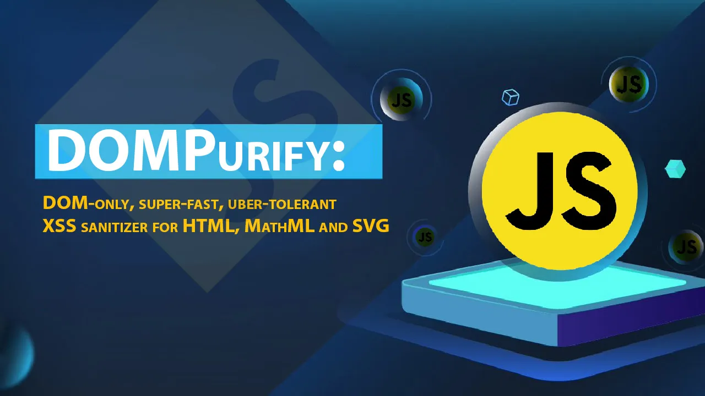
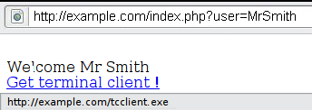
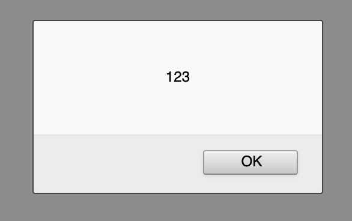

## Dompurify

<p align=center></p>

### 📝فهرست

- [مقدمه](#مقدمه)
- [چرا جاوا اسکریپت؟](#چرا-جاوا-اسکریپت)
- [زمان رخ دادن XSS](#زمان-رخ-دادن-xss)
- [انواع XSS](#انواع-xss)
- [کاربردهای XSS Attack](#کاربردهای-xss-attack)
- [تعریف Document Object Model](#تعریف-document-object-model)
- [حمله‌ی DOM-based XSS](#dom-based-xss)
- [حمله‌ی Reflected XSS](#reflected-xss)
- [حمله‌ی Stored XSS](#stored-xss)
- [جلوگیری از حملات XSS](#xss-جلوگیری-از-حملات)
- [آنچه یادگرفتیم](#آنچه-یادگرفتیم)
- [منابع](#منابع)

### ✍️نویسندگان

- [آرش یادگاری](https://github.com/Arash1381-y)
- [ایمان محمدی](https://github.com/Imanm02)
- [هستی کریمی](https://github.com/HastiKarimi)

<hr>

## مقدمه

اگر شما یک برنامه‌نویس باشید، احتمال زیادی داره که درباره‌ی Cross-site scripting مطالبی خوانده باشید. Cross-site
scripting که معمولاً به اسم XSS شناخته می‌شود، به حملاتی گفته می‌شود که در آن اسکریپت‌های مخرب، به وب‌سایت های بزرگ و
معتبر تزریق می‌شوند.

حملات Cross-site Scripting در HTML، Flash، ActiveX و CSS امکان پذیر هستند، با این حال چون بیشتر کاربران اینترنت از جاوا
اسکریپت استفاده می‌کنند، اکثر هکرها بر روی این گزینه تمرکز دارند.

در این روش هدف هکر بیشتر کاربرانی هستند که به سایت مراجعه کرده‌اند. در واقع هکرها در این نوع حمله، اطلاعات کاربران یک
سایت را بدون اطلاع خودشون، به سرقت می‌برند.

## چرا جاوا اسکریپت؟

جاوا اسکریپت محبوب‌ترین زبان برنامه‌نویسی برای طراحی وب است، به شما این قابلیت‌ها را می‌دهد که هر کاری در صفحه‌ی وب
خودتون انجام دهید و ویژگی‌های پیچیده را به سادگی پیاده‌سازی کنید؛

در مقابل برای آسیب‌رسانی به صفحه‌ی وب و سرقت اطلاعات کاربرها هم از آن استفاده می‌شود و برای ورود به backend سایت و تزریق
اسکریپت‌های مخرب، جاوا اسکریپت محبوب‌ترین میزبان حملات Cross-site Scripting می‌باشد.

## زمان رخ دادن XSS

حمله‌ی Cross-site scripting یا XSS زمانی رخ می‌دهد که هکر یا کاربر مخرب، وب‌سایت یا وب‌اپلیکشن را به شکلی دستکاری می‌کند
تا جاوا اسکریپت مخرب بازگردد به کاربر. زمانی که این کد جاوا اسکریپت مخرب در مرورگر کاربر اجرا می‌شود، تمام ارتباطات
کاربر با وب‌سایت در معرض خطر قرار می‌گیرند و اطلاعات کاربر برای مهاجم، قابل سرقت خواهند بود.

## انواع XSS

سه نوع اصلی از حملات Cross-site Scripting وجود دارد:

۱. حمله‌ی XSS ذخیره شده (Stored cross-site scripting)
۲. حمله‌ی XSS منعکس شده (Reflected)
۳. حمله‌ی XSS مبتنی بر (DOM (Document Object Model
در ادامه هر کدام از انواع حملات XSS بررسی خواهد شد.

## کاربردهای XSS Attack

• هر عملیاتی که کاربران عضو شده در یک سامانه، به ویژه کاربران خاص با دسترسی بالا و premium، می‌توانند انجام دهند را
انجام دهد.

• به همه‌ی داده‌هایی که کاربر عضو می‌تواند به آن‌ها دسترسی پیدا کند، دسترسی داشته باشد؛ آن‌ها را بخواند یا دستکاری کند

• خود را به جای کاربر دیگری جا بزند و به حساب کاربری او نفوذ کند.

• یک بدافزار به وب‌سایت تزریق کند تا مراجعه‌کنندگان نیز آلوده شوند. مهاجم می‌تواند به وسیله‌ی بدافزار جاسوسی کند یا
اطلاعاتی را، حتی بدون آگاهی کاربر قربانی، به دست آورد.

• اطلاعات ورود یا لاگین کاربر را بخواند و ذخیره کند.

• وب‌سایت را Deface کند. (نوعی از حمله بر روی وب‌سایت که ویژگی‌های ظاهری سایت را تحت تاثیر قرار می‌دهد.)

## تعریف Document Object Model

همانطور که می‌دانید، DOM یا Document Object Model مدلی شی‌گرا با ساختاری درختی از اجزای موجود در صفحه می‌باشد. DOM
تقریبا، ظاهری مانند تصویر زیر دارد:

<p align=center></p>

## DOM-based XSS

این نوع حمله‌ی XSS زمانی رخ می‌دهد که ورودی کاربر به روش خطرناکی توسط جاوا اسکریپت در Document Object Map دستکاری شود.
برای مثال زمانی می‌تواند رخ دهد که مقداری از یک form خوانده شود و دوباره از جاوا اسکریپت استفاده شود تا مقدار در DOM
تغییر یابد.

برای ارائه‌ی یک حمله Dom based XSS شما باید داده را در یک منبع ذخیره کنید تا در sink پخش و باعث اجرای کد دلخواه شود.
رایج‌ترین منبع برای اجرای حمله‌ی Dom based XSS، یک URL می‌باشد که معمولا به شی window.location دسترسی دارد. نفوذگر
می‌تواند پیوندی را برای قربانی ارسال نماید و قربانی را به یک صفحه آسیب پذیر همراه یک پیلود در query string هدایت کند.

منابع DOM-based XSS معمولاً شامل تابع eval() و ویژگی innerHTML می‌باشند و حمله‌ها به واسطه‌ی یک URL انجام می‌شود.

<div dir="ltr">

  ```js
const username = document.getElementById('username_input');
const username_box = document.getElementById('username_box');
user_name_box.innerHTML = username;
  ```

</div>

برای اجرای این حمله، می‌توانید به input اجرا شده، یک کد مخرب اضافه کنید:

<div dir="ltr">

  ```js
<script>
    window.alert("Cross site scripting has occurred!");
</script>
  ```

</div>

## Reflected XSS

این نوع از حملات رایج ترین شکل از حملات XSS هستند. در این حملات یک کد قابل اجرا درون مرورگر به عنوان یک پارامتر درون یک
HTTP request قرار می‌گیرد. کد تزریق شده درون برنامه ذخیره نمی‌شود و تنها کاربرانی را آلوده می‌کند که بر روی URL
آلوده‌شده کلیک کرده‌اند. برای درک بهتر به مثال زیر دقت کنید.

فرض کنید یک وب اپلیکشین ساده طراحی کرده‌ایم که در آن یک پیام خوش‌آمد گویی و سپس یک لینک برای دریافت و یا دانلود یک
برنامه‌ است.

<p align=center></p>

همانطور که مشاهده می‌کند درون درخواست یک پارامتر به نام user استفاده شده است. بیایید سعی کنیم بجای نام کاربر یک اسکریپت
ساده را ارسال کنیم.

[//]: # (make code block ltr)
<div dir="ltr">

```html
<!-- Polluted request:-->
https://example.com/index.php?user=
<script> alert(123)</script>
```

</div>

اگر برنامه در برابر این حمله مقاوم نباشند، اطلاعات مشاهده شده در مرورگر به این صورت خواهد بود:

<p align=center></p>

این حملات ممکن است باعث اجرای فایل‌های آلوده‌ای در دستگاه کاربر بشود.
فرض کنید یک درخواست آلوده به این صورت پیاده کنیم:

<div dir="ltr">

```html
  https://example.com/index.php?user=
<script>window.onload = function () {
    const AllLinks = document.getElementsByTagName("a");
    AllLinks[0].href = "https://badexample.com/malicious.exe";
}</script>
```

</div>

همانطور که مشاهده می‌کنید در صورتی که برنامه در برابر این حمله مقاوم نباشد، بجای لینک اصلی، یک لینک آلوده با یک فایل
اجرایی مخرب جایگزین می‌شود.

## Stored XSS

این نوع حمله زمانی اتفاق می‌افتد که دیتاهای تولید شده توسط یک یوزر در دیتابیس ذخیره شده و در زمان مورد نیاز در صفحه لود می‌شوند.

مثال‌هایی برای این شرایط می‌توانند فرم‌ها یا پلاگین‌هایی که برای کامنت گذاری استفاده می‌شوند باشند. این موضوع زمانی خطرناک می‌شود که دیتای تولید شده توسط من توسط کاربران دیگر بتواند دیده شود و به عبارتی توسط آن‌ها مشاهده شده و در صفحه‌اشان لود شود. در این صورت اسکریپت تولید شده توسط کاربر اتک‌کننده بدون رضایت کاربران دیگر برایشان اجرا شده و می‌تواند عواقبی به همراه داشته باشد.

برای مثال فرض کنید در یک سایت هر کاربر قابلیت ایجاد ترد دلخواهش را داشته باشد و این تردها در دیتابیس ذخیره شوند. سپس در صورتی که کاربر دیگری بخواهد از آن ترد دیدن کند، اطلاعات ذخیره شده در دیتابیس در صفحه‌اش لود می‌شود و به او نشان داده می‌شود. یک کاربر حمله‌کننده می‌تواند کدهای حاوی حمله‌ی خود را بین تگ
<div dir="ltr">
  
  ```js
<script></script>
  ```
</div>

قرار دهد و این کد در بروزر هر کاربری که آن ترد را مشاهده می‌کند اجرا می‌شود

### مثال
<div dir="ltr">
  
  ```js
  <script>
      alert('You are being attacked by Stored XSS');
  </script>
  ```
</div>


## XSS جلوگیری از حملات

در قسمت قبل، با انواع حملات XSS آشنا شدیم. همانطور که مشاهده کردید، هریک از این حملات می‌توانند یک بستر خاص را مورد هدف قرار دهند. 

| Type      	| Origin 	|
|-----------	|--------	|
| Stored    	| Server 	|
| Reflected 	| Server 	|
| DOM-based 	| Client 	|

یکی از راه‌های جلوگیری از این نوع حملات استفاده از کتابخانه‌هایی هستند که می‌توانند درخواست‌های آلوده یا محتویات فایل‌های HTML‌ای که آلوده شده‌اند را پاکسازی کنند. DOM Purify یکی از محبوب‌ترین کتابخانه‌‌های مورد استفاده برای شناسایی و رفع آلودگی‌ها است تا از حملات احتمالی جلوگیری کند.

 ## DOM purify
همانطور که از نام آن مشخص است، این کتابخانه می‌تواند با بررسی  مدل درختی، قسمت‌های آلوده را شناسایی و اصلاح کند. در ادامه چند مثال از نحوه عملکرد  DOM purify را مشاهده می‌کنید.

```javascript
import DOMPurify from 'dompurify';
DOMPurify.sanitize(''); // becomes 
DOMPurify.sanitize('<svg><g/onload=alert(2)//<p>'); // becomes <svg><g></g></svg>
DOMPurify.sanitize('<p>abc<iframe//src=jAva&Tab;script:alert(3)>def</p>'); // becomes <p>abc</p>
DOMPurify.sanitize('<math><mi//xlink:href="data:x,<script>alert(4)</script>">'); // becomes <math><mi></mi></math>
DOMPurify.sanitize('<TABLE><tr><td>HELLO</tr></TABL>'); // becomes <table><tbody><tr><td>HELLO</td></tr></tbody></table>
DOMPurify.sanitize('<UL><li><A HREF=//google.com>click</UL>'); // becomes <ul><li><a href="//google.com">click</a></li></ul>
```

<div dir="rtl">
URL‌ها یکی از محبوب‌ ترین اهداف برای انواع حملات هستند. در حملات reflected XSS و DOM-based XSS نمونه‌هایی از دستکاری URL را دیدیم.
به کمک DOM purify می‌توانیم از آلوده نبودن URL اطمینان حاصل کنیم.


</div>

```javascript
import DOMPurify from 'dompurify';
let windowUrl = window.location.href;
let cleanUrl = DOMPurify.sanitize(windowUrl);
```

با اینکه DOM purify در سمت Client می‌تواند از حملات DOM-based XSS جلوگیری کند اما برای جلوگیری از دیگر حملات نیاز است تا بتوانیم در سمت سرور نیز پاکسازی‌های لازم را انجام دهیم. 

به دلیل آنکه در سمت سرور به DOM دسترسی نداریم لازم است تا یک DOM را در سمت سرور بسازیم. یکی از راه‌های ساختن، استفاده از کتابخانه jsdom است. با کمک این کتابخانه می‌توانیم آبجکت‌های آلوده را در سمت سرور نیز شناسایی کنیم تا از بروز حملاتی مانند reflected XSS‌ها و stored XSS‌ها جلوگیری کنیم.

```javascript
import { JSDOM } from 'jsdom';
import DOMPurify from 'dompurify';

const window = new JSDOM('').window;
const purify = DOMPurify(window);
const clean = purify.sanitize('<b>hello there</b>');
```

## آنچه یادگرفتیم
در این مطلب سعی شد تا انواع حملات XSS شیوه بکارگیری آنها و همچنین را‌ه‌های جلوگیری از آن در برنامه‌هایمان را معرفی کنیم. 
دیدیم که برای پاکسازی و جلوگیری از اجرا شدن کد‌های آلوده توسط کاربران می‌توانیم از کتابخانه‌هایی مانند DOM purify استفاده کنیم و ههمچنین
شیوه‌های به کارگیری آن در سمت client و server را دیدیم.

## منابع

- [GitHub - cure53/H5SC](https://github.com/cure53/H5SC)
- [GitHub - cure53/XSSChallengeWiki](https://github.com/cure53/XSSChallengeWiki/wiki)
- [XSS: What it is, how it works, and how to prevent it](https://medium.com/codelighthouse/xss-what-it-is-how-it-works-and-how-to-prevent-it-454629e3a0da)
- [XSS: Cross-site scripting](https://security.snyk.io/vuln/SNYK-JS-DOMPURIFY-2863266)
- [Type of XSS](https://owasp.org/www-community/Types_of_Cross-Site_Scripting)
- [Testing for Reflected XSS](https://github.com/OWASP/wstg/blob/master/document/4-Web_Application_Security_Testing/07-Input_Validation_Testing/01-Testing_for_Reflected_Cross_Site_Scripting.md)

</div>
