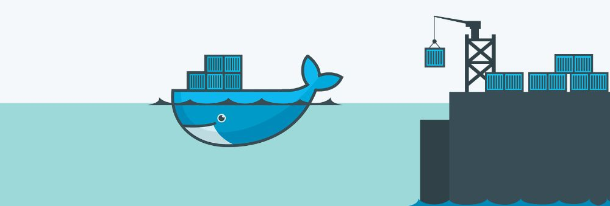

<div dir="rtl" align="justify">

<h1 align="center">
راه‌اندازی استک نرم‌افزاری
MySql/Asp.Net Core/PHP/Redis 
توسط داکر
</h1>

<div align="center">
  <i>
    نویسندگان:
    <a href="https://github.com/ahmadsalimi">
    احمد سلیمی
    </a>
    -
    <a href="https://github.com/ArmanZarei">
    آرمان زارعی
    </a>
    -
    <a href="https://github.com/Mobinapournemat">
    مبینا پورنعمت
    </a>
  </i>
</div>

<hr>

داکر یه پلتفرم متن‌باز برای توسعه
(development)
و استقرار
(deployment)
نرم‌افزارهاست. تو داکر هر سرویس یا نرم‌افزار رو میشه روی یک محیط ایزوله که بهش
Container
گفته میشه اجرا کرد که کاراییشون به شدت از ماشین‌های مجازی بهتره

<div align="center">

</div>

تو این نوشته، میخوایم نحوهٔ راه‌اندازی یک استک نرم‌افزاری که شامل یک سرور
Asp .Net Core،
یک سرور
MySql،
یک سرور
PHP
و یک سرور
Redis
هست رو با استفاده از
Docker Compose
شرح بدیم. در ضمن، کدها و کانفیگ‌های توضیح داده‌شده در این مطلب، به طور کامل تو همین ریپازیتوری موجوده.

<h2>
  راه‌اندازی
  Docker
  و
  Docker Compose
</h2>

با استفاده از دستور زیر، به راحتی می‌تونید
docker
و
docker-compose
رو روی سیستم لینوکسی‌تون نصب کنید.

<div dir="ltr">
  
```Bash
> curl -sSL https://get.docker.com/ | sh
> sudo apt install docker-compose
```
</div>

<h2>
  راه‌اندازی سرور
  Asp .Net Core
  و اتصال آن به MySql
</h2>

قبل از شروع، باید
dotnet cli
رو نصب کنید. نحوهٔ نصب این نرم‌افزار رو می‌تونید تو
<a href="https://docs.microsoft.com/en-us/dotnet/core/install/linux">
این لینک
</a>
ببینید.

حالا باید
Solution
پروژه رو بسازیم و یک پروژهٔ
Web API
بهش اضافه کنیم. این کار با استفاده از کامند زیر قابل انجامه:

<div dir="ltr">
  
```Bash
> dotnet new sln -n SimpleWebApi -o aspnetcore
> cd aspnetcore
> dotnet new webapi -n SimpleWebApi -o SimpleWebApi
> dotnet sln add SimpleWebApi
```
</div>

حالا فایل‌های پروژه ساخته شده و می‌تونیم سرور رو آماده کنیم. تو این سرور، می‌خوایم یک مدل
Note
داشته باشیم که شامل عنوان و متنه، و برای اضافه کردنش به دیتابیس یا خوندن
Note
هایی که داریم
API
بنویسیم.

اول از همه مدلمون رو تو مسیر
`aspnetcore/SimpleWebApi/Models/Note.cs`
می‌نویسیم.

<div dir="ltr">
  
```CSharp
using System.ComponentModel.DataAnnotations.Schema;

namespace SimpleWebApi.Models
{
    public class Note
    {
        [DatabaseGenerated(DatabaseGeneratedOption.Identity)]
        public int Id { get; set; }
        public string Title { get; set; }
        public string Text { get; set; }
    }
}
```
</div>

حالا باید برای این مدل،
DbContext
بنویسیم که بشه اون رو تو دیتابیس
MySql
مون نوشت یا ازش خوند.

قبل از هر چیزی، باید پکیج‌های مورد نیاز رو به پروژه اضافه کنیم.

<div dir="ltr">
  
```Bash
> dotnet add SimpleWebApi package MySql.Data
> dotnet add SimpleWebApi package MySql.Data.EntityFrameworkCore
> dotnet add SimpleWebApi package EntityFramework
> dotnet add SimpleWebApi package Microsoft.EntityFrameworkCore.Tools
```
</div>

حالا
DbContext
رو تو فایل
`aspnetcore/SimpleWebApi/MySql/MySqlDbContext.cs`
می‌نویسیم.


<div dir="ltr">
  
```CSharp
using Microsoft.EntityFrameworkCore;
using Microsoft.Extensions.Configuration;
using SimpleWebApi.Models;

namespace SimpleWebApi.MySql
{
    public class MySqlDbContext : DbContext
    {
        private readonly IConfiguration config;

        public MySqlDbContext(IConfiguration config)
        {
            this.config = config;
            Database.EnsureCreated();
        }

        public DbSet<Note> Notes { get; set; }

        protected override void OnConfiguring(DbContextOptionsBuilder optionsBuilder)
        {
            var connectionString = $"Server={config["DB_HOST"]};Database={config["DB_DATABASE"]};port=3306;user={config["DB_USER"]};password={config["DB_PASSWORD"]}"
            optionsBuilder.UseMySQL(connectionString);
        }

        protected override void OnModelCreating(ModelBuilder modelBuilder)
        {
            base.OnModelCreating(modelBuilder);

            modelBuilder.Entity<Note>(entity =>
            {
                entity.HasKey(e => e.Id);
                entity.Property(e => e.Title)
                    .IsRequired()
                    .HasMaxLength(100);
                entity.Property(e => e.Text)
                    .IsRequired()
                    .HasColumnType("TEXT");
            });
        }
    }
}
```
</div>

همونطور که می‌بینید، تو خط ۲۱ که
connection string
رو ساختیم، مشخصات دیتابیس از کانفیگ خونده می‌شه که در ادامه می‌بینیم چجوری.

حالا باید کانفیگ‌ها، و
DbContext
ای که نوشتیم رو به سرویس‌های
Web App
اضافه کنیم. قبل از همه، باید به
Asp .Net Core
بگیم که متغیرهای محیطی‌ای که با
`DOTNET_`
شروع میشن رو برامون بعنوان کانفیگ در نظی بگیره. برای این کار، تو
`Program.cs`،
تابع
`CreateHostBuilder`
رو به صورت زیر تغییر میدیم.

<div dir="ltr">
  
```CSharp
public static IHostBuilder CreateHostBuilder(string[] args) =>
Host.CreateDefaultBuilder(args)
    .ConfigureAppConfiguration((hostingContext, config) =>
    {
        config.AddEnvironmentVariables(prefix: "DOTNET_");
    })
    .ConfigureWebHostDefaults(webBuilder =>
    {
        webBuilder.UseStartup<Startup>();
    });
```
</div>

و بعد هم تو
`Startup.cs`،
دو خط زیر رو به تابع
`ConfigureServices`
اضافه می‌کنیم.

<div dir="ltr">
  
```CSharp
services.Configure<IConfiguration>(Configuration);
services.AddDbContext<MySqlDbContext>();
```
</div>

و خط زیر رو هم از تابع
`Configure`
حذف می‌کنیم که سرور،
request
ها رو مجبور به استفاده از
https
نکنه.

<div dir="ltr">
  
```CSharp
app.UseHttpsRedirection();
```
</div>

در قدم آخر هم، باید
Api Controller
مون رو بنویسیم. این کنترلر، یک
API
برای اضافه کردن یک
Note
و یک
API
برای گرفتن لیست تمام
Note
ها داره. قبل از نوشتن
API
ها، برای
API
اضافه کردن
Note،
باید یک
DTO
بنویسیم.

<div dir="ltr">
  
```CSharp
namespace SimpleWebApi.ApiParameters
{
    public class NoteParameter
    {
        public string Title { get; set; }
        public string Text { get; set; }
    }
}
```
</div>

کنترلر رو هم باید تو مسیر
`aspnetcore/SimpleWebApi/Controllers/NotesController.cs`
بسازیم.

<div dir="ltr">
  
```CSharp
using Microsoft.AspNetCore.Mvc;
using SimpleWebApi.ApiParameters;
using SimpleWebApi.Models;
using SimpleWebApi.MySql;
using System.Collections.Generic;
using System.Linq;
using System.Threading.Tasks;

namespace SimpleWebApi.Controllers
{
    [ApiController]
    [Route("[controller]")]
    public class NotesController : Controller
    {
        private readonly MySqlDbContext dbContext;
        
        public NotesController(MySqlDbContext dbContext) => this.dbContext = dbContext;

        [HttpPost]
        public async Task Post([FromBody] NoteParameter parameter)
        {
            var note = new Note
            {
                Title = parameter.Title,
                Text = parameter.Text
            };

            await dbContext.Notes.AddAsync(note);
            await dbContext.SaveChangesAsync();
        }

        [HttpGet]
        public IEnumerable<Note> Get() => dbContext.Notes.ToList();
    }
}
```
</div>

همونطور که می‌بینید، دو تا
API
داریم که بصورت زیر میشه ازشون استفاده کرد.

<div dir="ltr">
  
```HTTP
POST /notes
{
    "title": "title",
    "text": "text"
}

GET /notes
```
</div>

خب تبریک میگم. سرور
Asp Net Core
حاضره. حالا کافیه که این سرور رو برای داکر کانفیگ کنیم. اول باید براش یه
Dockerfile
بنویسیم. این فایل رو تو مسیر
`aspnetcore/Dockerfile`
می‌سازیم.

<div dir="ltr">
  
```Dockerfile
FROM mcr.microsoft.com/dotnet/sdk:3.1 AS build
WORKDIR /app

# copy csproj and restore as distinct layers
COPY *.sln .
COPY SimpleWebApi/*.csproj ./SimpleWebApi/
RUN dotnet restore

# copy everything else and build app
COPY SimpleWebApi/. ./SimpleWebApi/
WORKDIR /app/SimpleWebApi
RUN dotnet publish -c Release -o out

FROM mcr.microsoft.com/dotnet/aspnet:3.1 AS runtime
WORKDIR /app
COPY --from=build /app/SimpleWebApi/out ./
ENTRYPOINT ["dotnet", "SimpleWebApi.dll"]
```
</div>

تو این فایل، اول فایل‌های
`csproj`
رو منتقل می‌کنیم به 
container،
و در ادامه پکیج‌های لازم رو
restore
می‌کنیم. بعد اپلیکیشن رو
build
می‌کنیم و کامند مربوط به اجرای اپلیکیشن رو مشخص می‌کنیم. حالا باید فایل
`docker-compose.yml`
رو تو دایرکتوری اصلی پروژه بسازیم و دیتابیس
MySql
و سرور
AspNetCore
مون رو بهش اضافه کنیم.

<div dir="ltr">
  
```yaml
version: '3.3'
services:
  aspnetcore:
    image: amadev/aspnetcore
    container_name: amadev-aspnetcore
    build: ./aspnetcore/
    depends_on:
      - database
    environment:
      - DOTNET_DB_HOST=database
      - DOTNET_DB_USER=root
      - DOTNET_DB_DATABASE=amadev_database
      - DOTNET_DB_PASSWORD=${MYSQL_ROOT_PASSWORD}
      - DOTNET_URLS=http://*
    ports:
      - 5000:80
  database:
    image: mysql:latest
    container_name: amadev-mysql
    environment:
      - MYSQL_ROOT_PASSWORD
    volumes:
      - ./db-data:/var/lib/mysql
```
</div>

همونطور که می‌بینید، کانتینر
aspnetcore
وابسته‌ست به
database،
و متغیرهای محیطی مربوط به دیتابیس و پورت اپلیکیشن توش مشخص شده. کانتینر
database
هم از
image
مربوط به
mysql
استفاده می‌کنه، که هنگام بیلد کردن پروژه برای اولین بار، داکر دانلودش می‌کنه. فایل‌های مربوط به دیتابیس هم تو مسیر
db-data
ذخیره میشن.

حالا با ران کردن دستور زیر، کانتینرها شروع به کار می‌کنن و سرور راه‌اندازی میشه.

<div dir="ltr">
  
```Bash
> sudo docker-compose up --build
```
</div>

از اونجایی که پورت
aspnetcore
روی 5000 قرار داده شده، از طریق
http://localhost:5000
قابل دسترسیه.

<h2>
  راه‌اندازی سرور
  PHP
  و اتصال آن به سرور
  Asp .Net Core
  و
  Redis
</h2>

در این قسمت می خوایم یک سرور
PHP
راه‌اندازی کنیم که درخواست رو از کاربر بگیره و از سرور
ASP.NET Core
مون اطلاعات رو دریافت کنه یا بهش اضافه کنه! در مرحله بعدی
Cache
رو با استفاده از
Redis Server
بهش اضافه می کنیم.

در فایل
docker-compose.yml
خطوط زیر رو پاک میکنیم و می خواهیم از سرور
PHP
بهش
Request
بزنیم و نیازی نیست پورتی به بیرون داشته‌باشه.

<div dir="ltr">
  
```yaml
ports:
     - "5000:80"
```

</div>

همچنین باید کانفیگ‌های زیر رو برای سرور
PHP
اضافه کنیم:

<div dir="ltr">
  
```yaml
php:
   build:
      context: ./php/
   depends_on:
      - aspnetcore
   ports:
      - 10:80
   volumes:
      - ./php/src:/var/www/html/
```

</div>

حالا باید
`php:7.4-apache`
رو به
`Dockerfile`
معرفی کنیم.

یک فایل
`htaccess.`
درون پوشه
`php`
ایجاد می‌کنیم که وظیفش اینه که همه‌ی
Request
هایی که به این فولدر (و ساب‌فولدرها) میاد رو بده به
`index.php`!

محتوای فایل
`htaccess.`
به صورت زیر خواهد بود:

<div dir="ltr">
  
```apacheconf
RewriteEngine On
 RewriteBase /
 RewriteCond %{REQUEST_FILENAME} !-d
 RewriteCond %{REQUEST_FILENAME} !-f
 RewriteRule ^(.+)$ index.php [QSA,L]
```

</div>

برای اینکه فایل
`htaccess`
مون بتونه کار کنه و
Apache
این اجازه رو بده ، توی
Dockerfile
مون دستور
`RUN a2enmod rewrite`
رو اضافه میکنیم.

در نهایت محتوای `php/Dockerfile` به صورت زیر خواهد بود:

<div dir="ltr">
  
```Dockerfile
FROM php:7.4-apache
RUN a2enmod rewrite
```

</div>

فایل
`php/src/CurlHttp.php`
یک فایل
`php`
هست که می تونه به سرورمون
Http Request
بزنه.

محتوای این فایل به صورت زیر خواهد بود:

<div dir="ltr">
  
```php
<?php

class CurlHttp
{
   private $base;
   public function __construct($base)
   { 
       $this->base = $base;
    }
   public function request($type, $url, $params = [])
    {
       switch (strtoupper($type)) {
           case "GET":
               return $this->getReq($url, $params);
               break;
           case "POST":
               return $this->postReq($url, $params);
               break;
           default:
               throw new Exception("Undefined Request Type");
        }
    }
   private function getReq($url, $params = [])
   { 
       $ch = curl_init($this->generateUrl($url));
       curl_setopt($ch, CURLOPT_RETURNTRANSFER, true);
       curl_setopt($ch, CURLOPT_HEADER, 0);
       $response = curl_exec($ch);
       curl_close($ch);

       return $response;
    }
   private function postReq($url, $params = [])
   {
       $ch = curl_init($this->generateUrl($url));
       curl_setopt($ch, CURLOPT_POSTFIELDS, json_encode($params)); 
       curl_setopt( $ch, CURLOPT_HTTPHEADER, array('Content- 
                    Type:application/json'));
       curl_setopt($ch, CURLOPT_RETURNTRANSFER, true);
       curl_setopt($ch, CURLOPT_HEADER, 0);
       $response = curl_exec($ch);
       curl_close($ch);
       return $response;
    }
   private function generateUrl($url)
    {
        return $this->base."/".$url;
    }
}
```

</div>

فایل دیگری که ایجاد کردیم
`Router.php`
هست که برای مدیریت کردن
Routing
استفاده میشه و محتوای آن به صورت زیر خواهد بود:


<div dir="ltr">
  
```php
<?php

class Router
{
    private $request;
    private $supportedMethods = [ "GET", "POST"    ];
    private $routes;
    public function __construct($request)
    {
        $this->request = $request; $this->bootstrapRoutes();
    }
    public function get($url, $callback)
    {
        $this->routes['GET'][$url] = $callback;
    }
    public function post($url, $callback)
    {
        $this->routes['POST'][$url] = $callback;
    }
    public function resolve($url, $method)
    {
        header('Content-Type: application/json');
        if (!isset($this->routes[strtoupper($method)])) {
            echo json_encode("Unsupported Http Method");
            return;
        }
        $callback = $this->routes[strtoupper($method)][$url] ?? null;
        if (!$callback) {
             echo json_encode("Unsupported Route");
             return;
        }
        echo call_user_func_array($callback, [$this->request]);
    }
   private function bootstrapRoutes()
    {
         foreach ($this->supportedMethods as $method) {
             $this->routes[$method] = [];
         }
    }
}
```

</div>

فایل دیگری که در گذشته نیز به آن اشاره کردیم
`index.php`
هست که
Request
ها رو دریافت می کنه و پارامترهایی که با
json
به آن ارسال شده رو می گیره و یک
Router
می سازه . بعد چک می کنیم که
Request
زده شده به
`/notes`
از نوع
GET
است یا
POST.
اگر از نوع
GET
بود یک
instance
از
CurlHttp
می‌سازیم
base address
مون هم
aspnetcore
قرار میدیم و در نهایت به
aspnetcore
مون یک
Request
از نوع
GET
می زنیم. اگر
Request
زده شده به 
`/notes`
از نوع
POST
باشه هم مانند
`GET`
عمل می کنیم با این تفاوت که
PostData
رو ست میکنیم و به
aspnetcore
مون
Request
از نوع
POST
می زنیم.

توجه داریم که در این جا با استفاده از نام
Container
می تونیم
Request
مون رو ارسال کنیم و لزومی به داشتن
IP
نیست!

در نهایت محتویات فایل
`index.php`
به صورت زیر خواهد بود:

<div dir="ltr">
  
```php
<?php
include "CurlHttp.php"
include "Router.php"
define("ASP_CONTAINER", "aspnetcore");
$url = $_SERVER['REQUEST_URI'];
$request = json_decode(file_get_contents('php://input'), true);
$router = new Router($request);
$router->get('/notes', function ($request) {
    $curl = new CurlHttp(ASP_CONTAINER);
    return $curl->request('GET', 'notes');
 });
$router->post('/notes', function ($request) {
    $curl = new CurlHttp(ASP_CONTAINER);
    $postData = ['title' => $request['title'],'text'=> $request['text'], 
    ];
    return $curl->request('POST', 'notes', $postData);
});
$router->resolve($url, $_SERVER['REQUEST_METHOD']);
```

</div>

<h3>
  اضافه کردن سرور
  Redis
  و
  Cache
  کردن داده‌ها در سرور
  PHP
</h3>

تو این بخش می خوایم
Cache
رو اضافه کنیم. برای استفاده از افزونه
Redis
عه
php
یعنی
predis
به
Composer
نیاز داریم. دستور
`composer install`
فایل
`package.json`
که در کنار فایل
`php`
قرار داره رو می خونه و
`package`
های مورد نیاز رو نصب میکنه. نکته قابل توجه اینه که پارامتر
`depends-on`
برابر
`php`
قرار گرفته چون اول باید کانتینر
php
اجرا بشه و بعد دستور
`composer install`
اجرا بشه!

یک کانتینر هم برای سرور
Redis
اضافه می‌کنیم.

بنابراین به محتوای فایل
`docker-compose.yml`
موارد زیر اضافه میشه:

<div dir="ltr">

```yaml
php:
  container_name: amadev-php
  build:
    context: ./php/
  depends_on:
    - aspnetcore
    - redis
  ports:
    - 10:80
  volumes:
    - ./php/src:/var/www/html/
composer:
  container_name: amadev-composer
  image: composer:1.9
  command: ["composer", "install"]
  depends_on:
    - php
  volumes:
    - ./php/src:/app
redis:
  container_name: amadev-redis
  image: redis:latest
```

</div>

و اما فایل
`index.php`:

اول
`predis`
رو لود کردیم و یک
`instance`
از
`Predis\Client`
می گیریم. پارامتر
`host`
رو برابر
`redis`
قرار دادیم چون همونطور که گفته شد با داشتن نام کانتینر می‌تونیم بهش دسترسی داشته‌باشیم و. حالا برای شبیه سازی
caching
یک متغیر
redisKey
تعریف کردیم و یک مقدار پیش فرضی رو درونش قرار دادیم.

<div dir="ltr">

```php
json_decode($redis->get($redisKey))
```
</div>

اگر خروجی کد بالا
Null
باشه یعنی
redisKey
ست نشده و اون دیتا رو تو
cache
مون نداریمش (یا تا به حال ست نشده یا اینکه
expire
شده) بنابراین به مدت 30 ثانیه دیتا رو
cache
می‌کنیم.

در نهایت محتوای فایل
`index.php`
به صورت زیر خواهد بود:

<div dir="ltr">

```php
<?php
include "CurlHttp.php"
include "Router.php"
include "vendor/predis/predis/autoload.php"

define("ASP_CONTAINER", "aspnetcore");
$url = $_SERVER['REQUEST_URI'];
$request = json_decode(file_get_contents('php://input'), true);
$router = new Router($request);

$router->get('/notes', function ($request) {
    $curl = new CurlHttp(ASP_CONTAINER);
    $redis = new \Predis\Client([
        'scheme' => 'tcp',
        'host'   => 'redis',
        'port'   => '6379',
    ]);

    $redisKey = 'notes-key';
    $result = [
        'from_cache' => true,
        'data'       => json_decode($redis->get($redisKey)),
    ];
    if (!$result['data']) {
        $data = $curl->request('GET', 'notes');
        $result = [
            'from_cache' => false,
            'data'       => json_decode($data),
        ];
        $redis->set($redisKey, $data);
        $redis->expire($redisKey, 30);
    }
    return json_encode($result);
});

$router->post('/notes', function ($request) {
    $curl = new CurlHttp(ASP_CONTAINER);
    $postData = [
        'title' => $request['title'],
        'text' => $request['text'],
    ];
    return $curl->request('POST', 'notes', $postData);
});

$router->resolve($url, $_SERVER['REQUEST_METHOD']);`
```

</div>

</div>
