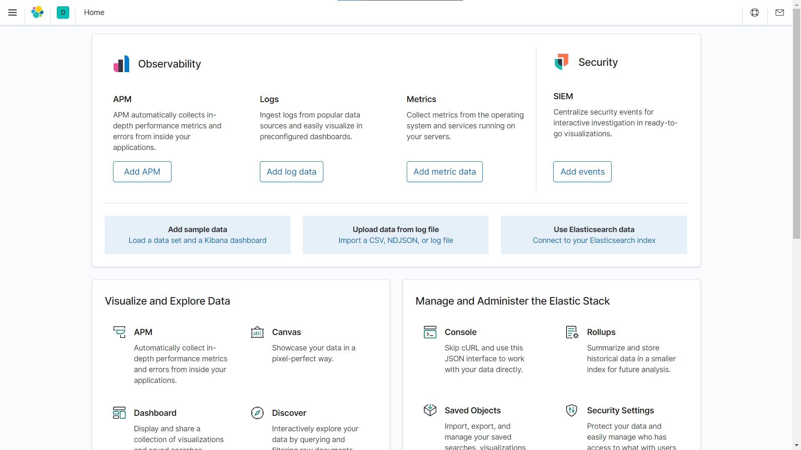
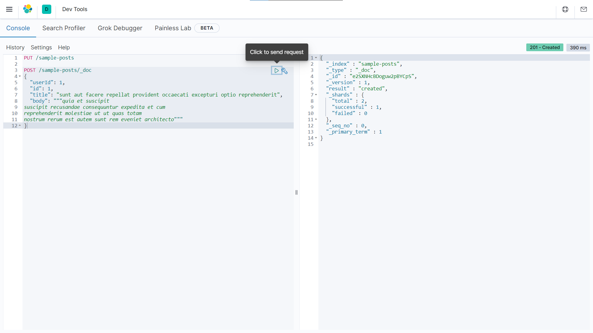

<div dir="rtl">

## Elasticsearch

<p align=center></p>

### 📝فهرست
  - مقدمه
  - معرفی Elastic Stack (ELK)
  - توزیع‌شدگی و مقیاس‌پذیری
  - نگاشت پویا (Dynamic mapping)
  - امکانات نرمال‌سازی
  - امکان ذخیره‌ی انواع مختلف داده‌ها
  - امکانات جستجوی پیشرفته
  - معرفی برخی اصطلاحات
  - نصب و راه‌اندازی
  - بارگذاری اسناد
  - گریزی به مبحث Mapping
  - انواع مختلف Query
  - ابزارهای آنالیز متن
  - پرسش‌های تجمیعی
  - آشنایی با bulk
  - منابع

### ✍️نویسندگان
  - [علیرضا تاجمیرریاحی](https://github.com/AlirezaT99)
  - [سپهر صفری](https://github.com/sepehrs1378)
  - [پرهام صارمی](https://github.com/parhamsaremi)
<hr>

## مقدمه

## ...

<p align=center></p>

## نصب و راه‌اندازی
در این بخش به بررسی نحوه‌ی راه‌اندازی elasticsearchو kibana خواهیم پرداخت.
<br>
ابتدا از
[اینجا](https://www.elastic.co/downloads/elasticsearch)
و
[اینجا](https://www.elastic.co/downloads/kibana)
الستیک‌سرچ و کیبانا را نصب کنید. (یا از طریق apt و yum)
<br>
حال با اجرای
`bin/elasticsearch`
(یا `bin\elasticsearch.bat` در ویندوز) الستیک‌سرچ را اجرا کنید.
<br>
همچنین با اجرای
`bin/kibana`
(یا `bin\kibana.bat` در ویندوز) کیبانا اجرا می‌شود.
> تجربه: اگر روی ویندوز هستید بررسی کنید اسم فولدر حاوی فایل‌ها دارای اسپیس نباشد :|
<br>
الستیک‌سرچ بطور پیش‌فرض روی پورت 9200 اجرا می‌شود و با استفاده از

<div dir="ltr">
  
  ```bash
  curl http://localhost:9200/
  ```
</div>
می‌توانید از اجرا شدن آن مطمئن شوید.
<br>
همچنین kibana بطور پیش‌فرض روی پورت 5601 اجرا می‌شود و با رفتن به
http://localhost:5601
با صفحه‌ی زیر مواجه خواهید شد:
<br>
<p align=center></p>
<br>
اکنون می‌توانید از منوی سمت چپ صفحه در قسمت management وارد Dev Tools شوید. محیط Dev Tools مطابق عکس زیر می باشد:
<br>
<p align=center></p>

## بارگذاری اسناد
اکنون در Dev Tools با اجرای درخواست زیر می‌توانیم اولین index خود را بسازیم.
<br>
(ساختن index می‌تواند دارای تنظیماتی مانند مشخص کردن mapping  باشد که در
[این لینک](https://www.elastic.co/guide/en/elasticsearch/reference/current/indices-create-index.html)
به آن بیشتر پرداخته شده. همچنین اسم index باید ویژگی‌هایی مانند lowercase بودن یا نداشتن کاراکترهای ویژه دارد که مطالعه‌ی همین لینک می‌تواند برای آن مفید باشد).

<div dir="ltr">
 
```http
PUT /sample-posts
```
</div>
خروجی:

<div dir="ltr">
 
```json
{
  "acknowledged" : true,
  "shards_acknowledged" : true,
  "index" : "sample-posts"
}
```
</div>
حال می‌توانیم اولین داکیومنت را مطابق مثال زیر در آن بریزیم:

<div dir="ltr">
 
```http
POST /sample-posts/_doc
{
  "userId": 1,
  "id": 1,
  "title": "sunt aut facere repellat provident occaecati excepturi optio reprehenderit",
  "body": """quia et suscipit
suscipit recusandae consequuntur expedita et cum
reprehenderit molestiae ut ut quas totam
nostrum rerum est autem sunt rem eveniet architecto"""
}
```
</div>
در عکس dev tools در قسمت قبل می‌توانید response مربوط به درخواست فوق (بدنه و زمان و کد) را مشاهده کنید :)
<br>

> داده‌ی این قسمت از
[این API](https://jsonplaceholder.typicode.com/posts)
گرفته شده است.
<br>
حال برای مشاهده‌ی کل اسناد داخل شاخص، از دستور زیر استفاده کنید:

<div dir="ltr">
 
```http
GET /sample-posts/_search
```
</div>
در مثالی که تا اینجا زدیم خروجی این درخواست مطابق زیر می‌باشد. (پیشنهاد می‌شود به فیلدهای مختلف این آبجکت توجه کنید)
<br>

<div dir="ltr">
 
```json
{
  "took" : 1,
  "timed_out" : false,
  "_shards" : {
    "total" : 1,
    "successful" : 1,
    "skipped" : 0,
    "failed" : 0
  },
  "hits" : {
    "total" : {
      "value" : 1,
      "relation" : "eq"
    },
    "max_score" : 1.0,
    "hits" : [
      {
        "_index" : "sample-posts",
        "_type" : "_doc",
        "_id" : "e2SXNHcBDoguw2pBYCpS",
        "_score" : 1.0,
        "_source" : {
          "userId" : 1,
          "id" : 1,
          "title" : "sunt aut facere repellat provident occaecati excepturi optio reprehenderit",
          "body" : """quia et suscipit
suscipit recusandae consequuntur expedita et cum
reprehenderit molestiae ut ut quas totam
nostrum rerum est autem sunt rem eveniet architecto"""
        }
      }
    ]
  }
}

```
</div>
حال آماده‌ایم تا با نحوه‌ی پیاده‌سازی انواع Query بیشتر آشنا شویم اما پیش از آن خوب است گریزی به مبحث mapping بزنیم.

## گریزی به مبحث Mapping
تا اینجا دو بار از mapping اسم برده‌ایم اما هنوز تعریف دقیقی از آن ارائه نکرده‌ایم:
<br>
در هر Index
سندها قالب مشخصی دارند که به این قالب Mapping
گفته می‌شود. برای مثال اگر بخواهیم مشخصات تعدادی دانشجو را در Elasticsearch
بریزیم و هر دانشجو را یک Document
در نظر بگیریم، هر دانشجو نام، نام خانوادگی، رشته، تاریخ ورود، سن، معدل و ... دارد که از هر کدام از این موارد در Elasticsearch
با عنوان Field
یاد می‌شود. هر کدام از این Fieldها
نوع مشخصی دارد برای مثال نام‌، نام خانوادگی و رشته از نوع text
هستند و مثلاً سن از نوع عدد طبیعی و معدل از جنس عدد اعشاری است و تاریخ ورود می‌تواند از جنس تاریخ در نظر گرفته شود. به این قالب که Fieldهای
مختلف و جنس هر کدام را مشخص می‌کند Mapping گفته می‌شود.

<br>
کوئری زیر را اجرا کنید:

<div dir="ltr">
 
```http
GET /sample-posts/_mapping
```
</div>
خروجی مطابق زیر می‌باشد.

<div dir="ltr">
 
```json
{
  "sample-posts" : {
    "mappings" : {
      "properties" : {
        "body" : {
          "type" : "text",
          "fields" : {
            "keyword" : {
              "type" : "keyword",
              "ignore_above" : 256
            }
          }
        },
        "id" : {
          "type" : "long"
        },
        "title" : {
          "type" : "text",
          "fields" : {
            "keyword" : {
              "type" : "keyword",
              "ignore_above" : 256
            }
          }
        },
        "userId" : {
          "type" : "long"
        }
      }
    }
  }
}

```
</div>
با توصیفی که در ابتدای بخش بیان کردیم، اکنون می‌توانید بخش‌های مختلف پاسخ را بهتر درک کنید.
<br>
علت بیان این مبحث در این قسمت از آموزش این بود که این نکته را متذکر شویم که بعد از ایجاد اولین سند و شکل گرفتن Mapping، امکان ایجاد سند دیگری که مغایر با این Mapping باشد وجود ندارد. برای مثال اگر در سند دیگری در فیلد userId که از نوع long شناسایی شده مقدار رشته‌ای (در مثال زیر 'salam')وارد کنیم، با خطای Bad Request (400) مواجه خواهیم شد که دارای ساختار زیر است:

<div dir="ltr">
 
```json
{
  "error" : {
    "root_cause" : [
      {
        "type" : "mapper_parsing_exception",
        "reason" : "failed to parse field [userId] of type [long] in document with id 'TmTTNHcBDoguw2pB9TRm'. Preview of field's value: 'salam'"
      }
    ],
    "type" : "mapper_parsing_exception",
    "reason" : "failed to parse field [userId] of type [long] in document with id 'TmTTNHcBDoguw2pB9TRm'. Preview of field's value: 'salam'",
    "caused_by" : {
      "type" : "illegal_argument_exception",
      "reason" : "For input string: \"salam\""
    }
  },
  "status" : 400
}


```
</div>

برای مطالعه‌ی بیشتر در مورد mapping ها 
[این لینک](https://www.elastic.co/guide/en/elasticsearch/reference/current/mapping.html)
می‌تواند مفید باشد.
<br>

همچنین برای مشاهده‌ی سایر انواع داده در Field ها (علاوه بر متن، عدد و ...) می‌توانید
[اینجا](https://www.elastic.co/guide/en/elasticsearch/reference/current/mapping-types.html)
را مطالعه کنید.

## انواع مختلف Query

در این بخش با ارائه‌ی چند مثال، با امکانات گسترده‌ی Elasticsearch در ارتباط با بازیابی اسناد بیشتر آشنا می‌شویم.
<br>
مثال‌های مطرح شده با توجه به 10 سند اول اسنادی است که در قسمت بارگذاری معرفی کردیم.
[(لینک)](https://jsonplaceholder.typicode.com/posts)
<br>
برخی از انواع مهم کوئری‌های الستیک‌سرچ عبارتند از:
  - Match Query: در مثال زیر دنبال اسنادی می‌گردیم که در body آنها کلیدواژه‌ی `quis` یافت شود (و 5 سند پیدا می‌کند)
    
  <div dir="ltr">

  ```http
  GET /sample-posts/_search
  {
    "query": {
      "match": {
        "body": "quis"
      }
    }
  }
  ```
  </div>
  <br>
    
  - Fuzzy Query: حال می‌خواهیم کلماتی را که 1 کاراکتر با کلیدواژه‌ی ما تفاوت دارد هم گزارش شود (مانند `quas`). اینجا جستارهای فازی به کمک ما می‌آیند:
  <div dir="ltr">

  ```http
  GET /sample-posts/_search
  {
    "query": {
      "match": {
        "body": {
          "query": "quis",
          "fuzziness": 1
        }
      }
    }
  }
  ```
  </div>
  <br>
    
  - Range Query: برای مثال اگر بخواهیم پست‌هایی که userId آنها بین 1 و 5 است را مشاهده کنیم...:
  <div dir="ltr">

  ```http
  GET /sample-posts/_search
  {
    "query": {
      "range": {
        "userId": {
          "gte": 1,
          "lte": 5
        }
      }
    }
  }
  ```
  </div>
  <br>
    
  - Multi-Match Query: اگر بخواهیم دنبال همان کلیدواژه در بیش از یک field مشخص بگردیم از این نوع جستار استفاده می‌کنیم:
  <div dir="ltr">

  ```http
  GET /sample-posts/_search
  {
    "query": {
      "multi_match": {
        "query": "quis",
        "fields": [
          "title",
          "body"
        ],
        "fuzziness": 1
      }
    }
  }
  ```
  </div>
  <br>
    
  - Bool Query: با استفاده از این نوع جستار می‌توان با سایر کوئری‌ها یک ترکیب منطقی از آنان را جستجو کرد. مثلاً در این مثال از اسناد جستجوی قبلی آنهایی انتخاب می‌شوند که userId آنها 2 نباشد: 
  <div dir="ltr">

  ```http
  GET /sample-posts/_search
  {
    "query": {
      "bool": {
        "must": [
          {
            "match": {
              "title": {
                "query": "quis",
                "fuzziness": 1
              }
            }
          }
        ],
        "must_not": [
          {
            "match": {
              "userId": 2
            }
          }
        ]
      }
    }
  }
  ```
  </div>
  <br>  
    
  - Aggregation Query: کوئری‌های تجمیعی مبحث بزرگ و پیچیده‌ای است که در اینجا به یک مثال اکتفا می‌کنیم. برای مطالعه‌ی بیشتر به
  [اینجا](https://www.elastic.co/guide/en/elasticsearch/reference/current/search-aggregations.html)
  مراجعه کنید. با این مثال تعداد پست‌هایی که از هر کاربر وجود دارد را می‌توان بدست آورد:
  <div dir="ltr">

  ```http
  GET /sample-posts/_search
  {
    "aggs": {
      "users": {
        "terms": {
          "field": "userId"
        }
      }
    },
    "size": 0
  }
  ```
  </div>
  <br>  

برای آشنایی بیشتر با انواع Queryهای Elasticsearch مطالعه‌ی
[این لینک](https://www.elastic.co/guide/en/elasticsearch/reference/current/query-dsl.html)
می‌تواند بسیار مفید باشد.

> همچنین با نوشتن `_count` بجای `_search` می‌توان تعداد اسناد نتیجه را در هر کوئری بدست آورد. (بدون نیاز به گرفتن خود نتایج)

## منابع
  - Elasticsearch Documentation
  - مستندات آکادمی ستاره

</div>
