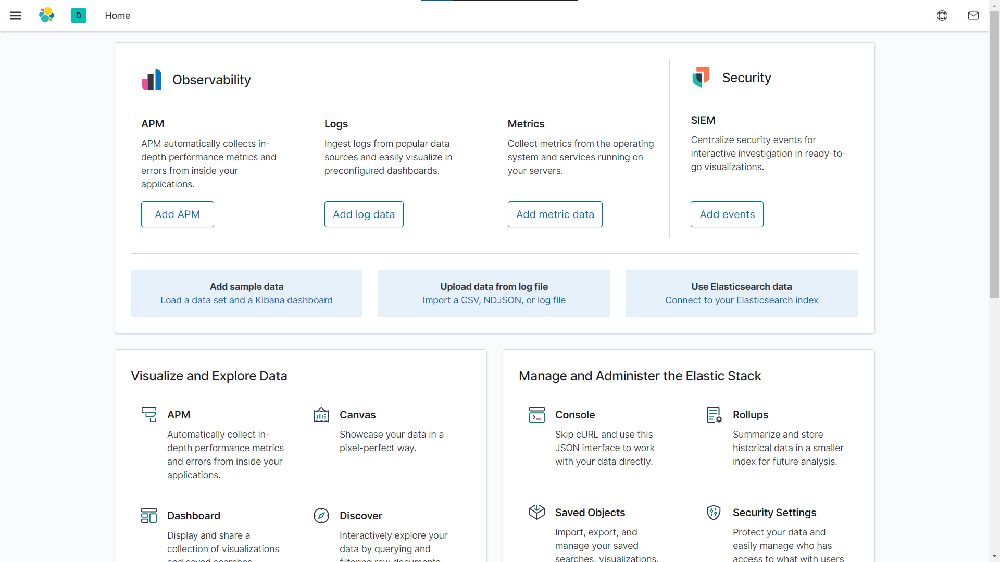
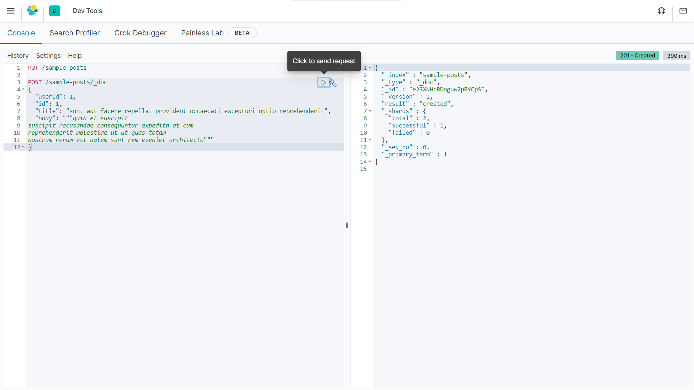

<div dir="rtl">

## Elasticsearch

<p align=center></p>

### 📝فهرست
  - [مقدمه](#مقدمه)
  - [Elastic Stack (ELK)](#elastic-stack)
  - [مزایا](#مزایا)
  - [مقیاس‌پذیری](#مقیاس-پذیری)
  - [معرفی برخی اصطلاحات](#معرفی-برخی-اصطلاحات)
  - [نصب و راه‌اندازی](#نصب-و-راه-اندازی)
  - [بارگذاری اسناد](#بارگذاری-اسناد)
  - [امکان ذخیره‌ی انواع مختلف داده‌ها](#امکان-ذخیره-انواع-مختلف-داده)
  - [گریزی به مبحث Mapping](#گریزی-به-مبحث-mapping)
  - [انواع مختلف Query](#انواع-مختلف-query)
  - [آشنایی با bulk](#bulk-api)
  - [آنالیز متن](#آنالیز-متن)
  - [منابع](#منابع)

### ✍️نویسندگان
  - [علیرضا تاجمیرریاحی](https://github.com/AlirezaT99)
  - [سپهر صفری](https://github.com/sepehrs1378)
  - [پرهام صارمی](https://github.com/parhamsaremi)
<hr>

## مقدمه
Elastic Search
یک موتور جست‌و‌جو و آنالیز توزیع‌شده است که از پروتکل 
REST
استفاده می‌کند.
ویژگی‌های مثبت و اصلی این سرویس قدرت جست‌وجو و همچنین مقیاس‌پذیری آن است.

## Elastic Stack
Elastic Stack یا همان ELK در واقع ۳ حرف اول
۳ پروژه open source
با نام‌های elasticsearch و log stash و kibana هستند.

elasticsearch که همان طور که توضیح دادیم یک موتور جست‌وجو و آنالیز است.
logstash یک pipeline هست که در سمت سرور، داده‌ها را پردازش می‌کند،
تبدیل می‌کند و سپس به سمت به سرویسی مانند elasticsearch می‌فرستد.
kibana هم سرویسی هست که کاربر به وسیله آن می‌تواند داده‌ها را به صورت گرافیکی نمایش دهد.

<p align=center></p>

## مزایا
از مزایای elasticsearch می‌توان به موارد زیر اشاره کرد:
- گزینه‌های مختلف جست‌وجو: elasticsearch گزینه‌های خاص و زیادی برای جست‌و‌جو در اختیار ما قرار می‌دهد. به عنوان مثال اگر کاربر کلمه اشتباهی را جست‌وجو کند، می‌توان کلماتی که تا حدی شبیه به آن هستند را نیز برگردانیم. یا مثلا با توجه به عبارت ناقص نوشته شده، به کاربر عبارتی که احتمالا دنبال هست را پیشنهاد ارائه بدهیم (مانند جست‌وجو در google).
- سند گرا (document oriented):
این سرویس داده‌ها را، حتی با فرمت‌های پیچیده، به فرمت JSON ذخیره می‌کند.
- سرعت بالا: سرعت بالا در پاسخ‌دهی به query ها یکی دیگر از مزایای این سرویس هست. 
همچنین query های بیش‌تر استفاده شده، توسط خود آن cache هم می‌شوند که باعث بهبود عملکرد کلی می‌شود.
- مقیاس پذیری: یکی از دلایل این که تیم‌ها اغلبا از elasticsearch راضی هستند، قابلیت مقایس‌پذیری آن هست که به طور پایه‌ای بر این اساس طراحی شده است و می‌تواند به سادگی به طور افقی گسترش یابد.
- ذخیره داده‌ها: elasticsearch تغییرات اعمال شده در لاگ‌های انتقال (transaction log) را در چند جای مختلف ذخیره می‌کند و بدین روش تا حد امکان جلوی از بین رفتن داده‌ها را می‌گیرد.
- دقیق سازی query ها: 
تیم‌ها می‌توانند query های پیچیده‌ای طراحی کنند و در نهایت در بین این‌ها، آن که دقیق‌ترین نتیجه را می‌دهد انتخاب کنند. 
همچنین خود elasticsearch توانایی رتبه بندی و گروه بندی نتایج query را هم دارد.
- استفاده از پروتوکل REST:
به همین خاطر می‌توان به سادگی با یک RESTful api با آن ارتباط برقرار کرد.
- توزیع‌پذیری:
هر index می‌تواند به 
shard های کوچک‌تری تقسیم شود
و همچنین هر کدام از این‌ها هم می‌توانند هر چند تعداد کپی از خود داشته باشند.
همچنین routing و متعادل‌سازی هم هر دفعه که document جدیدی اضافه می‌شود به طور خودکار انجام می‌شود.
- جلوگیری از زیادشدن index ها:
وقتی چندین کاربر داریم، برای این که هرکدام فقط به فقط document های خود دسترسی داشته باشد،
مجبور هستیم برای هر یک، یک index تعریف کنیم که می‌تواند موجب زیاد شدن تعداد 
index ها شود.
در مقابل index خود elasticsearch که بزرگ‌تر هست ولی فقط یکی است، گزینه بهتری است. 

## مقیاس پذیری

Elasticsearch به گونه‌ای ساخته شده که همواره در دسترس باشد و در صورت نیاز مقایسش تغیییر کند که این کار با توجه به اینکه ES در ذات توزیع شده می‌باشد امکان پذیر است. به این صورت که می‌توان به راحتی nodeهایی را به clusterها اضافه کرد و خود Elasticsearch این نود‌های اضافه شده را کنترل می‌کند و داده‌ها و درخواست‌ها را به صورت خودکار بر روی آن‌ها پخش می‌کند.

## معرفی برخی اصطلاحات
- node: هر دفعه که Elasticsearch را بر روی یک سرور اجرا می‌کنیم در واقع آن سرور تبدیل به یک گره شده است.
- cluster: مجموعه‌ای از nodeها یک cluster را تشکیل می‌دهد و اگر فقط با یک گره در حال اجرا باشیم یک خوشه داریم که یک گره دارد.
- document: به هرکدام از سند‌های متنی یک document گفته می‌شود.
- index: در Elasticsearch سند‌های مشابه به هم دیگر در مخزن‌هایی نزدیکه به نگهداری می‌شوند تا دسترسی به داده‌ها سریع‌تر شود. به این مخزن‌ها index می‌گویند 
- shard: همانطور که گفته شد ES داده‌ها را در مخزن‌هایی نگهداری می‌کند حال از آنجایی که این مخزن‌ها ممکن است بر روی سرو‌ر‌های متفاوت توزیع شود به بخش‌های کوچک‌تری به نام shard تقسیم می‌شوند و این شارد‌ها به صورت متوازن بر روی سرور‌های در اختیاز مخزن پخش می‌شوند. همچنین ممکن است بر حسب اهمیت شارد‌ها داده‌هایی را در چند شارد کپی کند تا با از دست رفتن یک شارد همه‌ی داده‌ها از دست نروند.

## نصب و راه اندازی
در این بخش به بررسی نحوه‌ی راه‌اندازی elasticsearchو kibana خواهیم پرداخت.
<br>
ابتدا از
[اینجا](https://www.elastic.co/downloads/elasticsearch)
و
[اینجا](https://www.elastic.co/downloads/kibana)
الستیک‌سرچ و کیبانا را نصب کنید. (یا از طریق apt و yum)
<br>
حال با اجرای
`bin/elasticsearch`
(یا `bin\elasticsearch.bat` در ویندوز) الستیک‌سرچ را اجرا کنید.
<br>
همچنین با اجرای
`bin/kibana`
(یا `bin\kibana.bat` در ویندوز) کیبانا اجرا می‌شود.
> تجربه: اگر روی ویندوز هستید بررسی کنید اسم فولدر حاوی فایل‌ها دارای اسپیس نباشد :|
<br>
الستیک‌سرچ بطور پیش‌فرض روی پورت 9200 اجرا می‌شود و با استفاده از

<div dir="ltr">
  
  ```bash
  curl http://localhost:9200/
  ```
</div>
می‌توانید از اجرا شدن آن مطمئن شوید.
<br>
همچنین kibana بطور پیش‌فرض روی پورت 5601 اجرا می‌شود و با رفتن به
http://localhost:5601
با صفحه‌ی زیر مواجه خواهید شد:
<br>
<p align=center></p>
<br>
اکنون می‌توانید از منوی سمت چپ صفحه در قسمت management وارد Dev Tools شوید. محیط Dev Tools مطابق عکس زیر می‌باشد:
<br>
<p align=center></p>

## بارگذاری اسناد
اکنون در Dev Tools با اجرای درخواست زیر می‌توانیم اولین index خود را بسازیم.
<br>
(ساختن index می‌تواند دارای تنظیماتی مانند مشخص کردن mapping  باشد که در
[این لینک](https://www.elastic.co/guide/en/elasticsearch/reference/current/indices-create-index.html)
به آن بیشتر پرداخته شده. همچنین اسم index باید ویژگی‌هایی مانند lowercase بودن یا نداشتن کاراکترهای ویژه دارد که مطالعه‌ی همین لینک می‌تواند برای آن مفید باشد).

<div dir="ltr">
 
```http
PUT /sample-posts
```
</div>
خروجی:

<div dir="ltr">
 
```json
{
  "acknowledged" : true,
  "shards_acknowledged" : true,
  "index" : "sample-posts"
}
```
</div>
حال می‌توانیم اولین داکیومنت را مطابق مثال زیر در آن بریزیم:

<div dir="ltr">
 
```http
POST /sample-posts/_doc
{
  "userId": 1,
  "id": 1,
  "title": "sunt aut facere repellat provident occaecati excepturi optio reprehenderit",
  "body": """quia et suscipit
suscipit recusandae consequuntur expedita et cum
reprehenderit molestiae ut ut quas totam
nostrum rerum est autem sunt rem eveniet architecto"""
}
```
</div>
در عکس dev tools در قسمت قبل می‌توانید response مربوط به درخواست فوق (بدنه و زمان و کد) را مشاهده کنید :)
<br>

> داده‌ی این قسمت از
[این API](https://jsonplaceholder.typicode.com/posts)
گرفته شده است.
<br>
حال برای مشاهده‌ی کل اسناد داخل شاخص، از دستور زیر استفاده کنید:

<div dir="ltr">
 
```http
GET /sample-posts/_search
```
</div>
در مثالی که تا اینجا زدیم خروجی این درخواست مطابق زیر می‌باشد. (پیشنهاد می‌شود به فیلدهای مختلف این آبجکت توجه کنید)
<br>

<div dir="ltr">
 
```json
{
  "took" : 1,
  "timed_out" : false,
  "_shards" : {
    "total" : 1,
    "successful" : 1,
    "skipped" : 0,
    "failed" : 0
  },
  "hits" : {
    "total" : {
      "value" : 1,
      "relation" : "eq"
    },
    "max_score" : 1.0,
    "hits" : [
      {
        "_index" : "sample-posts",
        "_type" : "_doc",
        "_id" : "e2SXNHcBDoguw2pBYCpS",
        "_score" : 1.0,
        "_source" : {
          "userId" : 1,
          "id" : 1,
          "title" : "sunt aut facere repellat provident occaecati excepturi optio reprehenderit",
          "body" : """quia et suscipit
suscipit recusandae consequuntur expedita et cum
reprehenderit molestiae ut ut quas totam
nostrum rerum est autem sunt rem eveniet architecto"""
        }
      }
    ]
  }
}

```
</div>
حال آماده‌ایم تا با نحوه‌ی پیاده‌سازی انواع Query بیشتر آشنا شویم اما پیش از آن خوب است گریزی به مبحث mapping بزنیم.

## امکان ذخیره انواع مختلف داده
یکی از ویژگی‌های خوب elasticsearch توانایی کار با داده ساختار (data structure)
 های متنوع است. از این انواع می‌توان به IP, histogram, Array و ... اشاره کرد.
 توصیه می‌شود برای آشنایی با این انواع گوناگون و انتخاب آن چه نیاز دارید، به 
 [این جا](https://www.elastic.co/guide/en/elasticsearch/reference/current/mapping-types.html)
 مراجعه کنید.

## گریزی به مبحث Mapping
تا اینجا دو بار از mapping اسم برده‌ایم اما هنوز تعریف دقیقی از آن ارائه نکرده‌ایم:
<br>
در هر Index
سندها قالب مشخصی دارند که به این قالب Mapping
گفته می‌شود. برای مثال اگر بخواهیم مشخصات تعدادی دانشجو را در Elasticsearch
بریزیم و هر دانشجو را یک Document
در نظر بگیریم، هر دانشجو نام، نام خانوادگی، رشته، تاریخ ورود، سن، معدل و ... دارد که از هر کدام از این موارد در Elasticsearch
با عنوان Field
یاد می‌شود. هر کدام از این Fieldها
نوع مشخصی دارد برای مثال نام‌، نام خانوادگی و رشته از نوع text
هستند و مثلاً سن از نوع عدد طبیعی و معدل از جنس عدد اعشاری است و تاریخ ورود می‌تواند از جنس تاریخ در نظر گرفته شود. به این قالب که Fieldهای
مختلف و جنس هر کدام را مشخص می‌کند Mapping گفته می‌شود.

<br>
کوئری زیر را اجرا کنید:

<div dir="ltr">
 
```http
GET /sample-posts/_mapping
```
</div>
خروجی مطابق زیر می‌باشد.

<div dir="ltr">
 
```json
{
  "sample-posts" : {
    "mappings" : {
      "properties" : {
        "body" : {
          "type" : "text",
          "fields" : {
            "keyword" : {
              "type" : "keyword",
              "ignore_above" : 256
            }
          }
        },
        "id" : {
          "type" : "long"
        },
        "title" : {
          "type" : "text",
          "fields" : {
            "keyword" : {
              "type" : "keyword",
              "ignore_above" : 256
            }
          }
        },
        "userId" : {
          "type" : "long"
        }
      }
    }
  }
}

```
</div>
با توصیفی که در ابتدای بخش بیان کردیم، اکنون می‌توانید بخش‌های مختلف پاسخ را بهتر درک کنید.
<br>
علت بیان این مبحث در این قسمت از آموزش این بود که این نکته را متذکر شویم که بعد از ایجاد اولین سند و شکل گرفتن Mapping، امکان ایجاد سند دیگری که مغایر با این Mapping باشد وجود ندارد. برای مثال اگر در سند دیگری در فیلد userId که از نوع long شناسایی شده مقدار رشته‌ای (در مثال زیر 'salam')وارد کنیم، با خطای Bad Request (400) مواجه خواهیم شد که دارای ساختار زیر است:

<div dir="ltr">
 
```json
{
  "error" : {
    "root_cause" : [
      {
        "type" : "mapper_parsing_exception",
        "reason" : "failed to parse field [userId] of type [long] in document with id 'TmTTNHcBDoguw2pB9TRm'. Preview of field's value: 'salam'"
      }
    ],
    "type" : "mapper_parsing_exception",
    "reason" : "failed to parse field [userId] of type [long] in document with id 'TmTTNHcBDoguw2pB9TRm'. Preview of field's value: 'salam'",
    "caused_by" : {
      "type" : "illegal_argument_exception",
      "reason" : "For input string: \"salam\""
    }
  },
  "status" : 400
}


```
</div>

یکی از مهم‌ترین ویژگی‌های Elasticsearch این است که برای index کردن یک document نیازی نیست که حتما اول index ساخته شود و نوع نگاشت تعریف شود و قیلد‌ها معرفی شوند. می‌توان مستقیم document را index کرد تا نوع نگاشت و فیلد‌ها و index به صورت اتوماتیک ساخته شوند. 
### Dynamic Field Mapping
به صورت پیشفرض زمانی که یک فیلد جدید که قبلا دیده نشده در document وجود دارد، Elasticsearch این فیلد را به نگاشت typeها اضافه می‌کند. این رفتار می‌تواند با `false` کردن مقدار فیلد dynamic غیر فعال شود. لازم به ذکر است با انجام دادن این کار فیلد‌های جدید چشم‌پوشی می‌شوند و به نگاشت اضافه نمی‌شوند. همچنین می‌توان مقدار این فیلد را برابر با `strict` قرار داد تا در صورت مشاهده‌ی فیلد جدید با ارور مواجه شویم.
<br>
با فرض اینکه این فیلد فعال می‌باشد بر اساس جدول زیر تصمیم گرفته می‌شود:
<div class="informaltable" dir="ltr">
<table border="0" cellpadding="4px">
<colgroup>
<col>
<col>
</colgroup>
<tbody valign="top">
<tr>
<td valign="top">
<p>
<span class="strong strong"><strong>JSON data type</strong></span>
</p>
</td>
<td valign="top">
<p>
<span class="strong strong"><strong>Elasticsearch data type</strong></span>
</p>
</td>
</tr>
<tr>
<td valign="top">
<p>
<code class="literal">null</code>
</p>
</td>
<td valign="top">
<p>
No field is added.
</p>
</td>
</tr>
<tr>
<td valign="top">
<p>
<code class="literal">true</code> or <code class="literal">false</code>
</p>
</td>
<td valign="top">
<p>
<code class="literal">boolean</code> field
</p>
</td>
</tr>
<tr>
<td valign="top">
<p>
floating&nbsp;point&nbsp;number
</p>
</td>
<td valign="top">
<p>
<code class="literal">float</code> field
</p>
</td>
</tr>
<tr>
<td valign="top">
<p>
integer
</p>
</td>
<td valign="top">
<p>
<code class="literal">long</code> field
</p>
</td>
</tr>
<tr>
<td valign="top">
<p>
object
</p>
</td>
<td valign="top">
<p>
<code class="literal">object</code> field
</p>
</td>
</tr>
<tr>
<td valign="top">
<p>
array
</p>
</td>
<td valign="top">
<p>
Depends on the first non-<code class="literal">null</code> value in the array.
</p>
</td>
</tr>
<tr>
<td valign="top">
<p>
string
</p>
</td>
<td valign="top">
<p>
Either a <code class="literal">date</code> field
    (if the value passes date detection),
a <code class="literal">double</code> or <code class="literal">long</code> field
    (if the value passes numeric detection)
or a <code class="literal">text</code> field, with a <code class="literal">keyword</code> sub-field.
</p>
</td>
</tr>
</tbody>
</table>
</div>
بجز این فیلد‌ها بقیه نوع بقیه باید دقیقا مشخص شود زیرا به اگر جزو این‌ها نباشند به صورت خودکار مشخص نمی‌شوند. می‌توان با استفاده از dynamic templates این ویژگی را شخصی‌سازی کرد و ویژگی‌هایی به آن اضافه کرد.

#### Date Detection
با فعال کرد فیلد `date_detection` می‌توان آنگاه فیلد‌های رشته‌ای یک دور چک میشوند تا فهمیده شود که آن فیلد تاریخ است یا نه و فرمت‌های قابل قبول برای اینکه یک رشته تاریخ باشد در `dynamic_date_formats` ذخیره شده است که مقدار آن به صورت پیش‌فرض برابر با [ "strict_date_optional_time","yyyy/MM/dd HH:mm:ss Z||yyyy/MM/dd Z"] است. با قرار دادن مقدار `false` برای فیلد date_detection می‌توان این ویژگی را غیرفعال کرد.
<div dir="ltr">

```http
PUT my-index-000001
{
  "mappings": {
    "date_detection": false
  }
}

PUT my-index-000001/_doc/1 
{
  "create": "2015/09/02"
}
```

</div>

که در اینجا برای فیلد `create` مقدار به صورت `text` ذخیره شده است. همچنین با قطعه کد زیر می‌توان مقدار پیش‌فرض برای dynamic_date_formats را تغییر داد.

<div dir="ltr">

```http
PUT my-index-000001
{
  "mappings": {
    "dynamic_date_formats": ["MM/dd/yyyy"]
  }
}

PUT my-index-000001/_doc/1
{
  "create_date": "09/25/2015"
}
```
</div>

#### Numeric Detection

اگر این مورد فعال باشد در صورتی که یک عدد به صورت رشته‌ای در document قرار داشته باشد این فیلد به صورت اتوماتیک تبدیل می‌شود البته راه درست این است که از دستی برای فیلد مشخص کنیم که باید تبدیل به عدد شود و این کار اتوماتیک انجام نشود.

برای مطالعه‌ی بیشتر در مورد mapping ها 
[این لینک](https://www.elastic.co/guide/en/elasticsearch/reference/current/mapping.html)
می‌تواند مفید باشد.
<br>

همچنین برای مشاهده‌ی سایر انواع داده در Field ها (علاوه بر متن، عدد و ...) می‌توانید
[اینجا](https://www.elastic.co/guide/en/elasticsearch/reference/current/mapping-types.html)
را مطالعه کنید.
<br>

## انواع مختلف Query

در این بخش با ارائه‌ی چند مثال، با امکانات گسترده‌ی Elasticsearch در ارتباط با بازیابی اسناد بیشتر آشنا می‌شویم.
<br>
مثال‌های مطرح شده با توجه به 10 سند اول اسنادی است که در قسمت بارگذاری معرفی کردیم.
[(لینک)](https://jsonplaceholder.typicode.com/posts)
<br>
برخی از انواع مهم کوئری‌های الستیک‌سرچ عبارتند از:
  - Match Query: در مثال زیر دنبال اسنادی می‌گردیم که در body آنها کلیدواژه‌ی `quis` یافت شود (و 5 سند پیدا می‌کند)
    
  <div dir="ltr">

  ```http
  GET /sample-posts/_search
  {
    "query": {
      "match": {
        "body": "quis"
      }
    }
  }
  ```
  </div>
  <br>
    
  - Fuzzy Query: حال می‌خواهیم کلماتی را که 1 کاراکتر با کلیدواژه‌ی ما تفاوت دارد هم گزارش شود (مانند `quas`). اینجا جستارهای فازی به کمک ما می‌آیند:
  <div dir="ltr">

  ```http
  GET /sample-posts/_search
  {
    "query": {
      "match": {
        "body": {
          "query": "quis",
          "fuzziness": 1
        }
      }
    }
  }
  ```
  </div>
  <br>
    
  - Range Query: برای مثال اگر بخواهیم پست‌هایی که userId آنها بین 1 و 5 است را مشاهده کنیم...:
  <div dir="ltr">

  ```http
  GET /sample-posts/_search
  {
    "query": {
      "range": {
        "userId": {
          "gte": 1,
          "lte": 5
        }
      }
    }
  }
  ```
  </div>
  <br>
    
  - Multi-Match Query: اگر بخواهیم دنبال همان کلیدواژه در بیش از یک field مشخص بگردیم از این نوع جستار استفاده می‌کنیم:
  <div dir="ltr">

  ```http
  GET /sample-posts/_search
  {
    "query": {
      "multi_match": {
        "query": "quis",
        "fields": [
          "title",
          "body"
        ],
        "fuzziness": 1
      }
    }
  }
  ```
  </div>
  <br>
    
  - Bool Query: با استفاده از این نوع جستار می‌توان با سایر کوئری‌ها یک ترکیب منطقی از آنان را جستجو کرد. مثلاً در این مثال از اسناد جستجوی قبلی آنهایی انتخاب می‌شوند که userId آنها 2 نباشد: 
  <div dir="ltr">

  ```http
  GET /sample-posts/_search
  {
    "query": {
      "bool": {
        "must": [
          {
            "match": {
              "title": {
                "query": "quis",
                "fuzziness": 1
              }
            }
          }
        ],
        "must_not": [
          {
            "match": {
              "userId": 2
            }
          }
        ]
      }
    }
  }
  ```
  </div>
  <br>  
    
  - Aggregation Query: کوئری‌های تجمیعی مبحث بزرگ و پیچیده‌ای است که در اینجا به یک مثال اکتفا می‌کنیم. برای مطالعه‌ی بیشتر به
  [اینجا](https://www.elastic.co/guide/en/elasticsearch/reference/current/search-aggregations.html)
  مراجعه کنید. با این مثال تعداد پست‌هایی که از هر کاربر وجود دارد را می‌توان به دست آورد:
  <div dir="ltr">

  ```http
  GET /sample-posts/_search
  {
    "aggs": {
      "users": {
        "terms": {
          "field": "userId"
        }
      }
    },
    "size": 0
  }
  ```
  </div>
  <br>  

برای آشنایی بیشتر با انواع Queryهای Elasticsearch مطالعه‌ی
[این لینک](https://www.elastic.co/guide/en/elasticsearch/reference/current/query-dsl.html)
می‌تواند بسیار مفید باشد.

> همچنین با نوشتن `_count` بجای `_search` می‌توان تعداد اسناد نتیجه را در هر کوئری به دست آورد. (بدون نیاز به گرفتن خود نتایج)

## Bulk API
می‌توان به کمک Bulk API،
چندین query
از نوع index، create، delete و update 
را در یک request برای سرور ارسال کرد.
این کار overhead کلی را کم‌تر می‌کند.
چرا که فرستادن یک درخواست نسبتا سنگین، از فرستادن تعداد زیادی درخواست سبک، در این مورد فشار کم‌تری به سرور می‌آورد.
یک نمونه از Bulk API در زیر آورده شده است:

  <div dir="ltr">

  ```http
  POST _bulk
  { "index" : { "_index" : "test", "_id" : "1" } }
  { "field1" : "value1" }
  { "delete" : { "_index" : "test", "_id" : "2" } }
  { "create" : { "_index" : "test", "_id" : "3" } }
  { "field1" : "value3" }
  { "update" : {"_id" : "1", "_index" : "test"} }
  { "doc" : {"field2" : "value2"} }
  ```
  </div>
  <br>  

طرز کار این api
نیز این گونه است که در هر خط نوع qeury و متاداده (meta data)
آن را وارد می‌کنیم و در خط بعدی، در صورت نیاز اطلاعات جدید را می‌نویسیم. مانند زیر:

<div dir="ltr">

  ```
  action_and_meta_data \n
  optional_source \n
  action_and_meta_data \n
  optional_source \n
  ....
  action_and_meta_data \n
  optional_source \n
  ```
  </div>
  <br>  

مثلا در مثالی که آورده شده، این طور هست که در خط اول یک query از نوع index داریم
که هم index آن را معلوم کرده ایم و هم  
id را.
در خط بعدی field1
که مربوط به document
تولید شده هست را مشخص کرده‌ایم. سپس در خط سوم یک query از نوع delete داریم
که مانند index، متاداده آن را در همان خط مشخص کردیم.
دقت شود که برای delete در خط بعدی آن لازم نیست چیزی بنویسیم.
بقیه query ها هم به طور مشابه نوشته شده‌اند.
برای مطالعه بیش‌تر Bulk API می‌توانید
[این جا](https://www.elastic.co/guide/en/elasticsearch/reference/current/docs-bulk.html)
را بخوانید.

## آنالیز متن

 به طور کلی، بدین معناست که می‌خواهید در یک متن، دنبال خود یک عبارت یا عبارتی شبیه به آن (از نظر معنایی یا نوشتاری یا ...) بگردید.
مثلا اگر عبارت quick fox jumps 
را جست‌وجو کنید، انتظار دارید که عبارت
The quick brown fox leaps
به عنوان یکی از نتایج به شما نشان داده شود. اما مشکل اینست که عبارت جست‌وجو شده، 
دقیقا برابر با عبارت دوم نیست. حتی در بعضی جاها مثلا در jumps و leaps
دو کلمه در ظاهر هیچ ربطی به هم ندارند و صرفا از نظر معنایی با هم یکسانند و انتظار داریم که این هم شناسایی شود.

روشی که elasticsearch برای شناسایی این موضوع به کار می‌برد به طور خلاصه به این صورت است
که هر جزء کوچک‌تر (مثلا کلمات) از عبارت بزرگ‌تر را به صورت token در می‌آورد
، در نهایت این token ها را به یک فرم استاندارد نرمالایز می‌کند. این باعث می‌شود تا کلمات شبیه به هم با یکدیگر،
match شوند.

برای مطالعه بیش‌تر می‌توانید به 
[این جا](https://www.elastic.co/guide/en/elasticsearch/reference/current/analysis-overview.html)
 مراجعه کنید.
<br>

## منابع
  - [Elasticsearch Documentation](https://www.elastic.co/guide/index.html)
  - [dzone.com](https://dzone.com/articles/elastic-search-advantages-case-studies-amp-books)
  - مستندات آکادمی ستاره

</div>
