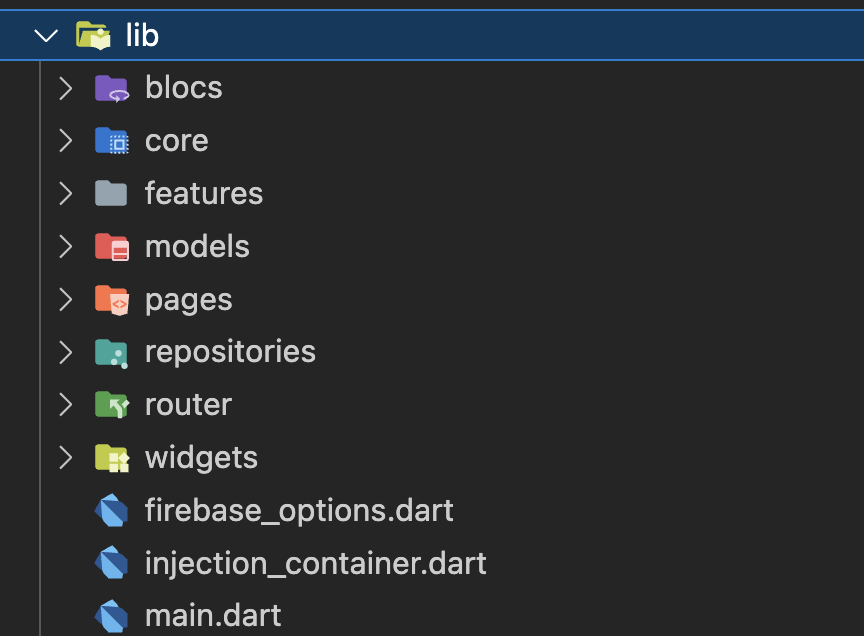
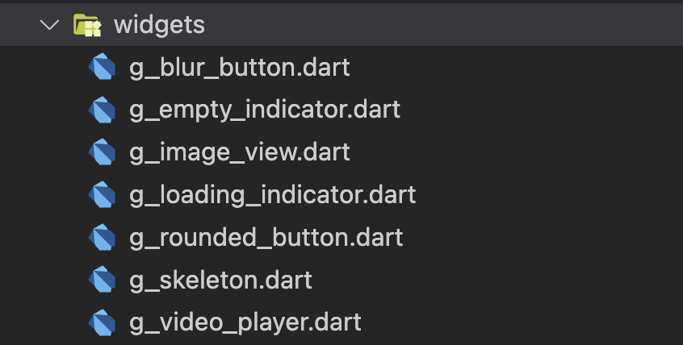

<div dir="rtl">

# پژوهش درس برنامه‌نویسی وب - Flutter Clean Like Architecture

بنیامین بیضایی

## اینو نوشته در تلاش است چه چیزی به شما آموزش دهد؟

در این نوشته سعی میکنیم به شما آموزش دهیم که چطور یک اپلیکیشن فلاتری را در ابعاد بزرگ مدیریت کنید و یک کد قابل نگهداری و توسعه با فلاتر بنویسید. برای مطالعه کاربردی این نوشته لازم است شما با زبان برنامه‌نویسی دارت و موارد ابتدایی فلاتر آشنا باشید. برای مطالعه این پیش‌نیاز‌ها میتوانید از لینک‌های زیر در همین ریپازیتوری استفاده کنید:

* [آموزش زبان دارت](https://github.com/habib-web-sharif/Web-Workshop/tree/master/Dart)

* [آموزش مباحث ابتدایی فلاتر](https://github.com/habib-web-sharif/Web-Workshop/tree/master/Flutter)

در نوشته پیشین در مورد فلاتر با ویژگی‌های اصلی فلاتر آشنا شدید و توانستید از استفاده از ویجت‌های اصلی فلاتر را یاد بگیرید و احتمالا میتوانید رابط کاربری یک اپ ساده را طراحی کنید. اما بهتر است بدانید که این همه داستان نیست! فلاتر نیز مانند هر فریمورک دیگری چندین راه متفاوت برای پیاده‌سازی عملکرد یکسان به شما ارائه می‌دهد. بعد از آشنایی با طراحی یک رابط کاربری در فلاتر باید بتوانید آن را به منطق خاصی وصل کنید و اگر با اصلی‌ترین چالش طراحی اپلیکیشن‌های موبایل و وب آشنا باشید باید بتوانید استیت اپ را به شکل خوبی مدیریت کنید و تغییرات را به کاربر نمایش دهید. همانطوری که اشاره کردم راه‌های بسیار متفاوت و متنوعی برای انجام این کارها پیش روی شماست.

مدیریت استیت(State management) در فلاتر یکی از موضوعات داغ در بین دولوپر‌های فلاتر است و به اصطلاح بین علما اختلاف نظر بسیاری وجود دارد که کدام روش مدیریت استیت بهتر است. در لیست زیر شما میتوانید چند روش از معروف‌ترین روش‌های مدیریت استیت در فلاتر را بشناسید:

* [Provider](https://pub.dev/packages/provider)
* [Reverpod](https://riverpod.dev/)
* [setState](https://medium.com/@agungsurya/basic-state-management-in-google-flutter-6ee73608f96d)
* [BLoC](https://felangel.github.io/bloc)
* [GetIt](https://pub.dev/packages/get_it)

در کل مدیریت استیت یعنی در هر لحظه و هر حالتی شما میخواهید چه دیتایی را به کاربر نمایش دهید؟ از لینک زیر میتوانید در مورد چالش‌های مدیریت استیت و آشنایی بیشتر با یک سیستم ساده مدیریت استیت آشنا شوید: 

[مدیریت استیت ساده در فلاتر](https://docs.flutter.dev/development/data-and-backend/state-mgmt/simple)

در ادامه این نوشته از سیستم مدیریت استیت بلاک استفاده میکنیم.

## این نوشته چطور تهیه شده است و چطور میتوانید به شکل موثری از آن استفاده کنید؟

من قبل از اینکه این پست رو برای شما تهیه کنم خودم کمی در مورد  Clean Architecture
و شیوه استفاده آن در فلاتر مطالعه کردم و بعد از آن شروع به کد زدن با این دستورالعمل ها روی یک پروژه واقعی کردم. باید بدانید که روی آن پروژه فقط و فقط خودم کد میزدم و سعی میکردم همه قوانین را رعایت کنم. بعد از مدتی دیدم رعایت همه قوانین خیلی از من تایم میگیرد و آورده زیادی برای من و پروژه ندارد! تصمیم گرفتم تغییراتی روی این معماری انجام دهم تا کارها سریع‌تر پیش برود و ضمنا کد خیلی اسپاگتی نشود.

آیا کار درستی کردم؟ اگر از Uncle Bob بپرسید احتمالا کار درستی نکردم اما فکر میکنم مطالعه این مقاله برای شما و پروژه‌های بعدی‌تان ارزشمند است. اگر مطلقا چیزی از Clean Code, Clean Architecture بلد نیستید توصیه میکنم این سری ویدیو‌های عمو باب رو نگاه کنید:

[Clean Code - Uncle Bob](https://www.youtube.com/watch?v=7EmboKQH8lM)

اگر هم بلد هستید میتوانید برای رفرنس عمیق و استریکت به این نوشته از رسوکدر مراجعه کنید که تمام چیزی که من گفته‌ام و البته بسیار بیشتر و عملی‌تر از من را توضیح داده است:

[Flutter TDD Clean Architecture Course – Explanation & Project Structure](https://resocoder.com/2019/08/27/flutter-tdd-clean-architecture-course-1-explanation-project-structure/)

در واقع این نوشته و بخش‌های بعدی‌ آن آمده این ویدیو ۸ساعته یوتوب را خلاصه‌سازی کرده که اگر شما همین ویدیو را هم به طور دقیق نگاه کنید و یاد بگیرید برای فلاتر زدن روی پروداکشن به نظر من آماده خواهید بود:

[Learn Flutter Clean Architecture & TDD - Full Course (Flutter Tutorial)](https://www.youtube.com/watch?v=dc3B_mMrZ-Q)

من این نوشته را از روی سورس‌های بالا و تجربه‌های اخیرم در صنعت برای فارسی‌زبانان سرتاسر دنیا! نوشته‌ام و کمی هم تغییر دادم روش‌های این‌ها رو که خیلی نخواهد تمیز باشد و کمی هم کثیف شود و خب عوضش سریعتر جلو برویم!

در این نوشته در مورد روش‌های توسعه با تست صحبت نشده است و همه چیز با همان روش عادی کد زدن جلو میرود. قبل از خواندن ادامه مقاله مطمئن باشید که چیز‌هایی از خود فریمورک فلاتر بلد هستید. میتوانید یک ماشین حساب ساده با فلاتر بنویسید. میدانید استیت چیست و چطور مدیریت میشود. یکی دو روش مدیریت استیت در فلاتر را بلد باشید. یک اپلیکیشن ساده برای دریافت پاسخ از سورس‌های آنلاین هم بلد باشید که بنویسد.

برای توضیح بهتر من سه ویدیو که تقریبا همین نوشته‌ها هستند اما بهتر ارائه شده‌اند را برای شما آماده کرده‌ام. این ویدیو‌ها را همراه مطالعه مقاله میتوانید ببینید.

* [معماری نسبتا تمیز در فلاتر - بخش اول](https://www.aparat.com/v/5dlSJ?playlist=3963473)
* [معماری نسبتا تمیز در فلاتر - بخش دوم](https://www.aparat.com/v/0ChoS?playlist=3963473)
* [معماری نسبتا تمیز در فلاتر - بخش سوم](https://www.aparat.com/v/2l3mG?playlist=3963473)


## راز یک کد قابل نگهداری!
همانطور که عمو باب گفته است باید سعی کنیم در کدی که مینویسیم به اینترفیس‌ها پایبند باشیم نه پیاده‌سازی‌های دقیق! مثلا شما ابتدا نیازمندی خودتان را در کد تبدیل به یک اینترفیس کنید و بعد پیاده‌سازی دقیق آن را بنویسید! اجازه دهید با یک مثلا که در طی توسعه یک اپلیکیشن برای خود من پیش آمده منظورم را شفاف‌تر کنم. در طی توسعه یک کلاینت نیاز داشتیم که علاوه بر خروجی روی دستگاه‌های اندرویدی روی وب هم خروجی داشته باشیم. بعد از آماده‌سازی کلاینت فلاتری برای وب و گرفتن خروجی از آن متوجه شدیم که کتابخانه‌ای که برای ریکوئست‌های http از آن استفاده میکردیم در وب چندان خوب عمل نمیکند و بهتر است از یک کتابخانه‌ی دیگر برای وب استفاده کنیم. 

یک ریکوئست http همچین شکلی دارد:
<div dir="ltr">

```dart
final ans = await http.get(
        _url,
        headers: await _getHeaders(withToken: withToken),
      );
```
</div>

یک کتابخانه‌ی تقریبا کامل http شامل ریکوئست‌های get, put, patch, delete, post است. بیایید فرض کنیم میخواهیم مطمئن باشیم که این متد‌ها را پیاده کرده‌ایم و حتما قادر هستیم از آنها استفاده کنیم. بنابراین یک اینترفیس بر این مبنی مینویسیم:

<div dir="ltr">

```dart
abstract class HttpClientInterface {
  final String apiBase;
  final int connectTimeout;

  HttpClientInterface(
    this.connectTimeout,
    this.apiBase,
  );

  Future<dynamic> get(
    String url, {
    bool withToken = true,
    Map<String, dynamic>? queryParameters,
  });

  Future<dynamic> post(
    String url, {
    dynamic body,
    bool withToken = true,
    Function(int, int)? onSendProgress,
  });

  Future<dynamic> put(
    String url, {
    dynamic body,
    bool withToken = true,
  });

  Future<dynamic> patch(
    String url, {
    dynamic body,
    bool withToken = true,
  });

  Future<dynamic> delete(
    String url, {
    dynamic body,
    bool withToken = true,
  });
 }
```
</div>


حال کافی است در یک نسخه از پیاده سازی این کلاس از کتابخانه دلخواهمان استفاده کنیم. برای مثال اگر بخواهیم از dio استفاده کنیم به این شکل عمل میکنیم:
<div dir="ltr">

```dart
class DioClientImplementation implements HttpClientInterface {
  late Dio dio;
  @override
  final String apiBase;
  @override
  final int connectTimeout;

  DioClientImplementation({
    required this.apiBase,
    required this.connectTimeout,
  }) {
    final options = BaseOptions(
      baseUrl: apiBase,
      connectTimeout: connectTimeout,
      receiveTimeout: 30000,
    );
    dio = Dio(options);

  @override
  Future<dynamic> get(
    String url, {
    bool withToken = true,
    CancelToken? cancelToken,
    Function(int, int)? onReceiveProgress,
    Map<String, dynamic>? queryParameters,
   }) async {
    try {
      dPrint(
          'GET: ${Uri.parse(apiBase).path}$url${queryParameters?.toString() ?? ''}');

      final ans = await dio.get(
        apiBase + url,
        queryParameters: queryParameters,
        options: Options(
          headers: await _getHeaders(withToken: withToken),
        ),
      );
      return _response(ans);
    } catch (e) {
      dPrint('Exception: $e');
      if (e is DioError && e.response != null) {
        return _response(e.response!);
      }
      rethrow;
    }
  }
}

```
</div>

در قطعه کد بالا فقط فانکشن get را پیاده کرده‌ایم و دیگر فانکشن‌ها نیز به همین ترتیب پیاده میشوند. حالا فرض کنید میخواهیم از این ابسترکت‌کلاس در اپ استفاده کنیم:

<div dir="ltr">

```dart
  sl.registerLazySingleton<HttpClientInterface>(
    kIsWeb
        ? () => HttpClientImplementation(
              apiBase: Config.api!,
              connectTimeout: 10000,
            )
        : () => DioClientImplementation(
              apiBase: Config.api!,
              connectTimeout: 10000,
            ),
);
final ans = await sl<HttpClientInterface>().post(
        "/upload/base64/",
        body: {
          "base64": base64,
          "original_name": originalName,
        },
      );
```
</div>
در قطعه کد بالا با توجه به اینکه کلاینت وب باشد یا موبایل باشد از http client مناسب خودش استفاده میکنم! زیبا نیست؟ این ابسترکشن به ما اجازه داد تا چند پیاده‌سازی داشته باشیم و لازم نباشد اصلا به http client قبلی دست بزنیم.

در ادامه بیشتر در مورد service locator که به اختصار sl نامیده میشود صحبت میکنیم.

عموباب علاوه بر تکیه بر اینترفیس‌ها به ما توصیه میکند که تا حد ممکن لایه‌های اپ را جدا کنیم و یک لایه در اپ باعث ترکیدن آن یکی لایه نشود! به معماری کلی **معماری تمیز** نگاهی بیندازید:


در ادامه این نوشته کمی این معماری را دستخوش تغییر میکنیم چون به طور نرمال اگر نخواهیم خیلی بزرگ شویم و ۲۰نفر همزمان روی یک کدبیس کار نمیکنیم به این حد از ابسترکشن احتیاج نداریم!

به فولدربندی زیر نگاه کنید که من در یک پروژه واقعی از آن استفاده کرده‌ام:



در این فولدربندی یکسری فولدر core شامل چیزهای اساسی اپ و مواردی است که در چندین جای اپ از آن استفاده میکنیم. مثلا http client از جمله‌ی آنهاست که در تمام ریپازیتوری‌ها از آن استفاده میکنیم.

فولدر models شامل تمامی مدل‌ها است. در این معماری ما کلاس‌های enteties را نمیسازیم و همه کارها را با همان مدل هندل میکنیم. یک کلاس مدل به طور نرمال شامل متد‌هایی است که به سادگی بتوانیم آن را به جیسون تبدیل کنیم یا از روی جیسون یک نمونه از آن بسازیم. براس مثال:

<div dir="ltr">

```dart
class UserModel {
  UserModel({
    required this.id,
    this.firstName,
    this.lastName,
    this.username,
    this.gender,
  });

  final int id;
  final String? firstName;
  final String? lastName;
  final String? username;
  final String? gender;

  factory UserModel.fromJson(Map<String, dynamic> json) => UserModel(
        id: json["id"],
        firstName: json["first_name"],
        lastName: json["last_name"],
        username: json["username"],
        gender: json["gender"],
      );

  Map<String, dynamic> toJson() => {
        "id": id,
        "first_name": firstName,
        "last_name": lastName,
        "username": username,
        "gender": gender,
      };
}

```
</div>

فولدر pages شامل تمامی صفحات اپ است که معمولا یک Stateful widget/ Stateless widget هستند که یک Scaffold برمیگردانند. 

فولدر repositoris شامل تمامی ریپازیتوری‌ها است که یا از طریق اینترنت دیتا به ما میدهد یا از طریق دیتابیس و sharedpreferences در این کلاس‌ها ما از پکیج dartz استفاده میکنیم که کلاس Either آن به ما کمک میکند ارور و یا جواب صحیح از طریق دیتاسورس‌ها را به شکل مناسب‌تری به دست UI برسانیم. به یک مثلا از یک ریپازیتوری نگاه کنید:

<div dir="ltr">

```dart
import 'package:dartz/dartz.dart';
import 'package:gorgeous/core/exceptions/failures.dart';
import 'package:gorgeous/core/http_client/http_client_interface.dart';
import 'package:gorgeous/models/file_model.dart';

class FileRepository {
  final HttpClientInterface api;

  FileRepository({required this.api});

  Future<Either<Failure, FileModel>> uploadFile(
    String originalName,
    String base64,
  ) async {
    try {
      final ans = await api.post(
        "/upload/base64/",
        body: {
          "base64": base64,
          "original_name": originalName,
        },
      );
      final fileModel = FileModel.fromJson(ans);
      return Right(fileModel);
    } catch (e) {
      return Left(BaseFailure());
    }
  }
}

```
</div>
در ریپازیتوری فایل ما یک متد آپلود ساخته‌ایم که با دریافت نام و بیس۶۴ فایل آن را در بکند آپلود میکند. در ادامه نحوه استفاده از این ریپازیتوری را هم خواهیم آموخت.

فولدر روتر شامل قوانینی برای تعریف صفحات است. من در این پروژه از پکیج auto_route استفاده کرده‌ام که یکی از ساده‌ترین و بهترین پکیج‌های روتینگ در فلاتر است که روتینگ صفحات وب را هم میتوانید با همین پکیج هندل کنید. شما میتوانید از روتر دلخواه خود استفاده کنید و یا اگر از Navigator خود فلاتر استفاده میکنید میتوانید اصلا سمت ساختن این فولدر نروید! به هر حال در این آموزش به بحث روتینگ نمی‌پردازیم.

فولدر widgets شامل ویجت‌هایی است که در صفحات مختلف از آنها استفاده میکنیم و برای کمینه کردن duplicated code و همچنین منظم شدن ساختار پروژه این فولدر را برای نگه‌داری ویجت‌ها ساخته‌ایم. نگاهی به اسم ویجت‌هایی که من در این فولدر ساخته‌ام بیندازید خودتان رفته رفته متوجه خواهید شد که چه ویجت‌هایی را باید در یک فایل مستقل به این فولدر انتقال دهید:



به تکه کد زیر که پیاده‌سازی یک دکمه شخصی‌سازی شده است هم نگاهی بیندازید:

<div dir="ltr">

```dart
import 'dart:ui';

import 'package:flutter/material.dart';

class GBlurButton extends StatelessWidget {
  final Widget child;
  final void Function()? onTap;
  const GBlurButton({
    super.key,
    required this.child,
    required this.onTap,
  });

  @override
  Widget build(BuildContext context) {
    return ClipRRect(
      borderRadius: BorderRadius.circular(20),
      child: InkWell(
        onTap: onTap,
        child: BackdropFilter(
          filter: ImageFilter.blur(sigmaX: 8.0, sigmaY: 5.0),
          child: Container(
            height: 60,
            decoration:
                BoxDecoration(color: Colors.grey.shade400.withOpacity(0.5)),
            child: child,
          ),
        ),
      ),
    );
  }
}

```
</div>

این تکه کد یک دکمه است که بک‌گراند آن به صورت محو پیاده شده است. تصویر این دکمه را در شکل زیر میتوانید ببینید. ما در چند قسمت اپلیکیشن خود از این دکمه استفاده کرده‌ایم. (دکمه پخش ویدیو)


فایل‌های main.dat سرویس لوکیتور و بقیه آپشن‌ها را میتوانیم در کف پروژه قرار دهیم و چندان کار اشتباهی نکرده‌ایم.

فولدر bloc شامل تمامی blocها است. بلاک‌ها سرویس‌هایی هستند که UI را به logic اپ متصل میکنند. مثلا به تکه کد زیر نگاه کنید که یک بلاک برای سرچ است که در بخشی از سرچ خود یک فایل سمت سرور آپلود میکند:

<div dir="ltr">

```dart
import 'dart:convert';

import 'package:flutter/foundation.dart';
import 'package:flutter_bloc/flutter_bloc.dart';
import 'package:gorgeous/models/search_result_model.dart';
import 'package:gorgeous/repositories/file_repository.dart';
import 'package:gorgeous/repositories/searches_repository.dart';

part 'search_state.dart';

class SearchCubit extends Cubit<SearchState> {
  final FileRepository fileRepository;
  final SearchesRepository searchesRepository;

  SearchCubit({
    required this.fileRepository,
    required this.searchesRepository,
  }) : super(SearchInitial());

  void getSearch({required String id}) async {
    emit(SearchLoading());

    final ans = await searchesRepository.getSearch(id);
    ans.fold((l) => emit(SearchError()),
        (r) => emit(SearchLoaded(searchResultModel: r)));
  }

  /// Search for a photo,
  /// bytes is the image bytes and path is use to get the name of the file
  void search({
    required Uint8List bytes,
    String? path,
    required int occasion,
  }) async {
    emit(SearchLoading());
    final name = path == null ? "image.jpg" : path.split('/').last;
    final fileUploadAns =
        await fileRepository.uploadFile(name, base64.encode(bytes));
    fileUploadAns.fold((l) {
      emit(SearchError());
    }, (r) async {
      final searchAns = await searchesRepository.search(
        photoId: r.id,
        occasion: occasion,
      );
      searchAns.fold((l) {
        emit(SearchError());
      }, (r) {
        emit(SearchLoaded(searchResultModel: r));
      });
    });
   }
}
```
</div>
با مطالعه تکه کد بالا باید یادگرفته باشید که دقیقا کجا از ریپازیتوری استفاده میکنیم. توجه کنید که به جز بلاک‌ها بهتر از جای دیگر از ریپازیتوری‌ها استفاده نکنیم. مثلا هیچ جای یوآی مستقیما از یک ریپازیتوری استفاده نکنیم و طریق بلاک به این ریپازیتوری‌ها متصل شویم. به این ترتیب مطمئن میشویم که یوآی به جز اینترفیس و فلویی که بلاک تعریف میکند مستقیما نمیتواند دیتا‌های اپ را تغییر دهد.

یکی از مهم‌ترین بخش‌های اپ هم فایل main است. در فایل main ما به این ترتیب عمل میکنیم:
<div dir="ltr">

```dart
void main() async {
  WidgetsFlutterBinding.ensureInitialized();
  await Firebase.initializeApp(options: DefaultFirebaseOptions.currentPlatform);
  await initSl();
  setPathUrlStrategy();
  runApp(MyApp());
}
```
</div>

سرویس‌هایی که پیش از ران شدن اپ به آنها نیاز داریم را راه‌اندازی میکنیم و سپس یک متدکال بسیار مهم داریم! initSl یکی از مهم‌ترین بخش‌های معماری شما است که تمام کلاس‌هایی که تنها یک instance از آنها نیازدارید را داخل یک سرویس راه‌اندازی میکند. برای اینکار شما میتوانستید از singleton design pattern نیز استفاده کنید اما روش بهتر همین روشی است که ما در این آموزش معرفی میکنیم: 
قبل از ادامه مطالعه این آموزش توصیه میکنم به این لینک سری بزنید و در مورد get_it چیزهایی بخوانید.

https://pub.dev/packages/get_it

با داشتن یک service locator ما پیش از راه‌اندازی اپ سرویس‌هایی که در کل اپ نیاز داریم را یکبار رجیستر میکنیم و بعد از آن همیشه به این سرویس‌ها دسترسی خواهیم داشت. فایل injection_container به طور کلی شمایی مانند زیر دارد:
<div dir="ltr">

```dart
final sl = GetIt.instance;

Future<void> initSl() async {
  final sharedPreferences = await SharedPreferences.getInstance();
  sl.registerLazySingleton(() => sharedPreferences);

  sl.registerLazySingleton<HttpClientInterface>(
    kIsWeb
        ? () => HttpClientImplementation(
              apiBase: Config.api!,
              connectTimeout: 10000,
            )
        : () => DioClientImplementation(
              apiBase: Config.api!,
              connectTimeout: 10000,
            ),
  );

  sl.registerSingleton<FileRepository>(
    FileRepository(
      api: sl<HttpClientInterface>(),
    ),
  );

  sl.registerSingleton<SearchesRepository>(
    SearchesRepository(
      api: sl<HttpClientInterface>(),
    ),
  );

  sl.registerSingleton<SearchCubit>(
    SearchCubit(
      fileRepository: sl<FileRepository>(),
      searchesRepository: sl<SearchesRepository>(),
    ),
  );
}

```
</div>

در مثال بالا یک shared pref رجیستر کرده‌ایم و بلاک‌ها و ریپازیتوری‌های سرچ را هم رجیستر کرده‌ایم و اگر بخواهیم به آن ها دسترسی داشته باشیم خیلی ساده فقط sl را فراخوانی میکنیم. حالا بعد از provide کردن BLoCها در همه جای اپ از طریق context به آنها دسترسی خواهیم داشت.

یک فولدر جدا برای isolated features هم داریم که اگر یک فیچر مجزا از کل اپ میتواند کار خودش را انجام دهد در این فولدر آن را قرار میدهیم یک فیچر مدل، ریپازیتوری، بلاک و صحفات مجزای خودش را دارد در معماری کلین در واقع همه بخش‌های اپ را باید به فیچر‌های مجزا تقسیم میکردیم اما در این معماری که با هم آموختیم کمی ساده‌تر به مسئله نگاه کردیم و یاد گرفتیم بدون تفکیک همه چیز یک اپ با معماری تمیز داشته باشیم.

</div>


