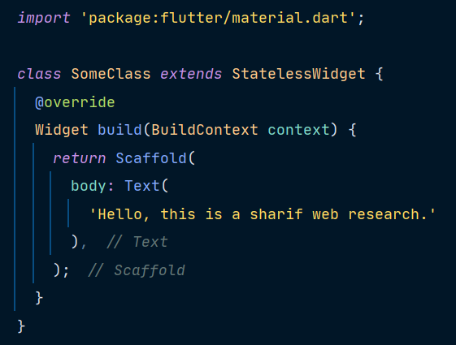
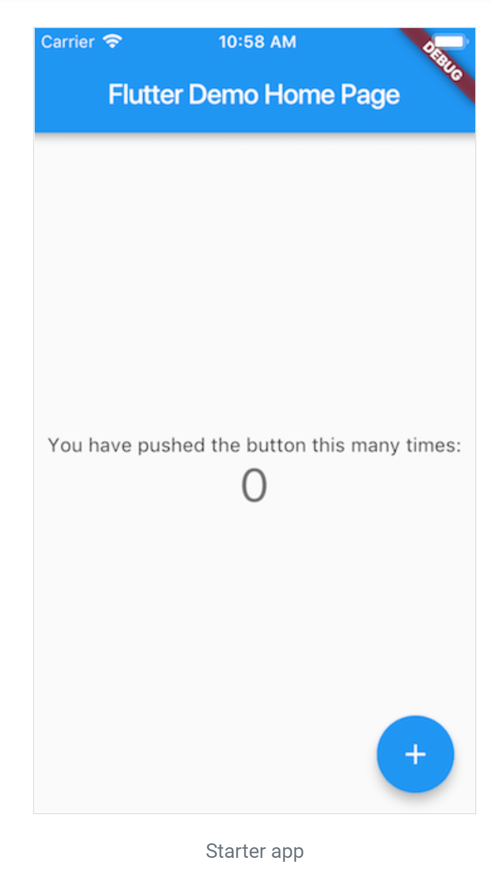
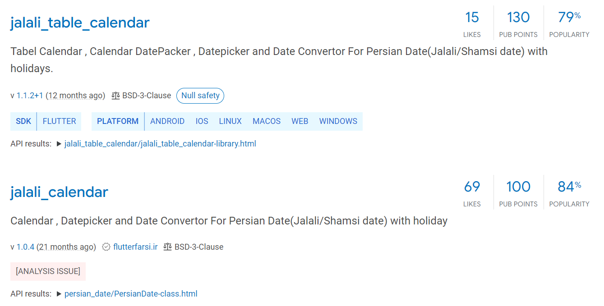
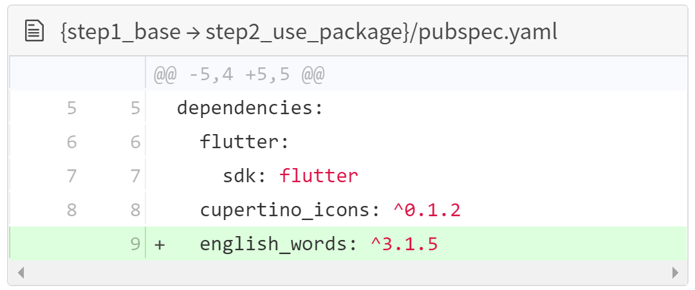
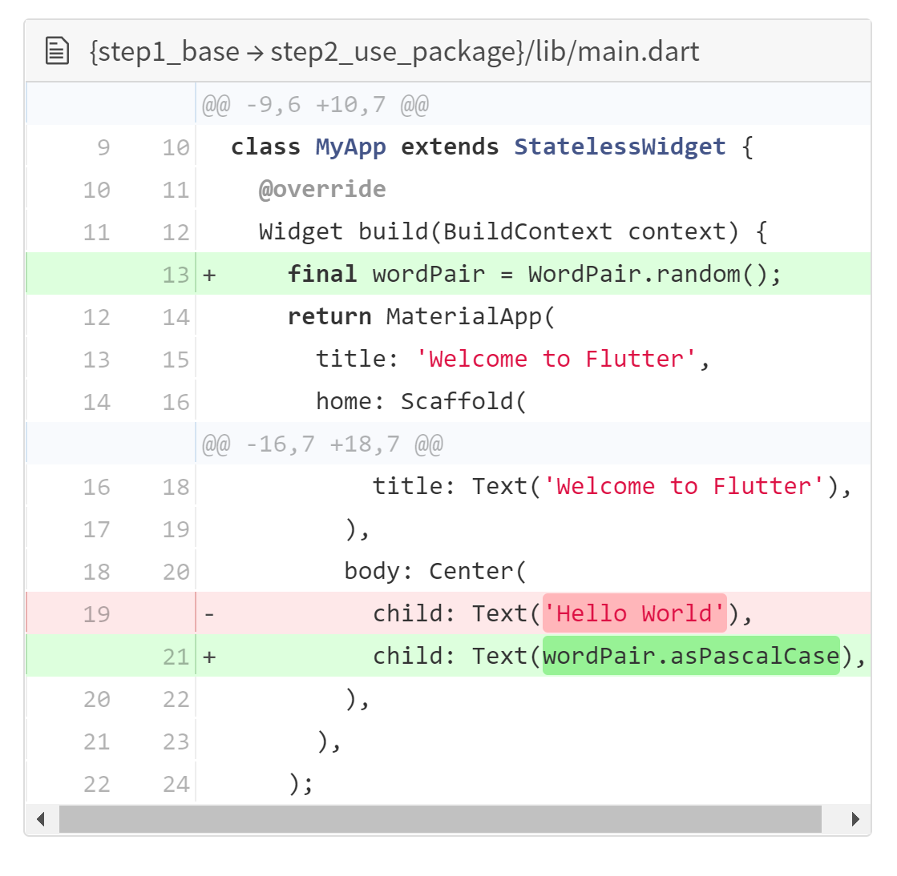
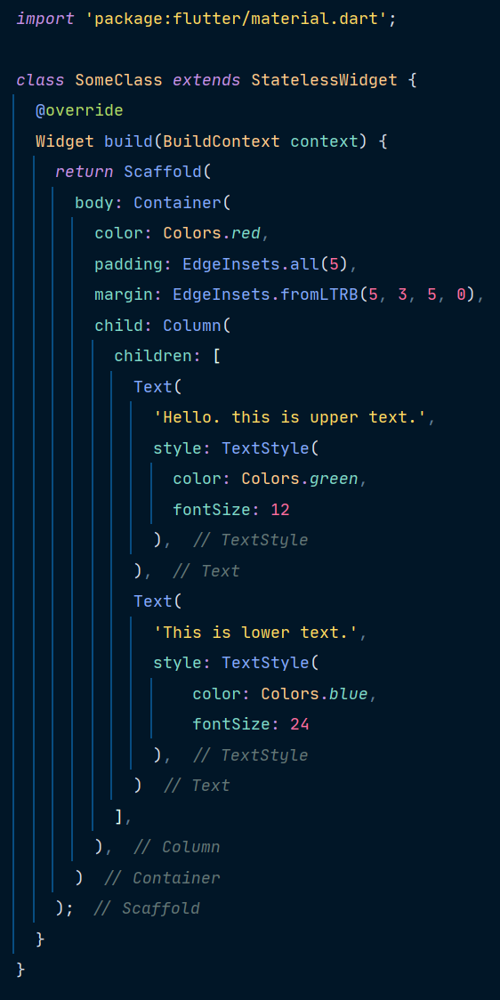
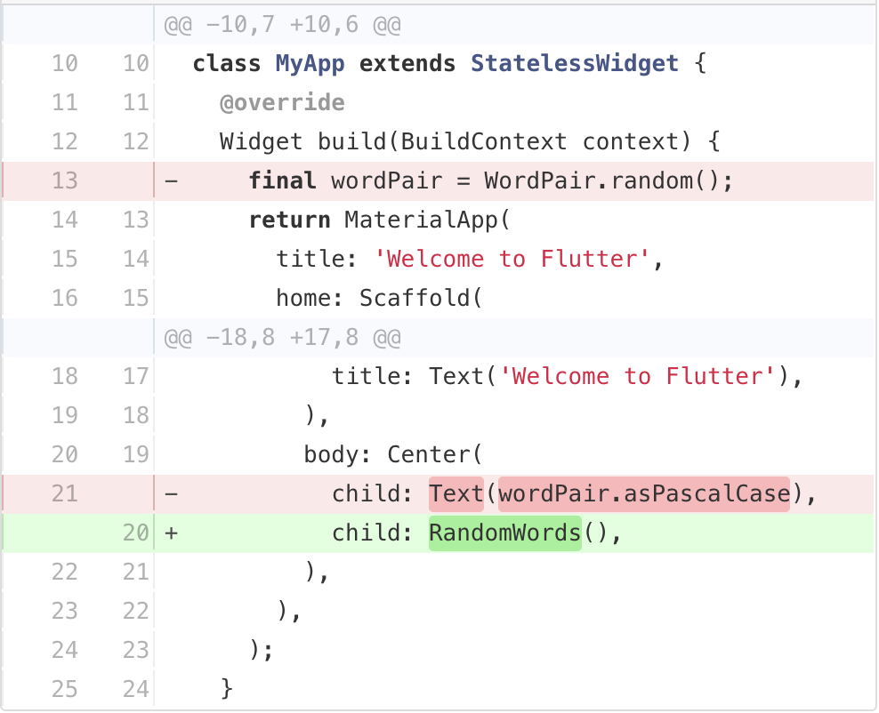
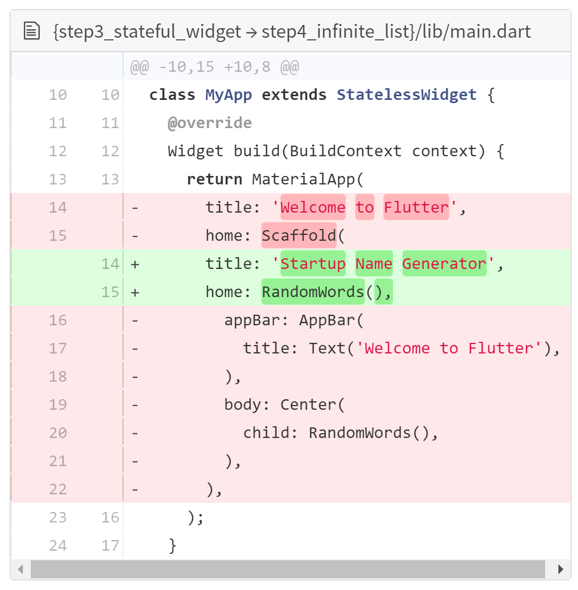

<div dir="rtl">

# پژوهش درس برنامه‌نویسی وب - Flutter 

بهراد ذبیجی، عرفان فرهادی، سپهر زمانی (BFS)
- تحقیق اولیه

سیدمحمدصادق طبائیان (14011)
- بازنویسی روان‌تر متن و اضافه کردن توضیح دقیق‌تر
# معرفی فلاتر و ویژگی‌های آن
معرفی را با توصیف فلاتر از [وب‌سایت](https://flutter.dev/) آن شروع می‌کنیم:

Flutter transforms the app development process. Build, test, and deploy beautiful mobile, web, desktop, and embedded apps from a single codebase.

فلاتر یک فریم‌ورک بر پایه‌ی زبان دارت است که برای طراحی رابط کاربری طراحی شده است. در ادامه به برخی ویژگی‌های آن اشاره می‌کنیم.

## توسعه‌ی سریع
یکی از ویژگی‌های مهم فلاتر، قابلیت Hot Reload است. فلاتر برای کامپایل شدن از کامپایلر JIT دارت استفاده می‌کند که این قابلیت را به توسعه‌دهنده می‌دهد که پس از ایجاد تغییر در بخشی از کد، همان قسمت را به سرعت دوباره کامپایل کند و تغییر را در مرورگر، موبایل، و یا شبیه‌ساز موبایل مشاهده کند.
البته فلاتر از این هم فراتر می‌رود. فرایند Hot Reload در فلاتر به صورت stateful انجام می‌شود که به این معناست که حالت فعلی همه‌ی عناصر برنامه -حتی عناصری که در کد آنها تغییر داده شده- حفظ می‌شود. (به عنوان مثال محل scroll و متن‌های وارد شده.)
البته برای تغییرات بزرگتر مثل تغییر در منطق کد، باید از Hot Restart استفاده کرد که پس از کامپایل بخش‌های تغییریافته، برنامه را از ابتدا اجرا می‌کند.
## رابط کاربری منعطف و گویا
پایه‌ی معماری فلاتر به شکل ایجاد کلاس‌ها درون تعریف یکدیگر است. این موضوع در ابتدا عجیب به نظر می‌رسد اما فهم آن خیلی راحت است. یک مثال می‌زنم.
<center></center>

در این تصویر یک کد خیلی ساده‌ی فلاتر را مشاهده می‌کنید. حال با هم ساختار این کد را بررسی می‌کنیم. در خط اول بسته‌ی  material را برای استفاده import کرده‌ایم. این بسته یکی از مهم‌ترین بسته‌های پایه‌ای فلاتر است و در خط اول اکثر کدها import می‌شود.
پس از آن یک کلاس ایجاد کرده‌ایم که از نوع stateless Widget است که یعنی این عضو برای خود حالات مختلف ندارد. پردازش این نوع اشیاء برای سیستم راحت‌تر از حالت stateful است. Widget نامی است که فلاتر به اعضای صفحه داده است، از عکس‌ها گرفته تا بلوک قابل scroll تا دکمه‌ها.
مهم‌ترین متد هر widget متد build است که باید بازنویسی شود و ساختار کلی و خصوصیات را مشخص می‌کند. در این مثال تابع build یک نمونه scaffold ایجاد کرده و آنرا برگردانده است (scaffold یک widget از بسته‌ی material است که معمولاً به عنوان دربرگیرنده‌ی تمام اعضای صفحه استفاده می‌شود).
همانطور که می‌بینید scaffold یک ورودی به نام body می‌گیرد که خود از نوع widget است. برای این ورودی یک widget جدید از نوع Text ایجاد کرده‌ایم و به آن داده‌ایم. اولین ورودی Text یک ورودی بینام از نوع رشته است که متن درون آنرا مشخص می‌کند. همانطور که می‌بینید معماری فلاتر به صورت لایه‌ای است و این معماری فهم کد را بسیار ساده می‌کند.
این یک کد خیلی ساده برای آشنایی ظاهری با فلاتر بود. در ادامه به آموزش دقیق‌تر خواهیم پرداخت.

## کارآیی بومی
ویجت‌های فلاتر همه‌ی تفاوت‌های حساس پلتفرم‌های مختلف مانند scroll کردن، سیستم راهبری بین صفحات مختلف برنامه، آیکون‌ها و فونت‌ها را ترکیب می‌کند و کد فلاتر شما با استفاده از کامپایلر بومی دارت به کدهای ماشین ARM کامپایل می‌شود. 
# نصب و راه‌اندازی
[منبع](https://flutter.dev/docs/get-started/install)

جزئیات مقتضی برای نصب روی هر کدام از سیستم‌های عامل در لینک‌های پیوست به تفصیل موجود است؛ در این بخش به معرفی اجمالی شیوه‌ی نصب و راه‌اندازی روی سیستم‌عامل‌های ویندوز و لینوکس و اپل می‌پردازیم.
## ویندوز
ابتدا فایل نصب را  از این [لینک](https://storage.googleapis.com/flutter_infra/releases/stable/windows/flutter_windows_1.22.5-stable.zip) دانلود کرده و فایل زیپ را در فولدری مانند C:\src\flutter اکسترکت می‌کنیم. باید توجه داشت که فلاتر را در پوشه‌های با دسترسی‌های ویژه مانند Program Files قرار نداد.

سپس برای معرفی دستورات مربوط به فلاتر در path کامپیوتر بدین شیوه عمل می‌کنیم:

- از طریق منوی استارت با سرچ عبارت env گزینه‌ی Edit environment variables را انتخاب می‌کنیم.
- ذیل User variables مورد Path را تغییر داده و با اضافه کردن یک ; آدرس کامل تا فولدر flutter\bin را وارد می‌کنیم.

حال که دستورات flutter به مجموعه‌ی دستورات تحت کنسول در ویندوز اضافه شده وارد مرحله‌ی راه‌اندازی می‌شویم. flutter doctor را اجرا می‌کنیم. این دستور وضعیت کلی نصب فلاتر را چک می‌کند و به ما کمبودهایی که برای استفاده از فلاتر داریم را نمایش می‌دهد تا آن‌ها را تکمیل کنیم.
## لینوکس و مک
ساده‌ترین روش برای نصب فلاتر بر روی سیستم‌عامل‌های لینوکس استفاده از snapd است که با اجرای کد
</div>

```
sudo snap install flutter --classic
```

<div dir="rtl">

نصب انجام می‌شود. در صورتی که این سیستم مدیریت پکیج را ندارید با پیمودن این گام‌ها فلاتر را نصب کنید. توجه کنید که مراحل نصب بر روی سیستم‌عامل مک‌اوس نیز مشابه همین روش است.

- فایل نصب را از این [لینک](https://storage.googleapis.com/flutter_infra/releases/stable/linux/flutter_linux_1.22.5-stable.tar.xz)(لینوکس) یا این [لینک](https://storage.googleapis.com/flutter_infra/releases/stable/macos/flutter_macos_1.22.5-stable.zip)(مک) دانلود کرده و در محل مورد نظر اکسترکت می‌کنیم.
- با استفاده از خط کد زیر فلاتر را به path اضافه می‌کنیم.
</div>

```
export PATH="$PATH:`pwd`/flutter/bin"
```

<div dir="rtl">
البته توجه کنید این دستور فقط فلاتر را به path این ترمینال اضافه می‌کند و برای افزودن دائمی flutter به path باید دستورات مربوطه در لینک زیر را اجرا کنید.

[لینک](https://flutter.dev/docs/get-started/install/linux#update-your-path)

- با اجرای flutter doctor همانند شیوه‌ی نصب روی ویندوز از وضعیت کلی نصب و نواقص مطلع می‌شویم.

[نصب](https://flutter.dev/docs/get-started/install/windows)[ ](https://flutter.dev/docs/get-started/install/windows)[فلاتر](https://flutter.dev/docs/get-started/install/windows)[ ](https://flutter.dev/docs/get-started/install/windows)[روی](https://flutter.dev/docs/get-started/install/windows)[ ](https://flutter.dev/docs/get-started/install/windows)[ویندوز](https://flutter.dev/docs/get-started/install/windows)

[نصب](https://flutter.dev/docs/get-started/install/linux)[ ](https://flutter.dev/docs/get-started/install/linux)[فلاتر](https://flutter.dev/docs/get-started/install/linux)[ ](https://flutter.dev/docs/get-started/install/linux)[روی](https://flutter.dev/docs/get-started/install/linux)[ ](https://flutter.dev/docs/get-started/install/linux)[لینوکس](https://flutter.dev/docs/get-started/install/linux)

[نصب](https://flutter.dev/docs/get-started/install/macos)[ ](https://flutter.dev/docs/get-started/install/macos)[فلاتر](https://flutter.dev/docs/get-started/install/macos)[ ](https://flutter.dev/docs/get-started/install/macos)[روی](https://flutter.dev/docs/get-started/install/macos)[ ](https://flutter.dev/docs/get-started/install/macos)[مک](https://flutter.dev/docs/get-started/install/macos)[‌](https://flutter.dev/docs/get-started/install/macos)[او](https://flutter.dev/docs/get-started/install/macos)[‌](https://flutter.dev/docs/get-started/install/macos)[اس](https://flutter.dev/docs/get-started/install/macos)
# راه‌اندازی ویرایشگر
[منبع](https://flutter.dev/docs/get-started/editor)

با کمک ابزار خط-دستور فلاتر و هر نرم‌افزار ویرایشگر متنی می‌توان نرم‌افزار ساخت. با این حال پیشنهاد می‌شود که از پلاگین‌های اختصاصی برای این فریم‌ورک در کنار یکی از نرم‌افزارهای رایج استفاده شود. این پلاگین‌ها با تکمیل کد، هایلایت کردن سینتکس‌ها، کمک در ویرایش ویجت‌ها، اجرا، دیباگ و مسائل دیگر به ما در استفاده از فلاتر کمک می‌کنند. ادر این‌جا از Visual Studio Code استفاده می‌کنیم.

- نرم‌افزار VS Code را اجرا می‌کنیم.
- از منوی View گزینه‌ی Command Palette را انتخاب می‌کنیم.
- کلمه‌ی install را تایپ می‌کنیم و Extenstions: Install Extensions را انتخاب می‌کنیم.
- عبارت flutter را سرچ می‌کنیم و آن را نصب می‌کنیم؛ همچنین به پلاگین Dart نیز نیاز داریم.
# اجرای اولیه
[منبع](https://flutter.dev/docs/get-started/test-drive)
## ساختن پروژه
در این بخش سعی می‌کنیم تا شیوه‌ی ساخت از روی قالب‌های از پیش‌آماده، اجرا و تجربه‌ی قابلیت hot reload پس از اعمال تغییرات در یک نرم‌افزار فلاتر را را تشریح کنیم. از منوی View دکمه‌ی Command Palette را انتخاب می‌کنیم، flutter را تایپ می‌کنیم و Flutter: New Project را انتخاب می‌کنیم. نامی مانند myapp را انتخاب کرده و اینتر می‌زنیم. پوشه‌ی پروژه را مشخص می‌کنیم و منتظر می‌مانیم تا فایل main.dart ایجاد شود.
## اجرای نرم‌افزار
برای اجرای نرم‌افزار ابتدا باید دستگاهی که می‌خواهیم فلاتر را روی آن اجرا کنیم انتخاب کنیم. از بخش Device Selector دستگاه را انتخاب کرده و اگر دستگاهی در دسترس نیست می‌توان No Devices را انتخاب کرد و یک شبیه‌ساز را اجرا کند. برای این کار طبعاً باید شبیه‌ساز مناسب مانند BlueStacks را نصب کرده باشیم. بعد از کلیک روی Start Debugging از بخش Run یا زدن دکمه‌ی F5 منتظر می‌مانیم تا نرم‌افزار اجرا شود و از Debug Console پیش‌رفت Build نرم‌افزار را مشاهده می‌کنیم. زمانی که build کامل شد نرم‌افزار روی دستگاه نمایش داده می‌شود.

<center></center>

در مورد اجرای برنامه‌ها روی موبایل خود دقت کنید که ابتدا باید در گوشی خود debug mode را فعال کنید. در گوشی‌های android این گزینه در بخش system و developer options قابل دسترسی است. در این بخش گزینه‌ی USB Debugging را فعال کنید. با فعال کردن این گزینه، هر بار که موبایل را با سیم به کامپیوتر وصل می‌کنیم، پیامی روی صفحه نمایش داده می‌شود که به حالت debug وارد شویم یا نه. پس از قبول کردن روی موبایل، می‌توانیم آنرا در لیست دستگاه‌های متصل از درون IDE ببینیم. این اتصال از طریق wi-fi نیز ممکن است اما فرایند نسبتاً پیچیده‌ای است.

فلاتر به کمک قابلیت Stateful Hot Reload یک چرخه‌ی سریع توسعه را با بازاجرای یک نرم‌افزار در حال اجرا -بدون این‌که نیاز به باز و بسته کردن نرم‌افزار یا از دست دادن وضعیت state کنونی نرم‌افزار باشد- فراهم می‌کند. برای دیدن این ویژگی تغییری روی کد منبع نرم‌افزار ایجاد می‌کنیم و نرم‌افزار را بازاجرا می‌کنیم.

فایل main.dart یا هر فایل دیگری را از lib باز می‌کنیم و تغییری در برنامه ایجاد می‌کنیم و سپس کد را سیو کرده و Hot Reload را فشار می‌دهیم، مشاهده می‌کنیم که بلافاصله تغییرات اعمال می‌شود.
## خروجی گرفتن
تا به حال نرم‌افزار در مد debug اجرا می‌شد. این مد بهره‌وری نرم‌افزار را با قابلیت‌های مربوط به توسعه مانند hot reload و debug خط‌به‌خط معاوضه می‌کند و به همین دلیل غیرمنتظره نیست که سرعت کم یا انیمیشن‌های دارای لگ را در این مد تجربه کنیم. این حالت به ما امکان اتصال [DevTools](https://docs.flutter.dev/development/tools/devtools/overview) را می‌دهد که امکانات خیلی خیلی زیادی برای بررسی جنبه‌های مختلف برنامه می‌دهد.
برای اجرای برنامه در حالت Release باید از دستور زیر استفاده کنیم:
flutter run --release
برای اطلاعات بیشتر در مورد خروجی گرفتن از [این لینک](https://flutter.dev/docs/testing/build-modes) پیروی می‌کنیم.

# نوشتن نخستین برنامه
در ادامه شما را تا ساخت نخستین برنامه‌ی فلاترتان راهنمایی می‌کنیم. برای انجام این کار به دانش قبلی از Dart یا برنامه‌نویسی وب و موبایل نیاز ندارید اما باید با مفاهیم ابتدایی برنامه‌نویسی و شی‌گرایی آشنایی داشته باشید. قصد داریم یک برنامه‌ی ساده را پیاده سازیم که برای شرکت‌های استارتاپ نام پیشنهاد می‌دهد. کد این نرم‌افزار در هر لحظه تنها ده نام را تولید می‌کند و همزمان با اسکرول کردن کاربر نام‌های بیش‌تری تولید می‌شوند. میزانی که کاربر می‌تواند اسکرول کند حدی ندارد.

آنچه در این بخش یاد می‌گیریم

- نحوه‌ی نوشتن نرم‌افزار فلاتری که هم در iOS هم Android و هم وب ظاهری طبیعی داشته باشد.
- ساختار اولیه‌ی یک نرم‌افزار فلاتر
- پیدا کردن واستفاده از پکیج‌هایی که کارآیی را گسترش دهند.
- استفاده از hot reload برای افزایش سرعت چرخه‌ی توسعه
- شیوه‌ی پیاده‌سازی یک ویجت وضعیت‌دار
- شیوه‌ی ایجاد یک لیست بی‌نهایت که به صورت lazily لود شود

برای این‌که بتوان نرم‌افزار را برای محیط وب کامپایل کرد باید این دستورات را اجرا کرد:
</div>

```
flutter channel beta
flutter upgrade
flutter config --enable-web
```
<div dir="rtl">
پس از یک بار اجرای این خطوط همه‌ی نرم‌افزارهای فلاتر به نسخه‌ی وب نیز کامپایل می‌شوند. حال دیگر در بخش devices می‌توانید Chrome یا Web server را نیز ببینید. گزینه‌ی Chrome نرم‌افزار را مستقیما روی Chrome اجرا می‌کند اما گزینه‌ی Web server یک سرور داخلی ایجاد می‌کند که می‌توان از هر مرورگری آن را دید. با استفاده از گزینه‌ی Chrome حین توسعه می‌توان از قابلیت‌های DevTools برای دیباگ کردن نیز استفاده کرد.

## ساختن برنامه‌ی اولیه
[منبع](https://flutter.dev/docs/get-started/codelab#step-1-create-the-starter-flutter-app)

مطابق توضیحات بخش ساختن پروژه یک نرم‌افزار جدید فلاتر به نام startup\_namer ایجاد کنید. حال باید فایل lib\main.dart را در ویرایش‌گر باز کنید و کد زیر که کد برنامه‌ی نمایش Hello World در مرکز صفحه است را در آن کپی کنید.
</div>

```
// Copyright 2018 The Flutter team. All rights reserved.
// Use of this source code is governed by a BSD-style license that can be
// found in the LICENSE file.

import 'package:flutter/material.dart';

void main() => runApp(MyApp());

class MyApp extends StatelessWidget {
  @override
  Widget build(BuildContext context) {
    return MaterialApp(
      title: 'Welcome to Flutter',
      home: Scaffold(
        appBar: AppBar(
          title: Text('Welcome to Flutter'),
        ),
        body: Center(
          child: Text('Hello World'),
        ),
      ),
    );
  }
}

```
<div dir="rtl">

حال مطابق بخش اجرای نرم‌افزار کد را اجرا و نتیجه را مشاهده کنید.
### مشاهدات اجرای اولیه
- این نرم‌افزار از Material، که یک زبان طراحی تصویری استاندارد برای موبایل و وب است، استفاده می‌کند. فلاتر از مجموعه‌ی غنی‌ای از ویجت‌های Material پشتیبانی می‌کند به همین دلیل برای استفاده از ویژگی‌های مفصل‌تر Material مثل آیکون‌های از پیش‌تعریف‌شده‌اش خط uses-material-design: true را در بخش flutter فایل pubspec.yaml اضافه می‌کنیم.
- متد ()main  از <= برای متدها و توابع یک‌خطی استفاده می‌کند.
- این نرم‌افزار از StatelessWidget ارث‌بری می‌کند که باعث می‌شود خودش نیز یک ویجت باشد. در فلاتر تقریبا همه چیز ویجت است حتی alignment، padding و layout.
- ویجت Scaffold از کتاب‌خانه‌ی Material یک نوار بالایی (Bar) نرم‌افزار پیش‌فرض و یک ویژگی body که در آن درخت ویجت‌ها در آن قرار می‌گیرد را برای ما فراهم می‌کند. درخت ویجت‌ها خود می‌تواند بسیار پیچیده شود.
- کار اصلی یک ویجت آن است که یک متد ()build فراهم کند که در آن مشخص کند ویجت در نسبت با دیگر ویجت‌های سطح پایین‌تر از خودش چگونه نمایش داده شود.
- در این مثال body از یک ویجت Center که در آن یک ویجت Text قرار دارد تشکیل شده است. ویجت Center زیردرخت ویجتش را در مرکز صفحه تنظیم می‌کند.
## استفاده از یک پکیج خارجی
[منبع](https://flutter.dev/docs/get-started/codelab#step-2-use-an-external-package)

در این مرحله یاد می‌گیریم تا از یک پکیج متن‌باز به نام english\_words که در آن چندین هزار کلمه‌ی رایج انگلیسی و تعدادی تابع کمکی قرار دارد استفاده کنیم. می‌توانید این پکیج و پکیج‌های متن‌باز بسیار زیادی را در pub.dev پیدا کنید. این وبسایت منبع رسمی برای پکیج‌های فلاتر است و برای هر موضوعی می‌توانید در آن منابع مناسبی پیدا کنید. فقط به عنوان مثالی که باعث شود وسعت این سایت را درک کنید، اگر کلمه‌ی jalali را در این سایت چک کنیم برای این که تقویم جلالی(شمسی) به برنامه‌ی خود اضافه کنیم، 43 پکیج مختلف پیدا خواهد شد! بهتر است نگاهی به فرمت پاسخ‌ها داشته باشیم.

<center></center>

در این تصویر دو مورد اول از 43 مورد یافت شده را مشاهده می‌کنید. برای هر پکیج ابتدا نام و توضیح آن آمده‌است، سپس شماره‌ی آخرین نسخه‌ی منتشرشده و تاریخ انتشار آن و بعد لایسنس آن. اگر دقت کنید پکیج بالا یک علامت Null safety دارد که پکیج پایین ندارد. مفهوم Sound null safety مفهومی است که از فلاتر2 و دارت2.12 اضافه شده است با این هدف که توسعه‌دهنده‌ها را از باگ‌های خیلی زیادی که در زمان اجرا به خاطر referenceهای Null ایجاد می‌شدند راحت کند. این قابلیت به این معناست که متغیرها دیگر اجازه ندارند مقدار نداشته باشند مگر این که توسعه‌دهنده، تایپ متغیر را با اضافه کردن یک علامت سوال به انتهای آن nullable کند. Null safe بودن باعث می‌شود به جای ارورهای زمان اجرا، اخطار زمان کدنویسی دریافت کنیم که دیباگ را خیلی راحت می‌کند. دارت3 در اواسط سال 2023 منتشر خواهد شد و از آن زمان همه‌ی کدها باید Null safe باشند اما تا قبل از آن، پکیج‌ها می‌توانند کم‌کم کد خود را به این سمت ببرند. نشان Null safety کنار پکیج در تصویر هم به همین معنا است که سازندگان این پکیج کد خود را بازنویسی و تصحیح کرده‌اند تا این قاعده‌ی جدید را رعایت کنند. طبیعی است که این یک مزیت برای پکیج محسوب می‌شود (به پکیج Pub point تعلق می‌گیرد که در ادامه بررسی می‌کنیم).
یک مورد قابل توجه دیگر، امتیازات پکیج‌ها در بالا سمت راست آنها است. همانطور که مشاهده می‌کنید، هر پکیج سه نوع امتیاز دارد. وقتی یک توسعه‌دهنده به دنبال یافتن یک پکیج مناسب برای کار مد نظر خود است، برای انتخاب بین نتایج سرچ، به این امتیازات توجه می‌کند. امتیاز Likes که لایک‌هایی است که توسعه‌دهنده‌ها می‌توانند با لاگین کردن به پکیج‌ها بدهند. امتیاز Pub Points معیار کیفیتی است که سایت pub.dev با استفاده از ابزار Pana به صورت اتوماتیک پکیج‌ها را ارزیابی می‌کند و به آنها امتیاز می‌دهد. وارد جزئیات دقیق این امتیاز نمی‌شویم اما مواردی مثل Null safety یا داشتن changelog یا پشتیبانی از پلتفرم‌های مختلف در بالابردن این امتیاز موثر هستند. امتیاز آخر هم Popularity است که بر اساس تعداد برنامه‌هایی که در دو ماه اخیر از این پکیج استفاده کرده‌اند، یک درصد بین صفر تا صد به پکیج نسبت می‌دهد.

- فایل pubspec.yaml منابع و وابستگی‌ها (dependencies) یک نرم‌افزار فلاتر را مدیریت می‌کند. در این فایل پکیج english\_words را به لیست وابستگی‌ها اضافه کنید.

<center></center>

- با اجرای کد flutter pub get پکیج را دانلود کنید.
- در فایل lib\main.dart پکیج‌های جدید را اضافه کنید. اگر در محیط اندروید استودیو کار می‌کنید همزمان با تایپ اندروید استودیو به شما پیشنهادات برای اضافه کردن را نمایش می‌دهد و پس از نوشتن آن را خاکستری می‌کند تا به شما اطلاع دهد که این کتاب‌خانه هنوز در این فایل استفاده نشده است.
- حال به جای رشته‌ی Hello World از این پکیج برای تولید متن استفاده کنید.

<center></center>

توجه کنید که مقصود از Pascal case آن است که همه‌ی کلمات در رشته با حروف بزرگ شروع می‌شوند. و مثلا uppercamelcase به UpperCamelCase تبدیل می‌شود.

- اگر نرم‌افزار در حال اجراست با hot reload کردن آن نرم‌افزار را بازاجرا کنید. هر بار که پروژه را ذخیره کنید یا روی hot reload کلیک کنید یک جفت‌کلمه‌ی جدید به صورت تصادفی به شما نمایش داده می‌شود. این به این خاطر است که فرآیند جفت کردن کلمات داخل متد build انجام می‌شود که هر بار MaterialApp نیاز به رندر شدن دارد اجرا می‌شود. این نکته‌ی مهمی راجع به متد build است چون در مواقعی شخص توسعه‌دهنده با فرض این که این متد فقط در ابتدای لود شدن صفحه اجرا می‌شود، مقداردهی‌های اولیه یا محاسباتی که باید یک بار انجام شوند را در بالای این متد قبل از return انجام می‌دهند که باعث ایجاد باگ یا کاهش سرعت برنامه می‌شود. برای این کار می‌توان از روش‌های دیگر مثل متد on init موجود در stateful widgetها استفاده کرد. متد build هر بار پلتفرم در Inspector فلاتر تغییر کند نیز اجرا می‌شود.

توجه کنید که اگر در این مرحله مشکلی دارید احتمالا به دلیل غلط‌های املایی‌ست. برای دیباگ کردن از [DevTools](https://flutter.dev/docs/development/tools/devtools) استفاده کنید و در صورت نیاز می‌توانید کدها را از این دو لینک بردارید:

- [pubspec.yaml](https://raw.githubusercontent.com/flutter/codelabs/master/startup_namer/step2_use_package/pubspec.yaml)
- [lib\main.dart](https://raw.githubusercontent.com/flutter/codelabs/master/startup_namer/step2_use_package/lib/main.dart)

## شخصی‌سازی برنامه
پیش از این که وارد موارد پیشرفته‌تر مانند ویجت وضعیت‌دار شویم، لحظه‌ای توقف کنیم و کمی برنامه را شخصی‌سازی کنیم که با ساختار فلاتر آشناتر شویم. به نمونه کد زیر نگاه کنید (این کد هیچ ارتباطی به برنامه‌ی فعلی ندارد. صرفاً به عنوان مثال آنرا نوشتم.)

<center></center>

با آشنایی کنونی خود با فلاتر باید تقریباً متوجه شوید که این کد چیست. یک بار با هم آنرا بررسی می‌کنیم. بخش اول کد تا ابتدای متد build که همان است که ابتدای برنامه هم توضیح داده شد. درون متد build یک Scaffold ایجاد شده است که همانطور که گفتیم ویجتی است که معمولاً به عنوان دربرگیرنده‌ی کل صفحه در نظر گرفته می‌شود. این ویجت یک ورودی body می‌گیرد که محتوای درونش است. به این ورودی یک Container داده‌ایم که همانند div در html عمل می‌کند. به حروف بزرگ ابتدای اسم این ویجت‌ها دقت کنید. درون این Container قضیه جالب می‌شود. همانطور که می‌بینید چندین ورودی پشت سر هم داده‌ایم که حاشیه‌ها و رنگ را مشخص می‌کنند. مشخصات ویجت‌ها در فلاتر کلاْ به این شکل مشخص می‌شوند. فرزند این Container یک ویجت از نوع Column است که به عنوان ورودی یک لیست به نام children می‌گیرد و آنها را به ترتیب از بالا به پایین زیر هم نمایش می‌دهد. درون این لیست هم دو متن گذاشته‌ایم که هر کدام استایل خاص خود را دارند. شاید این حالت نوشتن در ابتدا مانند html با inline css پیچیده و شلوغ به نظر برسد اما اگر کد مرتب نوشته شود خیلی روان خواهد بود. حال به ادامه‌ی برنامه‌ی تولید نام برمی‌گردیم.

## اضافه کردن یک ویجت وضعیت‌دار
[منبع](https://flutter.dev/docs/get-started/codelab#step-3-add-a-stateful-widget)

در ویجت‌های بدون وضعیت، دارای خواص ثابت هستند و تغییر نمی‌کنند. یعنی تمام مقادیر نهایی هستند. 

ویجت‌های وضعیت‌دار، وضعیتی را نگه می‌دارد که ممکن است در طول عمر ویجت تغییر هم بکند. پیاده سازی یک ویجت وضعیت دار، نیازمند حداقل دو کلاس است:‌ ۱) یک کلاس "statefulWidget" که یک نمونه تولید می‌کند از ۲) یک کلاس "State". کلاس statefulWidget یک کلاس تغییرناپذیر است و می‌توان آن را دور انداخت یا باز تولید کرد، اما کلاس State در طول عمر ویجت باقی می‌ماند.

در این مرحله، یک ویجت وضعیت‌دار به نام RandomWords، که کلاس State خود را با نام \_RandomWordsState ایجاد می‌کند، می‌سازیم. سپس از RandomWords به عنوان فرزند داخل ویجت بدون وضعیت MyApp استفاده می‌کنیم.

- کد boilerplate را برای یک ویجت وضعیت دار ایجاد می‌کنیم.
  در آدرس lib/main.dart، پس از تمام کدها، چند بار کلید return را فشار می‌دهیم و در یک خط جدید شروع می‌کنیم.
  در IDE خود stful را تایپ می‌کنیم. ویرایشگر از ما می‌پرسد که آیا قصد ایجاد یک ویجت وضعیت دار داریم و موافقت می‌کنیم. کد boilerplate برای دو کلاس نمایان می‌شود و از ما نام ویجت وضعیت دار را می‌پرسد. 	

- نام RandomWords را وارد می‌کنیم. ویجت RandomWords کارهای کوچک دیگری هم در کنار ایجاد کلاس State خودش انجام می‌دهد.
هنگامی که RandomWords را به عنوان نام ویجت وارد می‌کنیم، ویرایش‌گر خود کلاس State مربوطه را می‌سازد و آن را RandomWordsState\_ می‌نامد.
به طور پیش فرض نام کلاس وضعیت برای ایجاد پرایوسی با یک '\_' در زبان Dart شروع می‌شود. 

ویرایشگر همچنین به طور خودکار کلاس وضعیت را برای توسعه <State<RandomWords به روز می‌کند که نشان‌گر این است که از یک کلاس عمومی State به طور مخصوص برای RandomWords استفاده می‌کنیم. غالب منطق برنامه در اینجا نهفته است:‌ وضعیت ویجت RandomWords را اینجا نگهداری می‌کند. این کلاس لیستی از جفت‌کلمات تولید شده را نگهداری می‌کند که با اسکرول کردن کاربر تا بینهایت به آن افزوده می‌شود، و در بخش دوم این آموزش، کلمات را با فشردن علامت قلب به favorite افزوده یا از آن حذف می‌کند. 
هر دو کلاس به صورت زیر می‌باشد:
</div>

```
class RandomWords extends StatefulWidget {
	@override
  _RandomWordsState createState() => _RandomWordsState();
}
```

```
class _RandomWordsState extends State<RandomWords> {
	@override
  	Widget build(BuildContext context) {
   		 return Container();
 	 }
}
```
<div dir="rtl">

- متد ()build در RandomWordsState\_ را به روز می‌کنیم : 

</div>

```
class _RandomWordsState extends State<RandomWords> {
	@override
	Widget build(BuildContext context) {
		final wordPair = WordPair.random();
		return Text(wordPair.asPascalCase);
	}
}
```
<div dir="rtl">

- کد ایجاد کلمه را از MyApp توسط تغییرات نشان داده شده در ادامه، حذف می‌کنیم:
- اپلیکیشن را ری استارت می‌کنیم. برنامه باید مثل سابق رفتار کند و هر گاه صفحه را دوباره لود کردیم یا برنامه را ذخیره کردیم، یک کلمه را به ازای آن نمایش دهد.

<center></center>


## ساختن یک لیست بی‌نهایت‌اسکرول‌شونده
[منبع](https://flutter.dev/docs/get-started/codelab#step-4-create-an-infinite-scrolling-listview)

در این گام می‌خواهیم با گسترش RandomWordsState\_ لیستی از جفت‌شدن‌های کلمات ایجاد کرده و نمایش دهیم. زمانی که کاربر اسکرول می‌کند، لیست (که در یک ویجت ListView نیز نشان داده می‌شود) تا بی‌نهایت رشد می‌کند و بزرگ می‌شود. سازندهٔ نوع کارخانه‌ای ListView به شما این امکان را می‌دهد تا برحسب نیاز یک دید تنبل(lazy) از لیست بسازید.

- یک لیست suggestions\_ به کلاس RandomWordsStare\_ اضافه کنید تا جفت‌کلمه‌های پیشنهادی را ذخیره کند. هم‌چنین یک متغیر biggerFont\_ نیز برای بزرگ کردن اندازهٔ قلم اضافه کنید.
</div>

```
class _RandomWordsState extends State<RandomWords> {
	final _suggestions = <WordPair>[];
	final _biggerFont = TextStyle(fontSize: 18.0);
	// ···
}
```

<div dir="rtl">

سپس باید یک تابع ()buildSuggestions\_ به کلاس RandomWordsState\_ اضافه کنیم که این متد ListViewای را می‌سازد که جفت‌کلمه‌های پیشنهادی را نشان می‌دهد.

کلاس ListView یک ویژگی(property) سازنده به نام itemBuilder ارائه می‌دهد که یک سازندهٔ از نوع کارخانه‌ای و یک تابع کال‌بک(بازفراخوانی) است که به عنوان یک تابع بدون نام مشخص شده‌است. دو پارامتر به تابع پاس داده می‌شوند یکی BuildContext و دیگری شمارندهٔ سطر *i*. شمارنده از عدد ۰ شروع کرده و هر بار که تابع فراخوانده می‌شود، یکی اضافه می‌شود. هم‌چنین برای هر جفت‌کلمهٔ پیشنهادی ۲ بار افزوده می‌شود: یکی برای ListTile و بار دیگر برای تقسیم‌کننده(Divider). این مدل به لیست پیشنهادات اجازه می‌دهد تا زمانی که کاربر پیمایش(اسکرول) می‌کند به بزرگ شدن ادامه دهد.

- یک تابع ()buildSuggestions\_ به کلاس RandomWordsState\_ اضافه می‌کنیم.
</div>

```
Widget _buildSuggestions() {
	return ListView.builder(
		padding: EdgeInsets.all(16.0),
		itemBuilder: /*1*/ (context, i) {
			if (i.isOdd) return Divider(); /*2*/
			final index = i ~/ 2; /*3*/
			if (index >= _suggestions.length) {
				_suggestions.addAll(generateWordPairs().take(10)); /*4*/
			}
			return _buildRow(_suggestions[index]);
		});
}

```

<div dir="rtl">

توضیحات:

/\*1\*/ تابع بازفراخوانی itemBuilder به ازای هر جفت‌کلمه‌ی پیشنهادی فراخوانده می‌شود و هر پیشنهاد را در یک سطر ListTile قرار می‌دهد. برای سطرهای زوج، تابع یک سطر ListView برای جفت‌کلمه اضافه می‌کند. برای سطرهای فرد نیز تابع یک ویجت Divider اضافه می‌کند تا داده‌ها را از نظر ظاهری جدا کند. لازم به ذکر است که تقسیم‌کننده ممکن است در دستگاه‌های کوچک به سختی دیده شود.

/\*2\*/ قبل از هر سطر در ListView یک ویجت تقسیم‌کننده به ارتفاع ۱ پیکسل را اضافه می‌کند.

/\*3\*/ عبارت i ~/ 2 عدد i را بر ۲ تقسیم می‌کند و حاصل صحیح آن را برمی‌گرداند. برای مثال ۱، ۲، ۳، ۴ و ۵ تبدیل به ۰، ۱، ۱، ۲ و ۲ می‌شوند. بدین ترتیب تعداد دقیق جفت=کلمه‌ها در ListView منهای ویجت‌های تقسیم‌کننده را محاسبه می‌کند.

/\*4\*/ اگر به انتهای جفت-کلمه‌های موجود رسیدیم، در آن صورت ۱۰ تای دیگر تولید کرده و به انتهای لیست پیشنهادات اضافه می‌کند.

- یک تابع ()buildRow\_ را به RandomWordsState\_ اضافه می‌کنیم.
</div>

```
Widget _buildRow(WordPair pair) {
	return ListTile(
		title: Text(
			pair.asPascalCase,
			style: _biggerFont,
		),
	);
}
```

<div dir="rtl">
- در کلاس RandomWordsState\_، به‌جای آن‌که مستقیما کتابخانهٔ تولید کلمات را صدا کنیم تابع ()build را برای استفاده از ()buildSuggestions\_ به‌روز‌رسانی می‌کنیم. (Scaffold ویژگی‌های ابتدایی Material را برای layout بصری پیاده‌سازی کرده است.) بدنهٔ متد را با قطعه‌کد مشخص‌شده‌ی زیر جایگزین کنید.

<center></center>

- در کلاس MyApp، متد ()build را به وسیهٔ تغییر عنوان آن و عوض کردن خانه‌اش (تا یک ویجت Random Word باشد) به‌روزرسانی کنید.

<center></center>

- اپ را مجددا اجرا کنید. خواهید دید که یک لیست از جفت کلمه‌ها وجود دارد که برایش اهمیتی ندارد چه‌قدر پیمایش کرده‌اید.

<center></center>

### مشکلات
مانند قبل اگر برنامه ما درست اجرا نشود، باید به دنبال اشکالات تایپی بگردیم. اگر می‌خواهید بعضی از ابزار debugging فلاتر را 

امتحان کنید، می‌توان از این [لینک](https://flutter.dev/docs/development/tools/devtools) استفاده کرد و در صورتی که نیاز شد از این [قطعه](https://raw.githubusercontent.com/flutter/codelabs/master/startup_namer/step3_stateful_widget/lib/main.dart)[ ](https://raw.githubusercontent.com/flutter/codelabs/master/startup_namer/step3_stateful_widget/lib/main.dart)[کد](https://raw.githubusercontent.com/flutter/codelabs/master/startup_namer/step3_stateful_widget/lib/main.dart) برای برگشتن به مسیر بهره برد.

## گام‌های بعدی
تا به حال شما یک نرم‌افزار فلاتر تعاملی نوشته‌اید که هم روی iOS و هم روی Android اجرا می‌شود. در این آموزش شما:

- یک نرم‌افزار فلاتر را از پایه ساختید.
- کد Dart آن را نوشتید.
- از یک کتابخانه‌ی خارجی استفاده کمک گرفتید.
- از قابلیت hot reload برای تسریع چرخه‌ی توسعه استفاده کردید.
- یک ویجت وضعیت‌دار پیاده‌سازی کردید.
- یک لیست ‌بی‌نهایت‌اسکرول‌شونده ساختید که به صورت تنبلانه بارگیری می‌شود.

اگر می‌خواهید این نرم‌افزار را گسترش دهید بخش دوم آن را از این [لینک](https://codelabs.developers.google.com/codelabs/first-flutter-app-pt2) مطالعه کنید که در آن این کاربردها را به آن اضافه خواهید کرد:

- تعامل با برنامه را با اضافه کردن یک آیکون قلب برای ذخیره‌سازی جفت‌کلمات محبوب پیاده‌سازی کنید.
- یک navigation پیاده سازی کنید که در آن مسیری تازه برای صفحه‌ای جدید که در آن جفت‌کلمات محبوب ذخیره شده‌اند ایجاد شود.
- امکان تغییر رنگ‌های تم را فراهم کنید تا یک نرم‌افزار تماما سفید ایجاد کنید.
</div>
