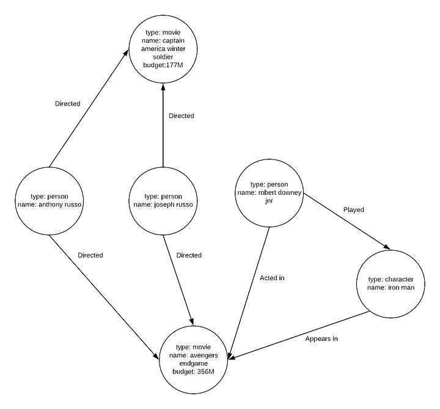
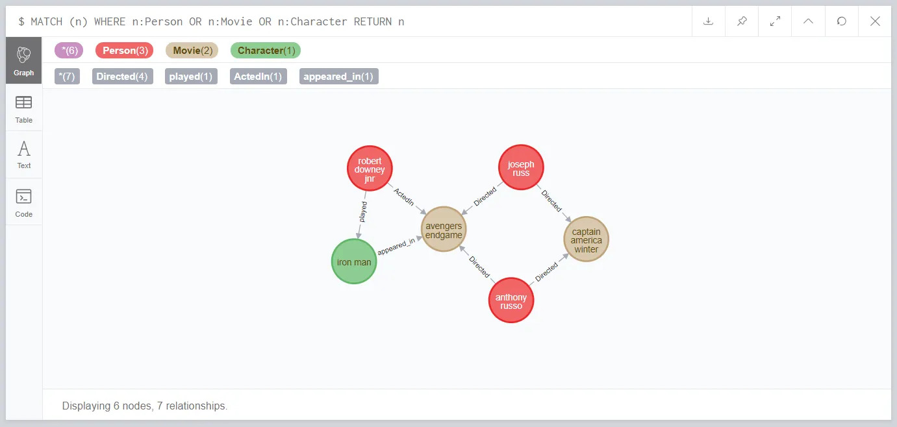

<div dir="rtl">

# معرفی
دیتابیس‌های گرافی همانطور که از نام‌ آن‌ها مشخص است داده‌ها را بر اساس اصول ریاضی نظریه گراف ذخیره می‌کنند، اساسا ما می‌توانیم گراف را به صورت مجموعه‌ای از راس‌ها و یال‌ها در نظر بگیریم. راس‌ها معمولا موجودیت‌ها و یال‌ها معمولا روابط بین آن‌ها را نشان می‌دهند. یکی از ویژگی‌ها متمایز دیتابیس‌ها گرافی این است که علاوه بر اینکه راس‌ها می‌توانند موجودیت‌ها و اطلاعات آن‌ها را نگه دارند یا‌ل‌ها نیز می‌توانند همین کار را در قبال روابط انجام دهند.

به مثال زیر دقت کنید:



حال که داده‌ها و روابط خود را مدل‌سازی کرده‌ایم می‌توانیم انواع کوئری‌هایی را که برای استخراج اطلاعات از گراف استفاده می‌شوند را ملاحظه کنیم.

توجه‌ کنید که کوئری‌های بسیار پیچیده‌تری از مثلا یافتن همه کارگردانان یا یافتن فیلم‌های یک کارگردان قابل ران‌کردن هستند، به عنوان مثال، ما می‌توانیم خیلی سریع تمام فیلم‌های کارگردانی جوزف و آنتونی روسو را با حضور رابرت داونی جونیور در نقش مرد آهنی پیدا کنیم.

البته در پایگاه‌ داده‌های رابطه‌ای هم این عمل قابل اجراست اما دیتابیس‌های گرافی برای این قبیل کوئری‌ها مناسب‌تر هستند.

در ادامه دیتابیس Neo4j را به عنوان یک نمونه از دیتابیس‌های گرافی بررسی می‌کنیم.

# Neo4j

دیتابیس Neo4j یک دیتابس گرافی پیشرو است که امکانات از قبیل تراکنش‌های ACID و ذخیره و پردازش‌ داده‌ها در قالب گراف را ارائه می‌دهد.

در گام اول باید گراف خود را بسازیم، برای این کار چند راه وجود دارد، راه اول لودکردن فایل است، با اجرای دستورات زیر می‌توان گراف را از روی یک فایل csv لود کرد:

<div dir="ltr">

    LOAD CSV WITH HEADERS FROM "https://raw.githubusercontent.com/TheMagoo73/neo4j-mcu/master/people.csv" AS line
    CREATE (person:Person {id: toInteger(line.person_id), name: line.name})

    LOAD CSV WITH HEADERS FROM "https://raw.githubusercontent.com/TheMagoo73/neo4j-mcu/master/movies.csv" AS line 
    CREATE(movie:Movie {id: toInteger(line.movie_id), name: line.name, budget: toInteger(line.budget)})

    LOAD CSV WITH HEADERS FROM "https://raw.githubusercontent.com/TheMagoo73/neo4j-mcu/master/directed.csv" AS line
    MATCH (person:Person {id: toInteger(line.person_id)}), (movie:Movie {id: toInteger(line.movie_id)})
    CREATE (person)-[:Directed]->(movie)

    LOAD CSV WITH HEADERS FROM "https://raw.githubusercontent.com/TheMagoo73/neo4j-mcu/master/acted_in.csv" AS line
    MATCH (person:Person {id: toInteger(line.person_id)}), (movie:Movie {id: toInteger(line.movie_id)})
    CREATE (person)-[:ActedIn]->(movie)

    MATCH (n)
    WHERE n:Person OR n:Movie
    REMOVE n.id

</div>

در دستورات بالا ابتدا ما راس‌ها را برای اشخصا و فیلم‌ها بر اساس فایل‌های csv هر نوع می‌سازیم، سپس csvهایی را لود می‌کنیم که روابط را تعریف می‌کنند و با تطبیق با راس‌ها روابط را ایجاد می‌کنیم.

نهایتا از آنجایی که فیلد ```id``` تنها برای ایجاد روابط از فایل‌های غیررابطه‌ای مورد نیاز بود آن را حذف می‌کنیم، این امر نیز یکی از ویژگی‌های کلیدی دیتابیس‌های گرافی است که در آن‌ها نیازی به نگرانی درباره آیدی‌های برای ایجاد foreign keyها نداریم.

حالا که داده‌های اولیه خود را در اختیار داریم می‌توانیم عملیات‌های مختلفی را روی آن‌ها اجرا کنیم.

در ابتدا می‌توانیم دستور زیر را برای ایجاد اولین کاراکتر اجرا کنیم:

<div dir="ltr">

    CREATE (character:Character {name: "iron man"})

</div>

سپس با ایجاد چند رابطه آن را به گراف متصل می‌کنیم:

<div dir="ltr">

    MATCH (person:Person {name: "robert downey jnr"}), (character:Character {name: "iron man"}) CREATE (person)-[:played]->(character)

    MATCH (character:Character {name: "iron man"}), (movie:Movie {name: "avengers endgame"}) CREATE (character)-[:appeared_in]->(movie)

</div>

حال می‌توان از مرورگر built-in دیتابیس برای کوئری زدن و مشاهده گراف استفاده کرد:



# اجرای چند کوئری

حال که گراف ما ساخته شده است چند کوئری را که می‌توان برای کاوش در آن استفاده کرد را ملاحظه می‌کنیم، این کوئری‌ها را می‌توان در مرورگر دیتابیس ران کرد و تاثیرات آن بر روی گراف را مستقیما دید.

در گام اول بیایید ببینیم درباره فیلم Avengers Endgame چه اطلاعاتی می‌توانیم کسب کنیم:

<div dir="ltr">

    MATCH (m:Movie {name: "avengers endgame"}) RETURN m

</div>

این دستور تمام راس‌های گراف را که فیلد ```Movie``` دارند و مقدار آن ```avengers endgame``` است را برمی‌گرداند، در دیتابیس‌های رابطه‌ای این امر نیازمند چنین کوئری‌ای است: ```SELECT * FROM t WHERE x = y```

در مرحله بعدی یک کوئری پیچیده‌تر را اجرا می‌کنیم، بیایید تمام فیلم های کارگردانی شده توسط Joseph Russo را بیابیم:

<div dir="ltr">

    MATCH m=(p:Person {name: “joseph russo"})-[r:Directed]->() RETURN m

</div>

این کوئری هر دو فیلم Captain America Winter Soldier و Avengers Engame را برمیگرداند، در اینجا هم می‌توانیم این را در یک دیتابیس رابطه‌ای با استفاده از سه جدول با foreign keyها پیاده‌سازی کنیم و سپس برای یافتن اشتراک‌ آن‌ها از دستور  ```SELECT``` استفاده کنیم. با این وجود این نوع کوئری‌ها جایی هستند که دیتابیس‌های گرافی عملکرد بهتری دارند

</div>