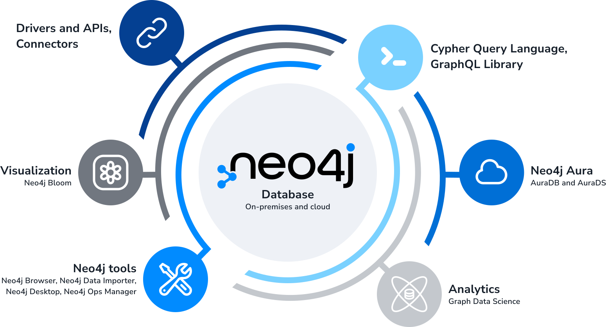
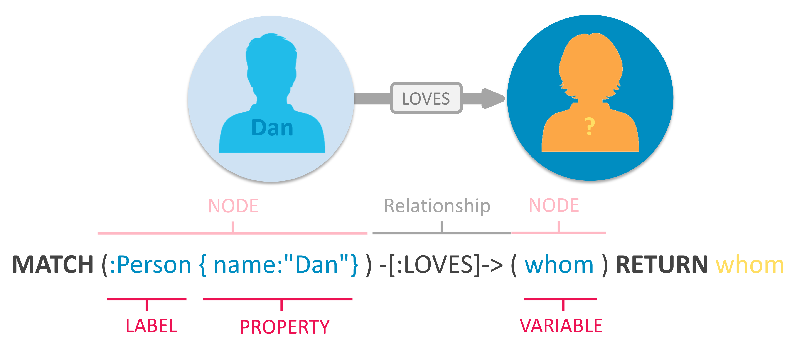

<div dir="rtl">

# دیتابیس‌های گرافی

دیتابیس‌های گرافی همانطور که از نام‌ آن‌ها مشخص است داده‌ها را بر اساس اصول ریاضی نظریه گراف ذخیره می‌کنند، اساسا ما
می‌توانیم گراف را به صورت مجموعه‌ای از راس‌ها و یال‌ها در نظر بگیریم. راس‌ها معمولا موجودیت‌ها و یال‌ها معمولا روابط بین
آن‌ها را نشان می‌دهند. یکی از ویژگی‌ها متمایز دیتابیس‌ها گرافی این است که علاوه بر اینکه راس‌ها می‌توانند موجودیت‌ها و
اطلاعات آن‌ها را نگه دارند یا‌ل‌ها نیز می‌توانند همین کار را در قبال روابط انجام دهند.
دیتابیس‌های گرافی در گروه دیتابیس‌های `NoSql` قرار می‌گیرند.

در دیتابیس‌های گرافی در هر راس به راس‌های متصل به آن نیز دسترسی داریم (توسط یال بین آن دو)، در نتیجه این دیتابیس‌ها به
شدت برای بازیابی داده‌های به هم پیوسته سریع و کارآمد هستند.
در یک دیتابیس غیرگرافی (اعم از `Sql` و `NoSql`) پس از پیدا کردن رابطه بین دو داده (که در دیتابیس گرافی می‌تواند یک راس
باشد) برای بازیابی آن داده دوباره باید در `index` دیتابیس سرچ کنیم تا به داده دسترسی پیدا کنیم.

نمودار زیر کارایی (سرعت بازیابی) یک کوئری در یک ساختار داده‌ای گرافی را در یک دیتابیس گرافی (`Neo4j`) با دیتابیس‌های
غیرگرافی مقایسه کرده است.
[منبع](https://neo4j.com/blog/secret-sauce-neo4j-modeling-graphconnect)


به عنوان مثال به داده ساختار زیر دقت کنید:


حال که داده‌ها و روابط خود را مدل‌سازی کرده‌ایم می‌توانیم انواع کوئری‌هایی را که برای استخراج اطلاعات از گراف استفاده
می‌شوند را ملاحظه کنیم.

توجه‌ کنید که کوئری‌های بسیار پیچیده‌تری از مثلا یافتن همه کارگردانان یا یافتن فیلم‌های یک کارگردان قابل ران‌کردن هستند،
به عنوان مثال، ما می‌توانیم خیلی سریع تمام فیلم‌های کارگردانی جوزف و آنتونی روسو را با حضور رابرت داونی جونیور در نقش
مرد آهنی پیدا کنیم.

در ادامه دیتابیس `Neo4j` را به عنوان یک نمونه از دیتابیس‌های گرافی بررسی می‌کنیم.

# Neo4j



دیتابیس `Neo4j` یک دیتابس گرافی پیشرو است که امکانات از قبیل تراکنش‌های ACID و ذخیره و پردازش‌ داده‌ها در قالب گراف را
ارائه می‌دهد.
این دیتابیس توسط Neo4j, Inc به صورت open-source توسعه داده شده است. البته ورژن‌های غیر open-source آن نیز برای خریداری
موجود است. اولین release این دیتابیس در سال ۲۰۰۷ بوده است.

داده‌ساختار این دیتابیس یک گراف متشکل از راس و یال و attributeهای مربوط به آن‌ها است.
همچنین راس‌ها و یال‌ها می‌توانند `Label` داشته‌باشند که به سرچ بهینه‌تر کمک می‌کند. همچنین این دیتابیس از ورژن ۲ به بعد
از `Index` پشتیبانی می‌کند.

## کوئری در Neo4j

`Neo4j` از زبان `Cypher` برای کوئری در گراف استفاده می‌کند. (متناظر `SQL` برای دیتابیس جدولی)
فرمت کلی کوئری‌ها در این زبان مطابق تصویر زیر است:



همان‌طور که می‌بینید در سینتکس این زبان برای نشان دادن یک راس از پرانتز `(nodes)` و برای یال‌ها از براکت و
فلش `-[:ARROWS]->` استفاده می‌شود:

<div dir="ltr">

(nodes)-[:ARE_CONNECTED_TO]->(otherNodes)

</div>

در این زبان خواسته‌ها به شکل توصیفی در این قالب به کمک راس‌ها و یال‌ها و ارتباط میان آن‌ها نوشته می‌شود.
می‌توان به راس‌ها یک `Label` اختصاص داد تا نوع راس (مشابه اسم یک جدول) مشخص شود.
همچنین یال‌ها نیز می‌توانند یک `Label` داشته باشند تا توع ارتباط میان راس‌ها (مانند ارتباط دوستی یا دنبال‌کنندگی) توسط
آن مشخص شود.

حال به بررسی چند نوع کوئری در این زبان می‌پردازیم.

### CREATE

از این دستور برای ساخت راس و یال استفاده می‌شود:

<div dir="ltr">

    For Nodes:
    CREATE (NodeName:NodeLabel {key:value for key, value in NodeAttributes})

    For Edges:
    CREATE (NodeName)-[:EdgeLabel {key:value for key, value in EdgeAttributes}]->(OtherNodeName)

</div>

همانطور که دیدیم هر راس و یال یک `Label` و یک آبجکت جیسان‌مانند برای `attribute`های خود دارد.

### MATCH

این دستور برای پیدا کردن پترن‌های مشخص در گراف استفاده می‌شود. همچنین از `RETURN` برای گرفتن نتیجه آن استفاده می‌شود.

<div dir="ltr">

    MATCH (keanu:Person {name:'Keanu Reeves'})
    RETURN keanu.name AS name, keanu.born AS born
    LIMIT 5

</div>

برای مثال در کوئری بالا راس‌هایی با `Label=Person` که نام کیانو ریوز دارند پیدا می‌شوند. سپس نام و سال تولد آن‌ها
برگردانده می‌شود.
همچنین تعداد نتایج به ۵ تا محدود شده است.

برای پیدا کردن ارتباط میان راس‌ها نیز از همین دستور استفاده می‌شود.

<div dir="ltr">

    MATCH (p:Person {name:'Tom Hanks'})--{1,4}(colleagues:Person)
    RETURN DISTINCT colleagues.name AS name, colleagues.born AS bornIn
    ORDER BY bornIn, name
    LIMIT 5

</div>

کوئری بالا با استفاده از `--{1,4}` فاصله ۱ تا ۴ راس از راس ابتدایی (`p`) را مشخص کرده است.
پس این کوئری راس‌هایی که با راس تام هنکس فاصله ۱ تا ۴ دارند را پیدا می‌کند.
سپس نتایج غیرتکراری را انتخاب می‌کند. آن‌ها را مرتب می‌کند و در انتها ۵ تای اول را باز می‌گرداند.

## راه‌اندازی Neo4j در داکر

به کمک دستورات زیر می‌توان این دیتابیس را در یک کانتینر داکر اجرا کرد:
</div>

```shell
docker run \
    --restart always \
    --publish=7474:7474 --publish=7687:7687 \
    --env NEO4J_AUTH=neo4j/your_password \
    neo4j:5.16.0
```

<div dir="rtl">

[این صفحه](https://neo4j.com/docs/operations-manual/current/docker/introduction/#_useful_docker_run_options)
را برای تنظیمات بیشتر و متغیرهای محلی ببینید.

## بررسی یک مثال در Neo4j

### لود کردن دیتای اولیه

در گام اول باید گراف خود را بسازیم، برای این کار چند راه وجود دارد، راه اول لودکردن فایل است، با اجرای دستورات زیر
می‌توان گراف را از روی یک فایل csv لود کرد:

<div dir="ltr">

    LOAD CSV WITH HEADERS FROM "https://raw.githubusercontent.com/TheMagoo73/neo4j-mcu/master/people.csv" AS line
    CREATE (person:Person {id: toInteger(line.person_id), name: line.name})

    LOAD CSV WITH HEADERS FROM "https://raw.githubusercontent.com/TheMagoo73/neo4j-mcu/master/movies.csv" AS line 
    CREATE(movie:Movie {id: toInteger(line.movie_id), name: line.name, budget: toInteger(line.budget)})

    LOAD CSV WITH HEADERS FROM "https://raw.githubusercontent.com/TheMagoo73/neo4j-mcu/master/directed.csv" AS line
    MATCH (person:Person {id: toInteger(line.person_id)}), (movie:Movie {id: toInteger(line.movie_id)})
    CREATE (person)-[:Directed]->(movie)

    LOAD CSV WITH HEADERS FROM "https://raw.githubusercontent.com/TheMagoo73/neo4j-mcu/master/acted_in.csv" AS line
    MATCH (person:Person {id: toInteger(line.person_id)}), (movie:Movie {id: toInteger(line.movie_id)})
    CREATE (person)-[:ActedIn]->(movie)

    MATCH (n)
    WHERE n:Person OR n:Movie
    REMOVE n.id

</div>

در دستورات بالا ابتدا ما راس‌ها را برای اشخاص و فیلم‌ها بر اساس فایل‌های csv هر نوع می‌سازیم، سپس csvهایی را لود می‌کنیم
که روابط را تعریف می‌کنند و با تطبیق با راس‌ها روابط را ایجاد می‌کنیم.

نهایتا از آنجایی که فیلد ```id``` تنها برای ایجاد روابط از فایل‌های غیررابطه‌ای مورد نیاز بود آن را حذف می‌کنیم، این امر
نیز یکی از ویژگی‌های کلیدی دیتابیس‌های گرافی است که در آن‌ها نیازی به نگرانی درباره آیدی‌های برای ایجاد foreign keyها
نداریم.

حالا که داده‌های اولیه خود را در اختیار داریم می‌توانیم عملیات‌های مختلفی را روی آن‌ها اجرا کنیم.

### اضافه کردن دیتا با کوئری

در ابتدا می‌توانیم دستور زیر را برای ایجاد اولین کاراکتر اجرا کنیم:

<div dir="ltr">

    CREATE (character:Character {name: "iron man"})

</div>

سپس با ایجاد چند رابطه آن را به گراف متصل می‌کنیم:

<div dir="ltr">

    MATCH (person:Person {name: "robert downey jnr"}), (character:Character {name: "iron man"}) CREATE (person)-[:played]->(character)

    MATCH (character:Character {name: "iron man"}), (movie:Movie {name: "avengers endgame"}) CREATE (character)-[:appeared_in]->(movie)

</div>

حال می‌توان از مرورگر built-in دیتابیس برای کوئری زدن و مشاهده گراف استفاده کرد:


### اجرای چند کوئری بازیابی

حال که گراف ما ساخته شده است چند کوئری را که می‌توان برای کاوش در آن استفاده کرد را ملاحظه می‌کنیم، این کوئری‌ها را
می‌توان در مرورگر دیتابیس ران کرد و تاثیرات آن بر روی گراف را مستقیما دید.

در گام اول بیایید ببینیم درباره فیلم Avengers Endgame چه اطلاعاتی می‌توانیم کسب کنیم:

<div dir="ltr">

    MATCH (m:Movie {name: "avengers endgame"}) RETURN m

</div>

این دستور تمام راس‌های گراف را که فیلد ```Movie``` دارند و مقدار آن ```avengers endgame``` است را برمی‌گرداند، در
دیتابیس‌های رابطه‌ای این امر نیازمند چنین کوئری‌ای است: ```SELECT * FROM t WHERE x = y```

در مرحله بعدی یک کوئری پیچیده‌تر را اجرا می‌کنیم، بیایید تمام فیلم های کارگردانی شده توسط Joseph Russo را بیابیم:

<div dir="ltr">

    MATCH m=(p:Person {name: “joseph russo"})-[r:Directed]->() RETURN m

</div>

این کوئری هر دو فیلم Captain America Winter Soldier و Avengers Engame را برمیگرداند، در اینجا هم می‌توانیم این را در یک
دیتابیس رابطه‌ای با استفاده از سه جدول با foreign keyها پیاده‌سازی کنیم و سپس برای یافتن اشتراک‌ آن‌ها از
دستور  ```SELECT``` استفاده کنیم. با این وجود این نوع کوئری‌ها جایی هستند که دیتابیس‌های گرافی عملکرد بهتری دارند

</div>