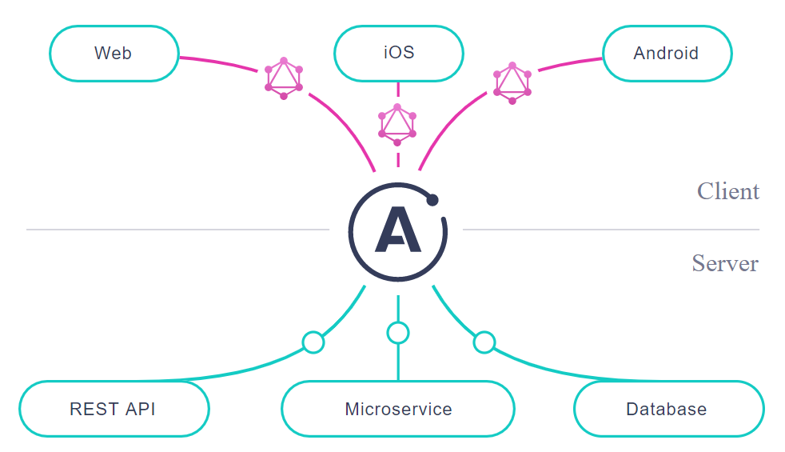
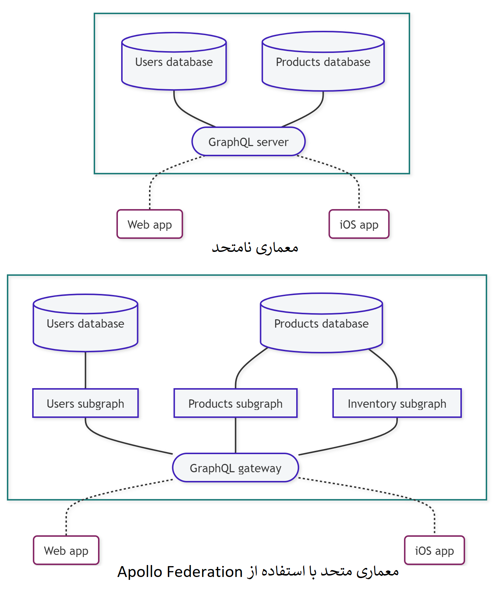

# The Apollo Graph Platform

در این بخش با زیرساخت Apollo آشنا می‌شویم.

## Unified Graph

قبل از هر چیزی باید تعریف unified graph را ذکر کنیم:
 

زیرساخت Apollo به شما این امکان را می دهد که یک unified graph را بسازید، ازش query بگیرید و در کل مدیریتش کنید. 
 
درواقع unified graph یک لایه‌ای از داده‌ها است که کمک می‌کند برنامه‌ها با داده تعامل داشته باشند. (داده‌هایی از محموعه داده‌های متصل به پایگاه‌های داده و APIهای خارجی)
 
گراف شما بین کاربرهای برنامه و سرویس‌های بک-اند قرار می‌گیرد و جریان داده را بین آنها تسهیل می‌کند.
 
 
یک گراف Apollo از GraphQl برای تعریف کردن و اجرا کردن ساختمان این جریان داده استفاده می‌شود.

## Building Steps

### Build graph with Apollo Server

گراف شما به سرویسی برای پردازش عملیات‌های GraphQl از کاربرهای برنامه دارد. این سرویس با پایگاه داده‌های بک-اندمان ارتباط برقرار می‌کند تا داده‌ها را برحسب نیاز واکشش(fetch) و اصلاح کند. برای ساختن این سرویس می توان از <a href="https://www.apollographql.com/docs/apollo-server/">Apollo Server</a> کمک گرفت.

#### Apollo Server

Apollo Server یک سرور open-source و گسترش‌پذیز بر پایه javascript GraphQl است. با استفاده از آن شما می‌توانید:
<ol dir="rtl" style="position:right;">
<li>یک شمای GraphQl تعریف کنید که تمام نوع و مقادیر قابل دسترس در گرافتان را شامل شود.</li>
<li>مجموعه‌ای از resolverها تعریف کنید که مشخص می‌کند چگونه مقادیر شمایتان را با داده‌های بک-اندتان پر کنید.</li>

(resolver یک مجموعه از تابع‌ها است که بای queryهای GraphQl پاسخ تولید می‌کند.)

</ol>

#### Build incrementally

از خوبی‌های دیگر این روش این است که گراف شما لازم نیست به همه اطلاعات بک-اند از همان اول وصل شود یا همه درخواست‌های کاربرتان را انجام دهد. زیرساخت گرافی Apollo به صورت تکی تکی آپدیت می‌شود.

در طول زمان که مقدار بیشتری از داده‌ها وصل می‌شود و شما گسترش می‌یابد، سرور Apollo می‌تواند داده‌ها و درخواست‌های بیشتری را مدیریت کند.

#### Make the jump to federation

همینطور که سایز و پیچیدگی گراف افزایش می‌یابد شما می‌توانید از افزونه‌های سرور Apollo استفاده کنید تا گرافتان را متحد(federate) کنید.

در یک معماری متحد شده، API گراف شما در سرویس‌های متعددی اجرا می‌شود و دیگر با یک سرور نیست. در این معماری هر سرویس برای خودش یک شمای GraphQl دارد که این شماها با هم ترکیب می‌شوند و کارها را به صورت cross-platform بین سرویس‌های مختلف انجام می‌دهند.

### Query the graph with Apollo Client

بعد ازین که نسخه اولیه گراف شما فرستاده می‌شود، کاربرهای برنامه می‌توانند به آن query دهند. برای اجرای این queryها می‌توانید از <a href="https://www.apollographql.com/docs/react/">Apollo Clinet</a> استفاده کنید.

#### Apollo Cient

Apollo Client یک کاربر javaScript GraphQl دارای قابلیت customization است. Apollo Client به توسعه‌دهنده‌ها این امکان را می‌دهد که queryهایشان را  در UI مورد استفاده‌شان تعریف کنن و از آنها استفاده کنند. 

### Apollo Federation

همانطور که پیش‌تر گفته شد با این افزونه شما می‌توانید کارهایتان را در سرویس‌های GraphQl مختلفی تقسیم کنید. این کار را استفاده از یک معماری متحد (federate) می‌نامند. خود Apollo یک معماری متحد شده به نام <a href="https://www.apollographql.com/docs/federation/">Apollo Federation</a> برای این کار تعریف کرده است.

 

## resources

> https://www.apollographql.com/docs/intro/platform/
