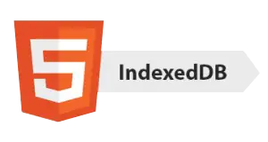

<div dir="rtl">

# معرفی
دیتابیس IndexedDB در واقع یک دیتابیس است که داده‌های را در مرورگر کاربر ذخیره می‌کند و قدرت بیشتری نسبت به ```Local Storage``` دارد، از این رو برای برنامه‌هایی که نیاز به ذخیره حجم بالایی از داده‌ها دارند مناسب‌تر است و چنین برنامه‌هایی با استفاده از «IndexedDB» می‌توانند کارایی بیشتری داشته و سریع‌تر بارگزاری شوند.


# بازکردن دیتابیس
برای شروع به کار با IndexedDB از دستور ```open``` برای اتصال به دیتابیس استفاده می‌کنیم:
<div dir="ltr">

    let openRequest = indexedDB.open(name, version);

</div>

- ```name```: نام دیتابیس، باید رشته باشد.
- ```version```: یک عدد صحیح مثبت که به صورت پیش‌فرض «۱» است (توضیحات تکمیلی پایین‌تر داده شده)

&nbsp;


دستور فوق یک آبجکت ```openRequest``` برمی‌گرداند و ما باید روی آن به ایونت‌ها گوش دهیم:

- ```success```: ساخت‌دیتابیس موفق بوده

در این حالت باید از آبجکت که از دستور زیر به دست می‌آید برای کال‌های بعدی استفاده کنیم:
<div dir="ltr">

    let db = openRequest.result

</div>

- ```error```: بازکردن دیتابیس موفقیت آمیز نبود

- ```upgradeneeded```: دیتابیس آماده است اما نسخه‌ای که استفاده می‌شود  قدیمی است (توضیحات زیر را ببنید)

**دیتابیس IndexedDB دارای مکانیسمی برای نسخه‌بندی ```schema```هاست که در دیتابیس‌های رایج سمت سرور مشابه آن وجود ندارد.**

بر خلاف دیتابیس‌های رایج، IndexedDB یک دیتابیس سمت کلاینت است، در حالی که دیتا در سرور ذخیره شده است، از این رو دسترسی همیشگی به آن وجود ندارد، در نتیجه هنگامی که اطلاعات در سرور به‌روز شده‌اند و کاربر از صفحه وب دیدن می‌کند ممکن است نیاز به آپدیت‌کردن دیتابیس باشد.

اگر نسخه لوکال دیتابیس عقب‌تر از نسخه‌ای که هنگام اجرای دستور ```open``` باشد، آنگاه نتیجه دستور ```upgradeneeded``` خواهد بود و ما می‌توانیم با مقایسه‌کردن نسخه‌ها دیتابیس را آپدیت کنیم.

ایونت ```upgradeneeded``` همچنین هنگامی که دیتابیس وجود ندارد (نسخه ۰ است) هم رخ می‌دهد و در این صورت ما به مقداردهی اولیه (‍‍initialization) نیاز داریم.

برای مثال بیایید یکبار فرایند را با هم طی کنیم:

در ابتدا یعنی هنگام انتشار نسخه اول برنامه‌، دیتابیسی با ورژن "1" باز می‌کنیم و به صورت زیر initialization را در ‍‍‍‍‍```upgradeneeded``` handler انجام می‌دهیم.

<div dir="ltr">

    let openRequest = indexedDB.open("store", 1);

    openRequest.onupgradeneeded = function() {
    // در صورتی که کاربر برای اولین بار وارد برنامه (یا در واقع همان سایت) ما شود این متد فراخوانی میشود.
    // ...perform initialization...
    };

    openRequest.onerror = function() {
    console.error("Error", openRequest.error);
    };

    openRequest.onsuccess = function() {
    let db = openRequest.result;
    // حالا با استفاده از آبجکت db هر کار دیگری که نیاز باشد را در اینجا انجام می‌دهیم.
    };

</div>‍‍‍

حال فرض کنید زمان انتشار نسخه بعدی برنامه ما رسیده و در آن نسخه میخواستیم تغییراتی در ساختار object store بدهیم.
میتوانیم دیتابیس را با ورژن "2" باز کنیم و تغییرات مد نظر را اعمال کنیم:

<div dir="ltr">

    let openRequest = indexedDB.open("store", 2);

    openRequest.onupgradeneeded = function(event) {
        // the existing database version is less than 2 (or it doesn't exist)
        let db = openRequest.result;
        switch(event.oldVersion) { // ورژن فعلی دیتابیس (قبل از آپدیت)
            case 0:
            // به این معنی است که برای این کلاینت تا الان هیچ دیتابیسی ساخته نشده.
            // perform initialization
            case 1:
            // یعنی حالتی که کلاینت از ورژن قبلی استفاده میکرده
            // update
        }
    };

</div>

# ذخیره‌سازی اطلاعات
برای ذخیره‌سازی داده‌ها در IndexedDB از «Object Store» استفاده می‌کنیم.

مفهوم «Object Store» مفهومی کلیدی در IndexedDB است که تقریبا مشابه آن چیزی است که در سایر دیتابیس‌ها «Table» یا «Collection» نامیده می‌شود،در واقع این جایی است که داده‌ها ذخیره می‌شوند، واضحا یک دیتابیس می‌تواند Object Storeهای مختلفی داشته باشد، یکی برای کاربران، یکی برای کالاها و ...

همچنین توجه کنید که داده‌های Primitive هم می‌توانند در Object Store ذخیره شوند.

ما تقریبا می‌توانیم هر گونه داده‌ای (حتی آبجکت‌های پیچیده) را در دیتابیس ذخیره کنیم، با این حال آبجکت‌های دارای ریفرنس حلقوی یا آبجکت‌هایی که نمی‌توان آن‌ها را با ```JSON.stringify``` ذخیره کرد در IndexedDB قابل ذخیره‌سازی نیستند.

**ما باید برای هر داده یک ```key``` یکتا تعیین کنیم**

یک ```key``` می‌تواند یکی از انواع داده‌های زیر باشد: number، date، string، binary یا array. واضحا با توجه به اینکه ```key```ها یکتا هستند عملیات‌های سرچ، حذف و آپدیت با استفاده از آن‌ها امکان‌پذیر است.

حال پس از توضیحات بالا، یک Object Store می‌سازیم:

<div dir="ltr">

    db.createObjectStore(name[, keyOptions]);

</div>

- name: نام استوری که می‌خواهیم داده‌ها در آن ذخیره شوند
- keyOptions: اختیاری، یکی از دو پارامتر زیر را دارد:
1) keyPath: آن پروپرتی‌ای از آبجکت که به عنوان کلید استفاده می‌شود
2) autoIncrement: اگر مقدار آن درست باشد کلید‌ها به صورت اتوماتیک و افزاینده به داده‌ها اختصاص می‌یابند

به عنوان مثال به دستور زیر دقت کنید:

<div dir="ltr">

    db.createObjectStore('books', {keyPath: 'id'});

</div>

دقت شود که ساختن یا تغییردادن ساختار Object Store تنها هنگام آپدیت‌کردن نسخه (رجوع‌ شود به توضیحات ```upgradeneeded```) دیتابیس ممکن است.

# تراکنش‌ها

مفهوم «تراکنش» (Transaction) مفهوم رایجی است که در بسیاری از دیتابیس‌ها استفاده می‌شود، در دیتابیس IndexedDB هم خاصیت‌های رایج Transaction از قبیل Atomic بودن (به این معنی که یا همه تراکنش انجام می‌شود یا نمی‌شود) برقرار است.

برای آغازکردن Transaction از دستور زیر استفاده می‌کنیم:

<div dir="ltr">

    db.transaction(store[, type]);

</div>

- ```store```: نام استوری که تراکنش به آن دسترسی یافته و عملیات را روی آن انجام می‌دهد، می‌تواند به صورت آرایه‌ای از استورها باشد که در این صورت عملیات روی چند استور انجام خواهد شد

- ```type```: نوع تراکنش، می‌تواند یکی از دو مقدار زیر را داشته باشد
1) ‍‍```readonly```: فقط بتواند بخواند، حالت پیش‌فرض
2) ‍‍‍```readwrite```: می‌تواند داده‌ها را بخواند و بنویسد، توجه کنید که توانایی ساختن، حذف‌کردن و آپدیت‌کردن استورها را ندارد

جز دو نوع بالا، نوع دیگری از تراکنش به نام ```versionchange``` وجود دارد که می‌تواند هرکاری انجام دهد، اما ما نمی‌توانیم آن را به صورت دستی بسازیم، IndexedDB به صورت اتوماتیک هنگام بازکردن دیتابیس یک تراکنش از این نوع برای ```upgradeneeded``` هندلر می‌سازد، به همین دلیل است که تنها راه تغییر ساختار دیتابیس و ساخت و حذف استورها استفاده از ```upgradeneeded``` هندلر است.

پس از ساختن تراکنش، ما می‌توانیم به استور به صورت زیر آبجکت اضافه کنیم:

<div dir="ltr">

    let transaction = db.transaction("books", "readwrite");


    let books = transaction.objectStore("books");

    let book = {
        id: 'js',
        price: 10,
        created: new Date()
    };

    let request = books.add(book); // (3)

    request.onsuccess = function() { // (4)
        console.log("Book added to the store", request.result);
    };

    request.onerror = function() {
        console.log("Error", request.error);
    };

</div>

در کد بالا چهار قدم زیر را برداشتیم:

1) ساخت یک تراکنش با اشاره‌کردن به تمام استور‌هایی که می‌تواند به آنان دسترسی داشته باشد

2) گرفتن استور آبجکت

3) ایجاد ریکوئست
4) هندل‌کردن نتیجه ریکوئست

آبجکت استور از دو متد برای ذخیره کردن یک مقدار (value) پشتیبانی می‌کند:

- ```put(value, [key])```: مقدار را به استور اضافه می‌کند، کلید تنها زمانی باید در پارامترهای متد بیاید که یکی از روش‌های انتخاب کردن یکی از پروپرتی‌های آبجکت یا تخصیص خودکار برای تعیین کلید انتخاب نشده باشد

- ```add(value, [key])```: مشابه روش قبلی، اما اگر مقداری با کلید مشابه وجود داشته باشد ریکوئست فیل می‌شود و اروری با نام زیر تولید می‌شود

```ConstraintError```

مشابه بازکردن دیتابیس، اینجا هم می‌توان ریکوئست ```books.add(book)``` را فرستاد و منتظر نتیجه (ایونت‌های ```success/error```) ماند.

نتیجه ```request.result``` برای ```add``` کلید آبجکت جدید است، ارور هم اگر وجود داشته باشد با ```request.error``` قابل دسترسی است.


### اتمام تراکنش
همانطور که در بالا اشاره شد، اگر درخواست های متعددی در یک تراکنش وجود داشته باشد، یا همه‌ی آن ها باید با موفقیت انجام شوند یا هیچکدام. پس سوالی که به وجود می‌آید این است که چگونه می‌توان تمام شدن یک تراکنش را اعلام کرد؟ (به این معنی که درخواست دیگری در آن تراکنش نخواهیم داشت.)
پاسخ این است که در واقع اینکار به صورت ‌اتوماتیک انجام می‌شود و برنامه‌نویس نباید دستور خاصی را برای آن استفاده کند.

در واقع معمولا میتوانیم فرض کنیم که یک تراکنش وقتی که همه‌ی درخواست هایش تکمیل شوند و کد فعلی به اتمام برسد، تمام می‌شود.

البته لازم به ذکر است که در نسخه سوم indexedDB، متدی به نام commit() اضافه شده است و ورژن های جدید تر مرورگر ها از آن پشتیبانی می‌کنند. البته که همچنان در کاربرد های معمول نیازی به استفاده از آن نخواهد بود.


# هندل‌کردن ارورها

ریکوئست‌ها ممکن است به دلایل مختلفی از قبیل بد نوشته‌شدن، کمبود حافظه و ... فیل شوند و باید برای هندل‌کردن این موارد آمادگی داشته باشیم.

هنگامی که ریکوئست فیل می‌شود، به صورت خودکار تراکنش کنسل شده و با توجه به خاصیت atomic بودن تمامی تغییراتی که بر اثر آن اعمال شده به حالت اول بازمی‌گردد.

در بعضی مواقع ممکن است قصد داشته باشیم که هنگام فیل‌شدن کارهایی انجام دهیم (مثلا یک ریکوئست دیگر بدهیم) و تغییرات فعلی انجام شده و تراکنش را کنسل نکنیم. این امر با استفاده از ```request.onerror``` ممکن است. این هندلر می‌تواند از کنسل شدن تراکنش به وسیله ```event.preventDefault()``` جلوگیری کند.

در مثال زیر کتابی ادشده که کلیدی (کلید اینجا همان ```id``` است که بالاتر خودمان تعیین کردیم) مشابه یک کتاب دیگر دارد. متد ```store.add``` اینجا یک ارور از جنس ```ConstraintError``` تولید می‌کند که ما آن را به شیوه زیر بدون کنسل کردن تراکنش هندل می‌کنیم:

<div dir="ltr">

    let transaction = db.transaction("books", "readwrite");

    let book = { id: 'js', price: 10 };

    let request = transaction.objectStore("books").add(book);

    request.onerror = function(event) {
        if (request.error.name == "ConstraintError") {
        console.log("Book with such id already exists"); // handle the error
        event.preventDefault(); // don't abort the transaction
        } else {
        // unexpected error, can't handle it
        // the transaction will abort
        }
    };

    transaction.onabort = function() {
        console.log("Error", transaction.error);
    };

</div>

# Event delegation
به جای مشخص کردن متد های onerror و onsuccess ازای هر درخواست، میتوانیم از پترن event delegation استفاده کنیم. 

ایونت ها در indexedDB به این ترتیب انتشار می‌یابند (bubbling):

request → transaction → database

لذا میتوانیم تمام پروسه ارور هندلینگ را به متد onerror خود آبجکت db واگزار کنیم:

<div dir="ltr">

    db.onerror = function(event) {
        let request = event.target; // the request that caused the error

        console.log("Error", request.error);
    };

</div>

اما درصورتی که ایونت ارور تا قبل از رسیدن به آبجکت db به طور کامل هندل شده بود چطور؟

میتوانیم با استفاده از event.stopPropagation() در request.onerror جلوی انتشار ایونت به سطوح بالاتر را بگیریم.

<div dir="ltr">

    request.onerror = function(event) {
        if (request.error.name == "ConstraintError") {
            console.log("Book with such id already exists"); // handle the error
            event.preventDefault(); // don't abort the transaction
            event.stopPropagation(); // don't bubble error up, "chew" it
        } else {
            // do nothing
            // transaction will be aborted
            // we can take care of error in transaction.onabort
        }
    };

</div>

# جستجو

برای جستجو در Object Store دو روش اصلی وجود دارد:

- By Key: می‌تواند مقدار کلید یا یک رنج از کلیدها باشد

- By field: با استفاده از سایر فیلدها آبجکت، این روش به اطلاعات اضافی‌ای به نام ایندکس نیاز دارد


#### **بر اساس کلید:**

این روش جستجو از هر دو متد «جستجو بر اساس مقدار دقیق کلید» و «جستجو بر اساس بازه کلید» پشتیبانی می‌کند، در حالت دوم از آبجکت‌های ```IDBKeyRange``` که یک محدوده کلید قابل‌قبول را مشخص می‌کنند استفاده می‌کنیم.

<br/>

آبجکت‌های ```IDBKeyRange``` با روش‌های زیر ساخته می‌شوند:

- ```IDBKeyRange.lowerBound(lower, [open])```: ‍‍‍```≥lower``` (or ```>lower``` if ```open``` is true)

- ```IDBKeyRange.upperBound(upper, [open])```: ```≤upper``` (or ```<upper``` if ```open``` is true)

- ```IDBKeyRange.bound(lower, upper, [lowerOpen], [upperOpen])```: between ```lower``` and ```upper```. اگر مقدار فلاگ‌ها درست باشد شرایطی مشابه موارد بالا در ابتدا و انتهای بازه برقرار می‌شود.

- ```IDBKeyRange.only(key)```: بازه‌ای که تنها از یک کلید تشکیل می‌شود، به ندرت استفاده می‌شود

<br/>

برای سرچ کردن از روش‌های زیر استفاده می‌کنیم، هرکدام از آنان یک آرگومان ```query``` به عنوان ورودی می‌گیرد که می‌تواند exact key یا key range باشد:

- ```store.get(query)```: برای اولین داده بر اساس کوئری داده شده جستجو می‌کند

- ```store.getAll([query], [count])```: تمام مقادیر را بر اساس کوئری داده شده جستجو میکند، تعداد می‌تواند با پارامتر دوم محدود شود

- ```store.getKey(query)```: برای اولین کلیدی که در کوئری صدق کند جستجو می‌کند، معمولا برای باز‌ها استفاده می‌شود

- ```store.getAllKeys([query], [count])```: برای همه کلید‌هایی که در کوئری صدق کنند جستجو می‌کند، تعداد می‌تواند با پارامتر دوم محدود شود، معمولا برای بازه‌ها استفاده می‌شود

- ```store.count([query])```: تعداد کلید‌هایی که در کوئری صدق می‌کنند را می‌دهد، معمولا برای بازه‌ها انتخاب می‌شود

به عنوان مثال به کدهای زیر دقت کنید: (توجه کنید که برای کتاب‌ها ```id``` کلید بود)

<div dir="ltr">

    // get one book
    books.get('js')

    // get books with 'css' <= id <= 'html'
    books.getAll(IDBKeyRange.bound('css', 'html'))

    // get books with id < 'html'
    books.getAll(IDBKeyRange.upperBound('html', true))

    // get all books
    books.getAll()

    // get all keys, where id > 'js'
    books.getAllKeys(IDBKeyRange.lowerBound('js', true))

</div>

<br/>

#### **بر اساس فیلد با استفاده از Index:**

برای جستجو بر اساس سایر فیلدها نیاز به ساخت داده‌ساختار اضافه‌ای به نام «Index» داریم.

ایندکس در واقع افزونه‌ای به Object Store است که فیلد داده شده را ردیابی می‌کند، برای هر مقدار آن فیلد Index لیستی از کلیدهای آبجکت‌هایی که آن مقدار را دارند ذخیره می‌کند.

نحوه استفاده از ایندکس به صورت زیر است:

<div dir="ltr">

    objectStore.createIndex(name, keyPath, [options]);

</div>

- ```name```: نام ایندکس
- ```keyPath```: فیلدی که می‌خواهیم بر اساس آن سرچ کنیم
- ```option```: توضیحات در زیر

آرگومان Option یک آبجکت اختیاری است که می‌تواند پروپرتی‌های زیر را داشته باشد:

یک) ```unique```: اگر مقدارش ```true``` باشد، باید تنها یک آبجکت در Object Store با مقدار مشخص شده برای فیلد وجود داشته باشد

دو) ```multiEntry```: تنها در صورتی قابل استفاده است که مقدار ```keyPath``` آرایه باشد، در این صورت به طور پیش‌فرض تمام آرایه به عنوان کلید در نظر گرفته می‌شود، اما اگر مقدار ```multiEntry``` درست باشد ایندکس لیست آبجکت‌ها برای هر کلید داخل آرایه را نگه می‌دارد.

در مثال زیر کلید مشابه مثال‌های قبل ```id``` است و می‌خواهیم بر اساس ```price``` جستجو کنیم.

ابتدا باید Index را بسازیم، این کار باید همانند ساخت Object Store در ```upgradeneeded``` انجام شود:

<div dir="ltr">

    openRequest.onupgradeneeded = function() {
        let books = db.createObjectStore('books', {keyPath: 'id'});
        let index = books.createIndex('price_idx', 'price');
    };

</div>

- در مثال بالا ما فیلد ```price``` را ردیابی می‌کنیم

- این فیلد یونیک نیست در نتیجه آپشن ```unique``` را ست نمی‌کنیم

- فیلد ```price``` آرایه نبوده و در نتیجه ```multiEntry``` قابل اعمال نیست

همانطور که گفته شد Index برای هر مقدار از ```price``` لیست آبجکت‌هایی که آن مقدار ```price``` را دارند نگه می‌دارد.

دقت شود که Index به صورت اتوماتیک خودش را به‌روز نگه می‌دارد و نیازی به به‌روزسازی دستی آن نیست.

حال برای جستجوی یک ```price``` خاص همان متدهای قبلی را روی Index اعمال می‌کنیم:

<div dir="ltr">

    let transaction = db.transaction("books");
    let books = transaction.objectStore("books");
    let priceIndex = books.index("price_idx");

    let request = priceIndex.getAll(10);

    request.onsuccess = function() {
        if (request.result !== undefined) {
            console.log("Books", request.result); // array of books with price=10
        } else {
            console.log("No such books");
        }
    };

</div>

همچنین می‌توان از ```IDBKeyRange``` برای ساختن بازه قیمتی استفاده کرد:

<div dir="ltr">

    let request = priceIndex.getAll(IDBKeyRange.upperBound(5));

</div>

توجه کنید که Indexها به صورت خودکار بر اساس فیلد مربوطه sort می‌شوند زین‌رو نتایج دریافتی ما هم sortشده خواهند بود.

# حذف‌کردن

متد ```delete``` یک کوئری را به عنوان ورودی می‌گیرد و بر اساس آن آبجکت‌ یا آبجکت‌های مربوطه را حذف می‌کند، نحوه فراخوانی این متد مشابه ```getAll``` می‌باشد.

به عنوان مثال:

<div dir="ltr">

    // delete the book with id='js'
    books.delete('js');

</div>

اگر بخواهیم کتاب‌ها را بر اساس قیمت (```price```) یا هر فیلد دیگری حذف نماییم باید ابتدا کلید مربوطه را در index بیابیم سپس متد ```delete``` را فراخوانی کنیم:

<div dir="ltr">

    // find the key where price = 5
    let request = priceIndex.getKey(5);

    request.onsuccess = function() {
        let id = request.result;
        let deleteRequest = books.delete(id);
    };

</div>

برای پاک‌کردن تمام آبجکت‌ها از متد ```clear``` استفاده می‌شود:

<div dir="ltr">

    books.clear(); // clear the storage.

</div>

# نشانگرها (Cursors)

متدهایی مانند ```getAll/getAllKeys``` آرایه‌ای از keys/valueها را برمی‌گردانند، اما یک Object Store می‌تواند بسیار بزرگ باشد و بزرگتر از حافظه در دسترس باشند، از این رو این متدها فیل خواهند شد.

راه‌حل این مشکل استفاده از «نشانگر» هاست.

**نشانگر آبجکت خاصی است که فضای ذخیره‌سازی را پیمایش می‌کند و با گرفتن یک کوئری یک key/value بر می‌گرداند.**

با توجه به اینکه Object Store به صورت خودکار بر اساس کلید sort شده است (به صورت پیش‌فرض صعودی)، نشانگر نیز با ترتیب صعودی کلیدها پیمایش می‌کند.

<div dir="ltr">

    // like getAll, but with a cursor:
    let request = store.openCursor(query, [direction]);

    // to get keys, not values (like getAllKeys): store.openKeyCursor

</div>

- ```query```: یک کلید یا بازه کلید، مشابه حالات قبل

- ```direction```: اختیاری، جهت پیمایش را معین می‌کند و می‌تواند یکی از حالات زیر را داشته باشد:
1) ```"next"```: حالت پیش‌فرض، نشانگر از رکورد دارای کمترین مقدار کلید شروع به پیشمایش می‌کند
2) ```"prev"```: برعکس حالت قبلی، نشانگر از رکورد با بیشترین مقدار کلید شروع به پیمایش می‌کند
3) ```"nextunique"``` و  ```"prevunique"```: مشابه دو حالت قبلی با این تفاوت که رکوردهایی با کلید یکسان را اسکیپ می‌کند (برای ایندکس‌ها کاربرد دارد که در آن‌ها وجود یک کلید برای چند آبجکت ممکن است)

**دقت کنید که در نشانگرها ```request.onsuccess``` برای هر نتیجه یکبار رخ می‌دهد.**

در قطعه کد زیر مثالی از استفاده از نشانگر را می‌بینیم:

<div dir="ltr">

    let transaction = db.transaction("books");
    let books = transaction.objectStore("books");

    let request = books.openCursor();

    // called for each book found by the cursor
    request.onsuccess = function() {
        let cursor = request.result;
        if (cursor) {
            let key = cursor.key; // book key (id field)
            let value = cursor.value; // book object
            console.log(key, value);
            cursor.continue();
        } else {
            console.log("No more books");
        }
    ‍};

</div>

متدهای اصلی نشانگر عبارتند از:

- ```advance(count)```: به مقدار مشخص‌شده با اسکیپ کردن مقادیر نشانگر را پیش می‌برد

- ```continue([key])```: نشانگر را به مقدار قابل‌قبول بعدی می‌برد (اگر کلید تخصیص داده شود به بعد از کلید می‌برد)

در مثال بالا نشانگر برای Object Store ساخته شد، نشانگر همچنین برای Indexها قابل ساخت است.

همانطور که می‌دانیم، Index اجازه جستجو بر اساس فیلد‌ها را می‌دهد.

برای نشانگرهایی که روی Indexها تعریف می‌شوند ```cursor.key``` کلید Index و ```cursor.primaryKey``` کلید اصلی آبجکت است:

<div dir="ltr">

    let request = priceIdx.openCursor(IDBKeyRange.upperBound(5));

    // called for each record
    request.onsuccess = function() {
        let cursor = request.result;
        if (cursor) {
            let primaryKey = cursor.primaryKey; // next object store key (id field)
            let value = cursor.value; // next object store object (book object)
            let key = cursor.key; // next index key (price)
            console.log(key, value);
            cursor.continue();
        } else {
            console.log("No more books");
        }
    };

</div>

# یک برنامه نمونه


<div dir="ltr">

    <!doctype html>
    <script src="https://cdn.jsdelivr.net/npm/idb@3.0.2/build/idb.min.js"></script>

    <button onclick="addBook()">Add a book</button>
    <button onclick="clearBooks()">Clear books</button>

    <p>Books list:</p>

    <ul id="listElem"></ul>

    <script>
        let db;

        init();

        async function init() {
            db = await idb.openDb('booksDb', 1, db => {
                db.createObjectStore('books', {keyPath: 'name'});
            });

            list();
        }

        async function list() {
            let tx = db.transaction('books');
            let bookStore = tx.objectStore('books');

            let books = await bookStore.getAll();

            if (books.length) {
                listElem.innerHTML = books.map(book => `<li>
            name: ${book.name}, price: ${book.price}
          </li>`).join('');
            } else {
                listElem.innerHTML = '<li>No books yet. Please add books.</li>'
            }


        }

        async function clearBooks() {
            let tx = db.transaction('books', 'readwrite');
            await tx.objectStore('books').clear();
            await list();
        }

        async function addBook() {
            let name = prompt("Book name?");
            let price = +prompt("Book price?");

            let tx = db.transaction('books', 'readwrite');

            try {
                await tx.objectStore('books').add({name, price});
                await list();
            } catch(err) {
                if (err.name == 'ConstraintError') {
                    alert("Such book exists already");
                    await addBook();
                } else {
                    throw err;
                }
            }
        }

        window.addEventListener('unhandledrejection', event => {
            alert("Error: " + event.reason.message);
        });

    </script>

</div>


### منابع:

[javascript.info IndexedDB](https://javascript.info/indexeddb)

[W3C Indexed Database API 3.0](https://www.w3.org/TR/IndexedDB/#dom-idbtransaction-commit)
