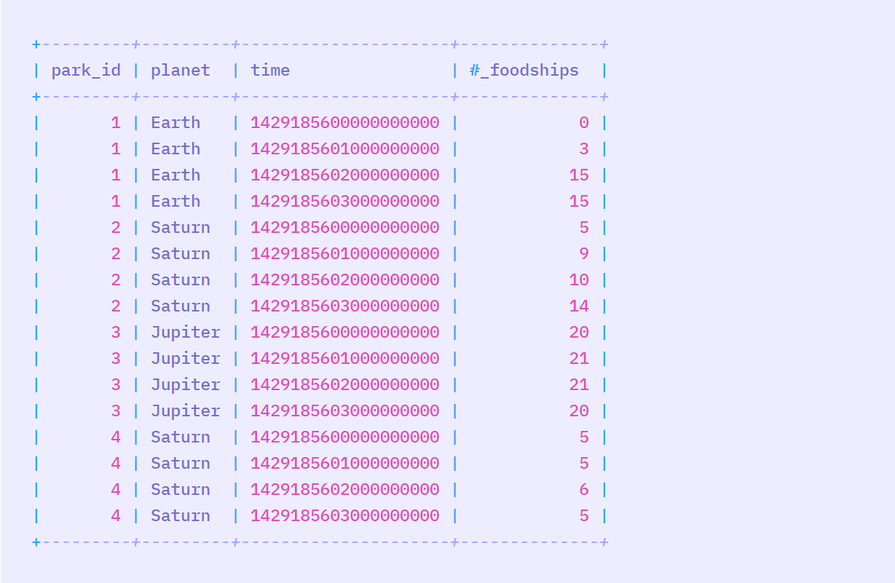
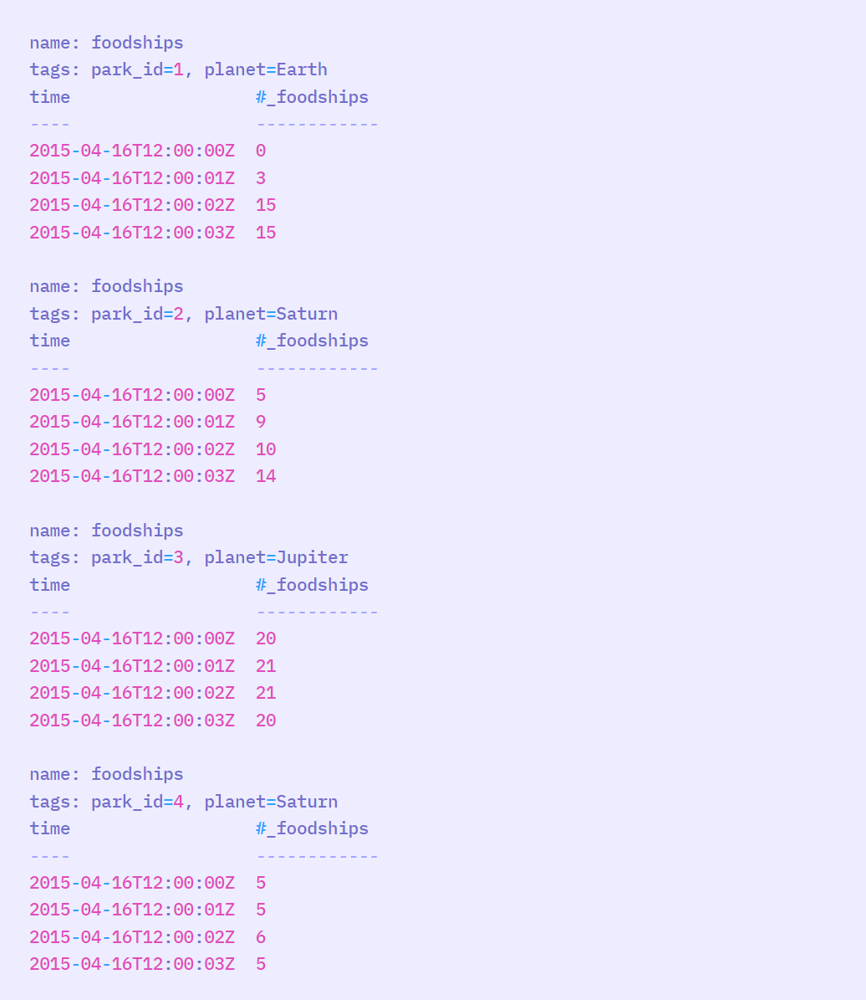

# Authors

AmirHossein Razlighi  
Hooman Keshvari

# Introduction

در ابتدا ، به معرفی کوتاهی درباره ی Influx DB می پردازیم . این نوع از Database ، نوعی از پایگاه‌داده‌ است که اطلاحا به آن Time Series می گویند. یعنی برخلاف اکثر Database هایی که با آنها کار کرده ایم ، این پایگاه داده ، مقدار key را بصورت خودکار و از روی یک سری زمانی ، مقدار دهی میکند و ما میتوانیم مجموعه ای از value های مختلف را در آن ذخیره کنیم .
 
دلیل این کار ( استفاده از سری زمانی ) این است که سرهت query روی دیتابیس را به شدت بالا ببریم و بتوانیم در اموری مثل اپ های Real Time ، از آنها استفاده کنیم .
 
برای درک تفاوت بین دیتابیس Influx و دیتابیس ها Sql ی ، به جدول زیر توجه کنید . این ، مجموعه ای از اطلاعات یک سری سیاره است که در یک دیتابیس sql ذخیره شده است :  

 

 
حالا ، همین اطلاعات را در یک دیتابیس زمان محور ، مثلInflux  ذخیره میکنیم . اطلاعات بدین صورت خواهند بود :
 

 

 

# Setting Up Influx Db in Docker

در این مقاله ، تصمیم داریم یک دیتابیس influx را در فضای داکر ، بالا آورده ، config کنیم و در نهایت ، از رابط آن استفاده کنیم و با Data کار کنیم .
به این منظور ، داکر را run میکنیم و دستور زیر را میزنیم :
 
 

    <code>
        docker pull influxdb
    </code>

حالاباید منتظر باشیم تا آخرین نسحه ی stable یا به اصطلاح همان latest version روی سیستم بارگزاری شود.
پس از آن ، برای ساختن یک container از روی image دانلود شده ، دستور زیر را میزنیم :
   

 <code>
 docekr run -d -e INFLUXDB_ADMIN_USER:admin -e INFLUXDB_ADMIN_PASSWORD:admin --name influxdb influxdb
 </code>

 
حالا ، یک داکر کانتینر با نام Influxdb و با یوزرنیم و پسورد admin  از روی image دانلود شده ، ساخته شد .
 
حالا کافی است که دستور زیر را بزنیم :
 
 

<code>
    docekr ps -a
</code>

و با این دستور ، تمامی کانتینر های شما ، به شما نمایش داده میشوند .  حالا کافی است چند حرف از ابتدای آیدی کانتینر خود را کپی کنید (یا نام کانتینر را کپی کنید ) و دستور زیر را بزنید : 
  

<code>
    docekr exec -it influxdb bash
</code>

 
در نهایت ، کافی است در bash باز شده ،  دستور زیر را بزنید ( در تمامی مراحل توجه کنید که فلگ it مخفف interactive است) :

  

<code>
    influx -host localhost -port 8086 -username admin -password admin
</code>

 

خوب است بدانید که پورت دیفالت مربوط به influx db ، همانطور که در بالا دیدید ، پورت 8086 است .
 
حالا ، ما وارد shell مربوط به influx db شده ایم و میتوانیم داده های خود را در آن ذخیره کنیم !

# Simple Instructions in Influx

