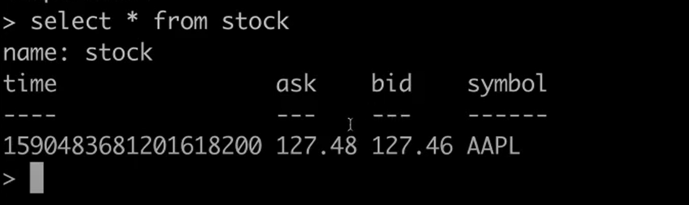
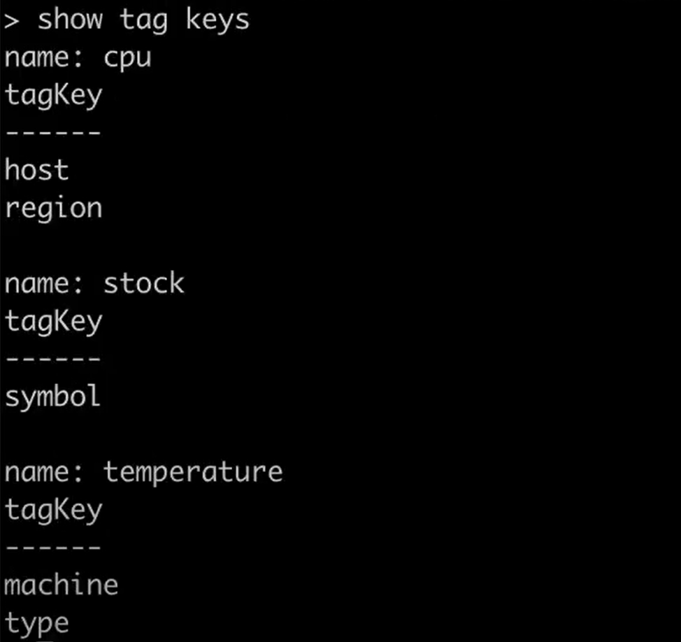
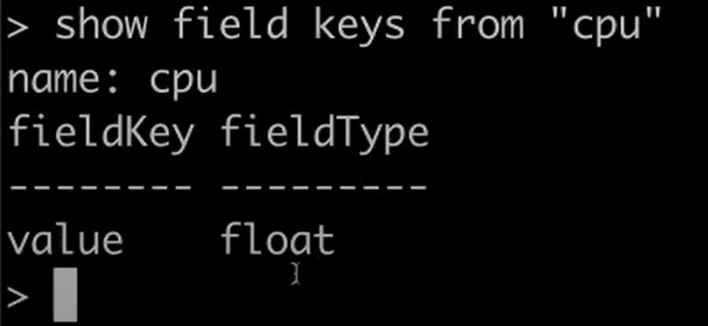
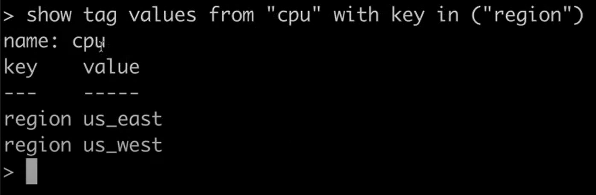

# Authors

AmirHossein Razlighi  
Hooman Keshvari

# Introduction

در ابتدا ، به معرفی کوتاهی درباره ی Influx DB می پردازیم . این نوع از Database ، نوعی از پایگاه‌داده‌ است که اطلاحا به آن Time Series می گویند. یعنی برخلاف اکثر Database هایی که با آنها کار کرده ایم ، این پایگاه داده ، مقدار key را بصورت خودکار و از روی یک سری زمانی ، مقدار دهی میکند و ما میتوانیم مجموعه ای از value های مختلف را در آن ذخیره کنیم .
 
دلیل این کار ( استفاده از سری زمانی ) این است که سرهت query روی دیتابیس را به شدت بالا ببریم و بتوانیم در اموری مثل اپ های Real Time ، از آنها استفاده کنیم .
 
برای درک تفاوت بین دیتابیس Influx و دیتابیس ها Sql ی ، به جدول زیر توجه کنید . این ، مجموعه ای از اطلاعات یک سری سیاره است که در یک دیتابیس sql ذخیره شده است :  

 

 
حالا ، همین اطلاعات را در یک دیتابیس زمان محور ، مثلInflux  ذخیره میکنیم . اطلاعات بدین صورت خواهند بود :
 

 

 

# Setting Up Influx Db in Docker

در این مقاله ، تصمیم داریم یک دیتابیس influx را در فضای داکر ، بالا آورده ، config کنیم و در نهایت ، از رابط آن استفاده کنیم و با Data کار کنیم .
به این منظور ، داکر را run میکنیم و دستور زیر را میزنیم :
 
 

    <code>
        docker pull influxdb
    </code>

حالاباید منتظر باشیم تا آخرین نسحه ی stable یا به اصطلاح همان latest version روی سیستم بارگزاری شود.
پس از آن ، برای ساختن یک container از روی image دانلود شده ، دستور زیر را میزنیم :
   

 <code>
 docekr run -d -e INFLUXDB_ADMIN_USER:admin -e INFLUXDB_ADMIN_PASSWORD:admin --name influxdb influxdb
 </code>

 
حالا ، یک داکر کانتینر با نام Influxdb و با یوزرنیم و پسورد admin  از روی image دانلود شده ، ساخته شد .
 
حالا کافی است که دستور زیر را بزنیم :
 
 

<code>
    docekr ps -a
</code>

و با این دستور ، تمامی کانتینر های شما ، به شما نمایش داده میشوند .  حالا کافی است چند حرف از ابتدای آیدی کانتینر خود را کپی کنید (یا نام کانتینر را کپی کنید ) و دستور زیر را بزنید : 
  

<code>
    docekr exec -it influxdb bash
</code>

 
در نهایت ، کافی است در bash باز شده ،  دستور زیر را بزنید ( در تمامی مراحل توجه کنید که فلگ it مخفف interactive است) :

  

<code>
    influx -host localhost -port 8086 -username admin -password admin
</code>

 

خوب است بدانید که پورت دیفالت مربوط به influx db ، همانطور که در بالا دیدید ، پورت 8086 است .
 
حالا ، ما وارد shell مربوط به influx db شده ایم و میتوانیم داده های خود را در آن ذخیره کنیم !

# Simple Instructions in Influx

اولین چیزی که روی شل مشاهده میکنید ، چیزی شبیه به زیر است :

  

<code>
    Connected To http://localhost:8086 version 1.8.0
    Influx DB Shell : version 1.8.0
</code>

 

که در همین ابتدا خوب است اشاره کنیم که همه چیز در influx db ، تحت پروتکل http رد و بدل میشود .
 

در همین حال ، میتوانید با دستور زیر ، لیست تمامی دیتابیس ها را مشاهده کنید :

  

<code>
    show databases
</code>

 

در ابتدا ، اگر دیتابیسی نساخته باشیم ، لیست زیر نمایش داده میشود.

 

<code>
    name : databases 
    name 
    ------  
    _internal
</code>

 

که نشان دهنده ی این است که فعلا ، فقط همان دیتابیس دیفالت سیستم ، یعنی \_internal وجود دارد .
 
حالا ، برای ساخت یک دیتابیس جدید ، از دستور زیر استفاده میکنیم ( مثلا نام دیتابیس خود را demo میگذاریم ) :
  

<code>
    create database demo
</code>

 

حالا اگر یک show databases بزنیم ، میبینیم که زیر \_internal ، یک دیتابیس جدید به نام مورد نظر ما ( demo ) نوشته شده است .
 
حالا با دستور زیر میتوانیم وارد دیتابیشس مورد نظرمان بشویم :

 

<code>
    use [database name]   ( e.g : use demo )
</code>

 
در دیتابیس های InfluxDB ، از مفهومی به نام measurments استفاده میشود . این مفهوم یعنی داده هایی که در دیتابیس ذخیره میکنیم .  این داده ها از آنجایی که فقط مقدار دهی value شان با ماست ، یک سری tag هم قبول میکنند که به آنها اضافه کنیم و همچنین یک نام که برای دسترسی به آن measurement از آن استفاده کنیم . مثلا در زیر ، یک داده با نام CPU را با تگ های host = server A , region = us_west  و با مقدار ( value ) برابر 0.64 ذخیره میکنیم :

 

<code>
    insert cpu, host=serverA, region=us_west,  value= 0.64 
</code>

 

پس فرمت کلی insert کردن داخل دیتابیس به این صورت است :

 

<code>
    insert [measurement name], [tags] [fields = ...]
</code>

 
حالا میتوانیم برای کوئری زدن از دستورات sql ی استفاده کنیم ! ( و این از ویژگی های منحصر بفرد آن است ) : 
 
مثال :

 

<code>
    SELECT * FROM "cpu"
</code>

 
به doube quotation دور نام measurement توجه کنید !
حال ، بیایید و یک value دیگر را به این measurement اضافه کنیم !

 

<code>
    insert cpu, host= serverA, region= us_west,  value= 1.64
</code>

 

حالا اگر دستور select \* را بزنیم ، چیزی شبیه زیر به نمایش در میاید :

 

<code>
    name: cpu  
    time | host | region | value   
    -----------------------------------
     
    [time 2]     |     serverA  |  us_west | 0.64
     
    [time 1]     |     serverA   |  us_west  | 1.64
</code>

 

حالا بیایید کمی بیشتر داده در این دیتابیس ذخیره کنیم :

 

<code>
    insert temperature, machine=unit42, type=assembly external=25, internal=37
</code>

 

------------------------------------------------------------------------

 

<code>
    insert stock, symbol=AAPL bid=127.46, ask=127.86
</code>

 

------------------------------------------------------------------------

 

<code>
    show measurements
</code>

 

نتیجه مطابق زیر میشود :
 

<code>
    cpu  
    stock  
    temperature
</code>

 

حالا ، مثلا stock را مشاهده میکنیم :
 

<code>
    SELECT * FROM "stock"
</code>

 
نتیجه :
 

همانطور که میبینید ، یک measurement میتواند دو یا چمد value با نام های مختلف داشته باشد و این ویژگی هم دست ما را در کار با داده ها باز میگذارد !
 
حال فرض کنید میخواهیم تمامی key های هر measurement را مشاهده کنیم . در اینجا میتوانیم از یک syntax خاص به نام FLUX استفاده کنیم . مثلا :
 

<code>
    show tag keys
</code>

 
و نتیجه مطابق زیر است که در هر measurement ، نام تگ های مورد نظر را که تعریف شده اند ، نشان میدهد :
 

یا میتوانستیم تگ های یک measurement هاص را ببینیم . مثلا :
 

<code>
    show tag keys from "cpu"
</code>

 
 و نتیجه ، تگ های host , region که مربوط به cpu هستند را نمایش میدهد.
  
 دستوری شبیه به این دستور هست که میتوانیم بجای tag ها ، field ها یا همان مقدار هایی که برای این measurement در نظر گرفته ایم را ببینیم :
  

<code>
    show field keys from "cpu"
</code>

 
و نتیجه مطابق زیر خواهد بود :

که همانطور که مشاهده میشود ، مقدار field با نام value را که تغریف کرده بودیم ، بعلاوه ی نوع data type آن که غدد اعشاری (float) است ، نمایش میدهد .
 
حالا بیایید کمی دستورات بیشتری استفاده کنیم تا داده هایمان را مدیریت کنیم:
  

<code>
    insert cpu,host=serverA,region=us_east value=0.64
</code>

 

------------------------------------------------------------------------

<code>
    show tag values from "cpu" with key in ("region")
</code>

 
و نتیجه مطابق زیر میشود ( نشان دادن مقادیر محتلف Tag مربوط به region در measurement با نام cpu ):

در INFLUXDB ، هر measurement یک سری policy دارد که برخی از آنها auto generate هستند و برخی دیگر را میتوان بنابر نیاز ، بصورت custom نوشت .
مثلا به retention policy توجه کنید . این یک policy است که نشان میدهد یک data به چه مدت توسط influx db نگهداری شود .

<code>
    show retention policies
</code>

 
نتیجه چیزی مطابق زیر خواهد بود :
 

همانطور که میبینید ، بصورت default ، مقدار duration در اینجا برابر 0 ثانیه است . به این معنی که داده ای که ذخیره میشود ، هیچگاه از بین نمیرود . گرچه بسیاری موارد ممکن است که نیاز باشد داده پس از مدتی ( مثلا یک هفته یا یک سال) از دیتابیس ما حذف شود .

