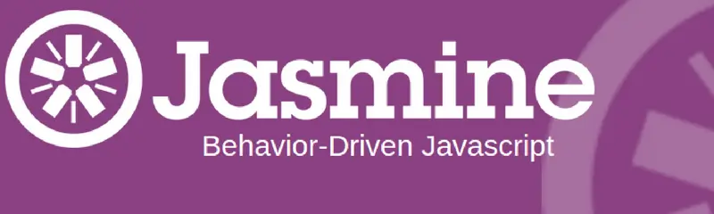
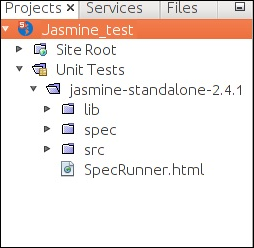
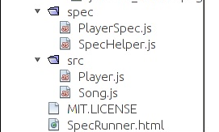
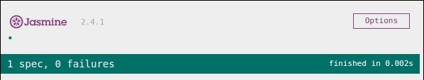

<div dir="rtl">


<br>

<h2>یاسمین چیست؟</h2>

<br>

در اوایل سال 2000، فریم ورکی برای آزمایش برنامه های کاربردی جاوا اسکریپت به نام JsUnit وجود داشت. بعداً این فریم ورک ارتقا یافت و اکنون با نام Jasmine شناخته می شود.
Jasmine برپایه ی رفتار توسعه محور (Behavior Driven Development) برای JavaScript است و به واحد آزمایش (Unit Testing) خودکار کمک می کند ؛ چیزی که هنگام توسعه و بکارگیری برنامه های وب امروزی (و به طور کلی تمام برنامه ها) یک امر کاملاً کلیدی و اجتناب ناپذیر تلقی می شود.

<br>

<h2>چرا Jasmine؟</h2>

<ol>
<p>• به هیچ چارچوب جاوا اسکریپتی دیگری وابسته نیست و میتواند در تمام محیط ها مورد استفاده قرار بگیرد.</p>
<p>•	به هیچ گونه DOM نیاز ندارد.</p>
<p>•	دستورات آن تمیز و واضح است.</p>
<p>•	یک فریمورک متن باز است و به راحتی در نسخه های مختلف مانند stand-alone, ruby gem, Node.js در دسترس است.</p>
<p>•	سریع است و سربار کمی دارد و وابستگی خارجی ندارد.</p>
</ol>

<br>

<h2>مراحل نصب:</h2>

<ol>

<br>
<li>ابتدا از <a href="https://jasmine.github.io/">اینجا</a> به وب سایت رسمی رفته و یکی از ورژن های آن را انتخاب کنید تا به صفحه آن منتقل شوید.</li>
<br>
<li>در قسمت downloads روی standalone release  کلیک کنید.</li>
<br>
<li>حال به صفحه گیتهاب مربوط به ورژن انتخابی هدایت میشوید. از آن جا فایل زیپ jasmine را دانلود کنید.</li>
<br>
<li>فایل unzip شده را به پروژه خودتان اضافه کنید. مانند زیر:</li>
<br>

<br>

</ol>


<h2>اماده سازی jasmine:</h2>

<br>

فایل های زیر spec و src ، دمو های یاسمین هستند؛ آن ها را پاک کنید. (همچنین لازم است رفرنس های آن ها را از specrunner.html پاک کنید)

<br>



<br>
<br>
<br>

داخل فولدر spec ، یک فایل جاوااسکریپت برای نوشتن تست کیس ها بسازید.
<br>
در انتها آدرس هر دو فایل تست و کد جاوااسکریپت را به صورت زیر به SpecRunner.html اضافه کنید:
<br>

برای مشاهده نتیجه اجرای تست ها ، کافی است فایل SpecRunner.html را اجرا کنید. در این صورت با چنین صفحه ای مواجه خواهید شد:

<br>



<br>
<br>
<h2>ایجاد تست کیس</h2>

<br>

هر واحد تست در jasmine که شامل تست های مشابه است و برای یک فایل خاص نوشته شده باشند را Suite می‌نامند. هر Suite از دو جزء describe() و it() تشکیل میشود.
هر Suite دو پارامتر دارد؛ پارامتر اول نام آن و پارامتر دوم مجموعه توابع تست آن میباشد که به صورت زیر با describe و it ها تعریف میشوند:

<div dir="ltr">

``` js
describe("Adding single number ",function () { 
   it("should add numbers",function() { 
      expect(add(5,5)).toEqual(5); 
      expect(add(5,5)).toEqual(10); 
   });     
}

```
</div>
که در مثال بالا انتظار داریم مقدار تابع (5,5(add در فایل جاوااسکریپت مورد نظر میباشد، برابر با 10
شود؛ پس تست اول فیل و تست دوم پاس میشود. 

<br>

<h2>دیگر توابع (matchers) expect:</h2>

<ul>

<li>تابع ()toEqual.not : بررسی مساوی نبودن</li>
<br>
<div dir="ltr">

``` js
describe("Different Methods of Expect Block",function () { 
 it("The Example of not.toEqual() method",function () { 
 expect(expectexam.currentVal).not.toEqual(5); 
 });
});
```
</div>
<br>


<li>تابع ()toBe : تقریبا مشابه ()toEqual است با این تفاوت که تایپ دیتا نیز باید برابر باشد. یعنی 
‘10 ‘برابر با 10 int نیست ) در واقع برابر با عملگر مقایسه ای === است.(</li>
<br>
<div dir="ltr">

``` js
describe("Different Methods of Expect Block",function () {  

   it("The Example of toBe() method",function () { 
      expect(cal.numbr).toBe(10);     
   });
});
```
</div>
<br>


<li>تابع ()ToBeTruthy و ()toBeFalsy : برای چک کردن مقادیر Boolean استفاه میشود:</li>
<br>
<div dir="ltr">

``` js
describe("Different Methods of Expect Block",function () {
 it("The Example of toBeTruthy() method",function () { 
 expect(expectexam(5)).toBeTruthy(); 
 });
});
```
</div>
<br>

<li>تابع ()toContain : بررسی وجود یا عدم وجود یک عضو در آرایه</li>
<br>
<div dir="ltr">

``` js
describe("Different Methods of Expect Block",function () { 
 it("The Example of toContain() method",function () {
 expect([1,2, 3, 4]).toContain(3);
 });
});
```
</div>
<br>

<li>تابع ()toBeCloseTo : برای سنجش وجود مقدار تست در یک بازه یا به عبارتی نزدیک بودن آن با 
مقدار مورد انتظار با یک میزان خطای قابل قبول است. نمونه زیر نزدیک بودن عدد به ۱۲ را با 
خطای ۱ چک میکند:</li>
<br>
<div dir="ltr">

``` js
describe("Different Methods of Expect Block", function () { 
 it("Example of toBeCloseTo()", function () {
 expect(12.34).toBeCloseTo(12 , 1); 
 });
});
```
</div>
<br>

<li>تابع ()ToMatch : برای چک کردن تساوی رشته های کاراکتری )String )ها بکار میرود. دقت کنید حتما باید 
مقدار مورد انتظار بین دو / قرار بگیرد:</li>
<br>
<div dir="ltr">

``` js
describe("Different Methods of Expect Block",function () {
 it("Example of toMatch()", function () {
 expect("Jasmine tutorial in tutorials.com").toMatch(/com/); 
 });
});
```
</div>
<br>


<li>تابع ()toBeDefined و ()toBeUndefined : چک میکند که آیا متغیر قبال در این کد تعریف شده 
است یا نه:</li>
<br>
<div dir="ltr">

``` js
currentVal = 0; 
describe("Different Methods of Expect Block",function () { 
 it("Example of toBeDefined", function () {
 expect(currentVal).toBeDefined();
 });
});
```
</div>
<br>


<li>تابع ()toBeNull : برای بررسی تهی بودن یک متغیر:</li>
<br>
<div dir="ltr">

``` js
describe("Different Methods of Expect Block",function () { 
 var value = null; 
 it("Example of toBeNull()", function () { 
 expect(value).toBeNull();
 });
});
```
</div>
<br>


<li>تابع ()toBeGreaterThan و ()toBeLessThan : بررسی نامساوی ها:</li>
<br>
<div dir="ltr">

``` js
describe("Different Methods of Expect Block",function () { 
   var exp = 8;  
   it("Example of  toBeGreaterThan()", function () {
      expect(exp).toBeGreaterThan(5);
   });
});
```
</div>
<br>
</ul>

شما همچنین میتوانید matcher دلخواه خودتان را بسازید و به یاسمین خود اضافه کنید:


<br>
<div dir="ltr">

``` js
jasmine.addMatchers ({ 
         validateAge: function() { 
            Return {    
               compare: function(actual,expected) {
                  var result = {}; 
                  result.pass = (actual > = 13 && actual < = 19);
                  result.message = 'sorry u are not a teen ';
                  return result; 
               }   
            };   
         }    
      }); 
```
</div>


<br>

<h3>توابع beforeEach() و afterEach()</h3>
 این توابع با اضافه شدن به بلاک describe قبل از اجرای هر بلاک it یکبار اجرا میشوند. به مال زیر دقت کنید:

<br>
<br>

<div dir="ltr">

``` js
let year = 2023 
describe("get year",function () { 
   
   beforeEach(()=> {
        year += 1;
   })

   it("should be next year", function () {
      expect(year).toBe(2024);
   });

   it("should be next year", function () {
      expect(year).toBe(2024);
   });

});
```
</div>
<br>
در اینجا تست اول پاس و تست دوم فیل میشود چون قبل از اجرای تست دوم مقدار year برای بار دوم یک واحد زیاد شده و حالا برابر با 2025 است.


<br>
<h3>بلاک های Suite تو در تو (Nested Suits)</h3>

میتوان بلاک های Describe را به شکل زیر تو در تو تعریف کرد:


<br>
<div dir="ltr">

``` js
describe("nested",function() { 
   
   // Starting of first suite block  
   // First block    
	
   describe("Retaining values ",function () {
   
      //test case:1    
      it ("Should retain the current value of all time", function () { 
         expect(nested.currentVal).toBeDefined();   
         expect(nested.currentVal).toEqual(0);   
      });    
   }); //end of the suite block   

   //second suite block 
   describe("Adding single number ",function () {     
   
      //test case:2 
      it("should add numbers",function() { 
         expect(nested.add(5)).toEqual(5); 
         expect(nested.add(5)).toEqual(10); 
      });         
   }); //end of the suite block  

   //third suite block 
   describe("Adding Different Numbers",function () {  
   
      //test case:3 
      it("Should add any number of numbers",function() {  
         expect(nested.addAny(1,2,3)).toEqual(6);  
      });    
   }); //end of the suite block 
});
```
</div>
<br>


<br>
<br>
<br>
<br>
<br>

<h3>گردآورندگان:</h3>
<ul>
حسین صبحی، 
دانیال براری، 
سید رضا قمقام
</ul>
<br>

<h3>منابع:</h3>
<ul dir="ltr">
[https://www.softwaretestinghelp.com/jasmine-framework-tutorial/]
<br>
[https://www.guru99.com/node-js-testing-jasmine.html]
<br>
[https://www.tutorialspoint.com/jasminejs/index.htm]
<br>
[https://www.freecodecamp.org/news/jasmine-unit-testing-tutorial-4e757c2cbf42/]
</ul>