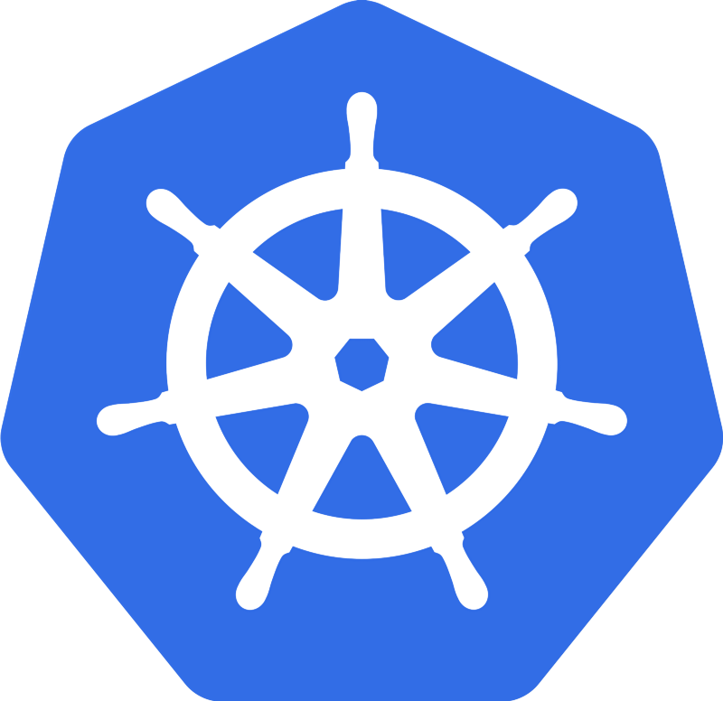

<div dir="rtl">

# Kubernetes

<div align="center">



<p align="center">
    تحقیق پایان ترم برنامه سازی وب، دانشگاه صنعتی شریف
    <br/>
    استاد درس: جناب آقای امید جعفری نژاد
    <br/>
    نویسندگان: آتنا ساقی (ورژن اول) رضا صومی و علی جوانمرد و حمیدرضا کلباسی (ورژن دوم)
</p>

</div>

<hr>

## مقدمه

همانطور که مستحضر هستید، kubernetes یک تکنولوژی محبوب و در عین حال دارای پیچیدگی طراحی و محاسباتی است. امیدواریم در انتهای این بخش به درک خوبی از این تکنولوژی دست پیدا کنید. مطالب به گونه ای تدوین شده است که در انتها امتحان CKA را به خوبی بتوانید پشت سر بگذارید.

این تکنولوژی متن باز که با نام k8s نیز شناخته می شود، یک container orchestration tool است که توسط گوگل ایجاد و توسعه داده شده است. به عبارتی فرآیندهای دستی مربوط به استقرار، مدیریت و مقیاس پذیری برنامه های دارای container همانند برنامه های موجود در docker را به طور خودکار و با استفاده از تنظیمات پیش فرض انجام می دهد. لازم به ذکر است به طور خودکار می تواند هزاران برنامه موجود در container های مختلف را در محیط های فیزیکی، مجازی یا cloud برنامه ریزی و مدیریت کند که در ادامه با آن بیشتر آشنا خواهیم شد.

اگر با مفاهیم container آشنا نیستید لازم است باید بدانید که در یک جمله می‌توان مفهوم Container – کانتینر را این گونه گفت: کانتینر، نرم افزار مجازی سازی در سطح سیستم عامل است. Container، یک بسته نرم افزاری است و شامل هر آن چیزی است که نرم افزار برای اجرا به آن نیاز دارد، مثلا برنامه‌های قابل اجرا که تنظیمات، کتابخانه‌‌ها و System Tools را شامل می‌شود. Container ها مانند برنامه‌های نرم افزاری سنتی که به شما اجازه می‌دهند مستقل از نرم افزارهای دیگر و خود سیستم عامل کار کنید، نصب نمی‌شوند. مهمترین دغدغه کانتینرها این است که چگونه محیطی فراهم کنند تا نرم افزارهایی که در یک محیط پردازشی اجرا می‌شوند با انتقال به محیط دیگر، بدون ایراد و مشکل اجرا شوند.

وجود trend تغییر طراحی نرم افزار از استقرار monolithic به microservice نیاز به ابزار های container orchestration که برنامه ها را در سرویس های مختلف، ماشین های مختلف و محیط های مختلف سرو کند را پررنگ تر می سازد (استفاده از container ها با این تغییر افزایش پیدا کرده و مدیریت دستی همهcontainer ها پیچیدگی خاص خود را دارد.)

### با kubernetes چه کارهایی میتوان انجام داد؟

با kubernetes شما میتوانید:

- بین چندین میزبان containers هایتان را تنظیم کنید.
- با بهبود بخشیدن استفاده از سخت افزار ، منابعی که برای اجرای برنامههاتان لازم هستند را بهبود ببخشید.
- deployments و به روز رسانی برنامه ها را کنترل و خودکار کنید.
- برای اجرای برنامه های مناسب ، فضای ذخیره سازی را نصب و اضافه کنید.
  اجرای آنها در نظر گرفته اید ، اجرا می شوند.
- با جایگذاری خودکار(auto placement) ، راه اندازی مجدد خودکار(auto restart) ، تکثیر خودکار(auto
  replication) و مقیاس گذاری خودکار (auto scaling)، برنامه ها را به صورت اتوماتیک بررسی شده و جلوی انواع خسارت ها گرفته می شود و گسترش پروژه راحت تر صورت می گیرد.


### برخی از اصطلاحات رایج در Kubernetes:

- nodes:
<p dir="rtl">
این ماشین ها درخواستهایی که توسط صفحه کنترل اختصاص داده شده را اجرا میکنند. که هرکدام دارای یک kubelet process هستند. هر گره دارای یک یا چند container درون خود برای اجرا است که به نحوی با هم در ارتباط خواهند بود.
</p>

- Kubelet:
<p dir="rtl">
این سرویس روی گره ها اجرا می شود، manifest کانتینر را می خواند و از راه اندازی و در حال اجرا بودن کانتینر تعریف شده اطمینان حاصل می کند. لازم به ذکر است این kubelet process پردازه ای است که باعث برقراری ارتباط بین خوشه ها (clusters) و اجرای برنامه روی همان گره می شود.
</p>

- control plane:
<p dir="rtl">
مجموعه فرآیندهایی است که گره های Kubernetes را کنترل می کنند. تقسیم و تخصیص وظایف در این بخش صورت میگیرد. این بخش دارای API Server برای دریافت و ارسال اطلاعات از خوشه (cluster) به خارج آن است که سه حالت user interface، API و Command Line Interface را ساپورت می کند. و دارای بخش Controller Manager است که اتفاقاتی که درون cluster می افتد را رصد می کند. همچنین دارای یک scheduler است که برای مثال تصمیم می گیرد یک container یا pod در کدام node اجرا شود.

مهم ترین کار های controller manager

```

Deployment controller
Replicaset controller
DaemonSet controller
Job Controller (Kubernetes Jobs)
CronJob Controller
endpoints controller
namespace controller
service accounts controller.
Node controller

```

<h3>نکات مهم در مورد controller manager</h3>
<br>
  تمام کنترلرها را مدیریت می کند و کنترل کننده ها سعی می کنند خوشه را در حالت دلخواه نگه دارند.
  همینطور می توانید kubernetes را با کنترلرهای سفارشی مرتبط با تعریف منبع سفارشی گسترش دهید.
<h3>Cloud Controller Manager (CCM)</h3>
<br>
 وقتی kubernetes در محیط‌های ابری مستقر می‌شود، مدیر کنترل‌کننده ابر به‌عنوان پلی بین APIهای Cloud Platform و خوشه Kubernetes عمل می‌کند.

به این ترتیب اجزای اصلی kubernetes می توانند به طور مستقل کار کنند و به ارائه دهندگان ابر اجازه می دهد تا با استفاده از افزونه ها با kubernetes ادغام شوند. (به عنوان مثال، رابط بین خوشه kubernetes و API ابری AWS)

یکپارچه‌سازی کنترل‌کننده‌های ابری به خوشه Kubernetes اجازه می‌دهد تا منابع ابری مانند نمونه‌ها (برای گره‌ها)، متعادل‌کننده‌های بار (برای خدمات) و حجم‌های ذخیره‌سازی (برای حجم‌های پایدار) را فراهم کند.
<br>

<h3 dir="rtl">
control plane دارای component های زیر است:

    1)kube-apiserver
    2)etcd
    3)kube-scheduler
    4)kube-controller-manager
    5)cloud-controller-manager
</h3>

- pod:
<p dir="rtl">
گروهی از یک یا چند کانتینر که در یک گره مستقر می شوند. همه کانتینرهای موجود در یک pod دارای آدرس IP ،IPC، نام میزبان و سایر منابع مشترک هستند. pods شبکه و فضای ذخیره سازی را container زیرین خود جدا میکنند. با این کار می توانید container را به راحتی در خوشه جابجا کنید.
</p>

- Replication controller:
<p dir="rtl">
این کنترل می کند که چند نسخه یکسان از یک pod در بخشی از خوشه باید اجرا شود.
</p>

- service:
<p dir="rtl">    
تعریف کار را از pods جا می کند. پروکسی های سرویس Kubernetes به طور خودکار درخواست خدمات را به pod مناسب می رسانند، فرقی ندارد که این pod در کجای خوشه است یا جایگزین شده است یا نه.
</p>

- kubectl:
</p dir="rtl">
<h1>پیکر بندی Kubernetes</h1>
<p>نمودار معماری Kubernetes زیر تمام اجزای خوشه Kubernetes و نحوه اتصال سیستم های خارجی به خوشه Kubernetes را نشان می دهد.</p>

 مهمترین چیزی که باید در مورد Kubernetes بدانید این است که یک سیستم توزیع شده است. به این معنی که دارای اجزای متعددی است که در سرورهای مختلف از طریق شبکه پخش شده اند. این سرورها می توانند ماشین های مجازی یا سرورهای حقیقی باشند. ما آن را خوشه Kubernetes می نامیم.

<h3>
Worker Node
</h3>
<Worker dir="rtl">Worker nodes مسئول اجرای برنامه های کانتینری شده هستند. Worker Node دارای اجزای زیر است.
</p>

<div dir="ltr">

```
    kubelet
    kube-proxy
    Container runtime
```

</div>

## ابزار پیکربندی خط فرمان برای kubernetes

</p>


همانطور که در تصویر بالا مشاهده می کنید معمولا دو master node در نظر می گیرند تا هرگاه یکی از آن ها down شود دیگری وجود داشته باشد.

<hr>

برای این‌که بدانید kubernetes چگونه چنین قابلیت‌هایی را فراهم می‌کند، بهتر است درکی از چگونگی طراحی و سازماندهی آن در سطح بالا داشته باشید. kubernetes همانند یک سیستم در لایه‌ها ساخته‌شده که هر لایه بالا، جزییات لایه‌های پایینی را پنهان می‌کند. در پایه، kubernetes ماشین‌های مجازی و فیزیکی مجزا را کنار هم و درون یک کلاستر(خوشه) قرار می‌دهد و برای این کار از یک شبکه اشتراکی برای ارتباط بین هر سرور استفاده می‌کند. این کلاستر یک پلتفرم فیزیکی است که تمام اجزا، قابلیت‌ها و بار کاری آن پیکربندی شده‌اند.

اکوسیستم kubernetes به هر ماشین درون کلاستر یک نقش می‌دهد. یک سرور (و گاهی گروه کوچکی از آن‌ها) به‌عنوان سرور ارشد انتخاب می‌شود. این سرور به‌عنوان یک دروازه و مغز کلاستر شناخته می‌شود و سلامتی دیگر سرورها را بررسی می‌کند، یک API به کاربران و کلاینت‌ها (مشتری‌‌ها) نشان می‌دهد، وظایف را به بهترین حالت تقسیم می‌کند و ارتباط بین سایر اجزا را هماهنگ می‌کند. سرور ارشد نقطه اتصال هر کلاستر است و مسئول بیشتر ویژگی‌هایی است که kubernetes در یک محیط متمرکز فراهم می‌کند.

ماشین‌های درون کلاستر به‌عنوان سرور گره (Node) شناخته می‌شوند: سرورها مسئول پذیرش و اجرای بار کاری هستند که از منابع محلی و خارجی استفاده می‌کنند. با کمک مدیریت، انعطاف‌پذیری و انزوا، kubernetes اپلیکیشن‌ها و سرویس‌ها را در کانتینر اجرا می‌کند. پس لازم است هر گره با یک مجری کانتینر (Runtime) مجهز شود، مانند داکر یا rkt. هر گره دستورات کاری خود را از سرور ارشد دریافت می‌کند و بر اساس آن کانتینرها را می‌سازد، از بین می‌برد و قوانین شبکه‌ای را تنظیم می‌کند تا ترافیک به بهترین نحو مسیریابی شود.

همان‌طور که در بالا گفته شد، اپلیکیشن‌ها و سرویس‌ها در کلاستر با یک کانتینر اجرا می‌شوند واجزای پایینی مطمئن می‌شوند که وضعیت اپلیکیشن مطابق با وضعیت کلاستر است. کاربران توسط سرور API اصلی با کلاستر ارتباط برقرار می‌کنند و این کار به‌صورت مستقیم یا با کمک کلاینت‌ها‌ و کتابخانه‌ها‌ انجام می‌شود. برای شروع کار یک اپلیکیشن یا سرویس، یک طرح در JSON یا YALM تعریف می‌شود و مشخص می‌شود که چه چیزی باید ایجاد و چگونه مدیریت شود. سپس سرور ارشد با توجه به زیرساخت و وضعیت سیستم، نحوه اجرا را مشخص می‌کند. این گروه از اپلیکیشن‌هایی که توسط کاربر تعریف شده‌اند، بر اساس برنامه‌های خاصی اجرا می‌شوند که در لایه آخر kubernetes ارائه‌شده است.


#### اجزای Master:

یک سرور ارشد حکم هسته کنترلی در کلاستر‌ها را دارد و نقطه ارتباطی میان کاربران و مدیران است. اجزای سرور ارشد با یکدیگر کار می‌کنند تا درخواست کاربر را پذیرش کنند، بهترین زمان‌بندی را برای بار کاری کانتینرها تعیین کرده، وضعیت شبکه‌سازی کلاستر را تنظیم و مسئولیت مدیریت، مقیاس‌بندی و سلامتی را بر عهده داشته باشند. این اجزا می‌توانند در یک ماشین مجزا نصب شوند یا در چند سرور به‌صورت توزیع‌شده قرار گیرند. در ادامه نگاهی به هر یک از اجزایی که با سرور ارشد پیوند خورده‌اند، خواهیم داشت.

#### etcd:

یکی از اجزای اصلی که kubernetes برای عملکردها به آن نیاز دارد، یک مخزن پیکربندی عمومی است. Etcd که توسط یک تیم در CoreOS توسعه‌یافته، یک مخزن از Key-valueها است که می‌تواند در محدوده گره‌ها پیکربندی شود. kubernetes از Etcd استفاده می‌کند تا پیکربندی‌های داده را که هر نود در کلاستر می‌تواند به آن دسترسی پیدا کند، ذخیره کند. این کار می‌تواند برای اکتشاف سرویس‌ها استفاده شود یا می‌تواند به پیکربندی اجزا یا پیکربندی مجدد آن‌ها بر اساس اطلاعات به‌روز شده کمک کند. همچنین برای حفظ وضعیت کلاستر با ویژگی‌هایی مانند انتخاب رهبر کاربرد دارد.

همانند بیشتر اجزای دیگر در صفحه کنترلی، Etcd می‌تواند روی یک سرور ارشد پیکربندی شود یا بین تعدادی از ماشین‌ها توزیع شود. تنها چیزی که نیاز است دسترسی به شبکه برای ماشین‌های kubernetes است.

#### Kube-Apiserver:

این سرویس، مدیر کنترلر یک سرویس مهم است که وظایف زیادی بر عهده دارد. این سرویس بار کار چرخه زندگی و کنترلرهایی را که از وضعیت تنظیم‌شده برای کلاستر خارج شده‌اند، مدیریت می‌کند و وظایف روزانه را انجام می‌دهد. جزییات این عملیات‌ها در Etcd نوشته‌شده، جایی‌که مدیر کنترلر تغییرات را از طریق سرور API مشاهده می‌کند. زمانی‌که تغییر مشاهده شد، کنترلر اطلاعات جدید را می‌خواند و رویه‌های مناسب را پیاده می‌کند. این مورد می‌تواند شامل گسترش یا کوچک کردن مقیاس اپلیکیشن، تنظیم نقطه پایانی یا موارد دیگر باشد.

#### kube-scheduler:

این سرویس پردازشی است که بار کاری را در زمان مشخص به یک نود مشخص واگذار می‌کند. این سرویس نیازهای عملیاتی بارکاری را می‌خواند، محیط زیرساخت فعلی را تحلیل می‌کند و کار را به نود یا نودهای مناسب می‌سپارد.

زمان‌بند (Scheduler)، مسئول دنبال کردن ظرفیت‌های موجود در هر میزبان است تا مطمئن شود بار کاری در زمان خود، از منابع زیادی استفاده نمی‌کند. زمان‌بند باید مجموع ظرفیت‌ها و همچنین منابع تخصیص داده‌شده به هر سرور را بداند.

اگر بخواهیم به جزییات این زمانبند اشاره کنیم میتوان موارد زیر را اشاره کرد:

برای انتخاب بهترین گره، Kube-scheduler از عملیات فیلتر کردن و امتیازدهی استفاده می کند.

در فیلتر کردن، زمان‌بندی گره‌های مناسب را پیدا می‌کند که می‌توان pod را در آنجا برنامه‌ریزی کرد. برای مثال، اگر پنج گره با منابع در دسترس برای اجرای pod وجود داشته باشد، هر پنج گره را انتخاب می کند. اگر هیچ گره ای وجود نداشته باشد، pod غیرقابل برنامه ریزی است و به صف زمان بندی منتقل می شود. اگر یک خوشه بزرگ است، 100 گره را فرض کنید، و زمانبندی روی همه گره ها تکرار نمی شود. یک پارامتر پیکربندی زمان‌بندی وجود دارد که به آن %OfNodesToScore می‌گویند. مقدار پیش فرض معمولاً 50٪ است. بنابراین سعی می‌کند بیش از 50 درصد از گره‌ها را به صورت دورگرد تکرار کند. اگر گره‌های در چندین ناحیه پخش شده باشند، زمان‌بندی بر روی گره‌ها در مناطق مختلف تکرار می‌شود. برای خوشه های بسیار بزرگ، درصد پیش فرض OfNodesToScore 5 درصد است.

در مرحله امتیازدهی، زمانبندی گره ها را با اختصاص امتیاز به گره های کارگر فیلتر شده رتبه بندی می کند. برنامه‌ریز با فراخوانی چندین پلاگین زمان‌بندی امتیازدهی می‌کند. در نهایت گره کارگر با بالاترین رتبه برای زمان بندی پاد انتخاب می شود. اگر همه گره ها رتبه یکسانی داشته باشند، یک گره به طور تصادفی انتخاب می شود.

هنگامی که گره انتخاب شد، زمان‌بند یک رویداد الزام آور در سرور API ایجاد می‌کند. به معنای رویدادی برای اتصال غلاف و گره.

#### اجزای Node:

#### Container Runtime:

این اولین قسمتی است که هر گره باید آن را داشته باشد. به‌طورمعمول، این نیاز با نصب داکر برطرف می‌شود، اما جایگزین‌هایی مانند rkt و run نیز وجود دارند. مجری کانتینر مسئول شروع و مدیریت کانتینر است. هر واحد کاری در کلاستر در سطح پایه قرار دارد و به‌عنوان یک یا چند کانتینر پیاده‌سازی شده که باید توسعه پیدا کند. مجری کانتینر در هر گره بخشی است که در نهایت کانتینرها را با توجه به تعریف‌های قبلی، اجرا می‌کند.

احتمالاً در مورد Java Runtime (JRE) می دانید. این نرم افزار مورد نیاز برای اجرای برنامه های جاوا بر روی هاست است. به همین ترتیب، Container Runtime یک جزء نرم افزاری است که برای اجرای کانتینرها لازم است.

زمان اجرا کانتینر بر روی تمام گره های خوشه Kubernetes اجرا می شود. وظیفه استخراج تصاویر از رجیستری کانتینر، اجرای کانتینرها، تخصیص و جداسازی منابع برای کانتینرها و مدیریت کل چرخه حیات یک کانتینر در یک میزبان را بر عهده دارد.

برای درک بهتر این موضوع، اجازه دهید به دو مفهوم کلیدی نگاهی بیندازیم:

<p dir="rtl">
Container Runtime Interface (CRI): مجموعه ای از API ها است که به Kubernetes اجازه می دهد با زمان های اجرا کانتینر مختلف تعامل داشته باشد. این اجازه می دهد تا زمان های مختلف کانتینر به جای Kubernetes مورد استفاده قرار گیرد. CRI API را برای ایجاد، شروع، توقف و حذف کانتینرها و همچنین برای مدیریت تصاویر و شبکه های کانتینر تعریف می کند.
     Open Container Initiative (OCI): مجموعه ای از استانداردها برای قالب های کانتینر و زمان اجرا است

#### kubelet:

نقطه ارتباطی هر گره با گروه کلاستر از طریق یک سرویس کوچک به نام Kubelet انجام می‌شود. این سرویس وظیفه انتقال اطلاعات به سرویس صفحه کنترلی را برعهده دارد و همچنین با مخزن etcd در تعامل است تا پیکربندی‌ها را بخواند و valueهای جدید بنویسد. Kubelet با اجزای ارشد ارتباط برقرار می‌کند تا در کلاستر به رسمیت شناخته شود و دستورات را دریافت کند. همچنین مجری کانتینر را کنترل می‌کند تا کانتینر اجرا یا در صورت نیاز از بین برود.

### Kubernetes Cluster Addon Components

جدا از اجزای اصلی، خوشه kubernetes به اجزای افزودنی نیاز دارد تا به طور کامل عملیاتی شود. انتخاب یک افزونه به نیازهای پروژه و موارد استفاده بستگی دارد.

در زیر برخی از اجزای افزونه محبوبی که ممکن است در یک کلاستر به آنها نیاز داشته باشید آورده شده است.

پلاگین CNI (رابط شبکه کانتینر)
CoreDNS (برای سرور DNS): CoreDNS به عنوان یک سرور DNS در خوشه Kubernetes عمل می کند. با فعال کردن این افزونه، می توانید کشف سرویس مبتنی بر DNS را فعال کنید.
سرور متریک (برای معیارهای منابع): این افزونه به شما کمک می کند داده های عملکرد و استفاده از منابع گره ها و پادها را در خوشه جمع آوری کنید.
رابط کاربری وب (داشبورد Kubernetes): این افزونه داشبورد Kubernetes را برای مدیریت شی از طریق وب UI فعال می کند.

وظایف CNI Plugin

 <p dir+"rtl>
  Kube-controller-manager مسئول تخصیص pod CIDR به هر گره است. هر پاد یک آدرس IP منحصر به فرد از CIDR غلاف دریافت می کند.
     Kubelet با زمان اجرا کانتینر برای راه‌اندازی پاد زمان‌بندی‌شده تعامل دارد. پلاگین CRI که بخشی از زمان اجرا Container است با پلاگین CNI برای پیکربندی شبکه پاد تعامل دارد.
     پلاگین CNI با استفاده از یک شبکه همپوشانی، شبکه بین پادهای پخش شده در گره های مشابه یا متفاوت را فعال می کند.
#### kube-proxy:
 برای مدیریت این‌که سرویس‌ها باید برای اجزای دیگر موجود باشند، یک سرویس پروکسی به نام Kube Proxy در هر سرور گره اجرا می‌شود. این پردازش، درخواست‌ها را به کانتینر درست ارسال می‌کند، می‌تواند تعادل بار برقرار کند و مطمئن شود که محیط شبکه‌ای قابل پیش‌بینی و ‌دسترسی است.

### Volume:

فرض کنید پایگاه داده موجود در یک node که به صورت container است خراب شده و باعث از دست رفتن داده ها شود. حال یک لایه قابلیت اطمینان بیشتر با وجود Volume در هر node ایجاد می گردد که در صورت وجود این سناریو داده ها بازیابی می شود. که می تواند این Volume یک حافظه محلی روی node یا حافظه cloud باشد.

### pod:

کوچکترین واحد kubernetes است که در یک گره وجود دارد و یک اپلیکیشن به ازای هر pod وجود خواهد داشت. که هر pod آدرس ip خود را دارند.


برای حل مشکل بالا (اینکه اگر pod مورد نظر down شود denial of service خواهیم داشت) از سرویس استفاده می شود که در تصویر زیر مشاهده می کنید.


چند نکته دیگر را نیز در مورد pod بررسی می کنیم.

### ConfigMap:

یک برنامه خاص که به اصطلاح یک pod است به پایگاه داده فرضی درون همان node متصل است. فرض کنید ip این پایگاه داده تغییر کند برای جلوگیری از rebuild کردن دوباره app مفهومی به نام ConfigMap وجود دارد که اطلاعات برای اتصال به پایگاه داده را با ذخیره DB_URL، DB_USER و DB_PASSWORD فراهم می کند.

### Secret:

همان ConfigMap است با این تفاوت که داده ها plain text نبوده و به صورت رمز شده ذخیره می شود.

### StatefullSet:

فرض کنید از قابلیت replicate استفاده کرده اید حال دو پایگاه داده وجود دارد که باید مراقب بود با هم synch باشند که می توانند از پایگاه داده بیرون node استفاده کنند. در هر صورت برای synch بودن از این مفهوم استفاده می شود که deploy آن نیز پیچیده خواهد بود.

## نحوه‌‌ی راه‌اندازی یک برنامه با kubernetes

در این قسمت با توضیحاتی که از بخش قبل خواندیم، یک برنامه ساده وب به زبان go را با کمک kubernetes اجرا می‌کنیم. در این قسمت با cli کار کرده و در قسمت بعدی با config file ها کار خواهیم کرد.

#### نصب ابزارهای لازم:

#### Kubctel:

یک رابط command line براي اجراي دستورات است که در خوشه هاي Kubernetes پردازش می شود. با استفاده از kubectl می توانید برنامه ها را deploy کنید ، منابع خوشه را بررسی و مدیریت کنید ، log مربوط را مشاهده کنید و غیره.
دیاگرامی که kubectl در قسمت cli قرار می گیرد را در تصویر زیر مشاهده می کنید.


همانطور که مشاهده می کنید API Server موجود در هر node راه های مختلفی برای ارتباط دارد که یکی از آن ها command line interface بوده که kubectl قدرتمندترین ابزار در این قسمت است.


لازم به ذکر است همانطور که در تصویر بالا مشاهده می کنید برای محیط های cloud نیز قابل استفاده است.

1. دانلود آخرین ورژن با دستور:
<div dir="ltr">

```
 curl -LO "https://storage.googleapis.com/kubernetes-release/release/$(curl -s https://storage.googleapis.com/
       kubernetes-release/release/stable.txt)/bin/linux/amd64/kubectl"

```

</div>

از دستور brew install minikube نیز می توان استفاده کرد.
(براي نصب یک ورژن خاص عبارت داخل پرانتز را ورژن مورد نظر جایگذاري کنید.)

2. تبدیل به فایل قابل اجرا:
<div dir="ltr">

```

chmod +x ./kubectl

```

</div>

3.قرار دادن در PATH:

<div dir="ltr">

```

sudo mv ./kubectl /usr/local/bin/kubectl
```

</div>

4.  چاپ ورژن:
    در این مرحله مطمئن میشوید که فایل نصب شده‌است.

<div dir="ltr">

```

kubectl version --client
```

</div>

برای استفاده از آن از درایور هایی نظیر داکر، virtualBox و ... موجود در سایت می توانید استفاده کنید که ترجیح بر استفاده از داکر است چرا که در هر سه سیستم linux، macos و windows قابل اجرا است.


برای نصب داکر از سایت داکر اقدام کنید.
[install docker](https://docs.docker.com/get-docker/)

#### Minikube:

محیط خوشه فیزیکی Kubernetes را در محیط شما ایجاد و پیاده سازي می کند.
پیشنهاد می شود سایت خود minikube را نیز مشاهده کنید.
[minikube installation](https://minikube.sigs.k8s.io/docs/start/)

سناریوی موجود در تصویر زیر را در نظر بگیرید.


دو master node و چهار worker node وجود دارد. تست در محیط محلی چگونه صورت بگیرد؟ بالا آوردن یک خوشه (cluster) با منابع سخت افزاری محدود سخت می تواند باشد. Minikube راه حلی برای این مشکل است که متن باز بوده و یک خوشه دارد که master node processes و worker node processes در یک node اجرا می شوند. که در تصویر زیر آن را مشاهده می کنید.


1. به روزرسانی و آپدیت سیستم:

<div dir="ltr">

```

kubectl version --client
```

</div>

2.بررسی پشتیابی لینوکس فعلی از مجازي سازي:

<div dir="ltr">

```

kubectl version --client
```

</div>

3. نصب virtual box hypervisor:

<div dir="ltr">

```

kubectl version --client
```

</div>

4. نصب minikube:

<div dir="ltr">

```

 wget https://storage.googleapis.com/minikube/releases/latest/minikube-linux-amd64
```

</div>

<div dir="ltr">

```
cp minikube-linux-amd64 /usr/local/bin/minikube
```

</div>

<div dir="ltr">

```
chmod 755 /usr/local/bin/minikube
```

</div>

5. بررسی ورژن:
<div dir="ltr">

```
minikube version
```

</div>

### ساخت cluster:

اکنون میتوانیم با دستور minikube start و minikube status یک cluster بر روي ماشین مجازي بسازیم:

<div dir="ltr">

```
minikube start
```

</div>

خروجی این دستور به این شکل خواهد بود:


<div dir="ltr">

```
minikube status
```

</div>

خروجی:

<div dir="ltr">

```
host: Running
kubelet: Running
apiserver: Running
kubectl: Correctly Configured: pointing to minikube-vm at 192.168.99.100
```

</div>

با دستور زیر اطلاعات خوشه را می توان دید:

<div dir="ltr">

```
kubectl cluster-info
```

</div>

خروجی:

<div dir="ltr">

```
Kubernetes master is running at https://192.168.99.100:8443
KubeDNS is running at https://192.168.99.100:8443/api/v1/namespaces/kube-system/services/kube-dns:dns/proxy
```

</div>

همانطور که در بالا می بینیم ، ما با cluster خود ارتباط داریم و همچنین می توانیم اجزاي Kubernetes را به همراه سرور API نصب کنیم. همچنین می توانید با دستور minikube ssh به ماشین مجازي minikube متصل شوید تا ببینید چه فرآیندهایی در گره اجرا می شوند.

اکنون می توانیم لیستی از گره هاي موجود را در خوشه بررسی کنیم:

<div dir="ltr">

```
kubectl get nodes
```

</div>

خروجی:

<div dir="ltr">

```
minikube   Ready    master   3m41s   v1.19.4
```

</div>

می توان این node را براي مدیریت بهتر label بزنیم:

<div dir="ltr">

```
kubectl label nodes minikube type=backend
```

</div>

خروجی:

<div dir="ltr">

```
NAME     STATUS ROLES  AGE   VERSION  LABELS
minikube Ready  master 6m36s v1.14.3
beta.kubernetes.io/arch=amd64,beta.kubernetes.io/os=linux,kubernetes.io/arch=amd64,kubernetes.io/hostname=minikube,kubernetes.io/os=linux,node-role.kubernetes.io/master=,type=backend
```

</div>

اکنون cluster ما آماده‌ی دیپلوی کردن برنامه است. برنامه به زبان go است و روی پورت 3000 اجرا میشود. برای اینکه برنامه در cluster اجرا شود باید آن را در یک container جمع کنید. سپس یک docker image از container ساخته و برای Docker registr ارسال کنید.
پس از آن شما باید تعیین کنید که کدام image بر روی گره‌ی kubernetes نصب شود.

برای مثال dokerfile ما برای پروژه go به شکل زیر خواهد بود:

<div dir="ltr">

```
## We specify the base image we need for our ## go application
FROM golang:1.12.0-alpine3.9
## We create an /app directory within our
## image that will hold our application source ## files
RUN mkdir /app
## We copy everything in the root directory ## into our /app directory
ADD . /app
## We specify that we now wish to execute ## any further commands inside our /app ## directory
WORKDIR /app
## we run go build to compile the binary ## executable of our Go program
RUN go build -o server .
## Our start command which kicks off ## our newly created binary executable CMD ["/app/server"]
```

</div>

پس از نصب داکر با دستور ساده اي از داکر dockerfile را build میکنیم:

<div dir="ltr">

```
 build -t hw1-go-app .
```

</div>

میتوان با دستور docker images لیست image هاي ساخته شده را دید:

<div dir="ltr">

```
docker images
```

</div>

خروجی:

<div dir="ltr">

```
REPOSITORY   TAG       IMAGE ID       CREATED        SIZE
hw1-go-app   latest    c2ecf2881703   43 hours ago   355MB
```

</div>

در خط اول image ما دیده می شود. بنابراین اگر دستور docker run را بر روي پورتی که سرور go ران میشود را اجرا کنیم ( پورت 3000 ) سرور مان فعال می شود:

<div dir="ltr">

```
docker run -p 3000:3000 -it hw1-go-app
```

</div>

خروجی:

<div dir="ltr">

```
Starting server at port 3000
....
```

</div>

هم چنین می توانید لیست container هایی که در بک گراند اجرا میشوند را ببینید :

<div dir="ltr">

```
Docker ps -a
```

</div>

## : ایجاد Deployment Controller

در این مرحله باید یک Deployment Controller ساخته شود. وقتی Deployment Controller ساخته شود در kubernetes اربابان (master nodes) اطلاعاتی شامل اینکه کدام گره باید pod یا گروهی از pod ها را بسازد ارسال می کند (در بخش قبل گفتیم که pod ها بیانگر اتصال یک یا چند container در یک گره هستند).

Deployment Controller ها در kubernetes از دو راه زیر ایجاد میشوند:

- دستور kubectl run
- نوشتن YAML فایل (این روش توصیه می شود)

ما از روش دوم استفاده می‌کنیم:

ابتدا برای سرور go یک فایل deployment ایجاد میکنیم:

<div dir="ltr">

```
apiVersion: apps/v1
kind: Deployment
metadata:
 name: hw1-go-deployment
 labels:
   app: hw1-go-app
spec:
 replicas: 1
 selector:
   matchLabels:
     app: hw1-go-app
 template:
   metadata:
     labels:
       app: hw1-go-app
   spec:
     nodeSelector:
       type: backend
     containers:
       - name: hw1-go-app
         image: hw1-go-app:v.01
         ports:
           - containerPort: 3000
```

</div>

همانطور که مشاهده می کنید این فایل به صورت declarative بوده و موارد زیر را شامل می شود:
خط اول ورژن kubernetes را نشان می دهد.

- Kind
<p dir="rtl">
 بیانگر نوع object است (pod, deployment , service) 
</p>

- Template
<p dir="rtl">
تمام دستوراتی که در pod اجرا میشود را نشان میدهد.
</p>

- Spec
<p dir="rtl">
حاوی اطلاعات دقیق از pod هاست مانند اسم container است. در این بخش replicas مشاهده می شود که به معنی تعداد اپ یا pod هایی است که درون خود container مربوط به اپ را دارند (کپی برای افزایش قابلیت اطمینان سیستم)  
</p>

به صورت کلی فایل yaml برای setup شامل سه بخش است:

- metadata
- specification:
<p dir="rtl">
این قسمت با توجه به اینکه kind چه چیزی است، تغییر خواهد کرد برای مثال service دو بخش selector و ports را می خواهد و deployment سه بخش replicas، selector و template خواهد داشت.
</p>

- status:
<p dir="rtl">
معمولا توسط kubernetes ایجاد می شود. نمونه ای از آن را در تصویر زیر مشاهده می کنید. Etcd وضعیت (status) حال حاضر هر k8s component را نگهداری می کند.
</p>


سپس با کمک دستور  kubectl create ، Deployment Controller را می سازیم:

<div dir="ltr">

```
 kubectl create -f hw1-go-deployment.yaml
```

</div>

خروجی:

<div dir="ltr">

```
deployment.apps/hw1-go-deployment.yaml created
```

</div>

اکنون با کمک دستور kubectl get pods میتوانیم pod ای که ساختیم را مشاهده کنیم:

<div dir="ltr">

```
kubectl get pods
```

</div>

خروجی:

<div dir="ltr">

```
NAME                                  READY   STATUS         RESTARTS   AGE
hw1-go-deployment-586ff56c7f-m7vzs    1/1     ErrImagePull        0          42m
```

</div>
همینطور میتوانیم لیست pods هایی با یک اسم مشخص را خروجی بگریم:
<div dir="ltr">

```
kubectl get pods -n demo
```

منظور از demo اسمی است که میخواهیم شامل باشد

</div>
<div dir="ltr">

```
kubectl get pods --all-namespaces

```

در بالا دستوری برای گرفتن تمامی اسامی آورده شده است.

</div>
می بینیم که pod ما ساخته شده است; اما اگر این دستور را سه بار دیگر اجرا کنیم می بینیم که وضعیت (status) این pod به حالتهای ImagePullBackOff تغییر میکند که علت آن این است که pod نمی تواند image را دانلود کند برای همین باید image را برای ماشین مجازی که minikube از آن استفاده میکند  available کنیم.

برای انتقال Docker به محتوای minikube دستور زیر را در CL وارد می کنیم:

<div dir="ltr">

```
eval $(minikube docker-env)
```

</div>

سپس image را build می کنیم:

<div dir="ltr">

```
 docker build -f Dockerfile -t hw1-go-app:v.01 .
```

</div>

اگر دوباره وضعیت pod را بررسی کنیم می بینیم که به حالت running تغییر پیدا کرده است:

<div dir="ltr">

```
NAME                                  READY   STATUS         RESTARTS   AGE
hw1-go-deployment-586ff56c7f-m7vzs    1/1     Running        0          42m
```

</div>

در نهایت می بینیم که pod ما کار می کند پس می توانیم چک کنیم که سرور مان پاسخ می‌دهد یا خیر. با اجرای دستور زیر که شماره port آن همان port ای ست که در فایل deployment بود و و از pod name ( در شکل قبل) استفاده کردیم:

<div dir="ltr">

```
kubectl port-forward hw1-go-deployment-8fb7b586f-npq97 3000:3000
```

</div>

خروجی:

<div dir="ltr">

```
Starting server at port 3000
....
```

</div>

سرور مان اکنون در پورت 3000 قابل دسترسی است.

نکته :
برای غیر فعال کردن Minikube Docker host دستور زیرا را در shell فعلی وارد کنید:

<div dir="ltr">

```
eval $(minikube docker-env -u)

```

</div>
<h2>نحوه ی اعمال فایل yaml </h2>
در این بخش ابندا یاد میگیریم یک فایل yarn ساده را اضافه کنیم
<div dir="ltr">

```
apiVersion: v1
kind: Pod
metadata:
  name: nginx
spec:
  containers:
	- name: nginx
	  image: nginx:latest
```

کد بالا را در فایل nginx.yaml ذخیره میکنیم و سپس دستور زیر را اجرا میکنیم.

```
$ kubectl apply -f nginx.yaml
  pod/nginx created
```

به این صورت یک pod ایجاد کردیم

</div>

ضمن تشکر از nanajanashia می توان از فایل های yaml ایجاد شده و container آماده webapp استفاده کرد و سایت آماده آن را deploy کرد و آن را مشاهده کرد.

این فایل ها در گیت هاب قرار دارد و لینک آن را مشاهده می کنید.
[configFile](https://github.com/rezasoumi/kubernetes_config_files/tree/main)

فایل ها را به ترتیب بررسی می کنیم.

- MongoConfig.yaml

<div dir="ltr">

```
apiVersion: v1
kind: ConfigMap
metadata:
  name: mongo-config
data:
  mongo-url: mongo-service

```

</div>

کد بالا یک configMap برای پایگاه داده mongo مان درست می کند که داده آن به mongo-service مپ می شود.

- MongoSecret.yaml

<div dir="ltr">

```
apiVersion: v1
kind: Secret
metadata:
  name: mongo-secret
type: Opaque
data:
  mongo-user: cmV6YQ==
  mongo-password: c291bWk=

```

</div>

کد بالا یک Secret برای اتصال app به پایگاه داده درست می کند. username و password به صورت plain text نبوده و توسط دستور زیر کدگذاری شده است.

<div dir="ltr">

```
username: echo -n reza | base64
password: echo -n soumi | base64
```

</div>

- Mongo.yaml

<div dir="ltr">

```
apiVersion: apps/v1
kind: Deployment
metadata:
  name: mongo-deployment
  labels:
    app: mongo
spec:
  replicas: 3
  selector:
    matchLabels:
      app: mongo
  template:
    metadata:
      labels:
        app: mongo
    spec:
      containers:
      - name: mongodb
        image: mongo:5.0
        ports:
        - containerPort: 27017
        env:
        - name: MONGO_INITDB_ROOT_USERNAME
          valueFrom:
            secretKeyRef:
              name: mongo-secret
              key: mongo-user
        - name: MONGO_INITDB_ROOT_PASSWORD
          valueFrom:
            secretKeyRef:
              name: mongo-secret
              key: mongo-password
---
apiVersion: v1
kind: Service
metadata:
  name: mongo-service
spec:
  selector:
    app: mongo
  ports:
    - protocol: TCP
      port: 8080
      targetPort: 27017
```

</div>

دیپلوی پایگاه داده را در کد بالا مشاهده می کنید. mongo-user و mongo-password از فایل قبلی استخراج می شود. label ها ست شده اند تا هر node به یک key خاص (لیبل) مپ شود تا پاد ها که تعداد آن 3 تا هستند بتوانند به app مربوطه به label خاص متصل شوند. تعداد replica سه در نظر گرفته شده است. همچنین یک سرویس در نظر گرفته شده است تا از بیرون با استفاده از پروتکل TCP داده ها را به پورت 27017 که برنامه ها در این پورت استقرار یافته اند متصل شود.

- webapp.yaml

<div dir="ltr">

```
apiVersion: apps/v1
kind: Deployment
metadata:
  name: webapp-deployment
  labels:
    app: webapp
spec:
  replicas: 3
  selector:
    matchLabels:
      app: webapp
  template:
    metadata:
      labels:
        app: webapp
    spec:
      containers:
      - name: webapp
        image: nanajanashia/k8s-demo-app:v1.0
        ports:
        - containerPort: 3000
        env:
        - name: USER_NAME
          valueFrom:
            secretKeyRef:
              name: mongo-secret
              key: mongo-user
        - name: USER_PWD
          valueFrom:
            secretKeyRef:
              name: mongo-secret
              key: mongo-password
        - name: DB_URL
          valueFrom:
            configMapKeyRef:
              name: mongo-config
              key: mongo-url
---
apiVersion: v1
kind: Service
metadata:
  name: webapp-service
spec:
  type: NodePort
  selector:
    app: webapp
  ports:
    - protocol: TCP
      port: 3000
      targetPort: 3000
      nodePort: 30100
```

</div>

همانند دیپلوی و سرویس پایگاه داده خواهد بود. این سرویس روی پورت 3000 گوش خواهد داد و به همین پورت متصل می کند. nodePort مربوط به اتصال کاربر در صفحه خود است که این پورت را وارد می کند. این برنامه به پایگاه داده با username و password رمزگذاری شده متصل می شود.

در نهایت برای کار کردن این موارد دستورات زیر را در ترمینال وارد کنید.

<div dir="ltr">

```
kubectl apply -f mongo-config.yaml
kubectl apply -f mongo-secret.yaml
kubectl apply -f mongo.yaml
kubectl apply -f webapp.yaml
kubectl get all
```

</div>

</div>

# جمع بندی

در این مستند هم با طراحی داخلی و دلایل و اهداف پشت آن، توانایی ها، قابلیت ها، و معماری سطح بالای کوبرنیتیز به صورت تئوری آشنا شدیم و هم با کار با آن
و نحوه استفاده از آن را در چند مثال عملی و کوچک مشاهده کردیم. برای یادگیری بیشتر کوبرنیتیز، سایت رسمی آن، سایت
k8s.io
بخش آموزش، کورس کوبرنیتیز در
Udemy و Coursera
توصیه می شوند. علاوه بر این منابع، بلاگ ها و فیلم های یوتیوب زیادی درباره کوبرنیتیز وجود دارند که می توانند در یادگیری
بهتر به شما کمک کنند. در صورت نیاز به منبع پیشرفته تر و درگیر شدن با جزییات بیشتر طراحی داخلی کوبرنیتیز، می توانید کد منبع آن
که در گیت هاب وجود دارد و به زبان گو نوشته شده است را مطالعه کنید و حتی در آن مشارکت کنید.
