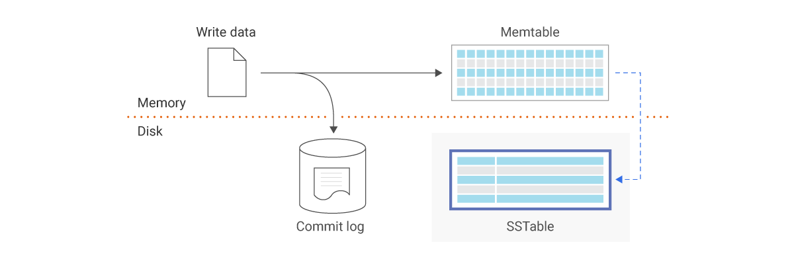
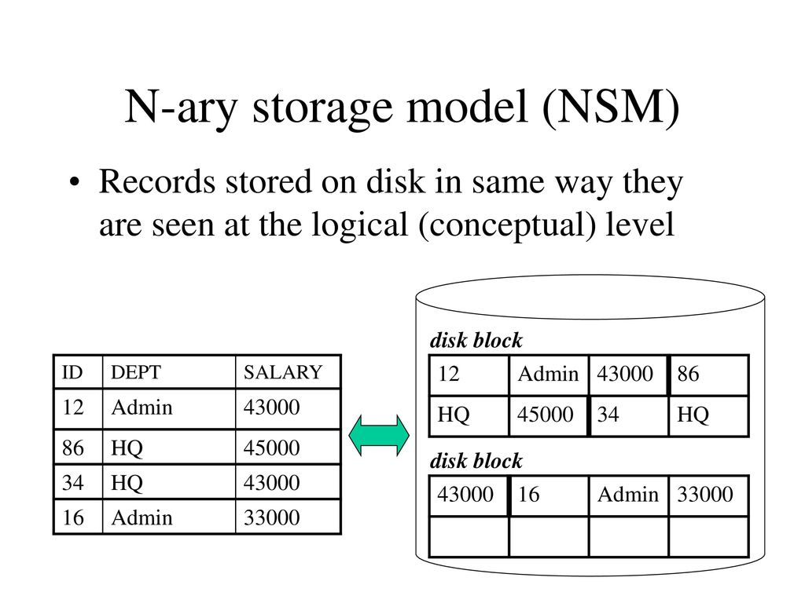

<div dir='rtl'>
    <div align="center">
        <div style="font-size:40px">
            <b>
            به نام خدا
            </b>
        </div>
        <p> <b style="font-size:16px">نویسندگان:</b> محمد نامدار، امیرمحمد محمدی، سجاد فقفور مغربی
        </p>
        
    </div>

# مفاهیم اولیه

## پایگاه داده

پایگاه داده مجموعه ای سازمان یافته از اطلاعات یا داده های ساختار یافته است که در یک سیستم کامپیوتری ذخیره می شود. یک پایگاه داده معمولاً توسط یک سیستم مدیریت پایگاه داده (DBMS) کنترل می شود. با هم، داده ها و DBMS، همراه با برنامه های کاربردی مرتبط با آنها، به عنوان یک سیستم پایگاه داده نامیده می شوند که اغلب به یک پایگاه داده خلاصه می شود.

داده‌های موجود در رایج‌ترین انواع پایگاه‌های داده که امروزه در حال کار هستند، معمولاً در ردیف‌ها و ستون‌ها در مجموعه‌ای از جداول مدل‌سازی می‌شوند تا پردازش و پرس و جوی داده‌ها کارآمد باشد. سپس داده ها را می توان به راحتی در دسترس، مدیریت، اصلاح، به روز رسانی، کنترل و سازماندهی کرد. اکثر پایگاه های داده از زبان پرس و جو ساخت یافته (SQL) برای نوشتن و جست و جوی داده ها استفاده می کنند.

## پایگاه داده NoSql

نوع NoSQL یا پایگاه داده غیررابطه ای اجازه می دهد تا داده های بدون ساختار و نیمه ساختار یافته ذخیره و دستکاری شوند (برخلاف یک پایگاه داده رابطه ای، که تعریف می کند چگونه تمام داده های درج شده در پایگاه داده باید ترکیب شوند). پایگاه داده های NoSQL با رایج شدن و پیچیده تر شدن برنامه های کاربردی وب محبوبیت پیدا کردند.


 <div dir="rtl">

در حقیقت leveldb یک پایگاه داده NoSql است. دقت شود NoSql به معنای Not-Only Sql است.

## Bigtable

طبق صفحه ویکی‌پدیا leveldb این دیتابیس مبتنی بر Google's **Bigtable** database system
است.

با توجه به اینکه leveldb
از Bigtable متاثر است خوب است در ابتدا کمی با آن آشنا شویم.

در واقع Bigtable یک جدول sparse
است که می تواند به میلیاردها سطر و هزاران ستون مقیاس شود و کاربر را قادر می سازد تا ترابایت ها یا حتی پتابایت ها داده را ذخیره کنید. یک مقدار در هر ردیف نمایه می شود. این مقدار به عنوان کلید ردیف شناخته می شود. Bigtable برای ذخیره مقادیر بسیار زیاد داده های با یک کلید و همینطور با تأخیر بسیار کم ایده آل است.
از توان خواندن و نوشتن بالا با تاخیر کم پشتیبانی می کند.
همینطور برای Map-Reduce ایده آل است.

##

# تاریخچه

پایگاه داده LevelDB یک کتابخانه پایگاه داده متن باز (open-source) برای ذخیره و دسترسی به اطلاعات است که توسط Google توسعه یافته است، درواقع LevelDB یک پایگاه داده کامل نیست بلکه کتابخانه است که روش ذخیره و بازیابی اطلاعات را روی سیستم شما مشخص میکند.

در سال 2004 شرکت Google اقدام به توسعه پایگاه داده ای به نام Cloud Bigtable کرد که الهام بخش توسعه LevelDB شد.  
[Bigtable](https://cloud.google.com/bigtable, "Google Cloud Bigtable") یک پایگاه داده NoSQL با سرعت بالا و مقیاس پذیر است که با زیان C++ نوشته شده و به طور خاص برای دخیره و تحلیل داده های حجیم بهینه شده است و به عنوان زیرساخت در اغلب سرویس های گوگل مثل Google map، Google Drive و ... استفاده میشود.  
[Sanjay Ghemawat](https://research.google/people/SanjayGhemawat/) و [Jeffrey Dean](https://research.google/people/jeff/) ایده اصلی خود برای توسعه LevelDB را از Bigtable گرفتند اما تصمیم داشتند برخلاف آن که در مالکیت گوگل بود و متن باز نبود، پایگاه داده خود را متن باز و تحت مجوز [BSD](https://github.com/google/leveldb/blob/main/LICENSE, "BSD licenses") بسازند. توسعه LevelDB از سال 2011 آغاز و با زبان C++ نوشته شد. کد اصلی آخرین ورژن این کتابخانه (v1.23) نیز در گیت هاب در [این آدرس](https://github.com/google/leveldb, "Gtihub LevelDB") قابل دسترسی و برسی است.

# ساختار

## آشنایی

در خقیقت LevelDB یک تناظر کلید/مقدار است که توسط گوگل ساخته شده است. می‌تواند از تناظر مرتب(در برخی از کوئری‌ها مثل join این فیچر مهم است.) از کلیدهای رشته به مقادیر رشته پشتیبانی کند.
پشتوانه leveldb
ساختار structured merge tree
است.
این ساختار write-optimized شده‌ی
‌ساختمان داده B-tree است.

## حضور checkpoint ها

هنگامی که فایل لاگ عملیات بیش از حد مجاز را نشان ‌می‌دهد، checkpoint انجام می‌شود. داده ها روی دیسک ریخته می شوند.
در اینجا compaction scheme صدا زده می‌شود
بعد از این داده در سطوح دسترسی همینطور پایینتر می‌رود.
موازی با‌ آن leveldb لاگ‌فایل‌های جدید ایجاد می‌کند و سیستم را متناسب با تغییرات بالانس می‌کند.

## همزمانی

در اصل Leveldb فقط به یک فرآیند اجازه می دهد در یک زمان باز شود. سیستم عامل مربوطه از شمای قفل برای جلوگیری از دسترسی همزمان استفاده خواهد کرد. در یک فرآیند، Leveldb می تواند توسط چندین رشته قابل دسترسی باشد. برای چند نویسنده، فقط به اولین نویسنده اجازه می دهد تا در پایگاه داده بنویسد و سایر نویسندگان مسدود خواهند شد. برای تداخل خواندن و نوشتن، خوانندگان می توانند داده ها را از غیرقابل تغییر که از فرآیند نوشتن جدا شده است، بازیابی کنند. نسخه به روز شده در فرآیند فشرده سازی اعمال می شود.

اگر کمی تکنیکال تر بخواهیم توضیح دهیم

یک پایگاه داده می تواند تنها با یک فرآیند در یک زمان باز شود. پیاده سازی leveldb یک قفل از سیستم عامل برای جلوگیری از سوء استفاده می گیرد. در یک فرآیند واحد، یک شی leveldb::DB ممکن است به طور ایمن توسط چندین رشته همزمان به اشتراک گذاشته شود. به عنوان مثال، رشته‌های مختلف ممکن است در تکرارکننده‌ها بنویسند یا واکشی کنند یا Get در پایگاه داده یکسانی را بدون همگام‌سازی خارجی فراخوانی کنند (پیاده‌سازی leveldb به طور خودکار همگام‌سازی مورد نیاز را انجام می‌دهد). با این حال، اشیاء دیگر (مانند Iterator و WriteBatch) ممکن است به همگام سازی خارجی نیاز داشته باشند. اگر دو thread چنین شیئی را به اشتراک بگذارند، باید با استفاده از پروتکل قفل خود از دسترسی به آن محافظت کنند.

## فشرده‌سازی

هر بلوک قبل از اینکه در ذخیره سازی دائمی نوشته شود به صورت جداگانه فشرده می شود. فشرده‌سازی به‌طور پیش‌فرض روشن است، زیرا روش فشرده‌سازی پیش‌فرض بسیار سریع است و به‌طور خودکار برای داده‌های غیر قابل فشرده‌سازی غیرفعال می‌شود. در موارد نادر، برنامه‌ها ممکن است بخواهند فشرده‌سازی را به طور کامل غیرفعال کنند که از این پشتیبانی می‌کند.

مربوط به غیرفعال‌سازی:

<div dir="ltr">

```golang
leveldb::Options options;
options.compression = leveldb::kNoCompression;
... leveldb::DB::Open(options, name, ...) ....
```

<div dir="rtl">

## مدل‌سازی داده‌ای

ذخیره کلید/مقدار از نگاشت کلید به مقدار مربوطه پشتیبانی می کند. در SSTable شمای کلید و مقدار به شکل دنباله رشته مجاور مدیریت می شود.

ولی SSTABLE چیست؟
جدول رشته‌های مرتب شده (SSTable) یک فرمت فایل stable است که توسط Scylla، Apache Cassandra و دیگر پایگاه‌های داده NoSQL استفاده می‌شود تا داده‌های درون حافظه ذخیره‌شده در memtable ‌ها را بگیرد، آن‌ها را برای دسترسی سریع مرتب کند، و آن‌ها را روی دیسک به‌صورت دائمی و مرتب ذخیره کند. مجموعه ای از فایل های تغییرناپذیر Immutable به این معنی است که SSTables هرگز اصلاح نمی شوند. آنها بعداً در SSTable های جدید ادغام می شوند یا با به روز رسانی داده ها حذف می شوند.



## نمایه‌سازی

از skip list در MemTable استفاده می کند. جدای از آن، LSM-tree یکی از انواع B-tree های بهینه شده برای نوشتن است که از جفت های کلید-مقدار تشکیل شده است. LSM-tree یک نوع ذخیره سازی است که برای درج و حذف بهینه شده است. در یک کلام بخواهیم بگوییم LevelDB یک پیاده سازی LSM-tree منبع باز است.

درباره LSM-tree:

| ALGORITHM  | Ave. Case | Worst Case |
| ---------- | --------- | ---------- |
| INSERT     | O(1)      | O(1)       |
| Find-Min   | O(N)      | O(N)       |
| Delete-Min | O(N)      | O(N)       |

## سطوح ایزوله

استیت پایگاه داده را در یک نقطه مشخص ذخیره می کند و از ارجاع به آن پشتیبانی می کند. کاربران می توانند داده ها را از اسنپشات فوری خاص در زمان ایجاد اسنپشات بازیابی کنند.

برای توضیح تکنیکال تر:

به شکل کلی Snapshot ها نماهای سازگار read-only را در کل state کلید/مقدار ارائه می کنند. ReadOptions::snapshot ممکن است غیر NULL باشد تا نشان دهد که خواندن باید در نسخه خاصی از وضعیت DB عمل کند. اگر ReadOptions::snapshot NULL باشد، خواندن بر روی یک snapshot ضمنی از وضعیت فعلی عمل خواهد کرد.

به طور کل Snapshot ها توسط متد DB::GetSnapshot ایجاد می شوند:

<div dir="ltr">

```c++
leveldb::ReadOptions options;
options.snapshot = db->GetSnapshot();
... apply some updates to db ...
leveldb::Iterator* iter = db->NewIterator(options);
... read using iter to view the state when the snapshot was created ...
delete iter;
db->ReleaseSnapshot(options.snapshot);
```

<div dir="rtl">

## قابلیت logging

قبل از هر درج (insert)، به روز رسانی (update) یا حذف (delete)، سیستم باید پیامی را برای ثبت در فایل لاگ اضافه کند(logging message). در صورت خرابی اطلاعات در یک رشته دسترسی، پیام های لاگ ارسال نشده به هادر دیسک (level_0) را می توان بدست آورد و برای بازیابی اطلاعات مجددا عملیات انجام داد. در واقع هنگام لاگ کردن LevelDB از memtable  ای که اصلاعات را در آن مینویسد یک immutable memtable میسازد که بعدا قابلیت دسترسی مجدد را برای ما فراهم میکند.

کلاس **Logger** تعریف شده در _include/leveldb/env.h_ و پیاده سازی شده در _util/posix_logger.h_ و  یک کلاس لاگ است که اطلاعات قابل خواندن را چاپ می کند. چندین روش برای لاگ نوشتن در سیستم، در _util/logging.h_ اعلام شده است:
<div dir="ltr">

```c++
/* add numbers after str */
extern void AppendNumberTo(std::string* str, uint64_t num);
/* Add visible string value after str */
extern void AppendEscapedStringTo(std::string* str, const Slice& value);
/* number to string */
extern std::string NumberToString(uint64_t num);
/* Clear invisible characters in value */
extern std::string EscapeString(const Slice& value);
/* If the first character of "in" is the second parameter "c", advance the "in" pointer one step and return true */
extern bool ConsumeChar(Slice* in, char c);
/* Consume "in" prefix number */
extern bool ConsumeDecimalNumber(Slice* in, uint64_t* val);
```

</div>

## ساختار Storage

داده ها را بر اساس زمان دسترسی در  یک memtable قرار می دهد و به صورت دوره ای (لاگ ورودی) داده ها را از آن به Immutable memtable منتقل می کند. پس از پر شدن memtable اطلاعات آن را در سطح هارد برده درون SSTable  ها میریزد. به علاوه، از روش فشرده سازی (compaction) برای کاهش داده های نامعتبر در هر سطح دسترسی استفاده می کند و سپس بلوک های جدید در سطح بعدی ایجاد می کند.   
برای خواندن از پایگاه داده و کوئری زدن، LevelDB از mmap در سیستم های Unix و از syscall در Windiws برای خواندن SSTable ها و کش کردن آن ها در حافظه RAM استفاده میکند.

## مدل‌سازی Storage

بخش ذخیره سازی هادر دیسک از بلوک های SSTable تشکیل شده است که از مدل ذخیره سازی N-ary(NSM) پیروی میکنند، به این صورت که در انتهای هر بلوک آدرس شروع بلوک بعدی قرار دارد.   



## معماری سیستم

معماری کلی این پایگاه داده در یک نگاه از تصویر زیر بدست می آید.   


در LevelDB اطلاعات به صورت غیرقابل تغییر(immutable) روی دیسک ذخیره می شود که می تواند توسط رشته های مختلف به اشتراک گذاشته شود. فضای ذخیره متشکل از 7 سطح در هارد دیسک، به اضافه حداکثر دو جدول در حافظه RAM است.  
پروسه نوشتن اطلاعات را می‌توان به این صورت توصیف کرد که: ابتدا سیستم عملیات نوشتن را در یک جدول درون حافظه، به نام memtable، به طور موقت انجام میدهد و زمانی که این جدول پر می‌شود، داده‌ها را به دیسک منتقل می‌کند. بر روی دیسک، جداول در سطوحی دسته بندی شده اند. هر سطح شامل چندین جدول  SSTable است. سطح های پایین تر ظرفیت بیشتری نسبت به سطح های بالا تر دارند. هنگامی که سطح بالا پر میشود، سیستم باید داده ها را به سطح پایین منتقل کند، که در نتیجه نیاز به خواندن و نوشتن چندین SSTable دارد.
# عملکرد (Performance)

# عملکرد (Performance)

# روش نصب و راه اندازی
نصب و راه اندازی leveldb در ماشین Linux(Ubuntu):
- 
- به روز رسانی نمایه بسته ها:

```$ sudo apt update```
- نصب و راه اندازی بسته های مورد نیاز (sqlite3):

```apt-get install libsnappy-dev wget curl build-essential cmake gcc sqlite3```
- بارگیری  leveldb (با توجه به آخرین نسخه در گیت):

```wget https://github.com/google/leveldb/archive/${last_version}.tar.gz -O leveldb.tar.gz```
- باز کردن بسته بارگیری شده:

```tar xvf leveldb.tar.gz```
- رفتن به پوشه استخراج شده:

```cd leveldb*/```
- ایجاد و رفتن به پوشه build:

```mkdir -p build && cd build```
- نصب نهایی leveldb:

```cmake -DCMAKE_BUILD_TYPE=Release .. && cmake --build .```
# LevelDB با NodeJS
برای شروع کار با level db در nodejs ابتدا باید بسته های مورد نیاز را نصب کرد:
- نصب با استفاده از pip:
<div dir="ltr">

```
pip install level
pip install level-sublevel
  ```
</div>

- نصب با اضافه کردن به packages.json:
<div dir="ltr">

```
  "dependencies": {
    "level": "^7.0.1",
    "level-sublevel": "^6.6.5"
  }
  ```
</div>

سپس می توان با استفاده از این بسته ها پایگاه داده را ایجاد کرد:
<div dir="ltr">

```
  this.options = options;
  this.db = sublevel(level(dbPath, { valueEncoding: "json" }));
 ```
</div>
سپس می توان با استفاده از این اشیائ ایجاد شده می توان با پایگاه داده کار کرد؛ برای مثال:
<div dir="ltr">

```
   db.put(key, value, (error) => {
       callback(error);
   });
 ```
</div>
مثالی از نحوه استفاده leveldb در nodejs در پوشه examples وجود دارد.

# LeveDB با GO

# references

<div dir="ltr">

- [What is Database?](<https://www.oracle.com/database/what-is-database/#:~:text=A%20database%20is%20an%20organized,database%20management%20system%20(DBMS).&text=Most%20databases%20use%20structured%20query,for%20writing%20and%20querying%20data.>)

- [BIGTABLE :: About inspirations of LEVELDB](https://cloud.google.com/bigtable/docs/overview)

- [LEVELDB :: Some more details](https://dbdb.io/db/leveldb)

- [github repo](https://github.com/google/leveldb)

</div>
