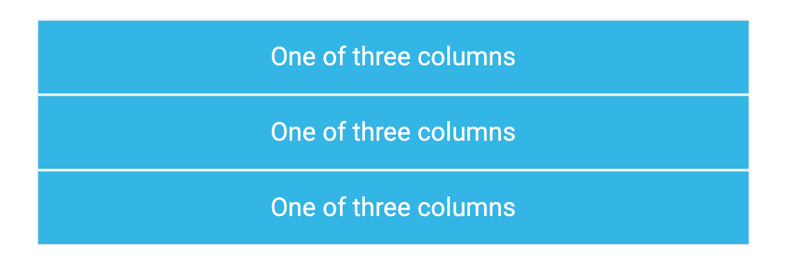
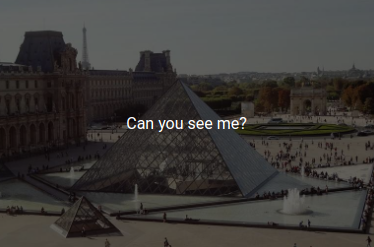
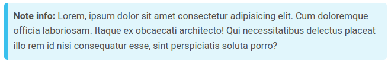

<div dir="rtl">

# کتاب‌خانه‌ی MDBootstrap

## نویسندگان

- سید پارسا نشایی
- محمدطه جهانی‌نژاد
- محمدحسین قیصریه

# مقدمه

ممکن است پیش از خواندن این مقاله، با Bootstrap از قبل آشنا بوده باشید؛ کتاب‌خانه‌ای عمدتا بر پایه‌ی CSS که وظیفه‌ی آن، ساده‌تر کردن طراحی ظاهر وب‌سایت‌ها به کمک کلاس‌ها و modifier
های از پیش تعریف شده است. بوت‌استرپ - که در این مقاله با اصول کلی آن نیز آشنا می‌شویم - ابزارهایی ساده‌تر برای ایجاد یک طراحی زیبا و قابل اعتماد را در اختیار طراح فرانت‌اند قرار می‌دهد.

یکی از انتقاداتی که برخی به بوت‌استرپ وارد می‌کنند، ساده و plain بودن نسبی برخی طراحی‌های خروجی از آن و کاملا هماهنگ نبودن با اصول طراحی جدید - مانند طراحی متریال - است؛ کتاب‌خانه‌ی MDBootstrap راه حلی برای این مشکل بوده و به کمک آن می‌توانیم طراحی وب‌سایت‌های Bootstrap خود را بر اساس اصول طراحی متریال انجام دهیم. 

# آن‌چه در این مقاله می‌بینیم

- آشنایی با مفاهیم Bootstrap که پیش‌نیاز استفاده از این کتاب‌خانه هستند
- آشنایی با طراحی متریال
- آشنایی با کامپوننت‌های اصلی MDBootstrap

# مفاهیم Bootstrap

اصول Bootstrap به گونه‌ای طراحی شده‌اند که اکثر مشکلاتی که در فرانت‌نویسی خام (به کمک HTML و CSS و JavaScript خام و بدون استفاده از ابزارها و کتاب‌خانه‌های کمکی) پیش می‌آیند، خود به خود توسط بوت‌استرپ حل شوند و نیازی به دخالت برنامه‌نویس و چک حالات خاص نباشد. در ادامه، برخی از اصول اصلی بوت‌استرپ که کتاب‌خانه‌ی MDBootstrap نیز بر پایه‌ی آن‌ها بنا شده است را با یک‌دیگر بررسی می‌کنیم:

## طراحی Responsive

یکی از اصول درنظرگرفته شده در طراحی داخلی کامپوننت‌های کتاب‌خانه‌های خانواده‌ی Bootstrap، طراحی Responsive آن‌ها و سازگاری آن با اندازه‌ی صفحات مختلف است. این کامپوننت‌ها اصطلاحا به شکل mobile-first طراحی شده‌اند، یعنی طراحی در نظر گرفته شده برای آن‌ها در ابتدا، مخصوص اندازه‌ی صفحه‌ی موبایل بوده (که با توجه به کوچک بودن نسبی اندازه‌ی آن نسبت به تبلت‌ها، لپ‌تاپ‌ها و سایر رایانه‌ها، به طراحی متفاوتی نیازمند است و تنها تغییر اندازه‌ها کافی نیست) و برای مناسب کردن طراحی برای صفحات بزرگ‌تر، لازم است کلاس‌های CSS ای را به کامپوننت‌ها **افزود**؛ این روند، بر خلاف روند بسیاری از طراحان وب است که سعی می‌کنند ابتدا ظاهری برای وب‌سایت دسکتاپ طراحی کرده و سپس با دستکاری کلاس‌های CSS خود، طراحی خود را برای موبایل نیز بهینه کنند.

برای تحقق مشی mobile-first، بوت‌استرپ در اکثر مواقع، از query های min-width به جای max-width استفاده می‌کند تا حالت پیش‌فرض طراحی، مناسب موبایل باشد و در حالت دسکتاپ، کلاس‌هایی به کامپوننت‌ها که آن‌ها را مناسب فضای بزرگ‌تر می‌کنند، به طراحی اضافه شود.

این مشی، ممکن است در ابتدا برای برنامه‌نویس فرانت‌اند، محدودکننده به نظر آید، اما هم‌اکنون در جهانی زندگی می‌کنیم که بسیاری از کاربران، توسط صفحات کوچک مانند تلفن‌های هوشمند (و حتی کوچک‌تر، مانند ساعت‌های هوشمند) از اپلیکیشن‌ها و وب‌سایت‌های ما استفاده می‌کنند و با در نظر گیری شرایط کنونی کاربران، مشی استفاده شده در بوت‌استرپ، منطقی به نظر می‌رسد.

## کلاس‌ها و modifier ها

ساختار کلی استفاده از یک کامپوننت بوت‌استرپ، به شرح زیر است:
ابتدا تگ HTML5 مربوطه را در کد HTML وب‌سایت قرار می‌دهیم.
نام یک کلاس پایه (base class) بوت‌استرپ را در صفت class تگ اضافه شده می‌نویسیم. به عنوان مثال، از کلاس btn برای طراحی کامپوننت دکمه (button) استفاده می‌شود. در این کلاس، خواصی که برای تمام دکمه‌ها  در طراحی متریال بوت‌استرپ مشترک است، آورده شده‌اند؛ مثلا، ضخامت حاشیه‌ی دکمه (border-width) یا ابعاد و فاصله‌ی حاشیه‌ی دکمه تا محتویات درون خود (padding). توجه کنید که مواردی مانند رنگ پس‌زمینه‌ی دکمه یا رنگ حاشیه - که بسته به این‌که دکمه به چه نقشی در UI وب‌سایت استفاده شده، متفاوت‌اند - را نباید توسط کلاس‌های پایه مشخص کرد.
نام یک تغییردهنده (modifier) بوت‌استرپ را به لیست کلاس‌های تگ می‌افزاییم. به عنوان مثال، از کلاس btn-primary برای دادن رنگ متن، پس زمینه، حاشیه و سایر مواردی که دکمه‌ی اصلی یک فرم را از دکمه‌های فرعی مجزا می‌کنند به دکمه استفاده می‌شود. توجه کنید که لازم است حتما در ابتدا یک کلاس پایه به تگ تخصیص داده شده باشد تا اثر modifier ها روی تگ، معنادار باشد. به عبارت دیگر، نقش modifier ها، تکمیل و خاص‌سازی خواص تعریف شده در کلاس‌های پایه برای یک کامپوننت است.

## ترجیح دادن HTML و CSS به JavaScript
در مرورگرهای وب، عمدتا سرعت پردازش کدهای HTML و CSS بیش‌تر از جاوااسکریپت است، زیرا بر خلاف جاوااسکریپت که به تفسیر نیازمند است، کدهای HTML و CSS تنها یک توصیف به سادگی قابل پردازش از صفحه‌ی وب هستند. در نتیجه، بوت‌استرپ تا حد امکان، استایل‌های موجود را در کدهای HTML و CSS تعریف کرده است؛ البته، کدهای جاوااسکریپت نیز در آن وجود دارند.

## هماهنگی با تگ‌های HTML5

می‌دانیم که صرف تعیین یک کلاس برای یک تگ به جهت style دادن به آن کافی است، اما تنها style و کارایی نیست که یک کامپوننت را مشخص می‌کند، بلکه معنای semantic کامپوننت‌ها در موارد زیادی هم‌چون ساخت صفحات accessible برای افراد دارای ناتوانی‌های جسمی، اهمیت بسیار بالایی دارد؛ از این رو، بوت‌استرپ برنامه‌نویس را ملزم می‌کند که افزون بر تخصیص کلاس‌های پایه (مانند btn)، به استفاده‌ی درست از تگ‌های HTML نیز بپردازد (مانند <button>).

## کلاس‌های Utility

این کلاس‌ها، ویژگی به نسبت جدیدتری از بوت‌استرپ هستند که برای خلاصه‌سازی دستورات CSS طراحی شده‌اند؛ به عنوان مثال، می‌توان به جای display: block از کلاس d-block استفاده کرد. کلاس‌های Utility، نیاز به نوشتن CSS های دستی توسط برنامه‌نویس را کاهش داده و در نتیجه در سرعت بارگذاری صفحه موثر هستند.

# طراحی متریال

طراحی متریال، مجموعه‌ای از قواعد طراحی شده توسط طراحان شرکت گوگل برای برنامه‌نویسان فرانت‌اند و نیز اپلیکیشن‌های موبایل و دسکتاپ است که به دلیل حمایت گسترده‌ی گوگل و استفاده‌ از آن در محصولات مشهور خود، جای خود را در میان مردم به عنوان یک طراحی زیبا و فکر شده، باز کرده است.

این طراحی شامل دو بخش اساسی عناصر طراحی (شامل کامپوننت‌هایی اساسی هم‌چون کارت‌ها) و نیز انیمیشن‌هاست که طراحی دقیق آن‌ها مطابق اصول طراحی توصیه شده توسط گوگل و پیاده‌سازی آن‌ها به کمک HTML و CSS دشوار است، اما کتاب‌خانه‌هایی مانند MDBootstrap ساخته شده‌اند که خود در طراحی کامپوننت‌هایشان، این اصول را رعایت کرده‌اند و به عنوان برنامه‌نویس، تنها کافی است از این کتاب‌خانه‌ها به عنوان پوششی با طراحی متریال روی بوت‌استرپ استفاده کنیم. به کمک این کتاب‌خانه، می‌توان رنگ‌بندی‌های اساسی صفحه را نیز مطابق پالت‌های رنگی تعبیه شده در طراحی متریال تنظیم کرد.

برای اطلاع از جزئیات طراحی متریال، می‌توانید به وب‌سایت material.io رجوع کنید (در زمان نگارش این مطلب، استفاده از ابزارهای تغییر آی‌پی برای دسترسی به این وب‌سایت ضروری است).

# نحوه‌ی نصب Bootstrap

برای نصب Bootstrap کافی است پکیج ارائه شده در این لینک را دانلود و در پوشه‌ی پروژه‌ی خود قرار دهید:

https://mdbootstrap.com/download/mdb-ui-kit/free/3101x7a4e5fe381fb26b/MDB5-STANDARD-UI-KIT-Free-3.10.1.zip

امکان نصب این کتاب‌خانه به کمک استفاده از CDN ها و یا با ابزار CLI معرفی شده در لینک زیر نیز وجود دارد:

https://mdbootstrap.com/docs/standard/getting-started/installation/#section-mdb-cli

توجه شود که برای استفاده از CLI لازم است NPM روی سیستم نصب باشد.

# برخی از مفاهیم کلی layout ها در بوت‌استرپ

سیستم کلی کارکرد و چینش اجزای صفحه در یک صفحه‌ی مجهز به بوت‌استرپ، به شکل grid است. احتمالا با grid ها از طریق مطالعه‌ی اصول CSS آشنا هستید؛ grid های بوت‌استرپ، نسخه‌ای ساده شده و در عین حال پیشرفته از grid های خام صفحات وب هستند. در ادامه، با این سیستم که در فهم باقی مطلب لازم است، آشناتر می‌شویم.

سیستم grid بوت‌استرپ، برای جایابی کامپوننت‌ها درون صفحه به کمک ساختار جدولی (با مشخص کردن سطر و ستون) طراحی شده است؛ طراحی داخلی این سیستم توسط flexbox انجام شده و اصول mobile-first بودن که پیش‌تر در خصوص آن صحبت شد نیز به تمامی در آن رعایت شده است.

برای طراحی یک جدول با سه ستون، می‌توانیم به شکل زیر عمل کنیم:

<div dir="ltr">
     
```html
<div class="container">
	<div class="row">
		<div class="col-md"> One of three columns </div>
		<div class="col-md"> One of three columns </div>
		<div class="col-md"> One of three columns </div>
	</div>
</div>
```

</div>
  
قطعه کد فوق، در ابتدا از یک container استفاده کرده است که کلاس پایه‌ی طراحی grid ها در بوت‌استرپ است و به تگ div اعمال می‌شود. بدون container، grid ها به درستی کار نخواهند کرد. درون container، یک row قرار گرفته که خود شامل سه ستون است.

نکته‌ی مهم در کد فوق آن است که اگر قطعه کد بالا روی دستگاه دسکتاپ اجرا شود، مطابق انتظار محتوا در ۳ ستون مشاهده می‌شود، اما در دستگاه موبایل - بسته به فونت و حجم مقدار داخل ستون‌ها - لزوما ۳ ستون در کنار یک‌دیگر جا نمی‌شوند و در نتیجه، در این شرایط، برای حفظ responsive بودن، بوت‌استرپ سه ستون را به شکل سه سطر زیر هم نمایش خواهد داد:



دو خاصیت در خصوص ستون‌ها قابل تنظیم است:

مقدار span شدن ستون‌ها - اگر بخواهیم یک ستون مساحتی بیش‌تر از یک دوازدهم عرض صفحه (مقدار پیش‌فرض) را اشغال کند، کلاس ستون را به شکل col-md-x می‌نویسیم که در آن x یک عدد از ۱ تا ۱۲ است و پس از اعمال این کلاس، عرض ستون برابر x دوازدهم کل صفحه خواهد شد.
کلمه‌ی md - به جای این کلمه، می‌توان از sm یا lg یا xl یا xxl نیز استفاده کرد که به ترتیب به معانی سایز کوچک، بزرگ، بسیار بزرگ و بسیار بزرگ هستند (خود md به معنای سایز متوسط بوده است) که کارایی آن در مشخص کردن نقطه‌ای است که اگر عرض صفحه از آن کم‌تر شود، ستون‌ها کل صفحه را فرا خواهند گرفت و فضای خالی در دو طرف آن‌ها وجود نخواهد داشت (تا از ابعاد کم صفحات کوچک به خوبی و تا حد امکان استفاده شود). هر چه‌قدر این کلمه به سمت مقادیر بزرگ‌تر برود، نقطه‌ی شکست در مقادیر بزرگ‌تری واقع خواهد شد. غالبا از md به عنوان نقطه‌ی شکست استفاده می‌شود.

## container-fluid

در کد بیان شده در فوق، خود جدول نیز از دو طرف صفحه فاصله دارد که سبب دیده شدن بهتر آن در یک نگاه در صفحات بزرگ می‌شود. برای از بین بردن این خاصیت و ۱۰۰ درصد کردن عرض جدول، می‌توانیم به جای کلاس پایه‌ی container، از container-fluid استفاده کنیم.


</div>

# بخش Content & Style
این بخش از کتابخانه‌ی MDBootstrap، مخصوص ابزارهایی کمکی برای شکل‌دهی و تولید محتوا برای وبسایت می‌باشد. از قسمت‌های مختلف آن می‌توان به عنوان رنگ‌های از پیش تعریف شده، متغیرهای مورد استفاده از کتابخانه، آیکون‌ها و دیگر امکانات استایل مانند سایه‌ها و اندازه فونت متن‌ها اشاره کرد. در ادامه به چند مورد از این موارد می‌پردازیم و جزئیات هرکدام را بیشتر بررسی می‌کنیم.

## رنگ‌ها
### رنگ‌های تعریف شده
در این کتابخانه تم‌ها و رنگ‌های از پیش تعریف شده و استانداردی وجود دارند. تم اصلی این کتابخانه از یک پالت ۸ رنگه استفاده می‌کند که به شرح زیر هستند:

- رنگ اولیه (Primary) که به رنگ <span style="color:'#1266F1'">آبی</span> می‌باشد.
- رنگ ثانویه (Secondary) که به رنگ <span style="color:'#B23CFD'">بنفش</span> می‌باشد
- رنگ عملیات موفق (Success) که به رنگ <span style="color: '#00B74A'">سبز</span> می‌باشد.
- رنگ خطا (Danger / Error) که به رنگ <span style="color: '#F93154'">قرمز</span> می‌باشد.
- رنگ هشدار (Warning) که به رنگ <span style="color:'#FFa900'">زرد</span> می‌باشد.
- رنگ اطلاع رسانی (Info) که به رنگ <span style="color:#39C0ED'">آبی کم‌رنگ</span> می‌باشد 
- رنگ روشن برای پس زمینه (Light) که همان رنگ سفید است.
- رنگ تیره برای پس زمینه (Dark) که همان رنگ سیاه می‌باشد.

تمامی این متغیرها درون فایل `scss/free/_variables.scss` قرار دارند و قابل دسترسی و تغییر هستند.
### نحوه استفاده از رنگ‌ها
همانطور که می‌دانیم این کتابخانه از تعداد زیادی کلاس css تشکیل شده که با اعمال آن‌ها روی تگ‌های htmlمان می‌توانیم استایل‌های آماده‌ی این کتابخانه را به آن‌ها اعمال کنیم. برای اعمال رنگ‌های مختلف، کافیست کلاسی به نام `itemName-colorName` را به آن اضافه کنیم.
مکان‌های مختلفی که رنگ‌ها را می‌توان در آن‌ها اعمال کرد عبارتند از: پس‌زمینه‌ها، متن‌ها، لینک‌ها و انواع کامپوننت‌ها (مانند دکمه‌ها و ...)
به عنوان مثال، اگر می‌خواهیم رنگ primary را برای پس زمینه‌ی یک div انتخاب کنیم، کلاس `bg-primary` را به این تگ اضافه می‌کنیم:
```html
<div class='bg-primary'>
	...
</div>
```
## آیکون‌ها
### آیکون‌های تعریف شده
در این کتابخانه به تعداد ۱۵۴۱ آیکون استاندارد تعریف شده و به صورت آماده وجود دارد که می‌توان در بخش‌های مختلف وبسایت از آن استفاده کرد. برای مشاهده و جستجو بین آیکون‌ها از [این لینک](https://mdbootstrap.com/docs/standard/content-styles/icons#mdb-search-form) استفاده کنید.
### نحوه استفاده از آیکون‌ها
هرکدام از آیکون‌ها یک نام منحصر به فرد دارند. با گذاشتن یک تگ `<i>` در فایل html و اعمال دو کلاس `fab` و `fa-iconName` آیکون در محل مورد نظر قرار می‌گیرد. چند مورد از آیکون‌های پر استفاده به همراه نحوه استفاده آن‌ها در ادامه آورده شده‌اند:
```html
<p><i class="fas fa-bars"></i></p>
<p><i class="fas fa-cog"></i></p>
<p><i class="fas fa-download"></i></p>
<p><i class="fas fa-ellipsis-v"></i></p>
<p><i class="fas fa-exclamation-circle"></i></p>
<p><i class="fas fa-map-marker-alt"></i></p>
```

## تصاویر
### ابزارهای موجود برای تصاویر
- تصاویر responsive: برای ساخت تصاویر responsive، کافیست کلاس `img-fluid` را به تگ `img` اضافه کنیم. به این صورت دو ویژگی max-width: 100% و height: auto به تصویر اعمال می‌شوند و باعث می‌شوند که تصویر هم عرض المان بالایی خود شود و در نمایشگرها با ابعاد مختلف، مشکلی بوجود نیاید.

- سایه‌ها: برای اضافه کردن افکت سایه به تصاویر، از کلاس‌های مخصوصی که برای اعمال سایه نوشته شده‌اند استفاده می‌کنیم. کلاس‌های مربوط به سایه در بخش بعدی به طور کامل بررسی می‌شوند.

- ماسک‌ها: می‌توان از تصاویر به عنوان ماسک برای یک نوشته و یا یک المان دیگر استفاده کرد. برای این کار، به این صورت عمل می‌کنیم: تگ تصویر و تگ المانی که می‌خواهیم روی آن ماسک شود را داخل یک `div` قرار می‌دهیم. سپس به المانی که می‌خواهیم به عنوان ماسک عمل کند، یک کلاس `mask` اضافه می‌کنیم. به عنوان مثال خروجی کد داده شده، مشابه تصویر زیر خواهد بود:
```html
<div class="bg-image">
  
  <div class="mask" style="background-color: rgba(0, 0, 0, 0.6);">
    <div class="d-flex justify-content-center align-items-center h-100">
      <p class="text-white mb-0">Can you see me?</p>
    </div>
  </div>
</div>
```


- چارچوب تصاویر: برای اعمال چارچوب‌ (border)های مختلف به تصاویر، از تعدادی کلاس از پیش تعریف شده استفاده می‌کنیم. سه کلاس پر کاربردتر عبارتند از `.rounded`، `.rounded-circle` و `.rounded-pill`. کلاس اول تنها اندکی گوشه‌های تصویر را گرد می‌کند. (در حدی که تیز نباشد) اما کلاس‌های دومی و سومی مقدار گردی بیشتری را اعمال می‌کنند تا حدی که قالب تصویر به صورت دایره و یا کپسول در می‌آید.

## سایه‌ها
### انواع سایه‌های مختلف
سایه‌ها دو ویژگی متغیر دارند:
1. مقدار پراکندگی سایه
2. جنس سایه (سخت یا نرم)

بسته به نوع المانی که می‌خواهیم برای آن سایه بگذاریم و بسته به مقدار بالا آمدگی که می‌خواهیم آن المان داشته باشد، این دو مقدار را تغیین می‌کنیم. پیشنهاد می‌شود برای المان‌هایی که پس زمینه تیره دارند، سایه‌هایی از جنس سخت استفاده شود. سایه‌های سخت مقدار تیرگی بیشتری دارند و در پس زمینه‌های تیره بهتر پیدا هستند.

برای افزودن سایه، کافیست کلاس `.shadow` را به همراه یک یا دو پسوند به المان اعمال کنیم. مقدار پراکندگی سایه که همان مقدار بالا آمدگی المان را نشان می‌دهد، توسط یک عدد بین ۰ تا ۵ تعیین می‌شود. (مقدار ۰ سایه با پراکندگی صفر می‌باشد و در این حالت سایه حذف می‌شود) به عنوان مثال افزودن کلاس `.shadow-5` یک سایه با پراکندگی حداکثر به المان اعمال می‌کند.
سایه‌ها به صورت پیش‌فرض از جنس نرم هستند. برای ایجاد سایه‌های سخت، از پسوند `-strong` استفاده می‌کنیم.

## نوشته‌ها
ابزارهای داده شده برای نوشته‌ها، بیشتر برای شبیه‌سازی برخی از تگ‌های آماده‌ی html هستند و در برخی موارد استایل‌های بیشتری را به المان‌ها اعمال می‌کنند.
- سرنوشته‌ها (heading):
برای اینکه بدون استفاده از تگ‌های `<h>`، شکل آن‌ها را شبیه‌سازی کنیم، کافیست کلاس‌های `.h1` تا `.h6` را به المان مورد نظر اعمال کنیم. به این صورت ظاهر تگ متناظر با کلاس شبیه‌سازی می‌شود ولی دارای استایل‌های بیشتر (مانند فونت زیباتر) می‌باشد.

- سرنوشته‌های نمایشی (display heading):
در حالتی که بخواهیم یکی از سرنوشته‌ها ظاهر متفاوتی داشته باشد، به جای کلاس `.h-Number` از کلاس `.display-Number` استفاده می‌کنیم. به این صورت المان مورد نظر ظاهری شبیه سرنوشته‌های قدیمی خواهد داشت.

- عناصر درون خطی (inline elements):
برخی از تگ‌های html مانند `<mark>`، `<small>`، `<s>` و `<u>` به صورت درون خطی عمل می‌کنند. برای اعمال ظاهری شبیه تگ‌های فوق (در حالتی که نخواهیم html پیچیده‌ای داشته باشیم و از خود تگ‌ها استفاده کنیم) می‌توانیم از کلاس هم‌نام هر تگ استفاده کنیم. کلاس `.mark` و `.small` مشابه دو تگ اول عمل می‌کنند. اما برای بدست آوردن نتیجه شبیه تگ‌های سوم و چهارم، از کلاس‌های زیر استفاده می‌کنیم:
`.text-decoration-line-through`
`.text-decoration-under-line`

- یادداشت‌ها (Note):
گاهی نیاز داریم که بخشی از یک متن، مثلا یک پاراگراف، به صورت یک قطعه یادداشت نمایش داده شود. برای این کار، از کلاس `.note` و `.note-Color` استفاده می‌کنیم که در کلاس دوم، مقدار color یکی از رنگ‌های معرفی شده در بخش‌های قبلی می‌باشد. به عنوان مثال، با اعمال دو کلاس `.note .note-info` روی یک پاراگراف، ظاهری شبیه زیر خواهیم داشت:


- تنظیم مکان متن‌ها (Alignment):
برای Align کردن متن‌ها به وسط و یا به سمت دیگر، از کلاس‌های کمکی `.text-center` و یا `.text-end` استفاده می‌کنیم. با استفاده از این کلاس‌ها، تمامی متن‌های داخل آن المان (چه مستقیم و چه غیر مستقیم) به سمت وسط و یا انتهای المان منتقل خواهند شد.

# بخش Components
بخش اصلی کتابخانه MDBootstrap مربوط به کامپوننت‌هایی است که در آن تعریف شده. این کامپوننت‌ها، بلاک‌های اصلی هر وبسایتی می‌باشند که می‌توانند در ظاهر بسیار اثر مثبت داشته باشند. در ادامه‌ی این بخش، تلاش می‌کنیم تا تعدادی از کامپوننت‌ها را تعریف کرده و نحوه‌ی استفاده از آن‌ها را توضیح دهیم.

## آکوردیون (Accordion)
آکوردیون‌ها المان‌هایی هستند که چندین آیتم شامل «تیتر + متن» را به صورت منو‌های بازشونده نمایش می‌دهند.
آکوردیون‌ها به صورت یک المان `div` هستند که هر آیتم درون آن‌ها نیز یک `div` می‌باشد. کلاس‌های مورد استفاده در آکوردیون‌ها نیز کلاس‌های زیر می‌باشند:
`.accordion .accordion-item .accordion-header .accodrion-button .accordion-collapse`
این کلاس‌ها به ترتیب برای تگ آکوردیون اصلی، تگ آکوردیون مربوط به هر آیتم، تگ تیتر آکوردیون، دکمه‌ی باز و بسته کردن هر آیتم و در نهایت بدنه‌ی هر آیتم می‌باشند.
به عنوان مثال، قطعه کد زیر مربوط به ساخت یک آکوردیون با یک آیتم می‌باشد:
```html
<div class="accordion" id="accordionExample">
  <div class="accordion-item">
    <h2 class="accordion-header" id="headingOne">
      <button
        class="accordion-button"
        type="button"
        data-mdb-toggle="collapse"
        data-mdb-target="#collapseOne"
        aria-expanded="true"
        aria-controls="collapseOne">
        Accordion Item #1
      </button>
    </h2>
    <div
      id="collapseOne"
      class="accordion-collapse collapse show"
      aria-labelledby="headingOne"
      data-mdb-parent="#accordionExample">
      
      <div class="accordion-body">
        <strong>This is the first item's accordion body.</strong> It is hidden by default,
        until the collapse plugin adds the appropriate classes that we use to style each
        element. These classes control the overall appearance, as well as the showing and
        hiding via CSS transitions. You can modify any of this with custom CSS or
        overriding our default variables. It's also worth noting that just about any HTML
        can go within the <strong>.accordion-body</strong>, though the transition does
        limit overflow.
      </div>
    </div>
  </div>
 /<div>
```

## کلید‌ها (Button)
برای دادن استایل اولیه به یک کلید، کافیست به تگ مورد نظر (ترجیحا تگ `<button>`) کلاس `.btn` را اضافه کنیم. به این صورت یک کلید با رنگ primary استاندارد خواهیم داشت. ویژگی‌های دیگری مانند فونت، تبدیل تمام حروف به UpperCase، سایه و افکت hover نیز به صورت خودکار اعمال خواهند شد.
#### رنگ‌های پس‌زمینه
برای ایجاد کلیدها با رنگ‌های متنوع، همانطور که در بخش رنگ‌ها بررسی شد، کافیست کلاس `.btn-ColorName` را در کنار کلاس `.btn` اضافه کنیم. به غیر از ۸ رنگ معرفی شده در بالا، یک نوع دیگر کلید وجود دارد که برای ایجاد لینک  استفاده می‌شود. این نوع کلید هیچ رنگ پس زمینه‌ای ندارد و رنگ نوشته‌ی آن همان رنگ primary می‌باشد. برای ایجاد این کلید کافیست از کلاس `.btn-link` استفاده کنیم.
#### اشکال مختلف کلیدها
کلید‌ها می‌توانند توپر (حالت پیش‌فرض) و یا تو خالی (outline) و با شکل‌های مختلف باشند. برای ایجاد یک کلید توخالی با رنگ‌های مختلف، از کلاس `.btn-outline-ColorName` استفاده می‌کنیم. (توجه کنید که در این حالت کلید به شکل لینک که در بخش قبل معرفی شد قابل اعمال نیست). برای تغییر شکل کلیدها و گرد کردن گوشه‌ها و تبدیل شکل دکمه به کپسول، از کلاس‌های rounded استفاده می‌کنیم. به این صورت که کلاس `.btn-rounded` را در کنار کلاس‌های دیگر (کلاس اصلی کلید و کلاس مربوط به رنگ) اضافه می‌کنیم و شکل دکمه تغییر می‌کند. توجه کنید که امکان استفاده از rounded با outline باهم نیز وجود دارد.
برای ایجاد دکمه‌هایی با ظاهر کاملا دایروی، از کلاس `.btn-floating` استفاده می‌کنیم. تنها مورد قابل ذکر این است که برای اینکه این کلاس به درستی کار کند، در داخل کلید نباید هیچ متنی وجود داشته باشد و تنها از آیکون‌ها (رجوع شود به بخش قبلی) استفاده شود. 
#### حالات و اندازه‌های مختلف
کلیدها به طور کلی در سه اندازه مختلف ارائه می‌شوند: کوچک، متوسط (پیش‌فرض) و بزرگ. برای ایجاد دکمه‌های کوچک‌تر از کلاس `.btn-sm` و برای ایجاد دکمه‌های بزرگتر از کلاس `.btn-lg` استفاده می‌کنیم.
کلیدها در دو حالت نیز می‌توانند باشند: فعال و غیر فعال - که در حالت پیش‌فرض فعال هستند. برای غیر فعال کردن یک کلید، یا کلاس `disabled` را به استایل‌های آن اضافه می‌کنیم و یا ویژگی (attribute) با اسم disabled را در آن المان فعال می‌کنیم. نتیجه‌ی نهایی هر دو روش یکسان خواهد بود.
