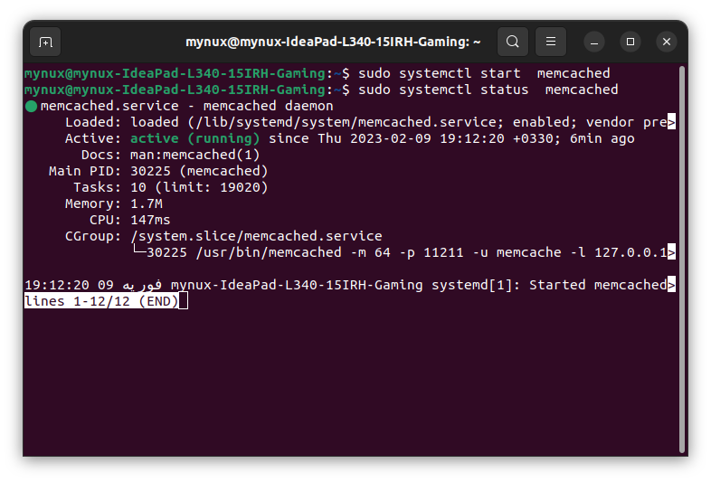
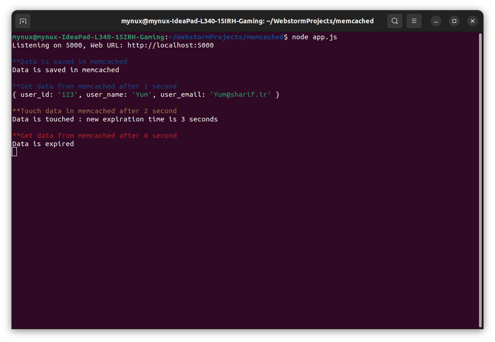
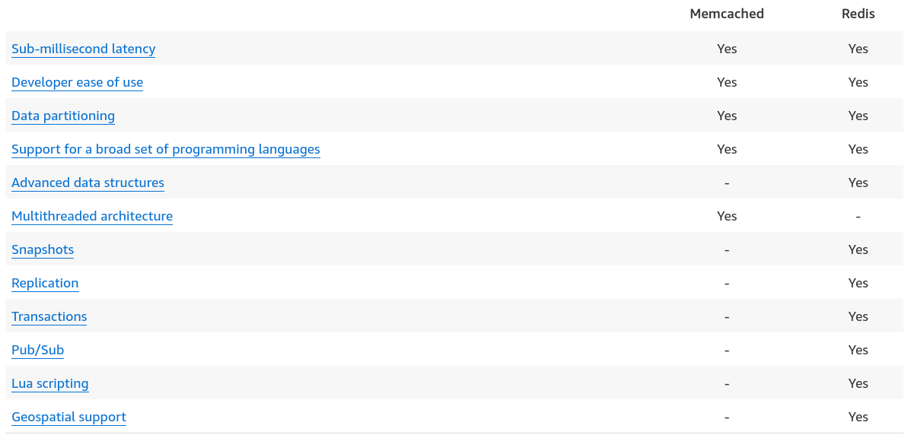

<div dir="rtl">

# Memcached

<p></p>

## 📝فهرست

- [مقدمه](#مقدمه)
- [ساختار کلی](#ساختار-کلی)
- [مراحل اجرا و نحوه کار کردن Memcached](#مراحل-اجرا-و-نحوه-کار-کردن-Memcached)
- [راه‌اندازی در سمت سرور](#راه‌اندازی-در-سمت-سرور)
- [نصب Memcached](#نصب-Memcached)
- [تنظیمات اجرا](#تنظیمات)
- [دستورهای اجرایی](#دستورهای-اجرایی)
- [راه‌اندازی در سمت کلاینت](#راه‌اندازی-در-سمت-کلاینت)
- [منابع](#منابع)

## ✍️نویسندگان

- [آرش یادگاری](https://github.com/Arash1381-y)
- [ایمان محمدی](https://github.com/Imanm02)
- [هستی کریمی](https://github.com/HastiKarimi)

<hr>

# مقدمه

سیستم Memcached، یک سیستم ذخیره‌سازی و کش کردن دیتا به صورت توزیع شده می‌باشد. 
با استفاده از Memecached می‌توانیم با ذخیره‌سازی داده‌ها در RAM، تعداد درخواست برای خواندن دیتا از پایگاه‌داده را کاهش دهیم.
از Memcached می‌توان بر روی سیستم‌عامل‌های unix based و microsoft windows استفاده نمود. همچنین یک پروژه open-source
می‌باشد که توسط Brad Fitzpatrick طراحی و سپس گسترش یافته است. شرکت‌های بزرگی مانند Reddis, Twitter youtube و … از این
سیستم استفاده‌ کرده‌اند. در ادامه تلاش خواهیم کرد با معرفی ساختار این سیستم و روش‌های استفاده کردن از آن، آشنا شویم.

# ساختار کلی

معماری memcached به صورت کلاینت-سرور می‌باشد. در سمت سرور یک جدول هش بسیار بزرگ وجود دارد که در آن کلید اصلی می‌تواند
تا ۲۵۰ بایت و مقدار متناظر می‌تواند تا حجمی برابر با ۱ مگابایت را اشغال کند. در نتیجه می‌توان داده‌های عددی تا
داده‌های حجیم تر مثل صفحات html را در آن ذخیره‌سازی‌کنیم.
همچنین سیستم‌طوری طراحی شده‌ است که از طریق TCP و UDP قابل دسترس باشد. در نتیجه سرور‌ها می‌توانند ساختار توزیع شده (distributed) و یا مجزا (separated) داشته باشند.
اگر حافظه‌ی کش پر شود، سیستم به طور اتوماتیک داده‌ی جدید را جایگزین قدیمی‌ترین داده می‌کند؛ در نتیجه باید از آن به عنوان یک
نوع کش گذرا (transitory cache) نام‌ برد.

به طور کلی می‌توان معماری Memcached را به چهار قسمت اصلی تقسیم کرد:

1. نرم‌افزار کاربر که به آن لیستی از سرور‌های قابل دسترس داده می‌شود.
2. یک الگوریتم هش که می‌توان با استفاده از آن، سرور مدنظر برای دریافت داده را شناسایی کرد.
3. سرور که در آن یک جدول هش بزرگ موجود است.
4. LRU که با استفاده از آن تصمیم‌گرفته می‌شود که داده جدید جایگزین شود و یا از داده قبلی استفاده شود.

# مراحل اجرا و نحوه کار کردن Memcached

با توجه به ساختار سیستم، مراحل اجرا به صورت زیر می‌باشد:

1. کاربر در ابتدا یک داده را جست‌وجو می‌کند و Memcached چک می‌کند که آیا داده مدنظر کش شده است یا خیر.
2. اگر داده مدنظر در کش موجود بود، آن داده را برگردانده می‌شود. در غیر این صورت، داده‌ی مدنظر در دیتابیس مورد جست‌وجو قرار
   می‌گیرد.
3. اگر زمان منقضی شدن یک داده گذشته باشد، کش آپدیت می‌شود تا از تازه بودن داده‌های در دسترس کاربر، اطمینان حاصل شود.

# راه‌اندازی در سمت سرور

در ادامه می‌خواهیم یک حافظه‌ی کش را با کمک Memcached ایجاد کنیم. دقت شود که تمامی دستورهای استفاده شده، بر روی سیستم لینوکس
قابل اجرا می‌باشد.

## نصب Memcached

برای نصب بر روی لینوکس (debian based system) می‌توان از دستور زیر استفاده نمود.

<div dir="ltr">

```bash
sudo apt-get install memcached
```

</div>

## تنظیمات اجرا

پس از نصب، یک فال کانفیگ ایجاد می‌شود که می‌توان با تغییر آن، نحوه‌ی اجرا شدن Memcached را کنترل کرد. در ادامه به معرفی
برخی از فلگ‌‌های موجود در کانفیگ می‌پردازیم.


<div dir="ltr">

- -m memory

</div>
میزان حافظه‌ای که از RAM به کش اختصاص داده می‌شود. در صورتی که حافظه اختصاص داده شده از حافظه‌ی موجود در RAM بیشتر باشد، از swap space استفاده می‌شود که سرعت پاسخ را به میزان زیادی کاهش می‌دهد.


<div dir="ltr">

- -p port

</div>

پورتی که برای کانکشن‌ها، با TCP مورد استفاده قرار می‌گیرد. مقدار اولیه آن برابر 18080 می‌باشد.

<div dir="ltr">

- -U port

</div>

پورتی که برای کانکشن‌ها، با UDP مورد استفاده قرار می‌گیرد. مقدار اولیه آن برابر 18080 می‌باشد.

<div dir="ltr">

- -c max_connections

</div>

حداکثر تعداد کانکشن‌هایی که می‌تواند همزمان رخ دهد. مقدار اولیه‌ آن برابر 1024 می‌باشد.

<div dir="ltr">

- -t number_of_threads

</div>

تعداد تر‌دهای مورد استفاده برای اجرا کردن درخواست‌ها. مقدار اولیه آن برابر 4 می‌باشد.

برای آشنایی بیشتر با فلگ‌های موجود در کانفیگ می‌توانید به رفرنس 3 مراجعه کنید.

## دستورهای اجرایی

به کمک systemctl می‌توانیم، دستورات اجرایی لازم را بنویسیم.

<div dir="ltr">

```bash
sudo systemctl start memcached
sudo systemctl stop memcached
sudo systemctl restart memcached
sudo systemctl status memcached
```

</div>

<p></p>

برای آنکه بتوانیم تحت ترمینال با Memcached ارتباط برقرار کنیم نیاز به کتاب‌خانه‌ی libmemcached-tools داریم که با استفاده از
دستور زیر نصب می‌شود.

<div dir="ltr">

```bash
sudo apt-get install libmemcached-tools
```

</div>

# راه‌اندازی Memcached در سمت کلاینت

همانطور که در بخش قبل دیدیم نیاز داریم تا یک نرم‌افزار سمت کلاینت داشته باشیم تا بتوانیم با سرور خود ارتباط برقرار کنیم.
به طور مثال می‌توان از Node js به همراه پکیج مربوط به Memcached که برای این آن طراحی شده است استفاده نمود. در ادامه با
استفاده از express سعی ‌خواهیم کرد تا یک برنامه کلاینت برای سرور خود بنویسیم.

## ایجاد یک اینستنس Memcached

لازم است که لیستی از سرورهای قابل دسترس را برای کلاینت مشخص کنیم. این کار را به کمک constructor کش ایجاد می‌کنیم.

<div dir="ltr">

```js
const Memcached = require('memcached');
const memcached = new Memcached(serverLocations, options);
```

</div>

مقدار server location در صورتی که تنها یک سرور موجود باشد، می‌تواند string باشد و در مواردی که خوشه‌ای از سرور‌ها وجود
دارد می‌توان از list و یا object تعریف کرد.

در آبجکت option می‌توانیم بیشینه مقدار کلید و مقدار را مشخص کنیم. همچنین اندازه connection pool به همراه دیگر موارد به
کمک option تعریف می‌شود.

<div dir="ltr">

```js
const connection_string = 'localhost:11211'; // use for single server
const memcached = new Memcached(connection_string, {
    maxKeySize: 250,  // max size of a key in bytes
    maxValues: 10000, // max size of the value in bytes
    poolSize: 10,     // number of connections to each memcached server
    algorithm: 'md5', // hash algorithm to use
});
```

</div>

در ادامه به برخی از APIهای مهم می‌پردازیم

## set

<div dir="ltr">

```js
memcached.set(key, value, lifetime, callback);
```

</div>

با استفاده از تابع set می‌توانیم یک کلید به همراه یک مقدار را به همراه مدت زمان expire شدن آن(به ثانیه) در کش ذخیره
کنیم. همچنین
از یک تابع callback در صورت رخ دادن error در هنگام ذخیره‌سازی استفاده می‌شود.

به مثال زیر توجه کنید:

<div dir="ltr">

```js
const data_chunk = {
    "user_id": "123",
    "user_name": "Yum",
    "user_email": "Yum@sharif.ir"
}


const data_token = 'ABCDEF1234567890';


memcached.set(data_token, data_chunk, 20, function (err) {
    if (err) console.error(err);
    else console.log('Data is saved in memcached');
});
```

</div>

## get

<div dir="ltr">

```js
memcached.get(key, callback);
```

</div>

با استفاده از تابع get می‌توانیم با داشتن کلید، به مقدار متناظر با آن کلید دست پیدا کنیم. همچنین از یک تابع callback در
صورت رخ دادن error و همچنین اجرای فرآیندهای لازم بر روی دیتا دریافتی استفاده می‌شود.

به مثال زیر توجه کنید:

<div dir="ltr">

```js
memcached.get(data_token, function (err, data) {
    if (err) console.error(err);
    else {
        console.log('Data is retrieved from memcached');
        console.log(data);
    }
});
```

</div>

## touch

<div dir="ltr">

```js
memcached.touch(key, lifetime, callback);
```

</div>

با استفاده از تابع touch می‌توانیم با داشتن یک کلید، زمان قابل‌قبول بودن داده را تغییر دهیم. همچنین از یک تابع callback
در صورت رخ دادن error در هنگام بهنگام‌سازی استفاده می‌شود.

به مثال زیر توجه کنید:

<div dir="ltr">

```js
memcached.touch(data_token, 3, function (err) {
    if (err) console.error(err);
    else console.log('Data is touched in memcached');
});
```

</div>

## نوشتن یک تست

حال می‌توانیم با استفاده از این دستوارت یک تست بنویسیم. فایل app.js را باز کنید و محتوای زیر را در آن قرار دهید.
(از نصب کتابخانه‌های مورد نیاز اطمینان حاصل کنید!)
<div dir="ltr">

```js
const express = require("express");


const app = express();
const port = Number(process.env.PORT || 5000);


const Memcached = require('memcached');


const connection_string = 'localhost:11211'; // use for single server
const memcached = new Memcached(connection_string, {
    maxKeySize: 250,  // max size of a key in bytes
    maxValues: 10000, // max size of the value in bytes
    poolSize: 10,     // number of connections to each memcached server
    algorithm: 'md5', // hash algorithm to use
});

// data we want to save in memcached
const data_chunk = {
    "user_id": "123",
    "user_name": "Yum",
    "user_email": "Yum@sharif.ir"
}

// token for data
const data_token = 'ABCDEF1234567890';

// set data in memcached. expire time is 20 seconds
memcached.set(data_token, data_chunk, 20, function (err) {
    console.log('\x1b[34m%s\x1b[0m', '\n**Data is saved in memcached');
    if (err) console.error(err);
    else console.log('Data is saved in memcached');
});


// try to get data after 1 second
setTimeout(function () {
    console.log('\x1b[34m%s\x1b[0m', '\n**Get data from memcached after 1 second');
    memcached.get(data_token, function (err, data) {
        if (err) console.error(err);
        else console.log(data);
    });
}, 1000);

// try to touch data after 2 seconds. 
// the new expiration time is 3 seconds (data is expired after 5 seconds)
setTimeout(function () {
    console.log('\x1b[33m%s\x1b[0m', '\n**Touch data in memcached after 2 second');
    memcached.touch(data_token, 3, function (err) {
        if (err) console.error(err);
        else console.log('Data is touched : new expiration time is 3 seconds');
    });
}, 2000);

// try to get data after 6 seconds (note that data is expired after 5 seconds)
setTimeout(function () {
    memcached.get(data_token, function (err, data) {
        console.log('\x1b[31m%s\x1b[0m', '\n**Get data from memcached after 6 second');
        if (err) console.error(err);
        else {
            if (!data) {
                console.log('Data is expired');
            }
        }
    });
}, 6000);

console.log("Listening on " + port + ", Web URL: http://localhost:" + port);
app.listen(port);

```

</div>

با استفاده از دستور زیر تست را اجرا کنید:

<div dir="ltr">

```bash
node app.js
```

</div>

در صورت اجرای موفقیت‌آمیز، خروجی زیر را مشاهده خواهید کرد:

<p></p>

# مقایسه Redis و Memcached

هر دو این سیستم‌ها با استفاده از ذخیره‌سازی in-memory سرعت زیادی در دریافت داده دارند همچنین این امکان را می‌دهند تا
داده را میان چنین node توزیع کرد که در صورت رشد داده‌‌ها بسیار کارآمد می‌باشد.
بر خلاف Redis، در Memcached داده‌ساختارهای متنوعی وجود ندارد به عبارتی در Redis علاوه بر ذخیره‌سازی رشته می‌توانستیم
انواع داد‌ه‌ساختار‌های دیگر مانند list, set, bit array و... را ذخیره‌سازی کنیم.
سیستم Memcached دارای معماری multi threading می‌باشد در نتیجه می‌توان با بهره بردن از هسته‌های پردازشی بیشتر، عملیات‌های
بیشتری انجام دهیم.
برخلاف Redis در سیستم Memcached نمی‌توان Replication ایجاد نمود. همچنین عملیات‌های transaction نیز غیرقابل اجرا است.

تصویر زیر یک مقایسه کلی را از این دو مدل کش داده نشان می‌دهد

<p></p>

# منابع

<div dir="ltr">

- [Memcached](https://memcached.org/)
- [What is Memcached?](https://medium.com/swlh/what-is-memcached-d1498623db3b)
- [What is Memcached?](https://www.keycdn.com/support/what-is-memcached)
- [Memcached Command-Line Options](https://docs.oracle.com/cd/E17952_01/mysql-5.6-en/ha-memcached-cmdline-options.html)
- [Node.js Memcached Client](https://iamrohit.in/nodejs-with-memcached-tutorial-for-beginner/)
- [Memcached npm](https://www.npmjs.com/package/memcached)
- [Redis vs Memcached](https://aws.amazon.com/elasticache/redis-vs-memcached/)

</div>


</div>
