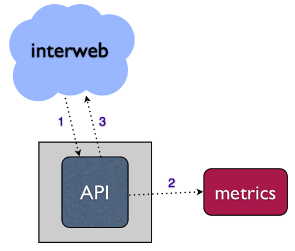
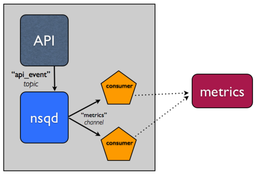
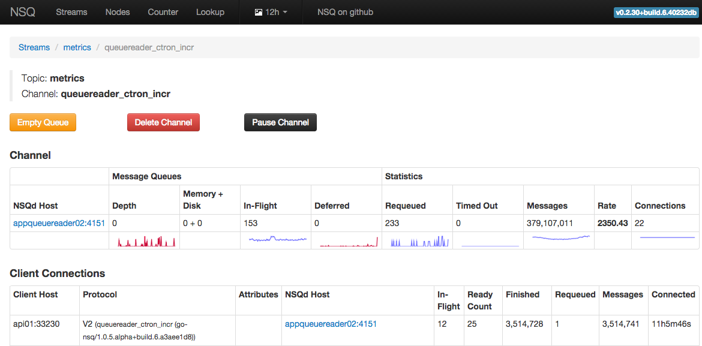
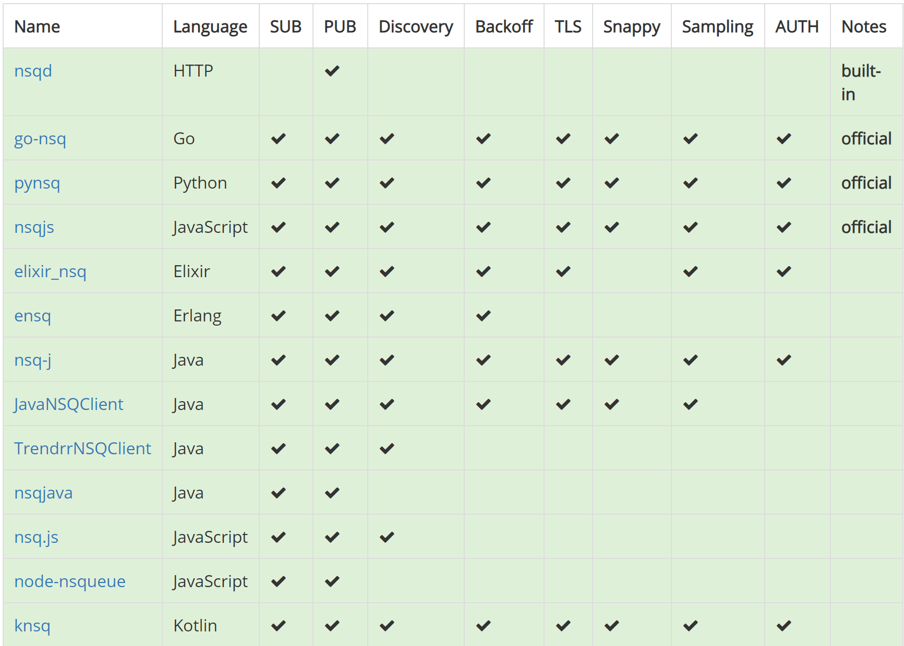

<div dir="rtl">

# پژوهش درس برنامه‌نویسی وب - NSQ

عرفان فرهادی
# معرفی NSQ و ویژگی‌های آن
NSQ یک پلتفرم توزیع‌شده‌ی ارسال پیام به صورت آنی‌ست.
## توزیع‌شده
NSQ توپولوژی‌های توزیع‌شده و غیرمتمرکز بدون نقطه‌ی شکست را ترویج می‌دهد که تحمل خطا و دسترسی بالا را توأمان با گارانتی قابل اعتماد رساندن پیام فعال می‌سازد.
## مقیاس‌پذیر
NSQ به صورت افقی و بدون هیچ مبادله‌گر مرکزی‌ای مقیاس می‌پذیرد. سیستم نهادینه‌شده اضافه کردن رأس‌ها به شاخه‌ها را ساده می‌کند و هر دو شیوه‌ی ارسال پیام انتشاردهنده-مشترک و بارِ متعادل  را پشتیبانی می‌کند.
## یک‌پارچه‌سازی‌شده
کتاب‌خانه‌های رسمی Go و Python به همراه تعداد زیادی کتاب‌خانه با پشتیبانی انجمن‌های تخصصی اغلب زبان‌ها در دسترس است.
# دغدغه و توپولوژی
در این بخش چند الگوی NSQ را برای رفع تعداد زیادی از مشکلات توضیح می‌دهیم.

جمع‌آوری معیارها

بدون توجه به این‌که شما در حال نوشتن چه سرویس تحت وبی هستید در اغلب موارد شما می‌خواهید تعدادی معیار را برای شناختن کسب‌وکار، کاربران و زیرساخت‌تان جمع‌آوری کنید. برای یک سرویس تحت وب معمولا این معیارها از طریق اتفاقاتی ایجاد می‌شوند. اتفاقاتی که حین درخواست‌های HTTP، مثلا یک API رخ می‌دهند. برخورد بدیهی ساختاربندی هماهنگ است. یعنی نوشتن یک سیستم معیاربندی در کنار API.



- وقتی سیستم معیاربندی خراب می‌شود چه اتفاقی می‌افتد؟
- آیا درخواست‌های API منتظر می‌ایستند یا کلا از دست می‌روند؟
- چالش‌های افزایش حجم درخواست‌ها را چگونه رفع می‌کنید؟

یک روش برای رفع این مسائل، نوشتن روی سیستم معیاربندی به صورت غیر‌هماهنگ است. یعنی داده‌ها را روی یک صف داخلی قرار دهیم و روی یک استریم دیگر بنویسیم (در واقع این صف را مصرف کنیم.) این جدا کردن دغدغه‌ها سیستم را نسبت به خطا مقاوم می‌کند.

NSQ مفاهیمی مانند موضوع و کانال را دارد؛ به طور مختصر یک موضوع یک جریان از پیام‌هاست؛ مانند یک جریان از APIها که در بالا اشاره شد و یک کانال نیز یک کپی از آن جریان را به مجموعه‌ی مشخصی از مصرف‌کنندگا تحویل می‌دهد. موضوع و کانال صف‌های مستقلی هستند. این ویژگی‌ها به NSQ امکان می‌دهد تا هم تحویل پیام multicast (یک موضوع که هر پیام را روی n کانال کپی می‌کند) و هم توزیع‌شده (یک کانال که به طور مساوی پیام‌هایش را بین n مصرف‌کننده تقسیم می‌کند) را پشتیبانی کند.


# نصب و آغاز سریع
[منبع](https://nsq.io/overview/quick_start.html)
## نصب
جزئیات مقتضی برای نصب روی هر کدام از سیستم‌های عامل در این [لینک](https://nsq.io/deployment/installing.html) به تفصیل موجود است؛ در این بخش به ابتدا به راه‌اندازی سریع پس از نصب می‌پردازیم و در پیوست‌ها نیز به معرفی اجمالی شیوه‌ی نصب و راه‌اندازی روی داکر می‌پردازیم که بدین شیوه نتیجه روی همه‌ی سیستم‌عامل‌ها قابل استفاده باشد.
## آغاز سریع
پس از نصب با انجام دادن این گام‌ها می‌توان یک خوشه‌ی کوچک NSQ را روی ماشین محلی خود اجرا کرد و کارهایی مانند انتشار، مصرف و آرشیو کردن پیام‌ها بر روی دیسک را انجام داد.

- در یک shell دستور nsqlookupd را اجرا می‌کنیم.
</div>

```
$ nsqlookupd
```

<div dir="rtl">

- در یک shell دیگر دستور nsqd را اجرا می‌کنیم.
</div>

```
$ nsqd --lookupd-tcp-address=127.0.0.1:4160
```

<div dir="rtl">

- در یک shell دیگر دستور nsqadmin را اجرا می‌کنیم.
</div>

```
$ nsqadmin --lookupd-http-address=127.0.0.1:4161
```

<div dir="rtl">

- یک پیام اولیه را منتشر می‌کنیم. (یک موضوع را هم در خوشه ایجاد می‌کند)
</div>

```
$ curl -d 'hello world 1' 'http://127.0.0.1:4151/pub?topic=test'
```

<div dir="rtl">

- در نهایت در یک shell دیگر دستور nsq\_to\_file را اجرا می‌کنیم.
</div>

```
$ nsq\_to\_file --topic=test --output-dir=/tmp --lookupd-http-address=127.0.0.1:4161
```

<div dir="rtl">

- پیام‌های دیگری را به nsqd منتشر می‌کنیم.
</div>

```
$ curl -d 'hello world 2' 'http://127.0.0.1:4151/pub?topic=test'

$ curl -d 'hello world 3' 'http://127.0.0.1:4151/pub?topic=test'
```

<div dir="rtl">

- برای کسب اطمینان از اجرای مطابق انتظار می‌توانیم در یک مرورگر وب آدرس ```http://127.0.0.1:4171/``` را باز کنیم تا محیط کاربری و آمارهای nsqadmin را ببینیم یا محتوای فایل‌های لاگ (test.\*.log) که در فولدر tmp/ نوشته شده‌اند را چک کنیم.

درس مهم این‌جا این است که به nsq\_to\_file (که client است) به طور مستقیم گفته نشده که موضوع test تولید شده است. این client اطلاعات را از nsqlookupd می‌گیرد و با وجود زمان‌بندی ارتباط هیچ پیامی گم نشده است.
# اجزا
## NSQD
NSQD آن daemonی‌ست که پیام‌ها را دریافت می‌کند، آن‌ها را در صف قرار می‌دهد و به کلاینت‌ها تحویلشان می‌دهد. این کامپوننت می‌تواند به تنهایی اجرا شود اما به طور معمول در یک خوشه با نمونه/هایی از nsqlookupd تنظیم می‌شود (که در چه حالتی کدام موضوعات و channelها را برای بررسی اعلام می‌کند.) این کامپوننت به دو پورت TCP متصل است یکی برای کلاینت و یکی برای برقراری دستورهای HTTP API و به صورت اختیاری می‌تواند به HTTPS متصل شود.
### چند نمونه از دستورات اینترفیس HTTP:
#### POST /topic/create
ایجاد یک موضوع جدید که نام موضوع را هم به عنوان پارامتر کوئری دریافت می‌کند. برای مثال:
</div>

```
$ curl -X POST http://127.0.0.1:4151/topic/create?topic=name
```

<div dir="rtl">

#### POST /topic/delete
حذف یک موضوع و همه‌ی کانال‌های آن. نام موضوع را به عنوان پارامتر کوئری دریافت می‌کند.
#### POST /channel/create
یک کانال برای یک موضوع موجود ایجاد می‌کند و نام موضوع موجود و نام کانال را به عنوان پارامتر دریافت می‌کند. برای مثال:
</div>

```
$ curl -X POST http://127.0.0.1:4151/channel/create?topic=name&channel=name
```

<div dir="rtl">

#### POST /topic/empty
همه‌ی پیام‌های در صف (داخل مموری و روی دیسک‌ها) را برای یک موضوع موجود پاک می‌کند. نام موضوع را به عنوان پارامتر دریافت می‌کند.
#### POST /topic/pause
همه‌ی پیام‌های در جریان در همه‌ی کانال‌ها را برای یک موضوع مشخص متوقف می‌کند. (پیام‌ها صف‌بندی می‌شوند.) نام موضوع را به عنوان پارامتر دریافت می‌کند.
## [NSQLOOKUPD](https://nsq.io/components/nsqlookupd.html)
NSQD آن daemonی‌ست که اطلاعات توپولوژی را مدیریت می‌کند. کلاینت‌ها به nsqlookupd کوئری می‌زنند تا تولیدکنندگانnsqd ِ یک موضوع مشخص و رأس‌های nsqd که اطلاعات تاپیک‌ها و کانال‌ها را منتشر می‌کنند را بیابد. در این‌جا دو اینترفیس وجود دارد. یک اینترفیس TCP که توسط nsqd برای انتشار استفاده می‌شود و یک اینترفیس HTTP برای کلاینت‌ها که دستورات مدیریتی و discovery را انجام دهند.
### چند نمونه از دستورات اینترفیس HTTP:
#### GET /lookup
که لیستی از تولیدکنندگان را برای یک موضوع برمی‌گرداند و خود topic را به عنوان پارامتر دریافت می‌کند.
#### GET /topics
همه‌ی موضوعاتی که می‌شناسیم را برمی‌گرداند.
#### GET /channels
همه‌ی کانال‌های یک موضوع را برمی‌گرداند و خود topic را به عنوان پارامتر دریافت می‌کند.
#### GET /nodes
همه‌ی nsqd‌های موجود را برمی‌گرداند.
#### POST /topic/create
یک موضوع جدید را موضوعات nsqlookupd اضافه می‌کند و نام موضوع را هم به عنوان پارامتر دریافت می‌کند.
#### POST /channel/create
یک کانال جدید را به nsqlookupd اضافه می‌کند و نام موضوع و نام کانال را به عنوان ورودی دریافت می‌کند.
## NSQADMIN
nsqadmin یک ابزار تحت وب برای دیدن آمار تجمیع‌شده‌ی خوشه به صورت آنی و اجرای دستورات مدیریتی‌ست.



معیارهای زیر در مورد موضوعات، کانال‌ها و ارتباط کلاینت‌ها به اطلاع nsqadmin می‌رسد.
### صف‌های پیام‌ها
- عمق: مجموع پیام‌های روی دیسک و حافظه. 
- در حال ارسال: تعداد مجموع پیام‌هایی که تحویل داده شده‌اند ولی هنوز تمام نشده‌اند یا باز در صف قرار گرفته‌اند یا دچار تایم‌اوت شده‌اند.
- به تعویق‌افتاده‌ها: تعداد پیام‌هایی که باز در صف قرار گرفته‌اند و دقیقا مشخص شده است که امکان رساندن آن‌ها هنوز مقدور نیست.
### آمارها
- تعداد پیام‌های باز در صف قرار گرفته
- تعداد پیام‌های تایم‌اوت‌شده
- مجموع پیام‌های دریافت‌شده در رأس
- سرعت ارسال پیام‌ها
- تعداد کلاینت‌های مرتبط در این لحظه

### ارتباطات کلاینت‌ها
- آدرس کلاینت
- نوع پروتکل NSQ
- وضعیت TLS و AUTH ارتباط
- تعداد رأس‌هاس nsqd که این کلاینت به آن‌ها متصل است.
- پیام‌های در مسیر
- مجموع تعداد پیام‌هایی که می‌توانند برای این ارتباط در مسیر قرار بگیرند
- پیام‌ها تمام شده
- پیام‌های باز در صف قرار گرفته
- کل پیام‌های دریافت شده 
## ابزارها
در ادامه به صورت مختصر ابزارهای رایج nsq  که به ما در کاربردها و بررسی استریم‌های داده یاری می‌کنند معرفی می‌کنیم.

#### nsq\_stat

آمارهای همه‌ی تولید‌کنندگان یک موضوع/کانال مشخص را دریافت کرده و نتیجه‌ی تجمیعی را نمایش می‌دهد.

#### nsq\_tail

یک موضوع/کانال مشخص را مصرف و نتیجه را در stdout می‌نویسد.

#### nsq\_to\_file

یک موضوع/کانال مشخص را مصرف و نتیجه را در یک فایل می‌نویسد.

#### nsq\_to\_http

یک موضوع/کانال مشخص را مصرف می‌کند و نتیجه را به از طریق دستورات HTTP به مقصدی مشخص ارسال می‌کند.

#### nsq\_to\_nsq

یک موضوع/کانال مشخص را مصرف و پیام‌ها را به یک مقصد nsqd از طریق TCP بازنشر می‌کند.

#### to\_nsq

یک استریم ورودی استاندارد را دریافت آن را به طور پیش‌فرض بر اساس خط‌های تازه شکسته و به یک nsqd مقصد از طریق TCP بازنشر می‌کند.
# کتابخانه‌های کلاینت
در تصویر زیر کتابخانه‌های کلاینت nsq را مشاهده می‌کنید که البته تعداد بیش‌تری نیز در حال توسعه است که در این [لینک](https://nsq.io/clients/client_libraries.html) و این [لینک](https://nsq.io/clients/building_client_libraries.html) می‌توانید اطلاعات بیش‌تر را کسب کنید یا یک کلاینت nsq را خودتان توسعه دهید.


# راه‌اندازی بر روی داکر
[منبع](https://nsq.io/deployment/docker.html)

در این‌جا شیوه‌ی دیپلوی و اجرا کردن کتاب‌خانه‌های nsq داخل containerهای یک داکر را می‌بینیم. یک ایمیج مینیمال از nsq وجود دارد که همه‌ی نسخه‌های دودویی‌شده‌ی nsq را در خود دارد. هر nsq با یک دستور خاص با فرمت زیر هنگام کار با داکر قابل‌اجراست.
</div>

```
docker run nsqio/nsq /<command>
```

<div dir="rtl">
به / پیش از دستور دقت کنید. مانند:
</div>

```
docker run nsqio/nsq /nsq\_to\_file
```

<div dir="rtl">

### لینک‌ها

[داکر](https://www.docker.com/)

[nsq image](https://registry.hub.docker.com/r/nsqio/nsq/)

### اجرای nsqlookupd

</div>

```
docker pull nsqio/nsq

docker run --name lookupd -p 4160:4160 -p 4161:4161 nsqio/nsq /nsqlookupd
```

<div dir="rtl">

### اجرای nsqd

ابتدا ip میزبان داکر را می‌گیریم
</div>

```
ifconfig | grep addr
```

<div dir="rtl">
سپس container مربوط به nsqd را اجرا می‌کنیم.
</div>

```
docker pull nsqio/nsq

docker run --name nsqd -p 4150:4150 -p 4151:4151 \

    nsqio/nsq /nsqd \

    --broadcast-address=<host> \

    --lookupd-tcp-address=<host>:<port>
```

<div dir="rtl">

پرچم ```--lookupd-tcp-address```
را مثل ```dockerIP:4160``` به ip میزبان و پورت TCPی که پیش از این nsqlookupd روی آن اجرا شده قرار دهید. برای مثال برای ip میزبان ```172.17.42.1```:

</div>

```
docker run --name nsqd -p 4150:4150 -p 4151:4151 \

    nsqio/nsq /nsqd \

    --broadcast-address=172.17.42.1 \

    --lookupd-tcp-address=172.17.42.1:4160
```

<div dir="rtl">
توجه کنید در این حالت از پورت 4160 استفاده می‌شود، پورتی که وقتی استفاده از container مربوط به  را nsqlookupd آغاز کردیم اشغال شد. (البته این پورت، پورت پیش‌فرض nsqlookupd هم هست.)

اگر می‌خواهید از یک پورت غیر پیش‌فرض استفاده کنید پارامتر p- را تغییر دهید.
</div>

```
docker run --name nsqlookupd -p 5160:4160 -p 5161:4161 nsqio/nsq /nsqlookupd
```

<div dir="rtl">
به این شکل nsqlookupd را روی پورت‌های 5161 و 5160 از ip داکر میزبان فعال می‌کند.

### استفاده از TLS

برای استفاده از TLS با یک باینری NSQ که containerized شده باید فایل certificate، کلید خصوصی و فایل root CA را include کنید. ایمیج داکر یک volume mount در آدرس /etc/ssl/certs/ برای این هدف در نظر گرفته است. یک فولدر از کامپیوتر میزبان که فایل‌ها را در خود دارد به این volume سوار (mount) کنید و فایل‌ها را در خط دستور مانند همیشه مشخص کنید.
</div>

```
docker run -p 4150:4150 -p 4151:4151 -p 4152:4152 -v /home/docker/certs:/etc/ssl/certs \

    nsqio/nsq /nsqd \

    --tls-root-ca-file=/etc/ssl/certs/certs.crt \

    --tls-cert=/etc/ssl/certs/cert.pem \

    --tls-key=/etc/ssl/certs/key.pem \

    --tls-required=true \

    --tls-client-auth-policy=require-verify
```

<div dir="rtl">
به این شکل certificateها داخل نگهدارنده‌ی داکر هنگام اجرا لود خواهند شد.

### ذخیره‌سازی داده‌های NSQ

برای ذخیره‌سازی داده‌های nsqd بر روی دیسک میزبان از volume مربوطه (data/) برای ذخیره کردن فولدرها استفاده می‌کنیم که به ما اجازه می‌دهد فولدر را روی یک نگهدارنده‌ی فقط داده یا روی یک فولدر از کامپیوتر میزبان سوار کنیم.

### استفاده از docker-compose

برای استفاده‌ی در کنار هم از nsqd، nsqlookupd و nsqadmin فایل docker-compose.yml را می‌سازیم و از دستور docker-compose استفاده می‌کنیم.
</div>

```
version: '3'

services:

  nsqlookupd:

    image: nsqio/nsq

    command: /nsqlookupd

    ports:

      - "4160"

      - "4161"

  nsqd:

    image: nsqio/nsq

    command: /nsqd --lookupd-tcp-address=nsqlookupd:4160

    depends\_on:

      - nsqlookupd

    ports:

      - "4150"

      - "4151"

  nsqadmin:

    image: nsqio/nsq

    command: /nsqadmin --lookupd-http-address=nsqlookupd:4161

    depends\_on:

      - nsqlookupd  

    ports:

      - "4171"
```

<div dir="rtl">
برای آغاز اجرا دستور زیر را در همان فولدری که فایل docker-compose.yml بالا را ساخته‌ایم اجرا می‌کنیم.
</div>

```
docker-compose up -d
```

<div dir="rtl">
یک شبکه‌ی خصوصی ساخته می‌شود و سه نگهدارنده از طریق یک شبکه‌ی داخلی آغاز می‌شوند. در localhost به هر کدام از نگهدارنده‌ها یک پورت رندوم اختصاص داده می‌شود که به پورت‌های مشخص شده در فایل docker-compose.yml مپ می‌شوند. برای مشاهده‌ی وضعیت نگهدارنده‌های در حال اجرا و اتصالات پورت‌ها این دستور را اجرا می‌کنیم.
</div>

```
docker-compose ps
```

<div dir="rtl">
برای دیدن لاگ‌های نگهدارنده‌های در حال اجرا این دستور را اجرا می‌کنیم.
</div>

```
docker-compose logs
```

<div dir="rtl">
اگر فرض کنیم که nsqlookupd پورت‌های 31001 از میزبان را به پورت 4161 مپ کرده‌اند یک پینگ ساده به وسیله‌ی curl این‌گونه قابل انجام است:
</div>

```
curl http://127.0.0.1:31001/ping
```

<div dir="rtl">
