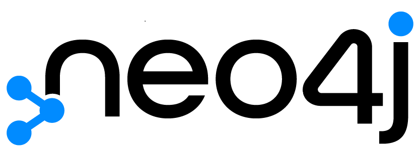

# Neo4j

 سبحان اسدی سید محمدرضا خسرویان   امین پورتوانایی 

# Table of Contents

- [Neo4j](#neo4j)
- [Table of Contents](#table-of-contents)
- [What is Neo4j?](#what-is-neo4j)
- [Understanding Neo4j](#understanding-neo4j)
  - [Graph Database Fundamentals](#graph-database-fundamentals)
  - [Installing Neo4j](#installing-neo4j)
  - [Neo4j Browser](#neo4j-browser)
  - [Graph Algorithms](#graph-algorithms)
- [Neo4j vs. ArangoDB](#neo4j-vs-arangodb)
  - [Data Model](#data-model)
  - [Query Language](#query-language)
  - [Scalability](#scalability)
  - [Use Cases](#use-cases)
- [The Art of Cypher](#the-art-of-cypher)
  - [Basic Queries](#basic-queries)
  - [Advanced Queries](#advanced-queries)
- [Advanced Neo4j Features](#advanced-neo4j-features)
  - [Neo4j Aura](#neo4j-aura)
  - [Graph Data Modeling](#graph-data-modeling)
  - [Data Import and Export](#data-import-and-export)
- [Advanced Cypher Query Techniques in Neo4j](#advanced-cypher-query-techniques-in-neo4j)
  - [Pattern Matching with Variable-Length Relationships](#pattern-matching-with-variable-length-relationships)
  - [Conditional Queries with "CASE" Statements](#conditional-queries-with-case-statements)
  - [Using "UNWIND" for List Processing](#using-unwind-for-list-processing)
  - ["WITH" Clause for Query Chaining](#with-clause-for-query-chaining)
  - [Date and Time Operations](#date-and-time-operations)
- [In-depth Exploration of Neo4j (JFYI)](#in-depth-exploration-of-neo4j-jfyi)
  - [Indexing and Performance Optimization](#indexing-and-performance-optimization)
  - [Transactions and ACID Compliance](#transactions-and-acid-compliance)
  - [Security Best Practices](#security-best-practices)
  - [Extending Neo4j Functionality with Plugins](#extending-neo4j-functionality-with-plugins)
- [resources](#resources)

# What is Neo4j?

Neo4j یک سیستم مدیریت پایگاه داده گراف منبع باز پیشرو است که برای ذخیره سازی، پرس و جو و مدیریت داده های بسیار متصل طراحی شده است. برخلاف پایگاه داده‌های رابطه‌ای سنتی، Neo4j برای مدیریت روابط پیچیده و ساختارهای نمودار بهینه شده است، و آن را برای برنامه‌هایی ایده‌آل می‌کند که شامل اتصالات شبکه پیچیده و وابستگی‌های متقابل می‌شود.

# Understanding Neo4j
## Graph Database Fundamentals

در ریشه Neo4j، درک عمیقی از پایگاه‌های داده گراف، سازماندهی داده‌ها در گره‌ها، روابط و ویژگی‌ها نهفته است.
گره‌ها به‌عنوان موجودیت‌ها عمل می‌کنند، روابط پیوندها را مشخص می‌کنند و ویژگی‌ها اطلاعات زمینه‌ای اضافی را ذخیره می‌کنند.
این پارادایم در سناریوهای مملو از روابط پیچیده مانند شبکه‌های اجتماعی و سیستم‌های توصیه بسیار ارزشمند است.

## Installing Neo4j

Neo4j با انواع روش‌های نصب، از دانلود مستقیم گرفته تا مدیریت بسته‌ها، که دسترسی به محیط‌های مختلف را تضمین می‌کند، از کاربران استقبال می‌کند و به روش های مختلفی می توان آنرا دریافت کرد

    # Exemplar installation using Homebrew on macOS
    brew install neo4j
فایل‌های پیکربندی، مانند neo4j.conf، تنظیم دقیق تنظیمات مانند پورت‌ها و تخصیص حافظه را تسهیل می‌کنند و Neo4j را بر اساس نیازهای خاص تنظیم می‌کنند.

## Neo4j Browser

مرورگر Neo4j به عنوان یک رابط تعاملی مبتنی بر وب است که به کاربران امکان می دهد تا داده ها را به طور یکپارچه جستجو و تجسم کنند.

    // Sample Cypher query unveiling nodes and relationships
    MATCH (n)-[r]->(m)
    RETURN n, r, m

## Graph Algorithms

Neo4j با مجموعه‌ای غنی از الگوریتم‌های گراف تقویت شده است که کاربران را قادر می‌سازد تا بینش‌های عمیقی را از داده‌های به هم پیوسته از طریق فرآیندهایی مانند مسیریابی، تجزیه و تحلیل مرکزیت، و تشخیص جامعه به دست آورند.

# Neo4j vs. ArangoDB

در این بخش، ما یک تحلیل مقایسه ای بین Neo4j و ArangoDB، که هردو در  پایگاه داده گراف برجسته هستند را بررسی می کنیم. هر پایگاه داده دارای ویژگی‌های منحصربه‌فرد، مدل‌های داده، و زبان‌های query مربوط به خود است که برای موارد مختلف استفاده می‌شود. درک تمایز بین Neo4j و ArangoDB می تواند توسعه دهندگان را در انتخاب راه حل مناسب پایگاه داده بر اساس نیازها و ترجیحات پروژه خود راهنمایی کند.

## Data Model

Neo4j: مدل نمودار ویژگی بومی را قهرمان می کند.

ArangoDB: انعطاف پذیری در پشتیبانی از چندین مدل از جمله سند، کلید-مقدار و گراف.

## Query Language

Neo4j: Cypher، برای پرس و جوهای نمودار رسا طراحی شده است.

ArangoDB: AQL (زبان پرس و جو ArangoDB) گراف و سایر مدل های داده را در خود جای می دهد.

## Scalability

Neo4j: مقیاس پذیری افقی برای مدیریت نمودارهای در مقیاس بزرگ.

ArangoDB: مجهز به مقیاس پذیری افقی در محیط های توزیع شده.

## Use Cases

Neo4j: در سناریوهایی که بر روابط تأکید دارند، مانند شبکه‌های اجتماعی، موتورهای توصیه، پیشرفت می‌کند.

ArangoDB: تطبیق پذیری می درخشد و به برنامه های چند مدل با نیازهای داده های متنوع پاسخ می دهد.

# The Art of Cypher
## Basic Queries

Cypher، زبان پرس و جو بیانگر Neo4j می باشد که الگوهای ذاتی درون داده ها را منعکس می کند.

    // Creating a node with properties
    CREATE (person:Person {name: 'Sobhan', age: 20})

    // Forging relationships
    MATCH (a:Person), (b:Person)
    WHERE a.name = 'Sobhan' AND b.name = 'Sobhan'
    CREATE (a)-[r:KNOWS]->(b)

## Advanced Queries

تطبیق پذیری Cypher در ایجاد پرس و جوهای پیچیده برای عبور و فیلتر کردن روابط می درخشد.

    // Discovering friends of friends
    MATCH (a:Person)-[:KNOWS]->(friend)-[:KNOWS]->(fof)
    WHERE a.name = 'Sobhan'
    RETURN fof.name
کاربران با استفاده از Cypher، پیچیدگی‌های چشم‌انداز داده‌های خود را با ظرافت بی‌نظیری دنبال می‌کنند.

# Advanced Neo4j Features
## Neo4j Aura

Neo4j Aura، یک سرویس پایگاه داده ابری کاملاً مدیریت شده است که استقرار و مقیاس‌بندی را ساده می‌کند. کاربران می توانند بر روی ساخت برنامه ها بدون بار مدیریت زیرساخت تمرکز کنند.

    # Deploying Neo4j Aura via the command line
    neo4j-admin aura deploy my-aura-database

## Graph Data Modeling

تسلط بر مدل سازی داده های گراف برای طراحی موثر پایگاه داده بسیار مهم است. ادغام انواع مختلف روابط و استفاده از خواص گره، بازیابی داده ها را بهینه می کند و کارایی پرس و جوهای گراف را افزایش می دهد.

    // Creating multiple relationship types
    MATCH (a:Person), (b:Interest)
    MERGE (a)-[:LIKES]->(b)
    MERGE (a)-[:FOLLOWS]->(b)

## Data Import and Export

import ,Neo4j  و export بدون درز داده را از طریق ابزارهایی مانند "neo4j-admin" و "neo4j-import" تسهیل می کند. ادغام مجموعه داده های خارجی در Neo4j کاوش منابع داده های متنوع را در یک ساختار گراف یکپارچه امکان پذیر می کند.

    # Importing CSV data into Neo4j
    neo4j-admin import --nodes=Users.csv --relationships=Follows.csv

# Advanced Cypher Query Techniques in Neo4j

Cypher, راه های قدرتمند و گویا را برای تعامل با داده های گراف ارائه می دهد. توسعه دهندگان می توانند از تکنیک های پیشرفته Cypher برای عملیات های ظریف تر و خاص تر استفاده کنند.حالا که آشناییت نسبی پیدا کردیم, می خواهیم چند تکنیک پیشرفته جستجوی Cypher را بررسی کنیم:

## Pattern Matching with Variable-Length Relationships

Cypher اجازه می دهد تا روابط طول متغیر را در الگوها مشخص کنید و امکان بازیابی مسیرهای بین گره ها با طول های انعطاف پذیر را فراهم می کند. این به ویژه در سناریوهایی که عمق دقیق روابط ناشناخته است مفید است.

    // Find a person and their friends, regardless of the depth of friendship
    MATCH (p:Person {name: 'John'})-[:FRIEND*1..]->(friend)
    RETURN p, friend

## Conditional Queries with "CASE" Statements

منطق شرطی را با استفاده از عبارت "CASE" در queryهای Cypher ادغام کنید. این زمانی ارزشمند است که می‌خواهید نتایج پرس و جو را بر اساس شرایط خاص سفارشی کنید.

    // Assign a label based on a person's age group
    MATCH (p:Person)
    RETURN p.name,
    CASE
        WHEN p.age < 18 THEN 'Minor'
        WHEN p.age >= 18 AND p.age < 65 THEN 'Adult'
        ELSE 'Senior'
    END AS AgeGroup

## Using "UNWIND" for List Processing

بند "UNWIND" به توسعه دهندگان اجازه می دهد تا لیست ها را پردازش کرده و عملیات را روی هر عنصر به طور جداگانه انجام دهند. در مواجهه با propery که list است به درد میخورد.

    // Unwind a list of interests associated with a person
    MATCH (p:Person {name: 'Alice'})
    UNWIND p.interests AS interest
    RETURN p.name, interest

## "WITH" Clause for Query Chaining

"WITH" چین کردن چند query را با هم امکان پذیر می کند که برای تجزیه queryهای پیچیده به مراحل قابل مدیریت تر و انتقال نتایج از یک مرحله به مرحله دیگر مفید است.

    // Find friends of friends and count common interests
    MATCH (a:Person)-[:FRIEND]->(friend)-[:FRIEND]->(fof)
    WITH a, fof, COLLECT(DISTINCT friend.interests) AS commonInterests
    RETURN a.name, fof.name, commonInterests

## Date and Time Operations

Cypher از عملیات مرتبط با تاریخ و زمان برای کار با داده های زمانی پشتیبانی می کند که مقایسه، محاسبات و قالب بندی می شود.

    // Find people born in the last 30 days
    MATCH (p:Person)
    WHERE p.birthdate >= date() - duration('P30D')
    RETURN p.name, p.birthdate

# In-depth Exploration of Neo4j (JFYI)
## Indexing and Performance Optimization

Neo4j از تکنیک های مختلف نمایه سازی برای بهبود عملکرد پرس و جو پشتیبانی می کند. درک انواع شاخص و مفاهیم آنها برای بهینه سازی عملیات پایگاه داده گراف بسیار مهم است.

    // Creating an index on the 'name' property of nodes
    CREATE INDEX ON :Person(name)

## Transactions and ACID Compliance

Neo4j به اصول ACID (Atomicity، Consistency، Consistency، Durability) پایبند است و یکپارچگی داده ها را در سناریوهای تراکنش تضمین می کند. استفاده از تراکنش ها در queryهای Cypher در برابر تناقضات داده ها محافظت می کند.

    // Example of a Cypher query within a transaction
    BEGIN
    MATCH (a:Person {name: 'Sobhan'})
    SET a.age = 20
    COMMIT

## Security Best Practices

ایمن سازی پایگاه داده Neo4j شامل اجرای اقدامات احراز هویت، مجوز و رمزگذاری است. پیکربندی نقش های کاربر، تعریف قوانین کنترل دسترسی، و فعال کردن رمزگذاری به یک وضعیت امنیتی قوی کمک می کند.

    // Creating a user with specific roles and privileges
    CREATE USER johnDoe SET PASSWORD 'securePassword' CHANGE NOT REQUIRED
    GRANT READ, WRITE ON GRAPH * TO johnDoe

## Extending Neo4j Functionality with Plugins

توسعه‌پذیری Neo4j از طریق افزونه‌ها تقویت می‌شود و کاربران را قادر می‌سازد تا عملکردهای سفارشی را یکپارچه کنند. درک معماری پلاگین و توسعه رویه های سفارشی می تواند Neo4j را با نیازهای پروژه خاص تنظیم کند.

    // Example Java code for a custom Neo4j procedure
    public class CustomProcedure extends org.neo4j.procedure.Procedure {
        // Implementation of custom functionality
    }

 # resources
>https://neo4j.com/docs/

>https://github.com/neo4j/neo4j

>https://orientdb.com/docs/

>https://github.com/orientechnologies/orientdb

>https://db-engines.com/en/system/Neo4j%3BOrientDB

