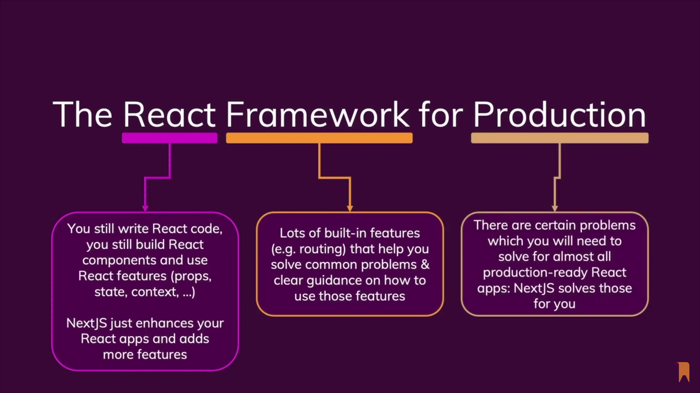

# NextJs
## مقدمه
توصیه میشه اول با کتابخونه‌ی [ReactJs][React-research] آشنا بشید، چون NextJs یک فریمورک (ساختاری با هدف ساده و بهتر کردن کار‌ها) روی این کتابخونه است.
 
به طور خلاصه React یک کتابخونه javascript برای کد های frontend هست، که هدفش بهبود دادن ساخت user interface هاست و اینکارو با فیچر هایی مثل کامپوننت ها و هوک و ... انجام میده، Next هم یک فریمورک بر اساس React هست که کارش اسکیل پذیر کردن و راحت کردن کار برای پروژه های سنگینِ Reactی است.
 
به  همین دلیل Next خودش را یک فریمورک React برای پروداکشن
می داند، زیرا فیچر های متعددی دارد که ساخت اپ های React توسعه پذیر را ساده کرده و بهبود می‌بخشد.

## تفاوت های React و Next

[React-research]: https://github.com/mostafaghadimi/web_workshop/tree/master/React