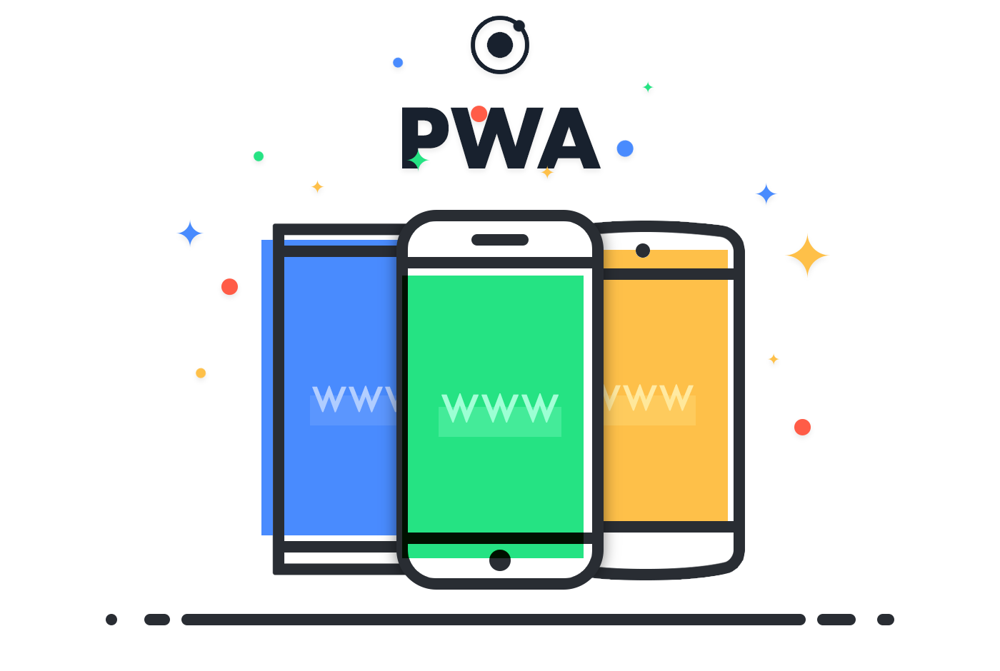

<!-- language-all: lang-js -->

 

<div align="center">
تهیه‌کنندگان:
محمد خلفی، علیرضا فرشی، ابوالفضل قلندری
</div>

<br>

<div dir = 'rtl' style='text-align:justify'>

# Progressive Web App (PWA)

وب اپلیکیشن پیش رونده یا همان
progressive web app
برنامه تحت وبی است که قابل نصب می باشد و به کاربر تجربه یکپارچه و قابل اطمینانی از استفاده از یک اپلیکیشن می دهد. نکته ی مهم در مورد PWA ها این است که چون ذاتا تحت web هستند، می توانند در هر دستگاه و هر سیستم عاملی نصب و اجرا شوند. این نکته از آن جهت قابل اهمیت است که با تنها یک codebase می توان اپلیکیشن خود را وارد بازار کرد و نه داشتن تیم های مختلف به ازای پلتفرم های مختلف.

## مقایسه Web platform apps و Platform-specific apps


وب اپلیکیشن ها از جهاتی مزیت های زیادی دارند. آن ها شامل یک codebase هستند و کاربران همواره از آخرین نسخه موجود استفاده می کنند. از طرفی اپلیکیشن هایی که مخصوص یک پلتفرم مثل اندروید نوشته می شوند، می توانند از قابلیت های بیشتری بهره مند شوند، مانند خواندن و نوشتن فایل، ارتباط با سخت افزار از طریق USB، استفاده از Bluetooth و غیره. همچنین مثلا با نصب یک اپلیکیشن اندروید یک آیکن در صفحه خانه اضافه می شود و حتی هنگام متصل نبودن به اینترنت می تواند قسمت هایی از اپلیکیشن که لزوما نیازی به گرفتن داده از اینترنت ندارد را نمایش دهد.
در این میان PWA ها وارد بازی می شوند. PWA ها در بین web app ها و platform app ها قرار دارند و ویژگی های هر دو گروه را شامل می شوند.

- قابل دسترس بدون نیاز به نصب
- به روزرسانی راحت
- راحت بودن deploy
- قابل دسترس به صورت offline
- دارای performance بالا
- استفاده از اپلیکیشن به صورت مستقل و نه به صورت یک صفحه مرورگر
- دارای آیکن نصب شده


<br/>


# Service workers
کاربران انتظار دارند که در صورت قطعی و یا کند بودن اینترنت اپلیکیشن کار کند. برای مثال تلگرام اندروید تعدادی از کاربران و پیام ها را حتی در صورت آفلاین بودن نمایش می دهد. از طرفی اگر قسمتی از برنامه نیاز به اتصال به اینترنت داشت، انتظار می رود که خطای مناسبی نشان داده شود و نه این که عملکرد برنامه به کلی مختل شود. همچنین انتظار می رود که این خطا سریع نشان داده شود. به منظور رفع این مشکلات برای web app ها از service worker ها استفاده می کنیم.

<br/>

 


<br/>


<span dir="rtl">Service worker</span>
ها در لایه ای میان PWA و سرور قرار می گیرند. عملکرد آن ها مانند پروکسی است به این صورت که request از PWA به service worker داده می شود. آنگاه service worker تصمیم می گیرد که پاسخ را از روی cache برگرداند و یا همان request را برای سرور بفرستد و سپس جواب سرور را برای PWA. استفاده از این ساختار قابلیت های زیادی به ما می دهد. مثلا service worker می تواند به سرور درخواست بزند و اگر از سرور پس از مدت مشخصی جوابی نرسید، جواب را از cache بخواند و برگرداند. که با همین ایده می توان عملکرد برنامه را در هنگام اختلال در اتصال به اینترنت تضمین کرد.


## نصب یک service worker

برای این که service worker کنترل برنامه را به دست بگیرد باید برای PWA رجیستر کند. بدین منظور می توانید تکه کد زیرا برای فایل serviceWorker.js اجرا کنید.

<div dir="ltr">

```
if ('serviceWorker' in navigator) {
  navigator.serviceWorker.register("/serviceworker.js");
}
```
</div>

همچنین service worker های نصب شده را می توانید در قسمت devtools مشاهده کنید.


<br/>


## Service worker scope

فولدری که فایل service worker در آن قرار دارد عنوان scope آن در نظر گرفته می شود. هر scope می تواند فقط یک service controller داشته باشد.

## نصب و فعالسازی
<span dir="rtl">Service worker</span>
ها بی سر و صدا نصب می شوند و برای نصبشان پیامی به کاربر نشان داده نمی شود. Service worker پس از نصب برای این که کنترل client خود را به دست بگیرد، ابتدا باید activate شود. عملیات های فعالسازی و نصب با استفاده از کد زیر قابل listen کردن هستند

<div dir="ltr">

```
self.addEventListener("install", event => {
  console.log("Service worker installed");
});
self.addEventListener("activate", event => {
  console.log("Service worker activated");
});
```
</div>


<br/>

## Caching

از cache storage api برای cache کردن assets و پاک کردن و یا به روزرسانی کردن cache ها می توان استفاده کرد. این قابلیت از ویژگی های مهم PWA است که همان طور که گفته شد یکی از اهمیت های آن پایدار نگه داشتن شرایط اپلیکشن در شرایط مختلف شبکه است. 

سوالی که در ابتدا در ارتباط با این موضوع پیش می آید این است که ما باید دقیقا چه چیز هایی را cache کنیم. شاید با خود بگویید که هر چیزی که هست را cache می کنیم! ولی اگر بخواهیم همه فایل ها را cache کنیم آن موقع ممکن است که حافظه خیلی زیادی استفاده کنیم و یا فایل هایی را ذخیره کنیم که به ندرت استفاده می شوند. 
فایل هایی که می توانند در لیست cache ما بیایند:
- صفحه html اصلی
- فایل های javascript و css
- فونت ها و عکس ها
- صفحات دیگر html که می خواهیم سریع لود شوند

سوال دومی که پیش می آید این است که ما چه موقعی فایل ها را cache کنیم:
- هنگام نصب service worker 
- پس از لود شدن اولین صفحه
- وقتی که کاربر به بخشی از اپلیکیشن می رود
- وقتی که اتصال به شبکه ایده آل است
- کش کردن فایل ها به صورت دوره ای


### Cache api

<div dir="ltr">

```
caches.open("pwa-assets")
.then(cache => {
 cache.add("styles.css"); // it stores only one resource
 cache.addAll(["styles.css", "app.js"]); // it stores two resources
});
```
</div>

همان طور که در کد مشهود است، برای استفاده از api از آبجکت caches استفاده می شود. متد open برای ساختن و یا باز کردن یک cache جدید استفاده می شود و خروجی آن یک promise است. در تابع ورودی then، از متد add برای cache کردن یک ورودی و از متد addAll برای cache کردن چندین ورودی استفاده شده است.

<br/>


### Fetch event

<span dir="rtl">Fetch event</span> 
به ما این قابلیت را می دهد که هر request ای که PWA می دهد را از لایه service worker رد کنیم و در آن جا تصمیم بگیریم که مثلا از cache جواب را بخوانیم و یا از سرور. به شکل زیر می توانیم این event را در service worker ها  listen کنیم و با استفاده از تابع respondWith جواب دلخواه خود را به عنوان response بازگردانیم.

<div dir="ltr">

```
self.addEventListener("fetch", event => {
   const response = .... // a response or a Promise of response
   event.respondWith(response);
});
```
</div>

برای ساخت response می توانیم به شکل زیر عمل کنیم.

<div dir="ltr">

```
const simpleResponse = new Response("Body of the HTTP response");

const options = {
  status: 200,
  headers: {
	'Content-type': 'text/html'
  }
};
const htmlResponse = new Response("<b>HTML</b> content", options)
```
</div>


همچنین از آن جایی که api cache کلید ها را به صورت url و مقادیر را به صورت http response همراه با header ها و body ذخیره می کند می توان به شکل زیر از cache برای به دست آوردن response استفاده کرد.


<div dir="ltr">

```
let response = caches.open("pwa-assets").then(cache => {
   cache.match(request).then(response => {
   return response || fetchFromServer(request);
 }
});
```
</div>


## استراتژی های Caching

### Cache first

در این روش service worker ابتدا در cache دنبال request می گردد، اگر وجود داشت response ای که cache شده است را برمی گرداند و در غیر این صورت به سرور درخواست می زند. در این روش سرعت را به بروز بودن داده ترجیح می دهیم.

<div dir="ltr">

```
self.addEventListener("fetch", event => {
  event.respondWith(
    caches.match(event.request)
    .then(cachedResponse => {
        return cachedResponse || fetch(event.request);
    }
  )
 )
});
```
</div>


### Network first

در این روش ابتدا سعی می کنیم که response را از سرور دریافت کنیم و اگر خطا خورد از cache آن را می خوانیم در این روش بر خلاف قبلی بروز بودن اولویت بیشتری دارد.

<div dir="ltr">

```
self.addEventListener("fetch", event => {
  event.respondWith(
    fetch(event.request)
    .catch(error => {
      return caches.match(event.request) ;
    })
  );
});
```
</div>

### Stale while revalidate

در این روش پس از رسیدن درخواست جواب را از cache می خوانیم و تحویل می دهیم ولی بلافاصله به سرور درخواست می زنیم و cache را پر می کنیم. در این روش cache در پشت زمینه بروز می شود و در عین حال سرعت را حفظ کرده ایم.

<div dir="ltr">

```
self.addEventListener("fetch", event => {
    event.respondWith(
      caches.match(event.request).then(cachedResponse => {
          let networkFetch = fetch(event.request);
          networkFetch.then(response => {
            caches.open("pwa-assets").then(cache => {
                cache.put(event.request, response.clone());
            });
          });
          return cachedResponse || networkFetch;
      }
    )
   )
 });
```
</div>

### Cache only


در cache only فقط از cache می خوانیم. در این روش قبل از این که به assets نیاز پیدا کنیم باید آن ها را cache کنیم که  هنگام نصب کردن service worker ها می تواند زمان مناسبی باشد.

<div dir="ltr">

```
self.addEventListener("fetch", event => {
    event.respondWith(caches.match(event.request));
 });
```
</div>

## نصب PWA

وقتی که یک PWA را نصب می کنیم اتفاقات زیر می افتند:
- یک آیکن برای آن در صفحه خانه و یا منوی شروع ایجاد می شود.
- می تواند به عنوان نتیجه در جستجوی اپلیکیشن ها بیاید.
- برنامه در یک پنجره جدا باز می شود.


برای نصب یک PWA دست کم نیاز به یک فایل manifest داریم. در مرورگر های google chrome و microsoft edge نیازمندی هایی علاوه بر آن مطرح است:
- ارائه برنامه وب در https
- حداقل یک آیکن در فرمت و سایز device
- یک service worker که رجیستر کرده باشد
- یک fetch event handler در service worker برای اطمینان از درستی 
کارکرد برنامه به صورت آفلاین


نصب PWA برای desktop با google chrome و microsoft edge بر روی windows و linux و mac Os امکان پذیر است ولی توسط firefox پشتیبانی نمی شود.


### Web app manifest

<span dir="rtl">Web app manifest</span> 
یک فایل جیسون است که در آن مشخصات PWA به عنوان یک برنامه نصب شده می آید. از جمله اطلاعات پایه ای مانند نام اپلیکیشن، آیکن، رنگ theme و اطلاعات پیشرفته تر مانند shortcut های اپلیکیشن.
هر PWA باید دقیقا یک فایل manifest داشته باشد و آن نیز باید به همه ی صفحات html آن به شکل زیر متصل شود.
 
<div dir="ltr">

```
<link href="manifest.json" rel="manifest">
```
</div>

### فیلد های ابتدایی فایل manifest:

#### name
اسم کامل PWA است که موقع نمایش آیکن اپلیکیشن در صفحه خانه در کنار آن میاید.

#### Short_name

هنگام نبودن فضای کافی برای نشان دادن اسم کامل PWA از این نام استفاده می شود. توصیه می شود، طول آن را کمتر از 12 کاراکتر در نظر بگیرید.
Icons 
 آرایه ای از object های ایکون است که دارای property های src و type و sizes هستند.

#### Start_url
این ویژگی url ای را تعیین می کند که با اجرای  PWA نصب شده برنامه از آن جا شروع می شود. اگر این ویژگی در manifest نباشد به صورت پیشفرض برابر با url صفحه ای می شود که PWA از آن جا نصب شده است.
Display
یکی از حالت های fullscreen, standalone, minimal-ui, browser را دارد که اکثرا به حالت standalone قرار می گیرد.


#### Id
یک رشته ی یکتا برای شناسایی PWA است.

<div dir="ltr">

```
{
    "name": "Progressive Web App",
    "short_name": "PWA",
    "start_url": "index.html",
    "display": "standalone",
    "icons": [
        {
            "src": "images/icon.gpg",
            "sizes": "512x512",
            "type": "image/gpg"
        }
    ]
}
```
</div>

### برخی فیلد های دیگر

#### Theme color
رنگ پیشفرض برای اپلیکیشن که گاهی بر روی نحوه نشان دادن سایت تاثیر می گذارد. این فیلد می تواند توسط تگ html 
<meta>
و theme-color property نیز تعیین شود.

#### Background color
رنگی برای نشان دادن اپلیکیشن قبل از این که stylesheet  برنامه load شود.


</div>