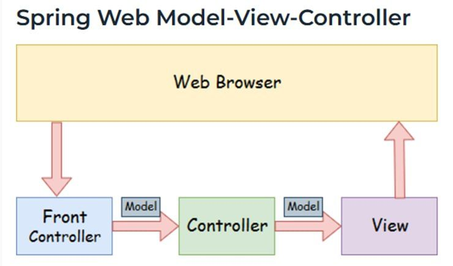
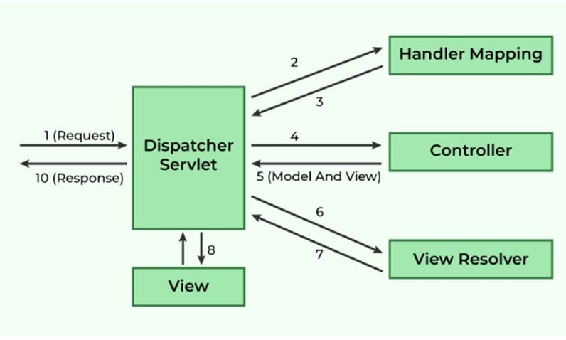

<div dir="rtl" align="right">

## Spring MVC

## مقدمه
در دنیای توسعه وب، نیاز به فریمورکی وجود دارد که توسعه نرم‌افزارهای تحت وب را ساده، ماژولار و قابل نگهداری کند. فریمورک **Spring MVC** یک راهکار جامع برای ایجاد برنامه‌های کاربردی تحت وب در زبان جاوا ارائه می‌دهد. این فریمورک به توسعه‌دهندگان کمک می‌کند تا برنامه‌هایی با قابلیت جداسازی وظایف، سهولت در تست و مدیریت بهتر کد ایجاد کنند.

## مشکلاتی که Spring MVC حل می‌کند:
- پیچیدگی در مدیریت درخواست‌ها و پاسخ‌ها در برنامه‌های بزرگ
- نیاز به معماری منعطف و مقیاس‌پذیر برای برنامه‌های تحت وب
- دشواری در تست و نگهداری کدهای مرتبط با توسعه وب
- عدم امکان جداسازی مناسب بین منطق تجاری و لایه نمایشی

## معرفی Spring MVC
**Spring MVC** یکی از ماژول‌های اصلی فریمورک Spring است که برای توسعه برنامه‌های وب مبتنی بر معماری **Model-View-Controller (MVC)** طراحی شده است. این فریمورک امکاناتی همچون مدیریت درخواست‌ها، پیاده‌سازی کنترلرها، مدل داده، قالب‌بندی پاسخ‌ها و قابلیت یکپارچه‌سازی با سایر تکنولوژی‌های تحت وب را ارائه می‌دهد.

### معماری MVC در Spring

- **Model (مدل):** داده‌های برنامه را مدیریت می‌کند و تعامل بین داده‌ها و منطق تجاری را تسهیل می‌کند.
- **View (نما):** اطلاعات را به کاربر نمایش می‌دهد و می‌تواند از قالب‌هایی مانند **Thymeleaf، JSP** یا **FreeMarker** استفاده کند.
- **Controller (کنترلر):** درخواست‌ها را پردازش کرده و بین مدل و نما واسطه می‌شود، و ارتباط بین بخش‌های مختلف برنامه را مدیریت می‌کند.
- **Front Controller:** در **Spring Web MVC**، کلاس `DispatcherServlet` به عنوان کنترل‌کننده اصلی عمل می‌کند که مسئول مدیریت جریان برنامه است.

## Dispatcher Servlet


Dispatcher Servlet  کنترل‌کننده اصلی است که فرآیند کامل پردازش درخواست‌ها و پاسخ‌ها را مدیریت می‌کند. حالا سوال این است که کنترل‌کننده اصلی (Front Controller) چیست؟

این بسیار ساده است، همان‌طور که از نامش پیداست،
زمانی که هر درخواستی به وب ارسال می‌شود، درخواست‌ها ابتدا به کنترل‌کننده اصلی که همان Dispatcher Servlet است می‌رسند. کنترل‌کننده اصلی اولین نقطه‌ای است که درخواست‌ها به آن می‌رسند، به همین دلیل نامش چنین است. پس از دریافت درخواست‌ها، Dispatcher Servlet درخواست‌ها را دریافت کرده و تصمیم می‌گیرد که کدام کنترل‌کننده مناسب برای پردازش این درخواست‌ها است. سپس آن‌ها را به کنترل‌کننده مناسب ارسال می‌کند.

`DispatcherServlet` اولین نقطه دریافت درخواست‌های HTTP در Spring MVC است. این کنترل‌کننده اصلی:
1. درخواست‌ها را دریافت کرده و بررسی می‌کند.
2. کنترل‌کننده مناسب را برای پردازش درخواست پیدا می‌کند.
3. پاسخ مناسب را از `View Resolver` دریافت کرده و نمایش می‌دهد.


## مزایا و معایب Spring MVC
### مزایا
- **این فریمورک از یک سرویس سبک برای توسعه و استقرار برنامه‌ها استفاده می‌کند**
- **امکان توسعه سریع و موازی را فراهم می‌کند**
- **توسعه برنامه سریع‌تر می‌شود.**
- **همکاری میان توسعه‌دهندگان مختلف آسان‌تر است.**
- **به‌روزرسانی برنامه ساده‌تر است.**
- **اشکال‌زدایی راحت‌تر است زیرا چندین سطح در برنامه وجود دارد.**

### معایب
- **پیچیدگی بالا:** یادگیری و پیاده‌سازی نیاز به تجربه بیشتری دارد.
- **نامناسب برای برنامه‌های کوچک:** ممکن است باعث افزایش پیچیدگی در پروژه‌های ساده شود.

## ویژگی‌های کلیدی Spring MVC

- **جداسازی در:** Spring MVC با پیروی از الگوی MVC، جداسازی منطق تجاری، داده و نمایش را تسهیل می‌کند.
- **استفاده از Annotation:** برای کاهش پیچیدگی در پیکربندی برنامه، از Annotation‌هایی مانند `@Controller`، `@RequestMapping` و `@RestController` استفاده می‌شود.
- **پشتیبانی از RESTful APIs:** امکان پیاده‌سازی آسان APIهای RESTful را فراهم می‌کند.
- **یکپارچگی با سایر ماژول‌های Spring:** مانند Spring Security، Spring Data و Spring Boot.
- **پشتیبانی از قالب‌های مختلف نمایش:** مانند JSON، XML، و HTML.

## مثال استفاده از Spring MVC
یک مثال ساده برای نمایش پیام "Hello World":
</div>

```java
import org.springframework.stereotype.Controller;
import org.springframework.web.bind.annotation.GetMapping;
import org.springframework.web.bind.annotation.ResponseBody;

@Controller
public class HelloController {
    @GetMapping("/hello")
    @ResponseBody
    public String sayHello() {
        return "Hello World";
    }
}
```
<div dir="rtl" align="right">

### پیکربندی Spring Boot
برای اجرای این پروژه، از **Spring Boot** استفاده می‌کنیم. در **pom.xml** برای پروژه‌های **Maven**، وابستگی زیر را اضافه کنید:
</div>

```xml
<dependency>
    <groupId>org.springframework.boot</groupId>
    <artifactId>spring-boot-starter-web</artifactId>
</dependency>
```
<div dir="rtl" align="right">

### اجرای پروژه
پس از راه‌اندازی سرور، کاربر می‌تواند با مراجعه به `http://localhost:8080/hello` پیام **Hello World** را مشاهده کند.

## نتیجه‌گیری
Spring MVC یکی از محبوب‌ترین فریمورک‌های توسعه وب در دنیای جاوا است که به توسعه‌دهندگان امکان می‌دهد **برنامه‌های تحت وب ماژولار، خوانا و قابل نگهداری** ایجاد کنند. با استفاده از این فریمورک، پیاده‌سازی **الگوی MVC** ساده‌تر شده و فرآیند توسعه و نگهداری نرم‌افزارهای تحت وب بهبود می‌یابد.

## منابع
</div>

1. [Spring Framework Documentation](https://docs.spring.io/spring-framework/docs/3.2.x/spring-framework-reference/html/mvc.html)
2. [Baeldung - Spring MVC Tutorial](https://www.baeldung.com/spring-mvc-tutorial)
3. [JavaTpoint - Spring MVC](https://www.javatpoint.com/spring-mvc-tutorial)
4. [GeeksforGeeks - Spring MVC](https://www.geeksforgeeks.org/spring-mvc-framework/)


<div dir="rtl" align="right">

##نویسندگان:
1. دنیا روشن ضمیر

2. علیرضا فرودنیا

3. محمد مهدی حیدری نسب 
</div>

<div dir="rtl" align="right">

##لینک ویدیو آموزش 
</div>

https://drive.google.com/file/d/1rdWIPE0jTJ5_F8g2ZeqdA9Y_Sbnj1t7z/view?usp=sharing

