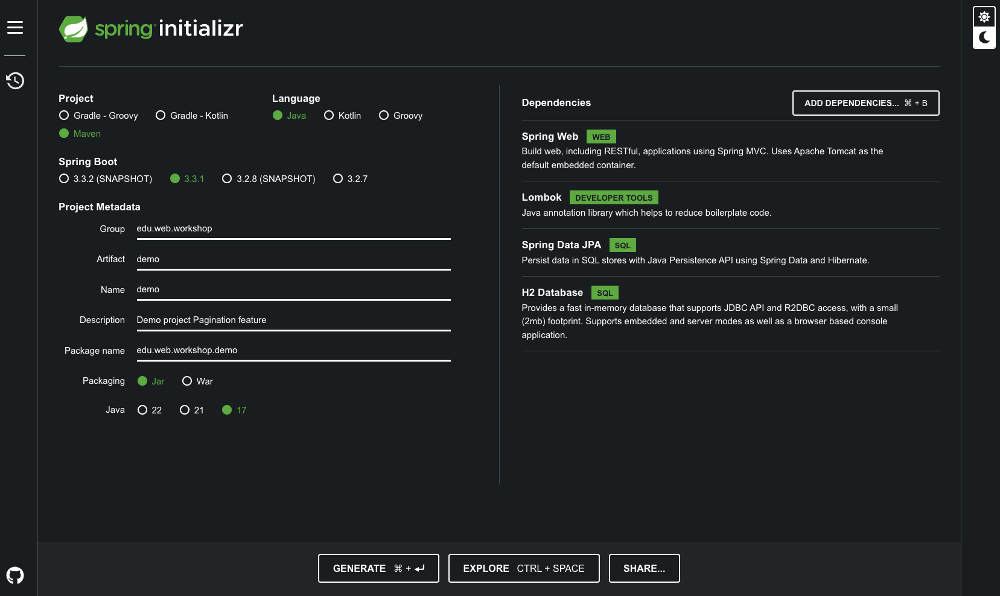
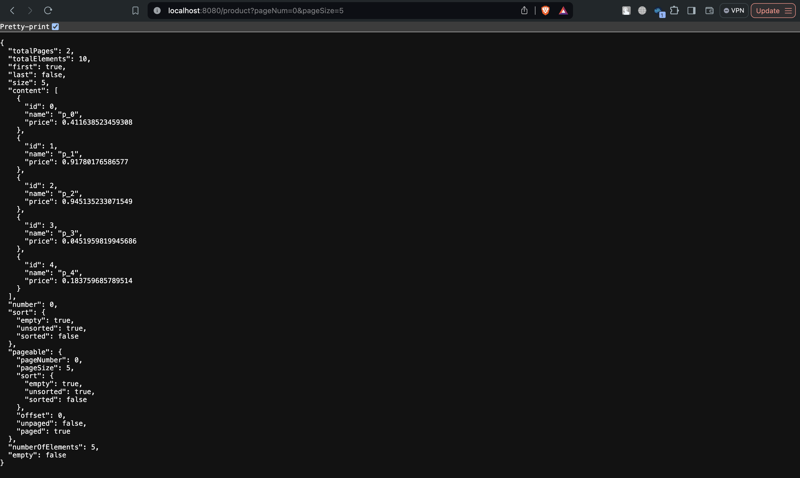

<div align="center">
تهیه‌کنندگان:
مهدی علیزاده،‌ محمد مشتاقی‌فر
</div>

<div dir = 'rtl' style='text-align:justify'>

# قابلیت Pagination در Spring

در این فایل قرار است با یکی از قابلیت‌های
Spring JPA
به نام
Pagination
آشنا شویم. در ابتدا یک توضیح کلی از اینکه چرا و چه زمانی به
Pagination
نیاز داریم می‌دهیم و سپس نحوه پیاده‌سازی آن در
Spring
را می‌بینیم. در آخر هم یک مثال عملی کوچک از این کار را مشاهده خواهیم کرد.

## توضیح کلی Pagination

قابلیت
Pagination
به این معنا است که داده درخواستی را به صورت کامل ارسال نکنیم و با ورودی گرفتن دو مقدار
Page Num و Page Size
داده را به صفحاتی با اندازه
Page Size
بشکانیم و صفحه با شماره
Page Num
را در خروجی ارسال کنیم.

این قابلیت عموما زمانی استفاده می‌شود که مجموعه داده
(dataset)
بزرگی داریم و ارسال این حجم داده در شبکه می‌تواند زمان زیادی از کاربر بگیرد و شبکه را شلوغ کند. به همین دلیل به سراغ این ایده می‌رویم که داده را در تکه‌های کوچک
(small chunks)
بفرستیم که همان ایده pagination
است. در ادامه با نحوه پیاده‌سازی آن در
Spring
آشنا می‌شویم.

## قابلیت Pagination در Spring

برای معرفی این قابلیت در
Spring
ابتدا یک یادآوری از
Spring JPA
می‌کنیم.

### یادآوری Spring JPA

در
Spring
کتابخانه‌ای که با استفاده از آن می‌توانیم به دیتابیس متصل شویم و به آن کوئری بزنیم
Spring JPA
است. همچنین با استفاده از این کتابخانه می‌توانیم با تعریف یک
Repository
کوئری‌های SQL
را به عنوان توابع
Java
تعریف کنیم و از پیچیدگی‌های زبان
SQL
در پیاده‌سازی‌مان راحت شویم. البته دقت کنید که کوئری‌های پیچیده را می‌توانیم خودمان هم با استفاده از
`Query@`
به توابع جاوا ترجمه کنیم.

### استفاده از Pagination در ‌Spring JPA

برای استفاده از قابلیت
Pagination
در Spring JPA
دو گام زیر را باید انجام دهیم:‌

1. باید یک
`PageRequest`
درست کنیم که با استفاده از تابع
`PageRequest.of(int num, int size)`
قابل انجام است.
`PageRequest`
یکی از پیاده‌سازی‌های رابط
`Pageable`
ساخت.
2. پاس دادن شیء ساخته شده در مرحله قبل
(از جنس
`PageRequest`)
به عنوان یک آرگومان به تابع
Repository
که می‌خواهیم روی خروجی آن قابلیت
Pagination
را پیاده‌سازی کنیم. زیبایی
Spring JPA
اینجاست که بدون نیاز به تغییر در
Repository
می‌توانیم این قابلیت را اضافه کنیم و با پاس دادن شیء از جنس
`PageRequest`
به تابع
Repository،
خروجی تابع می‌تواند به عنوان شیء‌ از جنس
`<Page<T`
یا
`<Slice<T`
یا
`<List<T`
مورد استفاده قرار بگیرد
(که `T`
جنس
Entity
 ذخیره شده در پایگاه داده است.)
 و می‌توانیم با توجه به نیازمان هرکدام از این تایپ‌ها را به عنوان خروجی در نظر بگیرید.

یک شیء از جنس
`<Page<T`
قابلیت اضافه‌ای دارد که علاوه بر لیستی از
Entityهای
ما از جنس
`T`،
در خود تعداد کل صفحه‌های موجود را هم برمی‌گرداند که برای مثال می‌تواند برای
Front-end
استفاده شود.
Spring
این کار را با استفاده از یک کوئری
SQL
اضافه روی پایگاه داده انجام می‌دهد تا بتواند تعداد کل
Entityهای موجود در جدول مورد نظر را بیابد و از روی آن بفهمد که در کل این Entityها به چند صفحه با اندازه
`pageSize`
تقسیم می‌شوند. البته این کار یک
Overhead
اضافه دارد که می‌توانیم با استفاده از
`<Slice<T`
یا
`<List<T`
به عنوان خروجی تابع
Repository
از آن جلوگیری کنیم.

## مثال عملی

ابتدا
با استفاده از سایت
[Spring Initializer](https://start.spring.io/)
یک
Spring Application
می‌سازیم و
Dependencyهای
مورد نیازمان را که در تصویر پایین مشاهده می‌کنید به آن اضافه می‌کنیم.



سپس
Entity
زیر را تعریف می‌کنیم و به برنامه خود اضافه می‌کنیم.
</div>

<div dir = 'ltr' style='text-align:justify'>

```java
@Entity
@Getter
@Setter
@NoArgsConstructor
public class Product {

    @Id
    private long id;
    private String name;
    private double price;

}
```

در گام بعدی، برای دسترسی به این
Entity
و کوئری زدن روی جدول آن، به یک
Repository
نیاز داریم که به صورت زیر تعریف می‌کنیم.

<div dir = 'ltr'>

```java
@Repository
public interface ProductRepository extends JpaRepository<Product, Long> {
}
```

</div>

در نهایت با تعریف
[`ProductService`](./demo/src/main/java/edu/web/workshop/demo/service/ProductService.java)
و
[`ProductController`](./demo/src/main/java/edu/web/workshop/demo/controller/ProductController.java)
نیز به برنامه اضافه می‌کنیم تا بتوانیم یک
End-Point
تعریف کنیم. همچنین با استفاده از
`PostConstruct@`
درون
`ProductService`
 تعدادی
`Product`
می‌سازیم و در پایگاه داده اضافه می‌کنیم.
در نهایت می‌توانیم با باز کردن مرورگر و وارد کردن
آدرس
[http://localhost:8080/product?pageNum=0&pageSize=5](http://localhost:8080/product?pageNum=0&pageSize=5)
نتیجه درخواستمان را مشاهده کنیم.



## مراجع

1. [https://www.baeldung.com/spring-data-jpa-pagination-sorting](https://www.baeldung.com/spring-data-jpa-pagination-sorting)
2. [https://docs.spring.io/spring-data/rest/reference/paging-and-sorting.html](https://docs.spring.io/spring-data/rest/reference/paging-and-sorting.html)

</div>
