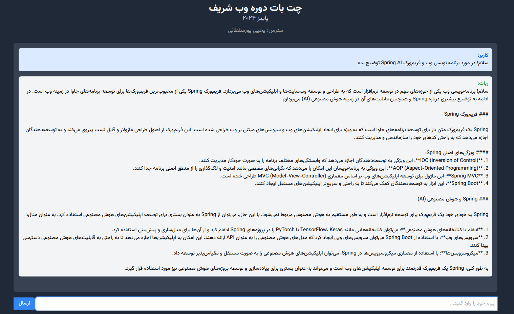

# پیاده‌سازی یک چت‌بات ساده با فریم‌ورک Spring AI

#### ارائه درس برنامه‌سازی وب
#### مدرس: یحیی‌پور سلطانی
#### ترم پائیز ۱۴۰۳
- **پدید آورندگان: امیرسعید احمدی، دنیا نوابی، امیرحسین محمدزاده، آریا ترابی**


**مستند پروژه را می‌توانید از [این‌جا](SpringAI-ChatBot-Document.pdf) مشاهده و دریافت کنید.
همچنین فیلم راهنمایی و توضیحات را نیز می‌توانید از [این لینک](https://drive.google.com/file/d/1vo6uSsudAYZcvuU1vPmQjDnS5YCX8I1M/view?usp=sharing) مشاهده کنید.**

## معرفی پروژه
این یک برنامه Spring Boot است که نحوه ایجاد یک چت‌بات با قابلیت پخش جریانی را با استفاده از Spring AI و مدل gpt-4o از OpenAI نشان می‌دهد. این اپلیکیشن به کاربران اجازه می‌دهد تا از طریق پاسخ‌های سنتی درخواست-پاسخ و نیز پاسخ‌های جریانی با هوش مصنوعی تعامل داشته باشند.



## پیش‌نیازهای پروژه

- Java 23
- Maven 3.6.3 یا نسخه‌های جدیدتر
- Spring Boot 3.3.4
- Spring AI 1.0.0-M2

## وابستگی‌ها

این پروژه دارای وابستگی‌های زیر می‌باشد (که باید به فایل `pom.xml` اضافه شود):

- `spring-boot-starter-web`: 
- `spring-ai-openai-spring-boot-starter`: 
- `spring-boot-starter-test`: 

## شروع کار

برای شروع کار با این پروژه، ابتدا از نصب بودن Java 23 و Maven بر روی سیستم خود اطمینان حاصل کنید. سپس مراحل زیر را دنبال کنید:

1. تنظیم کلید API OpenAI:

   - صادر کردن کلید API OpenAI: 
      ```
      export OPENAI_API_KEY <YOUR_KEY>
      ```
   - فایل `application.properties` را در دایرکتوری `src/main/resources` پیدا کنید

   - مشخص کنید که می‌خواهید از مدل gpt-4o-mini (یا مدل مورد نظر خود) استفاده کنید:
     ```
     spring.ai.openai.chat.options.model=gpt-4o-mini
     ```

2. بیلد کردن و اجرای پروژه:
   ```
   mvn clean install
   mvn spring-boot:run
   ```

با اجرای برنامه، شما قادر خواهید بود با استفاده از `end-point` های چت، با آن تعامل کنید.

## نحوه اجرای برنامه

این پروژه شامل back-end مربوط به `end-point` های چت است که در مسیرهای `/chat` و `/stream` در دسترس هستند. 

1. چت سنتی (درخواست POST):
   ```
   POST http://localhost:8080/chat?message=Your-Msg
   ```

2. چت Streaming (درخواست GET):
   ```
   GET http://localhost:8080/stream?message=Your-Msg
   ```

می‌توانید از ابزارهایی مانند cURL، Postman یا یک رابط کاربری ساده برای تعامل با این end-point ها استفاده کنید. یکی از موارد مفید، استفاده از [httpie](https://httpie.io/) با گزینه `--stream` است:

```
http --stream :8080/stream message=="وب برنامه نویسی چیست؟"
```

همچنین برای دسترسی به صفحهٔ فرانت‌اند آماده شده و چت با آن، می‌توانید به آدرس‌های زیر مراجعه کنید:

- برای چت سنتی: `<locathost-or-server>/index.html`

- برای چت Streaming: `<locathost-or-server>/stream.html`


# منابع

- استفاده از تعاریف و کدهای این سایت (که در شیت قرارداده شده بود)، در پیاده‌سازی:

https://docs.spring.io/spring-ai/reference/api/chatclient.html

- استفاده از تعاریف و راه‌اندازی  spring ai chat:

https://youtu.be/q2p0mG4RICM?si=0z_wuBnzvm-8pc6G
