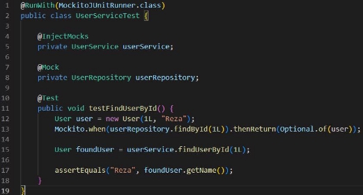
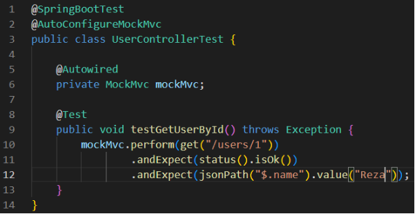

**بسمه تعالی**

**تحقیق درس برنامه سازی وب آزمون نویسی در Spring Boot**  

استاد:  
یحیی پورسلطانی  

نگارندگان:  

رضا وحیدی مجد 99102491 - مهدی صابر 99105526 - آرمین ثقفیان 99105345 
 

**مقدمه**
در دنیای توسعه نرم‌افزار، آزمون ‌نویسی یکی از مهم ‌ترین جنبه ‌های تضمین کیفیت کد محسوب می‌شود. در چارچوب Spring Boot، روش‌ های مختلفی برای نوشتن و اجرای تست‌ ها وجود دارد که به توسعه ‌دهندگان کمک می‌کند از صحت عملکرد برنامه ‌های خود اطمینان حاصل کنند. این تحقیق به بررسی انواع آزمون‌نویسی در Spring Boot، ابزارهای مرتبط و بهترین روش‌های نوشتن تست‌های موثر می‌پردازد.

**اهمیت آزمون نویسی در Spring Boot**  

به عنوان یکی از محبوب ‌ترین چارچوب‌ های توسعه برنامه ‌های کاربردی مبتنی بر جاوا، امکان توسعه سریع و آسان را فراهم می ‌کند. با افزایش پیچیدگی برنامه ‌ها، اطمینان از عملکرد صحیح آنها از طریق آزمون‌ نویسی اهمیت ویژه ‌ای پیدا می‌ کند. برخی از مزایای آزمون‌ نویسی در Spring Boot عبارتند از:
- کاهش باگ ها و افزایش پایداری نرم افزار  
- افزایش قابلیت نگهداری کد  
- امکان تغییر و توسعه آسان تر  
- اطمینان از عملکرد صحیح اجزای مختلف برنامه  

**انواع آزمون نویسی در Spring Boot**  

در چارچوب Spring Boot، انواع مختلفی از روش های مختلف برای تست کردن برنامه وجود دارد که با توجه به نیاز و خواسته مسئله، و همچنین جزئیات پیاده سازی، می توان از میان آنها مناسب ترین را انتخاب کرد. روش های آزمون نویسی به شرح زیر است:
1.	آزمون های واحد (Unit Testing)
2.	آزمون های یکپارچه سازی (Integration Testing)
3.	آزمون های پذیرش (Acceptance Testing)
4.	آزمون های عملکردی (Performance Testing)
که در ادامه به توضیح هر کدام از آنها و مثال های مربوطه می پردازیم.

**1.	آزمون های واحد (Unit Testing)**

آزمون ‌های واحد در Spring Boot به منظور تست کردن قطعات کوچکی از کد (مانند متدها یا کلاس‌ها) انجام می ‌شود. این آزمون‌ ها به صورت مستقل از سایر اجزای برنامه اجرا می‌شوند و هدف اصلی آن‌ ها شناسایی مشکلات در منطق برنامه یا کدهای خاص است. به این ترتیب، تست‌ های واحد به توسعه‌ دهندگان این امکان را می ‌دهند که هر جزء از برنامه را به صورت مجزا تست کرده و صحت عملکرد آن را بررسی کنند. یکی از مزایای این روش این است که اجرای تست‌ها بسیار سریع است و معمولاً نتیجه‌گیری از آن‌ها به سرعت انجام می‌شود.
 ابزارهای اصلی برای انجام آزمون‌ های واحد عبارتند از:
•	JUnit: یکی از محبوب ‌ترین فریمورک ‌های تست در جاوا
•	Mockito: کتابخانه‌ ای برای ایجاد mock objects جهت شبیه ‌سازی وابستگی ‌ها
•	AssertJ: کتابخانه ‌ای برای افزایش خوانایی و قابلیت استفاده از تست‌ها
نمونه کد با استفاده از Mockito  و Junit که برای تست کردن کلاس UserService نوشته شده است:

این تست بررسی می‌ کند که آیا متد UserService.findUserById به درستی یک کاربر را از مخزن داده (repository) بازیابی می ‌کند یا نه. به جای استفاده از یک پایگاه داده واقعی، UserRepository را شبیه‌سازی (mock) می‌کند و اطمینان می‌دهد که تست به صورت مستقل و بدون وابستگی اجرا شود.

**2.	آزمون های یکپارچه سازی (Integration Testing)**

آزمون‌های یکپارچه ‌سازی در Spring Boot برای بررسی تعاملات بین اجزای مختلف سیستم طراحی می ‌شوند. این آزمون ‌ها معمولاً در سطح بالاتری از آزمون‌های واحد اجرا می ‌شوند و به تست کردن تعاملات بین ماژول‌ها، پایگاه داده، سرویس‌ها و دیگر اجزای برنامه می ‌پردازند. این آزمون ‌ها به‌ ویژه در برنامه‌ هایی که از چندین سیستم خارجی استفاده می ‌کنند یا به پایگاه داده متصل می ‌شوند، اهمیت زیادی دارند. در Spring Boot، می‌توان از ویژگی‌هایی مانند @SpringBootTest استفاده کرد تا یک محیط تست مشابه به محیط واقعی برنامه ایجاد شود و عملکرد سیستم تحت شرایط مشابه بررسی گردد.
ابزارهای رایج:

•	Spring Boot Test: برای راه‌اندازی یک محیط آزمایشی Spring Boot
•	Testcontainers: برای اجرای پایگاه داده‌های موقتی در حین تست
•	MockMvc: برای آزمون کنترلرهای وب بدون اجرای سرور واقعی

مثال از آزمون یکپارچه سازی:  

این کد جاوا یک تست Spring Boot برای UserController است که از MockMvc برای شبیه‌ سازی درخواست ‌های HTTP و بررسی پاسخ‌ ها استفاده می‌کند. این تست تأیید می‌ کند که هنگام ارسال یک درخواست GET به Users/1/، پاسخ کد وضعیت HTTP 200 OK را برمی‌گرداند و همچنین شامل یک بدنه JSON است که در آن فیلد name مقدار “Reza” را دارد.

**3.	آزمون های پذیرش (Acceptance Testing)**

آزمون‌های پذیرش در Spring Boot به بررسی تطابق رفتار سیستم با نیازمندی‌های مشخص شده توسط مشتری یا کاربر نهایی می‌پردازند. این آزمون‌ها معمولاً در پایان فرآیند توسعه انجام می‌شوند و هدف آن‌ها این است که از رضایت مشتری از عملکرد سیستم اطمینان حاصل کنند. این آزمون‌ها می‌توانند به صورت دستی یا خودکار انجام شوند. در Spring Boot، این تست‌ها می‌توانند شامل بررسی صحت فرایندها، رابط‌های کاربری و سرویس‌های RESTful باشند.

میتوانند به صورت دستی یا خودکار انجام شوند. در Spring Boot، این تستها میتوانند شامل بررسی صحت فرایندها، رابطهای کاربری و سرویسهای 

 ابزارهای رایج:
•	Cucumber: برای نوشتن تست‌های پذیرش به صورت BDD
•	RestAssured: برای تست APIهای RESTful

**4.	آزمون های عملکردی (Performance Testing)**

آزمون ‌های عملکردی در Spring Boot به منظور ارزیابی عملکرد سیستم تحت بارهای مختلف، مانند تعداد درخواست‌های همزمان، استفاده می‌ شوند. هدف این آزمون‌ ها شناسایی نقاط ضعف در عملکرد سیستم و اطمینان از اینکه سیستم می‌ تواند با مقیاس بالا به درستی عمل کند، است. در Spring Boot، برای تست عملکرد می ‌توان به صورت مستقیم درخواست ‌هایی به APIها ارسال کرده و زمان پاسخ ‌دهی، ظرفیت سیستم، و استفاده از منابع را بررسی کرد. این تست‌ها به توسعه ‌دهندگان کمک می ‌کنند تا سیستم را بهینه ‌سازی کرده و از ایجاد مشکلات عملکردی در محیط‌ های تولید جلوگیری کنند.
 ابزارهای پرکاربرد:
•	JMeter: برای بارگذاری و تست عملکرد
•	Gatling: برای شبیه‌سازی تعداد زیادی درخواست همزمان

**بهترین شیوه‌های آزمون‌نویسی در Spring Boot:**

1.	استفاده از نام‌ گذاری مناسب برای تست‌ها
2.	ایزوله ‌سازی تست‌ های واحد از وابستگی ‌های خارجی
3.	استفاده از Testcontainers برای تست پایگاه داده‌ها
4.	اجرای تست ‌ها به صورت خودکار در CI/CD
5.	استفاده از ابزار های نظارت بر پوشش کد مانند  Jacoco

در مجموع، آزمون‌نویسی در Spring Boot یکی از مهم‌ترین جنبه‌ های توسعه نرم‌ افزار است که به بهبود کیفیت، کاهش باگ ‌ها، و افزایش قابلیت نگهداری کمک می ‌کند. با استفاده از ابزارهای مناسب و پیروی از بهترین شیوه‌ ها، می ‌توان تست‌ های موثری نوشت که عملکرد برنامه را تضمین کنند. بهره ‌گیری از ترکیبی از آزمون‌ های واحد، یکپارچه ‌سازی، پذیرش وعملکردی باعث ایجاد یک نرم‌ افزار پایدار و قابل اطمینان می‌شود.

**منابع **

[ https://spring.io/guides/gs/testing-web ](https://spring.io/guides/gs/testing-web) [ https://spring.io/guides/gs/serving-web-content](https://spring.io/guides/gs/serving-web-content)

[https://docs.spring.io/spring-boot/reference/testing/spring -](https://docs.spring.io/spring-boot/reference/testing/spring-boot-applications.html)

[ boot-applications.html](https://docs.spring.io/spring-boot/reference/testing/spring-boot-applications.html)

[ /https://www.arhohuttunen.com/spring-boot-webmvctest](https://www.arhohuttunen.com/spring-boot-webmvctest/)

[ /https://reflectoring.io/spring-boot-web-controller-test](https://reflectoring.io/spring-boot-web-controller-test/)

