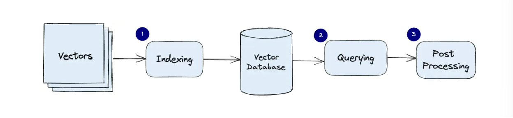
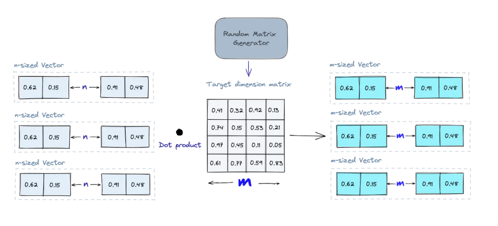
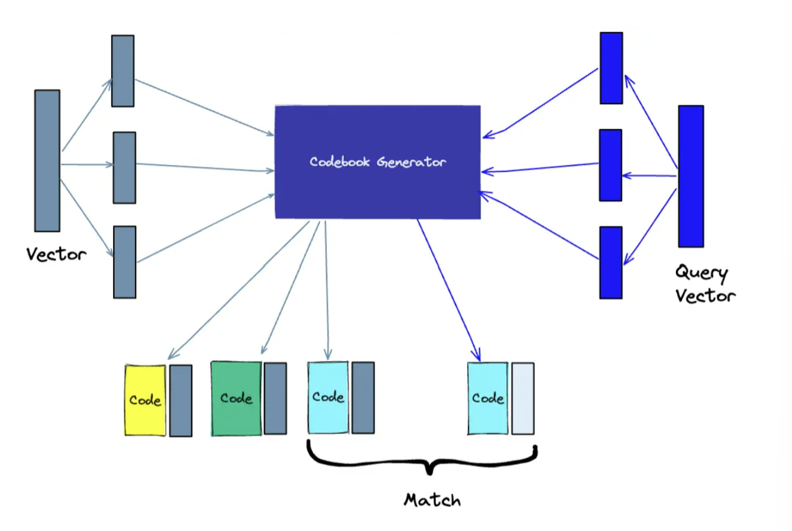
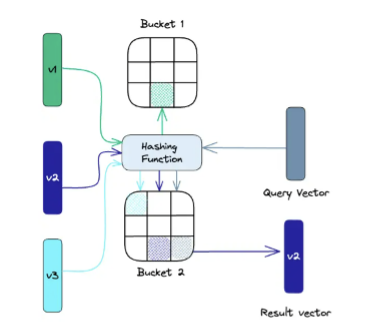

<div dir="rtl">

# Spring Vector Database

<div align="center">


<p align="center">
    تحقیق پایان ترم برنامه سازی وب، دانشگاه صنعتی شریف
    <br/>
    استاد درس: دکتر یحیی پورسلطانی
    <br/>
    نویسندگان: آرمین گرامی راد - محمدحسین اسلامی - سیدیوسف میریوسفی
</p>

</div>

<hr>

# مقدمه

در دنیای امروزی، بسیاری از اعمال در حال حرکت به سمت استفاده از هوش‌مصنوعی و داده‌های ابعاد بالا هستند. پایگاه‌داده‌های مرسوم، قابلیت پردازش و ذخیره چنین داده‌هایی را نداشته و کار‌هایی مانند سیستم‌های پیشنهادهنده، بازیابی تصاویر و یا حتی پردازش زبان‌های طبیعی را نمی‌توان با استفاده از آن‌ها انجام داد. پایگا‌ه‌داده‌های برداری این قابلیت را به ما می‌دهند تا با استفاده از ویژگی‌های ارائه شده توسط آن‌ها بتوانیم داده‌های ابعاد بالا را ذخیره و مدیریت کنیم. همچنین به دلیل پیاده‌سازی این نوع پایگاه‌داده در کنار اکثر برنامه‌های مبتنی بر AI، جست‌وجو‌های مشابهت بسیار سریع انجام می‌شود. در این پایگاه‌داده‌ها برخلاف پیگاه‌داده‌های مرسوم، پیدا کردن تطابق دقیق بین درخواست و موارد موجود در پایگاه‌داده هدف نیست و ما می‌خواهیم مواردی که شبیه به درخواست ما هستند را پیدا می‌کنیم. روش‌های مختلفی مانند cosine similarity و یا ضرب داخلی برای مشخص کردن فاصله و شباهت بین دو بردار وجود دارد که از آن‌ها می‌توان در پیاده‌سازی این مدل پایگاه‌داده‌ها استفاده کرد.  

# نحوه کارکرد

در ابتدا به نحوه ذخیره‌سازی داده‌ها درون این نوع پایگاه‌داده می‌پردازیم. هنگامی که می‌خواهیم داده‌ای را ذخیره کنیم، با استفاده از یک مدل، داده در ابعاد بالا را embed می‌کنیم. این موضوع به ما کمک می‌کند تا یک نمایش یکتا اما در ابعاد کنترل شده برای داده‌های خود داشته باشیم. علاوه بر ذخیره‌سازی داده، یک پایگاه‌داده باید بتواند به درخواست‌ها هم پاسخ دهد. مدلی که برای embed کردن داده‌ها استفاده شده بود برای embed کردن درخواست‌ها نیز استفاده می‌شود تا بتوان در همان فضا و از همان توزیع به درخواست‌ها پاسخ داد. 
به طور کلی جست‌وجو در پایگاه‌داده‌های برداری ۳ بخش اساسی برای انجام کار‌های خود دارد که در ادامه هر کدام از بخش‌ها را به صورت خلاصه توضیح می‌دهیم:


- می‌دانیم یکی از روش‌های افزایش سرعت در پایگاه‌داده‌ها indexing است.  برای انجام این کار در پایگاه‌داده‌های برداری از الگوریتم‌های متفاوتی مانند PQ، LSH و HNSW استفاده می‌شود که در آینده به ما کمک می‌کند تا جست‌وجوهای سریع‌تری برای داده‌های ابعاد بالا انجام دهیم. 
- قسمت دوم عملیات‌های این مدل پایگاه‌داده‌ها، پاسخ دادن به یک درخواست است. پایگاه‌داده درخواست را به عنوان ورودی می‌گیرد و با استفاده از متریک‌های از پیش تعریف شده، سعی می‌کند تا نزدیک‌ترین مورد در جداول را پیدا کند و آن را به عنوان جواب پاسخ برگرداند. همانطور که بالاتر هم اشاره شد، متریک‌های مختلف براساس نیاز استفاده می‌شوند تا بهترین نتیجه را برای کاربرد مدنظر ارائه دهند.بهبود ببخشید.
- در نهایت و در برخی شرایط لازم است تا هنگامی که نزدیک‌ترین پاسخ برگردانده می‌شود یک مرحله دیگر پردازش برروی آن‌ها انجام شود. این پردازش می‌تواند حساب کردن مجدد فاصله بین بردارها با یک متریک دیگر باشد. 
- با توجه به توضیحات بالا می‌توانیم به این نتیجه برسیم که در این مدل پایگاه‌داده‌ها دو پارامتر برای ما بسیار مهم هستند. یکی از این موارد سرعت بازیابی داده مدنظر است و مورد دیگر، دقت داده بازیابی شده. استفاده از روش‌های مختلف برای embed کردن اولیه و یا متریک‌های متفاوت برای پیدا کردن فاصله به ما کمک می‌کند تا یک trade-off بین دقت و سرعت برقرار کنیم و پایگاه‌داده خود را با توجه به کاربرد مدنظر بهینه کنیم.

<div align="center">

</div>

# نحوه اندیس‌دهی و embed کردن

پس از آن که با مفهوم و معماری کلی پایگاه‌داده‌های برداری و شمای کلی کارکرد آن‌ها آشنا شدیم، به سراغ نحوه ذخیره داده‌ها و روش‌های مختلف embedding آن‌ها می‌رویم. همانطور که بالاتر هم اشاره شد، روش‌های مختلفی برای این کار هست که در ادامه برخی از آن‌ها را شرح می‌دهیم. 

- Random Projection:
<p dir="rtl">
در این روش، با استفاده از یک ماتریس تبدیل، داده‌هایی که در ابعاد بالا هستند، به داده‌هایی در ابعاد پایین‌تر تبدیل می‌شوند که نگه‌داری آن‌ها و محاسبات انجام شده بر آن‌ها کم‌هزینه‌تر خواهد بود. در واقع هرگاه که می‌خواهیم داده‌ای را در پایگاه‌‌داده ذخیره کنیم، ابتدا آن را به فضای جدید برده و سپس آن را ذخیره می‌کنیم. حال اگر بخواهیم به درخواستی پاسخ دهیم، ابتدا درخواست را با همان ماتریس به فضای جدید برده و سپس به وسیله متریک‌های متفاوتی که برای اندازه‌گیری شباهت تعریف می‌شوند نزدیک‌ترین همسایه‌ها به بردار درخواست خود پیدا می‌کنیم. دقت شود که مقدار رندوم بودن وزن‌ها می‌تواند تأثیر قابل‌توجهی در درستی عملکرد پایگاه‌داده ما داشته باشد. 
</p>

<div align="center">

</div>

- Product Quantization:
<p dir="rtl">
این روش با استفاده از بخش‌بندی درخواست‌ها و داده‌هایی که قرار است در پایگاه‌داده ذخیره شوند، سعی می‌کند تا هزینه‌های مصرف شده برای ذخیره داده و یا پاسخ به درخواست‌ها را کاهش دهد. در این متد، بردار‌های اولیه به بخش‌های مختلفی شکسته می‌شوند. به هر بخش یک یا چند کد داده می‌شود تا آن بخش‌ها به وسیله این کد‌های ساده‌شده نشان‌ داده شوند. در واقع می‌خواهیم هر بردار را بدون آن که به ابعاد پایین‌تر منتقل کنیم، به وسیله نمایشی ساده‌تر encode کنیم. نگه داشتن بردار در فضای اولیه خود، باعث جلوگیری از data loss می‌شود. در نهایت، هرگاه بردار درخواستی به سمت پایگاه‌داده می‌آید، آن بردار هم به شیوه‌ ذکر شده به بخش‌های مختلف تقسیم شده و کدگذاری می‌شود تا با استفاده از آن کدها بتوانیم بردار‌های مشابه را پیدا کنیم. به طور کلی این روش به ۴ بخش اساسی تقسیم می‌شود. قسمت اول splitting می‌باشد که در آن بردارها به بخش‌های مختلف تقسیم می‌شوند. قسمت دوم، training است که در آن کدگذاری‌ها به وسیله روش‌هایی مانند k-means مشخص شده و یک مجموعه‌ای از کد‌ها برای یک بردار شکل می‌گیرد. در قسمت سوم، عمل کدگذاری با توجه به مجموعه ساخته شده انجام می‌شود (encoding). در نهایت و در قسمت querying، هرگاه درخواستی ارسال شود، درخواست به قسمت‌های کوچک‌تر تقسیم شده و به وسیله همان مجموعه کد (codebook) کدگذاری می‌شود تا بتوان نزدیک‌ترین همسایه به آن را پیدا کرد. 
</p>

<div align="center">

</div>

- Locality-sensitive hashing:

<p dir="rtl">
همانطور که از اسم این روش پیداست، در این متد ما سعی می‌کنیم تا با استفاده از توابع hash و تقسیم‌بندی بردار‌ها به گروه‌های متفاوت، فضای جست‌وجو را کوچکتر کنیم و سرعت خود را برای پیدا کردن بردار‌های مشابه افزایش دهیم. در ابتدا، بردار‌های داده همگی با استفاده از توابع hash و خرجی آن توابع به گروه‌های مختلف تقسیم می‌شوند. سپس هرگاه درخواستی به سمت پایگاه‌داده بیاید، با استفاده از همان توابع hash، بردار درخواست به یکی از گروه‌ها تخصیص داده می‌شود تا در یک فضای محدود‌تری به دنبال بردار‌های مشابه بگردیم. دقت شود که انتخاب تابع hash در این متد از اهمیت زیادی برخوردار است و انتخاب درست این تابع می‌تواند تأثیر قابل‌توجهی در عملکرد پایگاه‌داده ما داشته باشد. 
</p>

<div align="center">

</div>


# متریک‌های محاسبه شباهت
تاکنون معماری و نحوه کار با یک پایگاه‌داده برداری را دیدیم ولی شاید مهمترین قسمت و مفهوم در یک پایگاه‌داده برداری، نحوه محاسبه شباهت بین بردارهاست. این مفهوم به قدری اهمیت دارد که انتخاب نوع متریک و روش استفاده شده برای این محاسبه تأثیر بسزایی در عمکرد برنامه و سیستم ما خواهد داشت. انتخاب متریک به عوامل مختلفی بستگی دارد. این عوامل شامل کاربرد برنامه‌ای که پایگاه‌داده در کنار آن استفاده می‌شود، مقدار منابع موجود و نحوه اندیس‌گذاری می‌باشد. در ادامه چند روش برای محاسبه شباهت را معرفی و در مورد آن‌ها توضیح کوتاهی می‌دهیم:

- Cosine Similarity:

<p dir="rtl">
در این روش ما کوسینوس زاویه بین دو بردار را محاسبه می‌کنیم. این مقدار می‌تواند بین -1 و 1 قرار بگیرد که هرچه مقدار آن بیشتر، شباهت بین دو بردار بیشتر و هرچه کمتر، شباهت بین دو بردار کمتر خواهد بود. این روش صرفا جهت بردار‌ها را در نظر می‌گیرد و توجهی به اندازه آن‌ها ندارد که این موضوع برای زمان‌هایی که اندازه بردارها هم معنی دارند، می‌تواند باعث بروز مشکل شود. 
</p>

- Euclidean Distance:

<p dir="rtl">
این متریک، فاصله یک خط مستقیم بین دو بردار را محاسبه می‌کند و مقدار آن همیشه نامنفی است. در این متریک، علاوه بر جهت، به اندازه نیز توجه شده است که این موضوع مشکل روش قبلی را از این جهت برطرف می‌کند. یکی از مشکلات این روش، حساس بودن به مقیاس بردار است به طوری که شاید دو بردار شباهت زیادی داشته باشند اما به دلیل تفاوت در مقیاس، این متریک فاصله زیادی را بین آن‌ها گزارش دهد. 
</p>

# مثال

### راه‌اندازی پروژه:
ایجاد پروژه در [Spring Initializr](https://start.spring.io/) با وابستگی های زیر:
```
Spring Boot Starter Web
Spring AI
Spring Boot Starter Data MongoDB
Spring Boot Starter Actuator
Qdrant Java Client
```

### اجرای Qdrant با Docker:
```
docker run -p 6333:6333 qdrant/qdrant
```
اکنون پایگاه‌داده Qdrant در http://localhost:6333 اجرا شده است.


<!-- ### استفاده از Spring AI با VectorDB:
<p dir="rtl">
Spring AI یک لایه انتزاعی برای کار با جستجوی برداری و مدل‌های تعبیه‌ای (Embeddings) ارائه می‌دهد. این فریم‌ورک با Qdrant, FAISS, Pinecone, Milvus ادغام می‌شود.
</p> -->

###  پیکربندی `application.properties`:
```
spring.ai.vectordb.qdrant.host=http://localhost
spring.ai.vectordb.qdrant.port=6333
spring.ai.vectordb.qdrant.collection-name=my_vectors
spring.ai.embedding.openai.api-key=your-api-key
spring.ai.embedding.openai.model=text-embedding-ada-002
```

### تعریف مدل `VectorData.java`:
``` java
@Data
@AllArgsConstructor
@NoArgsConstructor
public class VectorData {
    @Id
    private String id;
    private List<Float> vector;
    private String text;
    private String metadata;
}
```

نقش: این کلاس ساختار داده‌ها را برای 
پایگاه‌داده برداری مشخص می‌کند.

فیلدهای اصلی:
```
id → شناسه‌ی منحصر‌به‌فرد
vector → بردار تعبیه‌ای مربوط به متن
text → متن اصلی مرتبط با بردار
metadata → اطلاعات تکمیلی درباره‌ی سند
```

### تعریف مخزن `VectorRepository.java`:
``` java
@Repository
public interface VectorRepository extends VectorStore {
}
```

نقش: این کلاس مسئول ارتباط مستقیم با پایگاه‌داده برداری (Qdrant) است.

وظایف:
- ذخیره‌سازی و بازیابی داده‌های برداری
- اجرای جستجوی KNN برای یافتن بردارهای مشابه
- استفاده از Spring AI VectorStore برای تعامل با Qdrant


### تعریف سرویس `VectorService.java`:
``` java
@Service
public class VectorService {

    private final VectorStore vectorStore;
    private final EmbeddingModel embeddingModel;

    public VectorService(VectorStore vectorStore, EmbeddingModel embeddingModel) {
        this.vectorStore = vectorStore;
        this.embeddingModel = embeddingModel;
    }

    public void addDocument(String text, String metadata) {
        List<Float> vector = embeddingModel.embed(text);
        VectorData data = new VectorData(null, vector, text, metadata);
        vectorStore.add(vector, data);
    }

    public List<VectorData> searchSimilarDocuments(String query, int topK) {
        List<Float> queryVector = embeddingModel.embed(query);
        return vectorStore.findNearest(queryVector, topK);
    }
}
```

نقش: این کلاس لایه سرویس است که منطق پردازش داده‌ها را مدیریت می‌کند.

وظایف:
- دریافت متن و تبدیل آن به بردارهای تعبیه‌ای (Embeddings)
- افزودن داده‌های برداری به پایگاه‌داده
- جستجوی بردارهای مشابه برای بازیابی اسناد مرتبط
- ارتباط بین VectorController و VectorRepository

### تعریف کنترلر `VectorController.java`:
``` java
@RestController
@RequestMapping("/vectors")
public class VectorController {

    private final VectorService vectorService;

    public VectorController(VectorService vectorService) {
        this.vectorService = vectorService;
    }

    @PostMapping("/add")
    public void addVector(@RequestParam String text, @RequestParam String metadata) {
        vectorService.addDocument(text, metadata);
    }

    @GetMapping("/search")
    public List<?> searchVectors(@RequestParam String query, @RequestParam int k) {
        return vectorService.searchSimilarDocuments(query, k);
    }
}
```

نقش: این کلاس کنترلر Spring Boot است که نقاط پایانی REST را برای مدیریت داده‌های برداری فراهم می‌کند.

وظایف:
- افزودن اسناد جدید به پایگاه‌داده برداری
- جستجوی K-نزدیک‌ترین بردارها (KNN Search)
- دریافت درخواست‌های کاربر و ارسال به VectorService

### آزمون و استعلام بردارها:
<p dir="rtl">
1. اجرای Spring Boot
</p>
2. افزودن سند جدید:

``` 
curl -X POST "http://localhost:8080/vectors/add" \
     -H "Content-Type: application/json" \
     -d '{"text": "Machine learning algorithms", "metadata": "AI topic"}'
```

<p dir="rtl">
3. جستجوی K-نزدیک‌ترین اسناد:
</p>

``` 
curl -X GET "http://localhost:8080/vectors/search?query=deep learning&k=3"
```


# جمع بندی

همانطور که می‌دانیم، استفاده از داده‌ها در ابعاد بالا به دلیل روی کار آمدن ابزارهایی مبتنی برهوش مصنوعی رشد چشم‌گیری داشته است. پایگاه‌داده‌های مرسوم توانایی ذخیره و بازیابی چنین داده‌هایی را ندارند بنابراین باید به فکر معماری جدیدی برای مکانی که بتوان داده‌ها را در آن ذخیره کرد بود. برای برطرف کردن این مشکل، پایگاه‌داده‌های برداری معرفی شدند. در این پایگاه‌داده‌ها، داده‌ها با روش‌های مختلفی که در بالاتر ذکر شد، embed می‌شده و نمایش جدیدی به خود می‌گیرند و به همین شکل در پایگاه‌داده ذخیره می‌شوند. در ادامه و با آمدن درخواستی، بردار درخواست هم به شکلی مشابه embed می‌شود تا بتوان بردارهای مشابه با بردار درخواست را در پایگاه‌داده  پیدا کرد. روش‌های مختلفی برای پیدا کردن مشابهت وجود دارد که هرکدام را می‌توان برای کاربردهای متفاوت استفاده کرد.  
در این تحقیق ما سعی کردیم تا با تعریف پایگاه‌داده‌های برداری و معماری آن دید بهتری در مورد این مدل پایگاه‌داده‌‌ها بدهیم. در کنار آن تلاش شد تا برخی از روش‌های متفاوت استفاده شده در این مدل را تشریح کنیم و نحوه کارکرد پایگاه‌داده را به صورت خلاصه توضیح دهیم. 


# مراجع

- [Springboot AI documents](https://docs.spring.io/spring-ai/reference/api/vectordbs.html)
- [Pinecone: Vector Database](https://www.pinecone.io/learn/vector-database/)
