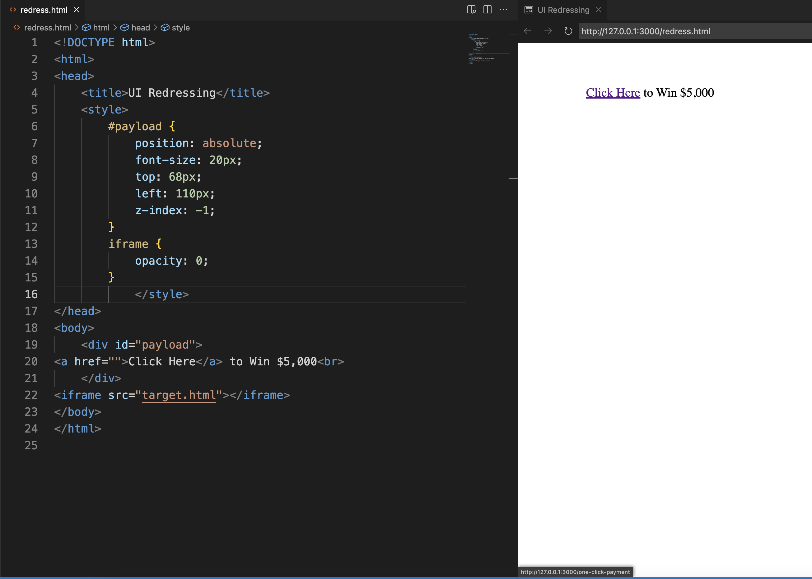

# 

<h1 align="center">UI Redressing</h1>

### تعریف

UI redressing یا حمله‌ی clickjack، از عناصر همپوشانی، فریم‌های (frame) شفاف و مهندسی اجتماعی استفاده کرده و زمانی اتفاق می‌افتد که یک شخص، قربانی را فریب می‌دهد تا روی صفحه‌ی شفافی که در بالای یک وب‌سایت قانونی (هدف) قرار دارد، کلیک کند یا با آن تعامل داشته باشد. مهاجمان معمولاً این کار را با استفاده از فریم‌های HTML انجام می‌دهند.

به عنوان مثال یک کاربر به همچین وب‌سایتی دسترسی پیدا می‌کند (ممکن است از طریق ایمیل جذب شده‌باشد.) و بر روی دکمه‌ای کلیک می‌کند تا جایزه‌ای برنده شود. آن‌ها ناآگاهانه توسط یک مهاجم فریب خورده‌اند و یک دکمه مخفی جایگزین را فشار می‌دهند و این منجر به پرداخت یک حساب کاربری در سایت دیگری می‌شود.

### انواع

این حمله دسته‌بند‌ی‌های متنوعی دارد. برای مثال:

- Classic: به موقعیتی اشاره دارد که یک مهاجم از لایه‌های پنهان در صفحات وب برای دستکاری اقدامات مکان‌نمای کاربر استفاده می‌کند و در نتیجه کاربر را در مورد آنچه که واقعاً روی آن کلیک می‌شود گمراه می‌کند.

- Likejacking: یک تکنیک مخرب برای فریب دادن کاربرانی است که یک وب‌سایت را مشاهده می‌کنند تا یک صفحه فیس‌بوک یا سایر پست‌ها/حساب‌های رسانه‌های اجتماعی را که آن‌ها عمداً قصد «لایک کردن» آن‌ها را نداشتند، «لایک» کنند.

- CookieJacking: در آن، کوکی‌ها از مرورگرهای وب قربانی به سرقت می‌روند. این کار با فریب دادن کاربر برای کشیدن (drag) شیئی انجام می‌شود که به ظاهر بی‌ضرر به نظر می‌رسد، اما در واقع باعث می‌شود کاربر کل محتوای کوکی مورد نظر را انتخاب کند. از آنجا، مهاجم می‌تواند کوکی و تمام داده‌هایی را که در اختیار دارد به دست آورد.

### نتیجه

نتیجه‌ی کار، بستگی به برنامه هدف دارد. تعامل معمولاً محدود به کلیک کردن یا سایر اقدامات ساده مانند کلیک کیبورد و یا لایک و موارد مشابه است. با این حال، در هر صورت، مهاجم نمی تواند داده‌های قربانی را استخراج کند. در واقع از این منظر، یک تعامل کور داریم. صرف نظر از ارزش یک ماشین به عنوان یک هدف، اگر نفوذهای موفق متعددی وجود داشته باشد، احتمال رسیدن به یک نتیجه‌ی مناسب، بیش‌تر است.

### کاهش و جلوگیری

دو راه کلی برای دفاع در برابر این حمله وجود دارد:

- روش‌های سمت client: رایج‌ترین آن‌ها Frame Busting نام دارد. روش‌های سمت کلاینت می‌توانند در برخی موارد مؤثر باشند، اما بهترین روش در نظر گرفته نمی‌شوند، زیرا می‌توان به راحتی از آن‌ها گذشت.

- روش‌های سمت server: برای جلوگیری از حملات کلاسیک که به تنهایی از مرورگر وب استفاده می‌کنند، در بیش‌تر موارد، اجازه ندادن برای بارگذاری برنامه‌ها در یک فریم دیگر کافیست. حداقل، منشاء برنامه‌ها باید در یک لیست مجاز که نیاز به بارگذاری فریم دارند،‌ بررسی شود. رایج‌ترین آنها X-Frame-Options است. روش‌های سمت سرور توسط کارشناسان امنیتی به عنوان روشی موثر برای دفاع در برابر کلیک‌جک توصیه می‌شوند.
  
  - X-Frame-Options: به عنوان response header از HTTP response یک صفحه‌ی وب ارسال می‌شود و نشان می‌دهد که آیا یک مرورگر اجازه دارد صفحه را در داخل تگ‌های <FRAME> یا <IFRAME> ارائه دهد یا خیر.
    
    سه مقدار برای هدر X-Frame-Options مجاز است:
    
    ```
    X-Frame-Options : DENY
    ```
    
    باعث می شود صفحه در هر صفحه وب دیگری از جمله صفحات میزبانی شده در سایت شما بارگذاری نشود.
    
    ```
    X-Frame-Options : SAMEORIGIN
    ```
    
    باعث می شود صفحه در هر صفحه وب دیگری به جز صفحات میزبانی شده در سایت بارگذاری نشود، به عبارت دیگر، این کار فقط در دامنه ما امکان قاب‌بندی را فراهم می کند.
    
    ```
    X-Frame-Options : ALLOW-FROM : URI
    ```
    
    به یک دامنه خاص اجازه می‌دهد صفحه مورد نظر را در یک قاب بارگیری کند.
  
  - CSP: سیاست امنیت محتوا یا CSP (Content Security Policy) یک مکانیسم تشخیص و پیشگیری است که کاهش حملاتی مانند XSS و clickjacking را فراهم می‌کند. CSP معمولاً در وب سرور به عنوان سرآیند برگشتی پیاده‌سازی می‌شود. راه توصیه‌شده برای جلوگیری در برابر این حمله، گنجاندن دستورالعمل frame-ancestors در CSP برنامه است. دستورالعمل none از نظر رفتار، مشابه دستورالعمل DENY در X-Frame-Options است. دستورالعمل self نیز به طور کلی معادل دستورالعمل SAMEORIGIN در X-Frame-Options است.
    
    ```
    'Content-Security-Policy: frame-ancestors 'self
    ```
    
    ```
      Content-Security-Policy: frame-ancestors uri
    ```

### آزمایش

یک راه اساسی برای آزمایش اینکه آیا سایت شما در برابر کلیک‌جک آسیب‌پذیر است یا نه، ایجاد یک صفحه HTML و تلاش برای گنجاندن یک صفحه حساس از وب سایت خود در یک iframe است. اجرای کد آزمایشی روی وب سروری دیگر بسیار مهم است، زیرا این رفتار معمول در حمله‌ی کلیک‌جک است. [کد](./code-snippets/prevent.html) زیر را برای صفحه‌ی آسیب‌پذیر خود تست کنید:

```
<html>

<head>
    <title>Clickjack test page</title>    
</head>

<body>
    <p>Website is vulnerable to clickjacking!</p>    
    <iframe src="https://your-site.com" width="500" height="500"></iframe>    
</body>

</html>
```

صفحه HTML را در مرورگر مشاهده کنید و صفحه را به صورت زیر ارزیابی کنید:

- اگر متن “Website is vulnerable to clickjacking” ظاهر شد و در زیر آن محتوای صفحه حساس خود را مشاهده کردید، صفحه در برابر کلیک‌جک آسیب‌پذیر است.
  
  <div align="center">
  
  </div>

</div>

- اگر فقط متن «Website is vulnerable to clickjacking» ظاهر می‌شود و محتوای صفحه حساس خود را نمی‌بینید، صفحه در برابر ساده‌ترین شکل کلیک‌جک آسیب‌پذیر نیست.

<div align="center">

</div>

با این حال، برای مشاهده اینکه کدام روش‌های ضد کلیک‌جک در صفحه استفاده می‌شود و اینکه آیا مهاجمان می‌توانند از آن‌ها عبور کنند، آزمایش‌های بیش‌تری لازم است.

### یک نمونه

فرض کنید قربانی به یک وب‌سایت تجارت الکترونیک وارد شده‌است که به کاربر اجازه می‌دهد تا با تنها یک کلیک پرداخت انجام دهد. مهاجم می‌تواند صفحه‌ای ایجاد کند که قربانی را به کلیک کردن روی یک بخش خاص، برای مثال، با قرار دادن یک بنر با مضمون «برای بردن این جایزه اینجا را کلیک کنید» فریب دهد. دکمه‌ی پرداخت به طور نامرئی در زیر قرار دارد. در نتیجه، قربانی ممکن است با کلیک کردن روی دکمه جعلی، پرداختی ناخواسته داشته باشد.

[کد](./code-snippets/target.html) صفحه‌ی تجارت الکترونیک و خود آن به شکل زیرند:

<div align="center">

</div>

حال یک iframe از صفحه مورد نظر ایجاد کنید و متنی فریبنده را از طریق استایل CSS روی آن قرار دهید. صفحه در این مرحله به شکل زیر است:

<div align="center">

</div>

در حال حاضر، با کلیک بر روی پیوند کلیک کنید، در واقع روی دکمه پرداخت در زیر آن کلیک نمی‌کنید. برای ایجاد این امکان، ما باید اولویت لایه بندی عناصر را تنظیم کنیم و iframe را در بالای پیوند نمایان کنیم. ویژگی z-index را تنظیم کنید تا iframe در بالای پیوند ظاهر شود. کد زیر باعث می شود iframe در بالای صفحه ظاهر شود:

<div align="center">

</div>

اکنون تنها کاری که باید انجام دهیم این است که iframe را مخفی کنیم، برای انجام این کار ما به سادگی Opacity را روی 0 (صفر) قرار می دهیم. در نهایت [کد](./code-snippets/redress.html) و سایت redress شده به شکل زیر خواهند بود:

<div align="center">

</div>

اگر دقت کنید، می‌توان دید که با این که در سایت redress هستیم، ولی وقتی cursor روی پیوند کلیک است، عملیات سایت target قرار است انجام شود:

<div align="center">

</div>

---

---

---

<h1 align="center">Spoofing</h1>

### تعریف

spoofing به نوعی موقعیت گفته می‌شود که در آن، یک پردازه تلاش می‌کند تا آدرس‌های مبدا بسته‌های داده در شبکه را دستکاری کند؛ به شکلی که انگار آن بسته از یک مبدا متفاوتی که معمولا یک کاربر مورد اطمینان است، فرستاده شده است. spoofing یک روشی برای هکر‌هاست که تا امنیت شبکه را مورد هدف قرار دهند.

### انواع

این حمله دسته‌بند‌ی‌های متنوعی دارد. برای مثال:

- TCP/IP: بسیاری از پروتوکل‌های TCP/IP فاقد مکانیزم‌های لازم برای احراز هویت مبدا و مقصد بسته‌ها هستند که باعث در معرض آسیب قرار گرفتن آن‌ها در مقابل حمله spoofing می‌شود. اگر توسط برنامه‌ها اقدامات کمکی برای این احراز هویت در نظر گرفته نشود، حمله‌هایی مانند man-in-the-middle attack که نوعی از حمله spoofing است، هاست‌های یک شبکه را در معرض خطر قرار می‌دهد.

- Domain name spoofing: این مدل از حمله‌ها به طور کلی برای توصیف یک یا چند دسته از حملات فیشینگ استفاده می‌شود که بر پایه دامنه اینترنتی با تفاوت‌های جزئی است. این مدل حمله به این شکل است که کاربران به جای اینکه وارد سایت اصلی با دامنه درست شوند، به اشتباه وارد این سایت‌ها شده و اطلاعات خودشان را در اختیار این سایت‌ها قرار می‌دهند. حمله‌های فیشینگ بیشتر برای سایت‌هایی مثل ارائه‌دهنده خدمات ایمیل استفاده می‌شوند اما هر وب‌سایتی می‌تواند در معرض این حمله‌ها قرار بگیرد.

- Referrer spoofing: بعضی از وب‌سایت‌ها، اجازه دسترسی به مطالب خود را فقط از طریق صفحات خاصی مثل صفحه ورود به حساب می‌دهند. با این حال، می‌توان بخش header این درخواست‌ها را به گونه‌ای تغییر داد که کاربر بتواند به همه بخش‌های سایت دسترسی غیرمجاز داشته باشد.

- Email address spoofing: اطلاعات فرسنده که در ایمیل نمایش داده می‌شود، می‌تواند به راحتی در معرض حمله spoofing قرار گیرد و جعل شود. این تکنیک معمولا توسط ارسال‌کنندگان هرزنامه برای مخفی کردن ایمیل اصلی خودشان استفاده می‌شود.
  در روش جعل آدرس ایمیل، تا زمانی که ایمیل ارسال‌شده پروتکل‌های SMTP(پروتکل انتقال نامه ساده) را رعایت کند، پیام بدون مشکل ارسال خواهد شد و مشکلی برای ایمیل جعل شده به وجود نمی‌آید.

- Geolocation: جعل موقعیت جغرافیایی زمانی اتفاق می‌افتد که کاربر از فناوری‌هایی استفاده می‌کند تا دستگاه خود را در جایی غیر از مکان اصلی خود نشان دهد. رایج‌ترین روش جعل موقعیت جغرافیایی استفاده از یک شبکه خصوصی مجازی(VPN) یا پروکسی DNS است تا به نظر برسد کاربر در کشور، ایالت یا قلمروی دیگری غیر از آنچه که واقعا هست قرار دارد.
