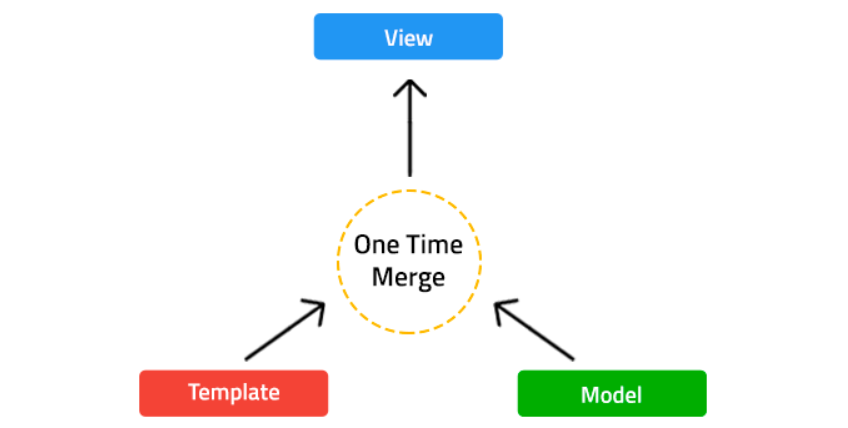
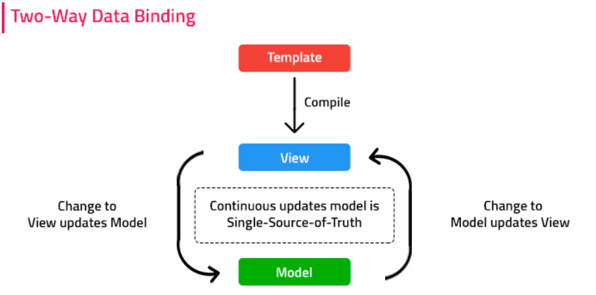
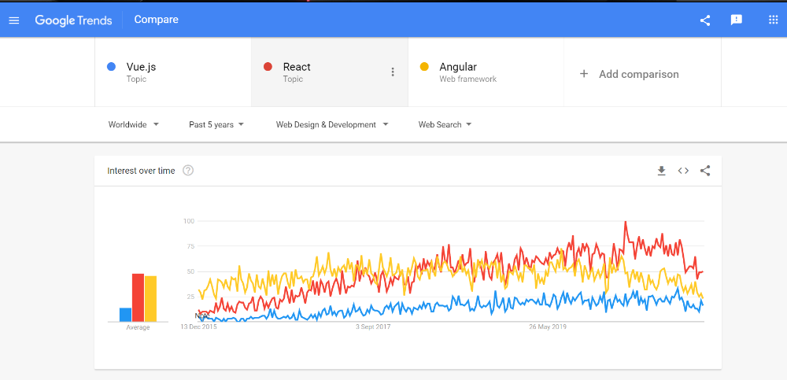
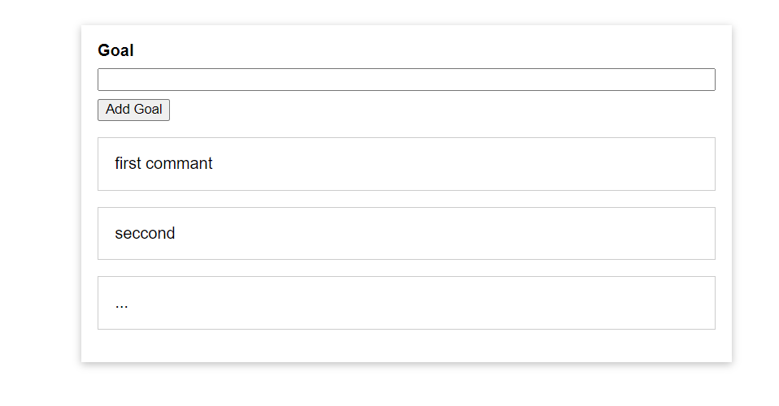
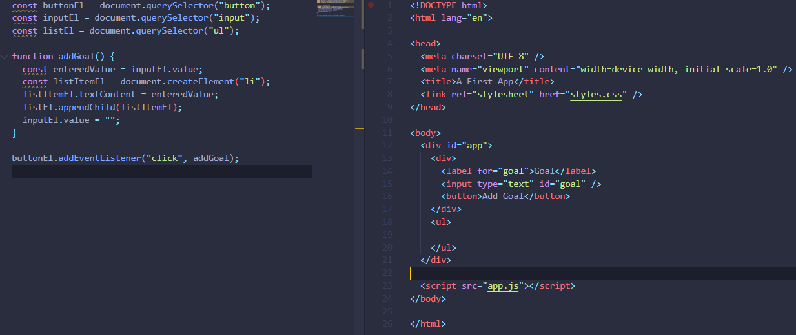
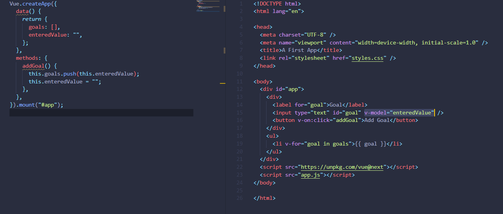

<div dir="rtl">

# Vuejs


## مقدمه
ما تو این آموزش ابتدا سعی کردیم یک دید کلی نسبت به vuejs پیدا کنیم سپس بیشتر عمیق شدیم که با
توجه به سر فصل هر مبحث ، راحت میتونید به اون قسمت دسترسی پیدا کنید و مسلط بشین و اگر نکته
ای جا مونده یا توضیح بخشی کامل یا بد بود خوش حال میشیم کامنت بزارید :)
و همچنین مارو تو تکمیل هرچی بهتر این آموزش یاری کنید یا اگر تجربه جالبی داشتین ذکر کنید.


<br/>
به طور خلاصه React یک کتابخونه javascript برای کد های frontend هست، که هدفش بهبود دادن ساخت user interface هاست و اینکارو با فیچر هایی مثل کامپوننت ها و هوک و ... انجام میده، که کارش اسکیل پذیر کردن  است.
<br/>
<br/>
<br/>

## آشنایی با Vuejs :
جدیدترین فریم‌ورک نسبت به reactjs و angular هست. توی سال 2014 توسط ایوان یو (evan you)،
مهندس سابق گوگل توسعه داده شد. سایت‌های 9gag، گیت‌لب و لاراول از این فریم‌ورک استفاده
میکنند.

<br/>

## تفاوت سه فریم‌ورک محبوب جاوااسکریپت : (React | angular | vue):

( اگه هدفدار اومدی سمت vue و میخوای سری یاد بگیری این بخشارو اسکیپ کن :) )
هرکدام از این فریم‌ورک ها را یک توضیح مختصری میدهیم :


<br/>
فریمورک: یک فریمورک ساختار و فلو را شکل کلی می دهد و ما از جاهای خالی که برایمان در نظر گرفته برای پیاده سازی استفاده می‌کنیم. در اینجا فریمورک است که از کد ما استفاده می‌کند.
<br/>
 فریمورک قوانین و محدودیت های راه را تعیین می کند و لایبراری وسیله است که در مسیر به کمک‌مان می‌آید.
در واقع فریمورک اسکلت را مشخص می کند و با استفاده از لایبراری می توانیم دور این اسکلت را پر کنیم.
<br/>
<br/>
 فریم‌ورک React :
<br/>
React که توسط فیسبوک معرفی شده است یک کتابخانه متن‌باز JavaScript است.
که برای ساخت رابط کاربری‌ تعاملی و stateful و همچنین رابط‌های کاربری قابل استفاده
مجدد معرفی شده است . برای رندر کردن رابط‌های پیچیده با ویژگی‌های زیاد خوب عمل
می‌کند.همچنین با کمک دام مجازی ( virtual DOM ) می‌توان وب اپلیکیشن‌های بسیار


پایدار ساخت.


مزایا : 

فریم‌ورک React از DOM مجازی به توسعه دهندگان React کمک می کند تا
بدون ایجاد تأثیر بر سایر قسمت های رابط کاربری ، به راحتی هرگونه تغییر در برنامه را
انجام دهند. React به کاربران امکان استفاده مجدد از کامپوننت را می دهد. این باعث
می شود توسعه برنامه آسانتر و کارآمدتر شود.React از Redux استفاده می کند ، که
ذخیره سازی و مدیریت استیت‌ها را در برنامه های بزرگ ساده می کند. Unidirectional
data binding کد را پایدار ساخته و توسعه برنامه در آینده پشتیبانی می‌کند زیرا جریان
داده به یک جهت هدایت می شود.



<br/>
فریم‌ورک Angular :
<br/>
Angular یک فریمورک متن‌باز است که توسط گوگل ارائه شده است که دارای معماری
Model-View-Controller (MVC) است و توسعه ، نگهداری و آزمایش را برای توسعه
دهندگان آسانتر می‌کند. برای ساخت برنامه‌های وب پیچیده و تعاملی فوق‌العاده است
،اما برای برنامه‌های تک صفحه‌ای محبوبیت زیادی ندارد .


مزایا : وب اپلیکیشن‌های ساخته شده با Angular ، بدون در نظر گرفتن سیستم عامل ،
در هر محیطی درون مرورگر اجرا می شوند. Two-Way data binding اطمینان حاصل
می‌کند که وقتی داده‌ها در مدل تغییر می‌کنند بلافاصله تغییرات بر روی برنامه اعمال
می‌شود ، و هنگامی که داده ها در نما ( View ) تغییر کند ، مدل نیز به روز می شود.




<br/>
فریم‌ورک Vue :
<br/>
یکی از مهمترین مزایای Vue سایز کم آن است. مستندات با جزئیات زیاد . این کار به توسعه
دهندگان اجازه می‌دهد تا با استفاده از گره مجازی یک قالب با یک فایل HTML، فایل
JavaScript ، و فایل Pure JavaScript بنویسند. معماری MVVM آن ، کار با بلوک های
HTML را بسیار آسان می کند.

## محبوبیت
خوب ، اگر نمودار و آنالیز گوگل را مشاهده کنیم ،می‌بینیم Angular تا سال ۲۰۱۶ بسیار محبوب بود ، اما از سال ۲۰۱۷ به بعد ، جستجوهای برای React و Vue به طور پیوسته در حال رشد هستند.





<br/>
<br/>

## نصب
برای استفاده از فریم‌ورک Vue راه های متفاوتی وجود داره که ما به دو مورد از آن اشاره میکنیم :

1) استفاده از (CDN (Content Delivery Network و اضافه کردن آن به فایل html در انتهای body قبل از اسکریپت های دیگه :


<div dir="ltr">

```
<script src=&quothttps://unpkg.com/vue@next&quot>
```
</div>

<br/>
2) روش دیگه دانلود vue/cli است که با پکیج منیجر های npm و yarn قابل دانلوده (قبلش باید npm یا yarn داشته باشی دوست عزیز ) و یک ui مناسب و یک خط فرمان command line ایجاد میکنه :

<div dir="ltr">

```
yarn global add @vue/cli
# OR
npm install -g @vue/cli
```
</div>
<div dir="rtl">
حال در command line :
<br/>
1) ابتدا Vue Create app را مینویسیم که کلمه app میتواند هرچی باشد و اسم فایلی که به صورت دیفالت به پسوند vue ساخته میشود است .
<br/>
2) حال دو گزینه برایتان میاد که برای استارت کار گزینه دیفالت رو میزنیم .
<br/>
3) حال npm run sreve را میزنی که در localhost:8080 اپ دیفالت vue بالا بیاید اگر مشکلی در
npm run sreve وجود داشت npm install را میزنی که تمامی dependencies های package.json  را دانلود کنه سپس ادامه میدهیم

هوررراااا نصبش تمام شد ایزی :)
</div>
برای استفاده از ui داده شده توسط Vue/cli بعد از Vue Create app با نوشتن vue ui یک ui مناسب خواهیم دید که در نصب پیکج های وابسته و انالیز اپ کمک مان خواهد کرد.


قبل از شروع کردن ما از vscode استفاده کردیم و اینکه از extension vetur برای auto complete و خوشگلی کد ازاین extension بهره بردیمو برای مشاهده بعضی از نکات و درخت مجازی vue , از extension vue.js devtools در مرورگر کروم استفاده کردیم .

بریییم که شروع کنیم ببینیم این Vue Vue که میگن چیه :)


-----------------

## کار با VueJs مرحله به مرحله


<br/>
ما در ادامه از روش اول برای نصب استفاده کردیم حال برای اینکه متوجه بشوید که چه تفاوتی بین استفاده از Vue به جای Vanila javascript ابتدا یک اپ دفترچه هدف هارو (شبیه به to do list ) ایجاد کردیم :



<br/>

حال برای نوشتن این اپ کوچیک با جاوااسکریپت خام کد زیر نوشته شده است:
<br/>



<br/>
حالا میایم این اپ رو با vue مینویسیم :


<br/>
خب ابتدا پکیج سبک Vue رو اون پایین قبل از فایلی که من نوشتم اد میکنیم سپس میام از کدای نوشته شده در vue لذت میبریم اول یک instance یا همون ی نمونه از Vue میگیریم و از اونجایی که ابجکته ی چیزایی توش تعریف شده که باید اونارو با توجه به نیازمند استفاده کنیم حالا این vue میاد key به اسم data تعریف کرده که متغیر هامونو توش نگه میداریم که value ی فانکشن که به صورت بالا با توجه به مثال پیاده سازی کردیمش. ( البته چه...data: function یا ...}()data فرقی نداره ) حالا باید مشخص کنیم این نمونه vue داره به چی اشاره میکنه که با mount در اخر مشخص کردیم . حالا ی key دیگه داره به اسم method که فانکشن هامونو فعلا تو این تعریف کردیم حالا برای اینکه بتونیم با html کار کنه باید ی تغییراتی رو تو html بدیم میام اونجا که هدفمون رو مینویسیم رو با زدن دکمه اضافه کنیم به بقیه هدفامون .
<br/>
این بخش فقط هدف گفتن تفاوت Vue با جاوااسکریپت خام بود اگه جایی رو نفهمیدی بیخیال برو ادامه رو بخون :)
<br/>
از کدهای بالا تقریبا میفهمیم که Vue چه ویژگی هایی به ما میده که به طور کلی میشه گفت میشه 1 ) داخل تگ های html با {{ }} یک متغیر جاوا اسکریپتی بزاریم و ی ویژگی بزرگ دیگه اش اینکه به ما attribute خاصی میده که واقعا کد نویسی فرانتو برامون راحت میکنه واقعا این ویژگی ها بسیار جذاب هستند.
<br/>
حالا بریم ببینیم سنیتکس این فریم‌ورک چیه 
<br/>

<br/>
<br/>


## سینتکس قالب ( Template Syntax)
همانطور گفتیم داشتن دو ویژگی : 1)نوشتن داخل تگ های html و 2) داشتن attribute های خفن تو vue این فریمورک رو قدرتمند تر کرده
<br/>
حالاهمانطور گفتیم میتونیم داخل {{ }} میتونیم با استفاده از key هایی که در data داریم یا حتی با فانکشن های که در متد داریم ( البته این حرکت خوبی نیست که در ادامه توضیح میدم ) اطلاعات بدیم اونجا
<br/>

همانطور که دیدیم در نمونه Vue ما یک فانکشن به اسم data داریم که متغیر هامونو توش نگه میداریم ی key دیگه تو vue داریم به اسم method که توش میایم فانکش هامونو مینویسیم که در ادامه میگه همشون نه :( (??what)) خب فعلا این بخشای Vue کافیه یاد گرفتیم ؛ حالا ببینم این attribute های که vue برامون ساخته چیه ؟ خب (همه attribute های Vue با -v شروع میشه )
<br/>


<div dir="ltr">

```
<span v-once>This will never change: {{ msg }}</span>
```
</div>
<br/>
خب v-once میاد ی بار متغییر msg میگیره دیگه نمیگیره ( این رو گره های داخلی تاثیر میزاره )

<br/>
خب تا حالا شاید براتون این سوال پیش اومده باشه که شاید بیایم کد های جاوااسکریپتی یا tag های html رو داخل {{ }} و احتمالا امنیت برنامه به خطر بیفته و ی injectionیی رخ بده فک کردی Vue فکرشو نکرده

<br/>
https://codepen.io/team/Vue/embed/yLNEJJM

تو کد بالا که اومدیم میبینیم که تو p اول اومده اون تگ هارو نوشته و باهاشون کاری نکرده ولی تو p دوم اومده از attribute به اسم v-html استفاده کرده که برابر فانکش یا متغیری میتوان قرار داد
<br/>
<br/>
حالا با ازمون خطا میتونیم بفهمیم نمیشه {{ }} رو تو attribute ها استفاده ،حال چیکار کنیم اینجاس که اسم v-bind میاد attr که باعث میشه attr های خود تگ های html رو value شون رو تغییر بدیم ی چنتا مثال بزنیم


<div dir="ltr">

```
<div v-bind:id=&quot'list-' + id&quot></div>
<div v-bind:id=&quotdynamicId&quot></div>
<a v-bind:href=&quoturl&quot> ... </a>
```
</div>
<br/>
که به ترتیب list و dynamicId و url میتونن فانکشن یا متغیر باشن حالا v-bind رو میشه خلاصه نوشت میتونین به بخش v-bind shourthand vue مراجعه کنید.

<br/>
پس از گذر از bind میرسیم به خان event ها که معمولی برای button و input ها استفاده میشه مثلا میخوایم که دکمه کلیک شد فانکشنی رخ بده اینکارو با attr به اسم v-on که میشه دقیقتر بنویسیم که چه اتفاقی افتاد مثلا v-on:click یا v-on:mouse فلان بشه و با توجه با اینکه فرض به اینکه با تقریب خوبی جاوااسکریپت مسلط هستید میدونید ی event رو برمیگردونه و بقیه ماجرا ...
<br/>
حالا اینا اگه تو فرم بودن مثل جاوااسکریپت خام ابتدا از درخواستی که فرم میفرسته جلوگیری میکنیم و ادامه میدیم

<br/>
معمولا با http request هامونو تو فریمورک Vue با framework axios انجام میدیم که توضیحاتش تو این مقاله نمیگنجه .

<br/>
حالا بیایم کلاس های متغییری به تگ هامون بدیم ؛ برای این کار ی attr دیگر به اسم :class وجود داره

<br/>

<div dir="ltr">

```
<div :class=&quot{ active: isActive }&quot></div>
```
</div>
<br/>
خب بعضی وقتا میخوایم تگ های html با توجه به یک شرطی واکنشی متفاوت داشته باشن اینجاست که attrبه اسم v-if به میون میاد .

<div dir="ltr">

```
<h1 v-if=&quotawesome&quot>Vue is awesome!</h1>
<h1 v-else>Oh no ?</h1>
```
</div>
<br/>
بعضی وقتا هم میخوای ی لیستی از داده هارو از بک اند بگیریم و تو فرانت نشون بدیم اینجاس که بازم vue به کمکون اومده با attr به اسم v-for میتونی این کارو به راحتی با توجه به مثال بکنیم :

<div dir="ltr">

```
<ul id=&quotarray-with-index&quot>
  <li v-for=&quot(item, index) in items&quot>
    {{ parentMessage }} - {{ index }} - {{ item.message }}
  </li>
</ul>
```
</div>
که میاد از ارایه به اسم itmes که در هر index اون یک ابجکت ذخیره شده را به نمایش میزاره

<br/>
<br/>
خب برگردیم به موضوعی که گفتیم چرا خوب نیست همش متد بنویسیم فک کنید برای دوتا input دوتا فانکشن نوشتین که داخلشون console log ه ی جمله ای میبینی که با انجام یکی دیگه از فانکشنا اون یکی کنسول لاگه هم کار میکنه (اینجا رو سپردم به خودتت ببینم چیکار میکنی ) حالا این هم داخل معماری vue دلیلی داره و برای رفع این مشکل اومده ی key دیگه تو ابجکت Vue تعریف کردن به اسم computed به طور خلاصه دلیل وجود computed این دلیله و اینکه وقتی تو computed فانکشین مینویسیم حتما باید در استفاده پاس با رفرنس باشه و پرانتزاشون بزاریم در صورتی که در متد این موضوع اهمیت نداشت و اسم خاصی نسبت به متیغیر های دیتا داشته باشه چون ابتدا vue میاد متیغیر هارو میگرده اگه نبود میاد computed رو میگرده و ادامه کار ...
<br/>
حالا ی key دیگه به صورت دیفالت تو Vue هست به اسم watch که میایم توش فانکشن هایی مینویسیم که هم اسم یکی از متغیر های data است و با تغییر هر کدوم از متغیر ها این فانکشن ها هم میان کاری رو انجام میدن . چه جالب !!
<br/>


-----
## آشنایی با کامپوننت‌های Vue
<br/>
استفاده از کامپوننت‌ها، یک راه ساده برای ایجاد کد دوباره قابل‌ استفاده برای برنامه‌های Vue.js است. کامپوننت‌ها را میتوان مانند المان‌هایی مانند تگ‌های HTML دید که میتوانند توسط نمونه اصلی Vue یا کامپوننت های دیگر استفاده شود.
<br/>
برای ایجاد یک کامپوننت در Vue، کافی است که رویه component از constructor ر Vue قطعه کدی مانند کد زیر، آن را تعریف کرد:
<br/>

<div dir="ltr">

```
Vue.component('some-component', {
    /* data, methods, etc. go here */
});
```
</div>
<br/>
مرسوم است که در نام‌گذاری کامپوننت، تمام حروف نام، از حروف کوچک انگلیسی باشند و کلمات با خط‌ فاصله از هم جدا شوند.
<br/>
همانطور که میبینید، رویه Vue.component دو ورودی میگیرد. ورودی دوم، object ای است که پیکربندی و تنظیمات آن کامپوننت با آن انجام میشود. تقریبا تمام چیزهایی که میتوانیم به سازنده (constructor) Vue بدهیم. البته دو استثنای el و data وجود دارد.
<br/>
تگ data را نیز ورودی میدهیم ولی متفاوت با شیوه‌ای که به سازنده Vue میدهیم. بجای این که data یک شئ باشد (object)، data ورودی ما به Vue.component باید تابعی باشد که یک شئ برمیگرداند.
<br/>


<div dir="ltr">

```
Vue.component('some-component', {
   data: function() {
        return {
 heading: 'Some Component'
};
  }
});
```
</div>
<br/>
الزام این کار به این است که ما شاید یک کامپوننت را چندین و چند بار در مکان های مختلف استفاده کنیم و احتمالا رفتار مطلوب ما از یک کامپوننت این است که برای خود و مستقلا عمل کند تا این که چند نمونه از یک کامپوننت، منابعی اشتراکی از شئ را استفاده کنند.
<br/>
<br/>

## قالب (Templates)
<br/>
<br/>
چند راه برای مشخص کردن یک قالب برای یک کامپوننت وجود دارد.
<br/>
یک راه این است که محتوای قالب را داخل یک تگ با نام همان کامپوننت قرار دهیم. برای این کار لازم است که خصوصیت inline-template را به آن تگ اضافه کنیم.
<br/>


<div dir="ltr">

``` js
<some-component inline-template>
    <div>
        <h1>{{heading}}</h1>
        <p>This is a component</p>
    </div>
</some-component>
```
</div>

این روش از ارزش پایینی برخوردار است چرا که در اغلب اوقات ما نیاز داریم تا از کامپوننت ها مکررا استفاده کنیم و این بسیار اذیت کننده است که لازم باشد هر دفعه کد قالب را از نو بنویسیم.
<br/>
یک راه دیگر این است که از تگ برای قالب‌مان استفاده کنیم.


<div dir="ltr">

``` js
<some-component inline-template>
    <div>
        <h1>{{heading}}</h1>
        <p>This is a component</p>
    </div>
</some-component>
```
</div>

**فولدر public:**
<br/>
این دایرکتوری حاوی فایل‌های static است. به طور مثال اگر فایل img.png در این دایرکتوری وجود داشته باشد، برای دسترسی به آن در کد، می‌توانید به صورت زیر عمل کنید:


<div dir="ltr">

``` js
import Image from 'next/image'

function Avatar() {
  return <Image src="/img.png"/>
}

export default Avatar
```
</div>

فایل‌های موجود در این دایرکتوری از طریق browser قابل دسترسی هستند. به طور مثال میتوانید از http://localhost:3000/img.png این فایل را مشاهده کنید.
<br/>
<br/>
یک راه این است که محتوای قالب را داخل یک تگ با نام همان کامپوننت قرار دهیم. برای این کار لازم است که خصوصیت inline-template را به آن تگ اضافه کنیم.
<br/>
<div dir="ltr">

``` js
<some-component inline-template>
    <div>
        <h1>{{heading}}</h1>
        <p>This is a component</p>
    </div>
</some-component>
```
</div>


**فولدر styles:**
<br/>
فایل‌های css در این دایرکتوری قرار می‌گیرند. 
<br/>
globals.css بر روی همه‌ی صفحات و اجزاء اعمال می‌شود، این فایل در ```pages/_app.js``` استفاده شده است.
<br/>
سایر فایل‌های css باید به صورت 

<div dir="ltr">

```
[name].module.css
```
</div>

نام‌گذاری شود. (next از [CSS Modules][CSS-Modules] پشتیبانی می‌کند)
<br/>

**فولدر pages:**
<br/>
هر page یک component ری‌اکت است که باید در دایرکتوری pages قرار بگیرد. نام‌گذاری فایل‌ها مهم است زیرا در routing استفاده می‌شود.(این موضوع در بخش routing بیشتر توضیح داده شده است.)
<br/>
به طور مثال اگر فایل pages/about.js را بسازید میتوانید محتوای آن را در /about مشاهده کنید. همچنین فایل index.js به عنوان صفحه نخست وبسایت شما نمایش داده می‌شود.
<br/>
زمانی که از Next.js استفاده می‌کنید، ممکن است بخواهید کامپوننت App را دوباره بنویسید تا مواردی مانند persisting state یا global layouts را اعمال کنید. این کار را می‌توانید در فایل _app.js انجام دهید. 
<br/>
به طور مثال در کد زیر یک Layout دلخواه بر روی همه‌ی صفحات اعمال می‌شود:


<div dir="ltr">

``` 
import Layout from "../components/layouts/"

const MyApp = ({ Component, pageProps, auth }) => {
  return (
    <Layout>
      <Component {...pageProps} />
    </Layout>
  )
}

export default MyApp
```
</div>
<br/>

## Routing
همان‌طور که اشاره شد Next.js سیستم routing بر اساس فایل را پیاده‌سازی کرده است. بدین صورت که با اضافه کردن یک فایل در دایرکتوری pages، به صورت اتوماتیک به عنوان route قابل دسترسی خواهد بود.

### انواع روش‌های routing

1. index routes
 
برای route کردن هر دایرکتوری کافی است از index.js استفاده کنیم.
 
- pages/index.js &#8594; /
- pages/blog/index.js &#8594; /blog

2. nested routes  
 
برای داشتن مسیرهای تودرتو می‌توان با ایجاد دایرکتوری‌های مختلف این کار را انجام داد.
 
- pages/blog/first.js &#8594; /blog/first
- pages/user/login/verify.js &#8594; /user/login/verify

3. dynamic routes  
 
در موارد مختلف نیاز داریم تا یک مسیر پویا داشته باشیم. به طور مثال فرض کنید بخواهیم پست‌های مختلف یک بلاگ را در صفحات مختلف نمایش دهیم. برای این کار می‌توانیم به صورت زیر عمل کنیم:
 
- pages/posts/[id].js &#8594; <span dir="rtl"> با /posts/1 و posts/first و موارد مشابه دیگر تطابق خواهد داشت. </span>

همچنین می‌توان از ... استفاده کرد که تنها ابتدای مسیر را بررسی خواهد کرد. به طور مثال pages/user/[...all].js با تمامی مسیرهایی که با /user/ شروع می‌شوند تطابق خواهد داشت.

**توجه:** موارد گفته شده نسبت به هم اولویت دارند. ترتیب اولویت با مثال:  
- pages/post/create.js &#8594; <span dir="rtl"> فقط با  /post/create تطابق دارد. </span>
- pages/post/[pid].js &#8594; <span dir="rtl"> با /post/1 و /post/abc و موارد مشابه تطابق دارد اما با /post/create تطابق ندارد.</span>
- pages/post/[...slug].js &#8594; <span dir="rtl">با /post/1/2 و /post/a/b/c و موارد مشابه تطابق دارد اما با /post/create و /post/abc تطابق ندارد. </span> 

### وصل کردن صفحات مختلف به یکدیگر
برای این‌کار می‌توان به صورت زیر عمل کرد:

<div dir="ltr">

``` js
import Link from 'next/link'

function Home() {
  return (
    <ul>
      <li>
        <Link href="/">
          <a>Home</a>
        </Link>
      </li>
      <li>
        <Link href="/about">
          <a>About Us</a>
        </Link>
      </li>
      <li>
        <Link href="/blog/hello-world">
          <a>Blog Post</a>
        </Link>
      </li>
    </ul>
  )
}

export default Home
```
</div>

همچنین برای متصل کردن صفحات پویا می‌توان به صورت زیر عمل کرد:

<div dir="ltr">

``` js
import Link from 'next/link'

function Posts({ posts }) {
  return (
    <ul>
      {posts.map((post) => (
        <li key={post.id}>
          <Link
            href={{
              pathname: '/blog/[slug]',
              query: { slug: post.slug },
            }}
          >
            <a>{post.title}</a>
          </Link>
        </li>
      ))}
    </ul>
  )
}

export default Posts
```
</div>

که در اینجا pathname نام صفحه در دایرکتوری pages است و query نیز شامل قسمت‌های پویای لینک می‌باشد.  

سوالی که در اینجا پیش می‌آید این است که چگونه در لینک‌های پویا پارامترها را از لینک بخوانیم. این کار را می‌توان به صورت زیر انجام داد.

<div dir="ltr">

``` js
import { useRouter } from 'next/router'

const Post = () => {
  const router = useRouter()
  const { slug } = router.query

  return <p>Post: {slug}</p>
}

export default Post
```
</div>
در حقیقت userRouter().query شامل همه‌ی پارامترهای موجود در لینک است.

فرض کنید یک فایل به صورت pages/post/[pid].js داریم. در این صورت query مقادیر زیر را خواهد داشت:
- /post/abc &#8594; { "pid": "abc" }
- /post/abc?foo=bar &#8594; { "foo": "bar", "pid": "abc" }
- /post/abc?pid=123 &#8594; { "pid": "abc" }

همان‌طور که مشاهده می‌شود route parameters مقادیر query parameter را بازنویسی می‌کنند و اولویت بیشتری خواهند داشت.

اگر از ... در routing استفاده کرده باشیم، پارامتر مورد نظر به صورت لیست خواهد بود.  
به طور مثال برای فایل pages/post/[...slug].js  
- /post &#8594; { }
- /post/a &#8594; { "slug": ["a"] }
- /post/a/b &#8594; { "slug": ["a", "b"] }

## Pre-rendering
به صورت پیش‌فرض، Next.js هر page موجود در فولدر pages را pre-render می‌کند. در واقع Next.js به ازای هر page فایل HTMLای تولید می‌کند در صورتی که در ری‌اکت تنها یک فایل HTML داشتیم و بااستفاده از javascript در سمت کلاینت صفحات دیگر ساخته می‌شد.
هر HTML ساخته شده دارای کد جاوا اسکریپتی است و هنگامی که آن پیج load شود کد جاوا اسکریپت اجرا شده و باعث می‌شود که آن پیج interactive باشد.
<br/>
از آنجا که به ازای هر page (حتی صفحاتی که به صورت dynamic هستند) یک فایل HTML ساخته می‌شود باعث افزایش سرعت و همچنین SEO  و نتایج بهتر برای crawler ها و search engine ها مانند google و bing می‌شود.
<br/>
Next.js دو روش برای Pre-rendering در اختیار ما قرار می‌دهد که تفاوت آن‌ها در زمان ساخته شدن فایل HTML است. به توضیح کوتاهی در مورد هرکدام می‌پردازیم:

#### روش Static Generation

در این روش فایل HTML تنها یک بار در زمان ساخته شدن(build time) تولید می‌شود و به ازای هر ریکوئست از همان فایل HTML استفاده می‌شود. این روش توسط سازندگان Next.js پیشنهاد می‌شود.

اگر صفحه‌ای که نیاز داریم وابسته به دیتایی نباشد تنها کافی‌است در فولدر pages آن صفحه را ساخته تا در زمان build شدن HTML آن ساخته شود.

اما اگر صفحه ای که نیاز داریم وابسته به داده ای باشد می‌توان با نوشتن توابع  getStaticProps (برای استفاده از داده در محتویات صفحه) و getStaticPaths (برای استفاده از داده جهت تولید کردن dynamic paths) از داده خارجی استفاده کنیم. برای آشنایی با این توابع به قسمت <a href="#fetch">فچ کردن داده‌ها</a> مراجعه شود.

**چه زمانی از این روش استفاده کنیم؟**
برای جواب به این سوال باید بگوییم که بهتر است همیشه از این روش استفاده شود مگر اینکه داده ای که استفاده می‌کنیم به ازای هر ریکوئست متفاوت باشد. به عنوان مثال اگر صفحه‌ای داریم که به ازای هر user تنها کامنت‌هایی که آن شخص گذاشته است نمایش داده می‌شود و داده ها به ازای هر request متفاوت است دیگر این روش کارآمد نیست. در این صورت از روش دوم استفاده می‌کنیم.

#### روش Server-side Rendering

اگر صفحه‌ای که داریم از Server-side Rendering استفاده کند، فایل HTML آن به ازای هر request ساخته می‌شود. برای استفاده از این روش باید تابع getServersideProps پیاده‌سازی شود. این تابع به ازای هر ریکوئست در سمت سرور صدا زده می‌شود و از داده‌ی خروجی آن در page استفاده می‌شود. برای آشنایی بیشتر با این تابع به قسمت <a href="#fetch">فچ کردن داده‌ها</a> مراجعه شود.
## <div id="fetch">فچ کردن داده‌ها</div>
دو روش برای پیش رندر کردن (pre-rendering) در Next داریم و بر اساس هر کدام توابعی برای گرفتن داده ها در اختیار ماست:
 * static generation:<span dir="rtl"> در این روش در هنگام بیلد شدن page ساخته می‌شود.</span>
    * getStaticProps:<span dir="rtl"> هنگامی که محتویات صفحه به داده های خارجی وابسته است.</span>
    * getStaticPaths:<span dir="rtl"> هنگامی که مسیر url  صفحه به داده های خارجی وابسته است.‌<br/>(هنگام استفاده از  dynamic routing) </span>
 * SSR (server side rendering):<span dir="rtl"> در این روش با هر درخواست page ساخته می‌شود. </span>
    * getServerSideProps:<span dir="rtl"> با هر ریکوئست داده ها نیز گرفته می‌شوند. </span>

برای دیدن نحوه عملکرد این توابع ابتدا یک سرور بکند ساده برای گرفتن داده ها می سازیم.
<br/>
برای اینکار از [Flask][flask]
استفاده می کنیم. برای نصب flask و ایجاد venv کافیست دستورات زیر را اجرا کنید:
<div style="direction:ltr">

```
mkdir sandbox
cd sandbox
virtualenv .venv
source .venv/bin/activate
pip install Flask
touch server.py

export FLASK_ENV=development
export FLASK_APP=server.py
```
</div>
سپس کد زیر را در فایل server.py کپی کنید:
<div style="direction:ltr">


``` py
from flask import Flask
app = Flask(__name__)

dummy_users = [
    {"id": 1, "name": "Masih", "age": 20},
    {"id": 2, "name": "Amin", "age": 86},
    {"id": 3, "name": "Ali", "age": 9},
]


@app.route('/')
def index():
    return 'Server Works!'


@app.route('/users')
def get_users():
    return {'result': dummy_users}


@app.route('/users/<int:user_id>')
def get_user(user_id):
    matched = list(filter(lambda user: user["id"] == user_id, dummy_users))
    if len(matched) == 1:
        return {'result': matched.pop()}
    else:
        return {'result': None}
```
</div>
با اجرای دستور زیر سرور بکند شروع به کار می کند:
<div style="direction:ltr">

```
flask run
```
</div>
پس از راه اندازی سرور می توانید در http://localhost:5000/users و http://localhost:5000/users/id به داده های موجود دسترسی داشته باشید.
<br/>

## تابع getStaticProps (Static Generation)
 برای استفاده از تابع مورد نظر یک فولدر با نام users در فولدر pages پروژه نکست ایجاد کنید.
در این فولدر فایل index.jsx بسازید و درون آن قطعه کد زیر را کپی کنید. (با توجه به سیستم روتینگ نکست این کد در ادرس http://localhost:3000/users  رندر خواهد شد)

<div style="direction:ltr">

``` js
function User({ users }) {
  return (
    <ul>
      {users.map(user => (
        <li key={user.id}>{user.name}</li>
      ))}
    </ul>
  );
}

export async function getStaticProps(context) {
  const res = await fetch("http://localhost:5000/users");
  const responseJson = await res.json();

  const users = responseJson.result;

  return {
    props: {
      users,
    },
  };
}

export default User;
```
</div>
این تابع هنگام build شدن پروژه سمت <span style="font-weight: bold">سرور </span>
 کال می شود و می تواند یک آبجکت ورودی داشته باشد و یک آبجکت خروجی دارد.
خروجی props می‌تواند شامل یک آبجکت باشد که به عنوان ورودی کامپوننت این فایل مورد استفاده قرار می گیرد. 
<br/>
در این مرحله از کد build گرفته و سپس آنرا start کنید. مشاهده می کنید که داده های صفحه users شامل ۳ کاربر خواهد بود. حال اگر یک کاربر به این داده ها اضافه کنید (در لیست dummy_users یک دیکشنری مانند کاربران موجود اضافه کنید) و سرور Flask را ری استارت کنید (ctrl+C و ران کردن دوباره) و صفحه را رفرش کنید مشاهده می شود که تغییری در داده ها ایجاد نمی ‌شود و لازم است دوباره سرور نکست build بگیرید و آنرا اجرا کنید تا اسم اضافه شده نمایش داده شود.<br/>
به صورت خلاصه:

<div style="direction:ltr">

```
yarn run build
yarn run start
# or npm instead of yarn
# visit http://localhost:3000/users/
# add {"id": 4, "name": "New", "age": 32} to dummy_users list
# restart Flask: ctrl+C + run flask
# visit Flask server http://localhost:5000/users/ to see New user
# visit Next page http://localhost:3000/users/
# No user named New :)
# stop server and build and start again
yarn run build
yarn run start
# New user appears!
```
</div>
با توجه به نحوه عملکرد این تابع بهتر است زمانی از این تابع استفاده کنیم که داده های مورد استفاده کاربر قبل درخواست او و در زمان بیلد موجود است.
<br/>
همچنین در مواردی که داده برای SEO حائز اهمیت است و یا بهتر است کش شود نیز این روش توصیه می‌شود. این داده ها به صورت عمومی کش می‌شود و بر اساس هر کابر نیست.
<br/>
همچنین توجه داشته باشید که اگر پروژه در حالت developement (yarn run dev)
ران شود. این تابع با هر ریکوئست کال می‌شود و عملکردش با پروداکشن متفاوت است.

## تابع getStaticPaths (Static Generation)

در این قسمت route های پویا مد نظر هستند. به طور مثال وقتی چندین کاربر در یک وبسایت وجود دارد و لازم است که در زمان build  اطلاعات تمام این کاربران رندر شود، در این حالت از تابع getStaticPaths به همراه تابع getStaticProps  در فایل تک کاربر (pages/users/[id].js) استفاده می‌کنیم.
<br/>
برای رندر شدن تک تک کاربران در زمان build همه ی آنها در سمت سرور دریافت شده و برای هر id یک فایل ساخته می‌شود و تا build بعدی همان فایل ها سرو خواهد شد. (در صورت نیاز به آپدیت شدن فایل صفحات از ISR یا Increamental Static generation استفاده می‌شود)
<br/>
از همان فایل server.py استفاده می‌کنیم، این‌بار  تابع get_user نیز علاوه بر get_users  مورد استفاده خواهد بود. <br/>
کنار فایل index.js در فولدر  users که در فولدر pages پروژه نکست ایجاد کردیم. فایل [id].jsx بسازید و درون آن قطعه کد زیر را کپی کنید. (با توجه به سیستم روتینگ نکست این کد در ادرس http://localhost:3000/users/[1,2,3,...] رندر خواهد شد)
<br/>

<div style="direction:ltr">

``` js
function UserDetail({ user }) {
  return (
    <div>
      <h1> {user.name} </h1>
      <h4> Age: {user.age} </h4>
    </div>
  );
}

export async function getStaticPaths() {
  const res = await fetch("http://localhost:5000/users");
  const responseJson = await res.json();

  const users = responseJson.result;
  \\ notice id should be string
  const paths = users.map(user => ({
    params: { id: `${user.id}` },
  }));

  return { paths, fallback: false };
}

export async function getStaticProps({ params }) {
  const res = await fetch(`http://localhost:5000/users/${params.id}`);
  const responseJson = await res.json();

  const user = responseJson.result;

  return {
    props: {
      user,
    },
  };
}

export default UserDetail;
```
</div>
در اینجا با همان عملکرد تابع getStaticProps رو به رو هستیم که برای هر id رخ می دهد. می توانید باز داده ای اضافه کنید و ببینید که بعد از build گرفتن تغییری روی داده های رندر شده ایجاد نمی‌شود و برای اعمال تغییر دوباره باید build گرفته و استارت کنیم. <br/>
در واقع کار اصلی تابع getStaticPaths یافتن id هایی است که باید برای آنها pre-rendering صورت گیرد.<br/>
خروجی تابع getStaticPaths  شامل دو کلید ضروری paths  و fallback  است، paths تعیین می‌کند کدام صفحات باید pre-reder شوند.

<div style="direction:ltr">

``` js
return {
    paths: [{ params: { id: '1' } }, { params: { id: '2' } }],
    fallback: true,
  }
```
</div>
کلید fallback مشخص می کند در صورتی که صفحه خواسته شده موجود نبود چه اتفاقی بیافتد به طور مثال دیدیم که در حالت fallback:false در صورتی که صفحه از زمان build وجود نداشته باشد حاصل ریکوئست 404 خواهد بود. اما اگر fallback:true باشد نکست ابتدا یک پیج خالی pre-render شده بر می‌گرداند که در زمان build ساخته شده، سپس در سمت سرور به صورت ایستا و با استفاده از getStaticProps فایل های مورد نیاز مسیر درخواست شده را می‌سازد. وقتی ساخت فایل ها تمام شد آنها به browser سمت کلاینت فرستاده شده و به صورت اتوماتیک رندر می‌شوند. همزمان این path به لیست صفحات pre-render شده اضافه می شود و در ریکوئست های بعدی با صفحاتی که در زمان build ساخته شدند تفاوتی نخواهد داشت.<br/>
در حالتی که fallback:true است. next تصور می‌کند که صفحه وجود دارد و فقط در زمان بیلد رندر نشده است و اگر صفحه واقعا نا موجود باشد بعد از کال شدن getStaticProps، خروجی 404  خواهد شد.<br/>
حالت دیگر برای fallback حالت fallback:blocking است، این حالت نیز مانند حالت fallback:true عمل می‌کند با این تفاوت که صفحه خالی در لحظه ریکوئست فرستاده نشده و کاربر باید صبر کند تا صفحه خواسته شده در صورت وجود رندر شود. در این حالت یکبار SSR (که در ادامه امده) انجام شده و پس از سرو شدن بار اول دفعات بعدی مانند fallback:true  موجود خواهد بود. 
<br/>
برای بررسی حالت fallback:true از قطعه کد مقابل به جای کد قبلی استفاده کنید:
<div style="direction:ltr">

``` js
import { useRouter } from "next/router";

function UserDetail({ user }) {
  const router = useRouter();

  if (router.isFallback) {
    return <div>Loading...</div>;
  }

  return (
    <div>
      <h1> {user.name} </h1>
      <h4> Age: {user.age} </h4>
    </div>
  );
}

export async function getStaticPaths() {
  return {
    paths: [{ params: { id: "1" } }, { params: { id: "2" } }],
    fallback: true,
  };
}

export async function getStaticProps({ params }) {
  const res = await fetch(`http://localhost:5000/users/${params.id}`);
  const responseJson = await res.json();

  const user = responseJson.result;

  if (!user) {
    return {
      notFound: true,
    }
  }

  return {
    props: {
      user,
    },
  };
}

export default UserDetail;
```
</div>
در اینجا از هوک useRouter استفاده می‌کنیم تا وقتی پیج در حال ساخته شدن است صفحه لودینگ به کاربر نشان دهیم.<br/>
همچنین لازم است که در تابع getStaticProps در صورت ناموجود بودن کاربر خروجی notFound:true برگردانیم تا صفحه 404 نمایش داده شود.
<br/>
در اینجا دو کاربر با id های 1,2 در زمان build ساخته می‌شوند و کاربر های دیگر در صورت وجود در حالتی که درخواست شوند ساخته خواهند شد.<br/>
برای اینکه مدت طول کشیدن ساخته شدن صفحات را شبیه سازی کنیم کد server.py را بصورت مقابل تغییر دهید:

<div style="direction:ltr">

``` py
import time
# ... 
# rest unchanged but better add more users to test their pages :)
# ...
@app.route('/users/<int:user_id>')
def get_user(user_id):
    time.sleep(1)
    matched = list(filter(lambda user: user["id"] == user_id, dummy_users))
    if len(matched) == 1:
        return {'result': matched.pop()}
    else:
        return {'result': None}
```
</div>
مشاهده می‌شود که صفحات بعد از مدتی loading... دیده شده و از آن به بعد مثل صفحات زمان build سریع اند.


## تابع getServerSideProps (Server-side Rendering)
این تابع مشابه getStaticProps است با این تفاوت که رندر با هر ریکوئست انجام می شود.
<br/>
برای دیدن عملکرد این تابع از server.py و همان فایل index در فولدر pages/users استفاده می کنیم.
<br/>
قطعه کد مقابل را در فایل index.jsx کپی کنید:
 
<div style="direction:ltr">

``` js
function User({ users }) {
  return (
    <ul>
      {users.map(user => (
        <li key={user.id}>{user.name}</li>
      ))}
    </ul>
  );
}

export async function getServerSideProps(context) {
  const res = await fetch("http://localhost:5000/users");
  const responseJson = await res.json();

  const users = responseJson.result;

  return {
    props: {
      users,
    },
  };
}

export default User;
```
</div>
حال اگر مثل کاری که با تابع getStaticProps کردیم در اینجا نیز به dummy_users عضو جدید اضافه کنیم. بر خلاف آنجا با هر رفرش کردن عضو های جدید دیده می‌شوند.
<br/>
بر اساس شرایط و کاربرد های مختلف هر کدام از روش های مطرح شده می ‌تواند سودمند باشد و کارایی و SEO را  بهبود بخشد.

### استفاده از revalidate  در getStaticProps
در این بخش به ISR یا Increamental Static Regeneration می پردازیم، وقتی می‌خوام صفحه ساخته شده در زمان بیلد آپدیت شود از revalidate  در خروجی تابع getStaticProps استفاده می‌کنیم.
<br/>
برای دیدن نحوه عملکرد این تابع باز هم از server.py و فایل pages/users/index.js استفاده خواهیم کرد. قطعه کد مقابل را در فایل index.js کپی کنید:

<div style="direction:ltr">

``` js
function User({ users }) {
  return (
    <ul>
      {users.map(user => (
        <li key={user.id}>{user.name}</li>
      ))}
    </ul>
  );
}

export async function getStaticProps(context) {
  const res = await fetch("http://localhost:5000/users");
  const responseJson = await res.json();

  console.log(`at getStaticProps time: ${new Date()}`);
  const users = responseJson.result;

  return {
    props: {
      users,
    },
    revalidate: 10,
  };
}

export default User;
```
</div>
در این حالت در هنگام build صفحه users با داده های اولیه ساخته می شود سپس اگر تغییری در dummy_users ایجاد کنید و server.py را ریستارت کنید، پس از مدتی اسامی جدید نیز قابل مشاهده خواهند بود.
<br/>
کلید revalidate باعث می‌شود با هر درخواست تابع getStaticProps تریگر شده و صفحه را از نو بسازد چون هزینه این عملیات بالاست عدد مقابل revalidate نشان می‌دهد پس از هر درخواست که getStaticProps را تریگر می‌کند چقدر صبر کنیم تا دوباره این تابع تریگر شود.
<br/>
به طور مثال اگر در t=0s یک درخواست به سرور بیاید صفحه شروع به ساخته شدن می‌کند پس از ساخته شدن به جای صفحه فعلی نمایش داده خواهد شد مثلا در t=5s صفحه آپدیت شده قابل دیدن خواهد بود حال اگر  تا t=10s هزار درخواست دیگر نیز بیاید پیج دوباره رندر نخواهد شد. و پس از t=10s مثلا در t=11s با درخواست بعدی دوباره باعث ساخت صفحه می‌شود.<br/>
برای مشاهده این قضیه می  توانید صفحه users را پشت هم به مدت 40-50 ثانیه رفرش کنید سپس اگر لاگ Flask را (همان جایی که flask run زدید) مشاهده کنید رکوئست های 
به سرور ۱۰ ثانیه یا بیشتر تفاوت دارند  
.
همچنین لاگ خود next  نیز بیانگر همین موضوع است.
</div>


[React-research]: https://github.com/mostafaghadimi/web_workshop/tree/master/React
[node.js]: https://nodejs.org
[CSS-Modules]: https://github.com/css-modules/css-modules
[flask]: https://flask.palletsprojects.com/en/2.0.x/
[flask-doc]: https://medium.com/@onejohi/building-a-simple-rest-api-with-python-and-flask-b404371dc699
