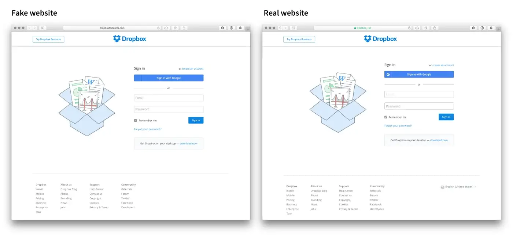
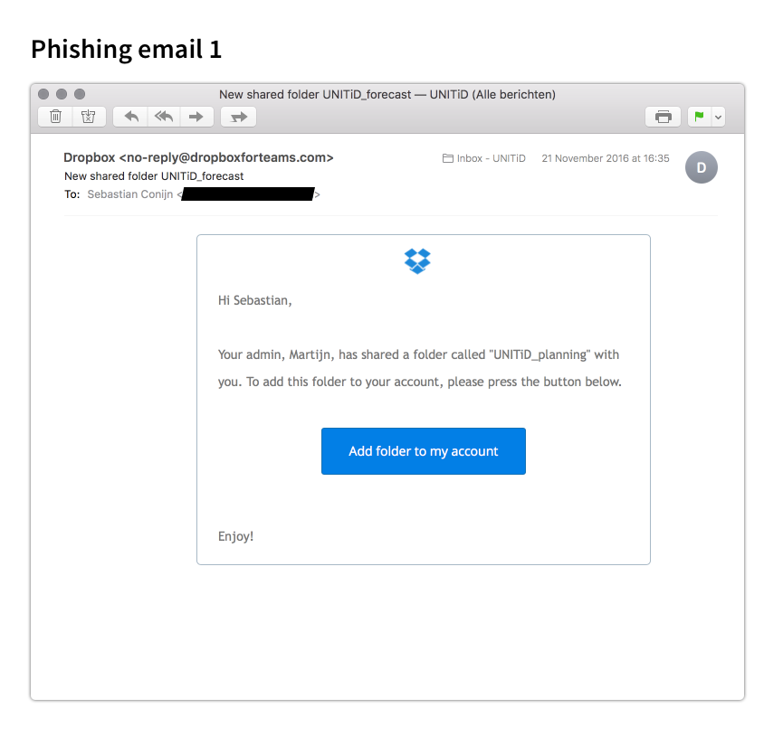

# دو روش از روش‌های وب هکینگ: Phishing و Cookie Theft

## نویسندگان

- آنیتا علیخانی
- علیرضا رحمانی
- علی اسلامی نژاد

# مقدمه

 

### هکینگ چیست؟
هک شدن به این معنی است که شخصی (یا چیزی) بدون اجازه شما به فایل های وب سایت شما دسترسی پیدا کرده است.
وب هکینگ به بهره برداری از برنامه ها از طریق HTTP اشاره دارد که می تواند با دستکاری برنامه از طریق رابط گرافیکی آن، دستکاری شناسه منبع یکسان (URI) یا دستکاری عناصر HTTP موجود در URI انجام شود.

### هکرها با وب سایت ها چه می کنند؟
یک هکر می تواند طیف گسترده ای از اطلاعات را از بازدیدکنندگان و پایگاه داده ی وب سایت هک شده به دست آورد.  
معمولا داده های حساس زیادی در وب سایت های آسیب پذیر وجود دارد، از کارت های اعتباری گرفته تا رمزهای عبور. هکرها می توانند از این اطلاعات برای کلاهبرداری یا فروش آن در بازار سیاه سوء استفاده کنند. سرقت هویت در دنیای امروز امر مهمی است و می تواند پیامدهای بزرگی برای صاحب وب سایت و کاربران داشته باشد.

### هدف و انگیزه ی هکر ها چیست؟
- پول
- سواستفاده از داده ها
- فروش داده ها
- اخاذی از کاربران
-  گول زدن افراد
- کنترل سایر دستگاه ها
- به چالش کشیدن مهارت های خود
- انتقال پیام به مردم یا دولت
- کشف نقاط ضعف وب سایت(هکر های کلاه سفید)

### یک نمونه از بزرگترین هک های تاریخ:
هک شدن داده ها هر روزه اتفاق می افتد. در واقع، این هک شدن ها در حال حاضر به قدری متداول هستند که فقط هک های خیلی بزرگ تیتر اخبار میشوند.منظور از هک های خیلی بزرگ , زمانی است که میلیون ها اکانت یکجا هک شوند.

در اینجا یک نمونه از بزرگترین هک های تمام دوران آورده شده است:

#### یاهو!
 
کل اکانت های هک شده: 3 میلیارد

زمان: 2013

احتمالاً بزرگترین هک تاریخ،لو رفتن اطلاعات یاهو در سال 2013 باشد، اگرچه یاهو تا سال 2016 میزان خسارات را تایید نکرد. در این اتفاق، نام، تاریخ تولد، رمز عبور، آدرس ایمیل، و سؤالات و پاسخ های امنیتی تمام 3 میلیارد کاربر در معرض خطر قرار گرفتند. که شامل کاربران Tumblr و Flickr نیز می‌شود

### انواع حملات وب هکینگ:

- Phishing
- UI Redress
- Cookie Theft
- Denial of Service (DoS\DDoS)
- DNS
- spoofing
- DNS spoofing
- Keylogger injection

در این نوشته به دو روش از روش‌های متداول وب هکینگ می پردازیم:
  

# فیشینگ
فیشینگ یک حمله امنیتی مهندسی اجتماعی است که تلاش می‌کند تا اهداف را فریب دهد تا اطلاعات حساس و با ارزش را افشا کنند. افراد سودجو با اطلاعات ورود کاربران، اطلاعات مالی (مانند کارت‌های اعتباری یا حساب‌های بانکی)، داده‌های شرکت و هر چیزی که به طور بالقوه می‌تواند ارزشمند باشد را هدف قرار می‌دهند.

به عبارتی، اصطلاح حمله فیشینگ اغلب به یک حمله گسترده با هدف تعداد زیادی از کاربران اشاره دارد. این را می توان به عنوان یک رویکرد "کمیت بر کیفیت" در نظر گرفت، که به حداقل آمادگی توسط مهاجم نیاز دارد، با این انتظار که حداقل تعداد کمی از اهداف قربانی آن شوند.
حملات فیشینگ معمولاً کاربر را با پیامی درگیر می‌کند که هدف آن درخواست پاسخی خاص از طریق یک احساس یا تمایل است، مانند مثال‌های زیر:

    - یک سفر رایگان برنده شوید. (طمع)
    - سفارش شما تایید شده است و در حال پیگیری است. (گیجی)
    - اطلاعاتتان را برای جلوگیری از حذف حساب کاربریتان تایید کنید. (نگرانی و فوریت)

## انواع حملات فیشینگ

### Email Phishing
این رایج‌ترین نوع فیشینگ است. فرد مهاجم یک ایمیل را به قصد به دست آوردن اطلاعات برای چندین گیرنده می فرستد که ممکن است از آن‌ها خواسته شود اطلاعات شخصی را به روز کنند، جزئیات حساب را تأیید کنند یا رمز عبور را تغییر دهند. 
### Spear Phishing
هنگامی که یک حمله فیشینگ برای هدف قرار دادن یک سازمان یا فرد خاص سفارشی می شود، به آن (Spear phishing) به معنای نیزه می گویند. این حملات شامل اطلاعات اضافی جمع‌آوری‌شده قبل از حمله می‌شود و عناصر دیگری مانند لوگوی شرکت، آدرس ایمیل و وب‌سایت شرکت یا سایر مشاغلی که شرکت با آنها کار می‌کند و گاهی اوقات جزئیات حرفه‌ای یا شخصی یک هدف را در بر می‌گیرد تا به معتبرترین شکل به نظر برسد. این تلاش اضافی توسط فرد مهاجم شانس فریب دادن افراد را بیشتر می کند.
### Clone Phishing
در این حمله، یک کپی (یا «کلون») از یک پیام قانونی که قبلاً فرد قربانی دریافت کرده است، فرستاده می‌شود، اما با تغییرات خاصی که مهاجم در تلاش برای به دام انداختن هدف (مانند لینک‌ها و پیوست‌های مخرب) ایجاد کرده است. از آنجا که این حمله بر اساس یک پیام مشروع و دیده شده قبلی است، می تواند در فریب دادن یک هدف موثر باشد.
### Whaling
این حمله به عنوان گونه‌ای از Spear Phishing مدیران ارشد  سازمان را هدف قرار می‌دهد. حملات  Whailing معمولاً مسئولیت‌های خاص این نقش‌های اجرایی را در نظر می‌گیرند و از پیام‌های متمرکز برای فریب قربانی استفاده می‌کنند. به عنوان مثال هدف قرار دادن افراد مالی که گمان کنند مدیر عامل از آن ها درخواست انتقال پول کرده است. هنگامی که یک حمله Whailing با موفقیت هدف را فریب می دهد، سود بادآورده مهاجم می تواند قابل توجه باشد (به عنوان مثال اعتبارنامه های سطح بالا برای حساب های شرکت، اسرار شرکت و غیره).

## تکنیک‌های حملات فیشینگ
 

### لینک های مخرب
یکی از متداول‌ترین تکنیک‌هایی که مهاجمان استفاده می کنند آن است که لینکی مخرب مشابه یک لینک معتبر می سازند با این هدف که امکان تشخیص تفاوت از طرف فرد گیرنده بسیار کم باشد و شانس کلیک بر روی آن افزایش یابد. به عنوان مثال می توان به جای لینک shaparak.ir، با shaqarak.com مواجه شویم.
 
 

### جعل وبسایت
لینک ها تنها موردی نیستند که مهاجمان می توانند جعل کنند. با استفاده از مواردی مانند فلش یا جاوا اسکریپت، وب‌سایت‌ها می‌توانند جعل یا جعل شوند تا به‌گونه‌ای به نظر برسند که سایت معتبر و قانونی هستند و به مهاجمان اجازه می‌دهد تا نحوه نمایش URL به کاربر مورد نظر را کنترل کنند. این بدان معنی است که سایت می تواند URL قانونی را نشان دهد حتی اگر کاربر واقعاً از وب سایت مخرب بازدید کند. Cross-Site Scripting (XSS) این حمله را یک قدم جلوتر می برد: حملات XSS از آسیب پذیری های خود وب سایت قانونی سوء استفاده می کنند، که به مهاجم اجازه می دهد وب سایت واقعی را ارائه دهد (نمایش URL قانونی، گواهی های امنیتی قانونی و غیره) و سپس بی سر و صدا اطلاعاتی را که کاربر ارائه می‌دهد را سرقت کند.
 
 

### تغییر مسیرهای مخفیانه و مخرب
تغییر مسیر(redirect) راهی است که مهاجمان می توانند مرورگر کاربر را مجبور به تعامل با یک وب سایت غیرمنتظره کنند. تغییر مسیرهای مخرب معمولاً شامل یک وب‌سایت می‌شود که عمداً توسط کاربر مورد هدف بازدید می‌شود، اما سپس به اجبار همه بازدیدکنندگان را به وب‌سایت ناخواسته و تحت کنترل مهاجم هدایت می‌کند. یک مهاجم می تواند این کار را با به خطر انداختن یک وب سایت با کد تغییر مسیر خود یا با کشف یک اشکال موجود در وب سایت مورد نظر انجام دهد که به عنوان مثال امکان تغییر مسیر اجباری از طریق URL های خاص ساخته شده را فراهم می کند.

## نمونه‌ای از حمله فیشینگ با استفاده از ایمیل
هکر یک صفحه ورود به سیستم موجود را از یک سرویس آنلاین مانند Dropbox، Gmail یا بانک شما کپی می کند. این وب سایت جعلی حاوی کدی است که تمام داده های شخصی را که ارسال می کنید مستقیماً به هکر ارسال می کند. برای اینکه شما را به این وب سایت جعلی برسانند، هکرها یک ایمیل قانع کننده برای شما ارسال می کنند. در این ایمیل از شما خواسته می شود که به حساب بانکی خود وارد شوید زیرا "بانک" تراکنش غیرمجاز را کشف کرده است.

نمونه‌ای از این روند:

مرحله اول: راه‌اندازی دامنه 
دامنه‌ای مانند "dropboxforteams.com" خریداری می‌شود که با پرداختن مبلغ کمی گواهی نیز می‌توان برای آن گرفت تا قفل سبز در نوار آدرس دامنه نشان داده شود و به جای http در کنار آدرس https قرار گیرد.

مرحله دوم: ساخت وب‌سایت جعلی 
به دو روش می‌توان این صفحه لاگین را آماده کرد. روش اول این است که صفحه را از ابتدا مانند صفحه اصلی با استفاده از ابزار مناسب ساخت. روش دوم نیز دانلود این صفحه از وبسایت اصلی است که بعد از آن باید بر روی دامنه‌مان قرار بدهیم.

مرحله سوم: نوشتن یک script برای گرفتن اطلاعات 
وب سایت جعلی اکنون صفحه ورود به سیستم Dropbox را نشان می دهد، اما کاری انجام نمی دهد. با کمک گوگل و کدی که نوشته می‌شود ایمیلی حاوی اطلاعات وارد شده در سایت ارسال می‌شود. پس از آن، کاربر را که از وب سایت جعلی بازدید کرده است، به سایت Dropbox واقعی می فرستد. 

مرحله چهارم: ارسال ایمیل 
وب‌سایت اکنون آماده است. با استفاده از قالب ایمیل مشابه Dropbox ایمیل ها  ارسال می‌شوند. باید به چند نکته توجه شود. برای جلوگیری از رفتن داخل اسپم ایمیل باید به تعداد محدودی کاربر ارسال شود. همچنین برای جلوگیری از بلاک شدن توسط گوگل از استفاده کلمه Dropbox در متن ایمیل باید خودداری شود.

## چگونه از حملات فیشینگ جلوگیری کنیم؟
- تعداد دفعاتی که روی دکمه ها و یا پیوندها در ایمیل ها کلیک می کنید به حداقل برسانید. مستقیماً در مرورگر خود به وب سایت بروید.
- از Password Manager استفاده کنید. اگر هکرها یکی از رمزهای عبور شما را دریافت کنند، نمی توانند در جای دیگری از آن استفاده کنند.
- فقط به نماد قفل سبز در نوار آدرس خود تکیه نکنید. تنها چیزی که به شما می گوید این است که یک کانال خصوصی است. در مورد اینکه با چه کسی صحبت می کنید  چیزی نمی گوید.
- احراز هویت 2FA (two factor authentication) را فعال کنید. تلاش شما برای ورود به سیستم را با یک پیام متنی یا به روشی دیگر تأیید می کند.
- اگر افزونه مرورگر مدیریت رمز عبور شما اطلاعات ورود شما را به طور خودکار نشان نمی دهد، بیشتر مراقب باشید!

# سرقت کوکی‌ها
برای توضیح دقیق روش ابتدا می‌گوییم که کوکی‌ها دقیقا چه هستند
کوکی‌ها فناوری‌ هستند که به وب‌سایت‌ها اجازه می‌دهند هنگام وبگردی شما را شناسایی کنند. آنها در درجه اول برای وب سایت هایی با کاربران بازگشتی مفید هستند.

به عنوان مثال، اگر تا به حال از یک وب سایت خبری بازدید کرده اید که موقعیت مکانی شما را ذخیره می‌کند، اخبار مربوط به محل زندگی شما را ارائه می دهد.
در واقع کوکی‌ها فایل‌های متنی کوچک شامل شناسه‌های منحصربه‌فرد هستند که به وب‌سایت‌ها اجازه می‌دهند شما را به خاطر بسپارند.

دزدی کوکی زمانی اتفاق می‌افتد که شخص ثالث داده‌های رمزگذاری نشده را کپی می‌کند و از آن برای جعل هویت کاربر واقعی استفاده می‌کند. دزدی کوکی اغلب زمانی اتفاق می افتد که کاربر از طریق شبکه Wi-Fi محافظت نشده یا عمومی به سایت های قابل اعتماد دسترسی پیدا کند. اگرچه نام کاربری و رمز عبور برای یک سایت معین رمزگذاری می شود، داده های کوکی ها رمزگذاری نمی شوند.

## سرقت کوکی‌ها چیست؟
هنگامی که شما در یک سایت لاگین می‌کنید سرور یک session cookie برای شما تنظیم می‌کند که بتوان در صفحات مختلف همان سایت بدون نیاز به لاگین دوباره به وبگردی ادامه داد.

زمانی که یک هکر بتواند شناسه منحصر به فرد session cookie شما را بدست آورد می‌تواند با هویت شما در آن وب سایت وارد شود.

راه های مختلفی برای دزدی شناسه کوکی وجود دارد از قبیل
- اولین مورد فریب دادن کاربر برای کلیک کردن روی پیوند مخرب با session cookie از پیش تعیین شده است.
- مورد دوم با سرقت session cookie فعلی است.
- رایج ترین راه سرقت شناسه هنگام اتصال به یک شبکه wifi ناامن اتفاق می‌افتد. به این صورت که حتی اگر سایت از رمزگذاری استفاده کرده باشد هنگام عبور اطلاعات از یک شبکه ناامن هکر می‌تواند اطلاعات کوکی را دزدیده و از آن استقاده کند.

اگرچه هکرها رمز عبور حساب بانکی یا سایر حساب‌های شما را نمی‌دانند، اما می‌توانند وارد session فعال شما شوند.

به همین دلیل است که بسیاری از وب‌سایت‌ها مانند بانک‌ها دارای وقفه‌هایی هستند که از شما می‌خواهند پس از چند دقیقه زمان دوباره وارد سیستم شوید.

اگر یک هکر session شما را در زمانی که شما وارد یک بانک شده اید ربوده باشد، می تواند هر اقدامی را که شما می توانید در حین ورود به سیستم انجام دهید نیز انجام دهد.

## چگونه از سرقت کوکی‌ها جلوگیری کنیم؟

- یکی از اساسی‌ترین راه‌هایی که می‌توانید از سرقت کوکی‌ها و هک کردن session جلوگیری کنید، بررسی URL‌ها است. مطمئن‌تر وب‌سایت‌ها از HTTPS استفاده می‌کنند تا اطمینان حاصل کنند که تمام ترافیک جلسه شما با SSL/TLS رمزگذاری شده است. این روزها اکثر وب سایت ها از رمزگذاری HTTPS استفاده می کنند، اما بهتر است همیشه آن را بررسی کنید. این امر به ویژه هنگام وارد کردن اطلاعات شخصی لازم است.
- یکی دیگر از این اقدامات عدم اتصال به شبکه های عمومی یا حداقل هنگام اتصال به شبکه های عمومی خودداری از ورود اطلاعات شخصی است
- راه سوم خروج خودکار مرورگر از حساب ها است به این صورت که هنگام بستن مرورگر، مرورگر به صورت خودکار از تمامی حساب ها خارج می‌شود. ممکن است این کار کمی آزار دهنده باشد چون هرسری نیاز به ورود مجدد به سایت های مختلف است ولی برای جلوگیری از به سرقت رفتن کوکی هایتان کاملا موثر است.
- متأسفانه، بیشتر اقدامات امنیتی برای جلوگیری از سرقت کوکی ها باید  سمت سرور پیاده سازی شود.

# منابع
>https://cybernews.com/security/brief-history-of-cybersecurity-and-hacking/

>https://blog.sucuri.net/2022/02/what-do-hackers-get-by-hacking-a-website.html/

>https://compuvision.biz/connections/why-do-hackers-hack/

>https://www.rapid7.com/fundamentals/phishing-attacks/

>https://medium.com/hike-one-digital-product-design/how-i-used-phishing-to-get-my-colleagues-passwords-this-is-how-i-did-it-73b9215689f1

>https://privacybee.com/blog/what-is-cookie-theft-and-session-hijacking/

