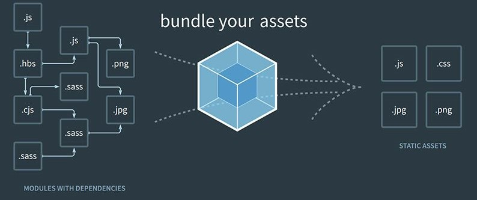

# webpack

## فهرست مطالب
- [مقدمه](#مقدمه)

## نویسندگان
- [نازنین آذریان](https://github.com/Nazhixx)
- [فاطمه عسگری](https://github.com/fatemeh-asgari)
- [پویا اسمعیلی](https://github.com/PouyaEsmaili)

 

## مقدمه 
هنگام برنامه نویسی وب که میخواهیم کد های ما در 
browser 
به کاربر نمایش داده شود با محدودیت هایی روبرو هستیم:

1- ما در کد های خود از import استفاده میکنیم که توسط browser قابل فهم نیست.

2- درون کد ما یک گراف وابستگی به وجود میاید به این شکل که هر 
library که به آن وابستگی داریم میتواند به library های دیگری وابستگی داشته باشد. برای مدیریت این وابستگی های تو در تو به این صورت که مثلا چند بار کد های یکسانی را load نکنیم نیاز به ابزار داریم.

3- کد های تو در توی جاوااسکریپت ما عمدتا فایل های حجیمی میسازند که اگر بتوانیم آنها را بهینه کنیم load کردن آن برای کاربر آسان تر خواهد بود.

برای رفع این مشکلات bundler ها توسعه داده شده اند که وظیفه دارند از فایل های جاوا اسکریپت پروژه ما bundle file ایجاد کنند و در کنار آن گراف وابستگی ها را نیز مدیریت کنند تا خروجی بهسنه و قابل فهم برای browser در اختیار کاربر قرار دهیم و درگیر پیچیدگی های این چنینی که مدیریت آنها سخت است نشویم.

یکی از محبوب ترین bundler ها webpack است که یک ابزار open source   و رایگان است و قابلیت مدیریت جاوا اسکریپت،CSS ، HTML و تصاویر را دارد.

 

