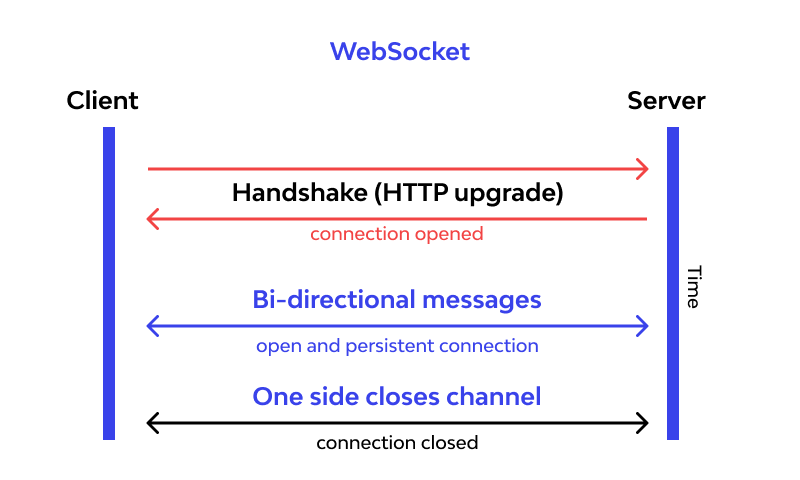
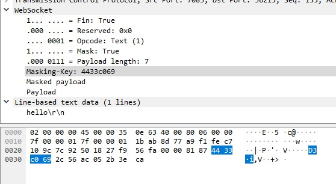
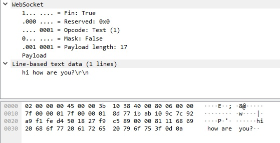
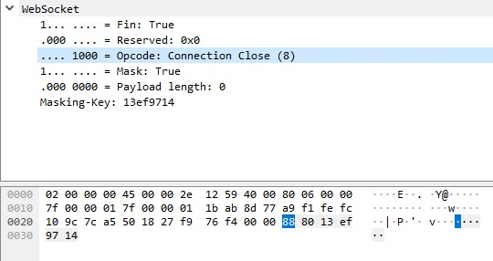
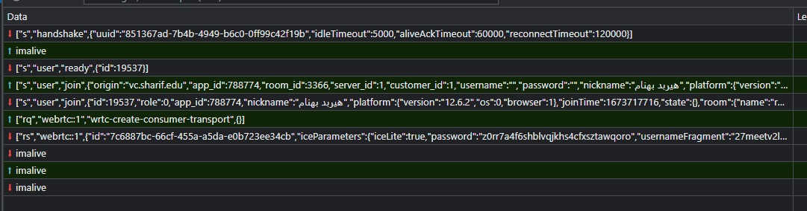
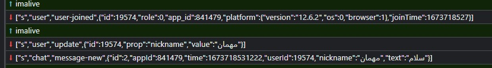
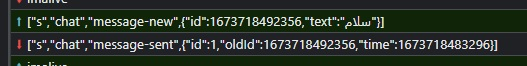

# وب‌سوکت‌ها

## مقدمه

در این مقاله قرار است با پروتکل
websocket
آشنا شویم.
در ابتدا یک معرفی کلی از این پروتکل ارائه می‌دهیم و به مقایسه آن با برخی پروتکل‌های دیگر می‌پردازیم.
در ادامه به طور جزئی‌تر پیاده سازی و پکت‌های این پروتکل را بررسی می‌کنیم.
در انتها به بررسی چند مثال جدی و کاربردی خواهیم پرداخت.

## معرفی

وبسوکت یک پروتکل ارتباطی دو طرفه برای ارتباط کلاینت و سرور است. برخلاف Http، در این پروتکل ارتباط کلاینت و سرور همواره باز است و امکان ارسال/دریافت داده وجود دارد تا جایی که یکی از دو طرف آن‌ را ببند. Websocket برای آغاز ارتباط از یک ریکوئست Http استفاده می‌کند و پس از آن ارتباط دوطرفه ساخته می‌شود. جزئیات این موضوع را در ادامه بررسی خواهیم کرد. تصویر زیر یک شمای ساده از این پروتکل ارائه می‌دهد.

<div align="center">
    
</div>

### چرا websocket

عمده کاربرد این پروتکل در سه دسته زیر است:

* برنامه‌های Realtime: زمانی که لازم است به صورت پیوسته و لحظه‌ای داده‌ها از سرور به سمت کلاینت ارسال شوند و نمایش داده شوند، websocket بهترین انتخاب است. یک مثال از این کاربرد می‌تواند سایت‌های معامله ارز دیجیتال باشد که باید در لحظه آپدیت باشند.
* بازی‌ها: در بازی‌ها اطلاعات بسیار زیادی در لحظه به سمت سرور ارسال می‌شود و همچنین تغییراتی باید با توجه به اطلاعات در بازی برای کاربر ایجاد شود که استفاده از ارتباط دوطرفه websocket می‌تواند کارساز باشد.
* برنامه‌های چت: برنامه‌های چت برای ارسال و دریافت پیام از websocket استفاده می‌کنند. نشان دادن نوتیفیکیشن‌های دریافت پیام یک مثال از آن است.

### روش‌های پیشین به‌جای websocket

پیش از معرفی websocket در سال 2009، روش‌های دیگری برای اهداف مشابه (به طور خاص ارتباط realtime) استفاده می‌شد که در ادامه به بررسی آنها و مقایسه آنها می‌پردازیم:

#### Long polling

ابتدا لازم است بدانیم polling چیست. در polling کلاینت به صورت مداوم به سرور درخواست می‌فرستد، اگر داده مورد نظر وجود داشته باشد آن را از سرور دریافت می‌کند و در غیر این صورت response خالی برمی‌گردد. حال منظور از Long polling آن است که کلاینت درخواست را به سرور ارسال می‌کند، اگر پاسخ حاضر باشد ارسال می‌شود. اگر در لحظه داده و response حاضر نباشد سرور درخواست را برای مدت کوتاهی باز نگه می‌دارد که اگر داده پاسخ حاضر شد آن را ارسال کند.  اگر در آن مدت جوابی حاضر نشود، درخواست بسته می‌شود. کلاینت بعد از دریافت response دوباره درخواست جدید ارسال می‌کند. و با این روند دریافت realtime داده‌ها تا حدودی انجام می‌گیرد. مشکل این روش overhead بالایی است که دارد.

#### Server-sent events

تحت این روش، یک ارتباط بین سرور و کلاینت ساخته می‌شود که سرور هرگاه اطلاعاتی که خواست را به سمت کلاینت ارسال کند. در این روش درخواست‌های کلاینت باید جداگانه ارسال شود و کلاینت نمی‌تواند از همین کانال برای ارسال درخواست و داده استفاده کند.

وبسوکت جایگزین هر دو روش فوق است که امکان ارتباط دو طرفه با پرفورمنس بهتر را تامین می‌کند.

## پروتکل ارتباطی

می‌خواهیم درباره‌ی نحوه‌ی ارتباط برقرار کردن و پیام‌های رد بدل شده در این پروتکل وبساکت حرف بزنیم.
این اطلاعات با استفاده از برنامه‌ی
[wireshark](https://www.wireshark.org/)
برای
capture
کردن پکت‌های وبساکت و برنامه‌ی
[websocat](https://github.com/vi/websocat)
برای ایجاد کلاینت و سرور بدست آورده شده‌اند.

در اولین پکت کلاینت به سرور صرفا از پروتکل
HTTP
استفاده می‌کنیم. به کمک این موضوع می‌توانیم کوکی یا هدر‌های خود را در کلاینت در اولین پیام
handshake
قرار دهیم و صرفا حتی قبل از اولین پیام ما، سرور بتواند این هدر‌ها را بخواند و مثلا به کمک آن‌ها کسی را
authorize
کند یا یوزر آیدی کسی را پیدا کند.
همچنین می‌توان به کمک
headerها
دیتاهای دیگر نظیر تنظیمات داده‌هایی که قرار است در وبساکت فرستاده شود یا دریافت شود را قبل از اولین داده سمت سرور فرستاد. یک نمونه از اولین پکت
websocket hello
را می‌توانید در زیر مشاهده کنید:

```http
GET / HTTP/1.1
Host: 127.0.0.1:36215
Connection: Upgrade
Upgrade: websocket
Sec-WebSocket-Version: 13
Sec-WebSocket-Key: nQUNu5i0IAAsAQ1SJ814+Q==
```

در خط اول همان طور که مشاهده می‌شود، صرفا گفته‌ایم که می‌خواهیم آدرس
/
را با پروتکل
HTTP/1.1،
GET
کنیم. مثل یک ریکوئست عادی
HTTP!
 علاوه بر هدر
`Host`
که صرفا دامنه‌ی جایی که می‌خواهیم به آن دسترسی پیدا کنیم را مشخص می‌کند، یک سری هدر‌های خاص
websocket
نیز در این پکت وجود دارند.

هدر‌های
`Connection`
و
`Upgrade`
همیشه باید مقادیر
`Upgrade`
و
`websocket`
را داشته باشند.
هدر
`Sec-WebSocket-Version`
ورژن وبساکت را مشخص می‌کند که می‌تواند عدد‌های مختلفی باشد ولی در حال حاضر 13 آخرین ورژن آن است. لیست ورژن‌های آن را می‌تواند از
[اینجا](https://www.iana.org/assignments/websocket/websocket.xml#version-number)
مشاهده کنید.
آخرین هدر
`Sec-WebSocket-Key`
است که صرفا یک دنباله‌ی تصادفی از 16 بایت است که
base64 encoded
شده‌اند. به کمک تمام این 4 هدر سرور متوجه می‌شود که یک کانکشن
valid HTTP
قرار است که برقرار شود.

در ادامه سرور این پکت را در جواب پکت اول می‌فرستد:

```http
HTTP/1.1 101 Switching Protocols
Sec-WebSocket-Accept: 8CWk7Sb3eBr5xjSXrWqXILHWrTU=
Connection: Upgrade
Upgrade: websocket
```

همان طور که می‌بینید
status code
درخواست
HTTP
ما
101
است که نشان می‌دهد که قرار است که پروتکل ارتباطی را از
HTTP
به چیز دیگری عوض کنیم. همین طور که از هدر‌های سرور معلوم است، قرار است که پروتکل ارتباطی به وبساکت تغییر یابد!
همچنان مقدار هدر
`Sec-WebSocket-Accept`
بدین صورت حساب می‌شود:

```bash
Base64(SHA1(Concat(Request.Sec-WebSocket-Key, "258EAFA5-E914-47DA-95CA-C5AB0DC85B11")))
```

به عنوان مثال در همین درخواست در صورتی که رشته‌ی
`nQUNu5i0IAAsAQ1SJ814+Q==258EAFA5-E914-47DA-95CA-C5AB0DC85B11`
را
SHA1
بکنیم و نتیجه‌ را در
base64
بخوانیم برابر
`8CWk7Sb3eBr5xjSXrWqXILHWrTU=`
می‌شود.

در نهایت به پکت‌های دیتای وبساکت می‌رسیم. این پکت‌ها در ابتدا یک هدر 16 بیتی دارند، سپس یک
masking key
اختیاری دارند و در نهایت دیتایی که قرار است فرستاده شود را می‌فرستد.
حال به تحلیل و معرفی بیت‌های هدر می‌پردازیم.

* بیت صفر: `FIN`: این بیت زمانی یک است که می‌خواهیم اعلام کنیم که پیامی که می‌خواستیم بفرستیم تمام شد. پیام‌هایی که در داخل وبساکت فرستاده می‌شوند لزوما پیام‌های کوچکی نیستند و ممکن است که لازم شود که در چند پیام فرستاده شوند. بدین جهت زمانی که آخرین سگمنت از پیامی را می‌فرستیم این بیت را یک می‌کنیم.
* بیت اول تا سوم: این بیت‌ها صرفا رزرو شده برای استفاده در آینده هستند.
* بیت چهارم تا هفتم: `opcode`: این عدد نشان می‌دهد که این چه نوع پیامی است. این عدد می‌تواند حالت زیر را داشته باشد:
  * `0`: این پیام ادامه‌ی پیام قبلی است و باید به انتهای آن چسبانده شود. در این زمان `FIN` صفر است.
  * `1`: زمانی که یک دیتای جدید را می‌خواهیم بفرستیم که نوع آن متن است.
  * `2`: زمانی که یک دیتای جدید را می‌خواهیم بفرستیم که نوع آن باینری است.
  * `8`: زمانی که کانکشن وبساکت را می‌خواهیم ببندیم این فیلد را 8 می‌کنیم.
  * `9`: زمانی که opcode برابر با 9 باشد سرور یا کلاینت مقابل باید بلافاصله یک پیام با opcode برابر 10 را برگرداند. این نوع دستور `ping` نامیده می‌شود
  * `10`: در جواب یک درخواست ping باید فرستاده شود. این نوع دستور `pong` نامیده می‌شود.
* بیت هشتم: این بیت در صورتی که یک باشد دیتای payload به صورت mask شده فرستاده می‌شود. همچنین در صورتی که این بیت یک باشد، یک عدد 16 بیتی دیگر بلافاصله بعد از هدر می‌آید که آنرا `Masking Key` می‌نامیم. این کلید 4 بایت است.
* بیت نهم تا پانزدهم: طول دیتایی که در این بسته آمده است. در صورتی که این عدد کمتر مساوی 125 باشد این واقعا طول دیتا است. در صورتی که این عدد برابر 126 باشد، طول بسته به صورت یک عدد دو بایتی بعد از هدر آمده است. در صورتی که این عدد برابر 127 باشد طول این بسته به صورت یک عدد 4 بایتی در بعد از هدر آمده است.

در ادامه نیز دیتای ما می‌آید که ممکن است که mask شده باشد یا خیر. در صورتی که mask اتفاق افتاده باشد می‌توان به صورت زیر دیتا را از حالت mask شده خارج نمود:
کافی است که باقی مانده‌ی اندیس بیت بر چهار را حساب کنیم و آن بیت را با بیت منتاظر در عدد چهار بیتی
`Masking Key`
XOR
کنیم. رمزگشایی و رمزنگاری به همین ترتیب انجام می‌شوند.

### چند نمونه از پکت‌های دیتای وب‌سوکت در wireshark

#### پکت دیتای mask شده

<div align="center">

</div>

#### پکت دیتای mask نشده

<div align="center">

</div>

#### پکت دیتای mask نشده و طولانی

<div align="center">

</div>

#### پکت close

<div align="center">

</div>

### مثالی از استفاده از وبساکت در اسکایروم

در این قسمت می‌خواهیم که یک نمونه از استفاده از وبساکت در پلتفرم اسکای‌روم که برای برگزاری کلاس‌ و جلسات آنلاین استفاده می‌شود را تحلیل کنیم. این کار را به کمک تب networks در developer tools گوگل کروم انجام می‌دهیم.

در ابتدا مشاهده می‌شود که وقتی که وبساکت وصل می‌شود، سرور به ما یک UUID می‌دهد و بعضی از پارامتر‌های خودش  مثل زمان تایم‌اوت یا غیره به ما می‌دهد. سپس ما با یک پیام imalive به سرور می‌فهمانیم که این پارامتر‌ها را دریافت کردیم. سپس سرور به ما یک id می‌دهد. در ادامه ما اطلاعات خود مثل nickname و یوزرنیم و غیره را به سرور اعلام می‌کنیم. در ادامه سرور این اطلاعات را تایید می‌کند و به ما بر می‌گرداند. در انتها نیز اطلاعات webrtc برای ما ارسال می‌شود.

بعد از تمام این handshakeها، ما و سرور برای هم‌دیگر پیام imalive را به عنوان پینگ می‌فرستیم.

<div align="center">

</div>

زمانی که فردی جوین می‌شود از طریق همین وبساکت اعلام می‌شود. همچنین در صورتی که کسی چت نیز بکند پیامش از طریق وبساکت می‌آید. همان طور که مشاهده می‌کنید زمانی که کسی جدید وارد اتاق می‌شود، در ابتدا پیامی می‌آید که نشان می‌دهد که کسی با فلان مشخصات و id در اتاق وارد شده است. سپس در پیام بعدی اسم این یوزر ست می‌شود. در آخرین پیام نیز، پیامی که کاربر در چت باکس نوشته بود دریافت می‌شود که محتوای آن صرفا "سلام" بود.

همچنین در صورتی که از سمت فرستنده وبساکت را نگاه کنیم، می‌بینیم که در ابتدا یک پیام جدید با id برابر unix epoch و محتوای پیام فرستاده می‌شود. سپس یک پیام از سمت سرور می‌آید که id این پیام را عوض می‌کند.

<div align="center">


</div>

در زمانی که کسی از روم لفت می‌دهد نیز پیام زیر به همه‌ی کسانی که در روم هستند ارسال می‌شود:

```json
["s","user","user-left",{"id":19574}]
```

## پیاده سازی یک برنامه چت ساده

حالا می‌خواهیم یک چت‌روم ساده را پیاده‌سازی کنیم.
کد ما از دو بخش سرور و کلاینت تشکیل شده‌است.

### سرور

سرور یک وب‌سرور express است.
برای پیاده‌سازی سرور از لایبرری `ws` استفاده می‌کنیم.
می‌خواهیم که سرور چت‌روم، به کلاینت‌هایی که به آن متصل می‌شوند یک پیام خوش‌آمدگویی بفرستد.
سپس، هر پیامی که کلاینت‌ها برای سرور ارسال می‌کنند، برای تمام کلاینت‌های حاضر در چت‌روم ارسال می‌شود.

لایبرری `ws` اصطلاحا event-driven است و باید برای eventهای مختلف handler مشخص کنیم.

کد سرور را در زیر می‌بینید:

```js
let express = require('express')
let http = require('http')
let ws = require('ws')

// create the express app
const app = express();

// create a simple http server
const server = http.createServer(app);

// initialize the WebSocket server instance
const wss = new ws.Server({ server });

// the event triggered when a connection is established
wss.on('connection', (ws) => {
    // the event triggered when a message is received
    ws.on('message', (message) => {
        //log the received message and send it back to the client
        console.log(`received: ${message}`);

        //send back the message to the other clients
        wss.clients
            .forEach(client => {
                if (client != ws) {
                    client.send(`${message}`);
                }
            });
    });

    // send a feedback immediately to the incoming connection    
    ws.send('I am a WebSocket server');
});

//start our server
server.listen(process.env.PORT || 8888, () => {
    console.log(`server started on port ${server.address().port}`);
});
```

### کلاینت

برای سادگی، ارسال و نمایش پیام‌ها را در کنسول انجام می‌دهیم.

به‌جای لایبرری‌های third-party از `WebSocket` API متعلق‌به W3C استفاده می‌کنیم.
این API نیز event-driven است و handlerهای موردنظر خود را با کمک آن ثبت می‌کنیم.

کد کلاینت را در زیر می‌بینید:

```js
// creates new WebSocket object with a ws/wss URI as the parameter
const socket = new WebSocket('ws://localhost:8888');

let sendMessage = () => {
    console.error('please wait until connection is established');
}

// the event triggered when a connection with a WebSocket is opened
socket.onopen = function () {
    sendMessage = message => {
        socket.send(message);
    }
};

// the event triggered when data is received through a WebSocket
socket.onmessage = function (event) {
    console.log(`NEW MESSAGE: ${event.data}`);
};

// the event triggered when a connection with a WebSocket is closed
socket.onclose = function (event) {
    console.warn('the connection has been closed');
    sendMessage = () => {
        console.error('the connection is closed');
    }
};

// the event triggered when a connection with a WebSocket has been closed because of an error
socket.onerror = function (event) {
    console.warn('the connection has been closed because of an error');
    sendMessage = () => {
        console.error('the connection is closed because of an error');
    }
};
```
