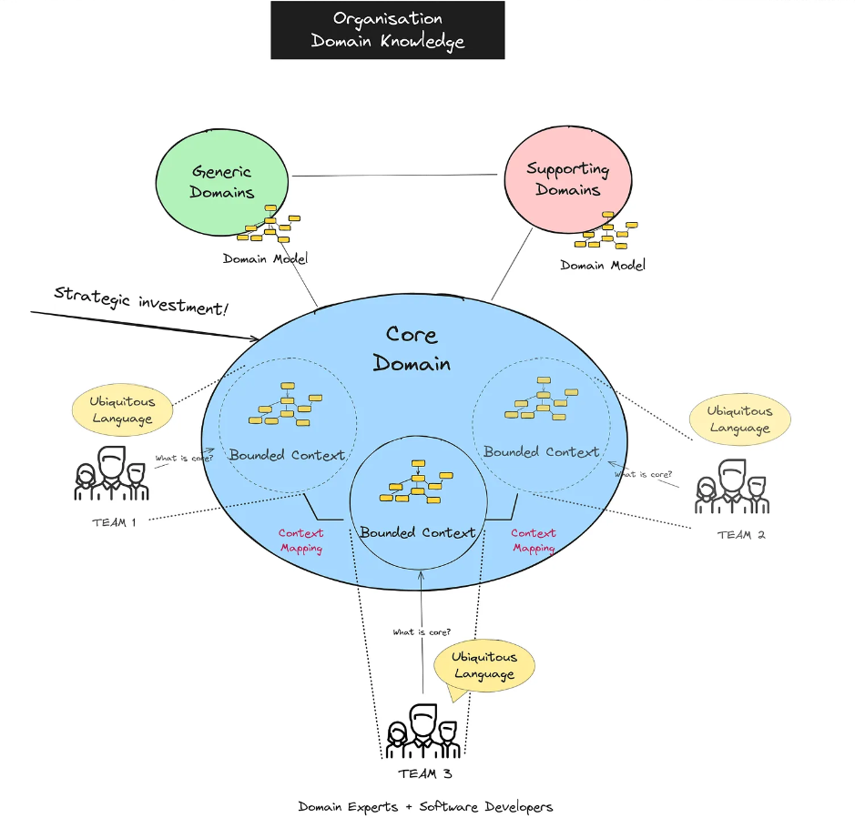
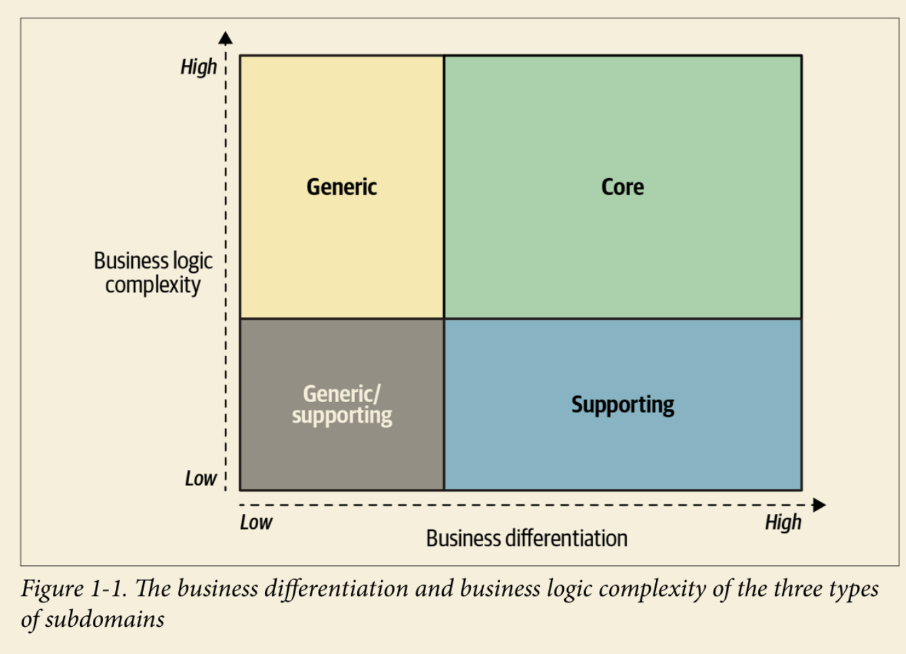
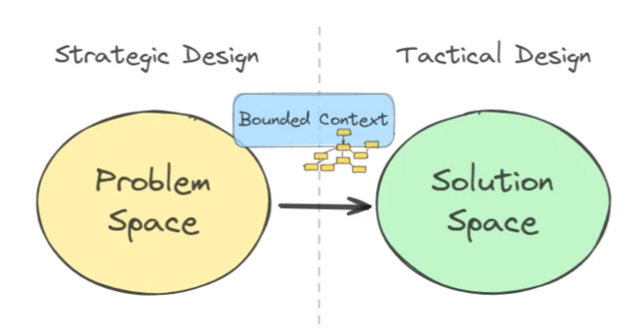

# طراحی دامنه محور (DDD) چیست؟

طراحی دامنه محور (Domain-Driven Design) یک رویکرد پیچیده و استراتژیک برای طراحی سیستم‌های نرم‌افزاری است که بر اساس درک عمیق از دامنه‌ی تجاری و مدل‌سازی آن در سیستم بنا شده است. هدف از DDD این است که پیچیدگی‌های نرم‌افزاری با استفاده از مدل‌های دامنه‌ای که دقیقاً نیازهای تجاری را منعطف و شفاف بازتاب می‌دهند، مدیریت شوند.

در DDD، هدف این است که توسعه‌دهندگان و تحلیلگران تجاری به زبان مشترک و مدل‌های مفهومی واحد برسند، به طوری که همه اعضای تیم درک مشابهی از مشکلات، راه‌حل‌ها و فرآیندها داشته باشند. این کار باعث می‌شود که نرم‌افزار دقیق‌تر، کارآمدتر و متناسب با نیازهای واقعی کسب‌وکار توسعه یابد.

## مفاهیم کلیدی DDD عبارتند از:

- **دامنه:** حوزه‌های تجاری خاص که سیستم برای آن‌ها طراحی می‌شود و در واقع قلب فعالیت کسب‌وکار است.
- **مدل دامنه:** نمایشی مفهومی از واقعیت‌های تجاری که در آن از انواع مختلف اشیاء، موجودیت‌ها و روابط استفاده می‌شود تا فرآیندهای تجاری را مدل‌سازی کند.
- **کانتکست محدود شده (Bounded Context):** این مفهوم به محدوده‌ای از دامنه اشاره دارد که یک مدل خاص دامنه در آن پیاده‌سازی می‌شود و بین این کانتکست‌ها می‌توان تفاوت‌هایی در نحوه مدل‌سازی و اعمال قوانین مشاهده کرد.
- **زبان مشترک (Ubiquitous Language):** زبانی که میان تیم‌های فنی و تجاری به اشتراک گذاشته می‌شود و برای برقراری ارتباط موثر و دقیق در طراحی و توسعه سیستم استفاده می‌شود.

در DDD، به‌ویژه مفهوم کانتکست محدود شده به‌عنوان یک ابزار کلیدی در طراحی نرم‌افزار مورد توجه قرار می‌گیرد، چرا که این کانتکست‌ها مرزهایی را برای مدل‌سازی فراهم می‌کنند که به وضوح تعاریف و تعاملات را تفکیک می‌کنند و باعث جلوگیری از پیچیدگی‌های بیش از حد می‌شوند.

---

# زیر دامنه‌ها

زیر دامنه‌ها بخش‌های خاص و متفاوتی از دامنه‌ی کلی یک کسب‌وکار هستند که نیازمندی‌ها و پیچیدگی‌های خاص خود را دارند. در DDD، این زیر دامنه‌ها به سه دسته‌ی اصلی تقسیم می‌شوند:

 **زیر دامنه هسته‌ای (Core Domain):**
   - این بخش‌ها جزء اصلی و حیاتی سیستم هستند که موفقیت کسب‌وکار به آن‌ها بستگی دارد. معمولاً این بخش‌ها از جنبه‌های رقابتی کسب‌وکار تشکیل می‌شوند. برای مثال، در یک سیستم تجارت الکترونیک، فرآیندهای مدیریت سفارش و پرداخت می‌توانند زیر دامنه هسته‌ای باشند.
   - به دلیل اهمیت حیاتی این بخش‌ها، تمام تلاش‌ها باید برای ایجاد مدل‌های دقیق و بهینه جهت طراحی این زیر دامنه‌ها صرف شود.

 **زیر دامنه حمایتی (Supporting Domain):**
   - این بخش‌ها عملیات‌های پشتیبانی‌کننده از زیر دامنه‌های هسته‌ای را انجام می‌دهند اما خود رقابتی یا کلیدی برای موفقیت کسب‌وکار نیستند. به عنوان مثال، فرآیندهایی مانند مدیریت موجودی، مدیریت روابط با مشتری (CRM) یا سیستم‌های پشتیبانی فنی از این دست هستند.
   - این زیر دامنه‌ها اهمیت دارند، اما بیشتر در راستای پشتیبانی از بخش‌های اصلی و بهینه‌سازی کارایی آن‌ها عمل می‌کنند.

 **زیر دامنه عمومی (Generic Domain):**
   - این زیر دامنه‌ها شامل قابلیت‌هایی هستند که در بسیاری از کسب‌وکارها به‌طور مشترک مورد نیازند و به صورت عمومی می‌توانند به کار گرفته شوند. برای مثال، سیستم‌های پرداخت یا سیستم‌های ایمیل می‌توانند به‌عنوان زیر دامنه‌های عمومی مطرح شوند.
   - این بخش‌ها معمولاً استانداردسازی شده و به‌راحتی می‌توانند در کسب‌وکارهای مختلف و به صورت قابل استفاده مجدد به‌کار گرفته شوند.

---

# کانتکست محدود شده (Bounded Context) در طراحی دامنه محور (DDD)

کانتکست محدود شده یا Bounded Context یکی از مفاهیم اصلی در طراحی دامنه محور (DDD) است که مرزهایی را مشخص می‌کند که در داخل آن، یک مدل دامنه خاص پیاده‌سازی می‌شود. به عبارتی، کانتکست محدود شده یک ناحیه مفهومی است که مدل دامنه، زبان و قوانین خاص خود را دارد و این مدل تنها در داخل این مرزها معتبر و دقیق است. 

## چرا کانتکست محدود شده اهمیت دارد؟

- **وضوح و سازگاری:** با تعریف کانتکست محدود شده، زبان و مدل در داخل آن مرزها به‌طور استاندارد و منسجم تعریف می‌شود. 
- **مدیریت پیچیدگی:** کانتکست محدود شده کمک می‌کند تا مدل‌ها به‌طور جداگانه پیاده‌سازی شوند.
- **جدا سازی:** این مفهوم امکان جداسازی قسمت‌های مختلف سیستم را فراهم می‌آورد.
- **مدل‌های مختلف برای مفاهیم مشابه:** کانتکست محدود شده تفاوت‌ها را شناسایی کرده و از سردرگمی جلوگیری می‌کند.

---

# تفاوت‌های کلیدی بین زیر دامنه و کانتکست محدود شده

| ویژگی                          | زیر دامنه (Subdomain)                                     | کانتکست محدود شده (Bounded Context)                     |
|-------------------------------|----------------------------------------------------------|----------------------------------------------------------|
| سطح مفهومی                   | مفهومی در سطح کسب‌وکار است                               | مفهومی در سطح پیاده‌سازی است                            |
| هدف                          | تعریف و دسته‌بندی عملکردها                               | جداسازی مدل‌های مختلف                                   |
| وابستگی به کسب‌وکار         | کاملاً وابسته به نیازهای کسب‌وکار                       | ممکن است یک زیر دامنه را پوشش دهد                        |
| مرز                          | مرزهای آن از دیدگاه کسب‌وکار تعریف می‌شود               | مرزهای آن از دیدگاه فنی مشخص می‌شود                     |
| مدل‌های دامنه                | شامل مدل خاصی نیست                                      | هر کانتکست محدود شده یک مدل خاص تعریف می‌کند            |
| ارتباط با تیم‌ها            | معمولاً با تحلیلگران ارتباط دارد                        | معمولاً با توسعه‌دهندگان ارتباط دارد                   |
| مثال                         | «مدیریت سفارش‌ها»، «مدیریت پرداخت»                      | ممکن است فقط برای «سفارش‌ها» یا «پرداخت» باشد         |

---

زیر دامنه‌ها بر شناسایی و دسته‌بندی بخش‌های مختلف کسب‌وکار تمرکز دارند و در سطح کسب‌وکار تعریف می‌شوند. کانتکست‌های محدود شده بر پیاده‌سازی مدل‌های دامنه تمرکز دارند و در سطح فنی تعریف می‌شوند. طراحی موفق سیستم نیازمند ترکیب درست این دو مفهوم است: ابتدا زیر دامنه‌های کسب‌وکار شناسایی می‌شوند و سپس کانتکست‌های محدود شده بر اساس آن‌ها طراحی می‌شوند.

# انواع مختلف کانتکست‌های محدود شده

برای هر زیر دامنه یک Bounded Context (BC) وجود دارد که ویژگی و تمرکز خودشان را در مورد آن زیر دامنه دارند:

## 1. دامنه اصلی (Core Subdomain)

این دامنه حاوی اطلاعاتی است که مهم‌ترین و منحصر به فردترین داده‌ها برای سیستم به شمار می‌روند و هدف و ارزش استراتژیک آن را تشکیل می‌دهند.

### انواع اطلاعات در دامنه اصلی:

- **مفاهیم مرکزی و داده‌های آن:**
  - داده‌های اصلی که نمایانگر موجودیت‌های کلیدی سیستم هستند (مثل "رکورد" یا "موجودیت").
  - ویژگی‌هایی که هویت، وضعیت و خصوصیات موجودیت مرکزی را تعریف می‌کنند.
  - ویژگی‌ها: شناسه‌های منحصر به فرد، وضعیت‌ها (مثلاً فعال/غیرفعال)، جزئیات نسخه‌بندی، و تایم‌استمپ‌ها.

- **روابط بین موجودیت‌های اصلی:**
  - داده‌هایی که روابط بین موجودیت‌های مرکزی را تعریف می‌کنند (مثلاً والد-فرزند، پیوستگی‌ها، وابستگی‌ها).
  - متا داده‌های این روابط: قدرت، نوع و محدودیت‌ها.

- **اطلاعات مربوط به چرخه حیات:**
  - اطلاعات مربوط به وضعیت‌ها و انتقال‌ها (مثلاً مراحل چرخه حیات، تغییرات وضعیت).
  - محرک‌ها برای تغییر وضعیت‌ها و تایم‌استمپ‌ها.
  - قوانین و محدودیت‌ها برای وضعیت‌های چرخه حیات.

- **رویدادهای با ارزش بالا:**
  - رویدادهای دامین که در هنگام تغییرات مهم در وضعیت یا اقدامات تولید می‌شوند (مثل PrimaryEntityCreated، EntityStatusUpdated).
  - متا داده‌های رویداد، مانند منبع رویداد، شماره ترتیب، و تایم‌استمپ‌ها.

- **داده‌های مخصوص کسب‌وکار:**
  - پیکربندی‌ها یا فیلدهای خاص که به منطق دامنه سیستم مربوط می‌شوند.
  - قوانین مربوط به عملیات مرکزی که به‌صورت محدودیت‌ها یا اعتبارسنجی‌ها پیاده‌سازی شده‌اند.

### ویژگی‌های اطلاعات در دامنه اصلی:
- **ارزش بالا:** مستقیماً بر عملکرد یا ارزش کلیدی سیستم تاثیر دارد.
- **پیچیدگی زیاد:** روابط غنی، قوانین و وابستگی‌ها بین داده‌ها.
- **حساسیت:** نیاز به دقت و یکپارچگی بالا.
- **استراتژیک:** اطلاعاتی که سیستم را از رقبا متمایز می‌کند.

---

## 2. دامنه پشتیبانی (Supporting Subdomain)

این دامنه شامل اطلاعات عملیاتی است که فرآیندهای دامنه اصلی را پشتیبانی می‌کند اما ویژگی منحصر به فرد یا استراتژیک ندارد.

### انواع اطلاعات در دامنه پشتیبانی:

- **داده‌های عملیاتی:**
  - داده‌هایی که برای تسهیل فرآیندهای اصلی لازم هستند (مثل منابع، برنامه‌ریزی‌ها، و وابستگی‌ها).
  - ویژگی‌ها برای ردیابی دسترس‌پذیری، وضعیت و پیکربندی‌ها.

- **داده‌های وابستگی:**
  - ارجاعات یا ارتباطات خارجی که برای انجام وظایف پشتیبانی نیاز است.
  
- **اطلاعات ردیابی فرآیند:**
  - وضعیت و اطلاعات پیشرفت برای جریان‌های کاری عملیاتی.
  
- **قوانین و محدودیت‌ها:**
  - اطلاعات در مورد قوانینی که برای اجرای محدودیت‌های عملیاتی استفاده می‌شود.

- **رویدادهای کم‌ارزش:**
  - رویدادهایی که مربوط به به‌روزرسانی‌ها یا اطلاع‌رسانی‌های عملیاتی هستند.

### ویژگی‌های اطلاعات در دامنه پشتیبانی:
- **ارزش متوسط:** برای عملکرد روان و مؤثر سیستم ضروری است اما به اندازه داده‌های دامنه اصلی مهم نیست.
- **پیچیدگی متوسط:** روابط ساده‌تر و وابستگی‌های کمتری.
- **قابل جایگزینی:** می‌توان آن را با راه‌حل‌های استاندارد یا خارجی جایگزین کرد.

---

## 3. دامنه عمومی (Generic Subdomain)

این دامنه شامل اطلاعات استاندارد، کالا (Commodity) است که از نرم‌افزارهای عمومی یا استانداردهای صنعتی پیروی می‌کند.

### انواع اطلاعات در دامنه عمومی:

- **داده‌های تراکنشی:**
  - سوابق استاندارد از تعاملات یا مبادلات.

- **داده‌های یکپارچگی:**
  - داده‌های مبادله شده با سیستم‌های خارجی که معمولاً از پروتکل‌ها یا ساختارهای API خاص پیروی می‌کنند.

- **داده‌های مربوط به انطباق:**
  - اطلاعاتی که برای رعایت الزامات قانونی یا صنعتی ذخیره می‌شود.

- **داده‌های مرجع ایستا:**
  - اطلاعات از پیش تعریف‌شده یا جستجو که معمولاً تغییر نمی‌کنند.

- **رویدادهای کم‌پیچیدگی:**
  - رویدادهای سطح کالا که مربوط به فرآیندهای استاندارد هستند.

### ویژگی‌های اطلاعات در دامنه عمومی:
- **ارزش کم:** استاندارد شده و اغلب قابل جایگزینی است.
- **پیچیدگی کم:** پیروی از استانداردهای خارجی و قابل پیش‌بینی.
- **قابل برون‌سپاری:** می‌توان آن را به راحتی به سیستم‌های خارجی یا ابزارهای شخص ثالث سپرد.

---

## 4. لایه ضد آلودگی (Anticorruption Layer - ACL)

توضیح: لایه ضد آلودگی یک لایه محافظتی است که مانع از «آلودگی» مدل دامنه یکی از کانتکست‌ها توسط مدل دامنه کانتکست دیگر می‌شود. این لایه معمولاً برای جلوگیری از تأثیرات مدل‌های خارجی یا سیستم‌های قدیمی استفاده می‌شود و به‌عنوان مترجم بین دو مدل مختلف عمل می‌کند.

### ویژگی‌ها:
- از آلودگی مدل دامنه جلوگیری می‌کند.
- این لایه معمولاً برای برقراری ارتباط با سیستم‌های قدیمی یا خارجی استفاده می‌شود.
  
---

## 5. کانتکست‌های ادغام (Integration Context)

توضیح: این کانتکست‌ها به نحوه ارتباط و تعامل میان کانتکست‌های محدود شده مختلف پرداخته و شامل الگوهای مختلف برای مدیریت جریان داده‌ها، ارسال پیام‌ها و همگام‌سازی بین کانتکست‌ها است.

### ویژگی‌ها:
- شامل پروتکل‌هایی مانند ارتباطات رویدادمحور یا REST APIs.
  
---

## 6. کانتکست‌های سیستم‌های قدیمی

توضیح: در بسیاری از سازمان‌ها، سیستم‌های قدیمی ممکن است به روش‌های سنتی یا بدون در نظر گرفتن اصول DDD طراحی شده باشند. 

### ویژگی‌ها:
- از سیستم‌های قدیمی در برابر تأثیرات منفی سایر بخش‌ها محافظت می‌کند.
  
---

# جدول مقایسه اطلاعات در دامنه‌های مختلف

| جنبه                       | دامنه اصلی                   | دامنه پشتیبانی              | دامنه عمومی                 |
|----------------------------|------------------------------|------------------------------|-----------------------------|
| نقش اطلاعات                | ارزش استراتژیک و منحصر به فرد. | تسهیل فرآیندهای اصلی.      | انجام وظایف استاندارد و کمکی. |
| نمونه‌های داده             | موجودیت‌های مرکزی، چرخه حیات، روابط. | منابع عملیاتی، وابستگی‌ها، داده‌های جریان کاری. | تراکنش‌ها، تبادل‌های API، داده‌های مرجع. |
| ارزش                       | بالا – حیاتی و منحصر به فرد. | متوسط – برای عملیات ضروری. | کم – سطح کالا و قابل جایگزینی. |
| پیچیدگی                    | بالا – وابستگی‌های پیچیده.   | متوسط – متمرکز بر کارایی.   | کم – استاندارد شده و پیش‌بینی شده. |
| نیاز به یکپارچگی          | بسیار بالا – اعتبارسنجی سخت. | متوسط – دقت عملیاتی.       | کم – نیاز به قوانین محدود. |
| قابلیت جایگزینی           | به ندرت قابل جایگزینی – اختصاصی.| اغلب قابل جایگزینی – راه‌حل‌های مدولار.| به راحتی قابل جایگزینی – API های استاندارد.|

---

# ارتباطات بین کانتکست‌های محدود شده

کانتکست‌های محدود شده ممکن است روابط مختلفی با یکدیگر داشته باشند که این روابط برای مدل‌سازی رفتار کلی سیستم ضروری هستند:

 **هسته مشترک (Shared Kernel)**  
   توضیح: این نوع رابطه زمانی اتفاق می‌افتد که دو کانتکست محدود شده بخشی از مدل دامنه خود را به اشتراک می‌گذارند.

 **رابطه مشتری-تأمین‌کننده (Customer-Supplier)**  
   توضیح: در این نوع رابطه، یک کانتکست محدود شده (تأمین‌کننده) داده‌ها یا خدماتی را به کانتکست دیگر (مشتری) ارائه می‌دهد.

 **رابطه هم‌ساز (Conformist)**  
   توضیح: در این رابطه، یک کانتکست محدود شده مدل و قوانین کانتکست دیگری را به‌طور کامل می‌پذیرد و تغییری در آن‌ها ایجاد نمی‌کند.

 **لایه ضد آلودگی (ACL)**  
   توضیح: این لایه مانع از آلوده شدن مدل یک کانتکست محدود شده به مدل های کانتکست دیگر می‌شود.

---

# توسعه زبان مشترک (Ubiquitous Language) در هر کانتکست محدود شده (Bounded Context)

زبان مشترک یکی از مفاهیم کلیدی در طراحی دامنه محور (Domain-Driven Design) است. این زبان یک مجموعه از اصطلاحات و مفاهیم است که تیم‌های فنی و کسب‌وکاری به طور مشترک از آن استفاده می‌کنند تا مدل دامنه را به درستی درک و پیاده‌سازی کنند. 

### ویژگی‌های زبان مشترک:

1. **مرکزیت بر دامنه‌ی خاص:**
   - هر کانتکست محدود شده زبان خاص خود را دارد که دقیقاً نیازها و مفاهیم همان بخش از سیستم را بیان می‌کند. 
   - زبان مشترک در یک کانتکست محدود شده ممکن است با زبان در کانتکست دیگر متفاوت باشد.

2. **هدف:**
   - کاهش سوء تفاهم بین تیم‌های کسب‌وکاری و فنی.
   - مستندسازی واضح مفاهیم کلیدی دامنه.
   - هم‌ترازی بین طراحی فنی و نیازهای تجاری.

### نکات کلیدی برای توسعه زبان مشترک:

1. استفاده از جلسات مشترک بین توسعه‌دهندگان و کارشناسان کسب‌وکار.
2. ثبت اصطلاحات کلیدی در مستندات دامنه یا مدل‌های کد.
3. تطبیق زبان با مدل‌های پیاده‌سازی (کد، دیتابیس، و غیره).

---

# نگاشت روابط بین کانتکست‌های محدود شده و تیم‌ها (Context Mapping)

نگاشت کانتکست (Context Mapping) فرآیندی است برای تحلیل و مستندسازی روابط بین کانتکست‌های محدود شده و تیم‌هایی که با آن‌ها کار می‌کنند.

### چرا کانتکست مپینگ مهم است؟

1. تعریف مرزها: کمک می‌کند مرزهای بین کانتکست‌های مختلف و نحوه تعامل آن‌ها مشخص شود.
2. مدیریت ارتباطات: به شناسایی وابستگی‌ها و نحوه همکاری تیم‌ها کمک می‌کند.
3. شفاف‌سازی مسئولیت‌ها: مشخص می‌کند که کدام تیم مسئول کدام کانتکست است.

### انواع روابط بین کانتکست‌ها:

1. Partnership (شراکت): دو کانتکست به طور مستقیم و هماهنگ با یکدیگر همکاری می‌کنند.
2. Customer-Supplier (مشتری-تأمین‌کننده): یک کانتکست به عنوان مشتری از داده‌ها یا خدمات کانتکست دیگر استفاده می‌کند.
3. Conformist (پذیرنده): یک کانتکست مدل و قوانین کانتکست دیگر را به صورت کامل می‌پذیرد.
4. Anti-Corruption Layer (لایه ضد آلودگی): برای جلوگیری از تداخل مدل‌ها و مفاهیم بین کانتکست‌ها، یک لایه واسط ایجاد می‌شود.

### رویکردهای نگاشت:

1. استفاده از نمودارهای ارتباطات برای نمایش نحوه اتصال کانتکست‌ها.
2. تعریف قراردادهای رسمی برای ارتباطات بین تیم‌ها.

---

# هم‌ترازی معماری نرم‌افزار با استراتژی کسب‌وکار و ساختار دامنه

یکی از اهداف اصلی DDD، هماهنگ کردن طراحی نرم‌افزار با نیازها و اهداف تجاری است. این هم‌ترازی باعث می‌شود سیستم نرم‌افزاری به شکلی توسعه یابد که بهترین پشتیبانی را از استراتژی کسب‌وکار ارائه دهد.

### چرا این هماهنگی مهم است؟

1. جلوگیری از طراحی سیستم‌های ناکارآمد که با نیازهای واقعی کسب‌وکار سازگار نیستند.
2. کمک به تصمیم‌گیری بهتر در مورد اولویت‌بندی توسعه ویژگی‌ها.
3. اطمینان از اینکه هر کانتکست محدود شده دقیقاً یک بخش از استراتژی کسب‌وکار را پشتیبانی می‌کند.

### چگونه به این هماهنگی برسیم؟

1. شناسایی زیر دامنه‌های هسته‌ای: ابتدا باید بخش‌های کلیدی کسب‌وکار (Core Subdomains) مشخص شوند.
2. ایجاد تطابق بین زیر دامنه‌ها و کانتکست‌ها: طراحی کانتکست‌های محدود شده باید مطابق با ساختار دامنه باشد.
3. مدیریت تیم‌ها: تیم‌ها باید بر اساس کانتکست‌ها سازماندهی شوند و هر تیم مسئول یک یا چند کانتکست محدود شده باشد.
4. ارتباط مستمر با ذینفعان کسب‌وکار: برای اطمینان از اینکه معماری نرم‌افزار همچنان در راستای تغییرات استراتژی کسب‌وکار باقی می‌ماند.

### ابزارها و تکنیک‌ها:

1. نگاشت استراتژیک: استفاده از تکنیک‌هایی مانند Event Storming برای تحلیل دقیق‌تر دامنه.
2. طراحی میکروسرویس‌ها: ساختار معماری میکروسرویس‌ها باید بر اساس کانتکست‌های محدود شده تنظیم شود.
3. زبان مشترک: اطمینان از اینکه زبان مورد استفاده در معماری فنی با زبان کسب‌وکار هم‌خوانی دارد.

# مثال از کانتکست‌های محدود شده

## 1. دامنه اصلی (Core Subdomain)
### Bounded Context: Patient Management

این BC شامل مفاهیم و اطلاعات کلیدی مرتبط با مدیریت بیماران است.

### What This BC Contains
#### Domain Concepts:
- **Patient Profile:** اطلاعات شخصی و پزشکی (مانند نام، سن، آلرژی‌ها، شرایط گذشته)
- **Care Plan:** یک برنامه ساختاریافته که تشخیص، درمان‌ها و داروها را مشخص می‌کند.
- **Appointments:** مشاوره‌های برنامه‌ریزی شده با پزشکان، آزمایش‌ها یا روش‌ها.
- **Care Team:** فهرستی از پزشکان، پرستاران و متخصصان منصوب شده.

#### Entities:
- **Patient:** پیگیری فردی که تحت درمان قرار دارد.
- **Care Plan:** نمایانگر یک برنامه قابل تنظیم برای درمان بیمار.
- **Appointment:** پیوند بیماران با ارائه‌دهندگان در زمان‌های مشخص.

#### Aggregates:
- **Patient Aggregate:** مدیریت تمامی داده‌ها و قوانین مرتبط با بیمار.
- **Care Plan Aggregate:** اعتبارسنجی برنامه‌های درمانی و پیگیری پیشرفت.

#### Domain Events:
- **CarePlanUpdated:** تغییرات در برنامه درمان بیمار را نشان می‌دهد.
- **AppointmentScheduled:** ذینفعان را از یک قرار ملاقات جدید مطلع می‌کند.
- **CareTeamAssigned:** انتصاب حرفه‌ای‌های مراقبت را علامت‌گذاری می‌کند.

#### Application Services:
- Schedule Appointment
- Update Care Plan
- Assign Care Team

#### External Integrations:
- **Diagnostic Tools:** ادغام با تجهیزات آزمایشگاهی برای دریافت گزارشات.
- **Electronic Health Records (EHR):** همگام‌سازی سوابق بیماران با سیستم‌های خارجی.

#### Policies/Rules:
- Rule: هر برنامه درمانی باید توسط پزشک منصوب تأیید شود.
- Rule: لغو قرار ملاقات‌ها باید حداقل ۲۴ ساعت قبل انجام شود.

---

## 2. دامنه پشتیبانی (Supporting Subdomain)
### Bounded Context: Resource Allocation

این BC از دامنه اصلی پشتیبانی می‌کند و مدیریت دسترسی به منابع (مانند پرسنل پزشکی، اتاق‌ها و تجهیزات) را انجام می‌دهد.

### What This BC Contains
#### Domain Concepts:
- **Resource:** می‌تواند اتاق، تجهیزات یا حرفه‌ای پزشکی باشد.
- **Resource Schedule:** پیگیری رزروها و دسترسی منابع.
- **Shift Management:** تخصیص پرسنل بر اساس دسترسی و بار کاری.

#### Entities:
- **Resource:** نمایانگر هر دارایی یا فرد موجود برای تخصیص.
- **Booking:** پیوند منابع با قرار ملاقات‌ها.
- **Shift:** مدیریت زمان‌بندی برای پرسنل.

#### Aggregates:
- **Resource Aggregate:** اجرای قوانینی مانند جلوگیری از رزرو همزمان.
- **Shift Aggregate:** اطمینان از انطباق زمان‌بندی پرسنل با قوانین کار.

#### Domain Events:
- **ResourceBooked:** نشان‌دهنده این است که یک منبع تخصیص یافته است.
- **ShiftUpdated:** تغییرات در دسترسی پرسنل را پیگیری می‌کند.

#### Application Services:
- Reserve Resource for Appointment
- Adjust Staff Shifts

#### External Integrations:
- **Staff Availability APIs:** همگام‌سازی با سیستم‌های منابع انسانی خارجی.
- **Equipment Monitoring Systems:** بررسی آمادگی عملیاتی.

#### Policies/Rules:
- Rule: موارد با اولویت بالا باید بر تخصیص منابع تقدم داشته باشند.
- Rule: هیچ پرسنلی نمی‌تواند بیش از ۱۲ ساعت متوالی رزرو شود.

---

## 3. دامنه عمومی (Generic Subdomain)
### Bounded Context: Payments

این BC عملکرد استاندارد و کالایی پرداخت‌ها و صورتحساب‌ها را مدیریت می‌کند.

### What This BC Contains
#### Domain Concepts:
- **Invoice:** رکورد خدمات ارائه‌شده به همراه هزینه‌ها.
- **Payment:** نمایانگر یک تراکنش مالی.
- **Refund:** تراکنش معکوس برای پرداخت اضافی یا لغو.

#### Entities:
- **Invoice:** پیگیری خدمات، قیمت‌ها و مبالغ owed.
- **Transaction:** نمایانگر پرداخت یا بازپرداخت.

#### Aggregates:
- **Invoice Aggregate:** اعتبارسنجی اینکه صورتحساب‌ها کامل و دقیق هستند.
- **Payment Aggregate:** مدیریت تأسیس پرداخت و تکمیل آن.

#### Domain Events:
- **InvoiceGenerated:** نشان‌دهنده این است که یک صورتحساب ایجاد شده است.
- **PaymentProcessed:** نشان‌دهنده پرداخت موفقیت‌آمیز است.
- **RefundIssued:** پیگیری بازپرداخت‌ها برای خدمات لغو شده.

#### Application Services:
- Generate Invoice
- Process Payment
- Handle Refunds

#### External Integrations:
- Payment Gateways: Stripe, PayPal, etc
- Tax Systems: محاسبه خودکار مالیات بر اساس حوزه قضایی.

#### Policies/Rules:
- Rule: تمامی صورتحساب‌ها باید شامل مالیات‌های قابل اجرا قبل از ارسال باشند.
- Rule: پرداخت‌ها باید تا سه بار در صورت عدم موفقیت اولیه تلاش کنند.

---

# مطالعه بیشتر:

- Domain-Driven Design: Tackling Complexity in the Heart of Software, Eric Evans
- Implementing Domain-Driven Design, Vaughn Vernon

