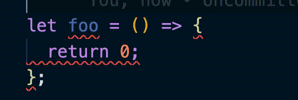
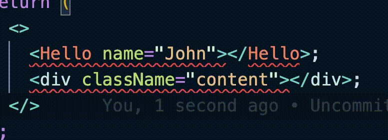
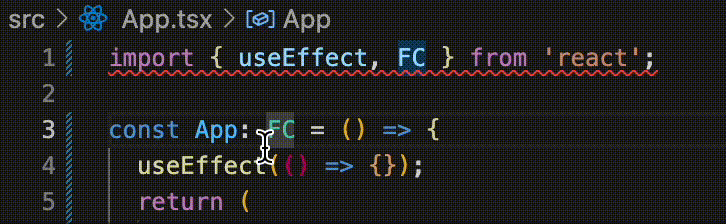
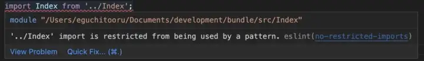

# eslint

# معرفی

<p dir = "RTL">
    ESLint یک Linter بسیار محبوب و متن باز برای جاوا اسکریپت و تایپ اسکریپت است که می‌تواند کد این زبان‌ها را تحلیل کند و هشدارها و خطاهایی بر اساس شدت نقض قواعد مختلف ارائه دهد که باعث میشود کدی بهتر با احتمال خطای کمتری توسط توسعه دهنده نوشته شود.
</p>


# نصب
<p dir = 'rtl'>ابتدا نیاز است که پکیج منیجر npm را نصب کنیم</p>

```
in linux

$ sudo apt install
$ nodejs npm
```
<p dir = 'rtl'>سپس با دستور زیر با استفاده از npm پکیج eslint را نصب میکنیم</p>

```
npm init @eslint/config
```

<p dir = 'rtl'>در صورتی که قصد استفاده از پیکربندی های موجود حال حاضر را دارید میتوانید مطابق با نمونه زیر عمل کنید با اضافه کردن 
</p>

```
--config [package-name]
```

برخی از پکیج های مناسب در لینک زیر آورده شده است.
[لینک](https://github.com/dustinspecker/awesome-eslint)


```
# use `eslint-config-semistandard` shared config

# npm 7+
npm init @eslint/config -- --config semistandard

# or (`eslint-config` prefix is optional)
npm init @eslint/config -- --config eslint-config-semistandard

# ⚠️ npm 6.x no extra double-dash:
npm init @eslint/config --config semistandard
```

## سوالات هنگام نصب 

<p dir='rtl'> 

در هنگام نصب یکسری سوالات پرسیده خواهد شد که در ادامه به آن ها اشاره خواهیم کرد البته لازم به ذکر است که بعد از نصب نیز می توان آن ها را مجدد پیکربندی کرد: 

>تنظیمات داخل فایلی با نام eslintrc قرار خواهد گرفت

```
How would you like to use ESLint? ...
  To check syntax only
> To check syntax and find problems
  To check syntax, find problems, and enforce code style
```
گزینه دوم به صورت پیشفرض انتخاب شده است در این سوال از شما می پرسد که ESLint چه کاری را برای شما انجام 1.فقط سینتکس کد را چک کند 2.به جز سینتکس ایرادهای کد را نیز پیدا کند 3.این گزینه علاوه بر سینتکس و ایراد های ساختاری کند ،استایل کد را نیز بررسی می کند

---

```
What type of modules does your project use? ...
> JavaScript modules (import/export)
  CommonJS (require/exports)
  None of these
```
این مورد معمولا باید گزینه JavaScript modules انتخاب شود مگر نسبت به نیاز پروژه شما تغییر کند

------

```
Which framework does your project use? ...
> React
  Vue.js
  None of these
```
در این قسمت فریمورک مورد استفاده را انتخاب می کنیم

------

```
Does your project use TypeScript? » No / Yes
```
در این قسمت اگر از سوپرست تایپ اسکریپ برای پروژه خود استفاده می کنید باید این گزیته را برابر با YES قرار دهید زیرا برخی قوانین در تایپ اسکریپ متفاوت با جاوااسکریپ می باشد

---


```
Where does your code run? ...  (Press <space> to select, <a> to toggle all, <i> to invert selection)
√ Browser
√ Node
```
این مورد به محل اجرای کد اشاره دارد که داخل مرورگر باشد یا سرور
---

```
What format do you want your config file to be in? ...
> JavaScript
  YAML
  JSON
```
این قسمت به محل ذخیره سازی کانفیگ های ESLint اشاره می کند که دارای چه فرمتی باشد که جاوااسکریپت گزینه بهتری برای مدیریت است

---


```
Would you like to install them now? » No / Yes
```
این مورد اشاره به نصب ESLint دارد که می خوایم نصب کنیم پس گزینه YES را می زنیم 

---


```
Which package manager do you want to use? ...
> npm
  yarn
  pnpm

```
در این قسمت پکیج منیجری که از آن استفاده می کنیم را باید انتخاب کنیم که برای نصب مشکلی پیش نیاید.

---

</p>

بعد از انجام این مراحل میتوانید به راحتی eslint را بر روی هرفایلی اجرا کنید

```
npx eslint [your-file.js]
```


# پیکربندی

بعد از اجرای دستور 

```
npm init @eslint/config
```
 <p>
 بعد از اجرا دستور npm init @eslint/config در دایرکتوری پروژه شما یک فایل .eslintrc.{js,yml,json} ساخته خواهد شد که درآن میتوانید قانون ها و سطح آنها رو مشخص کنید.
 <p>

 به عنوان مثال

 ```
 {
    "rules": {
        "semi": ["error", "always"],
        "quotes": ["error", "double"]
    }
}
 ```

قوانین بالا به الزام استفاده از semicolon و استفاده از double quote اشاره میکنید که درصورت عدم رعایت آنها در ادیتور خود خطای متناسب با این قوانین را مشاهده خواهید کرد

## سطوح نشان دادن خطا

نمونه زیر را در نظر بگیرید

```
{
    "no-use-before-define": ["error", {
        "functions": true,
        "classes": true,
        "variables": true,
        "allowNamedExports": false
    }]
}
```
این قانون اشاره به این دارد که استفاده از یک متغیر قبل از تعریف آن باعث نشان دادن خطا میشود.

در قانون نوشته شده بالا با استفاده از آپشن های زیر میتوان پیام دریافتی مربوط به این قانون را تغییر دهیم

با استفاده از off میتوان به طور کلی این قانون را غیرفعال کرد.

با استفاده از warn در هنگام نقض این قانون به جای نشان دادن خطا صرفا یک هشدار به آنها نشان داده میشود

## دیگر امکانات و دسترسی های این پکیج

### در نظر نگرفتن برخی فایل ها در اجرای قوانین

```
export default [
    {
        files: ["src/**/*.js"],
        ignores: ["**/*.config.js"],
        rules: {
            semi: "error"
        }
    }
];
```
به عنوان مثال در گزینه بالا قوانین مشخص شده در فایل های جی اس اجرا میشود ولی در فایل هایی با اکستنشن .config.js اجرا نمیشود

### مشخص کردن نسخه قابل قبول javascript

با مشخص کردن این کانفیگ eslint کد های مارا بر اساس نسخه مشخص شده داوری میکند در این کانفیگ از ecmaVersion برای زبان js استفاده میشود.

```
export default [
    {
        files: ["**/*.js"],
        languageOptions: {
            ecmaVersion: 5
        }
    }
];
```

در مثال بالا فایل های js ما کد های بر اساس ورژن 5 ecma داوری میشود.
این گزینه به طور معمول بر روی latest تنظیم شده است که آخرین نسخه پایدار منتشر شده پیروی میکند.

## مشخص کردن parser 

به طور پیشفرض این پکیج از [Espree](https://github.com/eslint/espree) به عنوان مفسر خود استفاده میکند ولی این امکان را داریم که از پکیج های مرسومی مانند [babel](https://www.npmjs.com/package/babel-eslint) 
نیز استفاده کنیم.
## استفاده از قوانین مرسوم این پکیج

با قرار دادن این بخش از کد در فایل .eslintrc.{js,yml,json}

```
{
    "extends": "eslint:recommended"
}
```

[قوانین پیشنهادی](https://eslint.org/docs/latest/rules)
 این پکیج به طور پیش فرض برای ریپازینتوری شما فعال خواهد شد.


---

## برخی از کانفیگ های پیشنهادی برای React
</br>
</br>

* **arrow-body-style:**
```
Config---------> "arrow-body-style": ["error", "as-needed"],

// Incorrect
let foo = () => {
    return 0;
};
// Correct
let foo = () => 0
```
<div align="center">
    
</div>

</br>
</br>

* **react/self-closing-comp:**
```
Config--------->
"react/self-closing-comp": [
   "error", { 
     "component": true,
     "html": true
   }
 ]
----------------

// Incorrect
<Hello name="John"></Hello>;
<div className="content"></div>;

// Correct
<Hello name="John" />
<div className="content" />
```
<div align="center">
    
</div>
</br>
</br>

* **autofix/no-unused-vars:**
```
Config--------->
 "autofix/no-unused-vars": [
   "error",
   {
     "argsIgnorePattern": "^_",
     "ignoreRestSiblings": true,
     "destructuredArrayIgnorePattern": "^_"
   }
  ]
----------------

// Incorrect
function foo(x, y) {
    return x + 1;
}
foo();
var { foo, ...coords } = data;
const [a, b] = ["a", "b"];
console.log(b);

// Correct
function foo(x, _y) {
    return x + 1;
}
foo();
var { foo, ...coords } = data;
const [_a, b] = ["a", "b"];
console.log(b);
```

</br>
</br>

* **@typescript-eslint/consistent-type-imports:**
```
Config--------->
 "@typescript-eslint/consistent-type-imports": [
   "error",
   {
     "prefer": "type-imports",
   }   
 ],
----------------

// Incorrect
import { useEffect, FC } from "react";

// Correct
import { useEffect } from "react";
import type { FC } from "react";
```
<div align="center">
    
</div>

</br>
</br>

* **import/order:**
```
Config--------->
 "import/order": [
   "error",
   {        
     "groups": [
       "builtin",
       "external",
       "parent",
       "sibling",
       "index",
       "object",   
       "type"
     ],
     "pathGroups": [
       {
         "pattern": "@/**/**",
         "group": "parent",
         "position": "before"
       }
     ],
     "alphabetize": { "order": "asc" }
   }
 ],
----------------
```

</br>
</br>

* **no-restricted-imports:**
```
Config--------->
 "no-restricted-imports": [
   "error",
   { 
     "patterns": ["../"] 
   }
 ],
----------------
```
<div align="center">
    
</div>
</br>

> البته لازم به ذکر هست که این تنظیمات پیشنهادی و دیگر تنظیمات در قالب پکیج های npm هم توسعه یافته و در درسترس هستید مانند [eslint-plugin-react](https://github.com/jsx-eslint/eslint-plugin-react) و بسیاری دیگر


