<div dir="rtl">

# Keycloak

<div align="center">


<p align="center">
    تحقیق درس برنامه سازی وب، دانشگاه صنعتی شریف
    <br/>
    استاد درس: جناب آقای یحیی پورسلطانی
    <br/>
    نویسندگان: امیرمهدی کوششی، همراز عرفاتی
</p>

</div>

<hr>


## مقدمه

همانطور که مستحضر هستید، keycloak یک ابزار محبوب در حوزه‌ی مدیریت دسترسی است. امیدواریم در انتهای این بخش به درک خوبی از این ابزار دست پیدا کنید.

با رشد روزافزون برنامه‌ها و سرویس‌های وب، مدیریت هویت و دسترسی به یکی از چالش‌های اصلی سازمان‌ها تبدیل شده است. مشکلاتی مانند احراز هویت پیچیده، مدیریت کاربران در سیستم‌های مختلف و تضمین امنیت داده‌ها از جمله مواردی هستند که نیاز به یک راهکار جامع دارند.

کی‌کلوک (Keycloak) ابزاری متن باز از شرکت Red Hat می‌باشد که برای مدیریت هویت و دسترسی کاربران (Identity and Access Management) است. برای اختصار به چنین ابزاری IAM هم گفته می‌شود. به کمک keycloak می‌توان به راحتی authentication و authorization را به سرویس‌های مختلف اضافه کرد و دیگر نیازی نیست درگیر نگهداری مشخصات کاربران شد. با مدل Single-Sign On یا به اختصار SSO آن کاربران فقط با keycloak برای وارد شدن به یا خارج شدن از وبسایت تعامل می‌کنند و اپلیکیشن نیازی به درگیر شدن با این مسائل ندارد.

ابزار keycloak از پروتکل‌های استاندارد OIDC, OAuth 2.0 و SAML پشتیبانی می‌کند. به کمک این پروتکل‌ها می‌توانید برای اپ‌هایی مثل گرافانا و راکت‌چت SSO تنظیم کنید. به‌تازگی تمامی مجموعه‌ها سعی بر این دارند که از سیستم SSO پیروی کنند. حتی در سیستم دانشگاه (صنعتی شریف به طور مثال) نیز این امر به تازگی آمده است که دانشجویان، اساتید و کارمندان با استفاده از SSO وارد سیستم‌های کاربری دانشگاه شوند.

می‌توان keycloak را به سرور LDAP یا شبکه‌های اجتماعی متصل گرد تا مشخصات کاربران را از آن‌ها دریافت کند. علاوه بر این‌ها کنسول ادمین keycloak به ما این امکان را می‌دهد که به شکل متمرکز تمامی کاربران را تعریف و مدیریت کنیم. این مدیریت شامل گذاشتن policy برای رمز عبور، تعیین permissionها و مدیریت sessionهای کاربران می‌‌شود.


### با Keycloak چه کارهایی می‌توان انجام داد؟

#### ورود یکپارچه (SSO):

ابزار Keycloak به کاربران اجازه می‌دهد که یک بار وارد شده و به چندین برنامه دسترسی پیدا کنند بدون نیاز به ورود مجدد. 

#### پشتیبانی ورود با شبکه‌های مختلف

ابزار Keycloak از اتصال به سرویس‌های هویتی ثالث مانند Google، Facebook، GitHub و غیره پشتیبانی می‌کند. این امر فرآیند ثبت نام و ورود را برای کاربران ساده می‌کند.

#### خدمات مجوزدهی
ابزار Keycloak خدمات مجوزدهی دقیق ارائه می‌دهد که به توسعه‌دهندگان اجازه می‌دهد سیاست‌های مجوزدهی برای برنامه‌های خود تعریف و اعمال کنند. درواقع می‌توان برای کاربرهای مختلف  privacy policyهای متفاوتی تعریف کرد.

#### احراز هویت چندعاملی (MFA)

ابزار Keycloak از MFA پشتیبانی می‌کند و با افزودن روش‌های تأیید اضافی مانند OTP (رمز یک‌بار مصرف)، پیامک یا اپلیکیشن‌های احراز هویت موبایل، امنیت را افزایش می‌دهد.

#### سفارشی‌سازی صفحات ورود

ابزار Keycloak امکان سفارشی‌سازی صفحات ورود، ثبت نام و سایر عناصر کاربری را فراهم می‌کند تا با نیازها و برند سازمان تطابق داشته باشد.

#### مدیریت نشست‌ها

مدیریت نشست‌های کاربران شامل قابلیت خروج از راه دور، مانیتورینگ نشست‌های فعال و اعمال زمان‌های منقضی شدن نشست‌ها.


### موارد استفاده از Keycloak

#### امنیت معماری‌های میکروسرویس

ایمن‌سازی معماری‌های میکروسرویس با اجرای احراز هویت و مجوزدهی متمرکز، اطمینان از ارتباط امن بین سرویس‌ها.

#### امنیت API

حفاظت از API‌ها با استفاده از OAuth 2.0 و OpenID Connect برای دسترسی و مجوزدهی امن API‌ها، اطمینان از اینکه تنها کاربران و برنامه‌های مجاز می‌توانند به API‌ها دسترسی داشته باشند.

#### امنیت برنامه‌های موبایل و وب

ایمن‌سازی برنامه‌های موبایل و وب با ادغام Keycloak برای احراز هویت و مجوزدهی، اطمینان از مدل امنیتی یکپارچه در پلتفرم‌های مختلف.


### اصطلاحات رایج در Keycloak

#### Realm

یک Realm در Keycloak به عنوان یک فضای ایزوله برای مدیریت کاربران، نقش‌ها، کلاینت‌ها و تنظیمات امنیتی عمل می‌کند. هر Realm می‌تواند تنظیمات و پیکربندی‌های خاص خود را داشته باشد و به طور مستقل از سایر Realmها عمل کند.

### User

کاربران افرادی هستند که به سیستم وارد می‌شوند و از آن استفاده می‌کنند. اطلاعات کاربران در Keycloak شامل نام کاربری، رمز عبور، نقش‌ها و سایر ویژگی‌های کاربر است.

#### Client

کلاینت‌ها نمایانگر برنامه‌ها و سرویس‌هایی هستند که به Keycloak متصل می‌شوند تا از امکانات احراز هویت و مجوزدهی استفاده کنند. هر کلاینت دارای تنظیمات خاص خود مانند URL برگشتی و endpoint احراز هویت است.

#### Role

نقش‌ها مجموعه‌ای از مجوزها هستند که به کاربران اختصاص داده می‌شوند. نقش‌ها می‌توانند به صورت کلی (Realm Roles) یا خاص یک کلاینت (Client Roles) تعریف شوند.

#### Group

گروه‌ها مجموعه‌ای از کاربران هستند که می‌توانند نقش‌ها و سیاست‌های خاصی را به اشتراک بگذارند. گروه‌ها به مدیریت بهتر کاربران کمک می‌کنند. درواقع تعریف گروه می‌توان مجموعه‌ای از Real و Client و User ها را در کنار یکدیگر قرار داد. (به عبارتی گروه بندی کرد.)

#### Identity Provider

ارائه‌دهندگان هویت سرویس‌هایی هستند که Keycloak می‌تواند به آن‌ها متصل شود تا از آن‌ها برای احراز هویت کاربران استفاده کند. این سرویس‌ها شامل سرویس‌های اجتماعی مانند Google و Facebook و همچنین سرویس‌های شرکتی مانند LDAP و Active Directory می‌شوند.

#### Authentication

احراز هویت فرآیندی است که طی آن هویت کاربر تأیید می‌شود. Keycloak از روش‌های مختلف احراز هویت مانند نام کاربری و رمز عبور، احراز هویت چندعاملی و ورود با شبکه‌های اجتماعی پشتیبانی می‌کند.

#### Authorization

مجوزدهی به فرآیندی اشاره دارد که طی آن سطح دسترسی کاربران به منابع و سرویس‌ها تعیین می‌شود. Keycloak از سیاست‌های مجوزدهی دقیق برای کنترل دسترسی به منابع مختلف پشتیبانی می‌کند.

#### Token

توکن‌ها برای تأیید هویت و مجوز کاربران استفاده می‌شوند. Keycloak از توکن‌های JWT (JSON Web Token) برای این منظور استفاده می‌کند.

#### Session

نشست‌ها نشان‌دهنده مدت زمانی هستند که کاربر در سیستم وارد شده و فعال است. Keycloak امکان مدیریت نشست‌ها و خاتمه دادن به نشست‌های فعال را فراهم می‌کند.

#### Theme

تم‌ها در Keycloak به منظور سفارشی‌سازی صفحات ورود، ثبت‌نام و سایر صفحات کاربری استفاده می‌شوند. این امکان وجود دارد که تم‌ها را بر اساس نیازهای خاص سازمان تغییر داد.

<div align="center">


</div>

### بالا آوردن ابزار Keycloak

شرکت Red Hat برای بالا آوردن این ابزار روش‌های متفاوتی را آماده کرده است. بالا آوردن بر اساس Docker، براساس Kubernetes، براساس OpenShift و غیره. امکان این ابزار با استفاده از Open JDK و به صورت Manually نیز وجود دارد. ابزارهایی مثل Kubernetes و Docker به ما کمک می‌کنند تا از configهای دستی و اشتباهاتی که در این حین ممکن از بوجود بیاید جلوگیری کند. ما برای اینکه خیلی درگیر نصب و config این ابزار نشویم، به صورت کلی آن را توضیح داده و وارد جزئیات آن نمی‌شویم.

در این تحقیق ما سعی می‌کنیم که این ابزار را با استفاده از Kubernetes بالا بیاوریم. برای این کار ما به یک کلاستر Kubernetes نیاز داریم تا این ابزار را بالا بیاوریم. می‌تواین از Minikube استفاده کرده تا بر روی لوکال‌هاست یک کلاستر Kubernetes بالا آورد. در این
[لینک](https://minikube.sigs.k8s.io/docs/start/?arch=%2Flinux%2Fx86-64%2Fstable%2Fbinary+download)
می‌توانید راجع‌به این ابزار بخوانید.

برای بالا آوردن Keycloak باید از یک پایگاه‌داده نیز استفاده کرد تا بتوان داده‌ها را در آن ذخیره کرد. به عبارتی این ابزار برای بالا آمدن به یک پایگاه‌داده حتما نیاز دارد.

ما از این فایل کانفیگ Keycloak که در خود سایت رسمی این ابزار وجود دارد برای Kubernetes استفاده می‌کنیم.

<div dir="ltr">

```yaml
apiVersion: v1
kind: Service
metadata:
  name: keycloak
  labels:
    app: keycloak
spec:
  ports:
    - name: http
      port: 8080
      targetPort: 8080
  selector:
    app: keycloak
  type: LoadBalancer
---
apiVersion: apps/v1
kind: Deployment
metadata:
  name: keycloak
  labels:
    app: keycloak
spec:
  replicas: 1
  selector:
    matchLabels:
      app: keycloak
  template:
    metadata:
      labels:
        app: keycloak
    spec:
      containers:
        - name: keycloak
          image: quay.io/keycloak/keycloak:25.0.1
          args: ["start-dev"]
          env:
            - name: KEYCLOAK_ADMIN
              value: "admin"
            - name: KEYCLOAK_ADMIN_PASSWORD
              value: "admin"
            - name: KC_PROXY
              value: "edge"
          ports:
            - name: http
              containerPort: 8080
          readinessProbe:
            httpGet:
              path: /realms/master
              port: 8080
```
</div>

ابتدا یک توضیح کوتاهی روی این فایل می‌دهیم و سپس وارد مراحل بالا آوردن می‌شویم. ابتدا پورت‌هایی که می‌خواهیم از طریق آن به این ابزار دسترسی داشته باشیم را مشخص می‌کنیم. همچنین آدرس imageای که قرار است آن را بالا بیاوریم در قسمت container مشخص کرده‌ایم. متغیر‌‌های envرا نیز مشخص می‌کنیم.

برای اینکه درگیر بالا آوردن پایگاه‌داده نشویم، از یک پایگاه داده آماده در خارج از سیستم استفاده می‌کنیم. یک سرور Postgres که خارح از localhost ما host شده است برای این ابزار استفاده می‌کنیم.

با دستور زیر، این ابزار را بالا می‌آوریم.

<div dir="ltr">


 ```
kubectl create -f https://raw.githubusercontent.com/keycloak/keycloak-quickstarts/latest/kubernetes/keycloak.yaml
 ```
</div>

همچنین می‌توان به صورت manually این ابزار را بالا آورد. ابتدا از این 
[لینک](https://www.keycloak.org/downloads)
فایل zip را دانلود کرده و آن را با دستور زیر extract کنید.

<div>

```
tar -xvzf keycloak.zip
```
</div>

سپس با رفتن به فولدر extract شده از این ابزار و رفتن به bin، فایل `standalone.sh` را اجرا می‌کنیم.

<div align="center">
    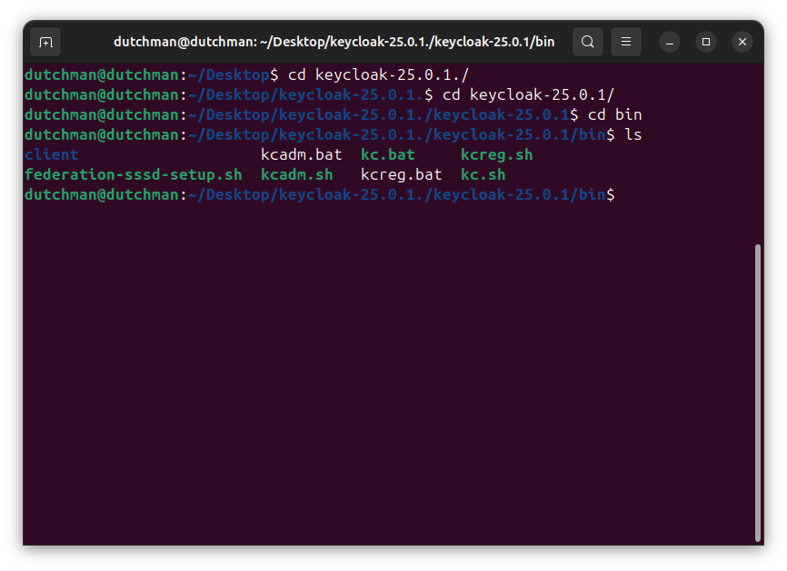
</div>

<div align="center">
    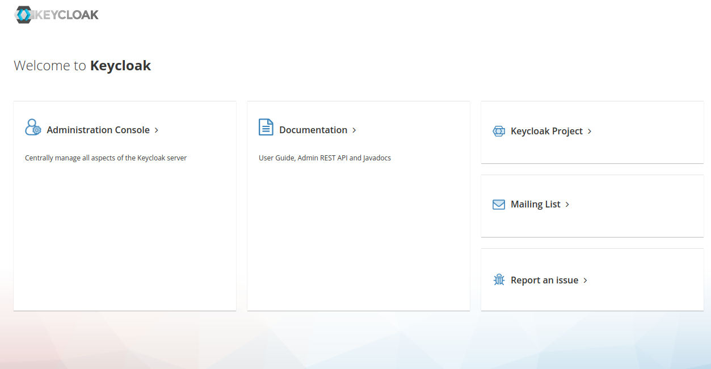
</div>

صفحه‌ی کنسول ادمین این ابزار به شکل زیر است، با استفاده از username و passwordای که داریم، وارد می‌شویم.

<div align="center">
    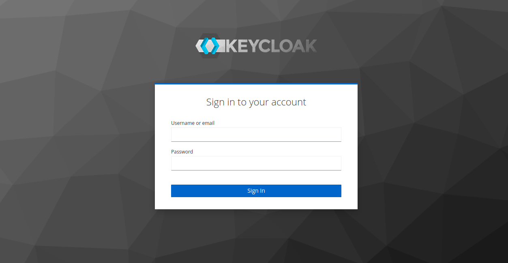
</div>

درنهایت کنسول ادمین به شکل زیر می‌باشد.

<div align="center">
    
</div>

با رفتن به قسمت Realm Settings، می‌توان تنظیمات مربوط به Realm را انجام داد. یک نمونه از این تنظیمات مربوط به Login در عکس زیر آمده است.


<div align="center">
    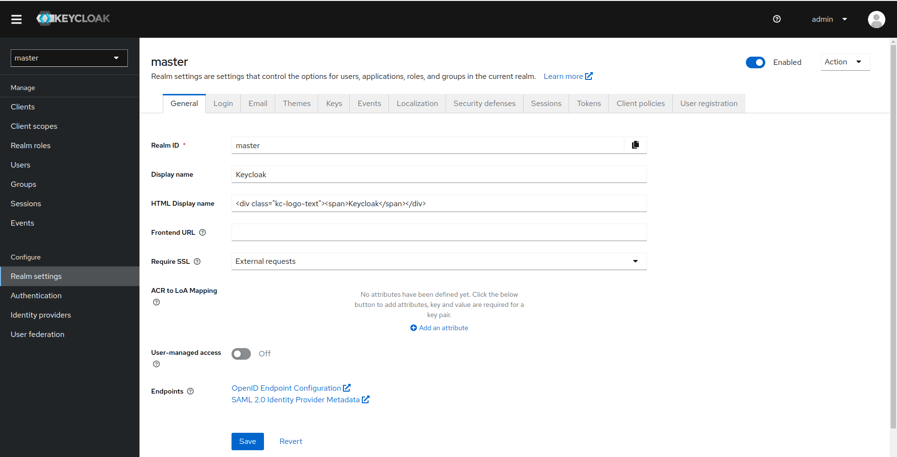
</div>

<div align="center">
    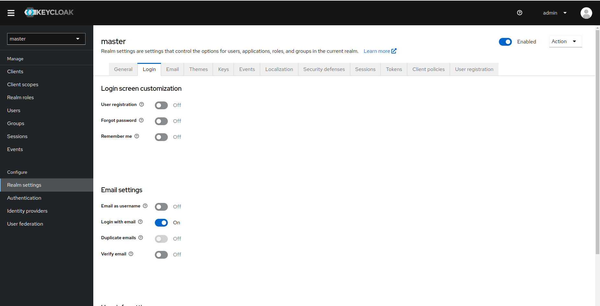
</div>


در ادامه قصد داریم برای یک کاربر، authentication را با استفاده از این ابزار حل کنیم. با رفتن به قسمت Clients، یک Client جدید برای ساختن یک روش Authentication می‌سازیم. ما از OpenID برای این کلاینت استفاده می‌کنیم.

<div align="center">
    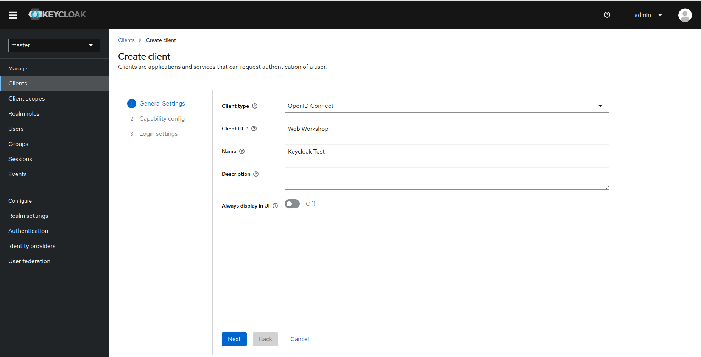
</div>

در قسمت Capability Config, تنها Authentication را روشن می‌کنیم. (می‌توان Autherization را هم نیز روشن کرد اما ما برای تست اولیه تنها از Authentication استفاده می‌کنیم.)

<div align="center">
    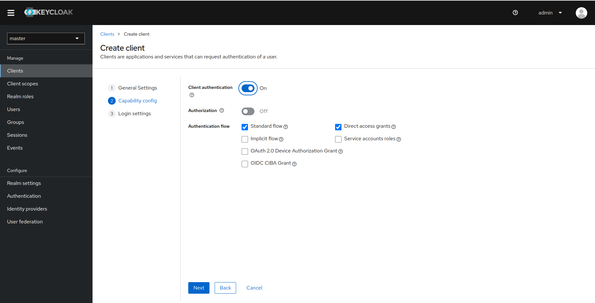
</div>

در قسمت Login Settings, باید مشخص کنیم که چه URLهایی valid هستند برای اینکه به keycloak درخواست بزنند. web origins نیز برای رفع خطاهای مربوط به CORS می‌باشد که ما آن را بر روی `*` یا به عبارتی قبول کردن تمامی originها تنظیم کرده‌ایم.

<div align="center">
    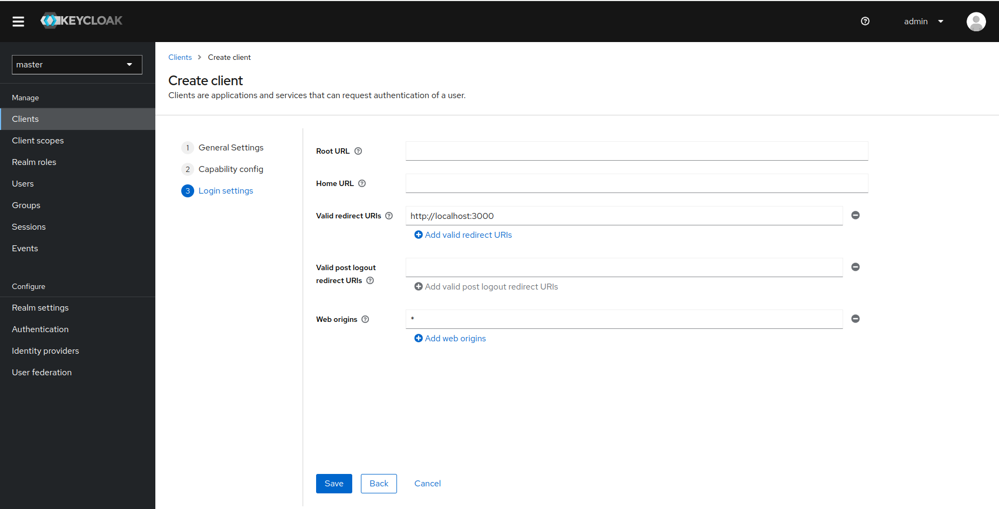
</div>

در نهایت با زدن save، کلاینت ما ساخته می شود. حال که Client ID را داریم، با رفتن به قسمت Credentials می‌توانیم به secrect خود نیز دسترسی داشته باشیم.

<div align="center">
    
</div>

حال به قسمت user رفته و یک کاربر با اطلاعات خواسته شده می‌سازیم تا بتوانیم از این user و اطلاعات آن با استفاده از کلاینتی که ساختیم و از OpenID استفاده می‌کند، بر روی پروتکل REST کار Authentication را برای کاربرمان انجام دهیم. (به صورت Automate شده و با استفاده از keycloak این عمل انجام می‌شود.)

<div align="center">
    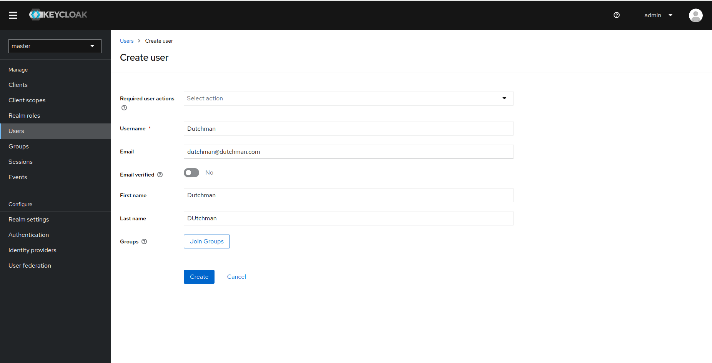
</div>

حال پس از ساخت کاربر، با رفتن به credentials، می‌توانیم برای کاربر password نیز تنظیم نماییم. در عکس زیر همچنین یک آپشن temporary نیز وجود دارد که آن را خاموش کرده‌ایم. این آپشن به این معنی است که زمانی که کاربر برای اولین بار login کرد، باید رمزعبور خود را عوض کند. با خاموش کردن این آپشن دیگر کاربر نیازی نیست که رمزعبور خود را عوض کند.

<div align="center">
    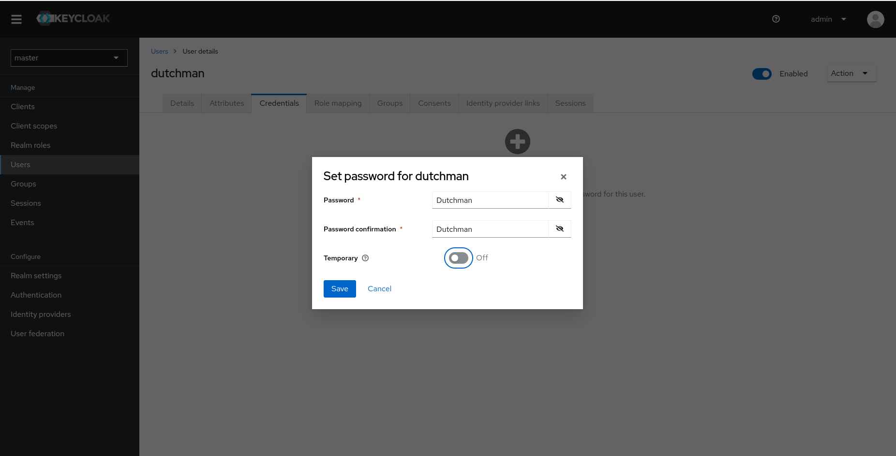
</div>

با رفتن به قسمت Role، می‌توانیم در صورتی که از قبل Roleهایی تعریف کرده‌ایم که هرکدام به نحوی Privacy Policyهای خاصی دارند، در اینجا این Roleها را به کاربر خود assign کنیم. در غیر اینصورت Roleای که به صورت دیفالت در این Realm وجود دارد، استفاده خواهد شد. همچنین با زدن بر روی assign role می‌توانیم باقی Roleها را نیز مشاهده کنیم.

<div align="center">
    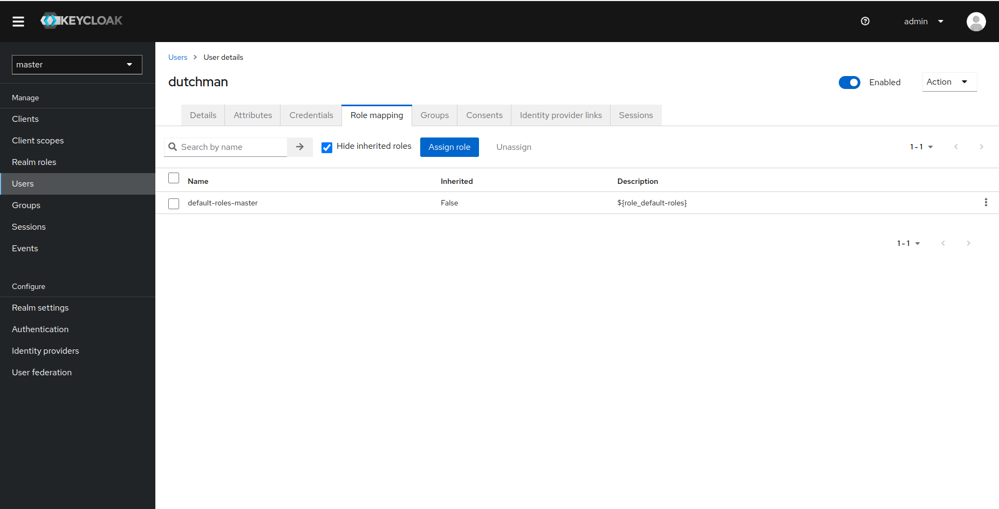
</div>

<div align="center">
    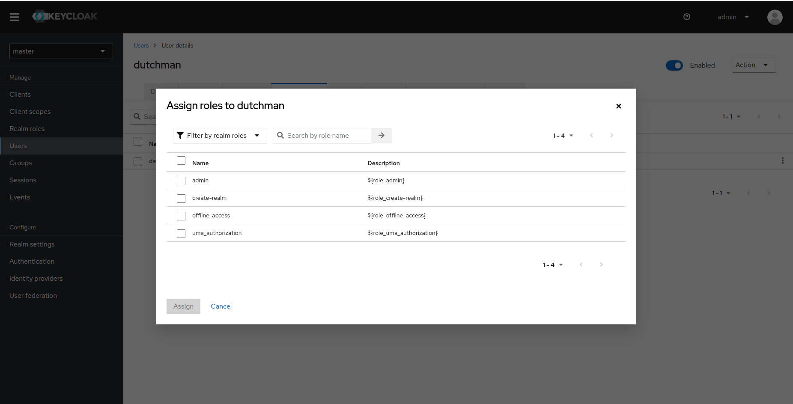
</div>

همچین با رفتن به Group، می‌توانیم برای کاربران گروه‌های متفاوتی ساخته و آن‌ها به آن گروه اضافه کرد.

<div align="center">
    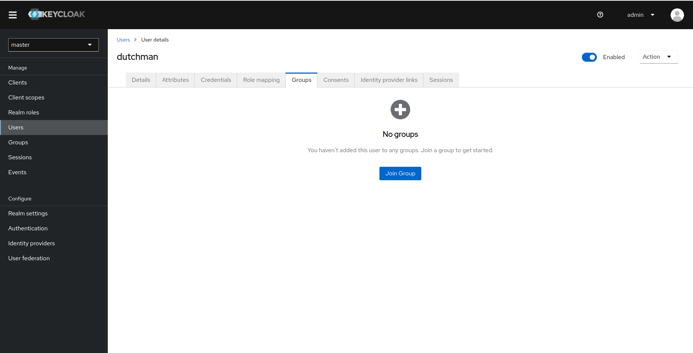
</div>

حال تمامی کارهای موردنیاز برای ساخت کاربر و ساخت یک کلاینت برای Authenticate کاربر را انجام داده‌ایم و می‌توانیم از backend یا server برای تنظیم کردن authenticate با استفاده از keycloak را انجام داده تا کاربر موردنظر بتواند از این طریق authenticate شود.

همچنین در زیر عکسی از providerهای ثانویه‌ای که می‌توان از آن‌ها نیز استفاده کرد آمده است.

<div align="center">
    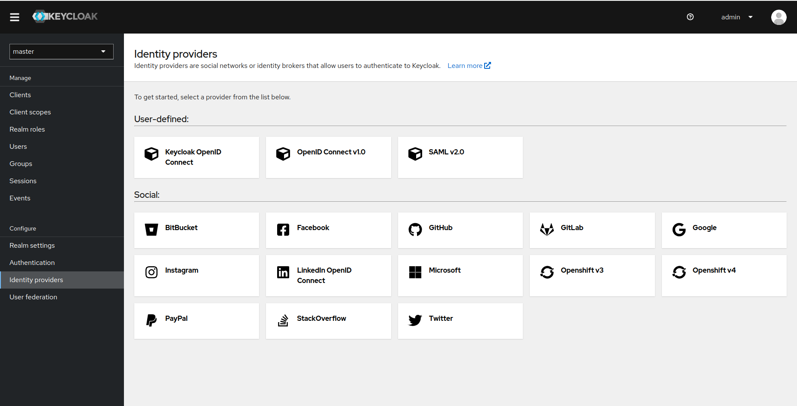
</div>

تا به اینجا توضیحاتی راجع‌به اینکه ابزار keycloak چیست و چه کارایی‌ای دارد و همچین نصب آن را مطرح کردیم. همچنین به سوال اول بحث یعنی اینکه چگونه می‌توان SSO را برای یک کاربر نیز فعال کرد را با استفاده از یک مثال و ساخت کلاینت و کاربر به نمایش گذاشتیم. حال به پیکربندی این ابزار می‌پردازیم.

<div align="center">
    
</div>

مطابق عکس همانگونه که مشخص است، این ابزار با استفاده از message brokerهای متفاوت به providerهای متفاوت متصل می‌شود. این ابزار نیز به یک sotrage نیاز دارد که به آن متصل شود تا stateها را در آن ذخیره کند. مانند لیست کاربران، کلاینت‌ها، Realmها وغیره. این ابزار با استفاده از پروتکل‌های ODIC و SAML نیز موارد مربوط به Single Sign On را انجام می‌دهد.

دقت کنید که Keycloakها می‌توانند به‌هم متصل شده و از داده‌های یکدگیر استفاده کنند. به عبارتی می‌توان چندین instance از یک keycloak را بالا آورد. در عکس این موضوع نیز مشخص شده‌است. همچین این ابزار با استفاده از REST APIها به سرور و کلاینت خارج وصل می‌شود و ارتباط برقرار می‌کند. این سرور و کلاینت برای اینکه با کلاینت خود keycloak اشتباه نشوند، منظور همان‌هایی هستند که با استفاده از کنسول ادمین به این ابزار متصل می‌شوند.
</div>

### رفرنس‌ها

[https://www.linkedin.com/pulse/simplify-user-access-keycloak-single-sign-on-sso-shrivastava/](https://www.linkedin.com/pulse/simplify-user-access-keycloak-single-sign-on-sso-shrivastava/)

[https://www.privacyidea.org/versatile-2fa-single-sign-on-with-keycloak-and-privacyidea/](https://www.privacyidea.org/versatile-2fa-single-sign-on-with-keycloak-and-privacyidea/)

[https://www.youtube.com/watch?v=Ghf8XEB0Z4c](https://www.youtube.com/watch?v=Ghf8XEB0Z4c)

[https://www.keycloak.org/guides#getting-started](https://www.keycloak.org/guides#getting-started)

[https://raw.githubusercontent.com/keycloak/keycloak-quickstarts/latest/kubernetes/keycloak.yaml](https://raw.githubusercontent.com/keycloak/keycloak-quickstarts/latest/kubernetes/keycloak.yaml)
