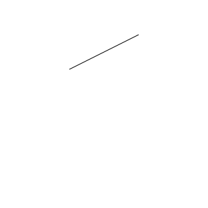

<p align="center">

</p>
<p align="center">
    تحقیق میان ترم برنامه سازی وب، دانشگاه صنعتی شریف
    <br/>
    استاد درس: جناب آقای امید جعفری نژاد
    <br/>
    نویسندگان: رضا صومی، حمیدرضا کلباسی، علی جوانمرد و پارسا صلواتی
</p>

<div dir="rtl">

## مقدمه

در ابتدای به وجود آمدن وب، اینترنت از سرعت خوبی برخوردار نبود و به همین دلیل وب سایت ها مجبور بودند که یا از تصاویر گرافیکی استفاده نکنند یا کیفیت آن ها
را کاهش دهند. اما در بسیاری از تصاویر، به ویژه آن هایی که به صورت واقعی عکس برداری نشده اند و با کامپیوتر ساخته شده اند که
در وب نیز بسیار پر کاربرد هستند، از الگو های خاصی پیروی می کنند و نگهداری آن ها به صورت پیکسل به پیکسل، اصلا بهینه نیست. به همین دلیل ائتلاف وب جهانی 
در سال 1998 شروع به استاندارد سازی یک قالب جدید برای تصاویر به نام svg (تصاویر برداری مقیاس پذیر) کرد که به جای استفاده از پیکسل ها برای نمایش تصویر، از
روابط ریاضی که می توانند اشکال پیچیده را توصیف کنند مثل معادلات خط و خم های بزیه استفاده می کند. به این ترتیب تصاویر حجم کمتری می گیرند و هنگام بزرگنمایی
کردن کیفیت خود را از دست نمی دهند.

بعد از استاندارد شدن svg و پشتیبانی از آن توسط مرورگر های وب، به مرور استقبال از این فرمت تصویر بیشتر شد و نرم افزار هایی صرفا برای ایجاد
و ویرایش تصاویر برداری به وجود آمدند. (مانند adobe Illustrator و Inkscape) و هم چنین قابلیت های بیشتری به این استاندارد افزوده شد. یکی
از این قابلیت های افزوده شده svg animation بود که به تصاویر برداری امکان متحرک شدن و حتی تعامل با ورودی های کاربر را می دهد.

اما کار با svg و svg animation سخت است و api مناسبی در اختیار برنامه نویسان نیست. کتابخانه paper.js یک کتابخانه متن باز برای ایجاد تصاویر
و انیمیشن های برداری در بستر وب است که با الگو گیری از توانایی ها و امکاناتی که تصاویر برداری و انیمیشن های برداری دارند، و هم چنین نرم افزار های
دیگر مانند scriptographer در Adobe Illustrator توانسته است یک رابط کاربری برنامه نویسی با طراحی دقیق، خودسازگار و تمیز را برای ایجاد این تصاویر ارائه
دهد.

## نحوه نصب
برای نصب می توانید از دستورات زیر استفاده کنید
و paperscript و paperjs را نصب کنید

<div dir="ltr">

```
npm install --save-dev paperscript
npm install paper
```

</div>

همچنین می توان از خود سایت نیز این پروژه را دانلود کنید که درون آن مثال های متنوعی نیز وجود دارد.
[paperjs.org/download](http://paperjs.org/download/)
پ

## تعریف

پروژه paper.js یک چارچوب گرافیک برداری متن باز است که روی HTML5 Canvas کار می کند و ویژگی های زیر را داراست:
* یک گراف صحنه که دارای لایه بندی مانند فتوشاپ است.
* نحوه کشیدن را اپتیمایز می کند، بنابراین کاربر می تواند به شیوه دلخواه خودش و بدون در نظر گرفتن پرفورمنس شروع به ترسیم کند.
* رابط کاربری برنامه نویسی با طراحی دقیق و اثبات شده در محصولات جدی دارد.
* زبان PaperScript که افزونه کوچکی روی JavaScript است ولی در عین حال قابلیت های جذابی را برای برنامه نویس اضافه می کند.
* پشتیبانی دست اول از عملیات های ریاضی و تصاویر برداری، که باعث می شود تا تصاویر در زوم های بالا افت کیفیت نداشته باشند.
* انواع و اقسام روش کشیدن خط ها و خم های متنوع.
* قابلیت تنظیم و تعیین مرز دقیق هر آیتم.
* خم های نرم، و قابلیت ساده سازی مسیر ها با رد کردن یک خم ریاضی از چندین نقطه.
* قابلیت ترکیب دو یا چند شکل با اعمال مختلف مثل اجتماع، اشتراک یا تفریق.
 
## مقایسه
* JSXGraph
<p dir="rtl">
JSXGraph ابزار مناسبی برای کشیدن گراف های با معادلات پیچیده ریاضیاتی به صورت دقیق است و بر خلاف paper.js قابلیت انیمیشنی زیادی ندارد.
</p>
    
* Three.js
<p dir="rtl">
Three.js قابلیت های برداری زیادی ندارد و تمرکز بیشتر آن روی شکل دهی اجسام سه بعدی است. به همین دلیل برای ایجاد انیمیشن ها و تصاویر سه
بعدی از Three.js استفاده می شود اما برای ایجاد انیمیشن ها و تصاویر دو بعدی Paper.js امکانات بیشتر و رابط کاربری برنامه نویسی ساده تری دارد.
</p>
   
## مفاهیم اولیه

قبل از شروع به کار با paper.js خوب است تعدادی از مفاهیم را در نظر داشته باشید:

* پروژه (Project): همان عضو ریشه است که تمام المان‌های دیگر زیر آن تعریف شده‌اند. از آن جا که کلمهٔ document از قبل توسط مرورگرها استفاده شده است، از Project استفاده می‌کنیم. در پروژه شما می‌توانید styleهای مربوط به المان‌هایی که جدید ساخته می‌شوند را تعریف کنید.
	
* دید (View): یک شیٔ View، یک المان Html را در خود جای می‌دهد و وظیفهٔ تعامل با کاربر از طریق موس و کیبورد را به عهده دارد. به عنوان مثال با استفاده از آن می‌توانید در view، بالا و پایین بروید (اسکرول) و می‌توانید ببینید در کدام مختصات از پروژه هستید (یعنی الان کدام قسمت صفحه را می‌بینید).
* حوزه (Scope): هر scope، پروژه و view مخصوص به خود را دارد که شما می‌توانید از آن استفاده کنید. به عنوان مثال کد زیر را ببینید:

	```JS
	<script type="text/paperscript" canvas="myCanvas">
	    // This code is executed within the scope of the project and view associated with the canvas element with id "myCanvas"
	    var path = new Path();
	    path.strokeColor = 'black';
	    path.add(new Point(30, 30));
	    path.add(new Point(70, 70));
	</script>
	```
	
در این مثال، تکه کد در حوزهٔ پروژه و دید مربوط به المان myCanvas اجرا می‌شود که در آن یک Path ساخته می‌شود و دو نقطه به آن اضافه می‌شود.
* ابزار (Tool): با استفاده از Tool شما با کاربر تعامل می‌کنید و با استفاده از View آن را نمایش می‌دهید.
	```JS
	var view = new View(document.getElementById('myCanvas'));
	var tool = new Tool();
	tool.onMouseDown = function(event) {
	    var path = new Path();
	    path.strokeColor = 'black';
	    path.add(event.point);
	    view.center = event.point;
	    view.zoom = 2;
	}
	
	view.draw();
	```
	
	در این مثال، view وظیفهٔ نمایش را دارد و tool تعریف شده، با کاربر تعامل می‌کند. هر tool به هنگام تعریف به صورت خودکار به آخرین view فعال وصل می‌شود.
	
## آموزش مقدماتی
برای شروع به کار با paper.js‌ دانش اولیه از هندسه و مختصات لازم است. که در این بخش به طور مختصر اشاره شده است.
* کلاس Point
		<br>
	میتوانیم با داشتنن دو مختصات x و y  یک نقطه بسازیم و از آن برای ایجاد شکل و مسیر استفاده کنیم.
```JS
<div dir="rtl">
var myPoint = new Point(10, 20); 
console.log(myPoint); // { x: 10, y: 20 }
</div>
```
با داشتن نقاط میتوان از بین آن ها یک منحنی رد کرد. ابتدا کلاس Path را ایجاد کرده سپس نقاط را با تابع add اضافه میکنیم. 
```JS
<div dir="rtl">
var myPath = new Path();
myPath.add(myPoint);
</div>
```	
در مثال زیر ابتدا یک نقطه را ایجاد میکنیم. سپس نقطه ی دوم را به گونه ای تعریف میکنیم که وی×گی های آن را به ارث برد.
```JS
<div dir="rtl">
var firstPoint = new Point(20, 40);
var secondPoint = new Point(firstPoint);
console.log(secondPoint); // { x: 20, y: 40 }

secondPoint.y = 20;
console.log(secondPoint); // { x: 20, y: 20 }

// Note that firstPoint has not changed:
console.log(firstPoint); // { x: 20, y: 40 }
</div>
```
* کلاس Size
	<br>
برای مشخص کردن سایز شکل به مقدار طول و عرض آن نیاز داریم.
```JS
<div dir="rtl">
var mySize = new Size();
console.log(mySize); // { width: 0, height: 0 }

mySize.width = 10;
mySize.height = mySize.width + 10;
console.log(mySize); // { width: 10, height: 20 }
</div>
```
* ایجاد یک شکل
		<br>
در مثال های زیر دو روش ساده برای ایجاد شکل مستطیل داریم.
در روش اول نقطهی بالا سمت چپ مستطیل مشخص میشود سپس سایز آن را مشخص میکنیم. در انتها با این دو وی×گی مستطیل را میسازیم.

```JS
<div dir="rtl">
var topLeft = new Point(10, 20);
var rectSize = new Size(200, 100);
var rect = new Rectangle(topLeft, rectSize);
console.log(rect); // { x: 10, y: 20, width: 200, height: 100 }
console.log(rect.point); // { x: 10, y: 20 }
console.log(rect.size); // { width: 200, height: 100 }
</div>
```
در مثال زیر مستطیل را به یک باره هنگام ساختن مقدار دهی کرده ایم.
```JS	
<div dir="rtl">
var rect = new Rectangle(10, 20, 200, 100);
console.log(rect); // { x: 10, y: 20, width: 200, height: 100 }
</div>
```
	
## آموزش دو بعدی


برای شروع به کار با paper.js می توانید این فایل html را بسازید:
```html
<!DOCTYPE html>
<html>
<head>
<!-- Load the Paper.js library -->
<script type="text/javascript" src="js/paper.js"></script>
<!-- Define inlined PaperScript associate it with myCanvas -->
<script type="text/paperscript" canvas="myCanvas">
    // Your code here. An example:
	// Create a Paper.js Path to draw a line into it:
	var path = new Path();
	// Give the stroke a color
	path.strokeColor = 'black';
	var start = new Point(100, 100);
	// Move to start and draw a line from there
	path.moveTo(start);
	// Note the plus operator on Point objects.
	// PaperScript does that for us, and much more!
	path.lineTo(start + [ 100, -50 ]);
</script>
</head>
<body>
	<canvas id="myCanvas" resize></canvas>
</body>
</html>
```
اگر کد جاوااسکریپت درون خط بالا را در فایل js/myScript.js ذخیره کنیم کد بالا را میتوان به صورت زیر نوشت 

```html
<!DOCTYPE html>
<html>
<head>
<!-- Load the Paper.js library -->
<script type="text/javascript" src="js/paper.js"></script>
<!-- Load external PaperScript and associate it with myCanvas -->
<script type="text/paperscript" src="js/myScript.js" canvas="myCanvas">
</script>
</head>
<body>
	<canvas id="myCanvas" resize></canvas>
</body>
</html>
```

ویژگی های که میخوایم در paper.js استفاده کنیم در فایل جداگانه myscript نوشته میشوند
src="URL" آدرس نسبی فایل PaperScript نسبت به کد html  برای لود خود فایل paperمی باشد


توصیه می شود که در هر مثال، کد هدف را خودتان بنویسید یا این که کد داده شده را تست کنید و پارامتر های آن را
تغییر دهید تا فرایند یادگیری بهتری داشته باشید.

## ایجاد تصاویر

بیایید با کد ساده ای که در قسمت بالا داشتیم شروع کنیم:

```JS
// Create a Paper.js Path to draw a line into it:
var path = new Path();
// Give the stroke a color
path.strokeColor = 'black';
var start = new Point(100, 100);
// Move to start and draw a line from there
path.moveTo(start);
// Note the plus operator on Point objects.
// PaperScript does that for us, and much more!
path.lineTo(start + [ 100, -50 ]);
```


	
همانطور که در بالا مشاهده میکنید با قرار دادن فایل scrpit بالا، یک خط از مختصات (100و100) به آدرس (-50و200) رسم میکند.
	دقت کنید مختصات(0و0) در بالا ی صفحه سمت چپ قرار دارد.

```JS
var myPath = new Path();
myPath.strokeColor = 'black';
myPath.add(new Point(0, 0), new Point(100, 50));

// insert a segment between the two existing
// segments in the path:
myPath.insert(1, new Point(30, 40));
```
	
در قسمت بالا مختصات 3 نقطه داده شده است و از بین آن ها یک خط گزراندیم.

<div dir="ltr">

</div>

<br>
در این قسمت با دو تایع آشنا میشویم که در رسم انحنا کمک بسیاری به ما میکنند.
path.smooth: یک مسیر را با تغییر انحنای خط  بدون افزودن یا حذف نقاط ، خط را
	هموار می کند
<br>
. path.simplify: یک مسیر را با تجزیه و تحلیل نقاط مسیر آن و جایگزینی آن با مجموعه ای بهینه تر از بخش ها، هموار می کند،استفاد هاز این تابع این مزیت را دارد که مصرف حافظه را کاهش می دهد و سرعت ترسیم را افزایش می دهد.
<br>
	هموارسازی مسیرها Paper.js به شما امکان می دهد با استفاده از تابع path.smooth () مسیرها را به صورت خودکار هموار کنید. این تابع مقادیر بهینه را برای دسته‌های نقاط یک خط محاسبه می‌کند تا منحنی‌هایی ایجاد کند که به آرامی در آنها جریان داشته باشد. بخش ها جابه جا نمی شوند و تنظیمات بخش های مسیر نادیده گرفته می شوند. در مثال زیر یک مربع ایجاد می کنیم، یک کپی از آن ایجاد می کنیم و شکل کپی را smooth می کنیم. همانطور که می بینید، فقط انحنای مسیر تغییر می کند. دقت شود نقاط اصلی خط بدون تغییر باقی می مانند.
<br><br>
	
```JS
var path = new Path();
path.strokeColor = 'black';
path.add(new Point(30, 75)); 
path.add(new Point(30, 25)); 
path.add(new Point(80, 25));
path.add(new Point(80, 75));
path.closed = true;

// Select the path, so we can see its handles:
path.fullySelected = true;

// Create a copy of the path and move it 100pt to the right:
var copy = path.clone();
copy.fullySelected = true;
copy.position.x += 100;

// Smooth the segments of the copy:
copy.smooth();
``` 
<div dir="ltr">

</div>


در شکل زیر ابتدا یک دایره ایجاد میکنیم. سپس یکی از نقاط آن را با تابع removeSegment حذف میکنیم. 
    
```JS
var myCircle = new Path.Circle(new Point(100, 70), 50);
myCircle.strokeColor = 'black';
myCircle.selected = true;

myCircle.removeSegment(0);
```
<div dir="ltr">

</div>


برای رسم یک چند ضلعی از دستور new Path.RegularPolygon(center, sides, radius) استفاده میکنیم که در آن ابتدا مختصات مرکز را مشخص میکنیم سپس اندازه هر ضلع و درآخر شعاع این چند ضلعی را مشخص میکنیم.
    
```JS
// Create a triangle shaped path 
var triangle = new Path.RegularPolygon(new Point(80, 70), 3, 50);
triangle.fillColor = '#e9e9ff';
triangle.selected = true;

// Create a decagon shaped path 
var decagon = new Path.RegularPolygon(new Point(200, 70), 10, 50);
decagon.fillColor = '#e9e9ff';
decagon.selected = true;
```
<div dir="ltr">

 </div>
   
در قسمت زیر یک مثلث ایجاد کرده ایم و با دستور fillColor آن را به رنگ قرمز درآورده ایم.
```JS
var myPath = new Path({
	segments: [[40, 115], [80, 180], [200, 20]],
	selected: true
});

myPath.fillColor = '#ff0000';
```
<div dir="ltr">
 
</div>

در قسمت زیر برای ایجاد خط چین مقدار dashArray را تغییر میدهیم.اولین ورودی این تابع اندازه هر خط چین است و مقدار دوم فاصله ی هر خط از خط بعدی
```JS
var myPath = new Path({
	segments: [[40, 115], [80, 180], [200, 20]],
	selected: true
});

myPath.strokeColor = '#ff0000';
myPath.strokeWidth = 5;
myPath.strokeCap = 'round';

myPath.dashArray = [10, 12];
```
<div dir="ltr">

</div>

در مثال زیر همه موارد جدید ایجاد شده به طور خودکار ویژگی های سبک انحنای فعلی را همانطور که در رابط Illustrator تعریف شده است دریافت می کنند. همچنین می‌توانیم با استفاده از این کدها را از طریق تابع currentStyle تغییر دهیم.
شی currentStyle که دو ویژگی fillColor و strokeColor آن را می توان تغییر داد.  

مثال زیر ویژگی فعلی project را تغییر می دهد، سپس منحنی ایجاد می کند که آن ویژگی ها را به ارث می برد. سپس strokeWidth و fillColor را تغییر می دهد.
    
```JS
// Change the current style of the project:
project.currentStyle = {
	strokeColor: '#000000',
	fillColor: '#ff0000',
	strokeWidth: 3
};

// This path will inherit the styles we just set:
var firstPath = new Path.Circle({
	center: [100, 100],
	radius: 50
});

// Change the current stroke width and fill color of the project:
project.currentStyle.strokeWidth = 8;
project.currentStyle.fillColor = 'green';

// This path will have a green fill and have a strokeWidth of 8pt:
var secondPath = new Path.Circle({
	center: [250, 100],
	radius: 50
});
```
<div dir="ltr">

</div>

در مثال زیر کار با تابع path.simplify را یاد میگیریم 
این تابع دارای یک دامنه ی تغییرات است که حداکثر فاصله ای را که الگوریتم simplify مجاز است از مسیر اصلی منحرف کند را مشخص می کند. این مقدار به طور پیش فرض روی 2.5 تنظیم شده است. با تنظیم آن روی مقدار کمتر، مسیر صحیح تری اما با نقاط قطعه بیشتر ایجاد می شود، به نحوی مسیر هموار تر میشود. تنظیم آن بر روی مقدار بالاتر منجر به منحنی صاف تر و نقاط قطعه کمتر می شود، اما شکل مسیرانحراف بیشتری از مسیر اصلی خواهد داشت.
```JS
var path;

var textItem = new PointText(new Point(20, 30));
textItem.fillColor = 'black';
textItem.content = 'Click and drag to draw a line.';

function onMouseDown(event) {
	// If we produced a path before, deselect it:
	if (path) {
		path.selected = false;
	}

	path = new Path();
	path.strokeColor = 'black';
	
	// Select the path, so we can see its segment points:
	path.fullySelected = true;
}
function onMouseDrag(event) {
	// Every drag event, add a point to the path at the current
	// position of the mouse:
	path.add(event.point);
	
	textItem.content = 'Segment count: ' + path.segments.length;
}

function onMouseUp(event) {
	var segmentCount = path.segments.length;
	
	// When the mouse is released, simplify it:
	path.simplify();
	
	// Select the path, so we can see its segments:
	path.fullySelected = true;
	
	var newSegmentCount = path.segments.length;
	var difference = segmentCount - newSegmentCount;
	var percentage = 100 - Math.round(newSegmentCount / segmentCount * 100);
	textItem.content = difference + ' of the ' + segmentCount + ' segments were removed. Saving ' + percentage + '%';

}
```


    

## ایجاد انیمیشن ها

برای ایجاد انیمیشن از onFrame handler استفاده می شود. زمانی که این تابع فراخوانی می شود در هر ثانیه 60 بار توسط paper.js اجرا می شود و پس از هر بار veiw دوباره render می شود. نحوه فراخوانی این تابع را در قطعه کد زیر مشاهده می کنید. 

<div dir="ltr">
    
```
function onFrame(event) {
	// Your animation code goes in here
}
```
    
</div> 

تابع onFrame به عنوان ورودی یک event object دریافت می کند که اطلاعاتی درباره event می دهد:
* متغیر event.count تعداد دفعاتی که frame event به اصطلاح fired شده باشد.
* متغیر event.time کل زمان طی شده از اولین frame event به ثانیه
* متغیر event.delta زمان سپری شده از آخرین frame event 
معمولا این مقادیر برای ساخت انیمیشن استفاده نمی شوند. در قطعه کد زیر نحوه دسترسی به هرکدام را مشاهده می کنید.

<div dir="ltr">
    
```
function onFrame(event) {
	// the number of times the frame event was fired:
	console.log(event.count);

	// The total amount of time passed since
	// the first frame event in seconds:
	console.log(event.time);

	// The time passed in seconds since the last frame event:
	console.log(event.delta);
}
```
    
</div> 


در ادامه مثال هایی را بررسی خواهیم کرد. در قطعه کد زیر یک مربع ساخته شده و در تابع onframe این شکل سه درجه rotate روی آن در هر 1/60 ثانیه صورت می گیرد. با افزایش متغیر زاویه سرعت چرخش مربع نیز افزایش پیدا می کند.


<div dir="ltr">
    
```
// Create a rectangle shaped path with its top left point at
// {x: 75, y: 75} and a size of {width: 75, height: 75}
var path = new Path.Rectangle({
	point: [75, 75],
	size: [75, 75],
	strokeColor: 'black'
});

function onFrame(event) {
	// Each frame, rotate the path by 3 degrees:
	path.rotate(3);
}
```
    
</div> 


در قطعه کد زیر یک دایره ساخته شده است و در onFrame handler در هر 1/60 ثانیه مقدار hue یا همان رنگ را یک واحد اضافه می شود. لازم به ذکر است از مقدار صفر به معنای قرمز شروه شده و تا آبی پر رنگ رفته و در 360 دوباره به قرمز برمی گردد.    

<div dir="ltr">
    
```
// Create a circle shaped path at the center of the view,
// with a radius of 70:
var path = new Path.Circle({
	center: view.center,
	radius: 70,
	fillColor: 'red'
});

function onFrame(event) {
	// Each frame, change the fill color of the path slightly by
	// adding 1 to its hue:
	path.fillColor.hue += 1;
}
```
    
</div> 


 

در کد زیر ابتدا یک text ساخته می شود و در onFrame مکان این text به destination تغییر میکند و چون در فواصل زمانی کم آپدیت صورت میگیرد تغییر به صورت پیوسته بوده و به صورت گسسته با چشم دیده نمی شود. در اینجا در هر فریم به اندازه 1/30 کل فاصله طی می شود و با افزایش این عدد حرکت از پیوسته به گسسته تغییر خواهد کرد. و هرگاه فاصله کمتر از 5 شد دوباره destination به صورت تصادفی نقطه ای از صفحه مقداردهی می شود.


<div dir="ltr">
    
```
// Create a centered text item at the center of the view:
var text = new PointText({
	point: view.center,
	justification: 'center',
	fontSize: 30,
	fillColor: 'white'
});

// Define a random point in the view, which we will be moving
// the text item towards.
var destination = Point.random() * view.size;

function onFrame(event) {
	// Each frame, move the path 1/30th of the difference in position
	// between it and the destination.
	
	// The vector is the difference between the position of
	// the text item and the destination point:
	var vector = destination - text.position;
	
	// We add 1/30th of the vector to the position property
	// of the text item, to move it in the direction of the
	// destination point:
	text.position += vector / 30;
	
	// Set the content of the text item to be the length of the vector.
	// I.e. the distance it has to travel still:
	text.content = Math.round(vector.length);
	
	// If the distance between the path and the destination is less
	// than 5, we define a new random point in the view to move the
	// path to:
	if (vector.length < 5) {
		destination = Point.random() * view.size;
	}
}
```
    
</div>


در قطعه کد زیر 150 دایره ایجاد شده و با استفاده از symbol در جایی از صفحه قرار می گیرد.(ابتدا دایره به سیمبل bind می شود و با دستور symbol.place(center) یک دایره به symbol اضافه می شود) سپس در onFrame handler در یک لوپ دایره ها از طریق لایه های اکتیو project گرفته می شود (متغیرهای موجود در symbol) و مولفه x آنها در صفحه به اندازه 1/20 عرض هرکدام افزایش پیدا می کند و پس از طی کردن صفحه دوباره از سمت چپ سروع به حرکت می کنند. 


<div dir="ltr">
    
```
// The amount of circles we want to make:
var count = 150;

// Create a symbol, which we will use to place instances of later:
var path = new Path.Circle({
	center: [0, 0],
	radius: 10,
	fillColor: 'white',
	strokeColor: 'black'
});

var symbol = new Symbol(path);

// Place the instances of the symbol:
for (var i = 0; i < count; i++) {
	// The center position is a random point in the view:
	var center = Point.random() * view.size;
	var placedSymbol = symbol.place(center);
	placedSymbol.scale(i / count);
}

// The onFrame function is called up to 60 times a second:
function onFrame(event) {
	// Run through the active layer's children list and change'
	// the position of the placed symbols:
	for (var i = 0; i < count; i++) {
		var item = project.activeLayer.children[i];
		
		// Move the item 1/20th of its width to the right. This way
		// larger circles move faster than smaller circles:
		item.position.x += item.bounds.width / 20;

		// If the item has left the view on the right, move it back
		// to the left:
		if (item.bounds.left > view.size.width) {
			item.position.x = -item.bounds.width;
		}
	}
}
```
    
</div> 


قطعه کد زیر یک path با width خاکستری به اندازه 30 ایجاد کرده 5 نقطه روی آن مشخص می کند و به segment های متفاوت تبدیل می شوند و در onFrame یک لوپ روی این 5 عنصر زده می شود بخش مربوطه را دریافت می کند. در ادامه بر اساس event.time (کل زمانی که از اولین فریم تا به اینجا طی شده است) مقدار sin را دریافت کرده و برای هر نقطه این مقدار را در حداکثر ارتفاع مجاز ضرب کرده تا ارتفاع جدید بدست آید. لازم به ذکر است چون به صورت ترتیبی اجرا می شوند مقدار sin برای دو نقطه کنار هم یکسان نبوده و ارتفاع شان به یک میزان تغییر نمی کند و به صورت سینوسی این کار صورت می گیرد.  


<div dir="ltr">
    
```
// The amount of segment points we want to create:
var amount = 5;

// The maximum height of the wave:
var height = 60;

// Create a new path and style it:
var path = new Path({
	// 80% black:
	strokeColor: [0.8],
	strokeWidth: 30,
	strokeCap: 'square'
});

// Add 5 segment points to the path spread out
// over the width of the view:
for (var i = 0; i <= amount; i++) {
	path.add(new Point(i / amount, 1) * view.size);
}

// Select the path, so we can see how it is constructed:
path.selected = true;

function onFrame(event) {
	// Loop through the segments of the path:
	for (var i = 0; i <= amount; i++) {
		var segment = path.segments[i];

		// A cylic value between -1 and 1
		var sinus = Math.sin(event.time * 3 + i);
		
		// Change the y position of the segment point:
		segment.point.y = sinus * height + 100;
	}
	// Uncomment the following line and run the script again
	// to smooth the path:
	// path.smooth();
}
```
    
</div>  


## تعامل با کاربر

ماوس:

تابع های mouse handler یک event دریافت می کنند که اطلاعاتی در رابطه با رخدادهای mouse می دهد که در ادامه بررسی خواهیم کرد.

در قطعه کد زیر هنگام برداشتن mouse، آخرین مکانی که mouse کلیک شده بوده را با event.downPoint می گیرد و مکانی که در حال حاضر mouse رها شده است را نیز می گیرد و خطی بین این دو رسم می کند.
<div dir="ltr">
    
```
function onMouseUp(event) {
	// Create a path:
	var path = new Path();

	// Add the mouse down position:
	path.add(event.downPoint);

	// Add the mouse up position:
	path.add(event.point);
}
```
    
</div>
خروجی کد بالا را در پایین مشاهده می کنید.


می توان یک خط را نیز به صورت پیوسته کشید که کد زیر این کار را انجام می دهد. onMouseDrag هر زمانی که وکتور delta یک واحد شود فراخوانی شده و این نقطع را به path اضافه می کند (هرچه mindistance کمتر باشد خطوط پیوسته تر خواهند بود). یک نمونه خروجی پایین کد نمایش داده شده است. 

<div dir="ltr">
    
```
// The minimum distance the mouse has to drag
// before firing the next onMouseDrag event:
tool.minDistance = 1;

var path;

function onMouseDown(event) {
	// Create a new path and give it a stroke color:
	path = new Path();
	path.strokeColor = '#00000';

	// Add a segment to the path where
	// you clicked:
	path.add(event.point);
}

function onMouseDrag(event) {
	// Every drag event, add a segment
	// to the path at the position of the mouse:
	path.add(event.point);
}
```
    
</div>


متغیر tool.mindistance برابر 10 قرار داده شده است به این معنی که هنگامی onMouseDrag فراخوانی شود که cursor mouse حداقل 10pt جابجا شده باشد. event.delta وکتور بین مکان حال حاضر mouse و آخرین مکان mouse است که این تابع فراخوانی شده است. سپس زاویه وکتور 90 درجه تغییر داده شده و طول وکتور برابر 5 قرار داده می شود که خروجی را در پایین کد مشاهده می کنید.
<div dir="ltr">
    
```
// The mouse has to be moved at least 10 pt
// before the next onMouseDrag event is called:
tool.minDistance = 10;

function onMouseDrag(event) {
	var path = new Path();
	path.strokeColor = 'black';
	var vector = event.delta;

	// rotate the vector by 90 degrees:
	vector.angle += 90;

	// change its length to 5 pt:
	vector.length = 5;
	
	path.add(event.middlePoint + vector);
	path.add(event.middlePoint - vector);
}
```
    
</div>


کد زیر همانند گذشته از delta استفاده کرده و آن را 90 درجه چرخانده است و علاوه یر آن دو خط دیگر از top و bottom آن خط رسم کرده است که بسته به سرعت تغییر می توان فاصله آن حداکثر 45 و حداقل 10 واحد با خط اولیه باشد.

<div dir="ltr">
    
```
tool.minDistance = 10;
tool.maxDistance = 45;

var path;

function onMouseDown(event) {
	path = new Path();
	path.strokeColor = '#00000';
	path.selected = true;

	path.add(event.point);
}

function onMouseDrag(event) {
	var step = event.delta;
	step.angle += 90;

	var top = event.middlePoint + step;
	var bottom = event.middlePoint - step;
	
	var line = new Path();
	line.strokeColor = '#000000';
	line.add(top);
	line.add(bottom);

	path.add(top);
	path.insert(0, bottom);
}
```
    
</div>


همچنین اگر mindistance ثبت نشود در فاصله زمانی مشخص با تغییر مکان mouse این تابع فراخوانی می شود که با event.delta.length می توان سرعت تغییر mouse را متوجه شد و event.middlepoint به معنای وسط وکتور delta است. خروجی کد را در پایین کد مشاهده می کنید.

    
<div dir="ltr">
    
```
function onMouseDrag(event) {
	var radius = event.delta.length / 2;
	var circle = new Path.Circle(event.middlePoint, radius);
	circle.fillColor = 'black';
}
```
    
</div>


کد براش و خروجی را نیز در پایین مشاهده می کنید.


<div dir="ltr">
    
```
tool.minDistance = 10;
tool.maxDistance = 45;

var path;

function onMouseDown(event) {
	path = new Path();
	path.fillColor = {
		hue: Math.random() * 360,
		saturation: 1,
		brightness: 1
	};

	path.add(event.point);
}

function onMouseDrag(event) {
	var step = event.delta / 2;
	step.angle += 90;
	
	var top = event.middlePoint + step;
	var bottom = event.middlePoint - step;
	path.add(top);
	path.insert(0, bottom);
	path.smooth();
}

function onMouseUp(event) {
	path.add(event.point);
	path.closed = true;
	path.smooth();
}
```
    
</div>


کیبرد:

برای دریافت اطلاعات key ثبت شده در کیبورد از onKeyDown و onKeyUp استفاده می شود. 
در کد زیر با فشردن و نگه داشتن یک کلید keyboard تابع onKeyDown فراخوانی شده و تا زمانی که نگه داشته شده است پیام موجود در این تابع را مشاهده خواهیم کرد و بلافاصله پس از برداشتن کلید تابع onKeyUp فراخوانی می شود.

<div dir="ltr">
    
```
// Create a centered text item at the center of the view:
var text = new PointText({
	point: view.center,
	content: 'Click here to focus and then press some keys.',
	justification: 'center',
	fontSize: 15
});

function onKeyDown(event) {
	// When a key is pressed, set the content of the text item:
	text.content = 'The ' + event.key + ' key was pressed!';
}

function onKeyUp(event) {
	// When a key is released, set the content of the text item:
	text.content = 'The ' + event.key + ' key was released!';
}
```
    
</div>

خروجی کد بالا را در پایین مشاهده می کنید.


کد دیگری را در پایین مشاهده می کنید که یک path ساخته و در هر مرحله با فشردن کلید های awsd به چپ بالا پایین و راست حرکت می کنیم.
step طول حرکت بوده و در ابتدا از مقدار موجود در متغیر position شروع به حرکت می کنیم. 
<div dir="ltr">
    
```
// The starting position of the line
var position = new Point(100, 100);

// The amount we will move when one of the keys is pressed:
var step = 10;

var path = new Path();
path.strokeColor = 'black';
path.add(position);

function onKeyDown(event) {
	if(event.key == 'a') {
		position.x -= step;
	}

	if(event.key == 'd') {
		position.x += step;
	}

	if(event.key == 'w') {
		position.y -= step;
	}

	if(event.key == 's') {
		position.y += step;
	}
	path.add(position);
}
```
    
</div>

خروجی کد بالا را در پایین مشاهده می کنید.


## استفاده در Node js

کتاب خانه Paper js در ابتدا صرفا برای استفاده در مرورگر وب طراحی شده بود اما با گسترش استفاده از آن کم کم نیاز برای استفاده
خارج از محیط مرورگر وب نیز به آن پیدا شد. هم اکنون شما می توانید با استفاده از آن در Node js بدون مرورگر و رابط کاربری، تصاویر
را تولید کنید و آن ها را به فرمت های svg و png خروجی بگیرید. این کار می تواند به لود شدن سریع تر صفحات وب کمک کند و یا برای کاربرد های
کاملا نامرتبط به وب مفید باشد.

برای استفاده از این کتاب خانه در Node js کافی است که علاوه بر نصب بسته `paper` بسته `paper-jsdom` را نیز نصب کنید. سپس می توانید
به صورت عادی از کتاب خانه در محیط nodejs استفاده کنید. مثال زیر یکی از نمونه های اول مطرح شده در آموزش است که این بار خارج از مرورگر وب
اجرا می شود:

```JS
import paper from "paper-jsdom";
import { writeFile } from "fs/promises";

const { Path, Point } = paper;

var size = new paper.Size(300, 300)
paper.setup(size);
var rect = new Path.Rectangle(0, 0, 300, 300);
rect.fillColor = '#ffffff';

// Create a Paper.js Path to draw a line into it:
var path = new Path();
// Give the stroke a color
path.strokeColor = '#000000';
var start = new Point(100, 100);
// Move to start and draw a line from there
path.moveTo(start);
// Note the plus operator on Point objects.
// PaperScript does that for us, and much more!
path.lineTo(start.add([ 100, -50 ]));

var svg = paper.project.exportSVG({asString:true});
await writeFile('result.svg', svg);
```

توجه کنید که در محیط Nodejs شما به قابلیت های PaperScript دسترسی ندارید و برای مثال همان طور که در نمونه کد بالا می بینید باید از
`start.add([100, -50])`
به جای
`start + [100, -50]`
استفاده کنید.

## جمع‌بندی

این، یک کتاب‌خانهٔ قدرتمند در زمینهٔ vector graphics است که بر پایهٔ Canvas در HTML5 نوشته شده است. یکی از قابلیت‌های اصلی این کتاب‌خانه، اجرای حوزه‌ای (scoped) است که به شما اجازه می‌دهد به صورت همزمان و در یک صفحه، روی پروژه‌ها و دیدهای مختلف کار کنید. هر اسکریپت Paper.js برای خود یک حوزه دارد.

یک قابلیت دیگر از Paper.js استفاده از «item»ها است. itemها عناصر پایه‌ای نمایش برداری هستند و شامل مواردی مثل متن، دایره و مسیر می‌شوند. هر item قابلیت‌ها و ویژگی‌های مخصوی به خود را دارد که در پروژه از آن استفاده می‌شود.

همینطور قابلیت "Tool" نیز وجود دارد که با آن می‌توان با کاربر از طریق موس و کیبورد تعامل کرد. به عنوان مثال از طریق نقاشی کشیدن، انتخاب کردن و یا ایجاد تغییر.

و در نهایت paper.js از طریق view، یک canvas در صفحه را مدل می‌کند که برای نمایش استفاده می‌شود و قابلیت‌هایی مثل بزرگ‌نمایی، تغییر اندازه و اسکرول دارد.

بنابراین Paper.js، یک کتاب‌خانهٔ منعطف در زمینهٔ vector graphics در مرورگر است که API ساده و شهود‌ی‌ای دارد و به کاربر اجازهٔ رسم کردن اشکال مختلف را می‌دهد.

</div>
